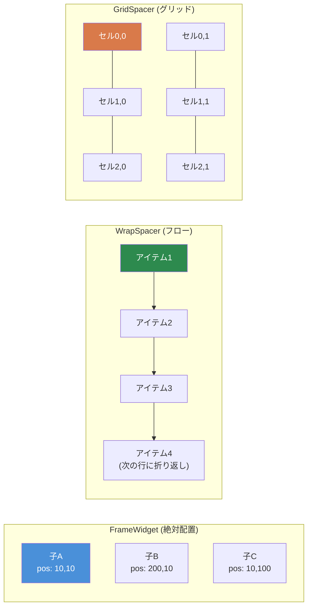
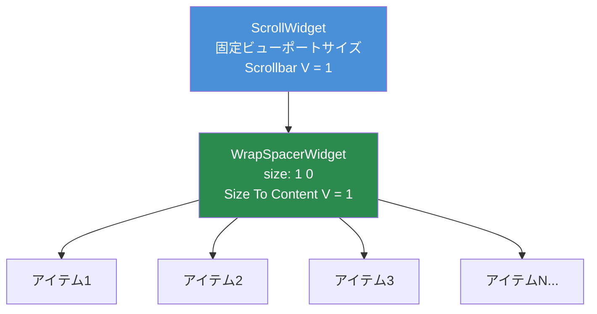

# 第3.4章: コンテナウィジェット

[ホーム](../../README.md) | [<< 前へ: サイズと配置](03-sizing-positioning.md) | **コンテナウィジェット** | [次へ: プログラムによるウィジェット作成 >>](05-programmatic-widgets.md)

---

コンテナウィジェットは、内部の子ウィジェットを整理します。`FrameWidget` が最もシンプル（不可視のボックス、手動配置）ですが、DayZにはレイアウトを自動的に処理する3つの特殊コンテナが用意されています: `WrapSpacerWidget`、`GridSpacerWidget`、`ScrollWidget` です。

### コンテナの比較



---

## FrameWidget -- 構造コンテナ

`FrameWidget` は最も基本的なコンテナです。画面上に何も描画せず、子を配置しません -- 各子を手動で配置する必要があります。

**使用すべき場合:**
- 関連するウィジェットをグループ化して、まとめて表示/非表示にする
- パネルやダイアログのルートウィジェット
- 配置を自分で処理する構造的なグループ化

```
FrameWidgetClass MyPanel {
 size 0.5 0.5
 halign center_ref
 valign center_ref
 hexactpos 1
 vexactpos 1
 hexactsize 0
 vexactsize 0
 {
  TextWidgetClass Header {
   position 0 0
   size 1 0.1
   text "Panel Title"
   "text halign" center
  }
  PanelWidgetClass Divider {
   position 0 0.1
   size 1 2
   hexactsize 0
   vexactsize 1
   color 1 1 1 0.3
  }
  FrameWidgetClass Content {
   position 0 0.12
   size 1 0.88
  }
 }
}
```

**主な特徴:**
- 視覚的な外観なし（透明）
- 子はフレームの境界に対して相対的に配置
- 自動レイアウトなし -- すべての子に明示的な位置/サイズが必要
- 軽量 -- 子以外のレンダリングコストはゼロ

---

## WrapSpacerWidget -- フローレイアウト

`WrapSpacerWidget` は子を自動的にフローシーケンスで配置します。子は水平に次々と配置され、利用可能な幅を超えると次の行に折り返されます。これは、子の数が実行時に変わる動的リストに使用するウィジェットです。

### レイアウト属性

| 属性 | 値 | 説明 |
|---|---|---|
| `Padding` | 整数（ピクセル） | スペーサーの端と子の間のスペース |
| `Margin` | 整数（ピクセル） | 個々の子の間のスペース |
| `"Size To Content H"` | `0` または `1` | すべての子に合わせて幅をリサイズ |
| `"Size To Content V"` | `0` または `1` | すべての子に合わせて高さをリサイズ |
| `content_halign` | `left`、`center`、`right` | 子グループの水平方向の配置 |
| `content_valign` | `top`、`center`、`bottom` | 子グループの垂直方向の配置 |

### 基本的なフローレイアウト

```
WrapSpacerWidgetClass TagList {
 size 1 0
 hexactsize 0
 "Size To Content V" 1
 Padding 5
 Margin 3
 {
  ButtonWidgetClass Tag1 {
   size 80 24
   hexactsize 1
   vexactsize 1
   text "Weapons"
  }
  ButtonWidgetClass Tag2 {
   size 60 24
   hexactsize 1
   vexactsize 1
   text "Food"
  }
  ButtonWidgetClass Tag3 {
   size 90 24
   hexactsize 1
   vexactsize 1
   text "Medical"
  }
 }
}
```

この例では:
- スペーサーは親の全幅（`size 1`）ですが、高さは子に合わせて調整されます（`"Size To Content V" 1`）。
- 子は80px、60px、90px幅のボタンです。
- 利用可能な幅に3つすべてが1行に収まらない場合、スペーサーは次の行に折り返します。
- `Padding 5` はスペーサーの端の内側に5pxのスペースを追加します。
- `Margin 3` は各子の間に3pxのスペースを追加します。

### WrapSpacerによる垂直リスト

垂直リスト（1行に1アイテム）を作成するには、子を全幅にします:

```
WrapSpacerWidgetClass ItemList {
 size 1 0
 hexactsize 0
 "Size To Content V" 1
 Margin 2
 {
  FrameWidgetClass Item1 {
   size 1 30
   hexactsize 0
   vexactsize 1
  }
  FrameWidgetClass Item2 {
   size 1 30
   hexactsize 0
   vexactsize 1
  }
 }
}
```

各子は100%幅（`size 1` と `hexactsize 0`）のため、1行に1つだけ収まり、垂直スタックが作成されます。

### 動的な子

`WrapSpacerWidget` はプログラムで追加される子に最適です。子を追加または削除した場合、スペーサーで `Update()` を呼び出してレイアウトの再計算をトリガーします:

```c
WrapSpacerWidget spacer;

// レイアウトファイルから子を追加
Widget child = GetGame().GetWorkspace().CreateWidgets("MyMod/gui/layouts/ListItem.layout", spacer);

// スペーサーに再計算を強制
spacer.Update();
```

---

## GridSpacerWidget -- グリッドレイアウト

`GridSpacerWidget` は子を均一なグリッドに配置します。列と行の数を定義すると、各セルに等しいスペースが割り当てられます。

### レイアウト属性

| 属性 | 値 | 説明 |
|---|---|---|
| `Columns` | 整数 | グリッドの列数 |
| `Rows` | 整数 | グリッドの行数 |
| `Margin` | 整数（ピクセル） | グリッドセル間のスペース |
| `"Size To Content V"` | `0` または `1` | コンテンツに合わせて高さをリサイズ |

### 基本的なグリッド

```
GridSpacerWidgetClass InventoryGrid {
 size 0.5 0.5
 hexactsize 0
 vexactsize 0
 Columns 4
 Rows 3
 Margin 2
 {
  // 12セル（4列 x 3行）
  // 子は順番に配置: 左から右、上から下
  FrameWidgetClass Slot1 { }
  FrameWidgetClass Slot2 { }
  FrameWidgetClass Slot3 { }
  FrameWidgetClass Slot4 { }
  FrameWidgetClass Slot5 { }
  FrameWidgetClass Slot6 { }
  FrameWidgetClass Slot7 { }
  FrameWidgetClass Slot8 { }
  FrameWidgetClass Slot9 { }
  FrameWidgetClass Slot10 { }
  FrameWidgetClass Slot11 { }
  FrameWidgetClass Slot12 { }
 }
}
```

### 単一列グリッド（垂直リスト）

`Columns 1` を設定すると、各子が全幅を取得するシンプルな垂直スタックが作成されます:

```
GridSpacerWidgetClass SettingsList {
 size 1 0
 hexactsize 0
 "Size To Content V" 1
 Columns 1
 {
  FrameWidgetClass Setting1 {
   size 150 30
   hexactsize 1
   vexactsize 1
  }
  FrameWidgetClass Setting2 {
   size 150 30
   hexactsize 1
   vexactsize 1
  }
  FrameWidgetClass Setting3 {
   size 150 30
   hexactsize 1
   vexactsize 1
  }
 }
}
```

### GridSpacer vs WrapSpacer

| 機能 | GridSpacer | WrapSpacer |
|---|---|---|
| セルサイズ | 均一（等しい） | 各子が独自のサイズを維持 |
| レイアウトモード | 固定グリッド（列 x 行） | 折り返しのあるフロー |
| 最適な用途 | インベントリスロット、均一なギャラリー | 動的リスト、タグクラウド |
| 子のサイズ設定 | 無視（グリッドが制御） | 尊重（子のサイズが重要） |

---

## ScrollWidget -- スクロール可能なビューポート

`ScrollWidget` は表示領域より高い（または広い）コンテンツをラップし、ナビゲーション用のスクロールバーを提供します。

### レイアウト属性

| 属性 | 値 | 説明 |
|---|---|---|
| `"Scrollbar V"` | `0` または `1` | 垂直スクロールバーを表示 |
| `"Scrollbar H"` | `0` または `1` | 水平スクロールバーを表示 |

### スクリプトAPI

```c
ScrollWidget sw;
sw.VScrollToPos(float pos);     // 垂直位置にスクロール（0 = 上端）
sw.GetVScrollPos();             // 現在のスクロール位置を取得
sw.GetContentHeight();          // コンテンツの合計高さを取得
sw.VScrollStep(int step);       // ステップ量でスクロール
```

### 基本的なスクロール可能リスト

```
ScrollWidgetClass ListScroll {
 size 1 300
 hexactsize 0
 vexactsize 1
 "Scrollbar V" 1
 {
  WrapSpacerWidgetClass ListContent {
   size 1 0
   hexactsize 0
   "Size To Content V" 1
   {
    // ここに多くの子...
    FrameWidgetClass Item1 {
     size 1 30
     hexactsize 0
     vexactsize 1
    }
    FrameWidgetClass Item2 {
     size 1 30
     hexactsize 0
     vexactsize 1
    }
    // ... さらにアイテム
   }
  }
 }
}
```

---

## ScrollWidget + WrapSpacerパターン

### ScrollWidget + WrapSpacerパターン



これはDayZ MODにおけるスクロール可能な動的リストの**標準パターン**です。固定高さの `ScrollWidget` と、子に合わせて成長する `WrapSpacerWidget` を組み合わせます。

```
// 固定高さのスクロールビューポート
ScrollWidgetClass DialogScroll {
 size 0.97 235
 hexactsize 0
 vexactsize 1
 "Scrollbar V" 1
 {
  // コンテンツはすべての子に合わせて垂直に成長
  WrapSpacerWidgetClass DialogContent {
   size 1 0
   hexactsize 0
   "Size To Content V" 1
  }
 }
}
```

仕組み:

1. `ScrollWidget` は**固定**の高さを持ちます（この例では235ピクセル）。
2. 内部の `WrapSpacerWidget` は `"Size To Content V" 1` を持つため、子が追加されると高さが増加します。
3. スペーサーのコンテンツが235ピクセルを超えると、スクロールバーが表示され、ユーザーがスクロールできるようになります。

このパターンはDabsFramework、DayZ Editor、Expansion、およびほぼすべてのプロフェッショナルなDayZ MODに見られます。

### プログラムによるアイテムの追加

```c
ScrollWidget m_Scroll;
WrapSpacerWidget m_Content;

void AddItem(string text)
{
    // WrapSpacer内に新しい子を作成
    Widget item = GetGame().GetWorkspace().CreateWidgets(
        "MyMod/gui/layouts/ListItem.layout", m_Content);

    // 新しいアイテムを設定
    TextWidget tw = TextWidget.Cast(item.FindAnyWidget("Label"));
    tw.SetText(text);

    // レイアウトの再計算を強制
    m_Content.Update();
}

void ScrollToBottom()
{
    m_Scroll.VScrollToPos(m_Scroll.GetContentHeight());
}

void ClearAll()
{
    // すべての子を削除
    Widget child = m_Content.GetChildren();
    while (child)
    {
        Widget next = child.GetSibling();
        child.Unlink();
        child = next;
    }
    m_Content.Update();
}
```

---

## ネストのルール

コンテナをネストして複雑なレイアウトを作成できます。いくつかのガイドライン:

1. **FrameWidget は何にでも入る** -- 常に動作します。スペーサーやグリッド内のサブセクションをグループ化するためにフレームを使用します。

2. **ScrollWidget内のWrapSpacer** -- スクロール可能なリストの標準パターンです。スペーサーが成長し、スクロールがクリップします。

3. **WrapSpacer内のGridSpacer** -- 動作します。フローレイアウトの1アイテムとして固定グリッドを配置するのに便利です。

4. **WrapSpacer内のScrollWidget** -- 可能ですが、スクロールウィジェットに固定高さが必要です（`vexactsize 1`）。固定高さがないと、スクロールウィジェットはコンテンツに合わせて成長しようとします（スクロールの目的が無効になります）。

5. **深いネストを避ける** -- ネストの各レベルがレイアウト計算コストを追加します。複雑なUIでは3〜4レベルの深さが一般的です。6レベルを超える場合は、レイアウトを再構築すべきです。

---

## 各コンテナの使い分け

| シナリオ | 最適なコンテナ |
|---|---|
| 手動配置された要素を持つ静的パネル | `FrameWidget` |
| サイズが異なるアイテムの動的リスト | `WrapSpacerWidget` |
| 均一なグリッド（インベントリ、ギャラリー） | `GridSpacerWidget` |
| 1行に1アイテムの垂直リスト | `WrapSpacerWidget`（全幅の子）または `GridSpacerWidget`（`Columns 1`） |
| 利用可能なスペースより高いコンテンツ | スペーサーをラップする `ScrollWidget` |
| タブコンテンツ領域 | `FrameWidget`（子の可視性を切り替え） |
| ツールバーボタン | `WrapSpacerWidget` または `GridSpacerWidget` |

---

## 完全な例: スクロール可能な設定パネル

タイトルバー、グリッドに配置されたオプションを含むスクロール可能なコンテンツ領域、および下部のボタンバーを持つ設定パネル:

```
FrameWidgetClass SettingsPanel {
 size 0.4 0.6
 halign center_ref
 valign center_ref
 hexactpos 1
 vexactpos 1
 hexactsize 0
 vexactsize 0
 {
  // タイトルバー
  PanelWidgetClass TitleBar {
   position 0 0
   size 1 30
   hexactsize 0
   vexactsize 1
   color 0.2 0.4 0.8 1
  }

  // スクロール可能な設定領域
  ScrollWidgetClass SettingsScroll {
   position 0 30
   size 1 0
   hexactpos 0
   vexactpos 1
   hexactsize 0
   vexactsize 0
   "Scrollbar V" 1
   {
    GridSpacerWidgetClass SettingsGrid {
     size 1 0
     hexactsize 0
     "Size To Content V" 1
     Columns 1
     Margin 2
    }
   }
  }

  // 下部のボタンバー
  FrameWidgetClass ButtonBar {
   size 1 40
   halign left_ref
   valign bottom_ref
   hexactpos 0
   vexactpos 1
   hexactsize 0
   vexactsize 1
  }
 }
}
```

---

## ベストプラクティス

- プログラムで子を追加または削除した後は、常に `WrapSpacerWidget` または `GridSpacerWidget` で `Update()` を呼び出してください。この呼び出しがないと、スペーサーはレイアウトを再計算せず、子が重なったり不可視になったりする可能性があります。
- 動的リストには `ScrollWidget` + `WrapSpacerWidget` を標準パターンとして使用してください。スクロールを固定ピクセル高さに設定し、内部スペーサーを `"Size To Content V" 1` にします。
- アイテムの高さが異なる垂直リストには、`GridSpacerWidget Columns 1` よりも全幅の子を持つ `WrapSpacerWidget` を優先してください。GridSpacerは均一なセルサイズを強制します。
- `ScrollWidget` には常に `clipchildren 1` を設定してください。これがないと、オーバーフローしたコンテンツがスクロールビューポートの境界外にレンダリングされます。
- 4〜5レベル以上のコンテナのネストを避けてください。各レベルがレイアウト計算コストを追加し、デバッグが大幅に難しくなります。

---

## 理論と実践

> ドキュメントが記載していることと、実行時に実際に動作する方法の比較です。

| 概念 | 理論 | 実際 |
|---------|--------|---------|
| `WrapSpacerWidget.Update()` | 子が変更されるとレイアウトが自動再計算される | `CreateWidgets()` や `Unlink()` の後に手動で `Update()` を呼び出す必要があります。これを忘れることが最も一般的なスペーサーのバグです |
| `"Size To Content V"` | スペーサーが子に合わせて成長する | 子に明示的なサイズ（ピクセル高さまたは既知のプロポーショナルな親）がある場合にのみ機能します。子も `Size To Content` の場合、高さがゼロになります |
| `GridSpacerWidget` のセルサイズ | グリッドがセルサイズを均一に制御する | 子自身のサイズ属性は無視されます -- グリッドがそれらをオーバーライドします。グリッドの子に `size` を設定しても効果はありません |
| `ScrollWidget` のスクロール位置 | `VScrollToPos(0)` で上端にスクロール | 子を追加した後、コンテンツの高さがまだ再計算されていないため、`VScrollToPos()` を1フレーム遅延させる必要がある場合があります（`CallLater` 経由） |
| ネストされたスペーサー | スペーサーは自由にネストできる | `WrapSpacer` 内の `WrapSpacer` は動作しますが、両方のレベルで `Size To Content` を使用すると、UIがフリーズする無限レイアウトループが発生する可能性があります |

---

## 互換性と影響

- **マルチMOD:** コンテナウィジェットはレイアウトごとであり、MOD間で競合しません。ただし、2つのMODが `modded class` 経由で同じバニラの `ScrollWidget` に子を注入する場合、子の順序は予測できません。
- **パフォーマンス:** `WrapSpacerWidget.Update()` はすべての子の位置を再計算します。100以上のアイテムを持つリストの場合、個別の追加ごとではなく、バッチ操作後に1回 `Update()` を呼び出してください。GridSpacerはセル位置が算術的に計算されるため、均一なグリッドではより高速です。
- **バージョン:** `WrapSpacerWidget` と `GridSpacerWidget` はDayZ 1.0から利用可能です。`"Size To Content H/V"` 属性は最初から存在していましたが、深くネストされたレイアウトでの動作はDayZ 1.10頃に安定しました。

---

## 実際のMODで確認されたパターン

| パターン | MOD | 詳細 |
|---------|-----|--------|
| 動的リストの `ScrollWidget` + `WrapSpacerWidget` | DabsFramework、Expansion、COT | 固定高さのスクロールビューポートと自動成長する内部スペーサー -- ユニバーサルなスクロール可能リストパターン |
| インベントリの `GridSpacerWidget Columns 10` | バニラDayZ | インベントリグリッドはスロットレイアウトに一致する固定列数のGridSpacerを使用 |
| WrapSpacer内のプールされた子 | VPP Admin Tools | リストアイテムウィジェットのプールを事前作成し、`Update()` のオーバーヘッドを避けるために作成/破棄の代わりに表示/非表示を切り替え |
| ダイアログルートとしての `WrapSpacerWidget` | COT、DayZ Editor | ダイアログルートが `Size To Content V/H` を使用し、ハードコードされた寸法なしでコンテンツの周りにダイアログが自動サイズ調整 |

---

## 次のステップ

- [3.5 プログラムによるウィジェット作成](05-programmatic-widgets.md) -- コードからウィジェットを作成
- [3.6 イベントハンドリング](06-event-handling.md) -- クリック、変更、その他のイベントへの応答
