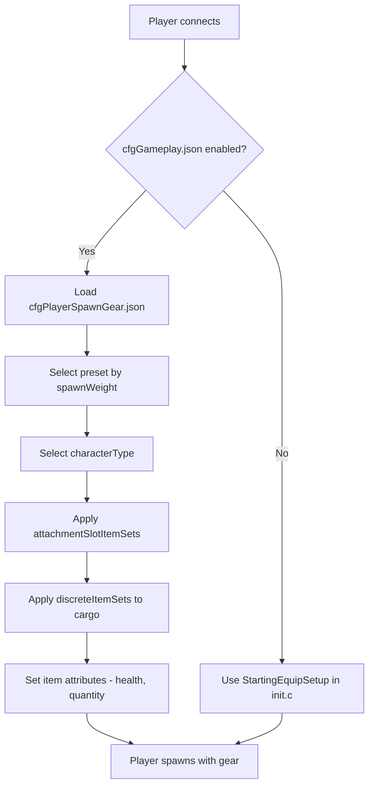

# Chapter 5.6: Spawning Gear Configuration

[Home](../../README.md) | [<< Previous: Server Configuration Files](05-server-configs.md) | **Spawning Gear Configuration**

> **概要：** DayZには、プレイヤーがワールドに入る方法を制御する2つの補完的なシステムがあります：**スポーンポイント**はキャラクターがマップ上のどこに出現するかを決定し、**スポーンギア**はどの装備を持っているかを決定します。この章では、ファイル構造、フィールドリファレンス、実用的なプリセット、Modとの統合を含め、両方のシステムを詳しく扱います。

---

## 目次

- [Overview](#overview)
- [The Two Systems](#the-two-systems)
- [Spawn Gear: cfgPlayerSpawnGear.json](#spawn-gear-cfgplayerspawngearjson)
  - [Enabling Spawn Gear Presets](#enabling-spawn-gear-presets)
  - [Preset Structure](#preset-structure)
  - [attachmentSlotItemSets](#attachmentslotitemsets)
  - [DiscreteItemSets](#discreteitemsets)
  - [discreteUnsortedItemSets](#discreteunsorteditemsets)
  - [ComplexChildrenTypes](#complexchildrentypes)
  - [SimpleChildrenTypes](#simplechildrentypes)
  - [Attributes](#attributes)
- [Spawn Points: cfgplayerspawnpoints.xml](#spawn-points-cfgplayerspawnpointsxml)
  - [File Structure](#file-structure)
  - [spawn_params](#spawn_params)
  - [generator_params](#generator_params)
  - [Spawning Groups](#spawning-groups)
  - [Map-Specific Configs](#map-specific-configs)
- [Practical Examples](#practical-examples)
  - [Default Survivor Loadout](#default-survivor-loadout)
  - [Military Spawn Kit](#military-spawn-kit)
  - [Medical Spawn Kit](#medical-spawn-kit)
  - [Random Gear Selection](#random-gear-selection)
- [Integration with Mods](#integration-with-mods)
- [Best Practices](#best-practices)
- [Common Mistakes](#common-mistakes)

---

## 概要



DayZでプレイヤーが新規キャラクターとしてスポーンすると、サーバーが2つの質問に回答します：

1. **キャラクターはどこに出現するか？** --- `cfgplayerspawnpoints.xml`で制御されます。
2. **キャラクターは何を持っているか？** --- `cfggameplay.json`で登録されたスポーンギアプリセットJSONファイルで制御されます。

両方のシステムはサーバー側のみです。クライアントはこれらの設定ファイルを見ることができず、改ざんすることもできません。スポーンギアシステムは`init.c`でのロードアウトのスクリプティングの代替として導入されました。これにより、サーバー管理者はEnforce Scriptコードを書くことなく、JSONで複数の重み付きプリセットを定義できます。

> **重要：** スポーンギアプリセットシステムは、ミッションの`init.c`内の`StartingEquipSetup()`メソッドを**完全にオーバーライド**します。`cfggameplay.json`でスポーンギアプリセットを有効にすると、スクリプトによるロードアウトコードは無視されます。同様に、プリセットで定義されたキャラクタータイプは、メインメニューで選択されたキャラクターモデルをオーバーライドします。

---

## The Two Systems

| System | ファイル | Format | Controls |
|--------|------|--------|----------|
| Spawn Points | `cfgplayerspawnpoints.xml` | XML | **Where** --- map positions, distance scoring, spawn groups |
| Spawn Gear | Custom preset JSON files | JSON | **What** --- character model, clothing, weapons, cargo, quickbar |

2つのシステムは独立しています。バニラギアでカスタムスポーンポイントを使用したり、バニラスポーンポイントでカスタムギアを使用したり、両方をカスタマイズしたりできます。

---

## Spawn Gear: cfgPlayerSpawnGear.json

### Enabling Spawn Gear Presets

スポーンギアプリセットはデフォルトでは**有効ではありません**。使用するには、以下を行う必要があります：

1. ミッションフォルダ（例：`mpmissions/dayzOffline.chernarusplus/`）に1つ以上のJSONプリセットファイルを作成します。
2. `cfggameplay.json`の`PlayerData.spawnGearPresetFiles`にそれらを登録します。
3. `serverDZ.cfg`で`enableCfgGameplayFile = 1`が設定されていることを確認します。

```json
{
  "version": 122,
  "PlayerData": {
    "spawnGearPresetFiles": [
      "survivalist.json",
      "casual.json",
      "military.json"
    ]
  }
}
```

プリセットファイルはミッションフォルダ下のサブディレクトリにネストできます：

```json
"spawnGearPresetFiles": [
  "custom/survivalist.json",
  "custom/casual.json",
  "custom/military.json"
]
```

各JSONファイルは単一のプリセットオブジェクトを含みます。すべての登録済みプリセットはプールされ、新しいキャラクターがスポーンするたびにサーバーが`spawnWeight`に基づいて1つを選択します。

### プリセット構造

プリセットは以下のフィールドを持つトップレベルJSONオブジェクトです：

| フィールド | 型 | 説明 |
|-------|------|-------------|
| `name` | string | Human-readable name for the preset (any string, used for identification only) |
| `spawnWeight` | integer | Weight for random selection. Minimum is `1`. Higher values make this preset more likely to be chosen |
| `characterTypes` | array | Array of character type classnames (e.g., `"SurvivorM_Mirek"`). One is picked at random when this preset spawns |
| `attachmentSlotItemSets` | array | Array of `AttachmentSlots` structures defining what the character wears (clothing, weapons on shoulders, etc.) |
| `discreteUnsortedItemSets` | array | Array of `DiscreteUnsortedItemSets` structures defining cargo items placed into any available inventory space |

> **注意：** If `characterTypes` is empty or omitted, the character model last selected in the main menu character creation screen will be used for that preset.

最小限の例：

```json
{
  "spawnWeight": 1,
  "name": "Basic Survivor",
  "characterTypes": [
    "SurvivorM_Mirek",
    "SurvivorF_Eva"
  ],
  "attachmentSlotItemSets": [],
  "discreteUnsortedItemSets": []
}
```

### attachmentSlotItemSets

この配列は、特定のキャラクターアタッチメントスロット --- body、legs、feet、head、back、vest、shoulders、eyewearなど --- に入るアイテムを定義します。

各エントリは1つのスロットをターゲットにします：

| フィールド | 型 | 説明 |
|-------|------|-------------|
| `slotName` | string | The attachment slot name. Derived from CfgSlots. Common values: `"Body"`, `"Legs"`, `"Feet"`, `"Head"`, `"Back"`, `"Vest"`, `"Eyewear"`, `"Gloves"`, `"Hips"`, `"shoulderL"`, `"shoulderR"` |
| `discreteItemSets` | array | Array of item variants that can fill this slot (one is chosen based on `spawnWeight`) |

> **Shoulder shortcuts:** You can use `"shoulderL"` and `"shoulderR"` as slot names. The engine automatically translates these to the correct internal CfgSlots names.

```json
{
  "slotName": "Body",
  "discreteItemSets": [
    {
      "itemType": "TShirt_Beige",
      "spawnWeight": 1,
      "attributes": {
        "healthMin": 0.45,
        "healthMax": 0.65,
        "quantityMin": 1.0,
        "quantityMax": 1.0
      },
      "quickBarSlot": -1
    },
    {
      "itemType": "TShirt_Black",
      "spawnWeight": 1,
      "attributes": {
        "healthMin": 0.45,
        "healthMax": 0.65,
        "quantityMin": 1.0,
        "quantityMax": 1.0
      },
      "quickBarSlot": -1
    }
  ]
}
```

### DiscreteItemSets

`discreteItemSets`の各エントリは、そのスロットに入る可能性のある1つのアイテムを表します。サーバーは`spawnWeight`で重み付けされたランダムで1つのエントリを選択します。この構造は`attachmentSlotItemSets`（スロットベースのアイテム用）の内部で使用され、ランダム選択の仕組みです。

| フィールド | 型 | 説明 |
|-------|------|-------------|
| `itemType` | string | Item classname (typename). Use `""` (empty string) to represent "nothing" --- the slot remains empty |
| `spawnWeight` | integer | Weight for selection. Minimum `1`. Higher = more likely |
| `attributes` | object | Health and quantity ranges for this item. See [Attributes](#attributes) |
| `quickBarSlot` | integer | Quick bar slot assignment (0-based). Use `-1` for no quickbar assignment |
| `complexChildrenTypes` | array | Items to spawn nested inside this item. See [ComplexChildrenTypes](#complexchildrentypes) |
| `simpleChildrenTypes` | array | Item classnames to spawn inside this item using default or parent attributes |
| `simpleChildrenUseDefaultAttributes` | bool | If `true`, simple children use the parent's `attributes`. If `false`, they use configuration defaults |

**空アイテムのトリック：** スロットが空になるか埋まるかを50/50の確率にするには、空の`itemType`を使用します：

```json
{
  "slotName": "Eyewear",
  "discreteItemSets": [
    {
      "itemType": "AviatorGlasses",
      "spawnWeight": 1,
      "attributes": {
        "healthMin": 1.0,
        "healthMax": 1.0
      },
      "quickBarSlot": -1
    },
    {
      "itemType": "",
      "spawnWeight": 1
    }
  ]
}
```

### discreteUnsortedItemSets

このトップレベル配列は、キャラクターの**カーゴ** --- すべての装着衣類とコンテナにわたる利用可能なインベントリスペース --- に入るアイテムを定義します。`attachmentSlotItemSets`とは異なり、これらのアイテムは特定のスロットに配置されません。エンジンが自動的に空きスペースを見つけます。

各エントリは1つのカーゴバリアントを表し、サーバーが`spawnWeight`に基づいて1つを選択します。

| フィールド | 型 | 説明 |
|-------|------|-------------|
| `name` | string | Human-readable name (for identification only) |
| `spawnWeight` | integer | Weight for selection. Minimum `1` |
| `attributes` | object | デフォルト health/quantity ranges. Used by children when `simpleChildrenUseDefaultAttributes` is `true` |
| `complexChildrenTypes` | array | Items to spawn into cargo, each with their own attributes and nesting |
| `simpleChildrenTypes` | array | Item classnames to spawn into cargo |
| `simpleChildrenUseDefaultAttributes` | bool | If `true`, simple children use this structure's `attributes`. If `false`, they use configuration defaults |

```json
{
  "name": "Cargo1",
  "spawnWeight": 1,
  "attributes": {
    "healthMin": 1.0,
    "healthMax": 1.0,
    "quantityMin": 1.0,
    "quantityMax": 1.0
  },
  "complexChildrenTypes": [
    {
      "itemType": "BandageDressing",
      "attributes": {
        "healthMin": 1.0,
        "healthMax": 1.0,
        "quantityMin": 1.0,
        "quantityMax": 1.0
      },
      "quickBarSlot": 2
    }
  ],
  "simpleChildrenUseDefaultAttributes": false,
  "simpleChildrenTypes": [
    "Rag",
    "Apple"
  ]
}
```

### ComplexChildrenTypes

Complex childrenは、属性、クイックバー割り当て、独自のネストされた子アイテムを完全に制御して、親アイテムの**内部に**スポーンされるアイテムです。主な使用ケースは、中身のあるアイテムのスポーンです --- 例えば、アタッチメント付きの武器や、食料が入った調理鍋などです。

| フィールド | 型 | 説明 |
|-------|------|-------------|
| `itemType` | string | Item classname |
| `attributes` | object | Health/quantity ranges for this specific item |
| `quickBarSlot` | integer | Quick bar slot assignment. `-1` = don't assign |
| `simpleChildrenUseDefaultAttributes` | bool | Whether simple children inherit these attributes |
| `simpleChildrenTypes` | array | Item classnames to spawn inside this item |

例 --- アタッチメントとマガジン付きの武器：

```json
{
  "itemType": "AKM",
  "attributes": {
    "healthMin": 0.5,
    "healthMax": 1.0,
    "quantityMin": 1.0,
    "quantityMax": 1.0
  },
  "quickBarSlot": 1,
  "complexChildrenTypes": [
    {
      "itemType": "AK_PlasticBttstck",
      "attributes": {
        "healthMin": 0.4,
        "healthMax": 0.6
      },
      "quickBarSlot": -1
    },
    {
      "itemType": "PSO1Optic",
      "attributes": {
        "healthMin": 0.1,
        "healthMax": 0.2
      },
      "quickBarSlot": -1,
      "simpleChildrenUseDefaultAttributes": true,
      "simpleChildrenTypes": [
        "Battery9V"
      ]
    },
    {
      "itemType": "Mag_AKM_30Rnd",
      "attributes": {
        "healthMin": 0.5,
        "healthMax": 0.5,
        "quantityMin": 1.0,
        "quantityMax": 1.0
      },
      "quickBarSlot": -1
    }
  ],
  "simpleChildrenUseDefaultAttributes": false,
  "simpleChildrenTypes": [
    "AK_PlasticHndgrd",
    "AK_Bayonet"
  ]
}
```

この例では、AKMはバットストック、オプティック（内部にバッテリー付き）、装填済みマガジンをcomplex childrenとして、さらにハンドガードとバヨネットをsimple childrenとしてスポーンします。`simpleChildrenUseDefaultAttributes`が`false`であるため、simple childrenは設定のデフォルト値を使用します。

### SimpleChildrenTypes

Simple childrenは、個別の属性を指定せずに親アイテム内にアイテムをスポーンするための省略形です。アイテムクラス名（文字列）の配列です。

属性は`simpleChildrenUseDefaultAttributes`フラグによって決定されます：

- **`true`** --- アイテムは親構造に定義された`attributes`を使用します。
- **`false`** --- アイテムはエンジンの設定デフォルト値（通常はフルヘルスとフル数量）を使用します。

Simple childrenは独自のネストされた子アイテムやクイックバー割り当てを持つことができません。これらの機能が必要な場合は、代わりに`complexChildrenTypes`を使用してください。

### Attributes

Attributesはスポーンされるアイテムの状態と数量を制御します。すべての値は`0.0`から`1.0`の浮動小数点数です：

| フィールド | 型 | 説明 |
|-------|------|-------------|
| `healthMin` | float | Minimum health percentage. `1.0` = pristine, `0.0` = ruined |
| `healthMax` | float | Maximum health percentage. A random value between min and max is applied |
| `quantityMin` | float | Minimum quantity percentage. For magazines: fill level. For food: remaining bites |
| `quantityMax` | float | Maximum quantity percentage |

minとmaxの両方が指定されると、エンジンはその範囲内でランダムな値を選択します。これにより自然なバリエーションが生まれます --- 例えば、healthが`0.45`から`0.65`の場合、アイテムは使用済みから損傷した状態でスポーンします。

```json
"attributes": {
  "healthMin": 0.45,
  "healthMax": 0.65,
  "quantityMin": 1.0,
  "quantityMax": 1.0
}
```

---

## Spawn Points: cfgplayerspawnpoints.xml

このXMLファイルはプレイヤーがマップ上のどこに出現するかを定義します。ミッションフォルダ（例：`mpmissions/dayzOffline.chernarusplus/cfgplayerspawnpoints.xml`）に配置されています。

### ファイル構造

ルート要素は最大3つのセクションを含みます：

| Section | 目的 |
|---------|---------|
| `<fresh>` | **Required.** Spawn points for newly created characters |
| `<hop>` | Spawn points for players hopping from another server on the same map (official servers only) |
| `<travel>` | Spawn points for players traveling from a different map (official servers only) |

各セクションは同じ3つのサブ要素を含みます：`<spawn_params>`、`<generator_params>`、`<generator_posbubbles>`。

```xml
<?xml version="1.0" encoding="UTF-8" standalone="yes" ?>
<playerspawnpoints>
    <fresh>
        <spawn_params>...</spawn_params>
        <generator_params>...</generator_params>
        <generator_posbubbles>...</generator_posbubbles>
    </fresh>
    <hop>
        <spawn_params>...</spawn_params>
        <generator_params>...</generator_params>
        <generator_posbubbles>...</generator_posbubbles>
    </hop>
    <travel>
        <spawn_params>...</spawn_params>
        <generator_params>...</generator_params>
        <generator_posbubbles>...</generator_posbubbles>
    </travel>
</playerspawnpoints>
```

### spawn_params

近くのエンティティに対して候補スポーンポイントをスコアリングするランタイムパラメータです。`min_dist`未満のポイントは無効化されます。`min_dist`と`max_dist`の間のポイントは、`max_dist`を超えるポイントよりも優先されます。

```xml
<spawn_params>
    <min_dist_infected>30</min_dist_infected>
    <max_dist_infected>70</max_dist_infected>
    <min_dist_player>65</min_dist_player>
    <max_dist_player>150</max_dist_player>
    <min_dist_static>0</min_dist_static>
    <max_dist_static>2</max_dist_static>
</spawn_params>
```

| パラメータ | 説明 |
|-----------|-------------|
| `min_dist_infected` | Minimum meters from infected. Points closer than this are penalized |
| `max_dist_infected` | Maximum scoring distance from infected |
| `min_dist_player` | Minimum meters from other players. Keeps fresh spawns from appearing on top of existing players |
| `max_dist_player` | Maximum scoring distance from other players |
| `min_dist_static` | Minimum meters from buildings/objects |
| `max_dist_static` | Maximum scoring distance from buildings/objects |

Sakhalマップでは、トリガーゾーン距離に対する6倍のウェイト乗数を持つ`min_dist_trigger`と`max_dist_trigger`パラメータも追加されています。

**スコアリングロジック：** エンジンは各候補ポイントのスコアを計算します。距離`0`から`min_dist`はスコア`-1`（ほぼ無効化）。距離`min_dist`から中間点はスコア最大`1.1`。距離中間点から`max_dist`はスコア`1.1`から`0.1`に減少。`max_dist`を超えるとスコア`0`。合計スコアが高い = スポーン場所に選ばれやすいです。

### generator_params

各ポジションバブルの周囲で候補スポーンポイントのグリッドがどのように生成されるかを制御します：

```xml
<generator_params>
    <grid_density>4</grid_density>
    <grid_width>200</grid_width>
    <grid_height>200</grid_height>
    <min_dist_static>0</min_dist_static>
    <max_dist_static>2</max_dist_static>
    <min_steepness>-45</min_steepness>
    <max_steepness>45</max_steepness>
</generator_params>
```

| パラメータ | 説明 |
|-----------|-------------|
| `grid_density` | Sample frequency. `4` means a 4x4 grid of candidate points. Higher = more candidates, more CPU cost. Must be at least `1`. When `0`, only the center point is used |
| `grid_width` | Total width of the sampling rectangle in meters |
| `grid_height` | Total height of the sampling rectangle in meters |
| `min_dist_static` | Minimum distance from buildings for a valid candidate |
| `max_dist_static` | Maximum distance from buildings used for scoring |
| `min_steepness` | Minimum terrain slope in degrees. Points on steeper terrain are discarded |
| `max_steepness` | Maximum terrain slope in degrees |

`generator_posbubbles`で定義されたすべての`<pos>`の周囲に、エンジンは`grid_width` x `grid_height`メートルの矩形を作成し、`grid_density`の頻度でサンプリングし、オブジェクト、水、または傾斜制限を超えるポイントを破棄します。

### Spawning Groups

グループを使用すると、スポーンポイントをクラスタリングし、時間の経過とともにそれらをローテーションできます。これにより、すべてのプレイヤーが常に同じ場所にスポーンすることを防ぎます。

グループは各セクション内の`<group_params>`で有効にします：

```xml
<group_params>
    <enablegroups>true</enablegroups>
    <groups_as_regular>true</groups_as_regular>
    <lifetime>240</lifetime>
    <counter>-1</counter>
</group_params>
```

| パラメータ | 説明 |
|-----------|-------------|
| `enablegroups` | `true` to enable group rotation, `false` for a flat list of points |
| `groups_as_regular` | When `enablegroups` is `false`, treat group points as regular spawn points instead of ignoring them. デフォルト： `true` |
| `lifetime` | Seconds a group stays active before rotating to another. Use `-1` to disable the timer |
| `counter` | Number of spawns that reset the lifetime. Each player spawning in the group resets the timer. Use `-1` to disable the counter |

ポジションは`<generator_posbubbles>`内で名前付きグループに整理されます：

```xml
<generator_posbubbles>
    <group name="WestCherno">
        <pos x="6063.018555" z="1931.907227" />
        <pos x="5933.964844" z="2171.072998" />
        <pos x="6199.782715" z="2241.805176" />
    </group>
    <group name="EastCherno">
        <pos x="8040.858398" z="3332.236328" />
        <pos x="8207.115234" z="3115.650635" />
    </group>
</generator_posbubbles>
```

個々のグループはグローバルなlifetimeとcounter値をオーバーライドできます：

```xml
<group name="Tents" lifetime="300" counter="25">
    <pos x="4212.421875" z="11038.256836" />
</group>
```

**グループなし**の場合、ポジションは`<generator_posbubbles>`の直下にリストされます：

```xml
<generator_posbubbles>
    <pos x="4212.421875" z="11038.256836" />
    <pos x="4712.299805" z="10595" />
    <pos x="5334.310059" z="9850.320313" />
</generator_posbubbles>
```

> **座標フォーマット：** `x`と`z`属性はDayZワールド座標を使用します。`x`は東西、`z`は南北です。`y`（高さ）座標は指定しません --- エンジンがテレインサーフェス上にポイントを配置します。座標はゲーム内デバッグモニターまたはDayZ Editor Modを使用して見つけることができます。

### Map-Specific Configs

各マップはそのミッションフォルダに独自の`cfgplayerspawnpoints.xml`を持っています：

| Map | Mission Folder | 備考 |
|-----|----------------|-------|
| Chernarus | `dayzOffline.chernarusplus/` | Coastal spawns: Cherno, Elektro, Kamyshovo, Berezino, Svetlojarsk |
| Livonia | `dayzOffline.enoch/` | Spread across map with different group names |
| Sakhal | `dayzOffline.sakhal/` | Added `min_dist_trigger`/`max_dist_trigger` params, more detailed comments |

カスタムマップを作成したりスポーン位置を変更したりする場合は、常にバニラファイルを出発点として使用し、マップの地理に合わせてポジションを調整してください。

---

## 実践的な例

### デフォルトサバイバーロードアウト

バニラプリセットは新規スポーンにランダムなTシャツ、キャンバスパンツ、アスレチックシューズを与え、さらに包帯、ケミライト（ランダムな色）、フルーツ（梨、プラム、リンゴからランダム）を含むカーゴも与えます。すべてのアイテムは使用済みから損傷した状態でスポーンします。

```json
{
  "spawnWeight": 1,
  "name": "Player",
  "characterTypes": [
    "SurvivorM_Mirek",
    "SurvivorM_Boris",
    "SurvivorM_Denis",
    "SurvivorF_Eva",
    "SurvivorF_Frida",
    "SurvivorF_Gabi"
  ],
  "attachmentSlotItemSets": [
    {
      "slotName": "Body",
      "discreteItemSets": [
        {
          "itemType": "TShirt_Beige",
          "spawnWeight": 1,
          "attributes": {
            "healthMin": 0.45,
            "healthMax": 0.65,
            "quantityMin": 1.0,
            "quantityMax": 1.0
          },
          "quickBarSlot": -1
        },
        {
          "itemType": "TShirt_Black",
          "spawnWeight": 1,
          "attributes": {
            "healthMin": 0.45,
            "healthMax": 0.65,
            "quantityMin": 1.0,
            "quantityMax": 1.0
          },
          "quickBarSlot": -1
        }
      ]
    },
    {
      "slotName": "Legs",
      "discreteItemSets": [
        {
          "itemType": "CanvasPantsMidi_Beige",
          "spawnWeight": 1,
          "attributes": {
            "healthMin": 0.45,
            "healthMax": 0.65,
            "quantityMin": 1.0,
            "quantityMax": 1.0
          },
          "quickBarSlot": -1
        }
      ]
    },
    {
      "slotName": "Feet",
      "discreteItemSets": [
        {
          "itemType": "AthleticShoes_Black",
          "spawnWeight": 1,
          "attributes": {
            "healthMin": 0.45,
            "healthMax": 0.65,
            "quantityMin": 1.0,
            "quantityMax": 1.0
          },
          "quickBarSlot": -1
        }
      ]
    }
  ],
  "discreteUnsortedItemSets": [
    {
      "name": "Cargo1",
      "spawnWeight": 1,
      "attributes": {
        "healthMin": 1.0,
        "healthMax": 1.0,
        "quantityMin": 1.0,
        "quantityMax": 1.0
      },
      "complexChildrenTypes": [
        {
          "itemType": "BandageDressing",
          "attributes": {
            "healthMin": 1.0,
            "healthMax": 1.0,
            "quantityMin": 1.0,
            "quantityMax": 1.0
          },
          "quickBarSlot": 2
        },
        {
          "itemType": "Chemlight_Red",
          "attributes": {
            "healthMin": 1.0,
            "healthMax": 1.0,
            "quantityMin": 1.0,
            "quantityMax": 1.0
          },
          "quickBarSlot": 1
        },
        {
          "itemType": "Pear",
          "attributes": {
            "healthMin": 1.0,
            "healthMax": 1.0,
            "quantityMin": 1.0,
            "quantityMax": 1.0
          },
          "quickBarSlot": 3
        }
      ]
    }
  ]
}
```

### ミリタリースポーンキット

AKM（アタッチメント付き）、プレートキャリア、ゴルカユニフォーム、予備マガジン入りバックパック、サイドアームと食料を含む未ソートカーゴを備えた重装備プリセットです。武器バリアントのレアリティティアを作成するために複数の`spawnWeight`値を使用しています。

```json
{
  "spawnWeight": 1,
  "name": "Military - AKM",
  "characterTypes": [
    "SurvivorF_Judy",
    "SurvivorM_Lewis"
  ],
  "attachmentSlotItemSets": [
    {
      "slotName": "shoulderL",
      "discreteItemSets": [
        {
          "itemType": "AKM",
          "spawnWeight": 3,
          "attributes": {
            "healthMin": 0.5,
            "healthMax": 1.0,
            "quantityMin": 1.0,
            "quantityMax": 1.0
          },
          "quickBarSlot": 1,
          "complexChildrenTypes": [
            {
              "itemType": "AK_PlasticBttstck",
              "attributes": { "healthMin": 0.4, "healthMax": 0.6 },
              "quickBarSlot": -1
            },
            {
              "itemType": "PSO1Optic",
              "attributes": { "healthMin": 0.1, "healthMax": 0.2 },
              "quickBarSlot": -1,
              "simpleChildrenUseDefaultAttributes": true,
              "simpleChildrenTypes": ["Battery9V"]
            },
            {
              "itemType": "Mag_AKM_30Rnd",
              "attributes": {
                "healthMin": 0.5,
                "healthMax": 0.5,
                "quantityMin": 1.0,
                "quantityMax": 1.0
              },
              "quickBarSlot": -1
            }
          ],
          "simpleChildrenUseDefaultAttributes": false,
          "simpleChildrenTypes": ["AK_PlasticHndgrd", "AK_Bayonet"]
        },
        {
          "itemType": "AKM",
          "spawnWeight": 1,
          "attributes": {
            "healthMin": 1.0,
            "healthMax": 1.0,
            "quantityMin": 1.0,
            "quantityMax": 1.0
          },
          "quickBarSlot": 1,
          "complexChildrenTypes": [
            {
              "itemType": "AK_WoodBttstck",
              "attributes": { "healthMin": 1.0, "healthMax": 1.0 },
              "quickBarSlot": -1
            },
            {
              "itemType": "Mag_AKM_30Rnd",
              "attributes": {
                "healthMin": 1.0,
                "healthMax": 1.0,
                "quantityMin": 1.0,
                "quantityMax": 1.0
              },
              "quickBarSlot": -1
            }
          ],
          "simpleChildrenUseDefaultAttributes": false,
          "simpleChildrenTypes": ["AK_WoodHndgrd"]
        }
      ]
    },
    {
      "slotName": "Vest",
      "discreteItemSets": [
        {
          "itemType": "PlateCarrierVest",
          "spawnWeight": 1,
          "attributes": { "healthMin": 1.0, "healthMax": 1.0 },
          "quickBarSlot": -1,
          "simpleChildrenUseDefaultAttributes": false,
          "simpleChildrenTypes": ["PlateCarrierHolster"]
        }
      ]
    },
    {
      "slotName": "Back",
      "discreteItemSets": [
        {
          "itemType": "TaloonBag_Blue",
          "spawnWeight": 1,
          "attributes": { "healthMin": 0.5, "healthMax": 0.8 },
          "quickBarSlot": 3,
          "simpleChildrenUseDefaultAttributes": false,
          "simpleChildrenTypes": ["Mag_AKM_Drum75Rnd"]
        },
        {
          "itemType": "TaloonBag_Orange",
          "spawnWeight": 1,
          "attributes": { "healthMin": 0.5, "healthMax": 0.8 },
          "quickBarSlot": 3,
          "simpleChildrenUseDefaultAttributes": true,
          "simpleChildrenTypes": ["Mag_AKM_30Rnd", "Mag_AKM_30Rnd"]
        }
      ]
    },
    {
      "slotName": "Body",
      "discreteItemSets": [
        {
          "itemType": "GorkaEJacket_Flat",
          "spawnWeight": 1,
          "attributes": { "healthMin": 1.0, "healthMax": 1.0 },
          "quickBarSlot": -1
        }
      ]
    },
    {
      "slotName": "Legs",
      "discreteItemSets": [
        {
          "itemType": "GorkaPants_Flat",
          "spawnWeight": 1,
          "attributes": { "healthMin": 1.0, "healthMax": 1.0 },
          "quickBarSlot": -1
        }
      ]
    },
    {
      "slotName": "Feet",
      "discreteItemSets": [
        {
          "itemType": "MilitaryBoots_Bluerock",
          "spawnWeight": 1,
          "attributes": { "healthMin": 1.0, "healthMax": 1.0 },
          "quickBarSlot": -1
        }
      ]
    }
  ],
  "discreteUnsortedItemSets": [
    {
      "name": "Military Cargo",
      "spawnWeight": 1,
      "attributes": {
        "healthMin": 0.5,
        "healthMax": 1.0,
        "quantityMin": 0.6,
        "quantityMax": 0.8
      },
      "complexChildrenTypes": [
        {
          "itemType": "Mag_AKM_30Rnd",
          "attributes": {
            "healthMin": 0.1,
            "healthMax": 0.8,
            "quantityMin": 1.0,
            "quantityMax": 1.0
          },
          "quickBarSlot": -1
        }
      ],
      "simpleChildrenUseDefaultAttributes": false,
      "simpleChildrenTypes": [
        "Rag",
        "BoarSteakMeat",
        "FNX45",
        "Mag_FNX45_15Rnd",
        "AmmoBox_45ACP_25rnd"
      ]
    }
  ]
}
```

この例の要点：

- 同じショルダースロットに**2つの武器バリアント**：`spawnWeight: 3`のバリアント（プラスチック家具、PSO1オプティック）は`spawnWeight: 1`のバリアント（木製家具、オプティックなし）の3倍の頻度でスポーンします。
- **ネストされた子アイテム**：PSO1Opticは`simpleChildrenTypes: ["Battery9V"]`を持っているため、オプティックはバッテリー入りでスポーンします。
- **バックパックの中身**：ブルーのバックパックにはドラムマガジンが、オレンジのバックパックには2つの標準マガジンが入ります。

### メディカルスポーンキット

スクラブ、医療用品を含むファーストエイドキット、防衛用の近接武器を備えたメディックテーマのプリセットです。

```json
{
  "spawnWeight": 1,
  "name": "Medic",
  "attachmentSlotItemSets": [
    {
      "slotName": "shoulderR",
      "discreteItemSets": [
        {
          "itemType": "PipeWrench",
          "spawnWeight": 2,
          "attributes": { "healthMin": 0.5, "healthMax": 0.8 },
          "quickBarSlot": 2
        },
        {
          "itemType": "Crowbar",
          "spawnWeight": 1,
          "attributes": { "healthMin": 0.5, "healthMax": 0.8 },
          "quickBarSlot": 2
        }
      ]
    },
    {
      "slotName": "Vest",
      "discreteItemSets": [
        {
          "itemType": "PressVest_LightBlue",
          "spawnWeight": 1,
          "attributes": { "healthMin": 1.0, "healthMax": 1.0 },
          "quickBarSlot": -1
        }
      ]
    },
    {
      "slotName": "Back",
      "discreteItemSets": [
        {
          "itemType": "TortillaBag",
          "spawnWeight": 1,
          "attributes": { "healthMin": 0.5, "healthMax": 0.8 },
          "quickBarSlot": 1
        },
        {
          "itemType": "CoyoteBag_Green",
          "spawnWeight": 1,
          "attributes": { "healthMin": 0.5, "healthMax": 0.8 },
          "quickBarSlot": 1
        }
      ]
    },
    {
      "slotName": "Body",
      "discreteItemSets": [
        {
          "itemType": "MedicalScrubsShirt_Blue",
          "spawnWeight": 1,
          "attributes": { "healthMin": 1.0, "healthMax": 1.0 },
          "quickBarSlot": -1
        }
      ]
    },
    {
      "slotName": "Legs",
      "discreteItemSets": [
        {
          "itemType": "MedicalScrubsPants_Blue",
          "spawnWeight": 1,
          "attributes": { "healthMin": 1.0, "healthMax": 1.0 },
          "quickBarSlot": -1
        }
      ]
    },
    {
      "slotName": "Feet",
      "discreteItemSets": [
        {
          "itemType": "WorkingBoots_Yellow",
          "spawnWeight": 1,
          "attributes": { "healthMin": 1.0, "healthMax": 1.0 },
          "quickBarSlot": -1
        }
      ]
    }
  ],
  "discreteUnsortedItemSets": [
    {
      "name": "Medic Cargo 1",
      "spawnWeight": 1,
      "attributes": {
        "healthMin": 0.5,
        "healthMax": 1.0,
        "quantityMin": 0.6,
        "quantityMax": 0.8
      },
      "complexChildrenTypes": [
        {
          "itemType": "FirstAidKit",
          "attributes": {
            "healthMin": 0.7,
            "healthMax": 0.8,
            "quantityMin": 0.05,
            "quantityMax": 0.1
          },
          "quickBarSlot": 3,
          "simpleChildrenUseDefaultAttributes": false,
          "simpleChildrenTypes": ["BloodBagIV", "BandageDressing"]
        }
      ],
      "simpleChildrenUseDefaultAttributes": false,
      "simpleChildrenTypes": ["Rag", "SheepSteakMeat"]
    },
    {
      "name": "Medic Cargo 2",
      "spawnWeight": 1,
      "attributes": {
        "healthMin": 0.5,
        "healthMax": 1.0,
        "quantityMin": 0.6,
        "quantityMax": 0.8
      },
      "complexChildrenTypes": [
        {
          "itemType": "FirstAidKit",
          "attributes": {
            "healthMin": 0.7,
            "healthMax": 0.8,
            "quantityMin": 0.05,
            "quantityMax": 0.1
          },
          "quickBarSlot": 3,
          "simpleChildrenUseDefaultAttributes": false,
          "simpleChildrenTypes": ["TetracyclineAntibiotics", "BandageDressing"]
        }
      ],
      "simpleChildrenUseDefaultAttributes": false,
      "simpleChildrenTypes": ["Canteen", "Rag", "Apple"]
    }
  ]
}
```

`characterTypes`が省略されていることに注目してください --- このプリセットはプレイヤーがメインメニューで選択したキャラクターをそのまま使用します。2つのカーゴバリアントが異なるファーストエイドキットの中身（輸血バッグ vs. 抗生物質）を提供し、`spawnWeight`で選択されます。

### ランダムギア選択

異なるウェイトを持つ複数のプリセットを使用し、各プリセット内でスロットごとに複数の`discreteItemSets`を使用することで、ランダム化されたロードアウトを作成できます：

**File: `cfggameplay.json`**

```json
"spawnGearPresetFiles": [
  "presets/common_survivor.json",
  "presets/rare_military.json",
  "presets/uncommon_hunter.json"
]
```

**確率計算の例：**

| Preset File | spawnWeight | Chance |
|-------------|------------|--------|
| `common_survivor.json` | 5 | 5/8 = 62.5% |
| `uncommon_hunter.json` | 2 | 2/8 = 25.0% |
| `rare_military.json` | 1 | 1/8 = 12.5% |

各プリセット内では、各スロットも独自のランダム化を持っています。Bodyスロットに`spawnWeight: 1`のTシャツオプションが3つある場合、それぞれ33%の確率です。`spawnWeight: 1`のアイテム2つとのプールで`spawnWeight: 3`のシャツは60%の確率（3/5）になります。

---

## Modとの統合

### ModからのJSONプリセットシステムの使用

スポーンギアプリセットシステムはミッションレベルの設定向けに設計されています。カスタムロードアウトを提供したいModは以下を行うべきです：

1. Modのドキュメントと共に**テンプレートJSON**ファイルを同梱します（PBOに埋め込まない）。
2. サーバー管理者が自分のプリセットファイルにModアイテムを追加できるように**クラス名をドキュメント化**します。
3. サーバー管理者が自分の`cfggameplay.json`を通じてプリセットファイルを登録できるようにします。

### init.cでのオーバーライド

スポーニングのプログラム的な制御が必要な場合（例：ロール選択、データベース駆動のロードアウト、プレイヤー状態に基づく条件付きギア）は、代わりに`init.c`の`StartingEquipSetup()`をオーバーライドします：

```c
override void StartingEquipSetup(PlayerBase player, bool clothesChosen)
{
    player.RemoveAllItems();

    EntityAI jacket = player.GetInventory().CreateInInventory("GorkaEJacket_Flat");
    player.GetInventory().CreateInInventory("GorkaPants_Flat");
    player.GetInventory().CreateInInventory("MilitaryBoots_Bluerock");

    if (jacket)
    {
        jacket.GetInventory().CreateInInventory("BandageDressing");
        jacket.GetInventory().CreateInInventory("Rag");
    }

    EntityAI weapon = player.GetHumanInventory().CreateInHands("AKM");
    if (weapon)
    {
        weapon.GetInventory().CreateInInventory("Mag_AKM_30Rnd");
        weapon.GetInventory().CreateInInventory("AK_PlasticBttstck");
        weapon.GetInventory().CreateInInventory("AK_PlasticHndgrd");
    }
}
```

> **Remember:** If `spawnGearPresetFiles` is configured in `cfggameplay.json`, the JSON presets take priority and `StartingEquipSetup()` will not be called.

### Mod Items in Presets

Modded items work identically to vanilla items in preset files. Use the item's classname as defined in the mod's `config.cpp`:

```json
{
  "itemType": "MyMod_CustomRifle",
  "spawnWeight": 1,
  "attributes": {
    "healthMin": 1.0,
    "healthMax": 1.0
  },
  "quickBarSlot": 1,
  "simpleChildrenUseDefaultAttributes": false,
  "simpleChildrenTypes": [
    "MyMod_CustomMag_30Rnd",
    "MyMod_CustomOptic"
  ]
}
```

If the mod is not loaded on the server, items with unknown classnames will silently fail to spawn. The rest of the preset still applies.

---

## ベストプラクティス

1. **Start from vanilla.** Copy the vanilla preset from the official documentation as your base and modify it, rather than writing from scratch.

2. **Use multiple preset files.** Separate presets by theme (survivor, military, medic) in individual JSON files. This makes maintenance easier than a single monolithic file.

3. **Test incrementally.** Add one preset at a time and verify in-game. A JSON syntax error in any preset file will cause all presets to fail silently.

4. **Use weighted probabilities deliberately.** Plan your spawn weight distribution on paper. With 5 presets, a `spawnWeight: 10` on one will dominate all others.

5. **Validate JSON syntax.** Use a JSON validator before deploying. The DayZ engine does not provide helpful error messages for malformed JSON --- it simply ignores the file.

6. **Assign quickbar slots intentionally.** Quickbar slots are 0-indexed. Assigning multiple items to the same slot will overwrite. Use `-1` for items that should not be on the quickbar.

7. **Keep spawn points away from water.** The generator discards points in water, but points very close to the shoreline can place players in awkward positions. Move position bubbles a few meters inland.

8. **Use groups for coastal maps.** Spawning groups on Chernarus spread fresh spawns across the coast, preventing overcrowding at popular locations like Elektro.

9. **Match clothing and cargo capacity.** Unsorted cargo items can only spawn if the player has inventory space. If you define too many cargo items but only give the player a t-shirt (small inventory), excess items will not spawn.

---

## よくある間違い

| 間違い | Consequence | 修正方法 |
|---------|-------------|-----|
| Forgetting `enableCfgGameplayFile = 1` in `serverDZ.cfg` | `cfggameplay.json` is not loaded, presets are ignored | Add the flag and restart the server |
| Invalid JSON syntax (trailing comma, missing bracket) | All presets in that file silently fail | Validate JSON with an external tool before deploying |
| Using `spawnGearPresetFiles` without removing `StartingEquipSetup()` code | The scripted loadout is silently overridden by the JSON preset. The init.c code runs but its items are replaced | This is expected behavior, not a bug. Remove or comment out the init.c loadout code to avoid confusion |
| Setting `spawnWeight: 0` | 値 below minimum. Behavior is undefined | Always use `spawnWeight: 1` or higher |
| Referencing a classname that does not exist | That specific item silently fails to spawn, but the rest of the preset works | Double-check classnames against the mod's `config.cpp` or types.xml |
| Assigning an item to a slot it cannot occupy | Item does not spawn. No error logged | Verify the item's `inventorySlot[]` in config.cpp matches the `slotName` |
| Spawning too many cargo items for available inventory space | Excess items are silently dropped (not spawned) | Ensure clothing has enough capacity, or reduce the number of cargo items |
| Using `characterTypes` classnames that do not exist | Character creation fails, player may spawn as default model | Use only valid survivor classnames from CfgVehicles |
| Placing spawn points in water or on steep cliffs | Points are discarded, reducing available spawns. If too many are invalid, players may fail to spawn | Test coordinates in-game with the debug monitor |
| Mixing up `x`/`z` coordinates in spawn points | Players spawn at wrong map locations | `x` = east-west, `z` = north-south. There is no `y` (vertical) in spawn point definitions |

---

## Data Flow Summary

```
serverDZ.cfg
  └─ enableCfgGameplayFile = 1
       └─ cfggameplay.json
            └─ PlayerData.spawnGearPresetFiles: ["preset1.json", "preset2.json"]
                 ├─ preset1.json  (spawnWeight: 3)  ── 75% chance
                 └─ preset2.json  (spawnWeight: 1)  ── 25% chance
                      ├─ characterTypes[]         → random character model
                      ├─ attachmentSlotItemSets[] → slot-based equipment
                      │    └─ discreteItemSets[]  → weighted random per slot
                      │         ├─ complexChildrenTypes[] → nested items with attributes
                      │         └─ simpleChildrenTypes[]  → nested items, simple
                      └─ discreteUnsortedItemSets[] → cargo items
                           ├─ complexChildrenTypes[]
                           └─ simpleChildrenTypes[]

cfgplayerspawnpoints.xml
  ├─ <fresh>   → new characters (required)
  ├─ <hop>     → server hoppers (official only)
  └─ <travel>  → map travelers (official only)
       ├─ spawn_params   → scoring vs infected/players/buildings
       ├─ generator_params → grid density, size, slope limits
       └─ generator_posbubbles → positions (optionally in named groups)
```

---

[Home](../../README.md) | [<< 前: Server Configuration Files](05-server-configs.md) | **Spawning Gear Configuration**
