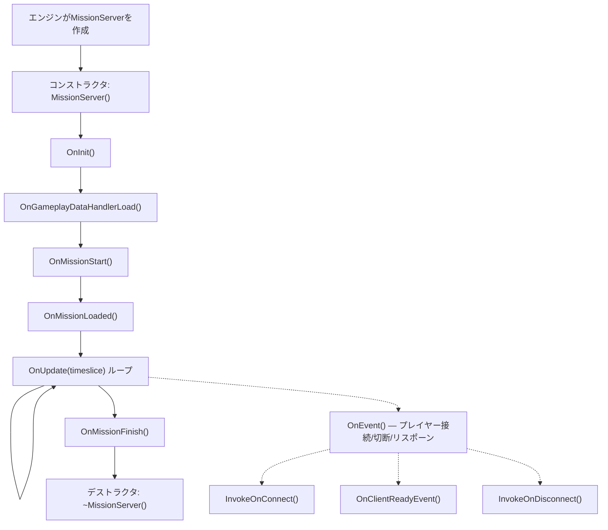
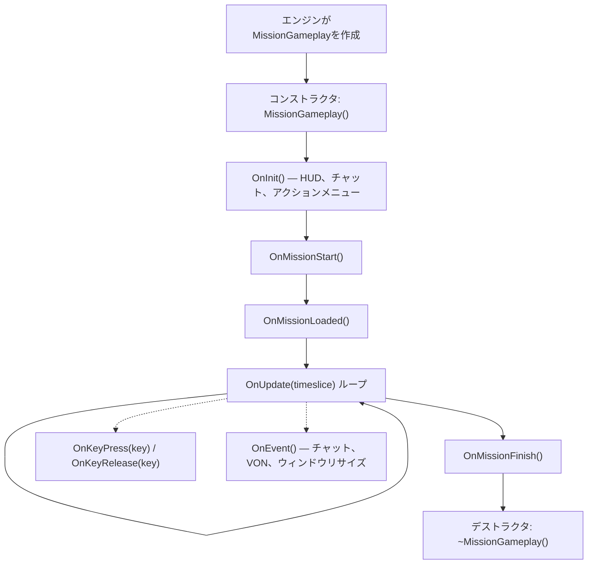
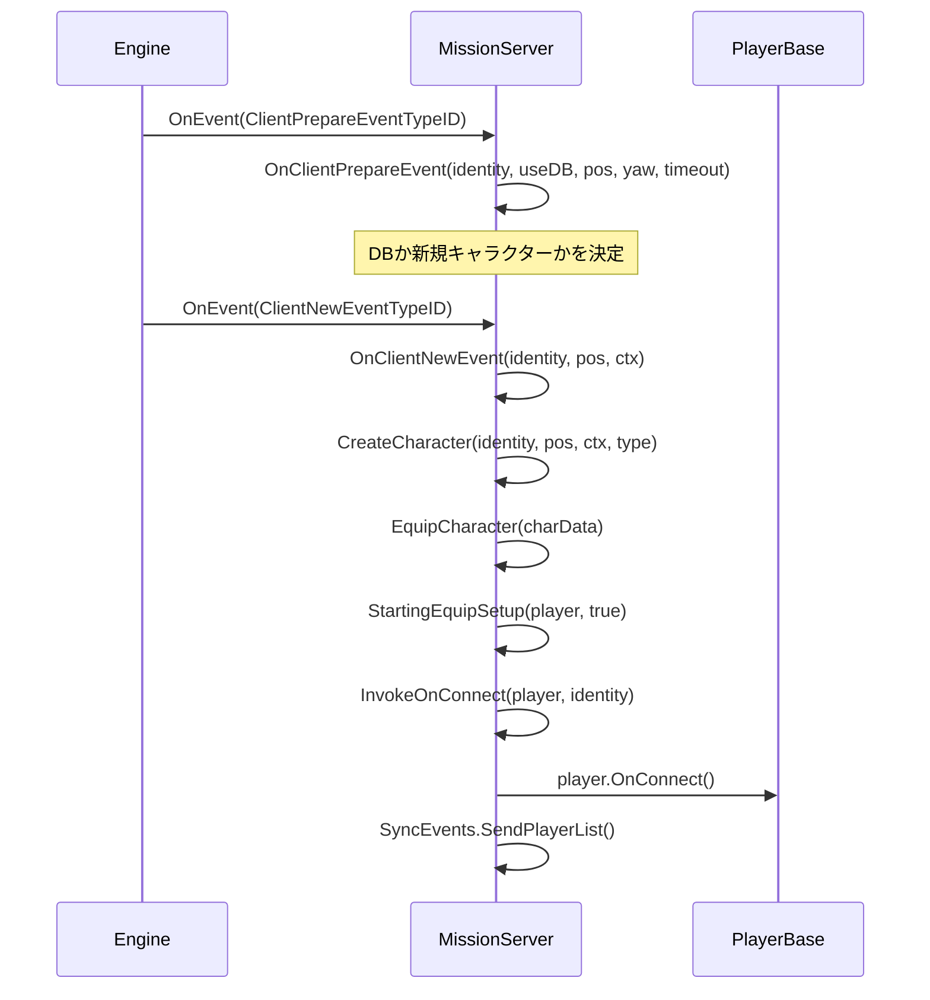
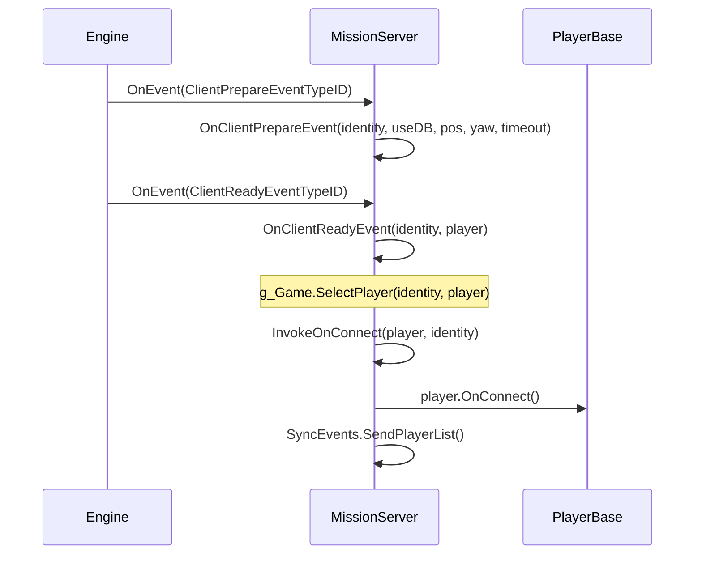
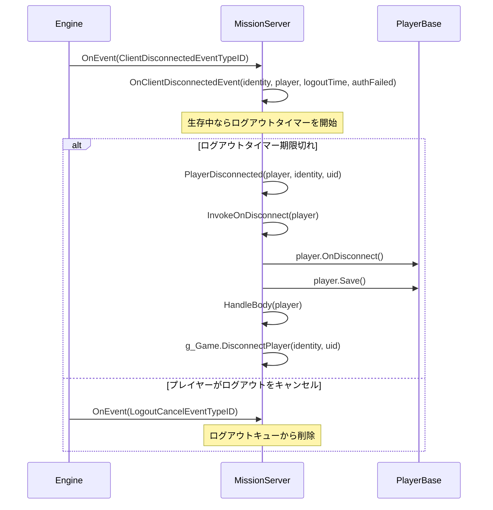

# Chapter 6.11: ミッションフック

[ホーム](../../README.md) | [<< 前: Central Economy](10-central-economy.md) | **ミッションフック** | [次: アクションシステム >>](12-action-system.md)

---

## はじめに

すべてのDayZ Modにはエントリーポイントが必要です --- マネージャーを初期化し、RPCハンドラーを登録し、プレイヤー接続にフックし、シャットダウン時にクリーンアップする場所です。そのエントリーポイントが**Mission**クラスです。エンジンはシナリオがロードされるときに、正確に1つのMissionインスタンスを作成します：専用サーバーでは`MissionServer`、クライアントでは`MissionGameplay`、リッスンサーバーでは両方です。これらのクラスは保証された順序で発火するライフサイクルフックを提供し、Modが動作を注入するための信頼できる場所を提供します。

この章では、完全なMissionクラス階層、すべてのフック可能なメソッド、それらを拡張するための正しい`modded class`パターン、およびバニラDayZ、COT、Expansionからの実際の例を扱います。

---

## クラス階層

```
Mission                      // 3_Game/gameplay.c （基底、すべてのフックシグネチャを定義）
└── MissionBaseWorld         // 4_World/classes/missionbaseworld.c （最小限のブリッジ）
    └── MissionBase          // 5_Mission/mission/missionbase.c （共有セットアップ：HUD、メニュー、プラグイン）
        ├── MissionServer    // 5_Mission/mission/missionserver.c （サーバー側）
        └── MissionGameplay  // 5_Mission/mission/missiongameplay.c （クライアント側）
```

- **Mission**はすべてのフックシグネチャを空のメソッドとして定義します：`OnInit()`、`OnUpdate()`、`OnEvent()`、`OnMissionStart()`、`OnMissionFinish()`、`OnKeyPress()`、`OnKeyRelease()`など。
- **MissionBase**はプラグインマネージャー、ウィジェットイベントハンドラー、ワールドデータ、ダイナミックミュージック、サウンドセット、入力デバイストラッキングを初期化します。サーバーとクライアントの両方の共通の親です。
- **MissionServer**はプレイヤー接続、切断、リスポーン、死体管理、ティックスケジューリング、砲撃を処理します。
- **MissionGameplay**はHUD作成、チャット、アクションメニュー、ボイスオーバーネットワークUI、インベントリ、入力除外、クライアント側プレイヤースケジューリングを処理します。

---

## ライフサイクルの概要

### MissionServerライフサイクル（サーバー側）



### MissionGameplayライフサイクル（クライアント側）



---

## Mission基底クラスのメソッド

**ファイル：** `3_Game/gameplay.c`

`Mission`基底クラスはすべてのフック可能なメソッドを定義します。特に記載がない限り、すべて空のデフォルト実装を持つ仮想メソッドです。

### ライフサイクルフック

| メソッド | シグネチャ | 発火タイミング |
|--------|-----------|---------------|
| `OnInit` | `void OnInit()` | コンストラクタの後、ミッション開始前。主要なセットアップポイントです。 |
| `OnMissionStart` | `void OnMissionStart()` | OnInitの後。ミッションワールドがアクティブです。 |
| `OnMissionLoaded` | `void OnMissionLoaded()` | OnMissionStartの後。すべてのバニラシステムが初期化済みです。 |
| `OnGameplayDataHandlerLoad` | `void OnGameplayDataHandlerLoad()` | サーバー：ゲームプレイデータ（cfggameplay.json）がロードされた後。 |
| `OnUpdate` | `void OnUpdate(float timeslice)` | 毎フレーム。`timeslice`は前フレームからの秒数です（通常0.016-0.033）。 |
| `OnMissionFinish` | `void OnMissionFinish()` | シャットダウンまたは切断時。ここですべてをクリーンアップします。 |

### 入力フック（クライアント側）

| メソッド | シグネチャ | 発火タイミング |
|--------|-----------|---------------|
| `OnKeyPress` | `void OnKeyPress(int key)` | 物理キーが押された。`key`は`KeyCode`定数です。 |
| `OnKeyRelease` | `void OnKeyRelease(int key)` | 物理キーが離された。 |
| `OnMouseButtonPress` | `void OnMouseButtonPress(int button)` | マウスボタンが押された。 |
| `OnMouseButtonRelease` | `void OnMouseButtonRelease(int button)` | マウスボタンが離された。 |

### イベントフック

| メソッド | シグネチャ | 発火タイミング |
|--------|-----------|---------------|
| `OnEvent` | `void OnEvent(EventType eventTypeId, Param params)` | エンジンイベント：チャット、VON、プレイヤー接続/切断、ウィンドウリサイズなど。 |

### ユーティリティメソッド

| メソッド | シグネチャ | 説明 |
|--------|-----------|-------------|
| `GetHud` | `Hud GetHud()` | HUDインスタンスを返します（クライアントのみ）。 |
| `GetWorldData` | `WorldData GetWorldData()` | ワールド固有のデータ（温度カーブなど）を返します。 |
| `IsPaused` | `bool IsPaused()` | ゲームが一時停止しているかどうか（シングルプレイヤー/リッスンサーバー）。 |
| `IsServer` | `bool IsServer()` | MissionServerの場合`true`、MissionGameplayの場合`false`。 |
| `IsMissionGameplay` | `bool IsMissionGameplay()` | MissionGameplayの場合`true`、MissionServerの場合`false`。 |
| `PlayerControlEnable` | `void PlayerControlEnable(bool bForceSuppress)` | 無効化後にプレイヤー入力を再有効化します。 |
| `PlayerControlDisable` | `void PlayerControlDisable(int mode)` | プレイヤー入力を無効化します（例：`INPUT_EXCLUDE_ALL`）。 |
| `IsControlDisabled` | `bool IsControlDisabled()` | プレイヤーコントロールが現在無効かどうか。 |
| `GetControlDisabledMode` | `int GetControlDisabledMode()` | 現在の入力除外モードを返します。 |

---

## MissionServerフック（サーバー側）

**ファイル：** `5_Mission/mission/missionserver.c`

MissionServerは専用サーバーでエンジンによってインスタンス化されます。サーバー上のプレイヤーライフサイクルに関するすべてを処理します。

### バニラの主な動作

- **コンストラクタ**：プレイヤー統計用の`CallQueue`（30秒間隔）、死亡プレイヤー配列、ログアウト追跡マップ、雨の処理ハンドラーをセットアップします。
- **OnInit**：`CfgGameplayHandler`、`PlayerSpawnHandler`、`CfgPlayerRestrictedAreaHandler`、`UndergroundAreaLoader`、砲撃射撃位置をロードします。
- **OnMissionStart**：エフェクトエリアゾーン（汚染ゾーンなど）を作成します。
- **OnUpdate**：ティックスケジューラを実行し、ログアウトタイマーを処理し、基本環境温度、雨の処理、ランダム砲撃を更新します。

### OnEvent --- プレイヤー接続イベント

サーバーの`OnEvent`は、すべてのプレイヤーライフサイクルイベントの中央ディスパッチャです。エンジンは型付き`Param`オブジェクトでイベントを送信します。バニラは`switch`ブロックで処理します：

| イベント | Paramタイプ | 動作 |
|-------|-----------|--------------|
| `ClientPrepareEventTypeID` | `ClientPrepareEventParams` | DBか新規キャラクターかを決定 |
| `ClientNewEventTypeID` | `ClientNewEventParams` | 新しいキャラクターを作成＋装備し、`InvokeOnConnect`を呼び出す |
| `ClientReadyEventTypeID` | `ClientReadyEventParams` | 既存キャラクターをロード、`OnClientReadyEvent` + `InvokeOnConnect`を呼び出す |
| `ClientRespawnEventTypeID` | `ClientRespawnEventParams` | プレイヤーのリスポーン要求、意識不明なら古いキャラクターを殺す |
| `ClientReconnectEventTypeID` | `ClientReconnectEventParams` | 生存キャラクターに再接続 |
| `ClientDisconnectedEventTypeID` | `ClientDisconnectedEventParams` | プレイヤーが切断中、ログアウトタイマーを開始 |
| `LogoutCancelEventTypeID` | `LogoutCancelEventParams` | プレイヤーがログアウトカウントダウンをキャンセル |

### プレイヤー接続メソッド

プレイヤー関連イベントが発火した際に`OnEvent`内から呼び出されます：

| メソッド | シグネチャ | バニラの動作 |
|--------|-----------|-----------------|
| `InvokeOnConnect` | `void InvokeOnConnect(PlayerBase player, PlayerIdentity identity)` | `player.OnConnect()`を呼び出します。主要な「プレイヤー参加」フックです。 |
| `InvokeOnDisconnect` | `void InvokeOnDisconnect(PlayerBase player)` | `player.OnDisconnect()`を呼び出します。プレイヤーが完全に切断されました。 |
| `OnClientReadyEvent` | `void OnClientReadyEvent(PlayerIdentity identity, PlayerBase player)` | `g_Game.SelectPlayer()`を呼び出します。既存キャラクターがDBからロードされました。 |
| `OnClientNewEvent` | `PlayerBase OnClientNewEvent(PlayerIdentity identity, vector pos, ParamsReadContext ctx)` | 新しいキャラクターを作成＋装備します。`PlayerBase`を返します。 |
| `OnClientRespawnEvent` | `void OnClientRespawnEvent(PlayerIdentity identity, PlayerBase player)` | 意識不明/拘束中なら古いキャラクターを殺します。 |
| `OnClientReconnectEvent` | `void OnClientReconnectEvent(PlayerIdentity identity, PlayerBase player)` | `player.OnReconnect()`を呼び出します。 |
| `PlayerDisconnected` | `void PlayerDisconnected(PlayerBase player, PlayerIdentity identity, string uid)` | `InvokeOnDisconnect`を呼び出し、プレイヤーを保存し、hiveを終了し、ボディを処理し、サーバーから削除します。 |

### キャラクターセットアップ

| メソッド | シグネチャ | 説明 |
|--------|-----------|-------------|
| `CreateCharacter` | `PlayerBase CreateCharacter(PlayerIdentity identity, vector pos, ParamsReadContext ctx, string characterName)` | `g_Game.CreatePlayer()` + `g_Game.SelectPlayer()`でプレイヤーエンティティを作成します。 |
| `EquipCharacter` | `void EquipCharacter(MenuDefaultCharacterData char_data)` | アタッチメントスロットを反復し、カスタムリスポーンが無効ならランダム化します。`StartingEquipSetup()`を呼び出します。 |
| `StartingEquipSetup` | `void StartingEquipSetup(PlayerBase player, bool clothesChosen)` | **バニラでは空** --- スターターキットのエントリーポイントです。 |

---

## MissionGameplayフック（クライアント側）

**ファイル：** `5_Mission/mission/missiongameplay.c`

MissionGameplayは、サーバーに接続する際またはシングルプレイヤーを開始する際にクライアントでインスタンス化されます。すべてのクライアント側UIと入力を管理します。

### バニラの主な動作

- **コンストラクタ**：既存のメニューを破棄し、Chat、ActionMenu、IngameHud、VoNステート、フェードタイマー、SyncEvents登録を作成します。
- **OnInit**：`m_Initialized`による二重初期化を防止します。`"gui/layouts/day_z_hud.layout"`からHUDルートウィジェット、チャットウィジェット、アクションメニュー、マイクアイコン、VoNボイスレベルウィジェット、チャットチャンネルエリアを作成します。`PPEffects.Init()`と`MapMarkerTypes.Init()`を呼び出します。
- **OnMissionStart**：カーソルを非表示にし、ミッション状態を`MISSION_STATE_GAME`に設定し、シングルプレイヤーでエフェクトエリアをロードします。
- **OnUpdate**：ローカルプレイヤーのティックスケジューラ、ホログラム更新、ラジアルクイックバー（コンソール）、ジェスチャーメニュー、インベントリ/チャット/VoNの入力処理、デバッグモニター、ポーズ動作。
- **OnMissionFinish**：ダイアログを非表示にし、すべてのメニューとチャットを破棄し、HUDルートウィジェットを削除し、すべてのPPEエフェクトを停止し、すべての入力を再有効化し、ミッション状態を`MISSION_STATE_FINNISH`に設定します。

### 入力フック

```c
override void OnKeyPress(int key)
{
    super.OnKeyPress(key);
    // バニラはHud.KeyPress(key)に転送します
    // key値はKeyCode定数です（例：KeyCode.KC_F1 = 59）
}

override void OnKeyRelease(int key)
{
    super.OnKeyRelease(key);
}
```

### イベントフック

バニラの`MissionGameplay.OnEvent()`は`ChatMessageEventTypeID`（チャットウィジェットに追加）、`ChatChannelEventTypeID`（チャンネルインジケーターを更新）、`WindowsResizeEventTypeID`（メニュー/HUDを再構築）、`SetFreeCameraEventTypeID`（デバッグカメラ）、`VONStateEventTypeID`（ボイスステート）を処理します。同じ`switch`パターンでオーバーライドし、常に`super.OnEvent()`を呼び出してください。

### 入力制御

`PlayerControlDisable(int mode)`は入力除外グループ（例：`INPUT_EXCLUDE_ALL`、`INPUT_EXCLUDE_INVENTORY`）を有効化します。`PlayerControlEnable(bool bForceSuppress)`はそれを解除します。これらは`specific.xml`で定義された除外グループにマッピングされます。Modがカスタム入力除外動作を必要とする場合はオーバーライドしてください（Expansionがメニューで行っているように）。

---

## サーバー側イベントフロー：プレイヤー参加

プレイヤーが接続する際のイベントの正確なシーケンスを理解することは、コードをどこにフックするかを知る上で重要です。

### 新規キャラクター（初回参加または死亡後）



### 既存キャラクター（切断後の再接続）



### プレイヤー切断



---

## フックの方法：modded classパターン

Missionクラスを拡張する正しい方法は`modded class`パターンです。これはEnforce Scriptのクラス継承メカニズムを使用し、`modded class`は既存のクラスを置き換えずに拡張するため、複数のModが共存できます。

### 基本的なサーバーフック

```c
// あなたのMod: Scripts/5_Mission/YourMod/MissionServer.c
modded class MissionServer
{
    ref MyServerManager m_MyManager;

    override void OnInit()
    {
        super.OnInit();  // 常にsuperを最初に呼び出す

        m_MyManager = new MyServerManager();
        m_MyManager.Init();
        Print("[MyMod] Server manager initialized");
    }

    override void OnMissionFinish()
    {
        if (m_MyManager)
        {
            m_MyManager.Cleanup();
            m_MyManager = null;
        }

        super.OnMissionFinish();  // superを呼び出す（クリーンアップの前でも後でも可）
    }
}
```

### 基本的なクライアントフック

```c
// あなたのMod: Scripts/5_Mission/YourMod/MissionGameplay.c
modded class MissionGameplay
{
    ref MyHudWidget m_MyHud;

    override void OnInit()
    {
        super.OnInit();  // 常にsuperを最初に呼び出す

        // カスタムHUD要素を作成
        m_MyHud = new MyHudWidget();
        m_MyHud.Init();
    }

    override void OnUpdate(float timeslice)
    {
        super.OnUpdate(timeslice);

        // カスタムHUDを毎フレーム更新
        if (m_MyHud)
        {
            m_MyHud.Update(timeslice);
        }
    }

    override void OnMissionFinish()
    {
        if (m_MyHud)
        {
            m_MyHud.Destroy();
            m_MyHud = null;
        }

        super.OnMissionFinish();
    }
}
```

### プレイヤー接続のフック

```c
modded class MissionServer
{
    override void InvokeOnConnect(PlayerBase player, PlayerIdentity identity)
    {
        super.InvokeOnConnect(player, identity);

        // あなたのコードはバニラとすべての先行Modの後に実行されます
        if (player && identity)
        {
            string uid = identity.GetId();
            string name = identity.GetName();
            Print("[MyMod] Player connected: " + name + " (" + uid + ")");

            // プレイヤーデータのロード、設定の送信など
            MyPlayerData.Load(uid);
        }
    }

    override void InvokeOnDisconnect(PlayerBase player)
    {
        // superの前にデータを保存（superの後にプレイヤーが削除される可能性あり）
        if (player && player.GetIdentity())
        {
            string uid = player.GetIdentity().GetId();
            MyPlayerData.Save(uid);
        }

        super.InvokeOnDisconnect(player);
    }
}
```

### チャットメッセージのフック（サーバー側OnEvent）

```c
modded class MissionServer
{
    override void OnEvent(EventType eventTypeId, Param params)
    {
        // イベントをブロックする可能性があるため、superの前にインターセプト
        if (eventTypeId == ClientNewEventTypeID)
        {
            ClientNewEventParams newParams;
            Class.CastTo(newParams, params);
            PlayerIdentity identity = newParams.param1;

            if (IsPlayerBanned(identity))
            {
                // superを呼び出さないことで接続をブロック
                return;
            }
        }

        super.OnEvent(eventTypeId, params);
    }
}
```

### キーボード入力のフック（クライアント側）

```c
modded class MissionGameplay
{
    override void OnKeyPress(int key)
    {
        super.OnKeyPress(key);

        // F6でカスタムメニューを開く
        if (key == KeyCode.KC_F6)
        {
            if (!GetGame().GetUIManager().GetMenu())
            {
                MyCustomMenu.Open();
            }
        }
    }
}
```

### RPCハンドラーの登録場所

RPCハンドラーはコンストラクタではなく`OnInit`で登録すべきです。`OnInit`の時点で、すべてのスクリプトモジュールがロードされ、ネットワークレイヤーが準備完了しています。

```c
modded class MissionServer
{
    override void OnInit()
    {
        super.OnInit();

        // ここでRPCハンドラーを登録
        GetDayZGame().Event_OnRPC.Insert(OnMyRPC);
    }

    override void OnMissionFinish()
    {
        GetDayZGame().Event_OnRPC.Remove(OnMyRPC);
        super.OnMissionFinish();
    }

    void OnMyRPC(PlayerIdentity sender, Object target, int rpc_type,
                 ParamsReadContext ctx)
    {
        // RPCを処理
    }
}
```

---

## 目的別の一般的なフック

| やりたいこと | フックするメソッド | どのクラスで |
|--------------|------------------|----------------|
| サーバーでModを初期化 | `OnInit()` | `MissionServer` |
| クライアントでModを初期化 | `OnInit()` | `MissionGameplay` |
| 毎フレームコードを実行（サーバー） | `OnUpdate(float timeslice)` | `MissionServer` |
| 毎フレームコードを実行（クライアント） | `OnUpdate(float timeslice)` | `MissionGameplay` |
| プレイヤー参加に反応 | `InvokeOnConnect(player, identity)` | `MissionServer` |
| プレイヤー退出に反応 | `InvokeOnDisconnect(player)` | `MissionServer` |
| 新しいクライアントに初期データを送信 | `OnClientReadyEvent(identity, player)` | `MissionServer` |
| 新しいキャラクタースポーンに反応 | `OnClientNewEvent(identity, pos, ctx)` | `MissionServer` |
| スターター装備を付与 | `StartingEquipSetup(player, clothesChosen)` | `MissionServer` |
| プレイヤーリスポーンに反応 | `OnClientRespawnEvent(identity, player)` | `MissionServer` |
| プレイヤー再接続に反応 | `OnClientReconnectEvent(identity, player)` | `MissionServer` |
| 切断/ログアウトロジックを処理 | `OnClientDisconnectedEvent(identity, player, logoutTime, authFailed)` | `MissionServer` |
| サーバーイベントをインターセプト（接続、チャット） | `OnEvent(eventTypeId, params)` | `MissionServer` |
| クライアントイベントをインターセプト（チャット、VON） | `OnEvent(eventTypeId, params)` | `MissionGameplay` |
| キーボード入力を処理 | `OnKeyPress(key)` / `OnKeyRelease(key)` | `MissionGameplay` |
| HUD要素を作成 | `OnInit()` | `MissionGameplay` |
| サーバーシャットダウン時にクリーンアップ | `OnMissionFinish()` | `MissionServer` |
| クライアント切断時にクリーンアップ | `OnMissionFinish()` | `MissionGameplay` |
| すべてのシステムロード後に1回コードを実行 | `OnMissionLoaded()` | どちらでも |
| プレイヤー入力を無効化/有効化 | `PlayerControlDisable(mode)` / `PlayerControlEnable(bForceSuppress)` | `MissionGameplay` |

---

## サーバー vs クライアント：どのフックがどこで発火するか

| フック | サーバー | クライアント | 備考 |
|------|--------|--------|-------|
| コンストラクタ | はい | はい | 各側で異なるクラス |
| `OnInit()` | はい | はい | |
| `OnMissionStart()` | はい | はい | |
| `OnMissionLoaded()` | はい | はい | |
| `OnGameplayDataHandlerLoad()` | はい | いいえ | cfggameplay.jsonのロード |
| `OnUpdate(timeslice)` | はい | はい | 両方が独自のフレームループを実行 |
| `OnMissionFinish()` | はい | はい | |
| `OnEvent()` | はい | はい | 各側で異なるイベントタイプ |
| `InvokeOnConnect()` | はい | いいえ | サーバーのみ |
| `InvokeOnDisconnect()` | はい | いいえ | サーバーのみ |
| `OnClientReadyEvent()` | はい | いいえ | サーバーのみ |
| `OnClientNewEvent()` | はい | いいえ | サーバーのみ |
| `OnClientRespawnEvent()` | はい | いいえ | サーバーのみ |
| `OnClientReconnectEvent()` | はい | いいえ | サーバーのみ |
| `OnClientDisconnectedEvent()` | はい | いいえ | サーバーのみ |
| `PlayerDisconnected()` | はい | いいえ | サーバーのみ |
| `StartingEquipSetup()` | はい | いいえ | サーバーのみ |
| `EquipCharacter()` | はい | いいえ | サーバーのみ |
| `OnKeyPress()` | いいえ | はい | クライアントのみ |
| `OnKeyRelease()` | いいえ | はい | クライアントのみ |
| `OnMouseButtonPress()` | いいえ | はい | クライアントのみ |
| `OnMouseButtonRelease()` | いいえ | はい | クライアントのみ |
| `PlayerControlDisable()` | いいえ | はい | クライアントのみ |
| `PlayerControlEnable()` | いいえ | はい | クライアントのみ |

---

## EventType定数リファレンス

すべてのイベント定数は`3_Game/gameplay.c`で定義され、`OnEvent()`を通じてディスパッチされます。

| 定数 | 側 | 説明 |
|----------|------|-------------|
| `ClientPrepareEventTypeID` | サーバー | プレイヤーIDを受信、DBか新規かを決定 |
| `ClientNewEventTypeID` | サーバー | 新しいキャラクターが作成中 |
| `ClientReadyEventTypeID` | サーバー | 既存キャラクターがDBからロード済み |
| `ClientRespawnEventTypeID` | サーバー | プレイヤーがリスポーンを要求 |
| `ClientReconnectEventTypeID` | サーバー | プレイヤーが生存キャラクターに再接続 |
| `ClientDisconnectedEventTypeID` | サーバー | プレイヤーが切断中 |
| `LogoutCancelEventTypeID` | サーバー | プレイヤーがログアウトカウントダウンをキャンセル |
| `ChatMessageEventTypeID` | クライアント | チャットメッセージを受信（`ChatMessageEventParams`） |
| `ChatChannelEventTypeID` | クライアント | チャットチャンネルが変更（`ChatChannelEventParams`） |
| `VONStateEventTypeID` | クライアント | ボイスオーバーネットワーク状態が変更 |
| `VONStartSpeakingEventTypeID` | クライアント | プレイヤーが発言を開始 |
| `VONStopSpeakingEventTypeID` | クライアント | プレイヤーが発言を停止 |
| `MPSessionStartEventTypeID` | 両方 | マルチプレイヤーセッションが開始 |
| `MPSessionEndEventTypeID` | 両方 | マルチプレイヤーセッションが終了 |
| `MPConnectionLostEventTypeID` | クライアント | サーバーとの接続が切断 |
| `PlayerDeathEventTypeID` | 両方 | プレイヤーが死亡 |
| `SetFreeCameraEventTypeID` | クライアント | フリーカメラが切り替え（デバッグ） |

---

## 実際の使用例

### 例1：サーバーマネージャーの初期化

定期タスクを実行する必要があるサーバー側マネージャーを初期化する一般的なパターンです。

```c
modded class MissionServer
{
    ref MyTraderManager m_TraderManager;
    float m_TraderUpdateTimer;
    const float TRADER_UPDATE_INTERVAL = 5.0; // 秒

    override void OnInit()
    {
        super.OnInit();

        m_TraderManager = new MyTraderManager();
        m_TraderManager.LoadConfig();
        m_TraderManager.SpawnTraders();
        m_TraderUpdateTimer = 0;

        Print("[MyMod] Trader manager initialized");
    }

    override void OnUpdate(float timeslice)
    {
        super.OnUpdate(timeslice);

        // トレーダー更新を5秒ごとにフレーム制限
        m_TraderUpdateTimer += timeslice;
        if (m_TraderUpdateTimer >= TRADER_UPDATE_INTERVAL)
        {
            m_TraderUpdateTimer = 0;
            m_TraderManager.Update();
        }
    }

    override void OnMissionFinish()
    {
        if (m_TraderManager)
        {
            m_TraderManager.SaveState();
            m_TraderManager.DespawnTraders();
            m_TraderManager = null;
        }

        super.OnMissionFinish();
    }
}
```

### 例2：接続時のプレイヤーデータロード

```c
modded class MissionServer
{
    override void InvokeOnConnect(PlayerBase player, PlayerIdentity identity)
    {
        super.InvokeOnConnect(player, identity);
        if (!player || !identity)
            return;

        string uid = identity.GetId();
        string path = "$profile:MyMod/Players/" + uid + ".json";
        ref MyPlayerStats stats = new MyPlayerStats();

        if (FileExist(path))
            JsonFileLoader<MyPlayerStats>.JsonLoadFile(path, stats);
        else
            stats.SetDefaults();

        player.m_MyStats = stats;

        // 初期データをクライアントに送信
        ScriptRPC rpc = new ScriptRPC();
        rpc.Write(stats.GetKills());
        rpc.Write(stats.GetDeaths());
        rpc.Send(player, MY_RPC_SYNC_STATS, true, identity);
    }

    override void InvokeOnDisconnect(PlayerBase player)
    {
        if (player && player.GetIdentity() && player.m_MyStats)
        {
            string path = "$profile:MyMod/Players/" + player.GetIdentity().GetId() + ".json";
            JsonFileLoader<MyPlayerStats>.JsonSaveFile(path, player.m_MyStats);
        }
        super.InvokeOnDisconnect(player);
    }
}
```

### 例3：クライアントHUDの作成

毎フレーム更新するカスタムHUD要素を作成します。

```c
modded class MissionGameplay
{
    ref Widget m_MyHudRoot;
    ref TextWidget m_MyStatusText;
    float m_HudUpdateTimer;

    override void OnInit()
    {
        super.OnInit();

        // レイアウトファイルからHUDを作成
        m_MyHudRoot = GetGame().GetWorkspace().CreateWidgets(
            "MyMod/gui/layouts/my_hud.layout"
        );

        if (m_MyHudRoot)
        {
            m_MyStatusText = TextWidget.Cast(
                m_MyHudRoot.FindAnyWidget("StatusText")
            );
            m_MyHudRoot.Show(true);
        }

        m_HudUpdateTimer = 0;
    }

    override void OnUpdate(float timeslice)
    {
        super.OnUpdate(timeslice);

        // HUDテキストを毎フレームではなく0.5秒ごとに更新
        m_HudUpdateTimer += timeslice;
        if (m_HudUpdateTimer >= 0.5)
        {
            m_HudUpdateTimer = 0;
            UpdateMyHud();
        }
    }

    void UpdateMyHud()
    {
        PlayerBase player = PlayerBase.Cast(GetGame().GetPlayer());
        if (!player || !m_MyStatusText)
            return;

        string status = "Health: " + player.GetHealth("", "").ToString();
        m_MyStatusText.SetText(status);
    }

    override void OnMissionFinish()
    {
        if (m_MyHudRoot)
        {
            m_MyHudRoot.Unlink();
            m_MyHudRoot = null;
        }

        super.OnMissionFinish();
    }
}
```

### 例4：チャットコマンドのインターセプト（サーバー側）

BANシステムを実装するためにプレイヤー接続をインターセプトします。このパターンはCOTで使用されています。

```c
modded class MissionServer
{
    override void OnEvent(EventType eventTypeId, Param params)
    {
        // superが接続を処理する前にBANを確認
        if (eventTypeId == ClientNewEventTypeID)
        {
            ClientNewEventParams newParams;
            Class.CastTo(newParams, params);
            PlayerIdentity identity = newParams.param1;

            if (identity && IsBanned(identity.GetId()))
            {
                Print("[MyMod] Blocked banned player: " + identity.GetId());
                // superを呼び出さない --- 接続をブロック
                return;
            }
        }

        super.OnEvent(eventTypeId, params);
    }

    bool IsBanned(string uid)
    {
        string path = "$profile:MyMod/Bans/" + uid + ".json";
        return FileExist(path);
    }
}
```

### 例5：StartingEquipSetupによるスターターキット

`OnClientNewEvent`に触れずに新しいプレイヤーに装備を与える最もクリーンな方法です。

```c
modded class MissionServer
{
    override void StartingEquipSetup(PlayerBase player, bool clothesChosen)
    {
        super.StartingEquipSetup(player, clothesChosen);

        if (!player)
            return;

        // すべての新しいキャラクターにナイフと包帯を付与
        EntityAI knife = player.GetInventory().CreateInInventory("KitchenKnife");
        EntityAI bandage = player.GetInventory().CreateInInventory("BandageDressing");

        // バックパックがあればその中に食料を付与
        EntityAI backpack = player.FindAttachmentBySlotName("Back");
        if (backpack)
        {
            backpack.GetInventory().CreateInInventory("SardinesCan");
            backpack.GetInventory().CreateInInventory("Canteen");
        }
    }
}
```

### パターン：中央マネージャーへの委譲

COTとExpansionはどちらも同じパターンに従います：ミッションフックはシングルトンマネージャーに委譲する薄いラッパーです。COTはコンストラクタで`g_cotBase = new CommunityOnlineTools`を作成し、対応するフックから`g_cotBase.OnStart()` / `OnUpdate()` / `OnFinish()`を呼び出します。Expansionも`GetDayZExpansion().OnStart()` / `OnLoaded()` / `OnFinish()`で同様に行います。あなたのModもこのパターンに従うべきです --- ミッションフックコードを薄く保ち、ロジックを専用のマネージャークラスに押し出してください。

---

## OnInit vs OnMissionStart vs OnMissionLoaded

| フック | タイミング | 用途 |
|------|------|---------|
| `OnInit()` | 最初。スクリプトモジュールがロード済み、ワールドはまだアクティブではない。 | マネージャーの作成、RPCの登録、configのロード。 |
| `OnMissionStart()` | 2番目。ワールドがアクティブ、エンティティをスポーンできる。 | エンティティのスポーン、ゲームプレイシステムの開始、トリガーの作成。 |
| `OnMissionLoaded()` | 3番目。すべてのバニラシステムが完全に初期化済み。 | クロスModクエリ、すべてが準備完了であることに依存するファイナライゼーション。 |

3つすべてで常に`super`を呼び出してください。主要な初期化ポイントとして`OnInit`を使用してください。他のModがすでに初期化されていることを保証する必要がある場合にのみ`OnMissionLoaded`を使用してください。

---

## 現在のミッションへのアクセス

```c
Mission mission = GetGame().GetMission();                                    // 基底クラス
MissionServer serverMission = MissionServer.Cast(GetGame().GetMission());   // サーバーキャスト
MissionGameplay clientMission = MissionGameplay.Cast(GetGame().GetMission()); // クライアントキャスト
PlayerBase player = PlayerBase.Cast(GetGame().GetPlayer());                  // クライアントのみ（サーバーではnull）
```

---

## よくある間違い

### 1. super.OnInit()の呼び忘れ

すべての`override`は**必ず**`super`を呼び出す必要があります。呼び忘れるとバニラとチェーン内の他のすべてのModが壊れます。これは最も一般的なModding上の間違いです。

```c
// 間違い                                   // 正しい
override void OnInit()                      override void OnInit()
{                                           {
    m_MyManager = new MyManager();              super.OnInit();  // 常に最初に！
}                                               m_MyManager = new MyManager();
                                            }
```

### 2. サーバーでGetGame().GetPlayer()を使用

`GetGame().GetPlayer()`は専用サーバーでは**常にnull**です。「ローカル」プレイヤーは存在しません。すべての接続プレイヤーを反復するには`GetGame().GetPlayers(array)`を使用してください。

```c
// サーバーでプレイヤーを反復する正しい方法
array<Man> players = new array<Man>();
GetGame().GetPlayers(players);
foreach (Man man : players)
{
    PlayerBase player = PlayerBase.Cast(man);
    if (player) { /* 処理 */ }
}
```

### 3. OnMissionFinishでのクリーンアップ忘れ

`OnMissionFinish()`では常にウィジェット、コールバック、参照をクリーンアップしてください。クリーンアップなしでは、ウィジェットが次のミッションロードにリークし（クライアント）、古い参照がサーバー再起動を超えて残ります。

```c
override void OnMissionFinish()
{
    if (m_MyWidget) { m_MyWidget.Unlink(); m_MyWidget = null; }
    super.OnMissionFinish();
}
```

### 4. フレーム制限なしのOnUpdate

`OnUpdate`は毎フレーム発火します（15-60+ FPS）。重要でない作業にはタイマーアキュムレータを使用してください。

```c
m_Timer += timeslice;
if (m_Timer >= 10.0)  // 10秒ごと
{
    m_Timer = 0;
    DoExpensiveWork();
}
```

### 5. コンストラクタでのRPC登録

コンストラクタはすべてのスクリプトモジュールがロードされる前に実行されます。コールバックは`OnInit()`（最も早い安全なポイント）で登録し、`OnMissionFinish()`で登録解除してください。

### 6. 切断中プレイヤーのIdentityへのアクセス

切断中に`player.GetIdentity()`は`null`を返す可能性があります。アクセス前に常に`player`と`identity`の両方をnullチェックしてください。

```c
override void InvokeOnDisconnect(PlayerBase player)
{
    if (player)
    {
        PlayerIdentity identity = player.GetIdentity();
        if (identity)
            Print("[MyMod] Disconnected: " + identity.GetId());
    }
    super.InvokeOnDisconnect(player);
}
```

---

## まとめ

| 概念 | 要点 |
|---------|-----------|
| Mission階層 | `Mission` > `MissionBaseWorld` > `MissionBase` > `MissionServer` / `MissionGameplay` |
| サーバークラス | `MissionServer` --- プレイヤー接続、スポーン、ティックスケジューリングを処理 |
| クライアントクラス | `MissionGameplay` --- HUD、入力、チャット、メニューを処理 |
| ライフサイクル順序 | コンストラクタ > `OnInit()` > `OnMissionStart()` > `OnMissionLoaded()` > `OnUpdate()`ループ > `OnMissionFinish()` > デストラクタ |
| プレイヤー参加（サーバー） | `OnEvent(ClientNewEventTypeID/ClientReadyEventTypeID)` > `InvokeOnConnect()` |
| プレイヤー退出（サーバー） | `OnEvent(ClientDisconnectedEventTypeID)` > `PlayerDisconnected()` > `InvokeOnDisconnect()` |
| フックパターン | `modded class MissionServer/MissionGameplay`で`override`と`super`呼び出し |
| 入力処理 | `MissionGameplay`の`OnKeyPress(key)` / `OnKeyRelease(key)`（クライアントのみ） |
| イベント処理 | 両側で`OnEvent(EventType, Param)`、各側で異なるイベントタイプ |
| super呼び出し | **すべてのoverrideで常にsuperを呼び出す**。さもなければModチェーン全体が壊れます |
| クリーンアップ | **常に`OnMissionFinish()`でクリーンアップ** --- RPCハンドラーを削除、ウィジェットを破棄、参照をnull化 |
| フレーム制限 | 重要でない作業には`OnUpdate()`でタイマーアキュムレータを使用 |
| GetPlayer() | クライアントでのみ動作。専用サーバーでは常に`null`を返す |
| RPC登録 | コンストラクタではなく`OnInit()`で登録。`OnMissionFinish()`で登録解除 |

---

## ベストプラクティス

- **すべてのMissionオーバーライドの最初の行として常に`super`を呼び出してください。** これは最も一般的なDayZ Moddingの間違いです。`super.OnInit()`の呼び忘れは、バニラの初期化とチェーン内の他のすべてのModをサイレントに壊します。
- **ミッションフックコードを薄く保ち --- マネージャークラスに委譲してください。** シングルトンマネージャー（例：`MyModManager`）を作成し、フックから`manager.Init()` / `manager.Update()` / `manager.Cleanup()`を呼び出してください。これはCOTとExpansionが使用するパターンを反映しています。
- **毎フレーム実行する必要のない作業には`OnUpdate()`でタイマーアキュムレータを使用してください。** `OnUpdate`は毎秒15-60回以上発火します。フレームレートでデータベースクエリ、ファイルI/O、プレイヤー反復を実行するとサーバーCPUが無駄になります。
- **RPCとイベントハンドラーはコンストラクタではなく`OnInit()`で登録してください。** コンストラクタはすべてのスクリプトモジュールがロードされる前に実行されます。ネットワークレイヤーは`OnInit()`まで準備ができていません。
- **常に`OnMissionFinish()`でクリーンアップしてください。** ウィジェットを破棄し、`CallLater`登録を削除し、RPCハンドラーの登録を解除し、マネージャー参照をnull化してください。クリーンアップしないと、ミッションリロード間で古い参照が残ります。

---

## 互換性と影響

> **Mod互換性：** `MissionServer`と`MissionGameplay`は、DayZで最も一般的にモッディングされる2つのクラスです。サーバーロジックやクライアントUIを持つすべてのModがこれらにフックします。

- **ロード順序：** 最後にロードされたModの`modded class`オーバーライドが、呼び出しチェーンの最外層で実行されます。Modが`super`を忘れると、その前にロードされたすべてのModをサイレントにブロックします。これがマルチMod非互換性の第1位の原因です。
- **Modded Classの競合：** `InvokeOnConnect`、`InvokeOnDisconnect`、`OnInit`、`OnUpdate`、`OnMissionFinish`が最も競合するオーバーライドポイントです。すべてのModが`super`を呼び出す限り、競合はまれです。
- **パフォーマンスへの影響：** フレーム制限なしの`OnUpdate()`での重い処理は、サーバー/クライアントのFPSを直接低下させます。60人のプレイヤーがいるサーバーで毎フレーム`GetGame().GetPlayers()`反復を行う単一のModは、測定可能なオーバーヘッドを追加します。
- **サーバー/クライアント：** `MissionServer`フックは専用サーバーでのみ発火します。`MissionGameplay`フックはクライアントでのみ発火します。リッスンサーバーでは両方のクラスが存在します。`GetGame().GetPlayer()`は専用サーバーでは常にnullです。

---

## 実際のModで確認されたパターン

> これらのパターンは、プロフェッショナルなDayZ Modのソースコードを調査して確認されました。

| パターン | Mod | ファイル/場所 |
|---------|-----|---------------|
| シングルトンマネージャーに委譲する薄い`modded class MissionServer.OnInit()` | COT | MissionServerでの`CommunityOnlineTools`初期化 |
| プレイヤーごとのJSONデータをロードする`InvokeOnConnect`オーバーライド | Expansion | 接続時のプレイヤー設定同期 |
| カスタムスターターキット用の`StartingEquipSetup`オーバーライド | 複数のコミュニティMod | MissionServerのスターターキットフック |
| BANされたプレイヤーをブロックするための`super`前の`OnEvent`インターセプト | COT | MissionServerでのBANシステム |
| ウィジェット`Unlink()`とnull代入による`OnMissionFinish`クリーンアップ | Expansion | HUDとメニューのクリーンアップ |

---

[<< 前: Central Economy](10-central-economy.md) | **ミッションフック** | [次: アクションシステム >>](12-action-system.md)
