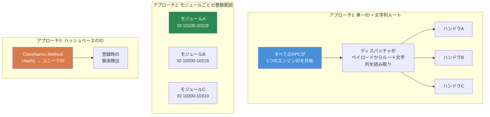

# 第7.3章: RPC通信パターン

[ホーム](../../README.md) | [<< 前へ: モジュールシステム](02-module-systems.md) | **RPC通信パターン** | [次へ: 設定の永続化 >>](04-config-persistence.md)

---

## はじめに

リモートプロシージャコール（RPC）は、DayZでクライアントとサーバー間でデータを送信する唯一の方法です。すべての管理パネル、すべての同期UI、すべてのサーバーからクライアントへの通知、すべてのクライアントからサーバーへのアクション要求は、RPCを通じて流れます。適切なシリアル化順序、権限チェック、エラー処理でRPCを正しく構築する方法を理解することは、CfgVehiclesにアイテムを追加する以上のことを行うMODにとって不可欠です。

この章では、基本的な `ScriptRPC` パターン、クライアント-サーバー往復ライフサイクル、エラー処理をカバーし、DayZ MODコミュニティで使用されている3つの主要なRPCルーティングアプローチを比較します。

---

## 目次

- [ScriptRPCの基礎](#scriptrpcの基礎)
- [クライアントからサーバーへ、サーバーからクライアントへの往復](#クライアントからサーバーへサーバーからクライアントへの往復)
- [実行前の権限チェック](#実行前の権限チェック)
- [エラー処理と通知](#エラー処理と通知)
- [シリアル化: Read/Write契約](#シリアル化-readwrite契約)
- [3つのRPCアプローチの比較](#3つのrpcアプローチの比較)
- [よくある間違い](#よくある間違い)
- [ベストプラクティス](#ベストプラクティス)

---

## ScriptRPCの基礎

DayZのすべてのRPCは `ScriptRPC` クラスを使用します。パターンは常に同じです: 作成、データの書き込み、送信。

### 送信側

```c
void SendDamageReport(PlayerIdentity target, string weaponName, float damage)
{
    ScriptRPC rpc = new ScriptRPC();

    // 特定の順序でフィールドを書き込む
    rpc.Write(weaponName);    // フィールド1: string
    rpc.Write(damage);        // フィールド2: float

    // エンジンを通じて送信
    // パラメータ: ターゲットオブジェクト、RPC ID、保証配信、受信者
    rpc.Send(null, MY_RPC_ID, true, target);
}
```

### 受信側

受信者は書き込まれたのと**まったく同じ順序**でフィールドを読み取ります:

```c
void OnRPC_DamageReport(PlayerIdentity sender, Object target, ParamsReadContext ctx)
{
    string weaponName;
    if (!ctx.Read(weaponName)) return;  // フィールド1: string

    float damage;
    if (!ctx.Read(damage)) return;      // フィールド2: float

    // データを使用
    Print("Hit by " + weaponName + " for " + damage.ToString() + " damage");
}
```

### Sendパラメータの説明

```c
rpc.Send(object, rpcId, guaranteed, identity);
```

| パラメータ | 型 | 説明 |
|-----------|------|-------------|
| `object` | `Object` | ターゲットエンティティ（例: プレイヤーまたは車両）。グローバルRPCには `null` を使用。 |
| `rpcId` | `int` | このRPC型を識別する整数。両側で一致する必要があります。 |
| `guaranteed` | `bool` | `true` = 信頼性あり（TCP的、損失時に再送信）。`false` = 信頼性なし（ファイアアンドフォーゲット）。 |
| `identity` | `PlayerIdentity` | 受信者。クライアントからの `null` = サーバーに送信。サーバーからの `null` = 全クライアントにブロードキャスト。特定のidentity = そのクライアントのみに送信。 |

### `guaranteed` の使い分け

- **`true`（信頼性あり）:** 設定変更、権限付与、テレポートコマンド、BAN操作 --- パケットのドロップがクライアントとサーバーの同期を崩す可能性があるもの。
- **`false`（信頼性なし）:** 高速な位置更新、視覚効果、数秒ごとにリフレッシュされるHUD状態。オーバーヘッドが低く、再送信キューなし。

---

## クライアントからサーバーへ、サーバーからクライアントへの往復

最も一般的なRPCパターンは往復です: クライアントがアクションを要求し、サーバーが検証・実行し、サーバーが結果を返送します。

```
CLIENT                          SERVER
  │                               │
  │  1. リクエストRPC ───────────►  │
  │     (アクション + パラメータ)     │
  │                               │  2. 権限を検証
  │                               │  3. アクションを実行
  │                               │  4. レスポンスを準備
  │  ◄─────────── 5. レスポンスRPC │
  │     (結果 + データ)            │
  │                               │
  │  6. UIを更新                   │
```

### 完全な例: テレポートリクエスト

**クライアントがリクエストを送信:**

```c
class TeleportClient
{
    void RequestTeleport(vector position)
    {
        ScriptRPC rpc = new ScriptRPC();
        rpc.Write(position);
        rpc.Send(null, MY_RPC_TELEPORT, true, null);  // null identity = サーバーに送信
    }
};
```

**サーバーが受信、検証、実行、応答:**

```c
class TeleportServer
{
    void OnRPC_TeleportRequest(PlayerIdentity sender, Object target, ParamsReadContext ctx)
    {
        // 1. リクエストデータを読み取り
        vector position;
        if (!ctx.Read(position)) return;

        // 2. 権限を検証
        if (!MyPermissions.GetInstance().HasPermission(sender.GetPlainId(), "MyMod.Admin.Teleport"))
        {
            SendError(sender, "No permission to teleport");
            return;
        }

        // 3. データを検証
        if (position[1] < 0 || position[1] > 1000)
        {
            SendError(sender, "Invalid teleport height");
            return;
        }

        // 4. アクションを実行
        PlayerBase player = PlayerBase.Cast(sender.GetPlayer());
        if (!player) return;

        player.SetPosition(position);

        // 5. 成功レスポンスを送信
        ScriptRPC response = new ScriptRPC();
        response.Write(true);           // 成功フラグ
        response.Write(position);       // 位置をエコーバック
        response.Send(null, MY_RPC_TELEPORT_RESULT, true, sender);
    }
};
```

**クライアントがレスポンスを受信:**

```c
class TeleportClient
{
    void OnRPC_TeleportResult(PlayerIdentity sender, Object target, ParamsReadContext ctx)
    {
        bool success;
        if (!ctx.Read(success)) return;

        vector position;
        if (!ctx.Read(position)) return;

        if (success)
        {
            // UIを更新: "X, Y, Z にテレポートしました"
        }
    }
};
```

---

## 実行前の権限チェック

特権アクションを実行するすべてのサーバーサイドRPCハンドラは、実行前に権限を**必ず**チェックする必要があります。クライアントを決して信頼しないでください。

### パターン

```c
void OnRPC_AdminAction(PlayerIdentity sender, Object target, ParamsReadContext ctx)
{
    // ルール1: 送信者が存在することを常に検証
    if (!sender) return;

    // ルール2: データを読み取る前に権限をチェック
    if (!MyPermissions.GetInstance().HasPermission(sender.GetPlainId(), "MyMod.Admin.Ban"))
    {
        MyLog.Warning("BanRPC", "Unauthorized ban attempt from " + sender.GetName());
        return;
    }

    // ルール3: ここでようやくデータを読み取り実行
    string targetUid;
    if (!ctx.Read(targetUid)) return;

    // ... BANを実行
}
```

### なぜデータを読み取る前にチェックするのか?

権限のないクライアントからのデータ読み取りはサーバーのCPUサイクルを浪費します。さらに重要なのは、悪意のあるクライアントからの不正なデータがパースエラーを引き起こす可能性があることです。最初に権限をチェックすることは、不正アクターを即座に拒否する低コストなガードです。

### 権限のない試行をログに記録する

失敗した権限チェックを常にログに記録してください。これにより監査証跡が作成され、サーバーオーナーがエクスプロイトの試みを検出するのに役立ちます:

```c
if (!HasPermission(sender, "MyMod.Spawn"))
{
    MyLog.Warning("SpawnRPC", "Denied spawn request from "
        + sender.GetName() + " (" + sender.GetPlainId() + ")");
    return;
}
```

---

## エラー処理と通知

RPCは複数の方法で失敗する可能性があります: ネットワーク切断、不正なデータ、サーバーサイドの検証失敗。堅牢なMODはこれらすべてを処理します。

### 読み取りの失敗

すべての `ctx.Read()` は失敗する可能性があります。常に戻り値をチェックしてください:

```c
// 悪い例: 読み取りの失敗を無視
string name;
ctx.Read(name);     // 失敗すると、nameは"" — サイレントな破損
int count;
ctx.Read(count);    // 誤ったバイトを読み取る — 以降すべてがゴミ

// 良い例: 読み取り失敗時に早期リターン
string name;
if (!ctx.Read(name)) return;
int count;
if (!ctx.Read(count)) return;
```

### エラーレスポンスパターン

サーバーがリクエストを拒否した場合、UIがそれを表示できるように構造化されたエラーをクライアントに返送します:

```c
// サーバー: エラーを送信
void SendError(PlayerIdentity target, string errorMsg)
{
    ScriptRPC rpc = new ScriptRPC();
    rpc.Write(false);        // success = false
    rpc.Write(errorMsg);     // 理由
    rpc.Send(null, MY_RPC_RESPONSE_ID, true, target);
}

// クライアント: エラーを処理
void OnRPC_Response(PlayerIdentity sender, Object target, ParamsReadContext ctx)
{
    bool success;
    if (!ctx.Read(success)) return;

    if (!success)
    {
        string errorMsg;
        if (!ctx.Read(errorMsg)) return;

        // UIでエラーを表示
        MyLog.Warning("MyMod", "Server error: " + errorMsg);
        return;
    }

    // 成功を処理...
}
```

### 通知のブロードキャスト

すべてのクライアントが見るべきイベント（キルフィード、アナウンス、天候変化）については、サーバーが `identity = null` でブロードキャストします:

```c
// サーバー: 全クライアントにブロードキャスト
void BroadcastAnnouncement(string message)
{
    ScriptRPC rpc = new ScriptRPC();
    rpc.Write(message);
    rpc.Send(null, RPC_ANNOUNCEMENT, true, null);  // null = 全クライアント
}
```

---

## シリアル化: Read/Write契約

DayZ RPCの最も重要なルール: **Read順序は型ごとにWrite順序と正確に一致する必要があります。**

### 契約

```c
// 送信者が書き込み:
rpc.Write("hello");      // 1. string
rpc.Write(42);           // 2. int
rpc.Write(3.14);         // 3. float
rpc.Write(true);         // 4. bool

// 受信者が同じ順序で読み取り:
string s;   ctx.Read(s);     // 1. string
int i;      ctx.Read(i);     // 2. int
float f;    ctx.Read(f);     // 3. float
bool b;     ctx.Read(b);     // 4. bool
```

### 順序が一致しない場合に起こること

読み取り順序を入れ替えると、デシリアライザは一方の型用のバイトを別の型として解釈します。`string` が書き込まれた場所で `int` を読み取ると、ゴミが生成され、以降のすべての読み取りがオフセットされ --- 残りのすべてのフィールドが破損します。エンジンは例外をスローしません。静かに誤ったデータを返すか、`Read()` が `false` を返します。

### サポートされる型

| 型 | 備考 |
|------|-------|
| `int` | 32ビット符号付き |
| `float` | 32ビットIEEE 754 |
| `bool` | 単一バイト |
| `string` | 長さプレフィックス付きUTF-8 |
| `vector` | 3つのfloat (x, y, z) |
| `Object`（targetパラメータとして） | エンティティ参照、エンジンが解決 |

### コレクションのシリアル化

組み込みの配列シリアル化はありません。まずカウントを書き込み、次に各要素を書き込みます:

```c
// 送信者
array<string> names = {"Alice", "Bob", "Charlie"};
rpc.Write(names.Count());
for (int i = 0; i < names.Count(); i++)
{
    rpc.Write(names[i]);
}

// 受信者
int count;
if (!ctx.Read(count)) return;

array<string> names = new array<string>();
for (int i = 0; i < count; i++)
{
    string name;
    if (!ctx.Read(name)) return;
    names.Insert(name);
}
```

### 複雑なオブジェクトのシリアル化

複雑なデータの場合、フィールドごとにシリアル化します。`Write()` でオブジェクトを直接渡そうとしないでください:

```c
// 送信者: オブジェクトをプリミティブにフラット化
rpc.Write(player.GetName());
rpc.Write(player.GetHealth());
rpc.Write(player.GetPosition());

// 受信者: 再構築
string name;    ctx.Read(name);
float health;   ctx.Read(health);
vector pos;     ctx.Read(pos);
```

---

## 3つのRPCアプローチの比較

DayZ MODコミュニティは、RPCルーティングに3つの根本的に異なるアプローチを使用しています。それぞれにトレードオフがあります。



### 1. CF名前付きRPC

Community Frameworkは `GetRPCManager()` を提供し、MOD名前空間でグループ化された文字列名でRPCをルーティングします。

```c
// 登録（OnInit内）:
GetRPCManager().AddRPC("MyMod", "RPC_SpawnItem", this, SingleplayerExecutionType.Server);

// クライアントからの送信:
GetRPCManager().SendRPC("MyMod", "RPC_SpawnItem", new Param1<string>("AK74"), true);

// ハンドラが受信:
void RPC_SpawnItem(CallType type, ParamsReadContext ctx, PlayerIdentity sender, Object target)
{
    if (type != CallType.Server) return;

    Param1<string> data;
    if (!ctx.Read(data)) return;

    string className = data.param1;
    // ... アイテムをスポーン
}
```

**メリット:**
- 文字列ベースのルーティングは人間が読みやすく、衝突がない
- 名前空間のグループ化（`"MyMod"`）がMOD間の名前衝突を防ぐ
- 広く使用 --- COT/Expansionと統合する場合はこれを使用

**デメリット:**
- CFが依存として必要
- 複雑なペイロードには冗長な `Param` ラッパーを使用
- すべてのディスパッチで文字列比較（軽微なオーバーヘッド）

### 2. COT / バニラ整数範囲RPC

バニラDayZとCOTの一部は生の整数RPC IDを使用します。各MODが整数の範囲を確保し、modded `OnRPC` オーバーライドでディスパッチします。

```c
// RPC IDを定義（衝突を避けるためにユニークな範囲を選択）
const int MY_RPC_SPAWN_ITEM     = 90001;
const int MY_RPC_DELETE_ITEM    = 90002;
const int MY_RPC_TELEPORT       = 90003;

// 送信:
ScriptRPC rpc = new ScriptRPC();
rpc.Write("AK74");
rpc.Send(null, MY_RPC_SPAWN_ITEM, true, null);

// 受信（modded DayZGameまたはエンティティ内）:
modded class DayZGame
{
    override void OnRPC(PlayerIdentity sender, Object target, int rpc_type, ParamsReadContext ctx)
    {
        switch (rpc_type)
        {
            case MY_RPC_SPAWN_ITEM:
                HandleSpawnItem(sender, ctx);
                return;
            case MY_RPC_DELETE_ITEM:
                HandleDeleteItem(sender, ctx);
                return;
        }

        super.OnRPC(sender, target, rpc_type, ctx);
    }
};
```

**メリット:**
- 依存なし --- バニラDayZで動作
- 整数比較が高速
- RPCパイプラインの完全な制御

**デメリット:**
- **ID衝突のリスク**: 同じ整数範囲を選択した2つのMODが互いのRPCを静かに傍受
- 多くのRPCでは手動ディスパッチロジック（switch/case）が扱いにくくなる
- 名前空間の分離なし
- 組み込みのレジストリや発見可能性なし

### 3. カスタム文字列ルーティングRPC

カスタム文字列ルーティングシステムは単一のエンジンRPC IDを使用し、すべてのRPCにMOD名 + 関数名を文字列ヘッダーとして書き込むことで多重化します。すべてのルーティングは静的マネージャークラス内で行われます。

```c
// 登録:
MyRPC.Register("MyMod", "RPC_SpawnItem", this, MyRPCSide.SERVER);

// 送信（ヘッダーのみ、ペイロードなし）:
MyRPC.Send("MyMod", "RPC_SpawnItem", null, true, null);

// 送信（ペイロード付き）:
ScriptRPC rpc = MyRPC.CreateRPC("MyMod", "RPC_SpawnItem");
rpc.Write("AK74");
rpc.Write(5);    // 数量
rpc.Send(null, MyRPC.FRAMEWORK_RPC_ID, true, null);

// ハンドラ:
void RPC_SpawnItem(PlayerIdentity sender, Object target, ParamsReadContext ctx)
{
    string className;
    if (!ctx.Read(className)) return;

    int quantity;
    if (!ctx.Read(quantity)) return;

    // ... アイテムをスポーン
}
```

**メリット:**
- 衝突リスクゼロ --- 文字列名前空間 + 関数名はグローバルにユニーク
- CFへの依存ゼロ（ただしCFが存在する場合はCFの `GetRPCManager()` にブリッジ可能）
- 単一エンジンIDにより最小限のフックフットプリント
- `CreateRPC()` ヘルパーがルーティングヘッダーを事前に書き込むため、ペイロードだけを書けばよい
- クリーンなハンドラシグネチャ: `(PlayerIdentity, Object, ParamsReadContext)`

**デメリット:**
- RPCごとに2つの追加文字列読み取り（ルーティングヘッダー） --- 実際には最小限のオーバーヘッド
- カスタムシステムのため、他のMODがCFのレジストリからRPCを発見できない
- `CallFunctionParams` リフレクションを介してのみディスパッチ（直接メソッド呼び出しよりわずかに低速）

### 比較表

| 機能 | CF名前付き | 整数範囲 | カスタム文字列ルーティング |
|---------|----------|---------------|---------------------|
| **衝突リスク** | なし（名前空間あり） | 高い | なし（名前空間あり） |
| **依存関係** | CF必須 | なし | なし |
| **ハンドラシグネチャ** | `(CallType, ctx, sender, target)` | カスタム | `(sender, target, ctx)` |
| **発見可能性** | CFレジストリ | なし | `MyRPC.s_Handlers` |
| **ディスパッチオーバーヘッド** | 文字列ルックアップ | 整数スイッチ | 文字列ルックアップ |
| **ペイロードスタイル** | Paramラッパー | 生のWrite/Read | 生のWrite/Read |
| **CFブリッジ** | ネイティブ | 手動 | 自動（`#ifdef`） |

### どれを使うべきか?

- **MODが既にCFに依存している**場合（COT/Expansion統合）: CF名前付きRPCを使用
- **スタンドアロンMOD、最小限の依存**: 整数範囲を使用するか、文字列ルーティングシステムを構築
- **フレームワークを構築する**場合: 上記のカスタム `MyRPC` パターンのような文字列ルーティングシステムを検討
- **学習 / プロトタイピング**: 整数範囲が最も理解しやすい

---

## よくある間違い

### 1. ハンドラの登録忘れ

RPCを送信しても相手側で何も起こりません。ハンドラが登録されていませんでした。

```c
// 間違い: 登録なし — サーバーはこのハンドラを知らない
class MyModule
{
    void RPC_DoThing(PlayerIdentity sender, Object target, ParamsReadContext ctx) { ... }
};

// 正しい: OnInitで登録
class MyModule
{
    void OnInit()
    {
        MyRPC.Register("MyMod", "RPC_DoThing", this, MyRPCSide.SERVER);
    }

    void RPC_DoThing(PlayerIdentity sender, Object target, ParamsReadContext ctx) { ... }
};
```

### 2. Read/Write順序の不一致

最も一般的なRPCバグです。送信者が `(string, int, float)` を書き込みますが、受信者が `(string, float, int)` を読み取ります。エラーメッセージは出ません --- ゴミデータだけです。

**修正:** 送信側と受信側の両方でフィールド順序を文書化するコメントブロックを書いてください:

```c
// ワイヤーフォーマット: [string weaponName] [int damage] [float distance]
```

### 3. クライアントのみのデータをサーバーに送信

サーバーはクライアントサイドのウィジェット状態、入力状態、ローカル変数を読み取ることができません。UIの選択をサーバーに送信する必要がある場合、関連する値（文字列、インデックス、ID）をシリアル化してください --- ウィジェットオブジェクト自体ではありません。

### 4. ユニキャストのつもりでブロードキャスト

```c
// 間違い: 1人に送信するつもりが全クライアントに送信
rpc.Send(null, MY_RPC_ID, true, null);

// 正しい: 特定のクライアントに送信
rpc.Send(null, MY_RPC_ID, true, targetIdentity);
```

### 5. ミッション再起動時の古いハンドラの処理忘れ

モジュールがRPCハンドラを登録し、ミッション終了時に破棄されると、ハンドラは依然として死んだオブジェクトを指します。次のRPCディスパッチでクラッシュします。

**修正:** ミッション終了時に常にハンドラを登録解除するかクリーンアップしてください:

```c
override void OnMissionFinish()
{
    MyRPC.Unregister("MyMod", "RPC_DoThing");
}
```

または、ハンドラマップ全体をクリアする一元化された `Cleanup()` を使用してください（`MyRPC.Cleanup()` のように）。

---

## ベストプラクティス

1. **常に `ctx.Read()` の戻り値をチェックしてください。** すべての読み取りは失敗する可能性があります。失敗時には即座にリターンしてください。

2. **サーバーでは常に送信者を検証してください。** `sender` がnullでないことと、必要な権限を持っていることを確認してから何かを行ってください。

3. **ワイヤーフォーマットを文書化してください。** 送信側と受信側の両方で、型とともに順序にフィールドをリストするコメントを書いてください。

4. **状態変更には信頼性のある配信を使用してください。** 信頼性のない配信は、高速で一時的な更新（位置、エフェクト）にのみ適切です。

5. **ペイロードを小さく保ってください。** DayZにはRPCあたりの実際的なサイズ制限があります。大きなデータ（設定同期、プレイヤーリスト）の場合、複数のRPCに分割するかページネーションを使用してください。

6. **ハンドラを早期に登録してください。** `OnInit()` が最も安全な場所です。クライアントは `OnMissionStart()` が完了する前に接続できます。

7. **シャットダウン時にハンドラをクリーンアップしてください。** 個別に登録解除するか、`OnMissionFinish()` でレジストリ全体をクリアしてください。

8. **ペイロードには `CreateRPC()` を、シグナルには `Send()` を使用してください。** 送信するデータがない場合（単なる「実行」シグナル）は、ヘッダーのみの `Send()` を使用してください。データがある場合は、`CreateRPC()` + 手動の書き込み + 手動の `rpc.Send()` を使用してください。

---

## 互換性と影響

- **マルチMOD:** 整数範囲RPCは衝突しやすい --- 同じIDを選択した2つのMODが互いのメッセージを静かに傍受します。文字列ルーティングまたはCF名前付きRPCは、名前空間 + 関数名をキーとして使用することでこれを回避します。
- **読み込み順序:** RPCハンドラの登録順序が重要になるのは、複数のMODが `modded class DayZGame` で `OnRPC` をオーバーライドする場合のみです。各MODは未処理のIDに対して `super.OnRPC()` を呼び出す必要があります。そうしないと、下流のMODがRPCを受信できません。文字列ルーティングシステムは単一のエンジンIDを使用することでこれを回避します。
- **リッスンサーバー:** リッスンサーバーでは、クライアントとサーバーが同じプロセスで実行されます。サーバー側から `identity = null` で送信されたRPCはローカルでも受信されます。ハンドラを `if (type != CallType.Server) return;` でガードするか、適切に `GetGame().IsServer()` / `GetGame().IsClient()` をチェックしてください。
- **パフォーマンス:** RPCディスパッチのオーバーヘッドは最小限です（文字列ルックアップまたは整数スイッチ）。ボトルネックはペイロードサイズです --- DayZにはRPCあたり約64KBの実際的な制限があります。大きなデータ（設定同期）の場合は、複数のRPCにページネーションしてください。
- **移行:** RPC IDはMOD内部の詳細であり、DayZバージョンの更新の影響を受けません。RPCワイヤーフォーマットを変更（フィールドの追加/削除）すると、古いクライアントが新しいサーバーと通信する際に静かに同期が崩れます。RPCペイロードをバージョニングするか、クライアントの更新を強制してください。

---

## 理論と実践

| 教科書の記述 | DayZの現実 |
|---------------|-------------|
| プロトコルバッファまたはスキーマベースのシリアル化を使用 | Enforce Scriptにはprotobufサポートがない。プリミティブを一致する順序で手動で `Write`/`Read` する |
| スキーマ強制ですべての入力を検証 | スキーマ検証は存在しない。すべての `ctx.Read()` の戻り値を個別にチェックする必要がある |
| RPCはべき等であるべき | DayZでは問い合わせRPCに対してのみ実用的。変更RPC（スポーン、削除、テレポート）は本質的にべき等ではない --- 代わりに権限チェックでガード |

---

[ホーム](../../README.md) | [<< 前へ: モジュールシステム](02-module-systems.md) | **RPC通信パターン** | [次へ: 設定の永続化 >>](04-config-persistence.md)
