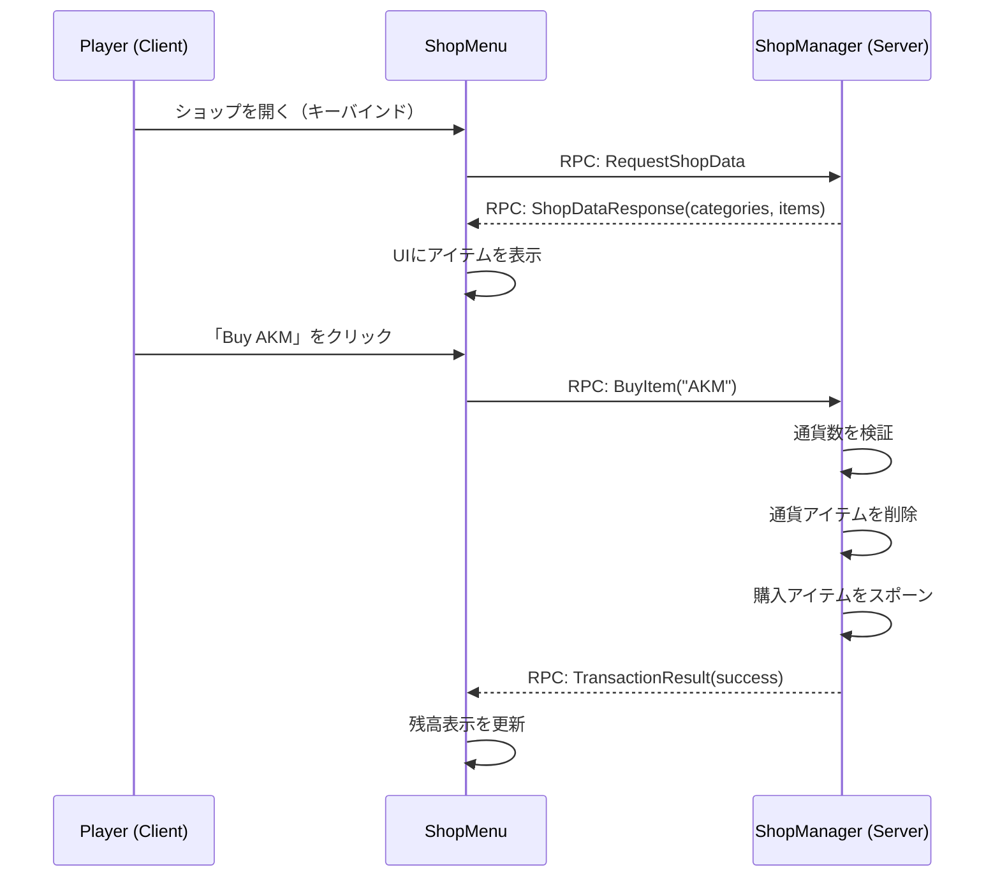

# Chapter 8.12: トレーディングシステムの構築

[Home](../../README.md) | [<< 前へ: カスタム衣類の作成](11-clothing-mod.md) | **トレーディングシステムの構築** | [次へ: 診断メニュー >>](13-diag-menu.md)

---

> **概要:** 完全なNPC不要のショップシステムを構築します：JSON config、サーバー検証付きの売買、カテゴリ分けされたUI、通貨ベースの取引。このWiki内で最も複雑なチュートリアルで、データモデリング、RPCラウンドトリップ、インベントリ操作、アンチチート原則をカバーします。

---

## 目次

- [作るもの](#what-we-are-building)
- [Step 1: データモデル（3_Game）](#step-1-data-model-3_game)
- [Step 2: RPC定数（3_Game）](#step-2-rpc-constants-3_game)
- [Step 3: サーバーサイドショップマネージャー（4_World）](#step-3-server-side-shop-manager-4_world)
- [Step 4: クライアントサイドショップUI（5_Mission）](#step-4-client-side-shop-ui-5_mission)
- [Step 5: レイアウトファイル](#step-5-layout-file)
- [Step 6: ミッションフックとキーバインド](#step-6-mission-hook-and-keybind)
- [Step 7: 通貨アイテム](#step-7-currency-item)
- [Step 8: ショップ設定JSON](#step-8-shop-config-json)
- [Step 9: ビルドとテスト](#step-9-build-and-test)
- [セキュリティの考慮事項](#security-considerations)
- [完全なコードリファレンス](#complete-code-reference)
- [ベストプラクティス / よくある間違い / 学んだこと](#best-practices)

---

## 作るもの

プレイヤーはF6を押してショップメニューを開き、カテゴリ（Weapons、Food、Medical）でアイテムを閲覧し、通貨アイテムを使って売買します。サーバーがすべての取引を検証します -- クライアントは価格を決定したりアイテムをスポーンしたりしません。



```
CLIENT                                SERVER
1. F6を押す --> REQUEST_SHOP_DATA ->  2. config読み込み、通貨カウント
                                         SHOP_DATA_RESPONSE ->
3. カテゴリ + アイテムを表示
   Buyをクリック --> BUY_ITEM (cls,qty) -> 4. 検証、通貨削除、スポーン
                                         TRANSACTION_RESULT ->
5. 結果表示、残高更新
```

**重要なルール：** クライアントは `(className, quantity)` のみを送信します。サーバーが価格を参照します。

### Mod構成

```
ShopDemo/
    mod.cpp
    GUI/layouts/shop_menu.layout
    Scripts/config.cpp
        3_Game/ShopDemo/  ShopDemoRPC.c  ShopDemoData.c
        4_World/ShopDemo/ ShopDemoManager.c
        5_Mission/ShopDemo/ ShopDemoMenu.c  ShopDemoMission.c
```

---

## Step 1: データモデル（3_Game）

### `Scripts/3_Game/ShopDemo/ShopDemoData.c`

```c
class ShopItem
{
    string ClassName;
    string DisplayName;
    int BuyPrice;
    int SellPrice;
    void ShopItem() { ClassName = ""; DisplayName = ""; BuyPrice = 0; SellPrice = 0; }
};

class ShopCategory
{
    string Name;
    ref array<ref ShopItem> Items;
    void ShopCategory() { Name = ""; Items = new array<ref ShopItem>; }
};

class ShopConfig
{
    string CurrencyClassName;
    ref array<ref ShopCategory> Categories;
    void ShopConfig() { CurrencyClassName = "GoldCoin"; Categories = new array<ref ShopCategory>; }
};
```

無限のマネーループを防ぐため、常に `SellPrice < BuyPrice` を維持してください。

---

## Step 2: RPC定数（3_Game）

### `Scripts/3_Game/ShopDemo/ShopDemoRPC.c`

```c
class ShopDemoRPC
{
    static const int REQUEST_SHOP_DATA   = 79101;  // Client -> Server
    static const int BUY_ITEM            = 79102;
    static const int SELL_ITEM           = 79103;
    static const int SHOP_DATA_RESPONSE  = 79201;  // Server -> Client
    static const int TRANSACTION_RESULT  = 79202;
};
```

---

## Step 3: サーバーサイドショップマネージャー（4_World）

### `Scripts/4_World/ShopDemo/ShopDemoManager.c`

```c
class ShopDemoManager
{
    private static ref ShopDemoManager s_Instance;
    static ShopDemoManager Get() { if (!s_Instance) s_Instance = new ShopDemoManager(); return s_Instance; }

    protected ref ShopConfig m_Config;
    protected string m_ConfigPath;
    void ShopDemoManager() { m_ConfigPath = "$profile:ShopDemo/ShopConfig.json"; }

    void Init()
    {
        m_Config = new ShopConfig();
        if (FileExist(m_ConfigPath))
        {
            string err;
            if (!JsonFileLoader<ShopConfig>.LoadFile(m_ConfigPath, m_Config, err))
                CreateDefaultConfig();
        }
        else CreateDefaultConfig();
        Print("[ShopDemo] Init: " + m_Config.Categories.Count().ToString() + " categories");
    }

    ShopConfig GetConfig() { return m_Config; }

    protected void CreateDefaultConfig()
    {
        m_Config = new ShopConfig();
        m_Config.CurrencyClassName = "GoldCoin";
        ShopCategory c1 = new ShopCategory(); c1.Name = "Weapons";
        AddItem(c1, "IJ70", "IJ-70 Pistol", 50, 25);
        AddItem(c1, "KA74", "KA-74", 200, 100);
        AddItem(c1, "Mosin9130", "Mosin 91/30", 150, 75);
        m_Config.Categories.Insert(c1);
        ShopCategory c2 = new ShopCategory(); c2.Name = "Food";
        AddItem(c2, "SodaCan_Cola", "Cola", 5, 2);
        AddItem(c2, "TunaCan", "Tuna Can", 8, 4);
        AddItem(c2, "Apple", "Apple", 3, 1);
        m_Config.Categories.Insert(c2);
        ShopCategory c3 = new ShopCategory(); c3.Name = "Medical";
        AddItem(c3, "BandageDressing", "Bandage", 10, 5);
        AddItem(c3, "Morphine", "Morphine", 30, 15);
        AddItem(c3, "SalineBagIV", "Saline Bag IV", 25, 12);
        m_Config.Categories.Insert(c3);
        SaveConfig();
    }

    protected void AddItem(ShopCategory cat, string cls, string disp, int buy, int sell)
    {
        ShopItem si = new ShopItem();
        si.ClassName = cls; si.DisplayName = disp; si.BuyPrice = buy; si.SellPrice = sell;
        cat.Items.Insert(si);
    }

    protected void SaveConfig()
    {
        MakeDirectory("$profile:ShopDemo");
        string err;
        JsonFileLoader<ShopConfig>.SaveFile(m_ConfigPath, m_Config, err);
    }

    int CountPlayerCurrency(PlayerBase player)
    {
        if (!player) return 0;
        int total = 0;
        array<EntityAI> items = new array<EntityAI>;
        player.GetInventory().EnumerateInventory(InventoryTraversalType.PREORDER, items);
        for (int i = 0; i < items.Count(); i++)
        {
            EntityAI ent = items.Get(i);
            if (!ent || ent.GetType() != m_Config.CurrencyClassName) continue;
            ItemBase ib = ItemBase.Cast(ent);
            if (ib && ib.HasQuantity()) total = total + ib.GetQuantity();
            else total = total + 1;
        }
        return total;
    }

    protected bool RemoveCurrency(PlayerBase player, int amount)
    {
        int remaining = amount;
        array<EntityAI> items = new array<EntityAI>;
        player.GetInventory().EnumerateInventory(InventoryTraversalType.PREORDER, items);
        for (int i = 0; i < items.Count(); i++)
        {
            if (remaining <= 0) break;
            EntityAI ent = items.Get(i);
            if (!ent || ent.GetType() != m_Config.CurrencyClassName) continue;
            ItemBase ib = ItemBase.Cast(ent);
            if (!ib) continue;
            if (ib.HasQuantity())
            {
                int qty = ib.GetQuantity();
                if (qty <= remaining) { remaining = remaining - qty; ib.DeleteSafe(); }
                else { ib.SetQuantity(qty - remaining); remaining = 0; }
            }
            else { remaining = remaining - 1; ib.DeleteSafe(); }
        }
        return (remaining <= 0);
    }

    protected bool GiveCurrency(PlayerBase player, int amount)
    {
        EntityAI spawned = player.GetInventory().CreateInInventory(m_Config.CurrencyClassName);
        if (!spawned)
            spawned = EntityAI.Cast(GetGame().CreateObjectEx(m_Config.CurrencyClassName, player.GetPosition(), ECE_PLACE_ON_SURFACE));
        if (!spawned) return false;
        ItemBase ci = ItemBase.Cast(spawned);
        if (ci && ci.HasQuantity()) ci.SetQuantity(amount);
        return true;
    }

    protected ShopItem FindShopItem(string className)
    {
        for (int c = 0; c < m_Config.Categories.Count(); c++)
            for (int i = 0; i < m_Config.Categories.Get(c).Items.Count(); i++)
                if (m_Config.Categories.Get(c).Items.Get(i).ClassName == className)
                    return m_Config.Categories.Get(c).Items.Get(i);
        return null;
    }

    void HandleBuy(PlayerBase player, string className, int quantity)
    {
        PlayerIdentity id = player.GetIdentity();
        if (quantity <= 0 || quantity > 10) { SendResult(player, false, "Invalid quantity.", 0); return; }
        ShopItem si = FindShopItem(className);
        if (!si) { SendResult(player, false, "Item not in shop.", 0); return; }
        int cost = si.BuyPrice * quantity;
        int balance = CountPlayerCurrency(player);
        if (balance < cost) { SendResult(player, false, "Need " + cost.ToString() + ", have " + balance.ToString(), balance); return; }
        if (!RemoveCurrency(player, cost)) { SendResult(player, false, "Currency removal failed.", CountPlayerCurrency(player)); return; }
        for (int i = 0; i < quantity; i++)
        {
            EntityAI sp = player.GetInventory().CreateInInventory(className);
            if (!sp) sp = EntityAI.Cast(GetGame().CreateObjectEx(className, player.GetPosition(), ECE_PLACE_ON_SURFACE));
        }
        int nb = CountPlayerCurrency(player);
        SendResult(player, true, "Bought " + quantity.ToString() + "x " + si.DisplayName + " for " + cost.ToString(), nb);
        Print("[ShopDemo] " + id.GetName() + " bought " + quantity.ToString() + "x " + className);
    }

    void HandleSell(PlayerBase player, string className, int quantity)
    {
        PlayerIdentity id = player.GetIdentity();
        if (quantity <= 0 || quantity > 10) { SendResult(player, false, "Invalid quantity.", 0); return; }
        ShopItem si = FindShopItem(className);
        if (!si || si.SellPrice <= 0) { SendResult(player, false, "Cannot sell this.", 0); return; }
        int removed = 0;
        array<EntityAI> items = new array<EntityAI>;
        player.GetInventory().EnumerateInventory(InventoryTraversalType.PREORDER, items);
        for (int i = 0; i < items.Count(); i++)
        {
            if (removed >= quantity) break;
            EntityAI ent = items.Get(i);
            if (ent && ent.GetType() == className) { ent.DeleteSafe(); removed = removed + 1; }
        }
        if (removed <= 0) { SendResult(player, false, "You don't have that item.", CountPlayerCurrency(player)); return; }
        int payout = si.SellPrice * removed;
        GiveCurrency(player, payout);
        SendResult(player, true, "Sold " + removed.ToString() + "x " + si.DisplayName + " for " + payout.ToString(), CountPlayerCurrency(player));
        Print("[ShopDemo] " + id.GetName() + " sold " + removed.ToString() + "x " + className);
    }

    protected void SendResult(PlayerBase player, bool success, string message, int newBalance)
    {
        if (!player || !player.GetIdentity()) return;
        Param3<bool, string, int> r = new Param3<bool, string, int>(success, message, newBalance);
        GetGame().RPCSingleParam(player, ShopDemoRPC.TRANSACTION_RESULT, r, true, player.GetIdentity());
    }
};

modded class PlayerBase
{
    override void OnRPC(PlayerIdentity sender, int rpc_type, ParamsReadContext ctx)
    {
        super.OnRPC(sender, rpc_type, ctx);
        if (!GetGame().IsServer()) return;
        switch (rpc_type)
        {
            case ShopDemoRPC.REQUEST_SHOP_DATA: OnShopDataReq(sender); break;
            case ShopDemoRPC.BUY_ITEM: OnBuyReq(sender, ctx); break;
            case ShopDemoRPC.SELL_ITEM: OnSellReq(sender, ctx); break;
        }
    }

    protected void OnShopDataReq(PlayerIdentity requestor)
    {
        PlayerBase player = PlayerBase.GetPlayerByUID(requestor.GetId());
        if (!player) return;
        ShopDemoManager mgr = ShopDemoManager.Get();
        ShopConfig cfg = mgr.GetConfig();
        // シリアライズ: "CatName|cls,name,buy,sell;cls2,...\nCat2|..."
        string payload = "";
        for (int c = 0; c < cfg.Categories.Count(); c++)
        {
            ShopCategory cat = cfg.Categories.Get(c);
            if (c > 0) payload = payload + "\n";
            payload = payload + cat.Name + "|";
            for (int i = 0; i < cat.Items.Count(); i++)
            {
                ShopItem si = cat.Items.Get(i);
                if (i > 0) payload = payload + ";";
                payload = payload + si.ClassName + "," + si.DisplayName + "," + si.BuyPrice.ToString() + "," + si.SellPrice.ToString();
            }
        }
        Param2<int, string> data = new Param2<int, string>(mgr.CountPlayerCurrency(player), payload);
        GetGame().RPCSingleParam(player, ShopDemoRPC.SHOP_DATA_RESPONSE, data, true, requestor);
    }

    protected void OnBuyReq(PlayerIdentity sender, ParamsReadContext ctx)
    {
        Param2<string, int> d = new Param2<string, int>("", 0);
        if (!ctx.Read(d)) return;
        PlayerBase p = PlayerBase.GetPlayerByUID(sender.GetId());
        if (p) ShopDemoManager.Get().HandleBuy(p, d.param1, d.param2);
    }

    protected void OnSellReq(PlayerIdentity sender, ParamsReadContext ctx)
    {
        Param2<string, int> d = new Param2<string, int>("", 0);
        if (!ctx.Read(d)) return;
        PlayerBase p = PlayerBase.GetPlayerByUID(sender.GetId());
        if (p) ShopDemoManager.Get().HandleSell(p, d.param1, d.param2);
    }
};

modded class MissionServer
{
    override void OnInit() { super.OnInit(); ShopDemoManager.Get().Init(); }
};
```

**重要な設計判断：** 通貨はアイテムスポーン*前に*削除されます（複製を防止）。ネットワーク同期されたアイテムには常に `DeleteSafe()` を使用。数量は不正防止のため1〜10にクランプ。

---

## Step 4: クライアントサイドショップUI（5_Mission）

### `Scripts/5_Mission/ShopDemo/ShopDemoMenu.c`

```c
class ShopDemoMenu extends ScriptedWidgetEventHandler
{
    protected Widget m_Root, m_CategoryPanel, m_ItemPanel;
    protected TextWidget m_BalanceText, m_DetailName, m_DetailBuyPrice, m_DetailSellPrice, m_StatusText;
    protected ButtonWidget m_BuyButton, m_SellButton, m_CloseButton;
    protected bool m_IsOpen;
    protected int m_Balance;
    protected string m_SelClass;
    protected ref array<string> m_CatNames;
    protected ref array<ref array<ref ShopItem>> m_CatItems;
    protected ref array<Widget> m_DynWidgets;

    void ShopDemoMenu()
    {
        m_IsOpen = false; m_Balance = 0; m_SelClass = "";
        m_CatNames = new array<string>; m_CatItems = new array<ref array<ref ShopItem>>;
        m_DynWidgets = new array<Widget>;
    }
    void ~ShopDemoMenu() { Close(); }

    void Open()
    {
        if (m_IsOpen) return;
        m_Root = GetGame().GetWorkspace().CreateWidgets("ShopDemo/GUI/layouts/shop_menu.layout");
        if (!m_Root) { Print("[ShopDemo] Layout failed!"); return; }
        m_BalanceText     = TextWidget.Cast(m_Root.FindAnyWidget("BalanceText"));
        m_CategoryPanel   = m_Root.FindAnyWidget("CategoryPanel");
        m_ItemPanel       = m_Root.FindAnyWidget("ItemPanel");
        m_DetailName      = TextWidget.Cast(m_Root.FindAnyWidget("DetailName"));
        m_DetailBuyPrice  = TextWidget.Cast(m_Root.FindAnyWidget("DetailBuyPrice"));
        m_DetailSellPrice = TextWidget.Cast(m_Root.FindAnyWidget("DetailSellPrice"));
        m_StatusText      = TextWidget.Cast(m_Root.FindAnyWidget("StatusText"));
        m_BuyButton       = ButtonWidget.Cast(m_Root.FindAnyWidget("BuyButton"));
        m_SellButton      = ButtonWidget.Cast(m_Root.FindAnyWidget("SellButton"));
        m_CloseButton     = ButtonWidget.Cast(m_Root.FindAnyWidget("CloseButton"));
        if (m_BuyButton) m_BuyButton.SetHandler(this);
        if (m_SellButton) m_SellButton.SetHandler(this);
        if (m_CloseButton) m_CloseButton.SetHandler(this);
        m_Root.Show(true); m_IsOpen = true;
        GetGame().GetMission().PlayerControlDisable(INPUT_EXCLUDE_ALL);
        GetGame().GetUIManager().ShowUICursor(true);
        if (m_StatusText) m_StatusText.SetText("Loading...");
        Man player = GetGame().GetPlayer();
        if (player) { Param1<bool> p = new Param1<bool>(true); GetGame().RPCSingleParam(player, ShopDemoRPC.REQUEST_SHOP_DATA, p, true); }
    }

    void Close()
    {
        if (!m_IsOpen) return;
        for (int i = 0; i < m_DynWidgets.Count(); i++) if (m_DynWidgets.Get(i)) m_DynWidgets.Get(i).Unlink();
        m_DynWidgets.Clear();
        if (m_Root) { m_Root.Unlink(); m_Root = null; }
        m_IsOpen = false;
        GetGame().GetMission().PlayerControlEnable(true);
        GetGame().GetUIManager().ShowUICursor(false);
    }

    bool IsOpen() { return m_IsOpen; }
    void Toggle() { if (m_IsOpen) Close(); else Open(); }

    void OnShopDataReceived(int balance, string payload)
    {
        m_Balance = balance;
        if (m_BalanceText) m_BalanceText.SetText("Balance: " + balance.ToString());
        m_CatNames.Clear(); m_CatItems.Clear();
        TStringArray lines = new TStringArray;
        payload.Split("\n", lines);
        for (int c = 0; c < lines.Count(); c++)
        {
            string line = lines.Get(c);
            int pp = line.IndexOf("|");
            if (pp < 0) continue;
            m_CatNames.Insert(line.Substring(0, pp));
            ref array<ref ShopItem> ci = new array<ref ShopItem>;
            TStringArray iStrs = new TStringArray;
            line.Substring(pp + 1, line.Length() - pp - 1).Split(";", iStrs);
            for (int i = 0; i < iStrs.Count(); i++)
            {
                TStringArray parts = new TStringArray;
                iStrs.Get(i).Split(",", parts);
                if (parts.Count() < 4) continue;
                ShopItem si = new ShopItem();
                si.ClassName = parts.Get(0); si.DisplayName = parts.Get(1);
                si.BuyPrice = parts.Get(2).ToInt(); si.SellPrice = parts.Get(3).ToInt();
                ci.Insert(si);
            }
            m_CatItems.Insert(ci);
        }
        // カテゴリボタンの構築
        if (m_CategoryPanel)
        {
            for (int b = 0; b < m_CatNames.Count(); b++)
            {
                ButtonWidget btn = ButtonWidget.Cast(GetGame().GetWorkspace().CreateWidget(WidgetType.ButtonWidgetTypeID, 0, b*0.12, 1, 0.10, WidgetFlags.VISIBLE, ARGB(255,60,60,60), 0, m_CategoryPanel));
                if (btn) { btn.SetText(m_CatNames.Get(b)); btn.SetHandler(this); btn.SetName("CatBtn_"+b.ToString()); m_DynWidgets.Insert(btn); }
            }
        }
        if (m_CatNames.Count() > 0) SelectCategory(0);
        if (m_StatusText) m_StatusText.SetText("");
    }

    void SelectCategory(int idx)
    {
        if (idx < 0 || idx >= m_CatItems.Count()) return;
        for (int r = m_DynWidgets.Count()-1; r >= 0; r--)
        { Widget w = m_DynWidgets.Get(r); if (w && w.GetName().IndexOf("ItemBtn_")==0) { w.Unlink(); m_DynWidgets.Remove(r); } }
        array<ref ShopItem> items = m_CatItems.Get(idx);
        for (int j = 0; j < items.Count(); j++)
        {
            ShopItem si = items.Get(j);
            ButtonWidget ib = ButtonWidget.Cast(GetGame().GetWorkspace().CreateWidget(WidgetType.ButtonWidgetTypeID, 0, j*0.08, 1, 0.07, WidgetFlags.VISIBLE, ARGB(255,45,45,50), 0, m_ItemPanel));
            if (ib) { ib.SetText(si.DisplayName+" [B:"+si.BuyPrice.ToString()+" S:"+si.SellPrice.ToString()+"]"); ib.SetHandler(this); ib.SetName("ItemBtn_"+si.ClassName); m_DynWidgets.Insert(ib); }
        }
        m_SelClass = "";
        if (m_DetailName) m_DetailName.SetText("Select an item");
    }

    override bool OnClick(Widget w, int x, int y, int button)
    {
        if (w == m_CloseButton) { Close(); return true; }
        if (w == m_BuyButton) { DoBuySell(ShopDemoRPC.BUY_ITEM); return true; }
        if (w == m_SellButton) { DoBuySell(ShopDemoRPC.SELL_ITEM); return true; }
        string wn = w.GetName();
        if (wn.IndexOf("CatBtn_")==0) { SelectCategory(wn.Substring(7,wn.Length()-7).ToInt()); return true; }
        if (wn.IndexOf("ItemBtn_")==0) { SelectItem(wn.Substring(8,wn.Length()-8)); return true; }
        return false;
    }

    void SelectItem(string cls)
    {
        for (int c = 0; c < m_CatItems.Count(); c++)
            for (int i = 0; i < m_CatItems.Get(c).Count(); i++)
            {
                ShopItem si = m_CatItems.Get(c).Get(i);
                if (si.ClassName == cls) {
                    m_SelClass = cls;
                    if (m_DetailName) m_DetailName.SetText(si.DisplayName);
                    if (m_DetailBuyPrice) m_DetailBuyPrice.SetText("Buy: " + si.BuyPrice.ToString());
                    if (m_DetailSellPrice) m_DetailSellPrice.SetText("Sell: " + si.SellPrice.ToString());
                    return;
                }
            }
    }

    protected void DoBuySell(int rpcId)
    {
        if (m_SelClass == "") { if (m_StatusText) m_StatusText.SetText("Select an item first."); return; }
        Man player = GetGame().GetPlayer();
        if (!player) return;
        Param2<string, int> d = new Param2<string, int>(m_SelClass, 1);
        GetGame().RPCSingleParam(player, rpcId, d, true);
        if (m_StatusText) m_StatusText.SetText("Processing...");
    }

    void OnTransactionResult(bool success, string message, int newBalance)
    {
        m_Balance = newBalance;
        if (m_BalanceText) m_BalanceText.SetText("Balance: " + newBalance.ToString());
        if (m_StatusText) m_StatusText.SetText(message);
    }
};
```

---

## Step 5: レイアウトファイル

### `GUI/layouts/shop_menu.layout`

3カラム構成：Categories（左20%）、Items（中央46%）、Details（右26%）。

```
FrameWidgetClass ShopMenuRoot {
 size 0.7 0.7 position 0.15 0.15 hexactpos 0 vexactpos 0 hexactsize 0 vexactsize 0
 {
  ImageWidgetClass Background { size 1 1 position 0 0 hexactpos 0 vexactpos 0 hexactsize 0 vexactsize 0 color 0.08 0.08 0.1 0.92 }
  TextWidgetClass ShopTitle { size 0.5 0.06 position 0.02 0.02 hexactpos 0 vexactpos 0 hexactsize 0 vexactsize 0 text "Shop" "text halign" left "text valign" center color 1 0.85 0.3 1 font "gui/fonts/MetronBook" }
  TextWidgetClass BalanceText { size 0.35 0.06 position 0.63 0.02 hexactpos 0 vexactpos 0 hexactsize 0 vexactsize 0 text "Balance: --" "text halign" right "text valign" center color 0.3 1 0.3 1 font "gui/fonts/MetronBook" }
  FrameWidgetClass CategoryPanel { size 0.2 0.82 position 0.02 0.1 hexactpos 0 vexactpos 0 hexactsize 0 vexactsize 0
   { ImageWidgetClass CatBg { size 1 1 position 0 0 hexactpos 0 vexactpos 0 hexactsize 0 vexactsize 0 color 0.12 0.12 0.14 0.8 } }
  }
  FrameWidgetClass ItemPanel { size 0.46 0.82 position 0.24 0.1 hexactpos 0 vexactpos 0 hexactsize 0 vexactsize 0
   { ImageWidgetClass ItemBg { size 1 1 position 0 0 hexactpos 0 vexactpos 0 hexactsize 0 vexactsize 0 color 0.1 0.1 0.12 0.8 } }
  }
  FrameWidgetClass DetailPanel { size 0.26 0.82 position 0.72 0.1 hexactpos 0 vexactpos 0 hexactsize 0 vexactsize 0
   {
    ImageWidgetClass DetailBg { size 1 1 position 0 0 hexactpos 0 vexactpos 0 hexactsize 0 vexactsize 0 color 0.12 0.12 0.14 0.8 }
    TextWidgetClass DetailName { size 0.9 0.08 position 0.05 0.05 hexactpos 0 vexactpos 0 hexactsize 0 vexactsize 0 text "Select an item" "text halign" center "text valign" center color 1 1 1 1 font "gui/fonts/MetronBook" }
    TextWidgetClass DetailBuyPrice { size 0.9 0.06 position 0.05 0.16 hexactpos 0 vexactpos 0 hexactsize 0 vexactsize 0 text "Buy: --" "text halign" left "text valign" center color 0.3 1 0.3 1 font "gui/fonts/MetronBook" }
    TextWidgetClass DetailSellPrice { size 0.9 0.06 position 0.05 0.24 hexactpos 0 vexactpos 0 hexactsize 0 vexactsize 0 text "Sell: --" "text halign" left "text valign" center color 1 0.85 0.3 1 font "gui/fonts/MetronBook" }
    ButtonWidgetClass BuyButton { size 0.8 0.08 position 0.1 0.5 hexactpos 0 vexactpos 0 hexactsize 0 vexactsize 0 text "Buy" "text halign" center "text valign" center color 0.2 0.7 0.2 1.0 }
    ButtonWidgetClass SellButton { size 0.8 0.08 position 0.1 0.62 hexactpos 0 vexactpos 0 hexactsize 0 vexactsize 0 text "Sell" "text halign" center "text valign" center color 0.8 0.6 0.1 1.0 }
    TextWidgetClass StatusText { size 0.9 0.06 position 0.05 0.82 hexactpos 0 vexactpos 0 hexactsize 0 vexactsize 0 text "" "text halign" center "text valign" center color 0.9 0.9 0.9 1 font "gui/fonts/MetronBook" }
   }
  }
  ButtonWidgetClass CloseButton { size 0.05 0.04 position 0.935 0.015 hexactpos 0 vexactpos 0 hexactsize 0 vexactsize 0 text "X" "text halign" center "text valign" center color 1.0 0.3 0.3 1.0 }
 }
}
```

---

## Step 6: ミッションフックとキーバインド

### `Scripts/5_Mission/ShopDemo/ShopDemoMission.c`

```c
modded class MissionGameplay
{
    protected ref ShopDemoMenu m_ShopDemoMenu;

    override void OnInit() { super.OnInit(); m_ShopDemoMenu = new ShopDemoMenu(); }

    override void OnMissionFinish()
    {
        if (m_ShopDemoMenu) { m_ShopDemoMenu.Close(); m_ShopDemoMenu = null; }
        super.OnMissionFinish();
    }

    override void OnKeyPress(int key)
    {
        super.OnKeyPress(key);
        if (key == KeyCode.KC_F6 && m_ShopDemoMenu) m_ShopDemoMenu.Toggle();
    }

    override void OnRPC(PlayerIdentity sender, Object target, int rpc_type, ParamsReadContext ctx)
    {
        super.OnRPC(sender, target, rpc_type, ctx);
        if (rpc_type == ShopDemoRPC.SHOP_DATA_RESPONSE)
        {
            Param2<int, string> d = new Param2<int, string>(0, "");
            if (ctx.Read(d) && m_ShopDemoMenu) m_ShopDemoMenu.OnShopDataReceived(d.param1, d.param2);
        }
        if (rpc_type == ShopDemoRPC.TRANSACTION_RESULT)
        {
            Param3<bool, string, int> r = new Param3<bool, string, int>(false, "", 0);
            if (ctx.Read(r) && m_ShopDemoMenu) m_ShopDemoMenu.OnTransactionResult(r.param1, r.param2, r.param3);
        }
    }
};
```

リリース版Modでは `inputs.xml` を使用して、プレイヤーがキーを再割り当てできるようにします：

```xml
<?xml version="1.0" encoding="UTF-8"?>
<modded>
 <inputs><actions>
  <input name="UAShopToggle" loc="Toggle Shop" type="button" default="Keyboard:KC_F6" group="modded" />
 </actions></inputs>
</modded>
```

---

## Step 7: 通貨アイテム

任意の既存アイテムを使用できます -- JSONで `CurrencyClassName` を `"Rag"` に設定すると、ラグがお金になります。カスタムコインについては [Chapter 8.2: カスタムアイテム](02-custom-item.md) を参照してください。

---

## Step 8: ショップ設定JSON

最初のサーバー起動時に `$profile:ShopDemo/ShopConfig.json` に自動生成されます。価格を編集し、カテゴリ/アイテムを追加し、サーバーを再起動してください。常に `SellPrice < BuyPrice` を維持してください。

---

## Step 9: ビルドとテスト

1. `ShopDemo/` をPBOにパックし、サーバー+クライアントの `@ShopDemo/addons/` に追加、`-mod=@ShopDemo` を追加
2. 通貨をスポーン、F6を押す、閲覧、売買
3. サーバーログで `[ShopDemo]` の行を確認

| テストケース | 期待される結果 |
|-----------|----------|
| 通貨なしで購入 | 「Need X, have 0」 |
| 不明なクラスで購入（ハック） | 「Item not in shop」 |
| 所有していないアイテムを販売 | 「You don't have that item」 |
| インベントリが満杯の状態で購入 | アイテムが地面にドロップ |

---

## セキュリティの考慮事項

1. **クライアントが送信した価格を決して信頼しないでください。** クライアントは `(className, qty)` のみを送信します。サーバーが価格を参照します。
2. **スポーン前に削除。** 通貨を先に削除し、次にアイテムを作成します。複製を防止します。
3. **存在の検証。** 売却通貨を付与する前にアイテムがインベントリにあることを確認します。
4. **すべてをログに記録。** すべての取引でプレイヤー名、アイテム、金額をPrintします。
5. **数量の範囲制限。** `qty <= 0` または `qty > 10` を拒否します。
6. 本番環境では **レート制限** を設けます：プレイヤーあたり取引ごとに500msのクールダウン。

---

## 完全なコードリファレンス

| ファイル | レイヤー | 目的 |
|------|-------|---------|
| `ShopDemoRPC.c` | 3_Game | RPC ID定数 |
| `ShopDemoData.c` | 3_Game | データクラス：ShopItem、ShopCategory、ShopConfig |
| `ShopDemoManager.c` | 4_World | サーバー：config、売買ロジック、インベントリ、RPCハンドラー |
| `ShopDemoMenu.c` | 5_Mission | クライアント：UI、動的ウィジェット、RPC送受信 |
| `ShopDemoMission.c` | 5_Mission | ミッションフック：初期化、キーバインド、RPCルーティング |
| `shop_menu.layout` | GUI | 3パネルレイアウト |

---

## ベストプラクティス

- **サーバーが唯一の信頼できるソースです。** クライアントは表示端末です。
- **`Delete()` ではなく `DeleteSafe()` を使用してください。** ネットワーク同期とロックされたスロットを処理します。
- **データクラスは3_Gameに配置。** 4_Worldと5_Missionの両方から参照可能です。
- **オーバーライドでは常に `super` を呼び出してください。** チェーンを壊すと他のModも壊れます。
- **動的ウィジェットをクリーンアップしてください。** すべての `CreateWidget` にはクローズ時の `Unlink` が必要です。

## 理論と実践

| 概念 | 理論 | 現実 |
|---------|--------|---------|
| `JsonFileLoader.LoadFile()` | きれいに読み込まれる | 末尾カンマはサイレントエラーを引き起こします。外部でJSONを検証してください。 |
| 文字列RPCシリアライゼーション | シンプル | 500+アイテムはサイズ制限に達する可能性があります。大規模ショップではページネーションを行ってください。 |
| `CreateInInventory()` | 常に機能する | インベントリが満杯の場合nullを返します。常にチェックしてください。 |
| Listenサーバーでのテスト | 素早い反復 | ネットワークバグを隠します。専用サーバーでテストしてください。 |

## 学んだこと

- `JsonFileLoader<T>` を使用したJSON config読み込みとデフォルト値の自動生成
- サーバーサイドゲームマネージャーのシングルトンパターン
- インベントリの列挙、カウント、削除（`DeleteSafe`）、スポーン
- RPC経由の複雑なデータの文字列シリアライゼーション（カテゴリ、アイテム、価格）
- データ駆動UIのための動的ウィジェット作成
- サーバー専用権限による完全な売買取引フロー
- マルチプレイヤー経済システムのセキュリティ原則

## よくある間違い

| 間違い | 修正方法 |
|---------|-----|
| クライアントが価格を送信 | `(className, qty)` のみを送信。サーバーが価格を決定。 |
| 支払い前にスポーン | 通貨を先に削除し、次にアイテムを作成。 |
| `super.OnRPC()` をスキップ | 常にsuperを呼び出す -- 他のModがチェーンを必要とします。 |
| ネットワークアイテムに `Delete()` | `DeleteSafe()` を使用。 |
| `CreateInInventory` の戻り値を無視 | nullチェックし、地面スポーンにフォールバック。 |
| else-ifで変数を再宣言 | ifチェーンの前に一度宣言（Enforce Scriptのルール）。 |

---

**前へ：** [Chapter 8.11: 衣類Mod](11-clothing-mod.md)
