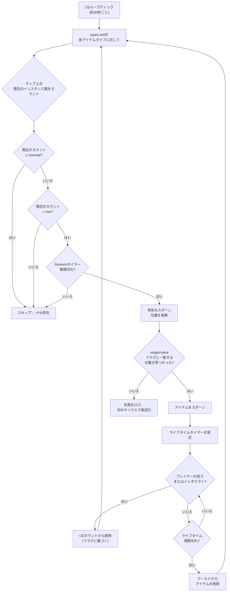

# Chapter 9.4: ルートエコノミー詳解

[ホーム](../README.md) | [<< 前へ: serverDZ.cfgリファレンス](03-server-cfg.md) | **ルートエコノミー詳解**

---

> **概要:** Central Economy（CE）は、DayZにおけるすべてのアイテムスポーンを制御するシステムです -- 棚の上の缶詰から軍事基地のAKMまで。この章では、完全なスポーンサイクルを説明し、`types.xml`、`globals.xml`、`events.xml`、`cfgspawnabletypes.xml` のすべてのフィールドをバニラサーバーファイルの実例とともにドキュメント化し、最も一般的なエコノミーの間違いについて解説します。

---

## 目次

- [Central Economyの仕組み](#central-economyの仕組み)
- [スポーンサイクル](#スポーンサイクル)
- [types.xml -- アイテムスポーン定義](#typesxml----アイテムスポーン定義)
- [types.xmlの実例](#typesxmlの実例)
- [types.xmlフィールドリファレンス](#typesxmlフィールドリファレンス)
- [globals.xml -- エコノミーパラメータ](#globalsxml----エコノミーパラメータ)
- [events.xml -- ダイナミックイベント](#eventsxml----ダイナミックイベント)
- [cfgspawnabletypes.xml -- アタッチメントとカーゴ](#cfgspawnabletypesxml----アタッチメントとカーゴ)
- [Nominal/Restockの関係](#nominalrestockの関係)
- [よくあるエコノミーの間違い](#よくあるエコノミーの間違い)

---

## Central Economyの仕組み

Central Economy（CE）は、連続ループで動作するサーバーサイドのシステムです。その役割は、設定ファイルで定義されたレベルでワールドのアイテム人口を維持することです。

CEはプレイヤーが建物に入った時にアイテムを配置するのでは **ありません**。代わりに、グローバルタイマーで動作し、プレイヤーの近接に関係なくマップ全体にアイテムをスポーンさせます。アイテムには **ライフタイム** があり、そのタイマーが切れてプレイヤーがアイテムとインタラクトしていない場合、CEはそれを削除します。次のサイクルで、カウントがターゲットを下回っていることを検出し、別の場所に代替品をスポーンさせます。

主要な概念:

- **Nominal** -- マップ上に存在すべきアイテムのコピー数のターゲット
- **Min** -- CEがアイテムのリスポーンを試みるしきい値
- **Lifetime** -- 触れられていないアイテムがクリーンアップされるまでの持続時間（秒）
- **Restock** -- アイテムが取得/破壊された後、CEが代替品をスポーンできるまでの最小時間（秒）
- **Flags** -- 合計にカウントされるもの（マップ上、カーゴ内、プレイヤーインベントリ内、スタッシュ内）

---

## スポーンサイクル



要約: CEは各アイテムの存在数をカウントし、nominal/minターゲットと比較し、カウントが `min` を下回り `restock` タイマーが経過した時に代替品をスポーンさせます。

---

## types.xml -- アイテムスポーン定義

これは最も重要なエコノミーファイルです。ワールド内にスポーンできるすべてのアイテムにはここにエントリが必要です。チェルナルスのバニラ `types.xml` には、数千のアイテムをカバーする約23,000行が含まれています。

### types.xmlの実例

**武器 -- AKM**

```xml
<type name="AKM">
    <nominal>3</nominal>
    <lifetime>7200</lifetime>
    <restock>3600</restock>
    <min>2</min>
    <quantmin>30</quantmin>
    <quantmax>80</quantmax>
    <cost>100</cost>
    <flags count_in_cargo="0" count_in_hoarder="0" count_in_map="1" count_in_player="0" crafted="0" deloot="0"/>
    <category name="weapons"/>
    <usage name="Military"/>
    <value name="Tier4"/>
</type>
```

AKMはレアな高ティア武器です。マップ上に同時に3つしか存在できません（`nominal`）。Tier 4（北西部）エリアのMilitary建物にスポーンします。プレイヤーが1つ拾うと、CEはマップカウントが `min=2` を下回ったことを検知し、少なくとも3600秒（1時間）後に代替品をスポーンさせます。武器は内蔵マガジンに30-80%の弾薬が入った状態でスポーンします（`quantmin`/`quantmax`）。

**食料 -- BakedBeansCan**

```xml
<type name="BakedBeansCan">
    <nominal>15</nominal>
    <lifetime>14400</lifetime>
    <restock>0</restock>
    <min>12</min>
    <quantmin>-1</quantmin>
    <quantmax>-1</quantmax>
    <cost>100</cost>
    <flags count_in_cargo="0" count_in_hoarder="0" count_in_map="1" count_in_player="0" crafted="0" deloot="0"/>
    <category name="food"/>
    <tag name="shelves"/>
    <usage name="Town"/>
    <usage name="Village"/>
    <value name="Tier1"/>
    <value name="Tier2"/>
    <value name="Tier3"/>
</type>
```

ベイクドビーンズは一般的な食料です。常に15缶が存在する必要があります。Tier 1-3（海岸から中間地点）のTownおよびVillage建物の棚にスポーンします。`restock=0` は即座のリスポーン適格を意味します。`quantmin=-1` と `quantmax=-1` はアイテムが数量システムを使用しないことを意味します（液体や弾薬コンテナではありません）。

**衣服 -- RidersJacket_Black**

```xml
<type name="RidersJacket_Black">
    <nominal>14</nominal>
    <lifetime>28800</lifetime>
    <restock>0</restock>
    <min>10</min>
    <quantmin>-1</quantmin>
    <quantmax>-1</quantmax>
    <cost>100</cost>
    <flags count_in_cargo="0" count_in_hoarder="0" count_in_map="1" count_in_player="0" crafted="0" deloot="0"/>
    <category name="clothes"/>
    <usage name="Town"/>
    <value name="Tier1"/>
    <value name="Tier2"/>
</type>
```

一般的な民間ジャケットです。マップ上に14着、海岸付近（Tier 1-2）のTown建物に存在します。28800秒（8時間）のライフタイムは、誰も拾わなくても長時間持続することを意味します。

**医療 -- BandageDressing**

```xml
<type name="BandageDressing">
    <nominal>40</nominal>
    <lifetime>14400</lifetime>
    <restock>0</restock>
    <min>30</min>
    <quantmin>-1</quantmin>
    <quantmax>-1</quantmax>
    <cost>100</cost>
    <flags count_in_cargo="0" count_in_hoarder="0" count_in_map="1" count_in_player="0" crafted="0" deloot="0"/>
    <category name="tools"/>
    <tag name="shelves"/>
    <usage name="Medic"/>
</type>
```

包帯は非常に一般的です（nominal 40）。すべてのティアのMedic建物（病院、クリニック）にスポーンします（`<value>` タグがないことはすべてのティアを意味します）。カテゴリが `"medical"` ではなく `"tools"` であることに注意してください -- DayZにはmedicalカテゴリがなく、医療アイテムはtoolsカテゴリを使用します。

**無効化されたアイテム（クラフトバリアント）**

```xml
<type name="AK101_Black">
    <nominal>0</nominal>
    <lifetime>28800</lifetime>
    <restock>0</restock>
    <min>0</min>
    <quantmin>-1</quantmin>
    <quantmax>-1</quantmax>
    <cost>100</cost>
    <flags count_in_cargo="0" count_in_hoarder="0" count_in_map="1" count_in_player="0" crafted="1" deloot="0"/>
    <category name="weapons"/>
</type>
```

`nominal=0` と `min=0` は、CEがこのアイテムをスポーンさせないことを意味します。`crafted=1` はクラフト（武器の塗装）でのみ入手可能であることを示します。パーシステンスされたインスタンスが最終的にクリーンアップされるように、ライフタイムは設定されています。

---

## types.xmlフィールドリファレンス

### コアフィールド

| フィールド | 型 | 範囲 | 説明 |
|-------|------|-------|-------------|
| `name` | string | -- | アイテムのクラス名です。ゲームのクラス名と正確に一致する必要があります。 |
| `nominal` | int | 0+ | マップ上のこのアイテムのターゲット数です。スポーンを防ぐには0に設定します。 |
| `min` | int | 0+ | カウントがこの値以下に下がった時、CEはさらにスポーンを試みます。 |
| `lifetime` | int | 秒 | 触れられていないアイテムがCEによって削除されるまでの存在時間です。 |
| `restock` | int | 秒 | CEが代替品をスポーンできるまでの最小クールダウンです。0 = 即時。 |
| `quantmin` | int | -1〜100 | スポーン時の最小数量パーセンテージ（弾薬%、液体%）。-1 = 該当なし。 |
| `quantmax` | int | -1〜100 | スポーン時の最大数量パーセンテージ。-1 = 該当なし。 |
| `cost` | int | 0+ | スポーン選択の優先度重みです。現在、すべてのバニラアイテムは100を使用しています。 |

### フラグ

```xml
<flags count_in_cargo="0" count_in_hoarder="0" count_in_map="1" count_in_player="0" crafted="0" deloot="0"/>
```

| フラグ | 値 | 説明 |
|------|--------|-------------|
| `count_in_map` | 0, 1 | 地面または建物のスポーンポイントにあるアイテムをカウントします。**ほぼ常に1です。** |
| `count_in_cargo` | 0, 1 | 他のコンテナ（バックパック、テント）内のアイテムをカウントします。 |
| `count_in_hoarder` | 0, 1 | スタッシュ、バレル、埋められたコンテナ、テント内のアイテムをカウントします。 |
| `count_in_player` | 0, 1 | プレイヤーインベントリ（体または手に持っている）内のアイテムをカウントします。 |
| `crafted` | 0, 1 | 1の場合、このアイテムはCEスポーンではなくクラフトでのみ入手可能です。 |
| `deloot` | 0, 1 | ダイナミックイベントルートです。1の場合、アイテムはダイナミックイベントの場所（ヘリクラッシュなど）でのみスポーンします。 |

**フラグ戦略は重要です。** `count_in_player=1` の場合、プレイヤーが持っているすべてのAKMがnominalにカウントされます。つまり、AKMを拾ってもカウントが変わらないためリスポーンがトリガーされません。ほとんどのバニラアイテムは `count_in_player=0` を使用して、プレイヤーが持っているアイテムがリスポーンをブロックしないようにしています。

### タグ

| 要素 | 目的 | 定義場所 |
|---------|---------|-----------|
| `<category name="..."/>` | スポーンポイントマッチングのアイテムカテゴリ | `cfglimitsdefinition.xml` |
| `<usage name="..."/>` | このアイテムがスポーンできる建物タイプ | `cfglimitsdefinition.xml` |
| `<value name="..."/>` | このアイテムがスポーンできるマップティアゾーン | `cfglimitsdefinition.xml` |
| `<tag name="..."/>` | 建物内のスポーン位置タイプ | `cfglimitsdefinition.xml` |

**有効なカテゴリ:** `tools`, `containers`, `clothes`, `food`, `weapons`, `books`, `explosives`, `lootdispatch`

**有効なusageフラグ:** `Military`, `Police`, `Medic`, `Firefighter`, `Industrial`, `Farm`, `Coast`, `Town`, `Village`, `Hunting`, `Office`, `School`, `Prison`, `Lunapark`, `SeasonalEvent`, `ContaminatedArea`, `Historical`

**有効なvalueフラグ:** `Tier1`, `Tier2`, `Tier3`, `Tier4`, `Unique`

**有効なタグ:** `floor`, `shelves`, `ground`

アイテムは **複数の** `<usage>` および `<value>` タグを持つことができます。複数のusageはそれらの建物タイプのいずれかでスポーンできることを意味します。複数のvalueはそれらのティアのいずれかでスポーンできることを意味します。

`<value>` を完全に省略すると、アイテムは **すべての** ティアでスポーンします。`<usage>` を省略すると、アイテムには有効なスポーン場所がなく、**スポーンしません**。

---

## globals.xml -- エコノミーパラメータ

このファイルはグローバルなCE動作を制御します。バニラファイルのすべてのパラメータ:

```xml
<variables>
    <var name="AnimalMaxCount" type="0" value="200"/>
    <var name="CleanupAvoidance" type="0" value="100"/>
    <var name="CleanupLifetimeDeadAnimal" type="0" value="1200"/>
    <var name="CleanupLifetimeDeadInfected" type="0" value="330"/>
    <var name="CleanupLifetimeDeadPlayer" type="0" value="3600"/>
    <var name="CleanupLifetimeDefault" type="0" value="45"/>
    <var name="CleanupLifetimeLimit" type="0" value="50"/>
    <var name="CleanupLifetimeRuined" type="0" value="330"/>
    <var name="FlagRefreshFrequency" type="0" value="432000"/>
    <var name="FlagRefreshMaxDuration" type="0" value="3456000"/>
    <var name="FoodDecay" type="0" value="1"/>
    <var name="IdleModeCountdown" type="0" value="60"/>
    <var name="IdleModeStartup" type="0" value="1"/>
    <var name="InitialSpawn" type="0" value="100"/>
    <var name="LootDamageMax" type="1" value="0.82"/>
    <var name="LootDamageMin" type="1" value="0.0"/>
    <var name="LootProxyPlacement" type="0" value="1"/>
    <var name="LootSpawnAvoidance" type="0" value="100"/>
    <var name="RespawnAttempt" type="0" value="2"/>
    <var name="RespawnLimit" type="0" value="20"/>
    <var name="RespawnTypes" type="0" value="12"/>
    <var name="RestartSpawn" type="0" value="0"/>
    <var name="SpawnInitial" type="0" value="1200"/>
    <var name="TimeHopping" type="0" value="60"/>
    <var name="TimeLogin" type="0" value="15"/>
    <var name="TimeLogout" type="0" value="15"/>
    <var name="TimePenalty" type="0" value="20"/>
    <var name="WorldWetTempUpdate" type="0" value="1"/>
    <var name="ZombieMaxCount" type="0" value="1000"/>
    <var name="ZoneSpawnDist" type="0" value="300"/>
</variables>
```

`type` 属性はデータ型を示します: `0` = 整数、`1` = 浮動小数点数。

### 完全パラメータリファレンス

| パラメータ | 型 | デフォルト | 説明 |
|-----------|------|---------|-------------|
| **AnimalMaxCount** | int | 200 | マップ上に同時に生存できる動物の最大数です。 |
| **CleanupAvoidance** | int | 100 | プレイヤーからこの距離（メートル）以内ではCEがアイテムをクリーンアップしません。この範囲内のアイテムはライフタイム消滅から保護されます。 |
| **CleanupLifetimeDeadAnimal** | int | 1200 | 死んだ動物の死体が削除されるまでの秒数です。（20分） |
| **CleanupLifetimeDeadInfected** | int | 330 | 死んだゾンビの死体が削除されるまでの秒数です。（5.5分） |
| **CleanupLifetimeDeadPlayer** | int | 3600 | 死んだプレイヤーの体が削除されるまでの秒数です。（1時間） |
| **CleanupLifetimeDefault** | int | 45 | 特定のライフタイムがないアイテムのデフォルトクリーンアップ時間（秒）です。 |
| **CleanupLifetimeLimit** | int | 50 | クリーンアップサイクルごとに処理される最大アイテム数です。 |
| **CleanupLifetimeRuined** | int | 330 | 破損したアイテムがクリーンアップされるまでの秒数です。（5.5分） |
| **FlagRefreshFrequency** | int | 432000 | 拠点の劣化を防ぐためにフラッグポールをインタラクションで「リフレッシュ」する必要がある頻度（秒）です。（5日） |
| **FlagRefreshMaxDuration** | int | 3456000 | 定期的なリフレッシュがあっても、フラッグポールの最大ライフタイム（秒）です。（40日） |
| **FoodDecay** | int | 1 | 食品の腐敗を有効（1）または無効（0）にします。 |
| **IdleModeCountdown** | int | 60 | プレイヤーが接続していない時にサーバーがアイドルモードに入るまでの秒数です。 |
| **IdleModeStartup** | int | 1 | サーバーがアイドルモード（1）またはアクティブモード（0）で起動するかどうかです。 |
| **InitialSpawn** | int | 100 | 最初のサーバー起動時にスポーンするnominal値のパーセンテージ（0-100）です。 |
| **LootDamageMax** | float | 0.82 | ランダムスポーンされるルートの最大ダメージ状態（0.0 = 原始状態、1.0 = 破損）です。 |
| **LootDamageMin** | float | 0.0 | ランダムスポーンされるルートの最小ダメージ状態です。 |
| **LootProxyPlacement** | int | 1 | アイテムの棚/テーブル上での視覚的な配置（1）とランダムな床ドロップの有効化です。 |
| **LootSpawnAvoidance** | int | 100 | プレイヤーからこの距離（メートル）以内ではCEが新しいルートをスポーンしません。プレイヤーの前にアイテムが出現するのを防ぎます。 |
| **RespawnAttempt** | int | 2 | CEサイクルごとのアイテムあたりのスポーン位置試行回数です。 |
| **RespawnLimit** | int | 20 | CEがサイクルごとにリスポーンする最大アイテム数です。 |
| **RespawnTypes** | int | 12 | リスポーンサイクルごとに処理される異なるアイテムタイプの最大数です。 |
| **RestartSpawn** | int | 0 | 1の場合、サーバー再起動時にすべてのルート位置を再ランダマイズします。0の場合、パーシステンスからロードします。 |
| **SpawnInitial** | int | 1200 | 最初の起動時に初期エコノミー構築中にスポーンするアイテム数です。 |
| **TimeHopping** | int | 60 | プレイヤーが同じサーバーに再接続できるまでのクールダウン時間（秒）です（サーバーホップ防止）。 |
| **TimeLogin** | int | 15 | ログインカウントダウンタイマー（秒）です（接続時の「お待ちください」タイマー）。 |
| **TimeLogout** | int | 15 | ログアウトカウントダウンタイマー（秒）です。この間プレイヤーはワールドに残ります。 |
| **TimePenalty** | int | 20 | プレイヤーが不正に切断（Alt+F4）した場合にログアウトタイマーに追加されるペナルティ時間（秒）です。 |
| **WorldWetTempUpdate** | int | 1 | ワールドの温度と湿度のシミュレーション更新を有効（1）または無効（0）にします。 |
| **ZombieMaxCount** | int | 1000 | マップ上に同時に生存できるゾンビの最大数です。 |
| **ZoneSpawnDist** | int | 300 | ゾンビスポーンゾーンがアクティブになるプレイヤーからの距離（メートル）です。 |

### 一般的なチューニング調整

**ルート増量（PvPサーバー）:**
```xml
<var name="InitialSpawn" type="0" value="100"/>
<var name="RespawnLimit" type="0" value="50"/>
<var name="RespawnTypes" type="0" value="30"/>
<var name="RespawnAttempt" type="0" value="4"/>
```

**死体の持続時間延長（キル後のルーティング時間を増やす）:**
```xml
<var name="CleanupLifetimeDeadPlayer" type="0" value="7200"/>
```

**拠点劣化の短縮（放置された拠点をより早くワイプ）:**
```xml
<var name="FlagRefreshFrequency" type="0" value="259200"/>
<var name="FlagRefreshMaxDuration" type="0" value="1728000"/>
```

---

## events.xml -- ダイナミックイベント

イベントは、特別な処理が必要なエンティティのスポーンを定義します: 動物、車両、ヘリコプタークラッシュ。建物内にスポーンする `types.xml` アイテムとは異なり、イベントは `cfgeventspawns.xml` にリストされた事前定義されたワールド位置にスポーンします。

### 車両イベントの実例

```xml
<event name="VehicleCivilianSedan">
    <nominal>8</nominal>
    <min>5</min>
    <max>11</max>
    <lifetime>300</lifetime>
    <restock>0</restock>
    <saferadius>500</saferadius>
    <distanceradius>500</distanceradius>
    <cleanupradius>200</cleanupradius>
    <flags deletable="0" init_random="0" remove_damaged="1"/>
    <position>fixed</position>
    <limit>mixed</limit>
    <active>1</active>
    <children>
        <child lootmax="0" lootmin="0" max="5" min="3" type="CivilianSedan"/>
        <child lootmax="0" lootmin="0" max="5" min="3" type="CivilianSedan_Black"/>
        <child lootmax="0" lootmin="0" max="5" min="3" type="CivilianSedan_Wine"/>
    </children>
</event>
```

### 動物イベントの実例

```xml
<event name="AnimalBear">
    <nominal>0</nominal>
    <min>2</min>
    <max>2</max>
    <lifetime>180</lifetime>
    <restock>0</restock>
    <saferadius>200</saferadius>
    <distanceradius>0</distanceradius>
    <cleanupradius>0</cleanupradius>
    <flags deletable="0" init_random="0" remove_damaged="1"/>
    <position>fixed</position>
    <limit>custom</limit>
    <active>1</active>
    <children>
        <child lootmax="0" lootmin="0" max="1" min="1" type="Animal_UrsusArctos"/>
    </children>
</event>
```

### イベントフィールドリファレンス

| フィールド | 説明 |
|-------|-------------|
| `name` | イベント識別子です。`position="fixed"` のイベントは `cfgeventspawns.xml` のエントリと一致する必要があります。 |
| `nominal` | マップ上のアクティブなイベントグループのターゲット数です。 |
| `min` | スポーンポイントごとの最小グループメンバー数です。 |
| `max` | スポーンポイントごとの最大グループメンバー数です。 |
| `lifetime` | イベントがクリーンアップされリスポーンされるまでの秒数です。車両の場合、これはリスポーンチェック間隔であり、車両のパーシステンスライフタイムではありません。 |
| `restock` | リスポーン間の最小秒数です。 |
| `saferadius` | イベントがスポーンするためのプレイヤーからの最小距離（メートル）です。 |
| `distanceradius` | 同じイベントの2つのインスタンス間の最小距離です。 |
| `cleanupradius` | プレイヤーがこの距離以内にいる場合、イベントエンティティはクリーンアップから保護されます。 |
| `deletable` | CEがイベントエンティティを削除できるかどうか（0 = いいえ）。 |
| `init_random` | 初期位置をランダマイズ（0 = 固定位置を使用）。 |
| `remove_damaged` | エンティティが損傷/破損した場合に削除（1 = はい）。 |
| `position` | `"fixed"` = `cfgeventspawns.xml` の位置を使用。`"player"` = プレイヤーの近くにスポーン。 |
| `limit` | `"child"` = 子タイプごとに制限。`"mixed"` = すべての子にわたって制限。`"custom"` = 特殊な動作。 |
| `active` | 1 = 有効、0 = 無効。 |

### 子要素

各 `<child>` 要素はスポーン可能なバリアントを定義します:

| 属性 | 説明 |
|-----------|-------------|
| `type` | スポーンするエンティティのクラス名です。 |
| `min` | このバリアントの最小インスタンス数（`limit="child"` の場合）。 |
| `max` | このバリアントの最大インスタンス数（`limit="child"` の場合）。 |
| `lootmin` | エンティティ内/上にスポーンされるルートアイテムの最小数です。 |
| `lootmax` | ルートアイテムの最大数です。 |

---

## cfgspawnabletypes.xml -- アタッチメントとカーゴ

このファイルは、アイテムがスポーンする際のアタッチメント、カーゴ、ダメージ状態を定義します。ここにエントリがない場合、アイテムは空の状態で、ランダムなダメージ（`globals.xml` の `LootDamageMin`/`LootDamageMax` の範囲内）でスポーンします。

### アタッチメント付き武器 -- AKM

```xml
<type name="AKM">
    <damage min="0.45" max="0.85" />
    <attachments chance="1.00">
        <item name="AK_PlasticBttstck" chance="1.00" />
    </attachments>
    <attachments chance="1.00">
        <item name="AK_PlasticHndgrd" chance="1.00" />
    </attachments>
    <attachments chance="0.50">
        <item name="KashtanOptic" chance="0.30" />
        <item name="PSO11Optic" chance="0.20" />
    </attachments>
    <attachments chance="0.05">
        <item name="AK_Suppressor" chance="1.00" />
    </attachments>
    <attachments chance="0.30">
        <item name="Mag_AKM_30Rnd" chance="1.00" />
    </attachments>
</type>
```

このエントリの読み方:

1. AKMは45-85%のダメージ（摩耗〜大きく損傷）でスポーンします
2. **常に**（100%）プラスチックバットストックとハンドガードが付きます
3. 50%の確率でオプティクスロットが装着されます -- 装着される場合、30%の確率でKashtan、20%の確率でPSO-11
4. 5%の確率でサプレッサー
5. 30%の確率で装填済みマガジン

各 `<attachments>` ブロックは1つのアタッチメントスロットを表します。ブロックの `chance` はそのスロットが装着される確率です。各 `<item>` の `chance` は相対的な選択重みで、CEはこれらを重みとして使用してリストから1つのアイテムを選択します。

### アタッチメント付き武器 -- M4A1

```xml
<type name="M4A1">
    <damage min="0.45" max="0.85" />
    <attachments chance="1.00">
        <item name="M4_OEBttstck" chance="1.00" />
    </attachments>
    <attachments chance="1.00">
        <item name="M4_PlasticHndgrd" chance="1.00" />
    </attachments>
    <attachments chance="1.00">
        <item name="BUISOptic" chance="0.50" />
        <item name="M4_CarryHandleOptic" chance="1.00" />
    </attachments>
    <attachments chance="0.30">
        <item name="Mag_CMAG_40Rnd" chance="0.15" />
        <item name="Mag_CMAG_10Rnd" chance="0.50" />
        <item name="Mag_CMAG_20Rnd" chance="0.70" />
        <item name="Mag_CMAG_30Rnd" chance="1.00" />
    </attachments>
</type>
```

### ポーチ付きベスト -- PlateCarrierVest_Camo

```xml
<type name="PlateCarrierVest_Camo">
    <damage min="0.1" max="0.6" />
    <attachments chance="0.85">
        <item name="PlateCarrierHolster_Camo" chance="1.00" />
    </attachments>
    <attachments chance="0.85">
        <item name="PlateCarrierPouches_Camo" chance="1.00" />
    </attachments>
</type>
```

### カーゴ付きバックパック

```xml
<type name="AssaultBag_Ttsko">
    <cargo preset="mixArmy" />
    <cargo preset="mixArmy" />
    <cargo preset="mixArmy" />
</type>
```

`preset` 属性は `cfgrandompresets.xml` で定義されたルートプールを参照します。各 `<cargo>` 行は1回のロールです -- このバックパックは `mixArmy` プールから3回ロールします。プール自体の `chance` 値が各ロールで実際にアイテムが生成されるかどうかを決定します。

### ホーダー専用アイテム

```xml
<type name="Barrel_Blue">
    <hoarder />
</type>
<type name="SeaChest">
    <hoarder />
</type>
```

`<hoarder />` タグはアイテムをホーダーコンテナとしてマークします。CEは `types.xml` の `count_in_hoarder` フラグを使用してこれらの内部のアイテムを個別にカウントします。

### スポーンダメージのオーバーライド

```xml
<type name="BandageDressing">
    <damage min="0.0" max="0.0" />
</type>
```

包帯が常にPristine状態でスポーンするよう強制し、`globals.xml` のグローバルな `LootDamageMin`/`LootDamageMax` をオーバーライドします。

---

## Nominal/Restockの関係

`nominal`、`min`、`restock` がどのように連携するかを理解することは、エコノミーのチューニングに不可欠です。

### 計算式

```
IF (current_count < min) AND (time_since_last_spawn > restock):
    新しいアイテムをスポーン（nominalまで）
```

**AKMの例:**
- `nominal = 3`, `min = 2`, `restock = 3600`
- サーバー起動: CEがマップ全体に3つのAKMをスポーン
- プレイヤーが1つ拾う: マップカウントが2に低下
- カウント（2）はmin（2）未満では **ない** ため、まだリスポーンなし
- プレイヤーがもう1つ拾う: マップカウントが1に低下
- カウント（1）はmin（2）未満 **である**、restockタイマー（3600秒 = 1時間）が開始
- 1時間後、CEがnominal（3）に達するよう2つの新しいAKMをスポーン

**BakedBeansCanの例:**
- `nominal = 15`, `min = 12`, `restock = 0`
- プレイヤーが缶を食べる: マップカウントが14に低下
- カウント（14）はmin（12）未満では **ない** ため、リスポーンなし
- さらに3缶消費: カウントが11に低下
- カウント（11）はmin（12）未満 **である**、restockは0（即時）
- 次のCEサイクル: nominal（15）に達するよう4缶をスポーン

### 重要な洞察

- **nominalとminのギャップ** は、CEが反応する前に「消費」できるアイテム数を決定します。小さなギャップ（AKMの場合: 3/2）はわずか2回の拾得でCEが反応することを意味します。大きなギャップはリスポーンが始まる前により多くのアイテムがエコノミーから離脱できることを意味します。

- **restock = 0** はリスポーンを事実上即時（次のCEサイクル）にします。高いrestock値は希少性を生み出します -- CEはさらにスポーンする必要があることを知っていますが、待たなければなりません。

- **Lifetime** はnominal/minとは独立しています。CEがnominalに達するようアイテムをスポーンしても、誰も触れなければライフタイムが切れた時にアイテムは削除されます。これにより、マップ全体でアイテムが出現し消滅する一定の「循環」が生まれます。

- プレイヤーが拾って後で（別の場所に）落としたアイテムは、関連するフラグが設定されていれば引き続きカウントされます。地面に落ちたAKMは `count_in_map=1` であるため、マップ合計にカウントされます。

---

## よくあるエコノミーの間違い

### types.xmlにエントリがあるがスポーンしない

**以下の順序で確認してください:**

1. `nominal` が0より大きいですか?
2. アイテムに少なくとも1つの `<usage>` タグがありますか?（usageなし = 有効なスポーン場所なし）
3. `<usage>` タグは `cfglimitsdefinition.xml` で定義されていますか?
4. `<value>` タグ（存在する場合）は `cfglimitsdefinition.xml` で定義されていますか?
5. `<category>` タグは有効ですか?
6. アイテムが `cfgignorelist.xml` にリストされていますか?（そこにあるアイテムはブロックされます）
7. `crafted` フラグが1に設定されていますか?（クラフトアイテムは自然にスポーンしません）
8. `globals.xml` の `RestartSpawn` が既存のパーシステンスで0に設定されていますか?（古いパーシステンスがワイプまで新しいアイテムのスポーンをブロックする場合があります）

### アイテムがスポーンするがすぐに消える

`lifetime` 値が低すぎます。45秒（`CleanupLifetimeDefault`）のライフタイムは、アイテムがほぼ即座にクリーンアップされることを意味します。武器は7200-28800秒のライフタイムを持つべきです。

### アイテムが多すぎる/少なすぎる

`nominal` と `min` を一緒に調整してください。`nominal=100` で `min=1` に設定すると、99個のアイテムが取られるまでCEは代替品をスポーンしません。安定した供給が必要な場合は、`min` を `nominal` に近づけてください（例: `nominal=20, min=15`）。

### アイテムが1つのエリアにしかスポーンしない

`<value>` タグを確認してください。アイテムに `<value name="Tier4"/>` しかない場合、チェルナルスの北西部軍事エリアにしかスポーンしません。マップ全体に広げるにはさらにティアを追加してください:

```xml
<value name="Tier1"/>
<value name="Tier2"/>
<value name="Tier3"/>
<value name="Tier4"/>
```

### MODアイテムがスポーンしない

MODからのアイテムを `types.xml` に追加する際:

1. MODがロードされていることを確認します（`-mod=` パラメータにリストされている）
2. クラス名が **正確に** 正しいことを確認します（大文字小文字を区別）
3. アイテムのcategory/usage/valueタグを追加します -- `types.xml` のエントリがあるだけでは不十分です
4. MODが新しいusageまたはvalueタグを追加する場合、`cfglimitsdefinitionuser.xml` に追加します
5. スクリプトログで不明なクラス名に関する警告を確認します

### 車両パーツが車両内にスポーンしない

車両パーツは `types.xml` ではなく `cfgspawnabletypes.xml` を通じてスポーンします。車両がホイールやバッテリーなしでスポーンする場合は、車両が適切なアタッチメント定義を持つエントリを `cfgspawnabletypes.xml` に持っていることを確認してください。

### すべてのルートがPristineまたはすべてがRuined

`globals.xml` の `LootDamageMin` と `LootDamageMax` を確認してください。バニラ値は `0.0` と `0.82` です。両方を `0.0` に設定するとすべてがPristineになります。両方を `1.0` に設定するとすべてがRuinedになります。`cfgspawnabletypes.xml` のアイテムごとのオーバーライドも確認してください。

### types.xmlの編集後にエコノミーが「固まった」ように感じる

エコノミーファイルを編集した後、以下のいずれかを行います:
- 完全ワイプとフレッシュなエコノミー開始のために `storage_1/` を削除する
- ルートを再ランダマイズするために `globals.xml` の `RestartSpawn` を1回の再起動で `1` に設定し、その後 `0` に戻す
- アイテムのライフタイムが自然に期限切れになるのを待つ（数時間かかる場合があります）

---

**前へ:** [serverDZ.cfgリファレンス](03-server-cfg.md) | [ホーム](../README.md) | **次へ:** [車両とダイナミックイベントスポーン](05-vehicle-spawning.md)
