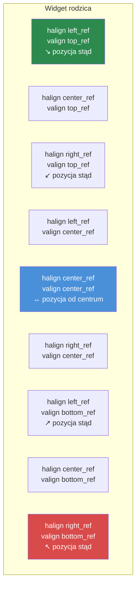

# Rozdział 3.3: Rozmiarowanie i pozycjonowanie

[Strona główna](../../README.md) | [<< Poprzedni: Format pliku layoutu](02-layout-files.md) | **Rozmiarowanie i pozycjonowanie** | [Następny: Widgety kontenerowe >>](04-containers.md)

---

System layoutu DayZ używa **podwójnego trybu współrzędnych** -- każdy wymiar może być proporcjonalny (względem rodzica) lub pikselowy (bezwzględne piksele ekranu). Niezrozumienie tego systemu jest głównym źródłem błędów layoutu. Ten rozdział wyjaśnia go szczegółowo.

---

## Podstawowy koncept: proporcjonalny kontra pikselowy

Każdy widget ma pozycję (`x, y`) i rozmiar (`width, height`). Każda z tych czterech wartości może niezależnie być albo:

- **Proporcjonalna** (0.0 do 1.0) -- relatywna do wymiarów widgetu rodzica
- **Pikselowa** (dowolna liczba dodatnia) -- bezwzględne piksele ekranu

Tryb dla każdej osi jest kontrolowany przez cztery flagi:

| Flaga | Kontroluje | `0` = Proporcjonalny | `1` = Pikselowy |
|---|---|---|---|
| `hexactpos` | Pozycja X | Ułamek szerokości rodzica | Piksele od lewej |
| `vexactpos` | Pozycja Y | Ułamek wysokości rodzica | Piksele od góry |
| `hexactsize` | Szerokość | Ułamek szerokości rodzica | Szerokość w pikselach |
| `vexactsize` | Wysokość | Ułamek wysokości rodzica | Wysokość w pikselach |

Oznacza to, że możesz dowolnie mieszać tryby. Na przykład widget może mieć proporcjonalną szerokość, ale pikselową wysokość -- bardzo częsty wzorzec dla wierszy i pasków.

---

## Zrozumienie trybu proporcjonalnego

Gdy flaga ma wartość `0` (proporcjonalny), wartość reprezentuje **ułamek wymiaru rodzica**:

- `size 1 1` z `hexactsize 0` i `vexactsize 0` oznacza "100% szerokości rodzica, 100% wysokości rodzica" -- dziecko wypełnia rodzica.
- `size 0.5 0.3` oznacza "50% szerokości rodzica, 30% wysokości rodzica."
- `position 0.5 0` z `hexactpos 0` oznacza "zacznij od 50% szerokości rodzica od lewej."

Tryb proporcjonalny jest niezależny od rozdzielczości. Widget skaluje się automatycznie, gdy rodzic zmienia rozmiar lub gdy gra działa w innej rozdzielczości.

```
// Widget wypełniający lewą połowę rodzica
FrameWidgetClass LeftHalf {
 position 0 0
 size 0.5 1
 hexactpos 0
 vexactpos 0
 hexactsize 0
 vexactsize 0
}
```

---

## Zrozumienie trybu pikselowego

Gdy flaga ma wartość `1` (pikselowy/dokładny), wartość jest w **pikselach ekranu**:

- `size 200 40` z `hexactsize 1` i `vexactsize 1` oznacza "200 pikseli szerokości, 40 pikseli wysokości."
- `position 10 10` z `hexactpos 1` i `vexactpos 1` oznacza "10 pikseli od lewej krawędzi rodzica, 10 pikseli od górnej krawędzi rodzica."

Tryb pikselowy daje dokładną kontrolę, ale NIE skaluje się automatycznie z rozdzielczością.

```
// Przycisk o stałym rozmiarze: 120x30 pikseli
ButtonWidgetClass MyButton {
 position 10 10
 size 120 30
 hexactpos 1
 vexactpos 1
 hexactsize 1
 vexactsize 1
 text "Click Me"
}
```

---

## Mieszanie trybów: najczęstszy wzorzec

Prawdziwa moc pochodzi z mieszania trybów proporcjonalnych i pikselowych. Najczęstszy wzorzec w profesjonalnych modach DayZ to:

**Proporcjonalna szerokość, pikselowa wysokość** -- dla pasków, wierszy i nagłówków.

```
// Wiersz na pełną szerokość, dokładnie 30 pikseli wysokości
FrameWidgetClass Row {
 position 0 0
 size 1 30
 hexactpos 0
 vexactpos 0
 hexactsize 0        // Szerokość: proporcjonalna (100% rodzica)
 vexactsize 1        // Wysokość: pikselowa (30px)
}
```

**Proporcjonalna szerokość i wysokość, pikselowa pozycja** -- dla wyśrodkowanych paneli przesuniętych o stałą wartość.

```
// Panel 60% x 70%, przesunięcie 0px od centrum
FrameWidgetClass Dialog {
 position 0 0
 size 0.6 0.7
 halign center_ref
 valign center_ref
 hexactpos 1         // Pozycja: pikselowa (0px przesunięcie od centrum)
 vexactpos 1
 hexactsize 0        // Rozmiar: proporcjonalny (60% x 70%)
 vexactsize 0
}
```

---

## Odniesienia wyrównania: halign i valign

Atrybuty `halign` i `valign` zmieniają **punkt odniesienia** dla pozycjonowania:

| Wartość | Efekt |
|---|---|
| `left_ref` (domyślny) | Pozycja mierzona od lewej krawędzi rodzica |
| `center_ref` | Pozycja mierzona od centrum rodzica |
| `right_ref` | Pozycja mierzona od prawej krawędzi rodzica |
| `top_ref` (domyślny) | Pozycja mierzona od górnej krawędzi rodzica |
| `center_ref` | Pozycja mierzona od centrum rodzica |
| `bottom_ref` | Pozycja mierzona od dolnej krawędzi rodzica |

### Punkty odniesienia wyrównania



W połączeniu z pikselową pozycją (`hexactpos 1`) odniesienia wyrównania czynią centrowanie trywialnym:

```
// Wyśrodkowany na ekranie bez przesunięcia
FrameWidgetClass CenteredDialog {
 position 0 0
 size 0.4 0.5
 halign center_ref
 valign center_ref
 hexactpos 1
 vexactpos 1
 hexactsize 0
 vexactsize 0
}
```

Z `center_ref` pozycja `0 0` oznacza "wyśrodkowane w rodzicu." Pozycja `10 0` oznacza "10 pikseli na prawo od centrum."

### Elementy wyrównane do prawej

```
// Ikona przypięta do prawej krawędzi, 5px od krawędzi
ImageWidgetClass StatusIcon {
 position 5 5
 size 24 24
 halign right_ref
 valign top_ref
 hexactpos 1
 vexactpos 1
 hexactsize 1
 vexactsize 1
}
```

### Elementy wyrównane do dołu

```
// Pasek statusu na dole rodzica
FrameWidgetClass StatusBar {
 position 0 0
 size 1 30
 halign left_ref
 valign bottom_ref
 hexactpos 1
 vexactpos 1
 hexactsize 0
 vexactsize 1
}
```

---

## KRYTYCZNE: Brak ujemnych wartości rozmiaru

**Nigdy nie używaj ujemnych wartości rozmiaru widgetu w plikach layoutu.** Ujemne rozmiary powodują niezdefiniowane zachowanie -- widgety mogą stać się niewidoczne, renderować się nieprawidłowo lub zawiesić system UI. Jeśli potrzebujesz ukryć widget, użyj `visible 0`.

To jeden z najczęstszych błędów layoutu. Jeśli twój widget się nie wyświetla, sprawdź, czy przypadkiem nie ustawiłeś ujemnej wartości rozmiaru.

---

## Typowe wzorce rozmiarowania

### Nakładka pełnoekranowa

```
FrameWidgetClass Overlay {
 position 0 0
 size 1 1
 hexactpos 0
 vexactpos 0
 hexactsize 0
 vexactsize 0
}
```

### Wyśrodkowany dialog (60% x 70%)

```
FrameWidgetClass Dialog {
 position 0 0
 size 0.6 0.7
 halign center_ref
 valign center_ref
 hexactpos 1
 vexactpos 1
 hexactsize 0
 vexactsize 0
}
```

### Panel boczny wyrównany do prawej (25% szerokości)

```
FrameWidgetClass SidePanel {
 position 0 0
 size 0.25 1
 halign right_ref
 hexactpos 1
 vexactpos 0
 hexactsize 0
 vexactsize 0
}
```

### Górny pasek (pełna szerokość, stała wysokość)

```
FrameWidgetClass TopBar {
 position 0 0
 size 1 40
 hexactpos 0
 vexactpos 0
 hexactsize 0
 vexactsize 1
}
```

### Plakietka w prawym dolnym rogu

```
FrameWidgetClass Badge {
 position 10 10
 size 80 24
 halign right_ref
 valign bottom_ref
 hexactpos 1
 vexactpos 1
 hexactsize 1
 vexactsize 1
}
```

### Wyśrodkowana ikona o stałym rozmiarze

```
ImageWidgetClass Icon {
 position 0 0
 size 64 64
 halign center_ref
 valign center_ref
 hexactpos 1
 vexactpos 1
 hexactsize 1
 vexactsize 1
}
```

---

## Programowe pozycjonowanie i rozmiarowanie

W kodzie możesz odczytywać i ustawiać pozycję oraz rozmiar używając zarówno współrzędnych proporcjonalnych, jak i pikselowych (ekranowych):

```c
// Współrzędne proporcjonalne (zakres 0-1)
float x, y, w, h;
widget.GetPos(x, y);           // Odczytaj pozycję proporcjonalną
widget.SetPos(0.5, 0.1);      // Ustaw pozycję proporcjonalną
widget.GetSize(w, h);          // Odczytaj rozmiar proporcjonalny
widget.SetSize(0.3, 0.2);     // Ustaw rozmiar proporcjonalny

// Współrzędne pikselowe/ekranowe
widget.GetScreenPos(x, y);     // Odczytaj pozycję pikselową
widget.SetScreenPos(100, 50);  // Ustaw pozycję pikselową
widget.GetScreenSize(w, h);    // Odczytaj rozmiar pikselowy
widget.SetScreenSize(400, 300);// Ustaw rozmiar pikselowy
```

Aby programowo wyśrodkować widget na ekranie:

```c
int screen_w, screen_h;
GetScreenSize(screen_w, screen_h);

float w, h;
widget.GetScreenSize(w, h);
widget.SetScreenPos((screen_w - w) / 2, (screen_h - h) / 2);
```

---

## Atrybut `scaled`

Gdy ustawione jest `scaled 1`, widget respektuje ustawienie skalowania UI w DayZ (Opcje > Wideo > Rozmiar HUD). Jest to ważne dla elementów HUD, które powinny skalować się zgodnie z preferencją użytkownika.

Bez `scaled` widgety o pikselowym rozmiarze będą miały ten sam fizyczny rozmiar niezależnie od opcji skalowania UI.

---

## Atrybut `fixaspect`

Użyj `fixaspect`, aby zachować proporcje widgetu:

- `fixaspect fixwidth` -- Wysokość dostosowuje się, aby zachować proporcje na podstawie szerokości
- `fixaspect fixheight` -- Szerokość dostosowuje się, aby zachować proporcje na podstawie wysokości

Jest to głównie przydatne dla `ImageWidget`, aby zapobiec zniekształceniu obrazu.

---

## Kolejność Z i priorytet

Atrybut `priority` kontroluje, które widgety renderują się na wierzchu, gdy się nakładają. Wyższe wartości renderują się nad niższymi.

| Zakres priorytetu | Typowe użycie |
|-------------------|---------------|
| 0-5 | Elementy tła, panele dekoracyjne |
| 10-50 | Normalne elementy UI, komponenty HUD |
| 50-100 | Elementy nakładkowe, pływające panele |
| 100-200 | Powiadomienia, podpowiedzi |
| 998-999 | Okna modalne, nakładki blokujące |

```
FrameWidget myBackground {
    priority 1
    // ...
}

FrameWidget myDialog {
    priority 999
    // ...
}
```

**Ważne:** Priorytet wpływa tylko na kolejność renderowania wśród rodzeństwa w tym samym rodzicu. Zagnieżdżone dzieci są zawsze rysowane nad swoim rodzicem niezależnie od wartości priorytetów.

---

## Debugowanie problemów z rozmiarami

Gdy widget nie pojawia się tam, gdzie oczekujesz:

1. **Sprawdź flagi exact** -- Czy `hexactsize` jest ustawiony na `0`, gdy chodziło ci o piksele? Wartość `200` w trybie proporcjonalnym oznacza 200x szerokość rodzica (daleko poza ekranem).
2. **Sprawdź ujemne rozmiary** -- Każda ujemna wartość w `size` spowoduje problemy.
3. **Sprawdź rozmiar rodzica** -- Proporcjonalne dziecko rodzica o zerowym rozmiarze ma zerowy rozmiar.
4. **Sprawdź `visible`** -- Widgety domyślnie są widoczne, ale jeśli rodzic jest ukryty, wszystkie dzieci też.
5. **Sprawdź `priority`** -- Widget z niższym priorytetem może być ukryty za innym.
6. **Użyj `clipchildren`** -- Jeśli rodzic ma `clipchildren 1`, dzieci poza jego granicami nie są widoczne.

---

## Dobre praktyki

- Zawsze jawnie określaj wszystkie cztery flagi exact (`hexactpos`, `vexactpos`, `hexactsize`, `vexactsize`). Ich pominięcie prowadzi do nieprzewidywalnego zachowania, ponieważ wartości domyślne różnią się między typami widgetów.
- Używaj wzorca proporcjonalna-szerokość + pikselowa-wysokość dla wierszy i pasków. To najbardziej bezpieczna kombinacja pod względem rozdzielczości i standard wśród profesjonalnych modów.
- Centruj dialogi z `halign center_ref` + `valign center_ref` + pikselowa pozycja `0 0`, nie z proporcjonalną pozycją `0.5 0.5`. Podejście z odniesieniem wyrównania pozostaje wyśrodkowane niezależnie od rozmiaru widgetu.
- Unikaj pikselowych rozmiarów dla elementów pełnoekranowych lub bliskich pełnemu ekranowi. Używaj proporcjonalnego rozmiarowania, aby UI dostosowywał się do każdej rozdzielczości (1080p, 1440p, 4K).
- Przy użyciu `SetScreenPos()` / `SetScreenSize()` w kodzie, wywołuj je po dołączeniu widgetu do rodzica. Wywołanie przed dołączeniem może dać nieprawidłowe współrzędne.

---

## Teoria kontra praktyka

> Co mówi dokumentacja w porównaniu z tym, jak rzeczy faktycznie działają w runtime.

| Koncept | Teoria | Rzeczywistość |
|---------|--------|---------------|
| Rozmiarowanie proporcjonalne | Wartości 0.0-1.0 skalują się względem rodzica | Jeśli rodzic ma pikselowy rozmiar, proporcjonalne wartości dziecka są względne do tej wartości pikselowej, nie do ekranu -- dziecko rodzica o szerokości 200px z `size 0.5` ma 100px |
| Wyrównanie `center_ref` | Widget centruje się w rodzicu | Lewy górny róg widgetu jest umieszczany w punkcie centralnym -- widget wisi w prawo i w dół od centrum, chyba że pozycja to `0 0` w trybie pikselowym |
| Porządkowanie Z przez `priority` | Wyższe wartości renderują się na wierzchu | Priorytet wpływa tylko na rodzeństwo w tym samym rodzicu. Dziecko zawsze renderuje się nad swoim rodzicem niezależnie od wartości priorytetów |
| Atrybut `scaled` | Widget respektuje ustawienie Rozmiar HUD | Wpływa tylko na wymiary w trybie pikselowym. Wymiary proporcjonalne już skalują się z rodzicem i ignorują flagę `scaled` |
| Ujemne wartości pozycji | Powinny przesuwać w odwrotnym kierunku | Działa dla pozycji (przesunięcie w lewo/do góry od odniesienia), ale ujemne wartości rozmiaru powodują niezdefiniowane zachowanie renderowania -- nigdy ich nie używaj |

---

## Kompatybilność i wpływ

- **Multi-Mod:** Rozmiarowanie i pozycjonowanie są per-widget i nie mogą kolidować między modami. Jednak mody używające pełnoekranowych nakładek (`size 1 1` na korzeniu) z `priority 999` mogą blokować elementy UI innych modów przed otrzymywaniem wejścia.
- **Wydajność:** Rozmiarowanie proporcjonalne wymaga przeliczenia względem rodzica w każdej klatce dla animowanych lub dynamicznych widgetów. Dla statycznych layoutów nie ma mierzalnej różnicy między trybem proporcjonalnym a pikselowym.
- **Wersja:** Podwójny system współrzędnych (proporcjonalny kontra pikselowy) jest stabilny od DayZ 0.63 Experimental. Zachowanie atrybutu `scaled` zostało udoskonalone w DayZ 1.14, aby lepiej respektować suwak Rozmiar HUD.

---

## Następne kroki

- [3.4 Widgety kontenerowe](04-containers.md) -- Jak spacery i widgety przewijania automatycznie obsługują layout
- [3.5 Programowe tworzenie widgetów](05-programmatic-widgets.md) -- Ustawianie rozmiaru i pozycji z kodu
