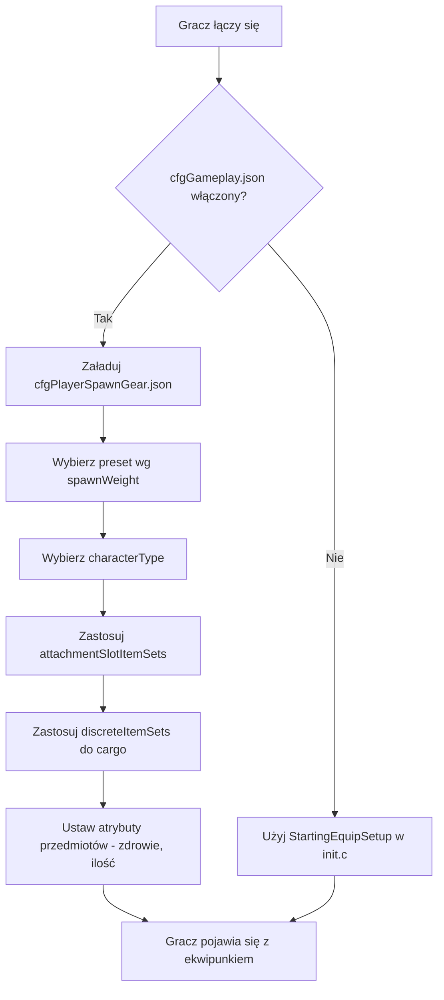

# Rozdział 5.6: Konfiguracja ekwipunku startowego

[Strona główna](../../README.md) | [<< Poprzedni: Pliki konfiguracyjne serwera](05-server-configs.md) | **Konfiguracja ekwipunku startowego**

---

> **Podsumowanie:** DayZ posiada dwa uzupełniające się systemy kontrolujące sposób, w jaki gracze pojawiają się w świecie: **punkty spawnu** określają *gdzie* postać pojawia się na mapie, a **ekwipunek startowy** określa *jakie wyposażenie* niesie. Ten rozdział szczegółowo omawia oba systemy, w tym strukturę plików, referencję pól, praktyczne presety i integrację z modami.

---

## Spis treści

- [Przegląd](#przegląd)
- [Dwa systemy](#dwa-systemy)
- [Ekwipunek startowy: cfgPlayerSpawnGear.json](#ekwipunek-startowy-cfgplayerspawngearjson)
  - [Włączanie presetów ekwipunku startowego](#włączanie-presetów-ekwipunku-startowego)
  - [Struktura presetu](#struktura-presetu)
  - [attachmentSlotItemSets](#attachmentslotitemsets)
  - [DiscreteItemSets](#discreteitemsets)
  - [discreteUnsortedItemSets](#discreteunsorteditemsets)
  - [ComplexChildrenTypes](#complexchildrentypes)
  - [SimpleChildrenTypes](#simplechildrentypes)
  - [Atrybuty](#atrybuty)
- [Punkty spawnu: cfgplayerspawnpoints.xml](#punkty-spawnu-cfgplayerspawnpointsxml)
  - [Struktura pliku](#struktura-pliku)
  - [spawn_params](#spawn_params)
  - [generator_params](#generator_params)
  - [Grupy spawnu](#grupy-spawnu)
  - [Konfiguracje per mapa](#konfiguracje-per-mapa)
- [Praktyczne przykłady](#praktyczne-przykłady)
  - [Domyślny ekwipunek ocalałego](#domyślny-ekwipunek-ocalałego)
  - [Zestaw startowy wojskowy](#zestaw-startowy-wojskowy)
  - [Zestaw startowy medyczny](#zestaw-startowy-medyczny)
  - [Losowy wybór ekwipunku](#losowy-wybór-ekwipunku)
- [Integracja z modami](#integracja-z-modami)
- [Najlepsze praktyki](#najlepsze-praktyki)
- [Częste błędy](#częste-błędy)

---

## Przegląd



Gdy gracz pojawia się jako świeża postać w DayZ, serwer odpowiada na dwa pytania:

1. **Gdzie pojawia się postać?** --- Kontrolowane przez `cfgplayerspawnpoints.xml`.
2. **Co postać niesie?** --- Kontrolowane przez pliki JSON presetów ekwipunku startowego, zarejestrowane w `cfggameplay.json`.

Oba systemy działają wyłącznie po stronie serwera. Klienci nigdy nie widzą tych plików konfiguracyjnych i nie mogą ich modyfikować. System ekwipunku startowego został wprowadzony jako alternatywa dla skryptowania loadoutów w `init.c`, pozwalając administratorom serwera definiować wiele ważonych presetów w JSON bez pisania jakiegokolwiek kodu Enforce Script.

> **Ważne:** System presetów ekwipunku startowego **całkowicie zastępuje** metodę `StartingEquipSetup()` w pliku misji `init.c`. Jeśli włączysz presety ekwipunku startowego w `cfggameplay.json`, twój skryptowy kod loadoutu zostanie zignorowany. Podobnie, typy postaci zdefiniowane w presetach zastępują model postaci wybrany w menu głównym.

---

## Dwa systemy

| System | Plik | Format | Kontroluje |
|--------|------|--------|----------|
| Punkty spawnu | `cfgplayerspawnpoints.xml` | XML | **Gdzie** --- pozycje na mapie, punktacja dystansu, grupy spawnu |
| Ekwipunek startowy | Własne pliki JSON presetów | JSON | **Co** --- model postaci, ubrania, broń, cargo, pasek szybkiego dostępu |

Oba systemy są niezależne. Możesz używać własnych punktów spawnu z vanillowym ekwipunkiem, własnego ekwipunku z vanillowymi punktami spawnu, lub dostosować oba.

---

## Ekwipunek startowy: cfgPlayerSpawnGear.json

### Włączanie presetów ekwipunku startowego

Presety ekwipunku startowego **nie** są domyślnie włączone. Aby ich użyć, musisz:

1. Utworzyć jeden lub więcej plików JSON presetów w folderze misji (np. `mpmissions/dayzOffline.chernarusplus/`).
2. Zarejestrować je w `cfggameplay.json` w sekcji `PlayerData.spawnGearPresetFiles`.
3. Upewnić się, że `enableCfgGameplayFile = 1` jest ustawione w `serverDZ.cfg`.

```json
{
  "version": 122,
  "PlayerData": {
    "spawnGearPresetFiles": [
      "survivalist.json",
      "casual.json",
      "military.json"
    ]
  }
}
```

Pliki presetów mogą być zagnieżdżone w podkatalogach w folderze misji:

```json
"spawnGearPresetFiles": [
  "custom/survivalist.json",
  "custom/casual.json",
  "custom/military.json"
]
```

Każdy plik JSON zawiera jeden obiekt presetu. Wszystkie zarejestrowane presety są łączone w pulę, a serwer wybiera jeden na podstawie `spawnWeight` za każdym razem, gdy pojawia się świeża postać.

### Struktura presetu

Preset to obiekt JSON najwyższego poziomu z następującymi polami:

| Pole | Typ | Opis |
|-------|------|-------------|
| `name` | string | Czytelna dla człowieka nazwa presetu (dowolny ciąg znaków, używany tylko do identyfikacji) |
| `spawnWeight` | integer | Waga dla losowego wyboru. Minimum to `1`. Wyższe wartości zwiększają prawdopodobieństwo wybrania tego presetu |
| `characterTypes` | array | Tablica nazw klas typów postaci (np. `"SurvivorM_Mirek"`). Jeden jest losowo wybierany, gdy ten preset zostaje użyty |
| `attachmentSlotItemSets` | array | Tablica struktur `AttachmentSlots` definiujących, co postać nosi (ubrania, broń na ramionach itp.) |
| `discreteUnsortedItemSets` | array | Tablica struktur `DiscreteUnsortedItemSets` definiujących przedmioty cargo umieszczane w dowolnej dostępnej przestrzeni inwentarza |

> **Uwaga:** Jeśli `characterTypes` jest puste lub pominięte, dla tego presetu zostanie użyty model postaci ostatnio wybrany w ekranie tworzenia postaci w menu głównym.

Minimalny przykład:

```json
{
  "spawnWeight": 1,
  "name": "Basic Survivor",
  "characterTypes": [
    "SurvivorM_Mirek",
    "SurvivorF_Eva"
  ],
  "attachmentSlotItemSets": [],
  "discreteUnsortedItemSets": []
}
```

### attachmentSlotItemSets

Ta tablica definiuje przedmioty trafiające do konkretnych slotów załączników postaci --- ciało, nogi, stopy, głowa, plecy, kamizelka, ramiona, okulary itp.

Każdy wpis celuje w jeden slot:

| Pole | Typ | Opis |
|-------|------|-------------|
| `slotName` | string | Nazwa slotu załącznika. Pochodzi z CfgSlots. Typowe wartości: `"Body"`, `"Legs"`, `"Feet"`, `"Head"`, `"Back"`, `"Vest"`, `"Eyewear"`, `"Gloves"`, `"Hips"`, `"shoulderL"`, `"shoulderR"` |
| `discreteItemSets` | array | Tablica wariantów przedmiotów, które mogą wypełnić ten slot (jeden jest wybierany na podstawie `spawnWeight`) |

> **Skróty dla ramion:** Możesz używać `"shoulderL"` i `"shoulderR"` jako nazw slotów. Silnik automatycznie tłumaczy je na prawidłowe wewnętrzne nazwy CfgSlots.

```json
{
  "slotName": "Body",
  "discreteItemSets": [
    {
      "itemType": "TShirt_Beige",
      "spawnWeight": 1,
      "attributes": {
        "healthMin": 0.45,
        "healthMax": 0.65,
        "quantityMin": 1.0,
        "quantityMax": 1.0
      },
      "quickBarSlot": -1
    },
    {
      "itemType": "TShirt_Black",
      "spawnWeight": 1,
      "attributes": {
        "healthMin": 0.45,
        "healthMax": 0.65,
        "quantityMin": 1.0,
        "quantityMax": 1.0
      },
      "quickBarSlot": -1
    }
  ]
}
```

### DiscreteItemSets

Każdy wpis w `discreteItemSets` reprezentuje jedną możliwą opcję przedmiotu dla danego slotu. Serwer losowo wybiera jeden wpis, ważony przez `spawnWeight`. Ta struktura jest używana zarówno wewnątrz `attachmentSlotItemSets` (dla przedmiotów opartych na slotach), jak i stanowi mechanizm losowego wyboru.

| Pole | Typ | Opis |
|-------|------|-------------|
| `itemType` | string | Nazwa klasy przedmiotu (typename). Użyj `""` (pusty ciąg), aby reprezentować "nic" --- slot pozostaje pusty |
| `spawnWeight` | integer | Waga dla wyboru. Minimum `1`. Wyższa = bardziej prawdopodobna |
| `attributes` | object | Zakresy zdrowia i ilości dla tego przedmiotu. Zobacz [Atrybuty](#atrybuty) |
| `quickBarSlot` | integer | Przypisanie do slotu paska szybkiego dostępu (indeks od 0). Użyj `-1`, aby nie przypisywać do paska |
| `complexChildrenTypes` | array | Przedmioty do stworzenia wewnątrz tego przedmiotu. Zobacz [ComplexChildrenTypes](#complexchildrentypes) |
| `simpleChildrenTypes` | array | Nazwy klas przedmiotów do stworzenia wewnątrz tego przedmiotu z domyślnymi lub rodzicielskimi atrybutami |
| `simpleChildrenUseDefaultAttributes` | bool | Jeśli `true`, proste dzieci używają `attributes` rodzica. Jeśli `false`, używają domyślnych wartości konfiguracji |

**Sztuczka z pustym przedmiotem:** Aby slot miał 50/50 szans na bycie pustym lub wypełnionym, użyj pustego `itemType`:

```json
{
  "slotName": "Eyewear",
  "discreteItemSets": [
    {
      "itemType": "AviatorGlasses",
      "spawnWeight": 1,
      "attributes": {
        "healthMin": 1.0,
        "healthMax": 1.0
      },
      "quickBarSlot": -1
    },
    {
      "itemType": "",
      "spawnWeight": 1
    }
  ]
}
```

### discreteUnsortedItemSets

Ta tablica najwyższego poziomu definiuje przedmioty trafiające do **cargo** postaci --- dowolnej dostępnej przestrzeni inwentarza we wszystkich założonych ubraniach i kontenerach. W przeciwieństwie do `attachmentSlotItemSets`, te przedmioty nie są umieszczane w konkretnym slocie; silnik automatycznie znajduje miejsce.

Każdy wpis reprezentuje jeden wariant cargo, a serwer wybiera jeden na podstawie `spawnWeight`.

| Pole | Typ | Opis |
|-------|------|-------------|
| `name` | string | Czytelna nazwa (tylko do identyfikacji) |
| `spawnWeight` | integer | Waga dla wyboru. Minimum `1` |
| `attributes` | object | Domyślne zakresy zdrowia/ilości. Używane przez dzieci gdy `simpleChildrenUseDefaultAttributes` jest `true` |
| `complexChildrenTypes` | array | Przedmioty do stworzenia w cargo, każdy z własnymi atrybutami i zagnieżdżeniem |
| `simpleChildrenTypes` | array | Nazwy klas przedmiotów do stworzenia w cargo |
| `simpleChildrenUseDefaultAttributes` | bool | Jeśli `true`, proste dzieci używają `attributes` tej struktury. Jeśli `false`, używają domyślnych wartości konfiguracji |

```json
{
  "name": "Cargo1",
  "spawnWeight": 1,
  "attributes": {
    "healthMin": 1.0,
    "healthMax": 1.0,
    "quantityMin": 1.0,
    "quantityMax": 1.0
  },
  "complexChildrenTypes": [
    {
      "itemType": "BandageDressing",
      "attributes": {
        "healthMin": 1.0,
        "healthMax": 1.0,
        "quantityMin": 1.0,
        "quantityMax": 1.0
      },
      "quickBarSlot": 2
    }
  ],
  "simpleChildrenUseDefaultAttributes": false,
  "simpleChildrenTypes": [
    "Rag",
    "Apple"
  ]
}
```

### ComplexChildrenTypes

Złożone dzieci to przedmioty tworzone **wewnątrz** przedmiotu nadrzędnego z pełną kontrolą nad ich atrybutami, przypisaniem do paska szybkiego dostępu i ich własnymi zagnieżdżonymi dziećmi. Głównym przypadkiem użycia jest tworzenie przedmiotów z zawartością --- na przykład broni z akcesoriami lub garnka z jedzeniem w środku.

| Pole | Typ | Opis |
|-------|------|-------------|
| `itemType` | string | Nazwa klasy przedmiotu |
| `attributes` | object | Zakresy zdrowia/ilości dla tego konkretnego przedmiotu |
| `quickBarSlot` | integer | Przypisanie do slotu paska szybkiego dostępu. `-1` = nie przypisuj |
| `simpleChildrenUseDefaultAttributes` | bool | Czy proste dzieci dziedziczą te atrybuty |
| `simpleChildrenTypes` | array | Nazwy klas przedmiotów do stworzenia wewnątrz tego przedmiotu |

Przykład --- broń z akcesoriami i magazynkiem:

```json
{
  "itemType": "AKM",
  "attributes": {
    "healthMin": 0.5,
    "healthMax": 1.0,
    "quantityMin": 1.0,
    "quantityMax": 1.0
  },
  "quickBarSlot": 1,
  "complexChildrenTypes": [
    {
      "itemType": "AK_PlasticBttstck",
      "attributes": {
        "healthMin": 0.4,
        "healthMax": 0.6
      },
      "quickBarSlot": -1
    },
    {
      "itemType": "PSO1Optic",
      "attributes": {
        "healthMin": 0.1,
        "healthMax": 0.2
      },
      "quickBarSlot": -1,
      "simpleChildrenUseDefaultAttributes": true,
      "simpleChildrenTypes": [
        "Battery9V"
      ]
    },
    {
      "itemType": "Mag_AKM_30Rnd",
      "attributes": {
        "healthMin": 0.5,
        "healthMax": 0.5,
        "quantityMin": 1.0,
        "quantityMax": 1.0
      },
      "quickBarSlot": -1
    }
  ],
  "simpleChildrenUseDefaultAttributes": false,
  "simpleChildrenTypes": [
    "AK_PlasticHndgrd",
    "AK_Bayonet"
  ]
}
```

W tym przykładzie AKM pojawia się z kolbą, celownikiem (z baterią w środku) i załadowanym magazynkiem jako złożone dzieci, plus chwyt i bagnet jako proste dzieci. Proste dzieci używają domyślnych wartości konfiguracji, ponieważ `simpleChildrenUseDefaultAttributes` jest ustawione na `false`.

### SimpleChildrenTypes

Proste dzieci to skrócony zapis tworzenia przedmiotów wewnątrz rodzica bez określania indywidualnych atrybutów. Są tablicą nazw klas przedmiotów (ciągów znaków).

Ich atrybuty są określane przez flagę `simpleChildrenUseDefaultAttributes`:

- **`true`** --- Przedmioty używają `attributes` zdefiniowanych w strukturze nadrzędnej.
- **`false`** --- Przedmioty używają domyślnych wartości konfiguracji silnika (zwykle pełne zdrowie i ilość).

Proste dzieci nie mogą mieć własnych zagnieżdżonych dzieci ani przypisań do paska szybkiego dostępu. Dla tych możliwości użyj zamiast tego `complexChildrenTypes`.

### Atrybuty

Atrybuty kontrolują stan i ilość tworzonych przedmiotów. Wszystkie wartości są liczbami zmiennoprzecinkowymi między `0.0` a `1.0`:

| Pole | Typ | Opis |
|-------|------|-------------|
| `healthMin` | float | Minimalny procent zdrowia. `1.0` = nieskazitelny, `0.0` = zniszczony |
| `healthMax` | float | Maksymalny procent zdrowia. Losowa wartość między min a max jest stosowana |
| `quantityMin` | float | Minimalny procent ilości. Dla magazynków: poziom napełnienia. Dla jedzenia: pozostałe porcje |
| `quantityMax` | float | Maksymalny procent ilości |

Gdy zarówno min, jak i max są określone, silnik wybiera losową wartość z tego zakresu. To tworzy naturalną wariację --- na przykład zdrowie między `0.45` a `0.65` oznacza, że przedmioty pojawiają się w stanie zużytym do uszkodzonego.

```json
"attributes": {
  "healthMin": 0.45,
  "healthMax": 0.65,
  "quantityMin": 1.0,
  "quantityMax": 1.0
}
```

---

## Punkty spawnu: cfgplayerspawnpoints.xml

Ten plik XML definiuje, gdzie gracze pojawiają się na mapie. Znajduje się w folderze misji (np. `mpmissions/dayzOffline.chernarusplus/cfgplayerspawnpoints.xml`).

### Struktura pliku

Element główny zawiera do trzech sekcji:

| Sekcja | Przeznaczenie |
|---------|---------|
| `<fresh>` | **Wymagana.** Punkty spawnu dla nowo utworzonych postaci |
| `<hop>` | Punkty spawnu dla graczy przeskakujących z innego serwera na tej samej mapie (tylko serwery oficjalne) |
| `<travel>` | Punkty spawnu dla graczy podróżujących z innej mapy (tylko serwery oficjalne) |

Każda sekcja zawiera te same trzy podementy: `<spawn_params>`, `<generator_params>` i `<generator_posbubbles>`.

```xml
<?xml version="1.0" encoding="UTF-8" standalone="yes" ?>
<playerspawnpoints>
    <fresh>
        <spawn_params>...</spawn_params>
        <generator_params>...</generator_params>
        <generator_posbubbles>...</generator_posbubbles>
    </fresh>
    <hop>
        <spawn_params>...</spawn_params>
        <generator_params>...</generator_params>
        <generator_posbubbles>...</generator_posbubbles>
    </hop>
    <travel>
        <spawn_params>...</spawn_params>
        <generator_params>...</generator_params>
        <generator_posbubbles>...</generator_posbubbles>
    </travel>
</playerspawnpoints>
```

### spawn_params

Parametry uruchomieniowe oceniające kandydackie punkty spawnu względem pobliskich obiektów. Punkty bliżej niż `min_dist` są odrzucane. Punkty między `min_dist` a `max_dist` są preferowane nad punktami poza `max_dist`.

```xml
<spawn_params>
    <min_dist_infected>30</min_dist_infected>
    <max_dist_infected>70</max_dist_infected>
    <min_dist_player>65</min_dist_player>
    <max_dist_player>150</max_dist_player>
    <min_dist_static>0</min_dist_static>
    <max_dist_static>2</max_dist_static>
</spawn_params>
```

| Parametr | Opis |
|-----------|-------------|
| `min_dist_infected` | Minimalna odległość od zainfekowanych w metrach. Punkty bliżej niż ta wartość są penalizowane |
| `max_dist_infected` | Maksymalna odległość punktacji od zainfekowanych |
| `min_dist_player` | Minimalna odległość od innych graczy w metrach. Zapobiega pojawianiu się świeżych spawników na istniejących graczach |
| `max_dist_player` | Maksymalna odległość punktacji od innych graczy |
| `min_dist_static` | Minimalna odległość od budynków/obiektów w metrach |
| `max_dist_static` | Maksymalna odległość punktacji od budynków/obiektów |

Mapa Sakhal dodaje również parametry `min_dist_trigger` i `max_dist_trigger` z 6-krotnym mnożnikiem wagi dla odległości stref wyzwalacza.

**Logika punktacji:** Silnik oblicza wynik dla każdego punktu kandydackiego. Odległość od `0` do `min_dist` daje wynik `-1` (prawie odrzucony). Odległość od `min_dist` do punktu środkowego daje wynik do `1.1`. Odległość od punktu środkowego do `max_dist` daje wynik malejący od `1.1` do `0.1`. Poza `max_dist` wynik wynosi `0`. Wyższy łączny wynik = bardziej prawdopodobna lokalizacja spawnu.

### generator_params

Kontroluje sposób generowania siatki kandydackich punktów spawnu wokół każdego bąbla pozycji:

```xml
<generator_params>
    <grid_density>4</grid_density>
    <grid_width>200</grid_width>
    <grid_height>200</grid_height>
    <min_dist_static>0</min_dist_static>
    <max_dist_static>2</max_dist_static>
    <min_steepness>-45</min_steepness>
    <max_steepness>45</max_steepness>
</generator_params>
```

| Parametr | Opis |
|-----------|-------------|
| `grid_density` | Częstotliwość próbkowania. `4` oznacza siatkę 4x4 punktów kandydackich. Wyższa = więcej kandydatów, większy koszt CPU. Musi wynosić co najmniej `1`. Gdy `0`, używany jest tylko punkt środkowy |
| `grid_width` | Całkowita szerokość prostokąta próbkowania w metrach |
| `grid_height` | Całkowita wysokość prostokąta próbkowania w metrach |
| `min_dist_static` | Minimalna odległość od budynków dla prawidłowego kandydata |
| `max_dist_static` | Maksymalna odległość od budynków używana do punktacji |
| `min_steepness` | Minimalne nachylenie terenu w stopniach. Punkty na bardziej stromym terenie są odrzucane |
| `max_steepness` | Maksymalne nachylenie terenu w stopniach |

Wokół każdego `<pos>` zdefiniowanego w `generator_posbubbles` silnik tworzy prostokąt o wymiarach `grid_width` x `grid_height` metrów, próbkuje go z częstotliwością `grid_density` i odrzuca punkty pokrywające się z obiektami, wodą lub przekraczające limity nachylenia.

### Grupy spawnu

Grupy pozwalają na klasterowanie punktów spawnu i rotację między nimi w czasie. Zapobiega to ciągłemu pojawianiu się wszystkich graczy w tych samych lokalizacjach.

Grupy są włączane przez `<group_params>` wewnątrz każdej sekcji:

```xml
<group_params>
    <enablegroups>true</enablegroups>
    <groups_as_regular>true</groups_as_regular>
    <lifetime>240</lifetime>
    <counter>-1</counter>
</group_params>
```

| Parametr | Opis |
|-----------|-------------|
| `enablegroups` | `true` aby włączyć rotację grup, `false` dla płaskiej listy punktów |
| `groups_as_regular` | Gdy `enablegroups` jest `false`, traktuj punkty grup jako zwykłe punkty spawnu zamiast je ignorować. Domyślnie: `true` |
| `lifetime` | Sekundy, przez które grupa pozostaje aktywna przed rotacją do innej. Użyj `-1`, aby wyłączyć timer |
| `counter` | Liczba spawnów resetujących czas życia. Każdy gracz pojawiający się w grupie resetuje timer. Użyj `-1`, aby wyłączyć licznik |

Pozycje są organizowane w nazwane grupy wewnątrz `<generator_posbubbles>`:

```xml
<generator_posbubbles>
    <group name="WestCherno">
        <pos x="6063.018555" z="1931.907227" />
        <pos x="5933.964844" z="2171.072998" />
        <pos x="6199.782715" z="2241.805176" />
    </group>
    <group name="EastCherno">
        <pos x="8040.858398" z="3332.236328" />
        <pos x="8207.115234" z="3115.650635" />
    </group>
</generator_posbubbles>
```

Poszczególne grupy mogą nadpisywać globalne wartości czasu życia i licznika:

```xml
<group name="Tents" lifetime="300" counter="25">
    <pos x="4212.421875" z="11038.256836" />
</group>
```

**Bez grup** pozycje są wylistowane bezpośrednio pod `<generator_posbubbles>`:

```xml
<generator_posbubbles>
    <pos x="4212.421875" z="11038.256836" />
    <pos x="4712.299805" z="10595" />
    <pos x="5334.310059" z="9850.320313" />
</generator_posbubbles>
```

> **Format pozycji:** Atrybuty `x` i `z` używają współrzędnych świata DayZ. `x` to wschód-zachód, `z` to północ-południe. Współrzędna `y` (wysokość) nie jest określana --- silnik umieszcza punkt na powierzchni terenu. Współrzędne możesz znaleźć za pomocą monitora debugowania w grze lub moda DayZ Editor.

### Konfiguracje per mapa

Każda mapa ma własny `cfgplayerspawnpoints.xml` w swoim folderze misji:

| Mapa | Folder misji | Uwagi |
|-----|----------------|-------|
| Chernarus | `dayzOffline.chernarusplus/` | Spawny na wybrzeżu: Cherno, Elektro, Kamyshovo, Berezino, Svetlojarsk |
| Livonia | `dayzOffline.enoch/` | Rozrzucone po mapie z różnymi nazwami grup |
| Sakhal | `dayzOffline.sakhal/` | Dodano parametry `min_dist_trigger`/`max_dist_trigger`, bardziej szczegółowe komentarze |

Tworząc niestandardową mapę lub modyfikując lokalizacje spawnu, zawsze pracuj od pliku vanilla jako punktu wyjścia i dostosuj pozycje do geografii twojej mapy.

---

## Praktyczne przykłady

### Domyślny ekwipunek ocalałego

Vanillowy preset daje świeżym spawnom losowy t-shirt, płócienne spodnie, buty sportowe, plus cargo zawierające bandaż, chemlight (losowy kolor) i owoc (losowo gruszka, śliwka lub jabłko). Wszystkie przedmioty pojawiają się w stanie zużytym do uszkodzonego.

```json
{
  "spawnWeight": 1,
  "name": "Player",
  "characterTypes": [
    "SurvivorM_Mirek",
    "SurvivorM_Boris",
    "SurvivorM_Denis",
    "SurvivorF_Eva",
    "SurvivorF_Frida",
    "SurvivorF_Gabi"
  ],
  "attachmentSlotItemSets": [
    {
      "slotName": "Body",
      "discreteItemSets": [
        {
          "itemType": "TShirt_Beige",
          "spawnWeight": 1,
          "attributes": {
            "healthMin": 0.45,
            "healthMax": 0.65,
            "quantityMin": 1.0,
            "quantityMax": 1.0
          },
          "quickBarSlot": -1
        },
        {
          "itemType": "TShirt_Black",
          "spawnWeight": 1,
          "attributes": {
            "healthMin": 0.45,
            "healthMax": 0.65,
            "quantityMin": 1.0,
            "quantityMax": 1.0
          },
          "quickBarSlot": -1
        }
      ]
    },
    {
      "slotName": "Legs",
      "discreteItemSets": [
        {
          "itemType": "CanvasPantsMidi_Beige",
          "spawnWeight": 1,
          "attributes": {
            "healthMin": 0.45,
            "healthMax": 0.65,
            "quantityMin": 1.0,
            "quantityMax": 1.0
          },
          "quickBarSlot": -1
        }
      ]
    },
    {
      "slotName": "Feet",
      "discreteItemSets": [
        {
          "itemType": "AthleticShoes_Black",
          "spawnWeight": 1,
          "attributes": {
            "healthMin": 0.45,
            "healthMax": 0.65,
            "quantityMin": 1.0,
            "quantityMax": 1.0
          },
          "quickBarSlot": -1
        }
      ]
    }
  ],
  "discreteUnsortedItemSets": [
    {
      "name": "Cargo1",
      "spawnWeight": 1,
      "attributes": {
        "healthMin": 1.0,
        "healthMax": 1.0,
        "quantityMin": 1.0,
        "quantityMax": 1.0
      },
      "complexChildrenTypes": [
        {
          "itemType": "BandageDressing",
          "attributes": {
            "healthMin": 1.0,
            "healthMax": 1.0,
            "quantityMin": 1.0,
            "quantityMax": 1.0
          },
          "quickBarSlot": 2
        },
        {
          "itemType": "Chemlight_Red",
          "attributes": {
            "healthMin": 1.0,
            "healthMax": 1.0,
            "quantityMin": 1.0,
            "quantityMax": 1.0
          },
          "quickBarSlot": 1
        },
        {
          "itemType": "Pear",
          "attributes": {
            "healthMin": 1.0,
            "healthMax": 1.0,
            "quantityMin": 1.0,
            "quantityMax": 1.0
          },
          "quickBarSlot": 3
        }
      ]
    }
  ]
}
```

### Zestaw startowy wojskowy

Bogato wyposażony preset z AKM (z akcesoriami), kamizelką kuloodporną, mundurem gorka, plecakiem z dodatkowymi magazynkami i nieposortowanym cargo zawierającym pistolet boczny i jedzenie. Używa wielu wartości `spawnWeight` do tworzenia poziomów rzadkości wariantów broni.

```json
{
  "spawnWeight": 1,
  "name": "Military - AKM",
  "characterTypes": [
    "SurvivorF_Judy",
    "SurvivorM_Lewis"
  ],
  "attachmentSlotItemSets": [
    {
      "slotName": "shoulderL",
      "discreteItemSets": [
        {
          "itemType": "AKM",
          "spawnWeight": 3,
          "attributes": {
            "healthMin": 0.5,
            "healthMax": 1.0,
            "quantityMin": 1.0,
            "quantityMax": 1.0
          },
          "quickBarSlot": 1,
          "complexChildrenTypes": [
            {
              "itemType": "AK_PlasticBttstck",
              "attributes": { "healthMin": 0.4, "healthMax": 0.6 },
              "quickBarSlot": -1
            },
            {
              "itemType": "PSO1Optic",
              "attributes": { "healthMin": 0.1, "healthMax": 0.2 },
              "quickBarSlot": -1,
              "simpleChildrenUseDefaultAttributes": true,
              "simpleChildrenTypes": ["Battery9V"]
            },
            {
              "itemType": "Mag_AKM_30Rnd",
              "attributes": {
                "healthMin": 0.5,
                "healthMax": 0.5,
                "quantityMin": 1.0,
                "quantityMax": 1.0
              },
              "quickBarSlot": -1
            }
          ],
          "simpleChildrenUseDefaultAttributes": false,
          "simpleChildrenTypes": ["AK_PlasticHndgrd", "AK_Bayonet"]
        },
        {
          "itemType": "AKM",
          "spawnWeight": 1,
          "attributes": {
            "healthMin": 1.0,
            "healthMax": 1.0,
            "quantityMin": 1.0,
            "quantityMax": 1.0
          },
          "quickBarSlot": 1,
          "complexChildrenTypes": [
            {
              "itemType": "AK_WoodBttstck",
              "attributes": { "healthMin": 1.0, "healthMax": 1.0 },
              "quickBarSlot": -1
            },
            {
              "itemType": "Mag_AKM_30Rnd",
              "attributes": {
                "healthMin": 1.0,
                "healthMax": 1.0,
                "quantityMin": 1.0,
                "quantityMax": 1.0
              },
              "quickBarSlot": -1
            }
          ],
          "simpleChildrenUseDefaultAttributes": false,
          "simpleChildrenTypes": ["AK_WoodHndgrd"]
        }
      ]
    },
    {
      "slotName": "Vest",
      "discreteItemSets": [
        {
          "itemType": "PlateCarrierVest",
          "spawnWeight": 1,
          "attributes": { "healthMin": 1.0, "healthMax": 1.0 },
          "quickBarSlot": -1,
          "simpleChildrenUseDefaultAttributes": false,
          "simpleChildrenTypes": ["PlateCarrierHolster"]
        }
      ]
    },
    {
      "slotName": "Back",
      "discreteItemSets": [
        {
          "itemType": "TaloonBag_Blue",
          "spawnWeight": 1,
          "attributes": { "healthMin": 0.5, "healthMax": 0.8 },
          "quickBarSlot": 3,
          "simpleChildrenUseDefaultAttributes": false,
          "simpleChildrenTypes": ["Mag_AKM_Drum75Rnd"]
        },
        {
          "itemType": "TaloonBag_Orange",
          "spawnWeight": 1,
          "attributes": { "healthMin": 0.5, "healthMax": 0.8 },
          "quickBarSlot": 3,
          "simpleChildrenUseDefaultAttributes": true,
          "simpleChildrenTypes": ["Mag_AKM_30Rnd", "Mag_AKM_30Rnd"]
        }
      ]
    },
    {
      "slotName": "Body",
      "discreteItemSets": [
        {
          "itemType": "GorkaEJacket_Flat",
          "spawnWeight": 1,
          "attributes": { "healthMin": 1.0, "healthMax": 1.0 },
          "quickBarSlot": -1
        }
      ]
    },
    {
      "slotName": "Legs",
      "discreteItemSets": [
        {
          "itemType": "GorkaPants_Flat",
          "spawnWeight": 1,
          "attributes": { "healthMin": 1.0, "healthMax": 1.0 },
          "quickBarSlot": -1
        }
      ]
    },
    {
      "slotName": "Feet",
      "discreteItemSets": [
        {
          "itemType": "MilitaryBoots_Bluerock",
          "spawnWeight": 1,
          "attributes": { "healthMin": 1.0, "healthMax": 1.0 },
          "quickBarSlot": -1
        }
      ]
    }
  ],
  "discreteUnsortedItemSets": [
    {
      "name": "Military Cargo",
      "spawnWeight": 1,
      "attributes": {
        "healthMin": 0.5,
        "healthMax": 1.0,
        "quantityMin": 0.6,
        "quantityMax": 0.8
      },
      "complexChildrenTypes": [
        {
          "itemType": "Mag_AKM_30Rnd",
          "attributes": {
            "healthMin": 0.1,
            "healthMax": 0.8,
            "quantityMin": 1.0,
            "quantityMax": 1.0
          },
          "quickBarSlot": -1
        }
      ],
      "simpleChildrenUseDefaultAttributes": false,
      "simpleChildrenTypes": [
        "Rag",
        "BoarSteakMeat",
        "FNX45",
        "Mag_FNX45_15Rnd",
        "AmmoBox_45ACP_25rnd"
      ]
    }
  ]
}
```

Kluczowe punkty tego przykładu:

- **Dwa warianty broni** dla tego samego slotu ramienia: wariant z `spawnWeight: 3` (plastikowe elementy, celownik PSO1) pojawia się 3x częściej niż wariant z `spawnWeight: 1` (drewniane elementy, bez celownika).
- **Zagnieżdżone dzieci**: celownik PSO1 ma `simpleChildrenTypes: ["Battery9V"]`, więc celownik pojawia się z baterią w środku.
- **Zawartość plecaka**: niebieski plecak dostaje magazynek bębnowy, a pomarańczowy dwa standardowe magazynki.

### Zestaw startowy medyczny

Preset o tematyce medyka ze skrabami, apteczką zawierającą zaopatrzenie medyczne i bronią białą do obrony.

```json
{
  "spawnWeight": 1,
  "name": "Medic",
  "attachmentSlotItemSets": [
    {
      "slotName": "shoulderR",
      "discreteItemSets": [
        {
          "itemType": "PipeWrench",
          "spawnWeight": 2,
          "attributes": { "healthMin": 0.5, "healthMax": 0.8 },
          "quickBarSlot": 2
        },
        {
          "itemType": "Crowbar",
          "spawnWeight": 1,
          "attributes": { "healthMin": 0.5, "healthMax": 0.8 },
          "quickBarSlot": 2
        }
      ]
    },
    {
      "slotName": "Vest",
      "discreteItemSets": [
        {
          "itemType": "PressVest_LightBlue",
          "spawnWeight": 1,
          "attributes": { "healthMin": 1.0, "healthMax": 1.0 },
          "quickBarSlot": -1
        }
      ]
    },
    {
      "slotName": "Back",
      "discreteItemSets": [
        {
          "itemType": "TortillaBag",
          "spawnWeight": 1,
          "attributes": { "healthMin": 0.5, "healthMax": 0.8 },
          "quickBarSlot": 1
        },
        {
          "itemType": "CoyoteBag_Green",
          "spawnWeight": 1,
          "attributes": { "healthMin": 0.5, "healthMax": 0.8 },
          "quickBarSlot": 1
        }
      ]
    },
    {
      "slotName": "Body",
      "discreteItemSets": [
        {
          "itemType": "MedicalScrubsShirt_Blue",
          "spawnWeight": 1,
          "attributes": { "healthMin": 1.0, "healthMax": 1.0 },
          "quickBarSlot": -1
        }
      ]
    },
    {
      "slotName": "Legs",
      "discreteItemSets": [
        {
          "itemType": "MedicalScrubsPants_Blue",
          "spawnWeight": 1,
          "attributes": { "healthMin": 1.0, "healthMax": 1.0 },
          "quickBarSlot": -1
        }
      ]
    },
    {
      "slotName": "Feet",
      "discreteItemSets": [
        {
          "itemType": "WorkingBoots_Yellow",
          "spawnWeight": 1,
          "attributes": { "healthMin": 1.0, "healthMax": 1.0 },
          "quickBarSlot": -1
        }
      ]
    }
  ],
  "discreteUnsortedItemSets": [
    {
      "name": "Medic Cargo 1",
      "spawnWeight": 1,
      "attributes": {
        "healthMin": 0.5,
        "healthMax": 1.0,
        "quantityMin": 0.6,
        "quantityMax": 0.8
      },
      "complexChildrenTypes": [
        {
          "itemType": "FirstAidKit",
          "attributes": {
            "healthMin": 0.7,
            "healthMax": 0.8,
            "quantityMin": 0.05,
            "quantityMax": 0.1
          },
          "quickBarSlot": 3,
          "simpleChildrenUseDefaultAttributes": false,
          "simpleChildrenTypes": ["BloodBagIV", "BandageDressing"]
        }
      ],
      "simpleChildrenUseDefaultAttributes": false,
      "simpleChildrenTypes": ["Rag", "SheepSteakMeat"]
    },
    {
      "name": "Medic Cargo 2",
      "spawnWeight": 1,
      "attributes": {
        "healthMin": 0.5,
        "healthMax": 1.0,
        "quantityMin": 0.6,
        "quantityMax": 0.8
      },
      "complexChildrenTypes": [
        {
          "itemType": "FirstAidKit",
          "attributes": {
            "healthMin": 0.7,
            "healthMax": 0.8,
            "quantityMin": 0.05,
            "quantityMax": 0.1
          },
          "quickBarSlot": 3,
          "simpleChildrenUseDefaultAttributes": false,
          "simpleChildrenTypes": ["TetracyclineAntibiotics", "BandageDressing"]
        }
      ],
      "simpleChildrenUseDefaultAttributes": false,
      "simpleChildrenTypes": ["Canteen", "Rag", "Apple"]
    }
  ]
}
```

Zwróć uwagę, że `characterTypes` jest pominięte --- ten preset używa postaci wybranej przez gracza w menu głównym. Dwa warianty cargo oferują różną zawartość apteczki (worek krwi vs. antybiotyki), wybieranych przez `spawnWeight`.

### Losowy wybór ekwipunku

Możesz tworzyć losowe loadouty używając wielu presetów z różnymi wagami, a wewnątrz każdego presetu wielu `discreteItemSets` na slot:

**Plik: `cfggameplay.json`**

```json
"spawnGearPresetFiles": [
  "presets/common_survivor.json",
  "presets/rare_military.json",
  "presets/uncommon_hunter.json"
]
```

**Przykład obliczenia prawdopodobieństwa:**

| Plik presetu | spawnWeight | Szansa |
|-------------|------------|--------|
| `common_survivor.json` | 5 | 5/8 = 62,5% |
| `uncommon_hunter.json` | 2 | 2/8 = 25,0% |
| `rare_military.json` | 1 | 1/8 = 12,5% |

W ramach każdego presetu, każdy slot również ma własną randomizację. Jeśli slot Body ma trzy opcje t-shirtów z `spawnWeight: 1` każdy, każdy ma 33% szans. Koszulka z `spawnWeight: 3` w puli z dwoma przedmiotami `spawnWeight: 1` miałaby 60% szans (3/5).

---

## Integracja z modami

### Używanie systemu presetów JSON z modów

System presetów ekwipunku startowego jest zaprojektowany do konfiguracji na poziomie misji. Mody chcące zapewnić niestandardowe loadouty powinny:

1. **Dostarczyć szablon JSON** z dokumentacją moda, nie osadzony w PBO.
2. **Udokumentować nazwy klas**, aby administratorzy serwerów mogli dodać przedmioty z moda do własnych plików presetów.
3. Pozwolić administratorom serwerów zarejestrować plik presetu przez ich `cfggameplay.json`.

### Nadpisywanie przez init.c

Jeśli potrzebujesz programowej kontroli nad spawnem (np. wybór roli, loadouty z bazy danych lub warunkowy ekwipunek oparty na stanie gracza), nadpisz `StartingEquipSetup()` w `init.c`:

```c
override void StartingEquipSetup(PlayerBase player, bool clothesChosen)
{
    player.RemoveAllItems();

    EntityAI jacket = player.GetInventory().CreateInInventory("GorkaEJacket_Flat");
    player.GetInventory().CreateInInventory("GorkaPants_Flat");
    player.GetInventory().CreateInInventory("MilitaryBoots_Bluerock");

    if (jacket)
    {
        jacket.GetInventory().CreateInInventory("BandageDressing");
        jacket.GetInventory().CreateInInventory("Rag");
    }

    EntityAI weapon = player.GetHumanInventory().CreateInHands("AKM");
    if (weapon)
    {
        weapon.GetInventory().CreateInInventory("Mag_AKM_30Rnd");
        weapon.GetInventory().CreateInInventory("AK_PlasticBttstck");
        weapon.GetInventory().CreateInInventory("AK_PlasticHndgrd");
    }
}
```

> **Pamiętaj:** Jeśli `spawnGearPresetFiles` jest skonfigurowane w `cfggameplay.json`, presety JSON mają priorytet i `StartingEquipSetup()` nie zostanie wywołane.

### Przedmioty z modów w presetach

Zmodowane przedmioty działają identycznie jak vanillowe w plikach presetów. Użyj nazwy klasy przedmiotu zdefiniowanej w `config.cpp` moda:

```json
{
  "itemType": "MyMod_CustomRifle",
  "spawnWeight": 1,
  "attributes": {
    "healthMin": 1.0,
    "healthMax": 1.0
  },
  "quickBarSlot": 1,
  "simpleChildrenUseDefaultAttributes": false,
  "simpleChildrenTypes": [
    "MyMod_CustomMag_30Rnd",
    "MyMod_CustomOptic"
  ]
}
```

Jeśli mod nie jest załadowany na serwerze, przedmioty z nieznanymi nazwami klas po cichu nie zostaną utworzone. Reszta presetu nadal działa.

---

## Najlepsze praktyki

1. **Zacznij od vanilla.** Skopiuj vanillowy preset z oficjalnej dokumentacji jako bazę i go modyfikuj, zamiast pisać od zera.

2. **Używaj wielu plików presetów.** Oddzielaj presety tematycznie (ocalały, wojskowy, medyk) w indywidualnych plikach JSON. Ułatwia to utrzymanie w porównaniu z jednym monolitycznym plikiem.

3. **Testuj przyrostowo.** Dodawaj jeden preset na raz i weryfikuj w grze. Błąd składni JSON w jakimkolwiek pliku presetu spowoduje ciche niepowodzenie wszystkich presetów.

4. **Używaj ważonego prawdopodobieństwa świadomie.** Zaplanuj dystrybucję wag spawnu na papierze. Przy 5 presetach, `spawnWeight: 10` na jednym zdominuje wszystkie pozostałe.

5. **Waliduj składnię JSON.** Użyj walidatora JSON przed wdrożeniem. Silnik DayZ nie zapewnia pomocnych komunikatów o błędach dla nieprawidłowego JSON --- po prostu ignoruje plik.

6. **Przypisuj sloty paska szybkiego dostępu celowo.** Sloty paska szybkiego dostępu są indeksowane od 0. Przypisanie wielu przedmiotów do tego samego slotu spowoduje nadpisanie. Użyj `-1` dla przedmiotów, które nie powinny być na pasku.

7. **Trzymaj punkty spawnu z dala od wody.** Generator odrzuca punkty w wodzie, ale punkty bardzo blisko linii brzegowej mogą umieścić graczy w niewygodnych pozycjach. Przesuń bąble pozycji kilka metrów w głąb lądu.

8. **Używaj grup dla map nadmorskich.** Grupy spawnu na Chernarusie rozpraszają świeże spawny wzdłuż wybrzeża, zapobiegając zatłoczeniu w popularnych lokalizacjach jak Elektro.

9. **Dopasuj ubrania do pojemności cargo.** Nieposortowane przedmioty cargo mogą się pojawić tylko jeśli gracz ma miejsce w inwentarzu. Jeśli zdefiniujesz zbyt wiele przedmiotów cargo, ale dasz graczowi tylko t-shirt (mały inwentarz), nadmiarowe przedmioty nie pojawią się.

---

## Częste błędy

| Błąd | Konsekwencja | Rozwiązanie |
|---------|-------------|-----|
| Zapomnienie `enableCfgGameplayFile = 1` w `serverDZ.cfg` | `cfggameplay.json` nie jest ładowane, presety są ignorowane | Dodaj flagę i zrestartuj serwer |
| Nieprawidłowa składnia JSON (końcowy przecinek, brakujący nawias) | Wszystkie presety w tym pliku po cichu nie działają | Zwaliduj JSON zewnętrznym narzędziem przed wdrożeniem |
| Używanie `spawnGearPresetFiles` bez usunięcia kodu `StartingEquipSetup()` | Skryptowy loadout jest po cichu nadpisywany przez preset JSON. Kod init.c działa, ale jego przedmioty są zastępowane | To oczekiwane zachowanie, nie błąd. Usuń lub zakomentuj kod loadoutu w init.c, aby uniknąć zamieszania |
| Ustawienie `spawnWeight: 0` | Wartość poniżej minimum. Zachowanie jest niezdefiniowane | Zawsze używaj `spawnWeight: 1` lub wyższego |
| Odwołanie do nazwy klasy, która nie istnieje | Ten konkretny przedmiot po cichu nie pojawi się, ale reszta presetu działa | Sprawdź dwukrotnie nazwy klas z `config.cpp` moda lub types.xml |
| Przypisanie przedmiotu do slotu, którego nie może zajmować | Przedmiot nie pojawia się. Brak zalogowanego błędu | Sprawdź, czy `inventorySlot[]` przedmiotu w config.cpp odpowiada `slotName` |
| Tworzenie zbyt wielu przedmiotów cargo dla dostępnej przestrzeni inwentarza | Nadmiarowe przedmioty są po cichu pomijane (nie tworzone) | Upewnij się, że ubrania mają wystarczającą pojemność, lub zmniejsz liczbę przedmiotów cargo |
| Używanie nazw klas `characterTypes`, które nie istnieją | Tworzenie postaci nie powiedzie się, gracz może pojawić się jako domyślny model | Używaj tylko prawidłowych nazw klas ocalałych z CfgVehicles |
| Umieszczanie punktów spawnu w wodzie lub na stromych klifach | Punkty są odrzucane, zmniejszając dostępne spawny. Jeśli zbyt wiele jest nieprawidłowych, gracze mogą nie móc się pojawić | Przetestuj współrzędne w grze z monitorem debugowania |
| Pomylenie współrzędnych `x`/`z` w punktach spawnu | Gracze pojawiają się w złych lokalizacjach na mapie | `x` = wschód-zachód, `z` = północ-południe. Nie ma `y` (pionowej) w definicjach punktów spawnu |

---

## Podsumowanie przepływu danych

```
serverDZ.cfg
  └─ enableCfgGameplayFile = 1
       └─ cfggameplay.json
            └─ PlayerData.spawnGearPresetFiles: ["preset1.json", "preset2.json"]
                 ├─ preset1.json  (spawnWeight: 3)  ── 75% szans
                 └─ preset2.json  (spawnWeight: 1)  ── 25% szans
                      ├─ characterTypes[]         → losowy model postaci
                      ├─ attachmentSlotItemSets[] → ekwipunek oparty na slotach
                      │    └─ discreteItemSets[]  → ważony losowy na slot
                      │         ├─ complexChildrenTypes[] → zagnieżdżone przedmioty z atrybutami
                      │         └─ simpleChildrenTypes[]  → zagnieżdżone przedmioty, proste
                      └─ discreteUnsortedItemSets[] → przedmioty cargo
                           ├─ complexChildrenTypes[]
                           └─ simpleChildrenTypes[]

cfgplayerspawnpoints.xml
  ├─ <fresh>   → nowe postacie (wymagane)
  ├─ <hop>     → przeskakujący między serwerami (tylko oficjalne)
  └─ <travel>  → podróżujący między mapami (tylko oficjalne)
       ├─ spawn_params   → punktacja vs zainfekowane/gracze/budynki
       ├─ generator_params → gęstość siatki, rozmiar, limity nachylenia
       └─ generator_posbubbles → pozycje (opcjonalnie w nazwanych grupach)
```

---

[Strona główna](../../README.md) | [<< Poprzedni: Pliki konfiguracyjne serwera](05-server-configs.md) | **Konfiguracja ekwipunku startowego**
