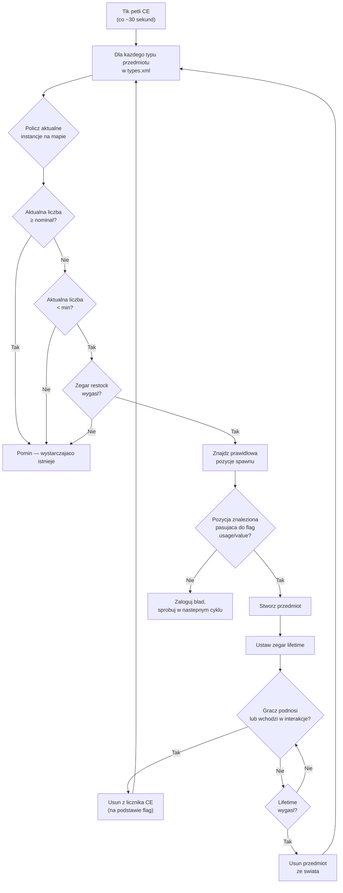

# Chapter 9.4: Szczegolowy przewodnik po ekonomii lootu

[Strona glowna](../README.md) | [<< Poprzedni: Dokumentacja serverDZ.cfg](03-server-cfg.md) | **Szczegolowy przewodnik po ekonomii lootu**

---

> **Podsumowanie:** Centralna Ekonomia (CE) to system kontrolujacy spawn kazdego przedmiotu w DayZ -- od puszki fasoli na polce po AKM w koszarach wojskowych. Ten rozdzial wyjasnia pelny cykl spawnu, dokumentuje kazde pole w `types.xml`, `globals.xml`, `events.xml` i `cfgspawnabletypes.xml` z prawdziwymi przykladami z vanillowych plikow serwera oraz omawia najczestsze bledy w ekonomii.

---

## Spis tresci

- [Jak dziala Centralna Ekonomia](#jak-dziala-centralna-ekonomia)
- [Cykl spawnu](#cykl-spawnu)
- [types.xml -- Definicje spawnu przedmiotow](#typesxml----definicje-spawnu-przedmiotow)
- [Prawdziwe przyklady types.xml](#prawdziwe-przyklady-typesxml)
- [Dokumentacja pol types.xml](#dokumentacja-pol-typesxml)
- [globals.xml -- Parametry ekonomii](#globalsxml----parametry-ekonomii)
- [events.xml -- Zdarzenia dynamiczne](#eventsxml----zdarzenia-dynamiczne)
- [cfgspawnabletypes.xml -- Zalaczniki i ladunek](#cfgspawnabletypesxml----zalaczniki-i-ladunek)
- [Relacja nominal/restock](#relacja-nominalrestock)
- [Typowe bledy ekonomii](#typowe-bledy-ekonomii)

---

## Jak dziala Centralna Ekonomia

Centralna Ekonomia (CE) to system po stronie serwera dzialajacy w ciaglej petli. Jej zadaniem jest utrzymywanie populacji przedmiotow na swiecie na poziomach zdefiniowanych w twoich plikach konfiguracyjnych.

CE **nie** umieszcza przedmiotow, gdy gracz wchodzi do budynku. Zamiast tego dziala na globalnym zegarze i tworzy przedmioty na calej mapie, niezaleznie od bliskosci gracza. Przedmioty maja **czas zycia** -- gdy ten zegar wygasa i zaden gracz nie wchodził w interakcje z przedmiotem, CE go usuwa. Nastepnie, w kolejnym cyklu, wykrywa, ze liczba jest ponizej celu i tworzy zamiennik w innym miejscu.

Kluczowe pojecia:

- **Nominal** -- docelowa liczba kopii przedmiotu, ktore powinny istniec na mapie
- **Min** -- prog, ponizej ktorego CE sprobuje odnowic przedmiot
- **Lifetime** -- jak dlugo (w sekundach) nietkniete przedmiot przetrwa zanim zostanie usuniety
- **Restock** -- minimalny czas (w sekundach) zanim CE moze odnowic przedmiot po jego zabraniu/zniszczeniu
- **Flags** -- co jest liczone do sumy (na mapie, w ladunku, w ekwipunku gracza, w skrytkach)

---

## Cykl spawnu



W skrocie: CE liczy ile kazdego przedmiotu istnieje, porownuje z celami nominal/min i tworzy zamienniki, gdy liczba spada ponizej `min`, a zegar `restock` uplynął.

---

## types.xml -- Definicje spawnu przedmiotow

To najwazniejszy plik ekonomii. Kazdy przedmiot, ktory moze sie pojawic na swiecie, potrzebuje tutaj wpisu. Vanillowy `types.xml` dla Chernarusa zawiera okolo 23 000 linii obejmujacych tysiace przedmiotow.

### Prawdziwe przyklady types.xml

**Bron -- AKM**

```xml
<type name="AKM">
    <nominal>3</nominal>
    <lifetime>7200</lifetime>
    <restock>3600</restock>
    <min>2</min>
    <quantmin>30</quantmin>
    <quantmax>80</quantmax>
    <cost>100</cost>
    <flags count_in_cargo="0" count_in_hoarder="0" count_in_map="1" count_in_player="0" crafted="0" deloot="0"/>
    <category name="weapons"/>
    <usage name="Military"/>
    <value name="Tier4"/>
</type>
```

AKM to rzadka bron wysokiego poziomu. Tylko 3 moga istniec na mapie jednoczesnie (`nominal`). Pojawia sie w budynkach Military w obszarach Tier 4 (polnocny zachod). Gdy gracz podniesie jeden, CE widzi spadek liczby na mapie ponizej `min=2` i stworzy zamiennik po co najmniej 3600 sekundach (1 godzina). Bron pojawia sie z 30-80% amunicji w wewnetrznym magazynku (`quantmin`/`quantmax`).

**Zywnosc -- BakedBeansCan**

```xml
<type name="BakedBeansCan">
    <nominal>15</nominal>
    <lifetime>14400</lifetime>
    <restock>0</restock>
    <min>12</min>
    <quantmin>-1</quantmin>
    <quantmax>-1</quantmax>
    <cost>100</cost>
    <flags count_in_cargo="0" count_in_hoarder="0" count_in_map="1" count_in_player="0" crafted="0" deloot="0"/>
    <category name="food"/>
    <tag name="shelves"/>
    <usage name="Town"/>
    <usage name="Village"/>
    <value name="Tier1"/>
    <value name="Tier2"/>
    <value name="Tier3"/>
</type>
```

Fasolka jest popularnym jedzeniem. 15 puszek powinno istniec w kazdym momencie. Pojawiaja sie na polkach w budynkach Town i Village w Tierach 1-3 (wybrzeze do srodkowej czesci mapy). `restock=0` oznacza natychmiastowa mozliwosc odnowienia. `quantmin=-1` i `quantmax=-1` oznaczaja, ze przedmiot nie korzysta z systemu ilosci (nie jest pojemnikiem na plyn ani amunicje).

**Ubrania -- RidersJacket_Black**

```xml
<type name="RidersJacket_Black">
    <nominal>14</nominal>
    <lifetime>28800</lifetime>
    <restock>0</restock>
    <min>10</min>
    <quantmin>-1</quantmin>
    <quantmax>-1</quantmax>
    <cost>100</cost>
    <flags count_in_cargo="0" count_in_hoarder="0" count_in_map="1" count_in_player="0" crafted="0" deloot="0"/>
    <category name="clothes"/>
    <usage name="Town"/>
    <value name="Tier1"/>
    <value name="Tier2"/>
</type>
```

Popularna kurtka cywilna. 14 kopii na mapie, znajdowana w budynkach Town blisko wybrzeza (Tier 1-2). Lifetime wynoszacy 28800 sekund (8 godzin) oznacza, ze przetrwa dlugo, jesli nikt jej nie podniesie.

**Medyczne -- BandageDressing**

```xml
<type name="BandageDressing">
    <nominal>40</nominal>
    <lifetime>14400</lifetime>
    <restock>0</restock>
    <min>30</min>
    <quantmin>-1</quantmin>
    <quantmax>-1</quantmax>
    <cost>100</cost>
    <flags count_in_cargo="0" count_in_hoarder="0" count_in_map="1" count_in_player="0" crafted="0" deloot="0"/>
    <category name="tools"/>
    <tag name="shelves"/>
    <usage name="Medic"/>
</type>
```

Bandaze sa bardzo popularne (40 nominal). Pojawiaja sie w budynkach Medic (szpitale, kliniki) we wszystkich tierach (brak tagu `<value>` oznacza wszystkie tiery). Zwroc uwage, ze kategoria to `"tools"`, a nie `"medical"` -- DayZ nie ma kategorii medical; przedmioty medyczne uzywaja kategorii tools.

**Wylaczony przedmiot (wariant craftowany)**

```xml
<type name="AK101_Black">
    <nominal>0</nominal>
    <lifetime>28800</lifetime>
    <restock>0</restock>
    <min>0</min>
    <quantmin>-1</quantmin>
    <quantmax>-1</quantmax>
    <cost>100</cost>
    <flags count_in_cargo="0" count_in_hoarder="0" count_in_map="1" count_in_player="0" crafted="1" deloot="0"/>
    <category name="weapons"/>
</type>
```

`nominal=0` i `min=0` oznacza, ze CE nigdy nie stworzy tego przedmiotu. `crafted=1` wskazuje, ze mozna go uzyskac tylko przez crafting (malowanie broni). Nadal ma lifetime, aby zapisane instancje byly w koncu czyszczone.

---

## Dokumentacja pol types.xml

### Pola podstawowe

| Pole | Typ | Zakres | Opis |
|------|-----|--------|------|
| `name` | string | -- | Nazwa klasy przedmiotu. Musi dokladnie odpowiadac nazwie klasy w grze. |
| `nominal` | int | 0+ | Docelowa liczba tego przedmiotu na mapie. Ustaw na 0, aby zapobiec spawnowi. |
| `min` | int | 0+ | Gdy liczba spadnie do tej wartosci lub ponizej, CE sprobuje stworzyc wiecej. |
| `lifetime` | int | sekundy | Jak dlugo nietkniety przedmiot istnieje zanim CE go usunie. |
| `restock` | int | sekundy | Minimalny czas odnowienia zanim CE moze stworzyc zamiennik. 0 = natychmiastowy. |
| `quantmin` | int | -1 do 100 | Minimalny procent ilosci przy spawnie (% amunicji, % plynu). -1 = nie dotyczy. |
| `quantmax` | int | -1 do 100 | Maksymalny procent ilosci przy spawnie. -1 = nie dotyczy. |
| `cost` | int | 0+ | Waga priorytetu do wyboru spawnu. Obecnie wszystkie vanillowe przedmioty uzywaja 100. |

### Flagi

```xml
<flags count_in_cargo="0" count_in_hoarder="0" count_in_map="1" count_in_player="0" crafted="0" deloot="0"/>
```

| Flaga | Wartosci | Opis |
|-------|----------|------|
| `count_in_map` | 0, 1 | Licz przedmioty lezace na ziemi lub w punktach spawnu budynkow. **Prawie zawsze 1.** |
| `count_in_cargo` | 0, 1 | Licz przedmioty wewnatrz innych pojemnikow (plecaki, namioty). |
| `count_in_hoarder` | 0, 1 | Licz przedmioty w skrytkach, beczkach, zakopanych pojemnikach, namiotach. |
| `count_in_player` | 0, 1 | Licz przedmioty w ekwipunku gracza (na ciele lub w rekach). |
| `crafted` | 0, 1 | Gdy 1, ten przedmiot mozna uzyskac tylko przez crafting, nie przez spawn CE. |
| `deloot` | 0, 1 | Loot ze zdarzenia dynamicznego. Gdy 1, przedmiot pojawia sie tylko w lokalizacjach zdarzen dynamicznych (rozbite helikoptery itp.). |

**Strategia flag ma znaczenie.** Jesli `count_in_player=1`, kazdy AKM noszony przez gracza jest liczony do nominal. Oznacza to, ze podniesienie AKM nie wywolalyby odnowienia, poniewaz liczba sie nie zmienila. Wiekszosc vanillowych przedmiotow uzywa `count_in_player=0`, aby przedmioty trzymane przez graczy nie blokowaly odnowien.

### Tagi

| Element | Przeznaczenie | Zdefiniowane w |
|---------|---------------|----------------|
| `<category name="..."/>` | Kategoria przedmiotu do dopasowania punktu spawnu | `cfglimitsdefinition.xml` |
| `<usage name="..."/>` | Typ budynku, w ktorym ten przedmiot moze sie pojawic | `cfglimitsdefinition.xml` |
| `<value name="..."/>` | Strefa tieru mapy, w ktorej ten przedmiot moze sie pojawic | `cfglimitsdefinition.xml` |
| `<tag name="..."/>` | Typ pozycji spawnu wewnatrz budynku | `cfglimitsdefinition.xml` |

**Prawidlowe kategorie:** `tools`, `containers`, `clothes`, `food`, `weapons`, `books`, `explosives`, `lootdispatch`

**Prawidlowe flagi uzycia:** `Military`, `Police`, `Medic`, `Firefighter`, `Industrial`, `Farm`, `Coast`, `Town`, `Village`, `Hunting`, `Office`, `School`, `Prison`, `Lunapark`, `SeasonalEvent`, `ContaminatedArea`, `Historical`

**Prawidlowe flagi wartosci:** `Tier1`, `Tier2`, `Tier3`, `Tier4`, `Unique`

**Prawidlowe tagi:** `floor`, `shelves`, `ground`

Przedmiot moze miec **wiele** tagow `<usage>` i `<value>`. Wiele usages oznacza, ze moze sie pojawic w kazdym z tych typow budynkow. Wiele wartosci oznacza, ze moze sie pojawic w kazdym z tych tierow.

Jesli calkowicie pominiesz `<value>`, przedmiot pojawia sie we **wszystkich** tierach. Jesli pominiesz `<usage>`, przedmiot nie ma prawidlowej lokalizacji spawnu i **nie pojawi sie**.

---

## globals.xml -- Parametry ekonomii

Ten plik kontroluje globalne zachowanie CE. Kazdy parametr z vanillowego pliku:

```xml
<variables>
    <var name="AnimalMaxCount" type="0" value="200"/>
    <var name="CleanupAvoidance" type="0" value="100"/>
    <var name="CleanupLifetimeDeadAnimal" type="0" value="1200"/>
    <var name="CleanupLifetimeDeadInfected" type="0" value="330"/>
    <var name="CleanupLifetimeDeadPlayer" type="0" value="3600"/>
    <var name="CleanupLifetimeDefault" type="0" value="45"/>
    <var name="CleanupLifetimeLimit" type="0" value="50"/>
    <var name="CleanupLifetimeRuined" type="0" value="330"/>
    <var name="FlagRefreshFrequency" type="0" value="432000"/>
    <var name="FlagRefreshMaxDuration" type="0" value="3456000"/>
    <var name="FoodDecay" type="0" value="1"/>
    <var name="IdleModeCountdown" type="0" value="60"/>
    <var name="IdleModeStartup" type="0" value="1"/>
    <var name="InitialSpawn" type="0" value="100"/>
    <var name="LootDamageMax" type="1" value="0.82"/>
    <var name="LootDamageMin" type="1" value="0.0"/>
    <var name="LootProxyPlacement" type="0" value="1"/>
    <var name="LootSpawnAvoidance" type="0" value="100"/>
    <var name="RespawnAttempt" type="0" value="2"/>
    <var name="RespawnLimit" type="0" value="20"/>
    <var name="RespawnTypes" type="0" value="12"/>
    <var name="RestartSpawn" type="0" value="0"/>
    <var name="SpawnInitial" type="0" value="1200"/>
    <var name="TimeHopping" type="0" value="60"/>
    <var name="TimeLogin" type="0" value="15"/>
    <var name="TimeLogout" type="0" value="15"/>
    <var name="TimePenalty" type="0" value="20"/>
    <var name="WorldWetTempUpdate" type="0" value="1"/>
    <var name="ZombieMaxCount" type="0" value="1000"/>
    <var name="ZoneSpawnDist" type="0" value="300"/>
</variables>
```

Atrybut `type` wskazuje typ danych: `0` = liczba calkowita, `1` = zmiennoprzecinkowa.

### Kompletna dokumentacja parametrow

| Parametr | Typ | Domyslnie | Opis |
|----------|-----|-----------|------|
| **AnimalMaxCount** | int | 200 | Maksymalna liczba zwierzat zywych jednoczesnie na mapie. |
| **CleanupAvoidance** | int | 100 | Odleglosc w metrach od gracza, w ktorej CE NIE bedzie czyscic przedmiotow. Przedmioty w tym promieniu sa chronione przed wygasnieciem lifetime. |
| **CleanupLifetimeDeadAnimal** | int | 1200 | Sekundy przed usunieciem zwlok martwego zwierzecia. (20 minut) |
| **CleanupLifetimeDeadInfected** | int | 330 | Sekundy przed usunieciem zwlok martwego zombie. (5.5 minuty) |
| **CleanupLifetimeDeadPlayer** | int | 3600 | Sekundy przed usunieciem ciala martwego gracza. (1 godzina) |
| **CleanupLifetimeDefault** | int | 45 | Domyslny czas czyszczenia w sekundach dla przedmiotow bez okreslonego lifetime. |
| **CleanupLifetimeLimit** | int | 50 | Maksymalna liczba przedmiotow przetwarzanych w jednym cyklu czyszczenia. |
| **CleanupLifetimeRuined** | int | 330 | Sekundy przed wyczyszczeniem zniszczonych przedmiotow. (5.5 minuty) |
| **FlagRefreshFrequency** | int | 432000 | Jak czesto maszt flagowy musi byc "odswiezony" interakcja, aby zapobiec rozpadowi bazy, w sekundach. (5 dni) |
| **FlagRefreshMaxDuration** | int | 3456000 | Maksymalny czas zycia masztu flagowego nawet przy regularnym odswiezaniu, w sekundach. (40 dni) |
| **FoodDecay** | int | 1 | Wlaczenie (1) lub wylaczenie (0) psucia sie jedzenia z czasem. |
| **IdleModeCountdown** | int | 60 | Sekundy przed wejsciem serwera w tryb bezczynnosci, gdy zaden gracz nie jest polaczony. |
| **IdleModeStartup** | int | 1 | Czy serwer startuje w trybie bezczynnosci (1) czy aktywnym (0). |
| **InitialSpawn** | int | 100 | Procent wartosci nominal do stworzenia przy pierwszym starcie serwera (0-100). |
| **LootDamageMax** | float | 0.82 | Maksymalny stan uszkodzenia losowo tworzonego lootu (0.0 = nieskazitelny, 1.0 = zniszczony). |
| **LootDamageMin** | float | 0.0 | Minimalny stan uszkodzenia losowo tworzonego lootu. |
| **LootProxyPlacement** | int | 1 | Wlaczenie (1) wizualnego umieszczania przedmiotow na polkach/stolach zamiast losowego upuszczania na podloge. |
| **LootSpawnAvoidance** | int | 100 | Odleglosc w metrach od gracza, w ktorej CE NIE bedzie tworzyl nowego lootu. Zapobiega materializowaniu sie przedmiotow przed graczami. |
| **RespawnAttempt** | int | 2 | Liczba prob znalezienia pozycji spawnu na przedmiot na cykl CE przed rezygnacja. |
| **RespawnLimit** | int | 20 | Maksymalna liczba przedmiotow, ktore CE odnowi w jednym cyklu. |
| **RespawnTypes** | int | 12 | Maksymalna liczba roznych typow przedmiotow przetwarzanych w cyklu odnowienia. |
| **RestartSpawn** | int | 0 | Gdy 1, losuj ponownie wszystkie pozycje lootu przy restarcie serwera. Gdy 0, laduj z trwalosci. |
| **SpawnInitial** | int | 1200 | Liczba przedmiotow do stworzenia podczas poczatkowego napelniania ekonomii przy pierwszym starcie. |
| **TimeHopping** | int | 60 | Czas odnowienia w sekundach zapobiegajacy ponownemu polaczeniu gracza z tym samym serwerem (anti-server-hop). |
| **TimeLogin** | int | 15 | Zegar odliczania logowania w sekundach (zegar "Prosze czekac" przy laczeniu). |
| **TimeLogout** | int | 15 | Zegar odliczania wylogowania w sekundach. Gracz pozostaje na swiecie przez ten czas. |
| **TimePenalty** | int | 20 | Dodatkowy czas kary w sekundach doliczany do zegara wylogowania przy nieprawidlowym rozlaczeniu (Alt+F4). |
| **WorldWetTempUpdate** | int | 1 | Wlaczenie (1) lub wylaczenie (0) aktualizacji symulacji temperatury i wilgotnosci swiata. |
| **ZombieMaxCount** | int | 1000 | Maksymalna liczba zombie zywych jednoczesnie na mapie. |
| **ZoneSpawnDist** | int | 300 | Odleglosc w metrach od gracza, przy ktorej strefy spawnu zombie staja sie aktywne. |

### Typowe korekty dostrajania

**Wiecej lootu (serwer PvP):**
```xml
<var name="InitialSpawn" type="0" value="100"/>
<var name="RespawnLimit" type="0" value="50"/>
<var name="RespawnTypes" type="0" value="30"/>
<var name="RespawnAttempt" type="0" value="4"/>
```

**Dluzej utrzymujace sie ciala (wiecej czasu na lootowanie zabitych):**
```xml
<var name="CleanupLifetimeDeadPlayer" type="0" value="7200"/>
```

**Krotszy rozpad bazy (szybsze usuwanie opuszczonych baz):**
```xml
<var name="FlagRefreshFrequency" type="0" value="259200"/>
<var name="FlagRefreshMaxDuration" type="0" value="1728000"/>
```

---

## events.xml -- Zdarzenia dynamiczne

Zdarzenia definiuja spawny dla obiektow wymagajacych specjalnej obslugi: zwierzat, pojazdow i rozbicia helikopterow. W przeciwienstwie do przedmiotow z `types.xml`, ktore pojawiaja sie wewnatrz budynkow, zdarzenia tworza obiekty w predefiniowanych pozycjach swiata wymienionych w `cfgeventspawns.xml`.

### Prawdziwy przyklad zdarzenia pojazdu

```xml
<event name="VehicleCivilianSedan">
    <nominal>8</nominal>
    <min>5</min>
    <max>11</max>
    <lifetime>300</lifetime>
    <restock>0</restock>
    <saferadius>500</saferadius>
    <distanceradius>500</distanceradius>
    <cleanupradius>200</cleanupradius>
    <flags deletable="0" init_random="0" remove_damaged="1"/>
    <position>fixed</position>
    <limit>mixed</limit>
    <active>1</active>
    <children>
        <child lootmax="0" lootmin="0" max="5" min="3" type="CivilianSedan"/>
        <child lootmax="0" lootmin="0" max="5" min="3" type="CivilianSedan_Black"/>
        <child lootmax="0" lootmin="0" max="5" min="3" type="CivilianSedan_Wine"/>
    </children>
</event>
```

### Prawdziwy przyklad zdarzenia zwierzecia

```xml
<event name="AnimalBear">
    <nominal>0</nominal>
    <min>2</min>
    <max>2</max>
    <lifetime>180</lifetime>
    <restock>0</restock>
    <saferadius>200</saferadius>
    <distanceradius>0</distanceradius>
    <cleanupradius>0</cleanupradius>
    <flags deletable="0" init_random="0" remove_damaged="1"/>
    <position>fixed</position>
    <limit>custom</limit>
    <active>1</active>
    <children>
        <child lootmax="0" lootmin="0" max="1" min="1" type="Animal_UrsusArctos"/>
    </children>
</event>
```

### Dokumentacja pol zdarzen

| Pole | Opis |
|------|------|
| `name` | Identyfikator zdarzenia. Musi odpowiadac wpisowi w `cfgeventspawns.xml` dla zdarzen z `position="fixed"`. |
| `nominal` | Docelowa liczba aktywnych grup zdarzen na mapie. |
| `min` | Minimalna liczba czlonkow grupy na punkt spawnu. |
| `max` | Maksymalna liczba czlonkow grupy na punkt spawnu. |
| `lifetime` | Sekundy przed wyczyszczeniem i ponownym stworzeniem zdarzenia. Dla pojazdow to interwal sprawdzania odnowienia, nie czas trwalosci pojazdu. |
| `restock` | Minimalne sekundy miedzy odnowieniami. |
| `saferadius` | Minimalna odleglosc w metrach od gracza, aby zdarzenie moglo sie pojawic. |
| `distanceradius` | Minimalna odleglosc miedzy dwoma instancjami tego samego zdarzenia. |
| `cleanupradius` | Odleglosc od jakiegokolwiek gracza, ponizej ktorej zdarzenie NIE bedzie czyszczone. |
| `deletable` | Czy zdarzenie moze byc usuniete przez CE (0 = nie). |
| `init_random` | Losowanie poczatkowych pozycji (0 = uzyj stalych pozycji). |
| `remove_damaged` | Usuniecie obiektu zdarzenia jesli zostanie uszkodzony/zniszczony (1 = tak). |
| `position` | `"fixed"` = uzyj pozycji z `cfgeventspawns.xml`. `"player"` = stworz blisko graczy. |
| `limit` | `"child"` = limit na typ potomny. `"mixed"` = limit wspolny dla wszystkich potomnych. `"custom"` = specjalne zachowanie. |
| `active` | 1 = wlaczone, 0 = wylaczone. |

### Elementy potomne

Kazdy element `<child>` definiuje wariant, ktory moze sie pojawic:

| Atrybut | Opis |
|---------|------|
| `type` | Nazwa klasy obiektu do stworzenia. |
| `min` | Minimalna liczba instancji tego wariantu (dla `limit="child"`). |
| `max` | Maksymalna liczba instancji tego wariantu (dla `limit="child"`). |
| `lootmin` | Minimalna liczba przedmiotow lootu tworzonych wewnatrz/na obiekcie. |
| `lootmax` | Maksymalna liczba przedmiotow lootu tworzonych wewnatrz/na obiekcie. |

---

## cfgspawnabletypes.xml -- Zalaczniki i ladunek

Ten plik definiuje jakie zalaczniki, ladunek i stan uszkodzenia ma przedmiot przy spawnie. Bez wpisu tutaj przedmioty pojawiaja sie puste i z losowym uszkodzeniem (w zakresie `LootDamageMin`/`LootDamageMax` z `globals.xml`).

### Bron z zalacznikami -- AKM

```xml
<type name="AKM">
    <damage min="0.45" max="0.85" />
    <attachments chance="1.00">
        <item name="AK_PlasticBttstck" chance="1.00" />
    </attachments>
    <attachments chance="1.00">
        <item name="AK_PlasticHndgrd" chance="1.00" />
    </attachments>
    <attachments chance="0.50">
        <item name="KashtanOptic" chance="0.30" />
        <item name="PSO11Optic" chance="0.20" />
    </attachments>
    <attachments chance="0.05">
        <item name="AK_Suppressor" chance="1.00" />
    </attachments>
    <attachments chance="0.30">
        <item name="Mag_AKM_30Rnd" chance="1.00" />
    </attachments>
</type>
```

Odczytanie tego wpisu:

1. AKM pojawia sie z uszkodzeniem 45-85% (zuzyty do mocno uszkodzonego)
2. **Zawsze** (100%) dostaje plastikowa kolbe i oslone
3. 50% szans na wypelnienie slotu celownika -- jesli tak, 30% szans na Kashtan, 20% na PSO-11
4. 5% szans na tlumik
5. 30% szans na zaladowany magazynek

Kazdy blok `<attachments>` reprezentuje jeden slot zalacznika. `chance` na bloku to prawdopodobienstwo wypelnienia tego slotu w ogole. `chance` na kazdym `<item>` wewnatrz to relatywna waga wyboru -- CE wybiera jeden przedmiot z listy uzywajac tych wag.

### Bron z zalacznikami -- M4A1

```xml
<type name="M4A1">
    <damage min="0.45" max="0.85" />
    <attachments chance="1.00">
        <item name="M4_OEBttstck" chance="1.00" />
    </attachments>
    <attachments chance="1.00">
        <item name="M4_PlasticHndgrd" chance="1.00" />
    </attachments>
    <attachments chance="1.00">
        <item name="BUISOptic" chance="0.50" />
        <item name="M4_CarryHandleOptic" chance="1.00" />
    </attachments>
    <attachments chance="0.30">
        <item name="Mag_CMAG_40Rnd" chance="0.15" />
        <item name="Mag_CMAG_10Rnd" chance="0.50" />
        <item name="Mag_CMAG_20Rnd" chance="0.70" />
        <item name="Mag_CMAG_30Rnd" chance="1.00" />
    </attachments>
</type>
```

### Kamizelka z kieszeniami -- PlateCarrierVest_Camo

```xml
<type name="PlateCarrierVest_Camo">
    <damage min="0.1" max="0.6" />
    <attachments chance="0.85">
        <item name="PlateCarrierHolster_Camo" chance="1.00" />
    </attachments>
    <attachments chance="0.85">
        <item name="PlateCarrierPouches_Camo" chance="1.00" />
    </attachments>
</type>
```

### Plecak z ladunkiem

```xml
<type name="AssaultBag_Ttsko">
    <cargo preset="mixArmy" />
    <cargo preset="mixArmy" />
    <cargo preset="mixArmy" />
</type>
```

Atrybut `preset` odwoluje sie do puli lootu zdefiniowanej w `cfgrandompresets.xml`. Kazda linia `<cargo>` to jedno losowanie -- ten plecak otrzymuje 3 losowania z puli `mixArmy`. Wlasna wartosc `chance` puli okresla, czy kazde losowanie faktycznie wyprodukuje przedmiot.

### Przedmioty tylko dla hoarderow

```xml
<type name="Barrel_Blue">
    <hoarder />
</type>
<type name="SeaChest">
    <hoarder />
</type>
```

Tag `<hoarder />` oznacza przedmioty jako pojemniki do gromadzenia. CE liczy przedmioty wewnatrz nich oddzielnie, uzywajac flagi `count_in_hoarder` z `types.xml`.

### Nadpisanie uszkodzen przy spawnie

```xml
<type name="BandageDressing">
    <damage min="0.0" max="0.0" />
</type>
```

Wymusza, aby bandaze zawsze pojawialy sie w stanie Nieskazitelnym, nadpisujac globalne `LootDamageMin`/`LootDamageMax` z `globals.xml`.

---

## Relacja nominal/restock

Zrozumienie wspoldzialania `nominal`, `min` i `restock` jest kluczowe do dostrajania ekonomii.

### Matematyka

```
JESLI (aktualna_liczba < min) ORAZ (czas_od_ostatniego_spawnu > restock):
    stworz nowy przedmiot (do wartosci nominal)
```

**Przyklad z AKM:**
- `nominal = 3`, `min = 2`, `restock = 3600`
- Serwer startuje: CE tworzy 3 AKM na mapie
- Gracz podnosi 1 AKM: liczba na mapie spada do 2
- Liczba (2) NIE jest mniejsza niz min (2), wiec brak odnowienia
- Gracz podnosi kolejny AKM: liczba na mapie spada do 1
- Liczba (1) JEST mniejsza niz min (2), i zegar restock (3600s = 1 godzina) startuje
- Po 1 godzinie CE tworzy 2 nowe AKM, aby osiagnac nominal (3)

**Przyklad z BakedBeansCan:**
- `nominal = 15`, `min = 12`, `restock = 0`
- Gracz zjada puszke: liczba na mapie spada do 14
- Liczba (14) NIE jest mniejsza niz min (12), wiec brak odnowienia
- 3 kolejne puszki zjedzone: liczba spada do 11
- Liczba (11) JEST mniejsza niz min (12), restock jest 0 (natychmiastowy)
- Nastepny cykl CE: tworzy 4 puszki, aby osiagnac nominal (15)

### Kluczowe wnioski

- **Luka miedzy nominal a min** okresla ile przedmiotow moze byc "zuzyto" zanim CE zareaguje. Mala luka (jak AKM: 3/2) oznacza, ze CE reaguje juz po 2 podniesieniach. Duza luka oznacza, ze wiecej przedmiotow moze opuscic ekonomie przed uruchomieniem odnowienia.

- **restock = 0** sprawia, ze odnowienie jest efektywnie natychmiastowe (nastepny cykl CE). Wysokie wartosci restock tworza deficyt -- CE wie, ze musi stworzyc wiecej, ale musi czekac.

- **Lifetime** jest niezalezny od nominal/min. Nawet jesli CE stworzy przedmiot, aby osiagnac nominal, przedmiot zostanie usuniety po wygasnieciu jego lifetime, jesli nikt go nie dotknie. To tworzy ciagly "obieg" przedmiotow pojawiajacych sie i znikajacych na mapie.

- Przedmioty, ktore gracze podnosza, a potem upuszczaja (w innej lokalizacji), nadal sie licza, jesli odpowiednia flaga jest ustawiona. Upuszczony AKM na ziemi nadal liczy sie do sumy mapy, poniewaz `count_in_map=1`.

---

## Typowe bledy ekonomii

### Przedmiot ma wpis w types.xml, ale sie nie pojawia

**Sprawdz kolejno:**

1. Czy `nominal` jest wiekszy niz 0?
2. Czy przedmiot ma co najmniej jeden tag `<usage>`? (Brak usage = brak prawidlowej lokalizacji spawnu)
3. Czy tag `<usage>` jest zdefiniowany w `cfglimitsdefinition.xml`?
4. Czy tag `<value>` (jesli jest) jest zdefiniowany w `cfglimitsdefinition.xml`?
5. Czy tag `<category>` jest prawidlowy?
6. Czy przedmiot jest wymieniony w `cfgignorelist.xml`? (Przedmioty tam sa blokowane)
7. Czy flaga `crafted` jest ustawiona na 1? (Craftowane przedmioty nigdy nie pojawiaja sie naturalnie)
8. Czy `RestartSpawn` w `globals.xml` jest ustawiony na 0 z istniejaca trwaloscia? (Stara trwalosc moze blokowac spawn nowych przedmiotow do czasu wipe'a)

### Przedmioty pojawiaja sie, ale natychmiast znikaja

Wartosc `lifetime` jest zbyt niska. Lifetime wynoszacy 45 sekund (domyslny `CleanupLifetimeDefault`) oznacza, ze przedmiot jest czyszczony prawie natychmiast. Bronie powinny miec lifetime 7200-28800 sekund.

### Za duzo/za malo danego przedmiotu

Dostosuj `nominal` i `min` razem. Jesli ustawisz `nominal=100` ale `min=1`, CE nie odnowi przedmiotow, dopoki 99 nie zostanie zabranych. Jesli chcesz stalego zaopatrzenia, trzymaj `min` blisko `nominal` (np. `nominal=20, min=15`).

### Przedmioty pojawiaja sie tylko w jednym obszarze

Sprawdz tagi `<value>`. Jesli przedmiot ma tylko `<value name="Tier4"/>`, pojawi sie tylko w polnocno-zachodnim obszarze wojskowym Chernarusa. Dodaj wiecej tierow, aby rozprzestrzenic go po mapie:

```xml
<value name="Tier1"/>
<value name="Tier2"/>
<value name="Tier3"/>
<value name="Tier4"/>
```

### Modowane przedmioty nie pojawiaja sie

Przy dodawaniu przedmiotow z moda do `types.xml`:

1. Upewnij sie, ze mod jest zaladowany (wymieniony w parametrze `-mod=`)
2. Sprawdz, czy nazwa klasy jest **dokladnie** poprawna (rozrozniane wielkie/male litery)
3. Dodaj tagi category/usage/value przedmiotu -- sam wpis w `types.xml` nie wystarczy
4. Jesli mod dodaje nowe tagi usage lub value, dodaj je do `cfglimitsdefinitionuser.xml`
5. Sprawdz log skryptow pod katem ostrzezen o nieznanych nazwach klas

### Czesci pojazdow nie pojawiaja sie wewnatrz pojazdow

Czesci pojazdow tworzone sa przez `cfgspawnabletypes.xml`, nie `types.xml`. Jesli pojazd pojawia sie bez kol lub akumulatora, sprawdz, czy pojazd ma wpis w `cfgspawnabletypes.xml` z odpowiednimi definicjami zalacznikow.

### Caly loot jest nieskazitelny lub caly jest zniszczony

Sprawdz `LootDamageMin` i `LootDamageMax` w `globals.xml`. Vanillowe wartosci to `0.0` i `0.82`. Ustawienie obu na `0.0` sprawia, ze wszystko jest nieskazitelne. Ustawienie obu na `1.0` sprawia, ze wszystko jest zniszczone. Sprawdz tez nadpisania per-przedmiot w `cfgspawnabletypes.xml`.

### Ekonomia czuje sie "zablokowana" po edycji types.xml

Po edycji plikow ekonomii zrob jedno z ponizszych:
- Usun `storage_1/` dla pelnego wipe'a i swiezego startu ekonomii
- Ustaw `RestartSpawn` na `1` w `globals.xml` na jeden restart, aby losowo rozmiesic loot, a nastepnie wroc do `0`
- Poczekaj, az lifetime przedmiotow wygasnie naturalnie (moze to trwac godziny)

---

**Poprzedni:** [Dokumentacja serverDZ.cfg](03-server-cfg.md) | [Strona glowna](../README.md) | **Dalej:** [Spawn pojazdow i zdarzen dynamicznych](05-vehicle-spawning.md)
