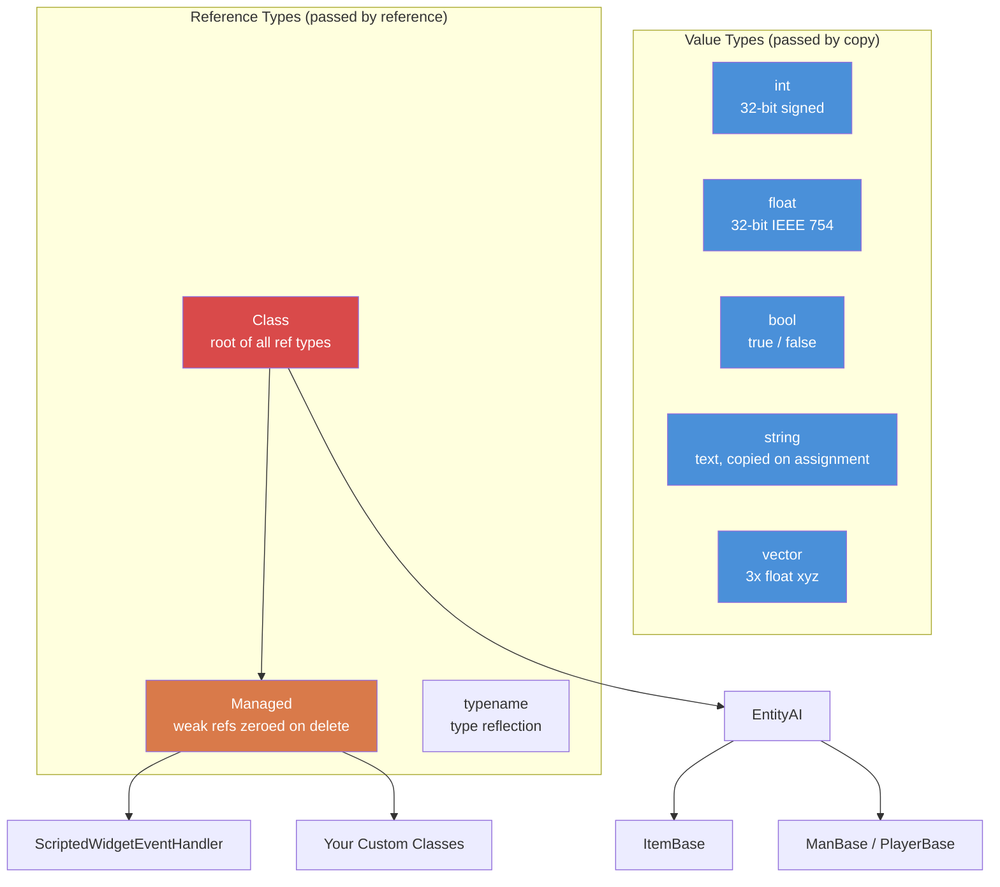

# Variáveis e tipos {#variables-types}

> **Resumo:** Os tipos primitivos do Enforce Script (`int`, `float`, `bool`, `string`, `vector`, `typename`), como declarar variáveis e constantes, como funciona a conversão de tipos e as regras de escopo que diferem das linguagens da família C. A palavra-chave `auto` existe para inferência local de tipos, mas os scripts vanilla quase nunca a usam --- escreva o tipo explícito, a menos que você tenha um motivo específico para não fazer isso.

---

## Sumário {#table-of-contents}

- [Tipos primitivos](#primitive-types)
- [Declaração de variáveis](#declaring-variables)
- [Trabalhando com `int`](#working-with-int)
- [Trabalhando com `float`](#working-with-float)
- [Trabalhando com `bool`](#working-with-bool)
- [Visão geral das strings](#strings-at-a-glance)
- [Visão geral dos vetores](#vectors-at-a-glance)
- [Trabalhando com `typename`](#working-with-typename)
- [A classe base `Managed`](#the-managed-base-class)
- [Conversão de tipos](#type-conversion)
- [Escopo de variáveis](#variable-scope)
- [Precedência de operadores](#operator-precedence)
- [Erros comuns](#common-mistakes)
- [Exercícios práticos](#practice-exercises)
- [Resumo](#summary)

---

## Tipos primitivos {#primitive-types}

O Enforce Script tem um conjunto pequeno e fixo de tipos primitivos. Você não pode definir novos tipos de valor --- apenas classes (abordadas em [Classes e herança](03-classes-inheritance.md)).

| Tipo | Tamanho | Valor padrão | Descrição |
|------|------|---------------|-------------|
| `int` | 32 bits com sinal | `0` | Números inteiros de -2.147.483.648 a 2.147.483.647 |
| `float` | 32 bits IEEE 754 | `0.0` | Números de ponto flutuante |
| `bool` | 1 bit lógico | `false` | `true` ou `false` |
| `string` | Variável | `""` (vazia) | Texto. Tipo de valor --- copiado na atribuição, não compartilhado por referência |
| `vector` | 3x float | `"0 0 0"` | Três componentes float (x, y, z). Passado por valor |
| `typename` | Referência do motor | `null` | Uma referência ao próprio tipo, usada para reflexão |
| `void` | Não se aplica | Não se aplica | Usado apenas como tipo de retorno para indicar que não retorna nada |

### Diagrama da hierarquia de tipos {#type-hierarchy-diagram}



### Constantes dos tipos {#type-constants}

Vários tipos expõem constantes úteis (definidas no arquivo `enconvert.c` do motor):

```c
// int bounds
int maxInt = int.MAX;    // 2147483647
int minInt = int.MIN;    // -2147483648

// float bounds
float smallest = float.MIN;     // smallest positive float (~1.175e-38)
float largest  = float.MAX;     // largest float (~3.403e+38)
float lowest   = float.LOWEST;  // most negative float (-3.403e+38)
```

---

## Declaração de variáveis {#declaring-variables}

Você declara variáveis escrevendo o tipo seguido do nome. Você pode declarar e atribuir em uma única instrução ou separadamente.

```c
void MyFunction()
{
    // Declaration only (initialized to default value)
    int health;          // health == 0
    float speed;         // speed == 0.0
    bool isAlive;        // isAlive == false
    string name;         // name == ""

    // Declaration with initialization
    int maxPlayers = 60;
    float gravity = 9.81;
    bool debugMode = true;
    string serverName = "My DayZ Server";
}
```

### A palavra-chave `auto` existe, mas tipos explícitos são o padrão idiomático do vanilla {#the-auto-keyword-exists-but-explicit-types-are-the-vanilla-idiom}

Textos antigos da comunidade afirmam que o Enforce Script do DayZ não tem a palavra-chave `auto` e que ela causa o erro `Unknown type 'auto'`. Essa afirmação está desatualizada: os scripts vanilla usam `auto` para inferência local de tipos em 32 declarações que compilam, inclusive com tipos de template genéricos --- por exemplo, `auto p = new Param10<string,int, float, float, int, int, float, float, bool, bool>(...)` (`4_world/plugins/pluginbase/plugindeveloper.c`), `auto param = new Param2<bool, EntityAI>(enabled, g_Game.GetPlayer())` (`4_world/plugins/pluginbase/plugindiagmenu/plugindiagmenuclient.c`) e `auto vehicle = CarScript.Cast(vehCommand.GetTransport())` (`4_world/classes/useractionscomponent/actions/continuous/vehicles/actionstartengine.c`) --- e todas elas compilam como parte do jogo distribuído.

A Bohemia documenta a palavra-chave em *Detecção automática de tipo*: "o tipo da variável será detectado automaticamente em tempo de compilação quando a palavra-chave `auto` for usada no lugar do tipo", com tipos primitivos entre os exemplos apresentados --- `auto variable1 = 1;` resulta em um `int`, `auto variablePi = 3.14;` resulta em um `float`, `auto variableInst = new MyCustomClass();` resulta no tipo da classe.

```c
void Example()
{
    auto count = 10;                        // Inferred as int (per Bohemia's own example)
    int count2 = 10;                        // Equivalent, explicit form

    auto p = new Param2<string, int>("kills", 5);   // Inferred as Param2<string, int>
}
```

Como o tipo é detectado *a partir do inicializador*, uma declaração isolada `auto x;` não tem de onde inferir o tipo. Observe também que `auto` é uma palavra-chave, portanto não pode servir também como identificador --- nenhuma declaração vanilla usa `auto` como nome de variável ou membro.

Vale lembrar duas ressalvas. Primeiro, cada um dos 32 usos vanilla que compilam infere um tipo de **referência** --- a partir de `new X(...)` ou de `.Cast()`; a forma com tipo primitivo acima é documentada pela Bohemia, mas não tem precedente no vanilla. Segundo, o vanilla recorre a `auto` em apenas duas situações: ao encapsular valores em tipos `ParamN<...>` antes de uma chamada de RPC ou de evento e em resultados de `.Cast()` de curta duração.

Fora desses casos, milhares de declarações vanilla escrevem o tipo explicitamente. Trate o estilo de tipos explícitos deste capítulo como o padrão idiomático --- não porque `auto` não funciona, mas porque um tipo visível facilita a leitura no ponto da declaração, especialmente para coleções.

### Constantes {#constants}

Use a palavra-chave `const` para valores que nunca devem mudar após a inicialização:

```c
const int MAX_SQUAD_SIZE = 8;
const float SPAWN_RADIUS = 150.0;
const string MOD_PREFIX = "[MyMod]";

void Example()
{
    int a = MAX_SQUAD_SIZE;  // OK: reading a constant
    MAX_SQUAD_SIZE = 10;     // ERROR: cannot assign to a constant
}
```

As constantes normalmente são declaradas no escopo do arquivo (fora de qualquer função) ou como membros de classe. Convenção de nomenclatura: `UPPER_SNAKE_CASE`.

---

## Trabalhando com `int` {#working-with-int}

Os inteiros são um tipo de uso frequente. O DayZ os usa para contagens de itens, IDs de jogadores, valores de vida (quando discretizados), valores de enumerações, flags de bits e muito mais.

```c
void IntExamples()
{
    int count = 5;
    int total = count + 10;     // 15
    int doubled = count * 2;    // 10
    int remainder = 17 % 5;     // 2 (modulo)

    // Increment and decrement
    count++;    // count is now 6
    count--;    // count is now 5 again

    // Compound assignment
    count += 3;  // count is now 8
    count -= 2;  // count is now 6
    count *= 4;  // count is now 24
    count /= 6;  // count is now 4

    // Integer division truncates (no rounding)
    int result = 7 / 2;    // result == 3, not 3.5

    // Bitwise operations (used for flags)
    int flags = 0;
    flags = flags | 0x01;   // set bit 0
    flags = flags | 0x04;   // set bit 2
    bool hasBit0 = (flags & 0x01) != 0;  // true
}
```

### Exemplo prático: contagem de jogadores {#real-world-example-player-count}

```c
void PrintPlayerCount()
{
    array<Man> players = new array<Man>;
    GetGame().GetPlayers(players);
    int count = players.Count();
    Print(string.Format("Players online: %1", count));
}
```

---

## Trabalhando com `float` {#working-with-float}

Os floats representam números decimais. O DayZ os usa amplamente para posições, distâncias, porcentagens de vida, valores de dano e temporizadores.

```c
void FloatExamples()
{
    float health = 100.0;
    float damage = 25.5;
    float remaining = health - damage;   // 74.5

    // DayZ-specific: damage multiplier
    float headMultiplier = 3.0;
    float actualDamage = damage * headMultiplier;  // 76.5

    // Float division gives decimal results
    float ratio = 7.0 / 2.0;   // 3.5

    // Useful math (full Math class reference in Math & Vector Operations)
    float dist = 150.7;
    float rounded = Math.Round(dist);    // 151
    float floored = Math.Floor(dist);    // 150
    float ceiled  = Math.Ceil(dist);     // 151
    float clamped = Math.Clamp(dist, 0.0, 100.0);  // 100
}
```

Observe que `Math.Round()`, `Math.Floor()` e `Math.Ceil()` *retornam* `float`, não `int` --- atribua o resultado a uma variável `int` quando precisar de um número inteiro (a conversão implícita é segura porque o valor já é inteiro).

### Exemplo prático: verificação de distância {#real-world-example-distance-check}

```c
bool IsPlayerNearby(PlayerBase player, vector targetPos, float radius)
{
    if (!player)
        return false;

    vector playerPos = player.GetPosition();
    float distance = vector.Distance(playerPos, targetPos);
    return distance <= radius;
}
```

---

## Trabalhando com `bool` {#working-with-bool}

Os booleanos armazenam `true` ou `false`. Eles são usados em condições, flags e acompanhamento de estados.

```c
void BoolExamples()
{
    bool isAdmin = true;
    bool isBanned = false;

    // Logical operators
    bool canPlay = isAdmin || !isBanned;    // true (OR, NOT)
    bool isSpecial = isAdmin && !isBanned;  // true (AND)

    // Negation
    bool notAdmin = !isAdmin;   // false

    // Comparison results are bool
    int health = 50;
    bool isLow = health < 25;       // false
    bool isHurt = health < 100;     // true
    bool isDead = health == 0;      // false
    bool isAlive = health != 0;     // true
}
```

### Condições e valores que não são `bool` {#conditions-and-non-bool-values}

Dois atalhos com valores que não são `bool` são seguros e idiomáticos --- os scripts vanilla usam ambos constantemente:

**Referências a objetos.** Uma referência `null` é falsa; uma referência válida é verdadeira. Esse é *o* padrão de verificação de referências nulas:

```c
void SafeCheck(PlayerBase player)
{
    // These two are equivalent:
    if (player != null)
        Print("Player exists");

    if (player)
        Print("Player exists");

    // And these two:
    if (player == null)
        Print("No player");

    if (!player)
        Print("No player");
}
```

**Variáveis e valores de retorno simples do tipo `int`.** Zero é falso, qualquer valor diferente de zero é verdadeiro. O código vanilla usa isso para verificar contagens, por exemplo, `if (m_Arrows.Count())`:

```c
void CountCheck(array<string> names)
{
    if (names.Count())
    {
        Print("List is not empty");
    }
}
```

**Para todo o resto, compare explicitamente.** Não dependa da avaliação direta de strings ou floats como verdadeiro ou falso --- os scripts vanilla sempre escrevem a comparação por extenso (`if (attachment_type != "")`, `if (particleName == string.Empty)`), e você também deve fazer isso:

```c
void ExplicitChecks(string itemType, float temperature)
{
    if (itemType != "")           // NOT: if (itemType)
        Print("Type is set");

    if (temperature > 0)          // NOT: if (temperature)
        Print("Above freezing");
}
```

Uma armadilha relacionada: aplicar `!` diretamente a um *elemento de array* (`if (!list[1])`) não compila, mesmo que o elemento seja um `int` --- use `if (list[1] == 0)`. Veja [O que NÃO existe (armadilhas)](12-gotchas.md) para a lista completa de formas de expressão que o analisador sintático rejeita.

---

## Visão geral das strings {#strings-at-a-glance}

As strings no Enforce Script são **tipos de valor** --- elas são copiadas quando atribuídas ou passadas a funções, assim como `int` ou `float`. Isso é diferente de C# ou Java, em que strings são tipos de referência.

Vale guardar dois fatos deste capítulo; o restante está em [Operações com strings](06-strings.md):

- **`+` concatena e converte números automaticamente.** `"HP: " + health` produz `"HP: 75"` quando `health` é `75`. Os scripts vanilla fazem isso constantemente (por exemplo, `Print("cnt=" + cnt)`).
- **Prefira `string.Format()` para mensagens com vários valores.** Ele usa marcadores numerados a partir de 1 (`%1`, `%2`, ...) e evita uma cadeia de cópias intermediárias.

```c
void StringExamples()
{
    string name = "Survivor";
    int health = 75;

    string status = "HP: " + health;   // "HP: 75" -- + converts the number for you

    // Preferred when a message mixes several values:
    string formatted = string.Format("Player %1 has %2 health", name, health);
    // Result: "Player Survivor has 75 health"

    bool same = (name == "Survivor");   // comparison yields bool
}
```

A referência completa dos métodos de string --- busca, divisão, substituição, conversão entre maiúsculas e minúsculas, substrings, modificação no próprio valor e as sequências de escape suportadas (`\n` `\r` `\t` `\\` `\"`) --- está em [Operações com strings](06-strings.md).

---

## Visão geral dos vetores {#vectors-at-a-glance}

O tipo `vector` armazena três componentes `float` (x, y, z). É o tipo fundamental do DayZ para posições, direções, rotações e velocidades. Assim como strings e tipos primitivos, vetores são **tipos de valor** --- eles são copiados na atribuição.

```c
void VectorBasics()
{
    // Two ways to initialize
    vector pos1 = "100.5 0 200.3";          // space-separated string (NOT commas)
    vector pos2 = Vector(100.5, 0, 200.3);  // Vector() constructor

    vector empty;                           // default is "0 0 0"

    // Component access is array-style
    float x = pos1[0];   // East(+)  / West(-)
    float y = pos1[1];   // Up(+)    / Down(-), altitude above sea level
    float z = pos1[2];   // North(+) / South(-)

    pos1[1] = 50.0;      // writing a single component
}
```

**Importante:** a forma em string usa **espaços** como separadores, não vírgulas. `"1 2 3"` é válido; `"1,2,3"` não é.

Todo o restante --- `vector.Distance()`, `Normalized()`, `Length()`, `vector.Direction()`, `vector.Lerp()`, `vector.Dot()`, as constantes estáticas (`vector.Zero`, `vector.Up`, `vector.Aside`, `vector.Forward`), rotação e matrizes de transformação --- é abordado em profundidade em [Matemática e operações com vetores](07-math-vectors.md).

---

## Trabalhando com `typename` {#working-with-typename}

O tipo `typename` armazena uma referência ao próprio tipo. Ele é usado para reflexão --- inspecionar e trabalhar com tipos em tempo de execução. Você o encontrará ao escrever sistemas genéricos, carregadores de configuração e padrões de fábrica.

```c
void TypenameExamples()
{
    // Get the typename of a class
    typename t = PlayerBase;

    // Get a typename from a string
    string typeStr = "PlayerBase";
    typename t2 = typeStr.ToType();

    // Compare types
    if (t == PlayerBase)
        Print("It's PlayerBase!");

    // Convert typename to string
    string name = t.ToString();  // "PlayerBase"

    // Create an instance from a typename (factory pattern)
    Class instance = t2.Spawn();
}

void InheritanceCheck(PlayerBase player)
{
    if (!player)
        return;

    // Get the typename of an object instance
    typename objType = player.Type();

    // Check inheritance
    bool isMan = objType.IsInherited(Man);
}
```

### Conversão de enumerações com typename {#enum-conversion-with-typename}

```c
enum DamageType
{
    MELEE = 0,
    BULLET = 1,
    EXPLOSION = 2
};

void EnumConvert()
{
    // Enum to string
    string name = typename.EnumToString(DamageType, DamageType.BULLET);
    // name == "BULLET"

    // String to enum (returns int, -1 on failure)
    int value = typename.StringToEnum(DamageType, "EXPLOSION");
    // value == 2
}
```

Aspectos mais aprofundados de reflexão --- enumerar variáveis, ler campos pelo nome e o funcionamento interno de `Class.CastTo()` --- são abordados em [Conversão de tipos e reflexão](09-casting-reflection.md).

---

## A classe base `Managed` {#the-managed-base-class}

`Managed` é uma classe base especial para objetos do lado dos scripts. Seu efeito prático diz respeito às *referências fracas*: quando um objeto de uma classe `Managed` é excluído, toda variável simples (sem `ref`) que ainda apontava para ele é automaticamente definida como `null`. Para uma classe que não estende `Managed`, essas variáveis se tornam ponteiros pendentes --- lê-las causa uma falha que encerra o jogo.

```c
class MyScriptHandler : Managed
{
    // Weak references to instances of this class are zeroed on delete
}
```

A maioria das classes exclusivas de scripts (que não representam entidades do jogo) deve estender `Managed`. Classes de entidades como `PlayerBase` e `ItemBase` pertencem à hierarquia de `EntityAI`, cujo tempo de vida é controlado pelo motor --- você nunca escolhe uma classe base para elas.

### Quando usar Managed {#when-to-use-managed}

| Use `Managed` para... | NÃO use `Managed` para... |
|----------------------|-----------------------------|
| Classes de dados de configuração | Itens (`ItemBase`) |
| Singletons de gerenciamento | Armas (`Weapon_Base`) |
| Controladores de interface | Veículos (`CarScript`) |
| Objetos de tratamento de eventos | Jogadores (`PlayerBase`) |
| Classes auxiliares/utilitárias | Qualquer classe que estenda `EntityAI` |

Se sua classe não representa uma entidade física no mundo do jogo, quase certamente ela deve estender `Managed`. A explicação completa --- contagem de `ref`, referências fracas versus fortes e padrões de vazamento de memória --- está em [Gerenciamento de memória](08-memory-management.md).

---

## Conversão de tipos {#type-conversion}

O Enforce Script oferece suporte tanto a conversões implícitas quanto explícitas entre tipos.

### Conversões implícitas {#implicit-conversions}

As conversões numéricas acontecem automaticamente:

```c
void ImplicitConversions()
{
    // int to float (large integer values can lose precision)
    int count = 42;
    float fCount = count;    // 42.0

    // float to int (TRUNCATES, does not round!)
    float precise = 3.99;
    int truncated = precise;  // 3, NOT 4
}
```

Os scripts vanilla dependem da conversão de float para int ao armazenar valores arredondados, por exemplo, `int mask = Math.Round(floats.Get(index));` --- `Math.Round()` retorna um `float`, e atribuí-lo a um `int` é adequado porque o valor já é inteiro.

### Conversões explícitas (interpretação de strings) {#explicit-conversions-parsing}

Para converter entre strings e tipos numéricos, use métodos de interpretação de strings:

```c
void ExplicitConversions()
{
    // String to int
    string numStr = "42";
    int num = numStr.ToInt();         // 42

    string badStr = "hello";
    int bad = badStr.ToInt();         // 0 (fails silently)

    // String to float
    string floatStr = "3.14";
    float f = floatStr.ToFloat();     // 3.14

    // String to vector
    string vecStr = "100 25 200";
    vector v = vecStr.ToVector();     // <100, 25, 200>

    // Number to string (using Format)
    string s1 = string.Format("%1", 42);       // "42"
    string s2 = string.Format("%1", 3.14);     // "3.14"

    // int to string via ToString()
    int score = 42;
    string s3 = score.ToString();     // "42"
}
```

### Conversão de tipos de objetos {#object-casting}

Para tipos de classe, use `Class.CastTo()` ou `ClassName.Cast()`. Isso é abordado em detalhes em [Classes e herança](03-classes-inheritance.md) e [Conversão de tipos e reflexão](09-casting-reflection.md), mas este é o padrão essencial:

```c
void CastExample(Object obj)
{
    // Safe cast (preferred)
    PlayerBase player;
    if (Class.CastTo(player, obj))
    {
        // player is valid and safe to use
        Print(player.GetType());
    }

    // Alternative cast syntax
    PlayerBase player2 = PlayerBase.Cast(obj);
    if (player2)
    {
        // player2 is valid
    }
}
```

---

## Escopo de variáveis {#variable-scope}

As variáveis existem apenas dentro do bloco de código (entre chaves) em que são declaradas. O Enforce Script **não** permite redeclarar um nome de variável em escopos aninhados.

```c
void ScopeExample()
{
    int x = 10;

    if (true)
    {
        // int x = 20;  // ERROR: redeclaration of 'x' in nested scope
        x = 20;         // OK: modifying the outer x
        int y = 30;     // OK: new variable in this scope
    }

    // y is NOT accessible here (declared in inner scope)
    // Print(y);  // ERROR: undeclared identifier 'y'

    // IMPORTANT: this also applies to for loops
    for (int i = 0; i < 5; i++)
    {
        // i exists here
    }
    // for (int i = 0; i < 3; i++)  // ERROR in DayZ: 'i' already declared
    // Use a different name:
    for (int j = 0; j < 3; j++)
    {
        // j exists here
    }
}
```

A mesma restrição também se aplica a escopos *irmãos*: declarar o mesmo nome de variável em um bloco `if` e em seu bloco `else` causa um erro de compilação. Essa armadilha e o padrão para evitá-la são abordados junto com as demais regras de ramificação em [Fluxo de controle](05-control-flow.md).

---

## Precedência de operadores {#operator-precedence}

Da maior para a menor precedência:

| Prioridade | Operador | Descrição | Associatividade |
|----------|----------|-------------|---------------|
| 1 | `()` `[]` `.` | Agrupamento, acesso a array, acesso a membro | Da esquerda para a direita |
| 2 | `!` `-` (unário) `~` | NÃO lógico, negação, NÃO bit a bit | Da direita para a esquerda |
| 3 | `*` `/` `%` | Multiplicação, divisão, módulo | Da esquerda para a direita |
| 4 | `+` `-` | Adição, subtração | Da esquerda para a direita |
| 5 | `<<` `>>` | Deslocamento de bits | Da esquerda para a direita |
| 6 | `<` `<=` `>` `>=` | Relacionais | Da esquerda para a direita |
| 7 | `==` `!=` | Igualdade | Da esquerda para a direita |
| 8 | `&` | E bit a bit | Da esquerda para a direita |
| 9 | `^` | OU exclusivo bit a bit | Da esquerda para a direita |
| 10 | `\|` | OU bit a bit | Da esquerda para a direita |
| 11 | `&&` | E lógico | Da esquerda para a direita |
| 12 | `\|\|` | OU lógico | Da esquerda para a direita |
| 13 | `=` `+=` `-=` `*=` `/=` `%=` `&=` `\|=` `^=` `<<=` `>>=` | Atribuição | Da direita para a esquerda |

> **Dica:** Na dúvida, use parênteses. O Enforce Script segue regras de precedência semelhantes às de C, mas o agrupamento explícito evita bugs e melhora a legibilidade.

---

## Erros comuns {#common-mistakes}

### 1. Variáveis não inicializadas usadas na lógica {#_1-uninitialized-variables-used-in-logic}

Tipos primitivos recebem valores padrão (`0`, `0.0`, `false`, `""`), mas depender disso torna o código frágil e difícil de ler. Sempre inicialize explicitamente.

```c
// BAD: relying on implicit zero
int count;
if (count > 0)  // This works because count == 0, but intent is unclear
    DoThing();

// GOOD: explicit initialization
int count = 0;
if (count > 0)
    DoThing();
```

### 2. Truncamento de float para int {#_2-float-to-int-truncation}

A conversão de float para int trunca (arredonda em direção a zero), não arredonda para o inteiro mais próximo:

```c
float f = 3.99;
int i = f;         // i == 3, NOT 4

// If you want rounding:
int rounded = Math.Round(f);  // 4
```

### 3. Precisão de floats em comparações {#_3-float-precision-in-comparisons}

Nunca compare floats por igualdade exata:

```c
float a = 0.1 + 0.2;
// BAD: may fail due to floating-point representation
if (a == 0.3)
    Print("Equal");

// GOOD: use a tolerance (epsilon)
if (Math.AbsFloat(a - 0.3) < 0.001)
    Print("Close enough");
```

### 4. Testar strings diretamente como verdadeiro ou falso {#_4-testing-strings-with-bare-truthiness}

Referências a objetos e valores simples de `int` podem ser testados diretamente em uma condição, mas não estenda esse hábito às strings. Compare explicitamente com `""`:

```c
void CheckItemType(string itemType)
{
    // BAD: do not rely on truthiness for strings
    // if (itemType) ...

    // GOOD: explicit comparison, exactly as the vanilla scripts do
    if (itemType != "")
        Print("Type is set");
}
```

### 5. Formato da string de um vetor {#_5-vector-string-format}

A inicialização de vetores por string exige espaços, não vírgulas:

```c
vector good = "100 25 200";     // CORRECT
// vector bad = "100, 25, 200"; // WRONG: commas are not parsed correctly
// vector bad2 = "100,25,200";  // WRONG
```

### 6. Esquecer que strings e vetores são tipos de valor {#_6-forgetting-that-strings-and-vectors-are-value-types}

Diferentemente dos objetos de classe, strings e vetores são copiados na atribuição. Modificar uma cópia não afeta o original:

```c
vector posA = "10 20 30";
vector posB = posA;       // posB is a COPY
posB[1] = 99;             // Only posB changes
// posA is still "10 20 30"
```

### 7. Recorrer a `auto` por hábito {#_7-reaching-for-auto-by-habit}

`auto` compila, mas depender dele dificulta a leitura rápida de declarações genéricas longas, e não é assim que o código vanilla é escrito. Prefira o tipo explícito, especialmente para tipos de coleção em que o próprio tipo serve como documentação:

```c
// COMPILES, but obscures the type at the declaration site:
auto data = new map<string, ref array<int>>;

// PREFERRED: the type is visible without reading the initializer
map<string, ref array<int>> data = new map<string, ref array<int>>;
```

---

## Exercícios práticos {#practice-exercises}

### Exercício 1: fundamentos de variáveis {#exercise-1-variable-basics}
Declare variáveis para armazenar:
- O nome de um jogador (string)
- Sua porcentagem de vida (float, 0-100)
- Sua contagem de abates (int)
- Se ele é um administrador (bool)
- Sua posição no mundo (vector)

Imprima um resumo formatado usando `string.Format()`.

### Exercício 2: conversor de temperatura {#exercise-2-temperature-converter}
Escreva uma função `float CelsiusToFahrenheit(float celsius)` e sua inversa `float FahrenheitToCelsius(float fahrenheit)`. Teste com o ponto de ebulição (100C = 212F) e o ponto de congelamento (0C = 32F).

### Exercício 3: calculadora de distância {#exercise-3-distance-calculator}
Escreva uma função que receba dois vetores e retorne:
- A distância 3D entre eles
- A distância 2D (ignorando a altura/eixo Y)
- A diferença de altura

Dica: para a distância 2D, crie novos vetores com `[1]` definido como `0` antes de calcular a distância.

### Exercício 4: manipulação de tipos {#exercise-4-type-juggling}
Dada a string `"42"`, converta-a para:
1. Um `int`
2. Um `float`
3. De volta para uma `string` usando `string.Format()`

### Exercício 5: posição no solo {#exercise-5-ground-position}
Escreva uma função `vector SnapToGround(vector pos)` que receba qualquer posição e a retorne com o componente Y definido como a altura do terreno nessa localização X,Z. Use `GetGame().SurfaceY()`.

---

## Resumo {#summary}

| Conceito | Ponto principal |
|---------|-----------|
| Tipos | `int`, `float`, `bool`, `string`, `vector`, `typename`, `void` |
| Valores padrão | `0`, `0.0`, `false`, `""`, `"0 0 0"`, `null` |
| `auto` | Existe para inferência local de tipos, mas o código vanilla quase nunca o usa --- prefira um tipo explícito |
| Constantes | Palavra-chave `const`, convenção `UPPER_SNAKE_CASE` |
| Strings | Tipo de valor; `+` converte números automaticamente; referência completa em [Operações com strings](06-strings.md) |
| Vetores | Inicialize com a string `"x y z"` ou `Vector(x,y,z)`, acesse com `[0]`, `[1]`, `[2]`; matemática em [Matemática e operações com vetores](07-math-vectors.md) |
| Condições | Avaliação direta como verdadeiro ou falso apenas para referências a objetos e valores simples de `int`; compare strings e floats explicitamente |
| Escopo | Variáveis limitadas ao escopo de blocos `{}`; sem redeclaração em escopos aninhados; armadilha dos escopos irmãos em [Fluxo de controle](05-control-flow.md) |
| Conversão | A conversão de `float` para `int` trunca; use `.ToInt()`, `.ToFloat()`, `.ToVector()` para interpretar strings |
| Formatação | Use `string.Format()` para mensagens com vários valores |
