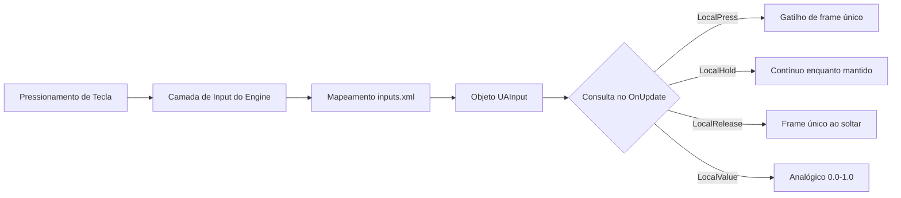

# Capítulo 6.13: Sistema de Input

[Início](../../README.md) | [<< Anterior: Sistema de Ações](12-action-system.md) | **Sistema de Input** | [Próximo: Sistema do Jogador >>](14-player-system.md)

---

## Introdução

O sistema de input do DayZ conecta entradas de hardware --- teclado, mouse e gamepad --- a ações nomeadas que os scripts podem consultar. Ele opera em duas camadas:

1. **inputs.xml** (camada de configuração) --- declara ações nomeadas, atribui teclas padrão e as organiza em grupos para o menu de Controles do jogador. Veja o [Capítulo 5.2: inputs.xml](../05-config-files/02-inputs-xml.md) para cobertura completa.

2. **API UAInput** (camada de script) --- consulta o estado do input em tempo de execução. É o que seus scripts chamam a cada frame para detectar pressionamentos, liberações, segurar teclas e valores analógicos.

Este capítulo cobre a camada de script: as classes, métodos e padrões que você usa para ler e controlar inputs a partir do Enforce Script.

---

## Classes Principais

O sistema de input é construído sobre três classes principais:

```
UAInputAPI         Singleton global (acessado via GetUApi())
├── UAInput        Representa uma única ação de input nomeada
└── Input          Acesso de input de nível inferior (acessado via GetGame().GetInput())
```

| Classe | Arquivo Fonte | Propósito |
|--------|--------------|-----------|
| `UAInputAPI` | `3_Game/inputapi/uainput.c` | Gerenciador global de input. Recupera inputs por nome/ID, gerencia exclusões, presets e retroiluminação. |
| `UAInput` | `3_Game/inputapi/uainput.c` | Ação de input individual. Fornece consultas de estado (press, hold, release) e controle (disable, suppress, lock). |
| `Input` | `3_Game/tools/input.c` | Classe de input de nível de engine. Consultas de estado baseadas em string, gerenciamento de dispositivos, controle de foco do jogo. |
| `InputUtils` | `3_Game/tools/inpututils.c` | Classe auxiliar estática. Resolução de nomes/ícones de botões para exibição na UI. |

---

## Acessando a API de Input

### UAInputAPI (Recomendado)

A maneira principal de acessar inputs. `GetUApi()` é uma função global que retorna o singleton `UAInputAPI`:

```c
// Obtém a API global de input
UAInputAPI inputAPI = GetUApi();

// Obtém uma ação de input específica pelo seu nome (como definido no inputs.xml)
UAInput input = inputAPI.GetInputByName("UAMyAction");

// Obtém uma ação de input específica pelo seu ID numérico
UAInput input = inputAPI.GetInputByID(someID);
```

### Classe Input (Alternativa)

A classe `Input` fornece consultas de estado baseadas em string diretamente, sem precisar de uma referência `UAInput` primeiro:

```c
// Obtém a instância Input
Input input = GetGame().GetInput();

// Consulta pelo nome da ação em string
if (input.LocalPress("UAMyAction", false))
{
    // A tecla acabou de ser pressionada
}
```

O parâmetro `bool check_focus` (segundo argumento) controla se a verificação respeita o foco do jogo. Passe `true` (padrão) para retornar false quando a janela do jogo está desfocada. Passe `false` para sempre retornar o estado bruto do input.

### Quando Usar Qual

- **`GetUApi().GetInputByName()`** --- Use quando precisar consultar o mesmo input múltiplas vezes, suprimi-lo/desabilitá-lo, ou inspecionar seus bindings. Você obtém um objeto `UAInput` que pode reutilizar.
- **`GetGame().GetInput().LocalPress()`** --- Use para verificações pontuais onde você não precisa manipular o input em si. Sintaxe mais simples, mas ligeiramente menos eficiente para consultas repetidas.

---

## Lendo o Estado do Input --- Métodos UAInput

Uma vez que você tem uma referência `UAInput`, estes métodos consultam seu estado atual:

```c
UAInput input = GetUApi().GetInputByName("UAMyAction");

// Verificações precisas por frame
bool justPressed   = input.LocalPress();        // True no PRIMEIRO frame em que a tecla é pressionada
bool justReleased  = input.LocalRelease();       // True no PRIMEIRO frame em que a tecla é solta
bool holdStarted   = input.LocalHoldBegin();     // True no primeiro frame em que o limite de hold é atingido
bool isHeld        = input.LocalHold();          // True CADA frame enquanto a tecla é mantida além do limite
bool clicked       = input.LocalClick();         // True ao pressionar-e-soltar antes do limite de hold
bool doubleClicked = input.LocalDoubleClick();   // True quando um toque duplo é detectado

// Valor analógico
float value = input.LocalValue();                // 0.0 ou 1.0 para digital; 0.0-1.0 para eixos analógicos
```

---

## Lendo o Estado do Input --- Métodos da Classe Input

A classe `Input` (de `GetGame().GetInput()`) oferece métodos equivalentes baseados em string:

```c
Input input = GetGame().GetInput();

bool pressed  = input.LocalPress("UAMyAction", false);
bool released = input.LocalRelease("UAMyAction", false);
bool held     = input.LocalHold("UAMyAction", false);
bool dblClick = input.LocalDbl("UAMyAction", false);
float value   = input.LocalValue("UAMyAction", false);
```

Note a pequena diferença de nomenclatura: `LocalDoubleClick()` no `UAInput` vs `LocalDbl()` no `Input`.

Ambas as classes também fornecem variantes `_ID` que aceitam IDs inteiros de ação em vez de strings (ex: `LocalPress_ID(int action)`).

---

## Referência de Métodos de Consulta de Input

### Métodos UAInput

| Método | Retorna | Quando é True | Caso de Uso |
|--------|---------|---------------|-------------|
| `LocalPress()` | `bool` | Primeiro frame em que a tecla é pressionada | Ações de toggle, gatilhos de disparo único |
| `LocalRelease()` | `bool` | Primeiro frame em que a tecla é solta | Finalizar ações contínuas |
| `LocalClick()` | `bool` | Tecla pressionada e solta antes do timer de hold | Detecção de toque rápido |
| `LocalHoldBegin()` | `bool` | Primeiro frame em que o limite de hold é atingido | Iniciar ações baseadas em hold |
| `LocalHold()` | `bool` | Cada frame enquanto mantida além do limite | Ações contínuas de hold |
| `LocalDoubleClick()` | `bool` | Toque duplo detectado | Ações especiais/alternativas |
| `LocalValue()` | `float` | Sempre (retorna valor atual) | Eixos do mouse, gatilhos do gamepad, input analógico |

### Métodos da Classe Input

| Método | Retorna | Assinatura | Método UAInput Equivalente |
|--------|---------|------------|---------------------------|
| `LocalPress()` | `bool` | `LocalPress(string action, bool check_focus = true)` | `UAInput.LocalPress()` |
| `LocalRelease()` | `bool` | `LocalRelease(string action, bool check_focus = true)` | `UAInput.LocalRelease()` |
| `LocalHold()` | `bool` | `LocalHold(string action, bool check_focus = true)` | `UAInput.LocalHold()` |
| `LocalDbl()` | `bool` | `LocalDbl(string action, bool check_focus = true)` | `UAInput.LocalDoubleClick()` |
| `LocalValue()` | `float` | `LocalValue(string action, bool check_focus = true)` | `UAInput.LocalValue()` |

### Notas Importantes de Timing

- **`LocalPress()`** dispara em exatamente **um frame** --- o frame em que a tecla transiciona de solta para pressionada. Se você verificar em qualquer outro frame, retorna false.
- **`LocalClick()`** dispara quando a tecla é pressionada e solta rapidamente (antes do timer de hold). NÃO é o mesmo que `LocalPress()`. Use `LocalPress()` para detecção imediata de tecla pressionada.
- **`LocalHold()`** NÃO dispara imediatamente. Ele espera o limite de hold do engine ser atingido primeiro. Use `LocalPress()` se precisar de resposta instantânea.
- **`LocalHoldBegin()`** dispara uma vez quando o limite de hold é atingido pela primeira vez. `LocalHold()` então dispara em cada frame subsequente.

---

## Verificando Inputs no OnUpdate

O padrão padrão para verificar inputs customizados é dentro de `MissionGameplay.OnUpdate()`:

```c
modded class MissionGameplay
{
    override void OnUpdate(float timeslice)
    {
        super.OnUpdate(timeslice);

        // Guarda: precisa de um jogador vivo
        PlayerBase player = PlayerBase.Cast(GetGame().GetPlayer());
        if (!player)
            return;

        // Guarda: sem input enquanto um menu está aberto
        if (GetGame().GetUIManager().GetMenu())
            return;

        UAInput myInput = GetUApi().GetInputByName("UAMyModOpenMenu");
        if (myInput && myInput.LocalPress())
        {
            OpenMyModMenu();
        }
    }
}
```

### Usando a Classe Input

```c
modded class MissionGameplay
{
    override void OnUpdate(float timeslice)
    {
        super.OnUpdate(timeslice);

        Input input = GetGame().GetInput();

        if (input.LocalPress("UAMyModOpenMenu", false))
        {
            OpenMyModMenu();
        }
    }
}
```

### Onde Mais Você Pode Verificar Inputs?

Inputs podem tecnicamente ser verificados em qualquer callback por frame, mas `MissionGameplay.OnUpdate()` é o local canônico. Outros lugares válidos incluem:

- `PlayerBase.CommandHandler()` --- executa a cada frame para o jogador local
- `ScriptedWidgetEventHandler.Update()` --- para input específico de UI (mas prefira event handlers de widget)
- `PluginBase.OnUpdate()` --- para input com escopo de plugin

Evite verificar inputs em código do lado do servidor, construtores de entidades ou event handlers pontuais onde o timing por frame não é garantido.

---

## Alternativa: OnKeyPress e OnKeyRelease

Para detecção simples de teclas hardcoded, `MissionBase` fornece callbacks `OnKeyPress()` e `OnKeyRelease()`:

```c
modded class MissionGameplay
{
    override void OnKeyPress(int key)
    {
        super.OnKeyPress(key);

        if (key == KeyCode.KC_F5)
        {
            // F5 foi pressionado --- não é remapeável!
            ToggleDebugOverlay();
        }
    }

    override void OnKeyRelease(int key)
    {
        super.OnKeyRelease(key);

        if (key == KeyCode.KC_F5)
        {
            // F5 foi solto
        }
    }
}
```

### UAInput vs OnKeyPress: Quando Usar Qual

| Recurso | UAInput (GetUApi) | OnKeyPress |
|---------|-------------------|------------|
| Jogador pode remapear | Sim | Não |
| Suporta modificadores | Sim (combos Ctrl+Key via inputs.xml) | Verificação manual necessária |
| Suporte a gamepad | Sim | Não |
| Aparece no menu de Controles | Sim | Não |
| Valores analógicos | Sim | Não |
| Simplicidade | Requer configuração de inputs.xml | Apenas verifique o KeyCode |
| Melhor para | Todas as ações voltadas ao jogador | Ferramentas de debug, atalhos hardcoded de desenvolvimento |

**Regra geral:** Se um jogador vai pressionar essa tecla alguma vez, use UAInput com inputs.xml. Só use OnKeyPress para ferramentas de debug internas ou testes de protótipo.

---

## Referência de KeyCode

O enum `KeyCode` é definido em `1_Core/proto/ensystem.c`. Essas constantes são usadas com `OnKeyPress()`, `OnKeyRelease()`, `KeyState()` e `DisableKey()`.

### Teclas Comumente Usadas

| Categoria | Constantes |
|-----------|-----------|
| Escape | `KC_ESCAPE` |
| Teclas de função | `KC_F1` até `KC_F12` |
| Linha numérica | `KC_1`, `KC_2`, `KC_3`, `KC_4`, `KC_5`, `KC_6`, `KC_7`, `KC_8`, `KC_9`, `KC_0` |
| Letras | `KC_A` até `KC_Z` (ex: `KC_Q`, `KC_W`, `KC_E`, `KC_R`, `KC_T`) |
| Modificadores | `KC_LSHIFT`, `KC_RSHIFT`, `KC_LCONTROL`, `KC_RCONTROL`, `KC_LMENU` (Alt esquerdo), `KC_RMENU` (Alt direito) |
| Navegação | `KC_UP`, `KC_DOWN`, `KC_LEFT`, `KC_RIGHT` |
| Edição | `KC_SPACE`, `KC_RETURN`, `KC_TAB`, `KC_BACK` (Backspace), `KC_DELETE`, `KC_INSERT` |
| Controle de página | `KC_HOME`, `KC_END`, `KC_PRIOR` (Page Up), `KC_NEXT` (Page Down) |
| Numpad | `KC_NUMPAD0` até `KC_NUMPAD9`, `KC_NUMPADENTER`, `KC_ADD`, `KC_SUBTRACT`, `KC_MULTIPLY`, `KC_DIVIDE`, `KC_DECIMAL` |
| Locks | `KC_CAPITAL` (Caps Lock), `KC_NUMLOCK`, `KC_SCROLL` (Scroll Lock) |
| Pontuação | `KC_MINUS`, `KC_EQUALS`, `KC_LBRACKET`, `KC_RBRACKET`, `KC_SEMICOLON`, `KC_APOSTROPHE`, `KC_GRAVE`, `KC_BACKSLASH`, `KC_COMMA`, `KC_PERIOD`, `KC_SLASH` |

### Enum MouseState

Para verificação bruta do estado do botão do mouse (não através do sistema UAInput):

```c
enum MouseState
{
    LEFT,
    RIGHT,
    MIDDLE,
    X,        // Eixo horizontal
    Y,        // Eixo vertical
    WHEEL     // Roda de rolagem
};

// Uso:
int state = GetMouseState(MouseState.LEFT);
// Bit 15 (MB_PRESSED_MASK) é definido quando pressionado
```

### Estado de Tecla de Baixo Nível

```c
// Verifica estado bruto da tecla (retorna bitmask, bit 15 = atualmente pressionada)
int state = KeyState(KeyCode.KC_LSHIFT);

// Limpa o estado da tecla (previne auto-repetição até o próximo pressionamento físico)
ClearKey(KeyCode.KC_RETURN);

// Desabilita uma tecla pelo resto deste frame
GetGame().GetInput().DisableKey(KeyCode.KC_RETURN);
```

---

## Suprimindo e Desabilitando Inputs

### Suprimir (Por-Input, Um Frame)

Previne o input de disparar no próximo frame. Útil durante transições (fechando um menu) para prevenir vazamento de input de um frame:

```c
UAInput input = GetUApi().GetInputByName("UAMyAction");
input.Supress();  // Nota: 's' único no nome do método
```

### Suprimir Todos os Inputs (Global, Um Frame)

Suprime TODOS os inputs para o próximo frame. Chame isto ao sair de menus ou transicionar entre contextos de input:

```c
GetUApi().SupressNextFrame(true);
```

Isto é comumente usado pelo vanilla ao fechar o menu principal para prevenir que a tecla escape reabra algo imediatamente.

### ForceDisable (Por-Input, Persistente)

Desabilita completamente um input específico até ser reabilitado. O input não disparará nenhum evento enquanto estiver desabilitado:

```c
// Desabilita enquanto o menu está aberto
GetUApi().GetInputByName("UAMyAction").ForceDisable(true);

// Reabilita quando o menu fecha
GetUApi().GetInputByName("UAMyAction").ForceDisable(false);
```

### Lock / Unlock (Por-Input, Persistente)

Similar ao ForceDisable mas usa um mecanismo diferente. Tenha cautela --- se múltiplos sistemas bloqueiam/desbloqueiam o mesmo input, eles podem interferir uns com os outros:

```c
UAInput input = GetUApi().GetInputByName("UAMyAction");
input.Lock();    // Desabilita até Unlock() ser chamado
input.Unlock();  // Reabilita

bool locked = input.IsLocked();  // Verifica estado
```

A documentação do engine recomenda usar grupos de exclusão em vez de Lock/Unlock para a maioria dos casos.

### ForceDisable em Todos os Inputs (Em Massa)

Ao abrir uma UI em tela cheia, desabilite todos os inputs do jogo exceto os que sua UI precisa. Este é o padrão usado pelo COT e Expansion:

```c
void DisableAllInputs(bool state)
{
    TIntArray inputIDs = new TIntArray;
    GetUApi().GetActiveInputs(inputIDs);

    // Inputs para manter ativos mesmo com a UI aberta
    TIntArray skipIDs = new TIntArray;
    skipIDs.Insert(GetUApi().GetInputByName("UAUIBack").ID());

    foreach (int inputID : inputIDs)
    {
        if (skipIDs.Find(inputID) == -1)
        {
            GetUApi().GetInputByID(inputID).ForceDisable(state);
        }
    }

    GetUApi().UpdateControls();
}
```

**Importante:** Sempre chame `GetUApi().UpdateControls()` após modificar estados de input em massa.

### Grupos de Exclusão de Input

O sistema de missão fornece grupos de exclusão nomeados definidos no `specific.xml` do engine. Quando ativados, eles desabilitam categorias de inputs:

```c
// Suprime inputs de gameplay enquanto um menu está aberto
GetGame().GetMission().AddActiveInputExcludes({"menu"});

// Restaura inputs ao fechar
GetGame().GetMission().RemoveActiveInputExcludes({"menu"}, true);
```

Assinaturas de métodos na classe `Mission`:

```c
void AddActiveInputExcludes(array<string> excludes);
void RemoveActiveInputExcludes(array<string> excludes, bool bForceSupress = false);
void EnableAllInputs(bool bForceSupress = false);
bool IsInputExcludeActive(string exclude);
```

O parâmetro `bForceSupress` em `RemoveActiveInputExcludes` chama `SupressNextFrame` internamente para prevenir vazamento de input ao reabilitar.

O Expansion usa seu próprio grupo de exclusão customizado registrado com o engine:

```c
GetUApi().ActivateExclude("menuexpansion");
GetUApi().UpdateControls();
```

---

## Vinculando inputs.xml ao Script

A conexão entre a camada de configuração XML e a camada de script é a **string do nome da ação**.



### O Fluxo

```
inputs.xml                              Script
──────────────                          ──────────────────────────────
<input name="UAMyModOpenMenu" />   -->  GetUApi().GetInputByName("UAMyModOpenMenu")
       │                                         │
       │  Engine carrega na inicialização        │  Retorna objeto UAInput
       │  Registra na UAInputAPI                 │  com teclas vinculadas do XML
       ▼                                         ▼
Jogador vê em Configurações > Controles  input.LocalPress() retorna true
e pode remapear a tecla                  quando o jogador pressiona a tecla vinculada
```

1. Na inicialização, o engine lê todos os arquivos `inputs.xml` dos mods carregados
2. Cada `<input name="...">` é registrado como um `UAInput` na `UAInputAPI` global
3. Vinculações de tecla padrão do `<preset>` são aplicadas (a menos que o jogador as tenha customizado)
4. No script, `GetUApi().GetInputByName("UAMyModOpenMenu")` recupera o input registrado
5. Chamar `LocalPress()` etc. verifica contra qualquer tecla que o jogador tenha vinculado

A string do nome deve corresponder **exatamente** (sensível a maiúsculas) entre o XML e a chamada no script.

Para a sintaxe completa do inputs.xml, veja o [Capítulo 5.2: inputs.xml](../05-config-files/02-inputs-xml.md).

### Registro em Tempo de Execução (Avançado)

Inputs também podem ser registrados em tempo de execução a partir do script, sem um arquivo inputs.xml:

```c
// Registra um novo grupo
GetUApi().RegisterGroup("mymod", "My Mod");

// Registra um novo input nesse grupo
UAInput input = GetUApi().RegisterInput("UAMyModAction", "STR_MYMOD_ACTION", "mymod");

// Depois, se necessário:
GetUApi().DeRegisterInput("UAMyModAction");
GetUApi().DeRegisterGroup("mymod");
```

Isto é raramente usado. A abordagem via inputs.xml é preferida porque se integra corretamente com o menu de Controles e o sistema de presets.

---

## Padrões Comuns

### Alternar Painel Abrir/Fechar

```c
modded class MissionGameplay
{
    protected bool m_MyPanelOpen;

    override void OnUpdate(float timeslice)
    {
        super.OnUpdate(timeslice);

        if (!GetGame().GetPlayer())
            return;

        UAInput input = GetUApi().GetInputByName("UAMyModPanel");
        if (input && input.LocalPress())
        {
            if (m_MyPanelOpen)
                CloseMyPanel();
            else
                OpenMyPanel();
        }
    }

    void OpenMyPanel()
    {
        m_MyPanelOpen = true;
        // Mostra UI...

        // Desabilita inputs de gameplay enquanto o painel está aberto
        GetGame().GetMission().AddActiveInputExcludes({"menu"});
    }

    void CloseMyPanel()
    {
        m_MyPanelOpen = false;
        // Esconde UI...

        // Restaura inputs de gameplay
        GetGame().GetMission().RemoveActiveInputExcludes({"menu"}, true);
    }
}
```

### Segurar-para-Ativar, Soltar-para-Desativar

```c
override void OnUpdate(float timeslice)
{
    super.OnUpdate(timeslice);

    Input input = GetGame().GetInput();

    if (input.LocalPress("UAMyModSprint", false))
    {
        StartSprinting();
    }

    if (input.LocalRelease("UAMyModSprint", false))
    {
        StopSprinting();
    }
}
```

### Verificação de Combo Modificador + Tecla

Se você definiu um combo Ctrl+Key no inputs.xml, o sistema UAInput lida com isso automaticamente. Mas se você precisa verificar o estado do modificador manualmente junto com um UAInput:

```c
override void OnUpdate(float timeslice)
{
    super.OnUpdate(timeslice);

    UAInput input = GetUApi().GetInputByName("UAMyModAction");
    if (input && input.LocalPress())
    {
        // Verifica se Shift está mantido via KeyState bruto
        bool shiftHeld = (KeyState(KeyCode.KC_LSHIFT) != 0);

        if (shiftHeld)
            PerformAlternateAction();
        else
            PerformNormalAction();
    }
}
```

### Suprimir Input Quando a UI o Consome

Quando sua UI lida com um pressionamento de tecla, suprima a ação subjacente do jogo para prevenir que ambas disparem:

```c
class MyMenuHandler extends ScriptedWidgetEventHandler
{
    override bool OnClick(Widget w, int x, int y, int button)
    {
        if (w == m_ConfirmButton)
        {
            DoConfirm();

            // Suprime o input do jogo que pode compartilhar esta tecla
            GetUApi().GetInputByName("UAFire").Supress();
            return true;
        }
        return false;
    }
}
```

### Obtendo o Nome de Exibição de uma Tecla Vinculada

Para mostrar ao jogador qual tecla está vinculada a uma ação (para prompts de UI):

```c
UAInput input = GetUApi().GetInputByName("UAMyModAction");
string keyName = InputUtils.GetButtonNameFromInput("UAMyModAction", EUAINPUT_DEVICE_KEYBOARDMOUSE);
// Retorna nome localizado da tecla como "F5", "Left Ctrl", etc.
```

Para ícones de controle e formatação rich-text:

```c
string richText = InputUtils.GetRichtextButtonIconFromInputAction(
    "UAMyModAction",
    "Open Menu",
    EUAINPUT_DEVICE_CONTROLLER
);
// Retorna tag de imagem + rótulo para exibição na UI
```

---

## Foco do Jogo

A classe `Input` fornece gerenciamento de foco do jogo, que controla se os inputs são processados quando a janela do jogo não está focada:

```c
Input input = GetGame().GetInput();

// Adiciona ao contador de foco (positivo = desfocado, inputs suprimidos)
input.ChangeGameFocus(1);

// Remove do contador de foco
input.ChangeGameFocus(-1);

// Reseta o contador de foco para 0 (totalmente focado)
input.ResetGameFocus();

// Verifica se o jogo atualmente tem foco (contador == 0)
bool hasFocus = input.HasGameFocus();
```

Este é um sistema de contagem de referências. Múltiplos sistemas podem solicitar mudanças de foco, e os inputs retomam apenas quando todos liberam.

---

## Erros Comuns

### Verificando Input no Servidor

Inputs são **apenas do lado do cliente**. O servidor não tem conceito de estado de teclado, mouse ou gamepad. Se você chamar `GetUApi().GetInputByName()` no servidor, o resultado é sem sentido.

```c
// ERRADO --- isto roda no servidor, inputs não existem aqui
modded class MissionServer
{
    override void OnUpdate(float timeslice)
    {
        super.OnUpdate(timeslice);
        UAInput input = GetUApi().GetInputByName("UAMyAction");
        if (input.LocalPress())  // Sempre false no servidor!
        {
            DoSomething();
        }
    }
}

// CORRETO --- verifica input no cliente, envia RPC para o servidor
modded class MissionGameplay  // Classe de missão do lado do cliente
{
    override void OnUpdate(float timeslice)
    {
        super.OnUpdate(timeslice);
        UAInput input = GetUApi().GetInputByName("UAMyAction");
        if (input && input.LocalPress())
        {
            // Envia RPC para o servidor para executar a ação
            GetGame().RPCSingleParam(null, MY_RPC_ID, null, true);
        }
    }
}
```

### Usando OnKeyPress para Ações Voltadas ao Jogador

```c
// ERRADO --- tecla hardcoded, jogador não pode remapear
override void OnKeyPress(int key)
{
    super.OnKeyPress(key);
    if (key == KeyCode.KC_Y)
        OpenMyMenu();
}

// CORRETO --- usa inputs.xml, jogador pode remapear nas Configurações
override void OnUpdate(float timeslice)
{
    super.OnUpdate(timeslice);
    UAInput input = GetUApi().GetInputByName("UAMyModOpenMenu");
    if (input && input.LocalPress())
        OpenMyMenu();
}
```

### Não Suprimir Input Quando a UI Está Aberta

Quando seu mod abre um painel de UI, as teclas WASD do jogador ainda moverão o personagem, o mouse ainda mirará, e clicar disparará a arma --- a menos que você desabilite os inputs do jogo:

```c
// ERRADO --- personagem anda atrás do menu
void OpenMenu()
{
    m_MenuWidget.Show(true);
}

// CORRETO --- desabilita movimento enquanto o menu está aberto
void OpenMenu()
{
    m_MenuWidget.Show(true);
    GetGame().GetMission().AddActiveInputExcludes({"menu"});
    GetGame().GetUIManager().ShowCursor(true);
}

void CloseMenu()
{
    m_MenuWidget.Show(false);
    GetGame().GetMission().RemoveActiveInputExcludes({"menu"}, true);
    GetGame().GetUIManager().ShowCursor(false);
}
```

### Esquecendo Que LocalPress Dispara Apenas UM Frame

`LocalPress()` retorna `true` por exatamente um frame --- o frame em que a tecla transiciona de solta para pressionada. Se o caminho do seu código não executa nesse frame exato, você perde o evento.

```c
// ERRADO --- se DoExpensiveCheck() leva tempo ou pula frames, você perde o pressionamento
void SomeCallback()
{
    if (GetUApi().GetInputByName("UAMyAction").LocalPress())
    {
        // Isto pode nunca disparar se SomeCallback não é chamado a cada frame
    }
}

// CORRETO --- sempre verifique em um callback por frame
override void OnUpdate(float timeslice)
{
    super.OnUpdate(timeslice);
    if (GetUApi().GetInputByName("UAMyAction").LocalPress())
    {
        DoAction();
    }
}
```

### Confundindo LocalClick e LocalPress

`LocalClick()` NÃO é o mesmo que `LocalPress()`. `LocalClick()` dispara quando uma tecla é pressionada E solta rapidamente (antes do limite de hold). `LocalPress()` dispara imediatamente ao pressionar a tecla. A maioria dos mods quer `LocalPress()`.

```c
// Pode não disparar se o jogador segurar a tecla por muito tempo
if (input.LocalClick())  // Requer toque rápido

// Dispara imediatamente ao pressionar a tecla, independente da duração do hold
if (input.LocalPress())  // Geralmente é o que você quer
```

### Esquecendo UpdateControls Após Mudanças em Massa

Quando você `ForceDisable()` múltiplos inputs, você deve chamar `UpdateControls()` para as mudanças terem efeito:

```c
// ERRADO --- mudanças podem não se aplicar imediatamente
GetUApi().GetInputByName("UAFire").ForceDisable(true);
GetUApi().GetInputByName("UAMoveForward").ForceDisable(true);

// CORRETO --- aplica as mudanças
GetUApi().GetInputByName("UAFire").ForceDisable(true);
GetUApi().GetInputByName("UAMoveForward").ForceDisable(true);
GetUApi().UpdateControls();
```

### Escrevendo Supress Errado

O método do engine é `Supress()` com um único 's' (não `Suppress`). O método global `SupressNextFrame()` também usa um único 's'. Isto é uma peculiaridade da API do engine:

```c
// ERRADO --- não compilará
input.Suppress();

// CORRETO --- 's' único
input.Supress();
GetUApi().SupressNextFrame(true);
```

---

## Referência Rápida

```c
// === Obtendo inputs ===
UAInputAPI api = GetUApi();
UAInput input = api.GetInputByName("UAMyAction");
Input rawInput = GetGame().GetInput();

// === Consultas de estado (UAInput) ===
input.LocalPress()        // Tecla acabou de ser pressionada (um frame)
input.LocalRelease()      // Tecla acabou de ser solta (um frame)
input.LocalClick()        // Toque rápido detectado
input.LocalHoldBegin()    // Limite de hold acabou de ser atingido (um frame)
input.LocalHold()         // Mantida além do limite (cada frame)
input.LocalDoubleClick()  // Toque duplo detectado
input.LocalValue()        // Valor analógico (float)

// === Consultas de estado (Input, baseado em string) ===
rawInput.LocalPress("UAMyAction", false)
rawInput.LocalRelease("UAMyAction", false)
rawInput.LocalHold("UAMyAction", false)
rawInput.LocalDbl("UAMyAction", false)
rawInput.LocalValue("UAMyAction", false)

// === Suprimindo ===
input.Supress()                    // Este input, próximo frame
api.SupressNextFrame(true)         // Todos os inputs, próximo frame

// === Desabilitando ===
input.ForceDisable(true)           // Desabilitar persistentemente
input.ForceDisable(false)          // Reabilitar
input.Lock()                       // Bloquear (use exclusões em vez disso)
input.Unlock()                     // Desbloquear
api.UpdateControls()               // Aplicar mudanças

// === Grupos de exclusão ===
GetGame().GetMission().AddActiveInputExcludes({"menu"});
GetGame().GetMission().RemoveActiveInputExcludes({"menu"}, true);
GetGame().GetMission().EnableAllInputs(true);

// === Estado bruto de tecla ===
int state = KeyState(KeyCode.KC_LSHIFT);
GetGame().GetInput().DisableKey(KeyCode.KC_RETURN);

// === Auxiliares de exibição ===
string name = InputUtils.GetButtonNameFromInput("UAMyAction", EUAINPUT_DEVICE_KEYBOARDMOUSE);
```

---

*Este capítulo cobre a API do Sistema de Input no lado do script. Para a configuração XML que registra keybindings, veja o [Capítulo 5.2: inputs.xml](../05-config-files/02-inputs-xml.md).*

---

## Boas Práticas

- **Sempre use `UAInput` via inputs.xml para keybindings voltados ao jogador.** Isto permite que jogadores remapeiem teclas, mostra ações no menu de Controles e suporta input de gamepad. Reserve `OnKeyPress` apenas para atalhos de debug.
- **Chame `AddActiveInputExcludes({"menu"})` ao abrir UI em tela cheia.** Sem isto, teclas de movimento do jogador (WASD), mira do mouse e disparo de arma permanecem ativos atrás do seu menu, causando ações acidentais.
- **Verifique inputs apenas em callbacks por frame como `OnUpdate()`.** `LocalPress()` retorna true por exatamente um frame. Verificá-lo em event handlers ou callbacks que não rodam a cada frame perderá pressionamentos de tecla.
- **Chame `GetUApi().UpdateControls()` após mudanças em massa de `ForceDisable()`.** Sem esta chamada de flush, mudanças de estado de enable/disable podem não ter efeito até o próximo frame, causando vazamento de input de um frame.
- **Lembre-se que `Supress()` usa um único "s".** A API do engine escreve `Supress()` e `SupressNextFrame()`. Usar a grafia correta em inglês `Suppress` não compilará.

---

## Compatibilidade e Impacto

- **Multi-Mod:** Nomes de ações de input são globais. Dois mods registrando o mesmo nome de `UAInput` (ex: `"UAOpenMenu"`) colidirão. Sempre prefixe com o nome do seu mod: `"UAMyModOpenMenu"`. Grupos de exclusão de input são compartilhados -- um mod ativando a exclusão `"menu"` afeta todos os mods.
- **Performance:** A verificação de input é leve. `GetUApi().GetInputByName()` realiza uma busca por hash. Cachear a referência `UAInput` em uma variável membro evita buscas repetidas, mas não é estritamente necessário para performance.
- **Servidor/Cliente:** Inputs existem apenas no cliente. O servidor não tem estado de teclado, mouse ou gamepad. Sempre detecte input no cliente e envie RPCs para o servidor para ações autoritativas.
