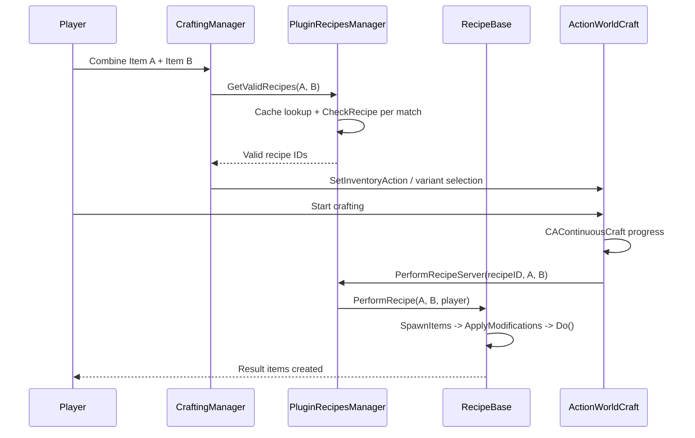

# Capítulo 6.16: Sistema de Crafting

[Início](../../README.md) | [<< Anterior: Sistema de Som](15-sound-system.md) | **Sistema de Crafting** | [Próximo: Sistema de Construção >>](17-construction-system.md)

---

## Introdução

O Sistema de Crafting é como o DayZ lida com a combinação de itens para produzir novos itens --- afiar gravetos com facas, amarrar trapos em corda, serrar canos de espingardas, montar talas. É um pipeline orientado a dados que funciona sobre o Sistema de Ações (Capítulo 6.12) e usa um registro central de receitas para descobrir, validar e executar transformações de itens.

Existem duas abordagens fundamentais para o crafting no DayZ:

1. **Crafting baseado em receitas** --- Itens são combinados através do `PluginRecipesManager`, que mantém um registro de subclasses de `RecipeBase`. Cada receita declara seus ingredientes, resultados, condições e modificações. O motor descobre automaticamente receitas válidas quando dois itens são combinados e as apresenta ao jogador através da ação `ActionWorldCraft`.

2. **Crafting baseado em ações** --- Subclasses personalizadas de `ActionContinuousBase` lidam com o crafting diretamente sem o sistema de receitas. Esta abordagem é usada para transformações especializadas como construção de bases, cozinhar e jardinagem, onde a abstração de receita não se encaixa.

Este capítulo foca principalmente no sistema de receitas, que lida com a grande maioria do crafting de itens no DayZ vanilla (mais de 150 receitas registradas).

---

## Arquitetura do Sistema

### Fluxo de Alto Nível

```
Jogador arrasta Item A sobre Item B (inventário)
  ou mira no Item B enquanto segura o Item A (mundo)
        |
        v
CraftingManager.OnUpdate() / SetInventoryCraft()
        |
        v
PluginRecipesManager.GetValidRecipes(itemA, itemB)
        |
        v
Busca no cache de receitas --> correspondência de ingredientes --> CheckRecipe() por candidato
        |
        v
IDs de receitas válidas retornados --> ActionWorldCraft criada com ID da receita
        |
        v
Jogador inicia o crafting --> barra de progresso CAContinuousCraft
        |
        v
OnFinishProgressServer() --> PluginRecipesManager.PerformRecipeServer()
        |
        v
RecipeBase: SpawnItems() --> ApplyModificationsResults()
         --> ApplyModificationsIngredients() --> Do() --> DeleteIngredientsPass()
```



### Classes Principais

| Classe | Arquivo | Propósito |
|--------|---------|-----------|
| `RecipeBase` | `4_World/classes/recipes/recipebase.c` | Classe base para todas as receitas. Declara ingredientes, resultados, condições. |
| `PluginRecipesManagerBase` | `4_World/classes/recipes/recipes/pluginrecipesmanagerbase.c` | Registra todas as receitas vanilla via `RegisterRecipies()`. |
| `PluginRecipesManager` | `4_World/plugins/pluginbase/pluginrecipesmanager.c` | Gerenciador em tempo de execução: geração de cache, busca de receitas, validação, execução. |
| `CraftingManager` | `4_World/classes/craftingmanager.c` | Máquina de estados de crafting do lado do cliente (modo mundo vs inventário). |
| `CacheObject` | `4_World/classes/recipes/cacheobject.c` | Entrada de cache de receita por item com posições de ingredientes em bitmask. |
| `ActionWorldCraft` | `4_World/classes/useractionscomponent/actions/continuous/actionworldcraft.c` | A ação que conduz todo o crafting baseado em receitas. |
| `CAContinuousCraft` | `4_World/classes/useractionscomponent/actioncomponents/cacontinuouscraft.c` | Componente de progresso que lê a duração da receita. |

### Constantes

```c
// recipebase.c
const int MAX_NUMBER_OF_INGREDIENTS = 2;    // receitas sempre têm exatamente 2 slots de ingredientes
const int MAXIMUM_RESULTS = 10;             // máximo de itens de saída por receita
const float DEFAULT_SPAWN_DISTANCE = 0.6;   // deslocamento de spawn no chão a partir do jogador

// constants.c (3_Game)
const float CRAFTING_TIME_UNIT_SIZE = 4.0;  // multiplicado por m_AnimationLength para obter segundos

// pluginrecipesmanager.c
const int MAX_NUMBER_OF_RECIPES = 2048;     // limite máximo de receitas registradas
const int MAX_CONCURENT_RECIPES = 128;      // máximo de receitas resolvidas em uma única consulta
```

> **Insight chave:** Cada receita tem exatamente dois "slots" de ingredientes (índice 0 e índice 1). Cada slot pode aceitar múltiplos tipos de itens (ex.: slot 0 aceita `Rag` OU `BandageDressing` OU `DuctTape`), mas o jogador sempre combina exatamente dois itens.

---

## RecipeBase --- A Definição da Receita

Cada receita de crafting é uma classe que estende `RecipeBase`. O construtor chama `Init()` automaticamente, onde você configura tudo sobre a receita.

### Referência de Campos da Classe

#### Metadados da Receita

| Campo | Tipo | Padrão | Descrição |
|-------|------|--------|-----------|
| `m_Name` | `string` | `"RecipeBase default name"` | Nome de exibição (chave de stringtable como `"#STR_CraftTorch0"`). |
| `m_IsInstaRecipe` | `bool` | `false` | Se `true`, a receita completa instantaneamente sem animação. |
| `m_AnimationLength` | `float` | `1.0` | Duração em unidades de tempo relativas. Segundos reais = `m_AnimationLength * 4.0`. |
| `m_Specialty` | `float` | `0.0` | Habilidades suaves: positivo = rudeza, negativo = precisão. |
| `m_AnywhereInInventory` | `bool` | `false` | Se `true`, nenhum dos itens precisa estar nas mãos do jogador. |

#### Condições de Ingredientes (por slot, indexado 0 ou 1)

| Campo | Padrão | Descrição |
|-------|--------|-----------|
| `m_MinDamageIngredient[i]` | `0` | Nível mínimo de dano necessário. `-1` = desabilitar verificação. |
| `m_MaxDamageIngredient[i]` | `0` | Nível máximo de dano permitido. `-1` = desabilitar verificação. |
| `m_MinQuantityIngredient[i]` | `0` | Quantidade mínima necessária. `-1` = desabilitar verificação. |
| `m_MaxQuantityIngredient[i]` | `0` | Quantidade máxima permitida. `-1` = desabilitar verificação. |

#### Modificações de Ingredientes (por slot, aplicadas após o crafting)

| Campo | Padrão | Descrição |
|-------|--------|-----------|
| `m_IngredientAddHealth[i]` | `0` | Delta de saúde aplicado. `0` = não fazer nada. |
| `m_IngredientSetHealth[i]` | `0` | Definir saúde para este valor. `-1` = não fazer nada. |
| `m_IngredientAddQuantity[i]` | `0` | Delta de quantidade aplicado. `0` = não fazer nada. Valores negativos consomem. |
| `m_IngredientDestroy[i]` | `false` | Se `true`, o ingrediente é deletado após o crafting. |
| `m_IngredientUseSoftSkills[i]` | `false` | Permite que habilidades suaves modifiquem as alterações no ingrediente. |

#### Configuração de Resultado (por resultado, indexado de 0 a `MAXIMUM_RESULTS - 1`)

| Campo | Padrão | Descrição |
|-------|--------|-----------|
| `m_ResultSetFullQuantity[i]` | `false` | Se `true`, o resultado aparece com quantidade máxima. |
| `m_ResultSetQuantity[i]` | `0` | Define a quantidade do resultado para este valor. `-1` = não fazer nada. |
| `m_ResultSetHealth[i]` | `0` | Define a saúde do resultado. `-1` = não fazer nada. |
| `m_ResultInheritsHealth[i]` | `0` | `-1` = não fazer nada. `>= 0` = herdar do ingrediente N. `-2` = média de todos os ingredientes. |
| `m_ResultInheritsColor[i]` | `0` | `-1` = não fazer nada. `>= 0` = anexar o valor de `color` da config do ingrediente N ao nome da classe. |
| `m_ResultToInventory[i]` | `0` | `-2` = spawnar no chão. `-1` = inventário do jogador. `>= 0` = trocar posição com o ingrediente N. |
| `m_ResultReplacesIngredient[i]` | `0` | `-1` = não fazer nada. `>= 0` = transferir propriedades/anexos do ingrediente N. |
| `m_ResultUseSoftSkills[i]` | `false` | Permite que habilidades suaves modifiquem os valores do resultado. |
| `m_ResultSpawnDistance[i]` | `0.6` | Distância de deslocamento do spawn no chão a partir do jogador. |

---

## Criando uma Receita Personalizada

### Passo 1: Definir a Classe da Receita

Crie um novo arquivo `.c` em `4_World/` (receitas são carregadas desta camada). Estenda `RecipeBase` e sobrescreva `Init()`:

```c
// Arquivo: 4_World/recipes/CraftMyItem.c

class CraftMyItem extends RecipeBase
{
    override void Init()
    {
        m_Name = "#STR_craft_my_item";   // nome de exibição da stringtable
        m_IsInstaRecipe = false;
        m_AnimationLength = 1.5;         // 1.5 * 4.0 = 6.0 segundos
        m_Specialty = 0.02;              // rudeza

        // --- Condições dos ingredientes ---
        m_MinDamageIngredient[0] = -1;   // sem verificação de dano
        m_MaxDamageIngredient[0] = 3;    // não arruinado (nível 4)
        m_MinQuantityIngredient[0] = 1;
        m_MaxQuantityIngredient[0] = -1;

        m_MinDamageIngredient[1] = -1;
        m_MaxDamageIngredient[1] = 3;
        m_MinQuantityIngredient[1] = 2;  // precisa de pelo menos 2 do ingrediente 2
        m_MaxQuantityIngredient[1] = -1;

        // --- Ingrediente 1: uma faca (ferramenta, não consumida) ---
        InsertIngredient(0, "KitchenKnife");
        InsertIngredient(0, "HuntingKnife");
        InsertIngredient(0, "SteakKnife");

        m_IngredientAddHealth[0] = -5;       // faca perde 5 de saúde
        m_IngredientSetHealth[0] = -1;
        m_IngredientAddQuantity[0] = 0;
        m_IngredientDestroy[0] = false;      // faca sobrevive
        m_IngredientUseSoftSkills[0] = true;

        // --- Ingrediente 2: material (parcialmente consumido) ---
        InsertIngredient(1, "WoodenStick");

        m_IngredientAddHealth[1] = 0;
        m_IngredientSetHealth[1] = -1;
        m_IngredientAddQuantity[1] = -2;     // consome 2 de quantidade
        m_IngredientDestroy[1] = false;
        m_IngredientUseSoftSkills[1] = false;

        // --- Resultado ---
        AddResult("MyCustomItem");

        m_ResultSetFullQuantity[0] = false;
        m_ResultSetQuantity[0] = -1;
        m_ResultSetHealth[0] = -1;
        m_ResultInheritsHealth[0] = -2;      // saúde média de ambos os ingredientes
        m_ResultInheritsColor[0] = -1;
        m_ResultToInventory[0] = -2;         // spawnar no chão
        m_ResultUseSoftSkills[0] = false;
        m_ResultReplacesIngredient[0] = -1;
    }

    override bool CanDo(ItemBase ingredients[], PlayerBase player)
    {
        // Validação personalizada além das verificações de condição embutidas
        return true;
    }

    override void Do(ItemBase ingredients[], PlayerBase player, array<ItemBase> results, float specialty_weight)
    {
        // Lógica personalizada após spawning/modificações
        // ingredients[0] = faca (ordenada), ingredients[1] = gravetos (ordenados)
        // results.Get(0) = o MyCustomItem spawnado
    }
}
```

### Passo 2: Registrar a Receita

Sobrescreva `RegisterRecipies()` em uma `PluginRecipesManagerBase` modded:

```c
// Arquivo: 4_World/plugins/PluginRecipesManagerBase.c

modded class PluginRecipesManagerBase extends PluginBase
{
    override void RegisterRecipies()
    {
        super.RegisterRecipies();               // manter todas as receitas vanilla
        RegisterRecipe(new CraftMyItem);        // adicionar a sua
    }
}
```

Para remover uma receita vanilla existente:

```c
modded class PluginRecipesManagerBase extends PluginBase
{
    override void RegisterRecipies()
    {
        super.RegisterRecipies();
        UnregisterRecipe("CraftStoneKnife");    // remover pelo nome da classe em string
    }
}
```

> **Exemplo oficial:** `DayZ-Samples/Test_Crafting/` demonstra exatamente este padrão --- uma `ExampleRecipe` que transforma qualquer item em pedras usando um `MagicHammer` personalizado, registrada através de uma `PluginRecipesManagerBase` modded.

### Passo 3: Nenhuma Ligação Adicional Necessária

Diferente das ações (que devem ser registradas em itens via `SetActions()`), receitas são descobertas automaticamente. O `PluginRecipesManager` constrói um cache na inicialização percorrendo todas as receitas registradas e combinando-as com todos os itens definidos na config. Quando quaisquer dois itens são combinados, o cache é consultado para receitas correspondentes.

---

## Referência de Métodos da Receita

### Init()

Chamado a partir do construtor de `RecipeBase`. Defina todos os valores dos campos aqui. Não chame `super.Init()` --- é uma declaração vazia na classe base.

```c
override void Init()
{
    m_Name = "#STR_MyRecipe";
    m_AnimationLength = 1.0;        // 4.0 segundos em tempo real
    m_IsInstaRecipe = false;
    m_Specialty = -0.01;            // crafting de precisão

    // ... configuração de ingredientes e resultados ...
}
```

### CanDo(ItemBase ingredients[], PlayerBase player)

Chamado durante `CheckRecipe()` após as verificações de condição embutidas (`CheckConditions()`) passarem. Use isso para lógica de validação personalizada que não pode ser expressa através das condições baseadas em campos. O array `ingredients[]` é **ordenado** --- índice 0 mapeia para sua definição de slot de ingrediente 0, índice 1 para o slot 1.

A implementação base verifica se algum ingrediente tem anexos e retorna `false` se tiver:

```c
// RecipeBase.CanDo base --- ingredientes com anexos não podem ser craftados
bool CanDo(ItemBase ingredients[], PlayerBase player)
{
    for (int i = 0; i < MAX_NUMBER_OF_INGREDIENTS; i++)
    {
        if (ingredients[i].GetInventory() && ingredients[i].GetInventory().AttachmentCount() > 0)
            return false;
    }
    return true;
}
```

Padrões comuns em sobrescritas vanilla:

```c
// CraftSplint: requisitos de quantidade diferentes por tipo de ingrediente
override bool CanDo(ItemBase ingredients[], PlayerBase player)
{
    ItemBase ingredient1 = ingredients[0];

    if (ingredient1.Type() == Rag)
    {
        if (ingredient1.GetQuantity() >= 4)
            return true;
        return false;
    }

    if (ingredient1.Type() == DuctTape)
    {
        if (ingredient1.GetQuantity() >= (ingredient1.GetQuantityMax() / 2))
            return true;
        return false;
    }

    return true;
}

// CraftImprovisedExplosive: contêiner deve estar vazio
override bool CanDo(ItemBase ingredients[], PlayerBase player)
{
    return ingredients[0].IsEmpty();
}

// PurifyWater: líquido não deve estar congelado
override bool CanDo(ItemBase ingredients[], PlayerBase player)
{
    return ingredients[1].GetQuantity() > 0 && !ingredients[1].GetIsFrozen();
}

// DisinfectItem: verificar bitmask do tipo de líquido
override bool CanDo(ItemBase ingredients[], PlayerBase player)
{
    if (!ingredients[1].CanBeDisinfected())
        return false;
    if (ingredients[0].GetQuantity() < ingredients[0].GetDisinfectQuantity())
        return false;
    int liquid_type = ingredients[0].GetLiquidType();
    return (liquid_type & LIQUID_DISINFECTANT);
}
```

### Do(ItemBase ingredients[], PlayerBase player, array\<ItemBase\> results, float specialty_weight)

Chamado após `SpawnItems()` e `ApplyModifications*()` terem sido executados. É aqui que você implementa lógica personalizada pós-crafting --- transferindo propriedades, modificando estado, disparando efeitos. O sistema de campos embutido lida com a maioria das modificações automaticamente; `Do()` é para qualquer coisa além disso.

```c
// CraftTorch: anexar trapo à tocha, configurar estado da tocha
override void Do(ItemBase ingredients[], PlayerBase player, array<ItemBase> results, float specialty_weight)
{
    ItemBase rag = ingredients[0];
    rag.SetCleanness(0);
    Torch torch = Torch.Cast(results[0]);
    int quantity = rag.GetQuantity();

    if (torch)
    {
        torch.SetTorchDecraftResult(ingredients[1].GetType());
        if (g_Game.IsMultiplayer() && g_Game.IsServer())
        {
            player.ServerTakeEntityToTargetAttachment(torch, rag);
        }
        torch.StandUp();
        torch.CraftingInit(quantity);
    }
}

// SawoffShotgunIzh43: transformar classe da arma usando TurnItemIntoItemLambda
override void Do(ItemBase ingredients[], PlayerBase player, array<ItemBase> results, float specialty_weight)
{
    MiscGameplayFunctions.TurnItemIntoItemEx(player,
        new TurnItemIntoItemLambda(ingredients[0], "SawedoffIzh43Shotgun", player));
}
```

### IsRepeatable()

Sobrescreva para retornar `true` se a receita deve continuar repetindo após a conclusão (como receitas de reparo onde você continua reparando até o item ser consertado ou a ferramenta acabar):

```c
override bool IsRepeatable()
{
    return true;    // crafting repete até CanDo retornar false
}
```

Quando repetível, `CAContinuousCraft` retorna `UA_PROCESSING` após cada ciclo em vez de `UA_FINISHED`, fazendo a barra de progresso reiniciar e executar novamente.

### OnSelected(ItemBase item1, ItemBase item2, PlayerBase player)

Chamado quando o jogador seleciona esta receita da lista de receitas. Raramente sobrescrito --- pode ser usado para efeitos de pré-visualização ou feedback de UI.

---

## Configuração de Ingredientes

### InsertIngredient(int index, string className, ...)

Adiciona um tipo de item aceito a um slot de ingrediente. Chame múltiplas vezes no mesmo índice para aceitar múltiplos tipos de itens:

```c
// Slot 0 aceita três tipos diferentes de faca
InsertIngredient(0, "KitchenKnife");
InsertIngredient(0, "HuntingKnife");
InsertIngredient(0, "StoneKnife");

// Slot 1 aceita gravetos
InsertIngredient(1, "WoodenStick");
InsertIngredient(1, "Ammo_SharpStick");
```

A assinatura completa suporta sobrescritas de animação:

```c
void InsertIngredient(int index, string ingredient,
    DayZPlayerConstants uid = BASE_CRAFT_ANIMATION_ID,
    bool showItem = false)
```

- `uid` --- Sobrescreve a animação de crafting quando este ingrediente específico é usado. Por exemplo, `CleanWeapon` usa `CMD_ACTIONFB_CLEANING_WEAPON` quando o ingrediente é uma `DefaultWeapon`.
- `showItem` --- Se `true`, o item permanece visível nas mãos do jogador durante a animação. Se `false` (padrão), o item é escondido.

### InsertIngredientEx(int index, string ingredient, string soundCategory, ...)

Versão estendida que também define uma string de categoria de som para o ingrediente:

```c
InsertIngredientEx(0, "SmallProtectorCase", "ImprovisedExplosive");
```

### Correspondência Baseada em Herança

Quando você insere um nome de classe pai como `"Inventory_Base"` ou `"DefaultWeapon"`, a receita corresponde a **todas as subclasses**. O motor usa `g_Game.IsKindOf()` para a correspondência, que percorre a hierarquia de config:

```c
// Isto corresponde a QUALQUER item de inventário como ingrediente 2
InsertIngredient(1, "Inventory_Base");

// Isto corresponde a qualquer arma
InsertIngredient(1, "DefaultWeapon");

// Isto corresponde a qualquer variante de cor de Shemag
InsertIngredient(0, "Shemag_ColorBase");
```

É assim que a receita `RepairWithTape` pode reparar quase qualquer item --- seu ingrediente 2 aceita `Inventory_Base`, `DefaultWeapon` e `DefaultMagazine`.

### RemoveIngredient(int index, string ingredient)

Remove um tipo de ingrediente previamente inserido de um slot. Útil em subclasses modded:

```c
RemoveIngredient(1, "WoodenStick");
```

### AddResult(string className)

Adiciona um item de resultado à receita. Chame múltiplas vezes para receitas que produzem múltiplas saídas:

```c
AddResult("MyItem");           // índice de resultado 0
AddResult("MyByproduct");      // índice de resultado 1
```

O contador interno `m_NumberOfResults` incrementa a cada chamada. Configure os campos de resultado usando o índice correspondente.

### SetAnimation(DayZPlayerConstants uid)

Define a animação base de crafting para a receita inteira (diferente das sobrescritas de animação por ingrediente):

```c
SetAnimation(DayZPlayerConstants.CMD_ACTIONFB_SPLITTING_FIREWOOD);
```

---

## Ações de Crafting

### ActionWorldCraft

Esta é a ação que conduz todo o crafting baseado em receitas. Os jogadores não interagem com ela diretamente --- o `CraftingManager` a cria automaticamente quando existem receitas válidas entre dois itens.

**Como funciona:**

1. `CraftingManager.OnUpdate()` executa a cada frame, passando o item segurado e o alvo olhado para `PluginRecipesManager.GetValidRecipes()`.
2. Se receitas são encontradas, `CraftingManager` configura `ActionWorldCraft` como uma ação variante, com uma variante por receita válida.
3. O jogador vê os nomes das receitas no prompt de ação e pode alternar entre elas.
4. Ao iniciar, `CAContinuousCraft` lê a duração da receita de `PluginRecipesManager.GetRecipeLengthInSecs()`.
5. Ao completar (`OnFinishProgressServer`), a ação chama `PluginRecipesManager.PerformRecipeServer()`.

**Detalhes de implementação chave:**

```c
class ActionWorldCraft : ActionContinuousBase
{
    void ActionWorldCraft()
    {
        m_CallbackClass = ActionWorldCraftCB;
        m_CommandUID = DayZPlayerConstants.CMD_ACTIONFB_CRAFTING;
        m_FullBody = true;
        m_StanceMask = DayZPlayerConstants.STANCEMASK_CROUCH;
    }

    override void OnFinishProgressServer(ActionData action_data)
    {
        WorldCraftActionData action_data_wc;
        PluginRecipesManager module_recipes_manager;
        ItemBase item2;

        Class.CastTo(action_data_wc, action_data);
        Class.CastTo(module_recipes_manager, GetPlugin(PluginRecipesManager));
        Class.CastTo(item2, action_data.m_Target.GetObject());

        if (action_data.m_MainItem && item2)
        {
            module_recipes_manager.PerformRecipeServer(
                action_data_wc.m_RecipeID,
                action_data.m_MainItem,
                item2,
                action_data.m_Player
            );
        }
    }
}
```

### CraftingManager (Cliente)

O `CraftingManager` é uma classe apenas do cliente que gerencia o estado do crafting. Ele opera em três modos:

| Modo | Constante | Gatilho |
|------|-----------|---------|
| Nenhum | `CM_MODE_NONE` | Nenhum crafting ativo |
| Mundo | `CM_MODE_WORLD` | Jogador olha para um item enquanto segura outro |
| Inventário | `CM_MODE_INVENTORY` | Jogador arrasta itens juntos na tela de inventário |

```c
// Crafting de inventário é iniciado pela UI
bool SetInventoryCraft(int recipeID, ItemBase item1, ItemBase item2)
{
    int recipeCount = m_recipesManager.GetValidRecipes(item1, item2, m_recipes, m_player);
    // ... valida, então:
    //   - Envia RPC para receitas instantâneas
    //   - Configura ActionWorldCraft para receitas com tempo
}
```

### Receitas Instantâneas

Quando `m_IsInstaRecipe = true`, o crafting pula a animação inteiramente. O `CraftingManager` envia um RPC (`ERPCs.RPC_CRAFTING_INVENTORY_INSTANT`) diretamente para o servidor, que executa a receita imediatamente.

### Ações de Suporte

| Ação | Propósito |
|------|-----------|
| `ActionWorldCraftCancel` | Cancela o crafting iniciado pelo inventário. Aparece apenas quando `IsInventoryCraft()` é true. |
| `ActionWorldCraftSwitch` | (Obsoleto) Alterna para a próxima variante de receita. Substituído pelo sistema de gerenciador de variantes. |

---

## Pipeline de Execução da Receita

Quando `PerformRecipeServer()` é chamado, a seguinte sequência é executada:

### 1. Validação: CheckRecipe()

```c
bool CheckRecipe(ItemBase item1, ItemBase item2, PlayerBase player)
{
    // Verificar que nenhum item é null
    // Verificar: pelo menos um item está nas mãos do jogador? (a menos que m_AnywhereInInventory)
    // Ordenar itens em m_IngredientsSorted[] para corresponder às definições dos slots
    // Executar CanDo(m_IngredientsSorted, player)
    // Executar CheckConditions(m_IngredientsSorted) -- verificações de faixa de quantidade/dano
    return true;  // se tudo passar
}
```

### 2. Spawnar Resultados: SpawnItems()

Para cada resultado definido por `AddResult()`:

- Se `m_ResultToInventory[i] == -1`: Tenta colocar no inventário do jogador via `CreateInInventory()`
- Se `m_ResultToInventory[i] == -2`: Spawna no chão perto do jogador
- Se a colocação no inventário falhar, recai para spawn no chão via `SpawnEntityOnGroundRaycastDispersed()`
- Herança de cor: se `m_ResultInheritsColor[i] >= 0`, o nome de classe do resultado é composto como `ResultName + ingredient.ConfigGetString("color")`

### 3. Aplicar Modificações nos Resultados: ApplyModificationsResults()

Para cada resultado:

- **Quantidade:** `m_ResultSetFullQuantity` define o máximo, `m_ResultSetQuantity` define um valor específico
- **Saúde:** `m_ResultSetHealth` define saúde absoluta. `m_ResultInheritsHealth` copia de um ingrediente específico (`>= 0`), ou faz a média de todos os ingredientes (`-2`)
- **Transferência de propriedades:** `m_ResultReplacesIngredient` transfere propriedades do item e conteúdo do inventário de um ingrediente usando `MiscGameplayFunctions.TransferItemProperties()` e `TransferInventory()`

### 4. Aplicar Modificações nos Ingredientes: ApplyModificationsIngredients()

Para cada ingrediente:

- Se `m_IngredientDestroy[i]` for true, enfileirar para deleção
- Caso contrário, aplicar `m_IngredientAddHealth`, `m_IngredientSetHealth` e `m_IngredientAddQuantity`
- Redução de quantidade que leva um item a zero automaticamente o destrói
- Itens de carregador usam `ServerSetAmmoCount()` em vez de `AddQuantity()`

### 5. Lógica Personalizada: Do()

Sua sobrescrita executa aqui com ingredientes ordenados, array de resultados e peso de especialidade.

### 6. Limpeza: DeleteIngredientsPass()

Todos os ingredientes enfileirados para deleção são destruídos.

---

## O Cache de Receitas

O cache de receitas é um sistema de desempenho crítico que evita verificar cada receita contra cada combinação de itens em tempo de execução.

### Como Funciona

Na inicialização, `PluginRecipesManager` constrói um `map<string, CacheObject>` indexado pelo nome de classe do item:

1. **WalkRecipes()** --- itera todas as receitas registradas e mapeia cada nome de classe de ingrediente para IDs de receita com posições em bitmask (`Ingredient.FIRST = 1`, `Ingredient.SECOND = 2`, `Ingredient.BOTH = 3`).

2. **GenerateRecipeCache()** --- percorre todos os itens em `CfgVehicles`, `CfgWeapons` e `CfgMagazines`. Para cada item, resolve sua hierarquia completa de config e herda entradas de cache de receita das classes pai.

Isso significa que se você registrar `"Inventory_Base"` como um ingrediente, cada item que herda de `Inventory_Base` recebe essa receita em seu cache automaticamente.

### Busca no Cache

Quando dois itens são combinados:

1. `GetRecipeIntersection()` encontra o item com menos receitas em cache
2. Itera essas receitas, verificando se o outro item também as possui
3. `SortIngredients()` determina qual item mapeia para qual slot de ingrediente usando resolução de bitmask

---

## Tópicos Avançados

### Receitas de Ferramentas (Ingredientes Não Consumidos)

Muitas receitas usam um ingrediente como "ferramenta" que não é consumida. Defina o ingrediente de ferramenta para não ser destruído e opcionalmente perder saúde:

```c
// Faca é uma ferramenta --- ela perde saúde mas não é consumida
InsertIngredient(0, "HuntingKnife");
m_IngredientAddHealth[0] = -10;      // perde 10 de saúde por crafting
m_IngredientSetHealth[0] = -1;
m_IngredientAddQuantity[0] = 0;
m_IngredientDestroy[0] = false;      // sobrevive ao crafting
m_IngredientUseSoftSkills[0] = true; // habilidades suaves modificam a perda de saúde
```

Exemplos vanilla: `CleanWeapon` (WeaponCleaningKit), `SawoffShotgunIzh43` (Hacksaw), `SharpenMelee` (WhetStone).

### Consumo Parcial de Quantidade

Consome apenas parte da pilha de um ingrediente:

```c
// Requer pelo menos 6 trapos, consome 6
m_MinQuantityIngredient[0] = 6;
m_IngredientAddQuantity[0] = -6;    // negativo = consumir
m_IngredientDestroy[0] = false;     // trapos restantes sobrevivem
```

Se a redução de quantidade levar o item a zero ou abaixo, o motor o destrói automaticamente (via valor de retorno de `AddQuantity()`).

### Transformação de Item (Sem Resultado Spawnado)

Algumas receitas transformam um ingrediente diretamente em vez de spawnar um novo item. As receitas de serrar usam `MiscGameplayFunctions.TurnItemIntoItemEx()` em `Do()` sem chamar `AddResult()`:

```c
class SawoffShotgunIzh43 extends RecipeBase
{
    override void Init()
    {
        // ... ingredientes configurados, SEM chamada AddResult() ...
    }

    override void Do(ItemBase ingredients[], PlayerBase player, array<ItemBase> results, float specialty_weight)
    {
        MiscGameplayFunctions.TurnItemIntoItemEx(player,
            new TurnItemIntoItemLambda(ingredients[0], "SawedoffIzh43Shotgun", player));
    }
}
```

Isso preserva os anexos do item, estado de dano e slot de inventário.

### Receitas Sem Resultado (Modificação no Local)

Receitas como `DisinfectItem` e `PurifyWater` modificam um ingrediente no local sem produzir um novo item. Elas não definem `AddResult()` e usam `Do()` para alterar o ingrediente:

```c
// PurifyWater: remove agentes do recipiente de água
override void Do(ItemBase ingredients[], PlayerBase player, array<ItemBase> results, float specialty_weight)
{
    ItemBase ingredient2 = ingredients[1];
    ingredient2.RemoveAllAgentsExcept(eAgents.HEAVYMETAL);
}
```

### Variantes de Resultado Baseadas em Cor

O sistema `m_ResultInheritsColor` cria itens variantes baseados no valor de `color` da config de um ingrediente. O nome de classe do resultado se torna `AddResult_name + color_string`:

```c
AddResult("GhillieHood_");              // nome base terminando com sublinhado
m_ResultInheritsColor[0] = 0;           // herdar cor do ingrediente 0

// Se o ingrediente 0 tem cor "Green" em sua config, o resultado se torna "GhillieHood_Green"
```

Isso era usado extensivamente para o sistema de receitas de pintura (agora majoritariamente comentado no vanilla).

### Duração do Crafting

O tempo real de crafting em segundos é:

```
segundos = m_AnimationLength * CRAFTING_TIME_UNIT_SIZE
segundos = m_AnimationLength * 4.0
```

| `m_AnimationLength` | Segundos reais |
|---------------------|---------------|
| 0.5 | 2.0 |
| 1.0 | 4.0 |
| 1.5 | 6.0 |
| 2.0 | 8.0 |

---

## Boas Práticas

1. **Sempre chame `super.RegisterRecipies()`** ao moddar `PluginRecipesManagerBase`. Esquecer isso remove todas as receitas vanilla.

2. **Use ingredientes baseados em herança com sabedoria.** Inserir `"Inventory_Base"` corresponde a todos os itens do jogo. Isso é poderoso, mas pode criar conflitos de receita inesperados. Prefira nomes de classe específicos ou classes base intermediárias.

3. **Defina verificações de condição como `-1` para desabilitar, não `0`.** Um valor de `0` é uma condição válida (ex.: quantidade mínima de 0), enquanto `-1` explicitamente desabilita a verificação.

4. **Lide com consumo de quantidade em `Do()` quando os campos embutidos forem insuficientes.** A receita `CraftSplint` demonstra isso --- diferentes tipos de ingredientes requerem diferentes quantidades, então usa `CanDo()` para validação e `Do()` para consumo em vez de `m_IngredientAddQuantity`.

5. **Mantenha `CanDo()` leve.** Ele executa frequentemente durante a validação de receitas (a cada frame que o jogador olha para uma combinação craftável). Evite operações pesadas como buscas de config ou iterações.

6. **Use `m_ResultInheritsHealth = -2` para a maioria das receitas.** Fazer a média da saúde dos ingredientes produz resultados intuitivos --- craftar com ingredientes danificados dá um resultado danificado.

7. **Prefira `m_IngredientAddHealth` ao invés de `m_IngredientSetHealth`.** Adicionar saúde negativa é relativo e funciona entre diferentes tipos de itens com diferentes valores máximos de saúde. Definir saúde absoluta pode produzir resultados inesperados.

8. **Nomeie sua classe de receita após sua ação primária.** O vanilla usa convenções como `CraftX`, `DeCraftX`, `SawoffX`, `RepairWithX`, `SplitX`, `PrepareX`.

---

## Observado em Mods Reais

### DayZ-Samples Test_Crafting

O exemplo oficial da Bohemia demonstra o mod de receita mais simples possível:

- `ExampleRecipe` estende `RecipeBase` --- um "MagicHammer" que transforma qualquer item em 4 pedras pequenas
- Registro via `modded class PluginRecipesManagerBase` chamando `RegisterRecipe(new ExampleRecipe)` e `UnregisterRecipe("CraftStoneKnife")`
- Dois arquivos no total: a classe da receita e a sobrescrita do gerenciador

### Categorias de Receitas Vanilla

Examinando as ~150 receitas vanilla registradas revela estes padrões:

| Categoria | Quantidade | Padrão | Exemplo |
|-----------|-----------|--------|---------|
| Craft | ~50 | Dois ingredientes -> novo item | `CraftTorch`, `CraftSplint` |
| DeCraft | ~15 | Crafting reverso, desmontagem | `DeCraftSplint`, `DeCraftHandDrillKit` |
| Repair | ~8 | Ferramenta + item danificado -> item melhorado | `RepairWithTape`, `CleanWeapon` |
| SawOff | ~7 | Serra + arma -> variante mais curta | `SawoffMosin`, `SawOffIzh18` |
| Prepare | ~6 | Faca + animal/peixe -> carne/peles | `PrepareChicken`, `PrepareCarp` |
| Split | ~4 | Ferramenta + empilhável -> pedaços menores | `SplitStones`, `SplitFirewood` |
| CutOut | ~4 | Faca + vegetal -> sementes | `CutOutTomatoSeeds` |
| Utility | ~10 | Purificar, desinfetar, abastecer, encher, testar | `PurifyWater`, `FuelChainsaw` |

---

## Teoria vs Prática

### O Que a API Sugere

Os campos de `RecipeBase` sugerem um sistema altamente flexível: até 10 resultados por receita, modificadores de habilidades suaves, herança de cor, resultados baseados em quantidade. A constante `MAX_NUMBER_OF_RECIPES = 2048` implica escalabilidade massiva.

### O Que Realmente Funciona

- **O limite de dois ingredientes é absoluto.** O sistema é hard-coded para exatamente dois slots de ingredientes. Crafting em múltiplas etapas (3+ materiais) deve ser dividido em receitas sequenciais.
- **A maioria das receitas produz um resultado.** Apesar de `MAXIMUM_RESULTS = 10`, receitas vanilla raramente produzem mais de um item. O caminho de múltiplos resultados é menos testado.
- **Modificadores de habilidades suaves estão efetivamente desabilitados.** O componente `CAContinuousCraft` tem um comentário `//removed softskills` ao lado do cálculo de tempo. O peso de especialidade ainda é passado para `Do()` mas raramente é usado.
- **O caminho de troca `m_ResultToInventory >= 0` está comentado.** O código para trocar a posição do resultado com um ingrediente existe em `SpawnItems()`, mas a lógica de troca está dentro de um bloco comentado. Apenas `-2` (chão) e `-1` (inventário) funcionam.
- **`m_AnywhereInInventory` é raramente usado.** A maioria das receitas requer pelo menos um item nas mãos. Este campo existe mas não é amplamente exercitado.

---

## Erros Comuns

### 1. Esquecer de Chamar super.RegisterRecipies()

```c
// ERRADO: todas as receitas vanilla desaparecem
modded class PluginRecipesManagerBase extends PluginBase
{
    override void RegisterRecipies()
    {
        RegisterRecipe(new MyRecipe);  // apenas sua receita existe
    }
}
```

```c
// CORRETO: receitas vanilla preservadas
modded class PluginRecipesManagerBase extends PluginBase
{
    override void RegisterRecipies()
    {
        super.RegisterRecipies();      // manter vanilla
        RegisterRecipe(new MyRecipe);
    }
}
```

### 2. Usar Valores Sentinela Errados

Cada campo usa valores "não fazer nada" diferentes:

| Campo | Valor "não fazer nada" |
|-------|-----------------------|
| `m_IngredientAddHealth` | `0` |
| `m_IngredientSetHealth` | `-1` |
| `m_IngredientAddQuantity` | `0` |
| `m_MinDamageIngredient` | `-1` |
| `m_ResultSetHealth` | `-1` |
| `m_ResultSetQuantity` | `-1` |
| `m_ResultInheritsHealth` | `-1` |
| `m_ResultInheritsColor` | `-1` |
| `m_ResultToInventory` | `-2` (chão) ou `-1` (inventário) |
| `m_ResultReplacesIngredient` | `-1` |

Misturar esses valores (ex.: usar `0` em vez de `-1` para `m_ResultSetHealth`) vai definir a saúde do resultado como 0, arruinando-o imediatamente.

### 3. Suposições Incorretas de Ordenação de Ingredientes

O array `ingredients[]` em `CanDo()` e `Do()` é ordenado para corresponder às suas definições de slot, não à ordem em que o jogador combinou os itens. Se você definiu `InsertIngredient(0, "Knife")` e `InsertIngredient(1, "Stick")`, então `ingredients[0]` é sempre a faca e `ingredients[1]` é sempre o graveto, independentemente de qual item o jogador segurava.

### 4. Consumir Itens Sem Verificações de Quantidade

Se você definir `m_IngredientAddQuantity[0] = -6` mas `m_MinQuantityIngredient[0] = 1`, jogadores podem craftar com apenas 1 unidade e a quantidade fica negativa (ou o item é destruído). Sempre garanta que a quantidade mínima é pelo menos a quantidade de consumo:

```c
m_MinQuantityIngredient[0] = 6;     // requer pelo menos 6
m_IngredientAddQuantity[0] = -6;    // consome 6
```

### 5. Receita Não Aparecendo (Problemas de Cache)

Se sua receita não aparece no jogo:

- Verifique se ambos os nomes de classe dos ingredientes estão escritos corretamente e correspondem exatamente às entradas de config
- Verifique se os itens têm `scope = 2` em sua config (o cache indexa apenas itens com scope 2)
- Verifique se nenhum ingrediente tem anexos (`CanDo()` base bloqueia isso)
- Verifique se pelo menos um item está nas mãos do jogador (a menos que `m_AnywhereInInventory = true`)
- Verifique se as condições de nível de dano não estão excluindo itens válidos (muitas receitas vanilla definem `m_MaxDamageIngredient = 3`, bloqueando itens arruinados)

### 6. Tentar Usar CanDo para Lógica Complexa de Múltiplos Tipos

Quando um único slot aceita múltiplos tipos com requisitos diferentes, use verificações de `Type()` ou `IsInherited()` em `CanDo()`:

```c
// ERRADO: m_MinQuantityIngredient aplica o mesmo limite a todos os tipos no slot

// CORRETO: verificar por tipo em CanDo
override bool CanDo(ItemBase ingredients[], PlayerBase player)
{
    ItemBase ing = ingredients[0];

    if (ing.Type() == Rag)
        return ing.GetQuantity() >= 4;

    if (ing.Type() == BandageDressing)
        return ing.GetQuantity() == ing.GetQuantityMax();

    if (ing.Type() == DuctTape)
        return ing.GetQuantity() >= (ing.GetQuantityMax() / 2);

    return true;
}
```

---

## Compatibilidade e Impacto

### Conflitos de Mods

- Múltiplos mods podem registrar receitas via `PluginRecipesManagerBase` modded sem conflito, desde que cada um chame `super.RegisterRecipies()`.
- IDs de receita são atribuídos sequencialmente no registro. Não faça hardcode de IDs de receita --- eles mudam quando a ordem de carregamento muda.
- Dois mods registrando receitas para a mesma combinação de ingredientes vão ambos funcionar --- o jogador vê todas as receitas válidas e pode alternar entre elas.
- `UnregisterRecipe()` usa strings de nomes de classe, o que é frágil. Se um mod renomear ou remover a classe que você está tentando cancelar o registro, falha silenciosamente.

### Desempenho

- O cache de receitas é construído uma vez na inicialização. Adicionar muitas receitas aumenta o tempo de inicialização mas não tem custo em tempo de execução.
- `GetValidRecipes()` executa a cada frame no cliente quando o jogador segura um item e olha para outro item. O cache torna isso rápido (busca O(1) por par de itens, depois O(n) para receitas correspondentes onde n é pequeno).
- Receitas com `"Inventory_Base"` como ingrediente inflam o cache para cada item do jogo. Use com moderação.

### Autoridade do Servidor

- Toda execução de receita acontece do lado do servidor via `PerformRecipeServer()`.
- O cliente valida receitas localmente para exibição na UI, mas o servidor revalida antes de executar.
- O `RecipeSanityCheck()` no servidor verifica se os itens estão a uma distância aceitável (5 metros) e não são possuídos por outro jogador vivo.

---

## Referência Rápida de Localização de Arquivos

| Arquivo | Propósito |
|---------|-----------|
| `4_World/classes/recipes/recipebase.c` | `RecipeBase` --- classe base, definições de campos, pipeline de execução |
| `4_World/classes/recipes/cacheobject.c` | `CacheObject`, `RecipeCacheData` --- entradas de cache em bitmask |
| `4_World/classes/recipes/recipes/pluginrecipesmanagerbase.c` | `PluginRecipesManagerBase` --- registro de receitas vanilla |
| `4_World/classes/recipes/recipes/*.c` | Todas as implementações de receitas vanilla (~100+ arquivos) |
| `4_World/plugins/pluginbase/pluginrecipesmanager.c` | `PluginRecipesManager` --- gerenciador em tempo de execução, cache, execução |
| `4_World/classes/craftingmanager.c` | `CraftingManager` --- máquina de estados de crafting do cliente |
| `4_World/classes/useractionscomponent/actions/continuous/actionworldcraft.c` | `ActionWorldCraft` --- a ação de crafting |
| `4_World/classes/useractionscomponent/actioncomponents/cacontinuouscraft.c` | `CAContinuousCraft` --- componente de progresso |
| `3_Game/constants.c` | Constante `CRAFTING_TIME_UNIT_SIZE` |

---

## Resumo

O sistema de crafting do DayZ é construído sobre um padrão de registro de receitas onde subclasses de `RecipeBase` declaram ingredientes, condições e resultados através de um conjunto de arrays de campos indexados. O `PluginRecipesManager` faz cache do mapeamento ingrediente-para-receita na inicialização, e o `ActionWorldCraft` fornece a ação de crafting voltada ao jogador com suporte a barra de progresso e animação. Receitas personalizadas requerem apenas dois arquivos: uma subclasse de `RecipeBase` com sobrescritas de `Init()`, `CanDo()` e opcionalmente `Do()`, além de uma `PluginRecipesManagerBase` modded para registrá-la. O sistema é restrito a exatamente dois ingredientes por receita, mas cada slot pode aceitar múltiplos tipos de itens via correspondência por herança, e receitas podem produzir até 10 itens de saída com saúde, quantidade e herança de propriedades configuráveis.
