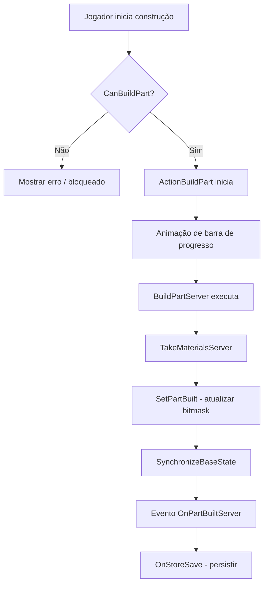

# Capítulo 6.17: Sistema de Construção

[Início](../../README.md) | [<< Anterior: Sistema de Crafting](16-crafting-system.md) | **Sistema de Construção** | [Próximo: Sistema de Animação >>](18-animation-system.md)

---

## Introdução

O sistema de construção de bases do DayZ permite que os jogadores construam fortificações --- cercas, torres de vigia e abrigos --- montando peças individuais usando ferramentas e materiais. Cada estrutura é dividida em partes de construção nomeadas (paredes, plataformas, telhados, portões) que são construídas, desmontadas ou destruídas independentemente.

O sistema reside principalmente em três arquivos:

- `4_World/entities/itembase/basebuildingbase.c` --- a classe base da entidade
- `4_World/classes/basebuilding/construction.c` --- o gerenciador de construção
- `4_World/classes/basebuilding/constructionpart.c` --- representação de parte individual

As ações de construção estão em `4_World/classes/useractionscomponent/actions/continuous/` e o gerenciamento de dados de construção é feito por `constructionactiondata.c`.

---

## Hierarquia de Classes

```
ItemBase
└── BaseBuildingBase                    // 4_World/entities/itembase/basebuildingbase.c
    ├── Fence                           // fence.c — portões, cadeados de combinação, arame farpado
    ├── Watchtower                      // watchtower.c — torre de múltiplos andares (3 níveis)
    └── ShelterSite                     // sheltersite.c — transforma-se em abrigo finalizado

TentBase
└── ShelterBase                         // shelter.c — abrigos finalizados (couro/tecido/galhos)
```

Classes de suporte:

```
Construction                            // Gerenciador: registro de partes, lógica de construir/desmontar/destruir
ConstructionPart                        // Seção construível individual com estado e dependências
ConstructionActionData                  // Ponte de dados do lado do cliente entre ações e partes
ConstructionBoxTrigger                  // Detecção de colisão durante a construção
StaticConstructionMethods               // Utilitário: gerar pilhas de material ao desmontar
```

`ShelterSite` estende `BaseBuildingBase` (o local de construção), enquanto abrigos finalizados estendem `TentBase` e substituem o local ao serem concluídos.

### Membros Principais de BaseBuildingBase

```
ref Construction    m_Construction;         // o gerenciador de construção
bool                m_HasBase;              // se a parte de fundação está construída
int                 m_SyncParts01;          // bitmask para partes 1-31
int                 m_SyncParts02;          // bitmask para partes 32-62
int                 m_SyncParts03;          // bitmask para partes 63-93
int                 m_InteractedPartId;     // última parte em que uma ação foi realizada
int                 m_PerformedActionId;    // último tipo de ação (construir/desmontar/destruir)
float               m_ConstructionKitHealth;// vida armazenada do kit de origem
```

Todas as variáveis de sincronização são registradas no construtor. `ConstructionInit()` cria o gerenciador `Construction`:

```
void ConstructionInit()
{
    if (!m_Construction)
        m_Construction = new Construction(this);
    GetConstruction().Init();
}

Construction GetConstruction()
{
    return m_Construction;
}
```

---

## Partes de Construção

Cada seção construível é uma `ConstructionPart` com os seguintes campos:

| Campo | Tipo | Descrição |
|-------|------|-----------|
| `m_Name` | `string` | Nome de exibição localizado |
| `m_Id` | `int` | ID único para sincronização por bitmask (1-93) |
| `m_PartName` | `string` | Nome de classe da config (ex.: `"wall_base_down"`) |
| `m_MainPartName` | `string` | Seção pai (ex.: `"wall"`) |
| `m_IsBuilt` | `bool` | Estado atual de construção |
| `m_IsBase` | `bool` | True = parte de fundação (destruí-la deleta a estrutura inteira) |
| `m_IsGate` | `bool` | True = funciona como portão abrível |
| `m_RequiredParts` | `array<string>` | Partes que devem ser construídas primeiro |

As partes são registradas a partir do `config.cpp` durante `Construction.Init()` via `UpdateConstructionParts()`, que lê `cfgVehicles <TypeName> Construction`. O sistema suporta até **93 partes** (3 inteiros de sincronização de 31 bits).

### Estrutura de Config Por Parte

```
Construction
  <main_part_name>               // ex.: "wall"
    <part_name>                  // ex.: "wall_base_down"
      name = "#str_...";        // nome localizado
      id = 1;                   // ID de sincronização único (1-93)
      is_base = 1;              // flag de fundação
      is_gate = 0;              // flag de portão
      show_on_init = 0;         // visibilidade inicial
      required_parts[] = {};    // partes pré-requisito
      conflicted_parts[] = {};  // partes mutuamente exclusivas
      build_action_type = 4;    // bitmask de ferramenta para construir
      dismantle_action_type = 4;// bitmask de ferramenta para desmontar
      material_type = 2;        // ConstructionMaterialType (determina o som)
      Materials { ... };        // materiais necessários
      collision_data[] = { "part_min", "part_max" };  // par de pontos de memória
```

Enum de tipo de material: `MATERIAL_NONE(0)`, `MATERIAL_LOG(1)`, `MATERIAL_WOOD(2)`, `MATERIAL_STAIRS(3)`, `MATERIAL_METAL(4)`, `MATERIAL_WIRE(5)`.

---

## Processo de Construção

### Fluxo do Processo



### Verificação de Elegibilidade

`Construction.CanBuildPart(string part_name, ItemBase tool, bool use_tool)` retorna verdadeiro somente quando TODAS as condições são atendidas:

1. A parte ainda não está construída (`!IsPartConstructed`)
2. Todas as partes pré-requisito estão construídas (`HasRequiredPart`)
3. Nenhuma parte conflitante está construída (`!HasConflictPart`)
4. Os materiais necessários estão anexados com quantidade suficiente (`HasMaterials`)
5. O `build_action_type` da ferramenta corresponde ao da parte via AND bit a bit (`CanUseToolToBuildPart`), ignorado se `use_tool` for falso
6. Nenhum material anexado está arruinado (`!MaterialIsRuined`)

A correspondência de ferramentas usa AND de bitmask: uma ferramenta com `build_action_type = 6` (110) pode construir partes que requerem tipo 2 (010) ou 4 (100).

### Verificação de Materiais

Cada entrada de material na config especifica `type`, `slot_name`, `quantity` e `lockable`. `HasMaterials()` verifica que cada slot possui um anexo com pelo menos a quantidade necessária. Para reparos, a quantidade é reduzida para 15% (`REPAIR_MATERIAL_PERCENTAGE = 0.15`), mínimo 1.

### Executando a Construção

```
void BuildPartServer(notnull Man player, string part_name, int action_id)
{
    // Resetar vida da zona de dano para o máximo
    GetParent().SetHealthMax(damage_zone);
    // Consumir/bloquear materiais
    TakeMaterialsServer(part_name);
    // Destruir trigger de verificação de colisão
    DestroyCollisionTrigger();
    // Notificar a entidade pai
    GetParent().OnPartBuiltServer(player, part_name, action_id);
}
```

`TakeMaterialsServer()` lida com três tipos de materiais:
- **Bloqueável** (ex.: arame farpado): o slot é bloqueado, o item permanece anexado mas não pode ser removido
- **Baseado em quantidade**: quantidade subtraída da pilha do anexo
- **Deletar** (quantidade = -1): o anexo inteiro é deletado

`OnPartBuiltServer()` então: registra o bit da parte, sincroniza com os clientes, atualiza visuais/física/navmesh e, se a parte `IsBase()`, marca o estado da base e gera um kit de construção.

### Sincronização

Os estados das partes sincronizam via três variáveis `int` de bitmask (`m_SyncParts01/02/03`). O servidor gerencia estas com:

```
void RegisterPartForSync(int part_id)    // define bit na variável de sync apropriada
void UnregisterPartForSync(int part_id)  // limpa bit
bool IsPartBuildInSyncData(int part_id)  // lê estado do bit
```

Após alterar bits, o servidor chama `SynchronizeBaseState()` que aciona `SetSynchDirty()`. No cliente, `OnVariablesSynchronized()` dispara `SetPartsFromSyncData()`, iterando todas as partes e atualizando estados de construção, visuais e física.

Constantes de tipo de ação (definidas em `_constants.c`):

| Constante | Valor | Propósito |
|-----------|-------|-----------|
| `AT_BUILD_PART` | 193 | Identificador de ação de construir |
| `AT_DISMANTLE_PART` | 195 | Identificador de ação de desmontar |
| `AT_DESTROY_PART` | 209 | Identificador de ação de destruir |

### Persistência

`BaseBuildingBase` salva o estado através da API de armazenamento padrão:

```
override void OnStoreSave(ParamsWriteContext ctx)
{
    super.OnStoreSave(ctx);
    ctx.Write(m_SyncParts01);
    ctx.Write(m_SyncParts02);
    ctx.Write(m_SyncParts03);
    ctx.Write(m_HasBase);
}
```

No carregamento, `AfterStoreLoad()` chama `SetPartsAfterStoreLoad()` que reconstrói todos os estados das partes a partir do bitmask, restaura a flag de estado da base e sincroniza.

---

## Desmontagem e Destruição

### Desmontagem (retorna materiais)

```
bool CanDismantlePart(string part_name, ItemBase tool)
    // A parte deve estar construída, não ter partes dependentes, e a ferramenta deve corresponder ao dismantle_action_type
```

`DismantlePartServer()` chama `ReceiveMaterialsServer()` que gera pilhas de materiais. O retorno de material é reduzido pelo nível de dano: `qty_coef = 1 - (healthLevel * 0.2) - 0.2`. Uma parte com saúde total retorna 80%; cada nível de dano custa mais 20%.

Desmontar a parte de base aciona `DestroyConstruction()` (deleta a entidade inteira) após um atraso de 200ms.

### Destruição (sem retorno de material)

```
bool CanDestroyPart(string part_name)
    // A parte deve estar construída e não ter partes dependentes (sem verificação de ferramenta)
```

`DestroyPartServer()` destrói materiais bloqueáveis (os deleta), solta anexos restantes, define a vida da zona de dano para zero e chama `DestroyConnectedParts()` que recursivamente destrói quaisquer partes construídas que dependem da parte destruída.

Exceção: partes de portão não são destruídas em cascata se `wall_base_down` ou `wall_base_up` ainda estiverem construídas.

---

## Ações de Construção

### ActionBuildPart

Ação contínua de corpo inteiro. Duração: `UATimeSpent.BASEBUILDING_CONSTRUCT_MEDIUM`. Requer ferramenta não arruinada na mão. Usa o **sistema de variantes** --- `ConstructionActionData.OnUpdateActions()` popula uma lista de partes construíveis para o componente alvo, e `m_VariantID` seleciona qual parte construir.

A animação varia por tipo de ferramenta:

| Ferramenta | Comando de Animação |
|------------|---------------------|
| Pickaxe, Shovel, FarmingHoe, FieldShovel | `CMD_ACTIONFB_DIG` |
| Pliers | `CMD_ACTIONFB_INTERACT` |
| SledgeHammer | `CMD_ACTIONFB_MINEROCK` |
| Todas as outras | `CMD_ACTIONFB_ASSEMBLE` |

Ao completar, chama `BuildPartServer()` e danifica a ferramenta (`UADamageApplied.BUILD`). Tanto `ActionConditionContinue()` quanto `OnFinishProgressServer()` realizam verificações de colisão via `IsCollidingEx()` para prevenir construção através de jogadores ou geometria.

### ActionDismantlePart

Ação contínua de corpo inteiro. Duração: `UATimeSpent.BASEBUILDING_DECONSTRUCT_SLOW`. Condições adicionais além de `CanDismantlePart()`:

- A parte não pode estar em um portão trancado (cadeado de combinação ou bandeira anexada)
- Partes de portão não podem ser desmontadas enquanto o portão está aberto
- Verificações de direção da câmera e posição do jogador previnem desmontagem do lado errado
- O jogador não pode estar deitado

Ao completar, chama `DismantlePartServer()` e danifica a ferramenta (`UADamageApplied.DISMANTLE`).

### ActionDestroyPart

Ação contínua de corpo inteiro usando `CAContinuousRepeat` com **4 ciclos** (`static int CYCLES = 4`). Cada ciclo remove 25% da vida máxima da parte via `AddHealth()`:

```
base_building.AddHealth(zone_name, "Health", -(base_building.GetMaxHealth(zone_name, "") / CYCLES));
if (base_building.GetHealth(zone_name, "Health") < 1)
    construction.DestroyPartServer(player, part_name, AT_DESTROY_PART);
```

Somente quando a vida cai abaixo de 1 é que `DestroyPartServer()` é executado. A ferramenta é danificada a cada ciclo (`UADamageApplied.DESTROY`). Partes sem zona de dano são destruídas imediatamente no primeiro ciclo.

### ActionBuildShelter

Ação contínua de interação sem ferramenta (`ContinuousInteractActionInput`) para `ShelterSite`. Três variantes: couro, tecido, galhos. Quando a construção é concluída, `ShelterSite.OnPartBuiltServer()` gera o objeto de abrigo finalizado correspondente (`ShelterLeather`, `ShelterFabric` ou `ShelterStick`) e deleta o local. As mãos do jogador ficam ocultas durante a ação.

### ConstructionActionData

Armazenado por jogador, esta classe faz a ponte entre a UI do cliente e a execução no servidor:

```
ref array<ConstructionPart>  m_BuildParts;          // partes construíveis com ferramenta
ref array<ConstructionPart>  m_BuildPartsNoTool;     // partes construíveis sem ferramenta (abrigos)
ref ConstructionPart         m_TargetPart;           // alvo para desmontar/destruir
```

O callback `OnUpdateActions()` é registrado com `ActionVariantManager` e dispara quando o jogador olha para um objeto de construção, populando a lista de partes construíveis para o sistema de variantes de ação.

---

## Criando Objetos Construíveis Personalizados

### 1. Classe da Entidade

```
class MyWall extends BaseBuildingBase
{
    override string GetConstructionKitType() { return "MyWallKit"; }
    override int GetMeleeTargetType() { return EMeleeTargetType.NONALIGNABLE; }
    override vector GetKitSpawnPosition()
    {
        if (MemoryPointExists("kit_spawn_position"))
            return ModelToWorld(GetMemoryPointPos("kit_spawn_position"));
        return GetPosition();
    }
}
```

### 2. config.cpp

Defina `Construction` com partes e materiais, `GUIInventoryAttachmentsProps` para slots de anexo de material e `DamageSystem` com zonas correspondentes aos nomes das partes:

```cpp
class CfgVehicles
{
    class BaseBuildingBase;
    class MyWall : BaseBuildingBase
    {
        scope = 2;
        displayName = "My Wall";
        model = "path\to\mywall.p3d";
        attachments[] = { "Material_WoodenLogs", "Material_WoodenPlanks", "Material_Nails" };

        class GUIInventoryAttachmentsProps
        {
            class base_mats
            {
                name = "Base";
                selection = "wall";
                attachmentSlots[] = { "Material_WoodenLogs" };
            };
        };

        class Construction
        {
            class wall
            {
                class wall_base
                {
                    name = "$STR_my_wall_base";
                    id = 1;
                    is_base = 1;
                    is_gate = 0;
                    show_on_init = 0;
                    required_parts[] = {};
                    conflicted_parts[] = {};
                    build_action_type = 1;
                    dismantle_action_type = 4;
                    material_type = 1;  // LOG
                    class Materials
                    {
                        class material_0
                        {
                            type = "WoodenLog";
                            slot_name = "Material_WoodenLogs";
                            quantity = 2;
                            lockable = 0;
                        };
                    };
                    collision_data[] = { "wall_base_min", "wall_base_max" };
                };
            };
        };

        class DamageSystem
        {
            class GlobalHealth { class Health { hitpoints = 1000; }; };
            class DamageZones
            {
                class wall_base  // deve corresponder ao part_name
                {
                    class Health { hitpoints = 500; transferToGlobalCoef = 0; };
                    componentNames[] = { "wall_base" };
                    fatalInjuryCoef = -1;
                };
            };
        };
    };
};
```

### 3. Requisitos do Modelo

O modelo p3d deve ter:
- **Seleções nomeadas** correspondentes a cada `part_name` (alternadas via `SetAnimationPhase`: 0=visível, 1=oculto)
- **Fontes de animação** para cada seleção (tipo `user`, intervalo 0-1)
- **Geometria de física por proxy** por parte (componentes de física nomeados separados)
- **Pontos de memória** `<part_name>_min` / `<part_name>_max` para caixas de colisão
- **Ponto de memória `kit_spawn_position`**
- **Nomes de componentes** no LOD de geometria correspondentes aos nomes das partes (para `GetActionComponentName()`)
- **Seleção `Deployed`** para o estado não construído

### 4. Kit de Construção

Crie um item de kit estendendo `KitBase` que os jogadores posicionam para gerar o local de construção.

---

## Visuais e Física

A visibilidade da construção é controlada através de **fases de animação** no modelo 3D. Cada nome de parte de construção corresponde a uma seleção nomeada:

```
// Mostrar uma parte (fase 0 = visível)
GetParent().SetAnimationPhase(part_name, 0);

// Ocultar uma parte (fase 1 = oculto)
GetParent().SetAnimationPhase(part_name, 1);
```

A física (geometria de colisão) usa física por proxy:

```
GetParent().AddProxyPhysics(part_name);     // habilitar colisão
GetParent().RemoveProxyPhysics(part_name);  // desabilitar colisão
```

A Watchtower sobrescreve `UpdateVisuals()` para lidar com seu sistema de múltiplos andares: a geometria de visualização do andar superior (`level_2`, `level_3`) só é mostrada quando o telhado abaixo está construído. A nomenclatura de paredes segue o padrão `level_N_wall_M` (3 paredes por andar, máximo de 3 andares).

---

## Objetos Construíveis Vanilla

### Fence (Cerca)

A estrutura mais comum. Kit: `FenceKit`. Possui um sistema de portão com três estados (`GATE_STATE_NONE`, `GATE_STATE_PARTIAL`, `GATE_STATE_FULL`). Um portão totalmente construído pode aceitar um anexo `CombinationLock`. Suporta arame farpado (2 slots criando dano de área quando montado) e rede de camuflagem. A abertura do portão rotaciona 100 graus em ~2 segundos.

### Watchtower (Torre de Vigia)

Torre de múltiplos níveis. Kit: `WatchtowerKit`. Até 3 andares com paredes e telhados por nível. Constantes: `MAX_WATCHTOWER_FLOORS = 3`, `MAX_WATCHTOWER_WALLS = 3`. Possui uma verificação `MAX_FLOOR_VERTICAL_DISTANCE = 0.5` que previne anexo de itens de muito abaixo do andar alvo.

### ShelterSite (Local de Abrigo)

Local de construção temporário. Kit: `ShelterKit`. Três opções de construção mutuamente exclusivas (couro, tecido, galhos) que cada uma gera uma subclasse diferente de `ShelterBase` finalizado e deleta o local. Construído sem ferramentas via `ActionBuildShelter`.

---

## Dano e Raiding

Cada parte de construção mapeia para uma **zona de dano** cujo nome corresponde ao nome da parte (sem distinção de maiúsculas/minúsculas). Quando uma parte é construída, sua vida é definida para o máximo. Quando uma zona de dano atinge `STATE_RUINED`, `EEHealthLevelChanged()` aciona destruição automática:

```
if (newLevel == GameConstants.STATE_RUINED)
{
    construction.DestroyPartServer(null, part_name, AT_DESTROY_PART);
    construction.DestroyConnectedParts(part_name);
}
```

Este é o mecanismo de raiding: explosivos e armas causam dano às zonas de dano até que atinjam o estado arruinado. Anexos de arame farpado têm tratamento especial --- quando sua zona está arruinada, o estado montado do arame é limpo.

Administradores do servidor podem tornar bases indestrutíveis via o tipo de invulnerabilidade `"disableBaseDamage"` no `cfgGameplay.json`.

O reparo usa `TakeMaterialsServer(part_name, true)`, exigindo apenas 15% dos materiais originais.

---

## Boas Práticas

1. **IDs de partes devem ser únicos** dentro de um objeto (intervalo 1-93). Lacunas são permitidas mas desperdiçam capacidade.
2. **Sempre defina pontos de memória `collision_data`** para prevenir construção através de geometria.
3. **Use `required_parts`** para impor ordem de construção (fundação antes das paredes).
4. **Use `conflicted_parts`** para opções mutuamente exclusivas (parede vs portão na mesma seção).
5. **Combine nomes de zonas de dano com nomes de partes** exatamente (sem distinção de maiúsculas/minúsculas) ou vida/dano não funcionarão.
6. **Habilite logging de debug** via `LogManager.IsBaseBuildingLogEnable()` para diagnóstico --- o código vanilla tem extenso output de debug com prefixo `[bsb]`.
7. **Mantenha-se abaixo de 93 partes** por objeto. Estruturas complexas devem ser divididas em múltiplos objetos posicionáveis.

---

## Observado em Mods Reais

- **DayZ Expansion** estende `BaseBuildingBase` com pisos, paredes e rampas personalizados usando dezenas de partes por objeto.
- **Mods de raid** sobrescrevem `EEHealthLevelChanged()` ou ajustam hitpoints de `DamageZones` para calibrar a dificuldade de raid.
- **Mods BuildAnywhere** sobrescrevem `IsCollidingEx()` para retornar `false`, desabilitando colisão de posicionamento.
- **Mods avançados de BB** usam `modded BaseBuildingBase` para injetar persistência personalizada, logging ou verificações anti-grief em eventos de construção/desmontagem.

---

## Erros Comuns

| Erro | Consequência | Correção |
|------|-------------|----------|
| ID da parte excede 93 | Estado nunca sincroniza/persiste | Mantenha IDs no intervalo 1-93 |
| Seleção de modelo ausente | Parte constrói mas fica invisível | Adicione seleção nomeada correspondendo ao `part_name` |
| Nome da zona de dano não corresponde | Vida nunca é definida, parte indanificável | Use nomes idênticos |
| Sem `required_parts` | Paredes construíveis sem fundação | Defina dependências |
| `GetConstructionKitType()` ausente | String vazia causa erros | Sobrescreva e retorne a classe do kit |
| Pontos de memória de colisão ausentes | Verificações de construção falham silenciosamente | Adicione pontos `_min` / `_max` |

---

## Compatibilidade e Impacto

O sistema de construção integra-se profundamente com: **inventário** (materiais como anexos), **dano** (zonas por parte), **ações** (contínuas + sistema de variantes), **navmesh** (atualizado após cada mudança), **persistência** (armazenamento por bitmask) e **sincronização de rede** (`RegisterNetSyncVariable`).

Mods devem usar a palavra-chave `modded` em `BaseBuildingBase` / `Construction` em vez de substituição completa. Tenha especial cuidado com o fluxo de sincronização --- modificar variáveis de bitmask ou `RegisterPartForSync` sem entender a cadeia completa causa dessincronização entre servidor e cliente.

---

*Arquivos-fonte principais: `basebuildingbase.c`, `construction.c`, `constructionpart.c`, `constructionactiondata.c`, `actionbuildpart.c`, `actiondismantlepart.c`, `actiondestroypart.c`, `actionbuildshelter.c`, `fence.c`, `watchtower.c`, `sheltersite.c`, `_constants.c`*
