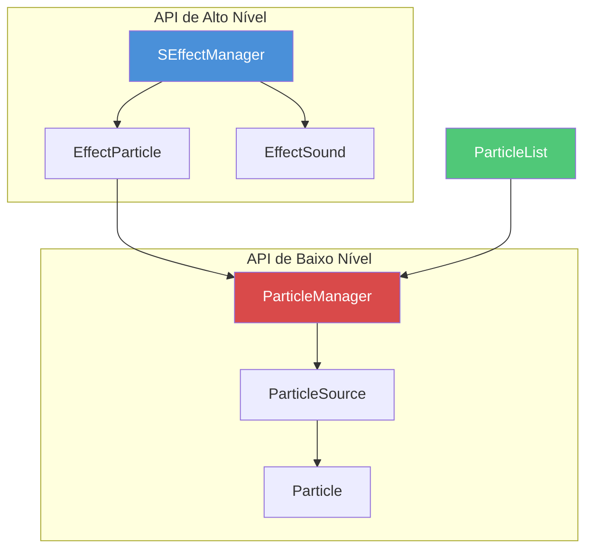

# Capítulo 6.20: Sistema de Partículas e Efeitos

[Início](../../README.md) | [<< Anterior: Consultas de Terreno e Mundo](19-terrain-queries.md) | **Sistema de Partículas e Efeitos** | [Próximo: Sistema de Zumbis e IA >>](21-zombie-ai-system.md)

---

## Introdução

O sistema de partículas e efeitos visuais do DayZ gerencia fogo, fumaça, sangue, explosões, efeitos climáticos, escapamento de veículos, gás de áreas contaminadas e muito mais. Cada efeito visual que você vê no mundo do jogo --- de uma fogueira a uma cratera de impacto de bala --- é controlado por este sistema.

Existem **duas camadas** para trabalhar com partículas via script:

1. **Baixo nível:** As classes `Particle` / `ParticleSource` e `ParticleManager` --- controle direto sobre objetos de partículas do motor.
2. **Alto nível:** O wrapper `EffectParticle` e `SEffectManager` --- efeitos com ciclo de vida gerenciado, com eventos, autodestruição e integração com o sistema unificado de efeitos (compartilhado com `EffectSound`).

Toda reprodução de partículas é **apenas no lado do cliente**. Servidores dedicados não possuem pipeline de renderização e não podem exibir partículas. Sempre proteja a criação de partículas com `!GetGame().IsDedicatedServer()` ou confie nas proteções integradas da API. O método `ParticleManager.GetInstance()` já retorna `null` em servidores dedicados.

Este capítulo cobre o pipeline completo de partículas: o registro `ParticleList`, ambas as abordagens de criação, o sistema `EmitorParam` para ajuste em tempo de execução, o wrapper `EffectParticle`, integração com `SEffectManager` e padrões do mundo real encontrados no código vanilla.

---

## Visão Geral da Arquitetura de Partículas

### Arquitetura do Sistema



### Pipeline Detalhado

```
ParticleList                                 Script (Alto Nível)
------------                                 --------------------
IDs int estáticos                            EffectParticle
  (CAMP_SMALL_FIRE,                              |
   BLEEDING_SOURCE,                              v
   GUN_FNX, etc.)                            SEffectManager
      |                                      PlayInWorld / PlayOnObject
      v                                          |
  RegisterParticle()                              |
  mapeia ID -> "graphics/particles/xxx"           |
      |                                           |
      +-------------------------------------------+
      |
      v
  ParticleManager (baseado em pool)     Particle (legado, por instância)
  CreateParticle / PlayOnObject         CreateOnObject / PlayInWorld
      |                                   |
      v                                   v
  ParticleSource (Entity)             Particle (Entity)
  (componente nativo de partículas)   (Object filho com vobject)
      |
      v
  arquivo .ptc (definição binária de partículas)
```

**Distinção principal:**

- **`Particle`** (legado) cria um `Object` filho separado para conter o efeito de partícula. Cada instância se registra em `EOnFrame` para rastrear o tempo de vida. Adequado para partículas simples e pouco frequentes.
- **`ParticleSource`** (moderno, via `ParticleManager`) é a própria entidade de partícula, com gerenciamento de ciclo de vida nativo em C++. Usa um pool pré-alocado de 10.000 slots. Preferido para todo código novo.

---

## ParticleList --- IDs de Partículas Integrados

Todas as partículas são registradas em `ParticleList` (`scripts/3_game/particles/particlelist.c`). Cada registro mapeia uma constante inteira para um caminho de arquivo `.ptc` em `graphics/particles/`.

### Mecanismo de Registro

```c
// Registro interno -- mapeia ID sequencial para caminho de arquivo
static int RegisterParticle(string file_name)
{
    return RegisterParticle(GetPathToParticles(), file_name);
    // GetPathToParticles() retorna "graphics/particles/"
    // Caminho completo se torna: "graphics/particles/<file_name>.ptc"
}
```

IDs são atribuídos sequencialmente começando em 1. `NONE = 0` e `INVALID = -1` são reservados.

### Categorias Comuns de IDs de Partículas

**Partículas de fogo:**

| Constante | Arquivo | Caso de Uso |
|----------|------|----------|
| `CAMP_FIRE_START` | `fire_small_camp_01_start` | Ignição de fogueira |
| `CAMP_SMALL_FIRE` | `fire_small_camp_01` | Chama pequena de fogueira |
| `CAMP_NORMAL_FIRE` | `fire_medium_camp_01` | Chama média de fogueira |
| `CAMP_STOVE_FIRE` | `fire_small_stove_01` | Chama de fogão |
| `TORCH_T1` / `T2` / `T3` | `fire_small_torch_0x` | Estados de chama de tocha |
| `BONFIRE_FIRE` | `fire_bonfire` | Fogueira grande |
| `TIREPILE_FIRE` | `fire_tirepile` | Pilha de pneus em chamas |

**Partículas de fumaça:**

| Constante | Arquivo | Caso de Uso |
|----------|------|----------|
| `CAMP_SMALL_SMOKE` | `smoke_small_camp_01` | Fumaça de fogueira (pequena) |
| `CAMP_NORMAL_SMOKE` | `smoke_medium_camp_01` | Fumaça de fogueira (média) |
| `SMOKING_HELI_WRECK` | `smoke_heli_wreck_01` | Local de queda de helicóptero |
| `SMOKE_GENERIC_WRECK` | `smoke_generic_wreck` | Fumaça genérica de destroços |
| `POWER_GENERATOR_SMOKE` | `smoke_small_generator_01` | Gerador em funcionamento |
| `SMOKING_BARREL` | `smoking_barrel` | Cano de arma quente |

**Sangue e efeitos de jogador:**

| Constante | Arquivo | Caso de Uso |
|----------|------|----------|
| `BLEEDING_SOURCE` | `blood_bleeding_01` | Ferimento com sangramento ativo |
| `BLEEDING_SOURCE_LIGHT` | `blood_bleeding_02` | Ferimento com sangramento leve |
| `BLOOD_SURFACE_DROPS` | `blood_surface_drops` | Sangue pingando no chão |
| `BLOOD_SURFACE_CHUNKS` | `blood_surface_chunks` | Pedaços de sangue espalhados |
| `VOMIT` | `character_vomit_01` | Personagem vomitando |
| `BREATH_VAPOUR_LIGHT` | `breath_vapour_light` | Respiração fria (leve) |
| `BREATH_VAPOUR_HEAVY` | `breath_vapour_heavy` | Respiração fria (pesada) |

**Efeitos de cozimento:**

| Constante | Arquivo | Caso de Uso |
|----------|------|----------|
| `COOKING_BOILING_START` | `cooking_boiling_start` | Água começando a ferver |
| `COOKING_BOILING_DONE` | `cooking_boiling_done` | Fervura completa |
| `COOKING_BAKING_START` | `cooking_baking_start` | Vapor de alimento assando |
| `COOKING_BURNING_DONE` | `cooking_burning_done` | Fumaça de alimento queimado |
| `ITEM_HOT_VAPOR` | `item_hot_vapor` | Vapor de itens quentes |

**Efeitos de armas:**

| Constante | Arquivo | Caso de Uso |
|----------|------|----------|
| `GUN_FNX` | `weapon_shot_fnx_01` | Flash de boca da FNX |
| `GUN_AKM` | `weapon_shot_akm_01` | Flash de boca da AKM |
| `GUN_M4A1` | `weapon_shot_m4a1_01` | Flash de boca da M4A1 |
| `GUN_PARTICLE_CASING` | `weapon_shot_chamber_smoke` | Fumaça da câmara após o tiro |
| `GUN_PELLETS` | `weapon_shot_pellets` | Dispersão de chumbos de espingarda |

**Impactos de bala (por material):**

| Padrão | Exemplo | Descrição |
|---------|---------|-------------|
| `IMPACT_<MATERIAL>_ENTER` | `IMPACT_WOOD_ENTER` | Entrada de bala na superfície |
| `IMPACT_<MATERIAL>_RICOCHET` | `IMPACT_METAL_RICOCHET` | Deflexão da bala |
| `IMPACT_<MATERIAL>_EXIT` | `IMPACT_CONCRETE_EXIT` | Saída de bala da superfície |

Os materiais incluem: `WOOD`, `CONCRETE`, `DIRT`, `METAL`, `GLASS`, `SAND`, `SNOW`, `ICE`, `MEAT`, `WATER` (pequeno/médio/grande), entre outros.

**Explosões e granadas:**

| Constante | Descrição |
|----------|-------------|
| `RGD5`, `M67` | Explosões de granada de fragmentação |
| `EXPLOSION_LANDMINE` | Detonação de mina terrestre |
| `CLAYMORE_EXPLOSION` | Mina direcional |
| `GRENADE_M18_<COLOR>_START/LOOP/END` | Ciclo de vida de granada de fumaça (6 cores) |
| `GRENADE_RDG2_BLACK/WHITE_START/LOOP/END` | Granada de fumaça russa |

**Veículos:**

| Constante | Descrição |
|----------|-------------|
| `HATCHBACK_EXHAUST_SMOKE` | Escapamento de veículo |
| `HATCHBACK_COOLANT_OVERHEATING` | Vapor de aviso do motor |
| `HATCHBACK_ENGINE_OVERHEATED` | Fumaça de falha do motor |
| `BOAT_WATER_FRONT` / `BACK` / `SIDE` | Efeitos de esteira de barco |

**Ambiente:**

| Constante | Descrição |
|----------|-------------|
| `CONTAMINATED_AREA_GAS_BIGASS` | Gás de grande zona contaminada |
| `ENV_SWARMING_FLIES` | Moscas ao redor de cadáveres |
| `SPOOKY_MIST` | Névoa atmosférica |
| `STEP_SNOW` / `STEP_DESERT` | Partículas de pegadas |
| `HOTPSRING_WATERVAPOR` | Vapor de fonte termal |
| `GEYSER_NORMAL` / `GEYSER_STRONG` | Erupção de gêiser |

---

## Reproduzindo Partículas --- API Direta

### Método 1: ParticleManager (Recomendado)

`ParticleManager` usa um pool pré-alocado de entidades `ParticleSource`. Isso evita a sobrecarga de criar e destruir objetos em tempo de execução.

```c
// Obter o singleton global de ParticleManager (retorna null no servidor)
ParticleManager pm = ParticleManager.GetInstance();
if (!pm)
    return;

// Reproduzir uma partícula vinculada a um objeto
ParticleSource p = pm.PlayOnObject(
    ParticleList.CAMP_SMALL_FIRE,   // ID da partícula
    myObject,                        // entidade pai
    "0 0.5 0",                       // deslocamento local da origem do pai
    "0 0 0",                         // orientação local (yaw, pitch, roll)
    false                            // forçar rotação no espaço mundo
);

// Reproduzir uma partícula em uma posição do mundo (sem pai)
ParticleSource p2 = pm.PlayInWorld(
    ParticleList.SMOKE_GENERIC_WRECK,
    worldPosition
);

// Variante estendida com pai para partículas em posição do mundo
ParticleSource p3 = pm.PlayInWorldEx(
    ParticleList.EXPLOSION_LANDMINE,
    parentObj,              // pai opcional
    worldPosition,
    "0 0 0",                // orientação
    true                     // forçar rotação no mundo
);
```

**Criar sem reproduzir** (ativação adiada):

```c
// Criar mas não reproduzir ainda
ParticleSource p = pm.CreateOnObject(
    ParticleList.POWER_GENERATOR_SMOKE,
    generatorObj,
    "0 1.2 0"
);

// ... mais tarde, iniciar
p.PlayParticle();
```

**Criação em lote** (múltiplas partículas de uma vez):

```c
array<ParticleSource> results = new array<ParticleSource>;
ParticleProperties props = new ParticleProperties(
    worldPos,
    ParticlePropertiesFlags.PLAY_ON_CREATION,
    null,         // sem pai
    vector.Zero,  // orientação
    this          // proprietário (previne reutilização do pool enquanto vivo)
);

pm.CreateParticles(results, "graphics/particles/debug_dot.ptc", {props}, 10);
```

### Método 2: Métodos Estáticos de Particle (Legado)

A classe legada `Particle` cria instâncias de entidade individuais. Ainda funcional, mas menos eficiente para grande quantidade de partículas.

```c
// Criar e reproduzir em um objeto (uma linha)
Particle p = Particle.PlayOnObject(
    ParticleList.BLEEDING_SOURCE,
    playerObj,
    "0 0.8 0",   // posição local
    "0 0 0",      // orientação local
    true          // forçar rotação no mundo
);

// Criar e reproduzir em posição do mundo
Particle p2 = Particle.PlayInWorld(
    ParticleList.EXPLOSION_LANDMINE,
    explosionPos
);

// Criar sem reproduzir
Particle p3 = Particle.CreateOnObject(
    ParticleList.CAMP_SMALL_SMOKE,
    campfireObj,
    "0 0.5 0"
);
// ... mais tarde
p3.PlayParticle();
```

---

## Parando e Controlando Partículas

### Parando

```c
// Fade gradual (padrão) -- partícula para de emitir, partículas existentes terminam
p.StopParticle();

// Atalho legado
p.Stop();

// ParticleSource: Parada imediata (congela e oculta)
p.StopParticle(StopParticleFlags.IMMEDIATE);

// ParticleSource: Pausar (congelar mas manter visível)
p.StopParticle(StopParticleFlags.PAUSE);

// ParticleSource: Parar e resetar para estado inicial
p.StopParticle(StopParticleFlags.RESET);
```

### Comportamento de Auto-Destruição

`ParticleSource` se auto-destrói por padrão quando a partícula termina ou para:

```c
// Verificar flags atuais
int flags = p.GetParticleAutoDestroyFlags();

// Desabilitar auto-destruição (manter a partícula para reutilização)
p.DisableAutoDestroy();
// ou
p.SetParticleAutoDestroyFlags(ParticleAutoDestroyFlags.NONE);

// Destruir apenas no fim natural (não na parada manual)
p.SetParticleAutoDestroyFlags(ParticleAutoDestroyFlags.ON_END);

// Destruir tanto no fim quanto na parada (padrão)
p.SetParticleAutoDestroyFlags(ParticleAutoDestroyFlags.ALL);
```

**Importante:** Partículas pertencentes a um pool de `ParticleManager` ignoram flags de auto-destruição --- o pool gerencia seu ciclo de vida.

### Reset e Reiniciar (Apenas ParticleSource)

```c
// Resetar para estado inicial (limpa todas as partículas, reseta timer)
p.ResetParticle();

// Reiniciar = resetar + reproduzir
p.RestartParticle();
```

### Consultas de Estado

```c
// A partícula está sendo reproduzida atualmente?
bool playing = p.IsParticlePlaying();

// Ela tem alguma partícula ativa (visível) agora?
bool active = p.HasActiveParticle();

// Contagem total de partículas ativas em todos os emissores
int count = p.GetParticleCount();

// Algum emissor está configurado para repetir?
bool loops = p.IsRepeat();

// Tempo de vida máximo aproximado em segundos
float maxLife = p.GetMaxLifetime();
```

### Vinculando e Desvinculando

```c
// Vincular a uma entidade pai
p.AddAsChild(parentObj, "0 1 0", "0 0 0", false);

// Desvincular do pai (passar null)
p.AddAsChild(null);

// Obter pai atual
Object parent = p.GetParticleParent();
```

---

## EmitorParam --- Ajuste de Parâmetros em Tempo de Execução

Cada efeito de partícula contém um ou mais **emissores** (também grafados "emitors" na API). Cada emissor possui parâmetros ajustáveis definidos pelo enum `EmitorParam`.

### Valores de EmitorParam

| Parâmetro | Tipo | Descrição |
|-----------|------|-------------|
| `CONEANGLE` | vector | Ângulo do cone de emissão |
| `EMITOFFSET` | vector | Deslocamento de emissão da origem |
| `VELOCITY` | float | Velocidade base da partícula |
| `VELOCITY_RND` | float | Variação aleatória de velocidade |
| `AVELOCITY` | float | Velocidade angular |
| `SIZE` | float | Tamanho da partícula |
| `STRETCH` | float | Fator de alongamento da partícula |
| `RANDOM_ANGLE` | bool | Começar com rotação aleatória |
| `RANDOM_ROT` | bool | Rotacionar em direção aleatória |
| `AIR_RESISTANCE` | float | Fator de arrasto do ar |
| `AIR_RESISTANCE_RND` | float | Variação aleatória de arrasto do ar |
| `GRAVITY_SCALE` | float | Multiplicador de gravidade |
| `GRAVITY_SCALE_RND` | float | Variação aleatória de gravidade |
| `BIRTH_RATE` | float | Taxa de geração de partículas |
| `BIRTH_RATE_RND` | float | Variação aleatória da taxa de geração |
| `LIFETIME` | float | Duração ativa do emissor |
| `LIFETIME_RND` | float | Variação aleatória do tempo de vida |
| `LIFETIME_BY_ANIM` | bool | Vincular tempo de vida à animação |
| `ANIM_ONCE` | bool | Reproduzir animação uma vez |
| `RAND_FRAME` | bool | Começar em frame aleatório |
| `EFFECT_TIME` | float | Tempo total de efeito para o emissor |
| `REPEAT` | bool | Repetir o emissor em loop |
| `CURRENT_TIME` | float | Tempo atual do emissor (leitura) |
| `ACTIVE_PARTICLES` | int | Contagem de partículas ativas (somente leitura) |
| `SORT` | bool | Ordenar partículas por distância |
| `WIND` | bool | Afetado pelo vento |
| `SPRING` | float | Força de mola |

### Definindo Parâmetros

```c
// Definir um parâmetro em TODOS os emissores (-1 = todos)
p.SetParameter(-1, EmitorParam.LIFETIME, 5.0);

// Definir um parâmetro em um emissor específico (índice 0)
p.SetParameter(0, EmitorParam.BIRTH_RATE, 20.0);

// Atalho: definir em todos os emissores
p.SetParticleParam(EmitorParam.SIZE, 2.0);
```

### Obtendo Parâmetros

```c
// Obter valor atual
float value;
p.GetParameter(0, EmitorParam.VELOCITY, value);

// Obter valor atual (variante de retorno)
float vel = p.GetParameterEx(0, EmitorParam.VELOCITY);

// Obter valor ORIGINAL (antes de quaisquer mudanças em tempo de execução)
float origVel = p.GetParameterOriginal(0, EmitorParam.VELOCITY);
```

### Escalonamento e Incremento

```c
// Escalar em relação ao valor ORIGINAL (multiplicativo)
p.ScaleParticleParamFromOriginal(EmitorParam.SIZE, 2.0);   // dobrar tamanho original

// Escalar em relação ao valor ATUAL
p.ScaleParticleParam(EmitorParam.BIRTH_RATE, 0.5);         // reduzir taxa atual pela metade

// Incrementar a partir do valor ORIGINAL (aditivo)
p.IncrementParticleParamFromOriginal(EmitorParam.VELOCITY, 5.0);  // adicionar 5 ao original

// Incrementar a partir do valor ATUAL
p.IncrementParticleParam(EmitorParam.GRAVITY_SCALE, -0.5);  // reduzir gravidade atual
```

### Funções de Baixo Nível do Motor

Essas são as funções proto brutas que todos os métodos acima chamam internamente:

```c
// Obter contagem de emissores
int count = GetParticleEmitorCount(entityWithParticle);

// Definir/Obter parâmetros diretamente
SetParticleParm(entity, emitterIndex, EmitorParam.SIZE, 3.0);
GetParticleParm(entity, emitterIndex, EmitorParam.SIZE, outValue);
GetParticleParmOriginal(entity, emitterIndex, EmitorParam.SIZE, outValue);

// Forçar atualização da posição da partícula (evita rastro ao teleportar)
ResetParticlePosition(entity);
```

---

## API de Wiggle

A API de Wiggle faz uma partícula mudar aleatoriamente de orientação em intervalos, útil para efeitos como chamas tremeluzentes ou fumaça oscilante.

```c
// Iniciar wiggle: faixa de ângulo aleatório, faixa de intervalo aleatório
p.SetWiggle(15.0, 0.5);
// A orientação mudará em [-15, 15] graus a cada [0, 0.5] segundos

// Verificar se está fazendo wiggle
bool wiggling = p.IsWiggling();

// Parar wiggle (restaura orientação original)
p.StopWiggle();
```

**Nota:** No `Particle` legado, wiggle só funciona quando a partícula tem um pai. No `ParticleSource`, funciona em todos os casos.

---

## EffectParticle --- Wrapper de Alto Nível

`EffectParticle` estende a classe base `Effect` para fornecer um ciclo de vida gerenciado para partículas, integrado com `SEffectManager`. Ele encapsula um `Particle` ou `ParticleSource` internamente.

### Hierarquia de Classes

```
Effect (base)
  |
  +-- EffectParticle (efeitos visuais de partículas)
  |     |
  |     +-- BleedingSourceEffect
  |     +-- BloodSplatter
  |     +-- EffVehicleSmoke
  |     +-- EffGeneratorSmoke
  |     +-- EffVomit / EffVomitBlood
  |     +-- EffBulletImpactBase
  |     +-- EffSwarmingFlies
  |     +-- EffBreathVapourLight / Medium / Heavy
  |     +-- EffWheelSmoke
  |     +-- EffectParticleGeneral (ID dinâmico)
  |     +-- (sua subclasse customizada)
  |
  +-- EffectSound (efeitos sonoros --- veja Capítulo 6.15)
```

### Criando Subclasses Customizadas de EffectParticle

```c
class MyCustomSmoke : EffectParticle
{
    void MyCustomSmoke()
    {
        // Definir o ID da partícula no construtor
        SetParticleID(ParticleList.SMOKE_GENERIC_WRECK);
    }
}
```

**Exemplo multi-estado** (do vanilla `EffVehicleSmoke`):

```c
class EffVehicleSmoke : EffectParticle
{
    void EffVehicleSmoke()
    {
        SetParticleStateLight();
    }

    void SetParticleStateLight()
    {
        SetParticleState(ParticleList.HATCHBACK_COOLANT_OVERHEATING);
    }

    void SetParticleStateHeavy()
    {
        SetParticleState(ParticleList.HATCHBACK_COOLANT_OVERHEATED);
    }

    void SetParticleState(int state)
    {
        bool was_playing = IsPlaying();
        Stop();
        SetParticleID(state);
        if (was_playing)
        {
            Start();
        }
    }
}
```

### Reproduzindo EffectParticle via SEffectManager

```c
// Reproduzir em uma posição do mundo
EffectParticle eff = new MyCustomSmoke();
int effectID = SEffectManager.PlayInWorld(eff, worldPos);

// Reproduzir vinculado a um objeto
EffectParticle eff2 = new EffGeneratorSmoke();
int effectID2 = SEffectManager.PlayOnObject(eff2, generatorObj, "0 1.2 0");
```

### Ciclo de Vida do EffectParticle

Quando `Start()` é chamado em um `EffectParticle`:

1. Se `m_ParticleID > 0`, ele cria uma partícula via `ParticleManager.GetInstance().CreateParticle()`.
2. A partícula é vinculada ao pai (se houver) com a posição e orientação em cache.
3. O invocador `Event_OnStarted` é disparado.
4. Se nenhuma partícula foi criada (ex.: ID inválido), `ValidateStart()` chama `Stop()`.

Quando `Stop()` é chamado:

1. O `Particle` gerenciado é parado e liberado (`SetParticle(null)`).
2. O invocador `Event_OnStopped` é disparado.
3. Se `IsAutodestroy()` for true, o Effect se enfileira para exclusão.

### Vinculando EffectParticle a Objetos

```c
EffectParticle eff = new BleedingSourceEffect();

// Método 1: Definir pai antes de Start
eff.SetParent(playerObj);
eff.SetLocalPosition("0 0.8 0");
eff.SetAttachedLocalOri("0 0 0");
eff.Start();

// Método 2: Usar AttachTo após criação
eff.AttachTo(playerObj, "0 0.8 0", "0 0 0", false);

// Método 3: Usar SEffectManager.PlayOnObject (gerencia tudo)
SEffectManager.PlayOnObject(eff, playerObj, "0 0.8 0");
```

### Limpeza

Sempre limpe os efeitos para prevenir vazamentos de memória:

```c
// Opção 1: Definir autodestruição (efeito se limpa quando parado)
eff.SetAutodestroy(true);

// Opção 2: Destruição manual
SEffectManager.DestroyEffect(eff);

// Opção 3: Parar pelo ID registrado
SEffectManager.Stop(effectID);
```

---

## SEffectManager --- Gerenciador Unificado de Efeitos

`SEffectManager` é um gerenciador estático que lida tanto com `EffectParticle` quanto com `EffectSound`. Ele mantém um registro de todos os efeitos ativos com IDs inteiros.

### Métodos Principais para Partículas

| Método | Retorna | Descrição |
|--------|---------|-------------|
| `PlayInWorld(eff, pos)` | `int` | Registrar e reproduzir Effect em posição do mundo |
| `PlayOnObject(eff, obj, pos, ori)` | `int` | Registrar e reproduzir Effect em objeto pai |
| `Stop(effectID)` | void | Parar Effect pelo ID |
| `DestroyEffect(eff)` | void | Parar, desregistrar e excluir |
| `IsEffectExist(effectID)` | `bool` | Verificar se o ID está registrado |
| `GetEffectByID(effectID)` | `Effect` | Recuperar Effect pelo ID |

### Registro

Todo Effect reproduzido via `SEffectManager` é automaticamente registrado e recebe um ID inteiro. O gerenciador mantém um `ref` para o Effect, prevenindo coleta de lixo.

```c
// SEffectManager mantém uma ref forte -- deve desregistrar para permitir limpeza
int id = SEffectManager.PlayInWorld(eff, pos);

// Mais tarde, para limpar completamente:
SEffectManager.DestroyEffect(eff);
// ou
SEffectManager.EffectUnregister(id);
```

### Effecters de Partículas no Lado do Servidor

`SEffectManager` também fornece um mecanismo no lado do servidor para efeitos de partículas sincronizados via `EffecterBase` / `ParticleEffecter`. Estes usam sincronização de rede para replicar o estado da partícula:

```c
// Lado do servidor: criar um effecter de partícula sincronizado
ParticleEffecterParameters params = new ParticleEffecterParameters(
    "ParticleEffecter",                     // tipo do effecter
    30.0,                                    // tempo de vida em segundos
    ParticleList.CONTAMINATED_AREA_GAS_BIGASS // ID da partícula
);
int effecterID = SEffectManager.CreateParticleServer(worldPos, params);

// Controlar o effecter
SEffectManager.StartParticleServer(effecterID);
SEffectManager.StopParticleServer(effecterID);
SEffectManager.DestroyEffecterParticleServer(effecterID);
```

---

## ParticleProperties e Flags

Ao usar `ParticleManager`, o comportamento da partícula é configurado através de `ParticleProperties`:

```c
ParticleProperties props = new ParticleProperties(
    localPos,                              // posição (local se pai, mundo se sem pai)
    ParticlePropertiesFlags.PLAY_ON_CREATION,  // flags
    parentObj,                              // pai (opcional, null para mundo)
    localOri,                               // orientação (opcional)
    ownerInstance                            // instância proprietária (opcional)
);
```

### ParticlePropertiesFlags

| Flag | Descrição |
|------|-------------|
| `NONE` | Padrão, sem comportamento especial |
| `PLAY_ON_CREATION` | Iniciar reprodução imediatamente quando criada |
| `FORCE_WORLD_ROT` | Orientação permanece no espaço mundo mesmo com pai |
| `KEEP_PARENT_ON_END` | Não desvincular do pai quando a partícula terminar |

---

## Padrões Comuns de Partículas

### Efeito de Fogueira / Lareira

```c
class MyFireplace
{
    protected Particle m_FireParticle;
    protected Particle m_SmokeParticle;

    void StartFire()
    {
        if (GetGame().IsDedicatedServer())
            return;

        ParticleManager pm = ParticleManager.GetInstance();
        if (!pm)
            return;

        // Reproduzir fogo em um ponto de memória
        m_FireParticle = pm.PlayOnObject(
            ParticleList.CAMP_SMALL_FIRE,
            this,
            GetMemoryPointPos("fire_point"),
            vector.Zero,
            true  // rotação no mundo
        );

        // Reproduzir fumaça ligeiramente acima do fogo
        m_SmokeParticle = pm.PlayOnObject(
            ParticleList.CAMP_SMALL_SMOKE,
            this,
            GetMemoryPointPos("smoke_point"),
            vector.Zero,
            true
        );
    }

    void StopFire()
    {
        if (m_FireParticle)
            m_FireParticle.StopParticle();

        if (m_SmokeParticle)
            m_SmokeParticle.StopParticle();
    }
}
```

### Respingo de Sangue ao Ser Atingido

```c
void OnPlayerHit(vector hitPosition)
{
    BloodSplatter eff = new BloodSplatter();  // estende EffectParticle
    eff.SetAutodestroy(true);
    SEffectManager.PlayInWorld(eff, hitPosition);
}
```

### Fonte de Sangramento Vinculada ao Jogador

```c
class BleedingSourceEffect : EffectParticle
{
    void BleedingSourceEffect()
    {
        SetParticleID(ParticleList.BLEEDING_SOURCE);
    }
}

// Uso
BleedingSourceEffect eff = new BleedingSourceEffect();
SEffectManager.PlayOnObject(eff, playerObj, boneOffset);
```

### Escapamento de Veículo

```c
// Do CarScript vanilla (simplificado)
protected ref EffVehicleSmoke m_exhaustFx;
protected int m_exhaustPtcFx;

void UpdateExhaust()
{
    if (!m_exhaustFx)
    {
        m_exhaustFx = new EffExhaustSmoke();
        m_exhaustPtcFx = SEffectManager.PlayOnObject(
            m_exhaustFx, this, m_exhaustPtcPos, m_exhaustPtcDir
        );
        m_exhaustFx.SetParticleStateLight();
    }
}

void CleanupExhaust()
{
    SEffectManager.DestroyEffect(m_exhaustFx);
}
```

### Fumaça de Destroços de Helicóptero (Efeito Estático do Mundo)

```c
// Do vanilla wreck_uh1y.c
class Wreck_UH1Y extends Wreck
{
    protected Particle m_ParticleEfx;

    override void EEInit()
    {
        super.EEInit();
        if (!GetGame().IsDedicatedServer())
        {
            m_ParticleEfx = ParticleManager.GetInstance().PlayOnObject(
                ParticleList.SMOKING_HELI_WRECK,
                this,
                Vector(-0.5, 0, -1.0)
            );
        }
    }
}
```

### Geração de Partículas em Área Contaminada

A classe `EffectArea` gera partículas em anéis concêntricos para preencher uma zona contaminada:

```c
// IDs de partículas do config
int m_ParticleID       = ParticleList.CONTAMINATED_AREA_GAS_BIGASS;
int m_AroundParticleID = ParticleList.CONTAMINATED_AREA_GAS_AROUND;
int m_TinyParticleID   = ParticleList.CONTAMINATED_AREA_GAS_TINY;

// Partículas são armazenadas em um array para gerenciamento em lote
ref array<Particle> m_ToxicClouds;
```

---

## Registrando Partículas Customizadas de Mods

Para adicionar partículas customizadas do seu mod, use uma `modded class` em `ParticleList`:

```c
modded class ParticleList
{
    // Registrar com um caminho de subpasta em graphics/particles/
    static const int MY_MOD_CUSTOM_SMOKE = RegisterParticle("mymod/custom_smoke");

    // Ou com um caminho raiz explícito
    static const int MY_MOD_MAGIC_FX = RegisterParticle("mymod/particles/", "magic_fx");
}
```

O arquivo de partícula deve existir em:
```
graphics/particles/mymod/custom_smoke.ptc
```

### Formato de Arquivo de Partículas

Arquivos `.ptc` são definições binárias de partículas criadas com o **Editor de Partículas do Enfusion Workbench**. Eles definem emissores, texturas, modos de mesclagem, velocidades, cores e todas as propriedades visuais. Esses arquivos não podem ser criados apenas por script --- eles requerem a cadeia de ferramentas.

### Métodos de Consulta

```c
// Obter caminho a partir do ID
string path = ParticleList.GetParticlePath(particleID);       // sem .ptc
string fullPath = ParticleList.GetParticleFullPath(particleID); // com .ptc

// Obter ID a partir do caminho (sem .ptc, sem raiz)
int id = ParticleList.GetParticleID("graphics/particles/mymod/custom_smoke");

// Obter ID apenas pelo nome do arquivo (deve ser único entre todos os mods)
int id2 = ParticleList.GetParticleIDByName("custom_smoke");

// Validar um ID
bool valid = ParticleList.IsValidId(id);  // não NONE e não INVALID
```

---

## Eventos de ParticleBase

Tanto `Particle` quanto `ParticleSource` herdam de `ParticleBase`, que fornece um sistema de eventos via `ParticleEvents`:

```c
ParticleEvents events = myParticle.GetEvents();

// Inscrever-se em eventos do ciclo de vida
events.Event_OnParticleStart.Insert(OnMyParticleStarted);
events.Event_OnParticleStop.Insert(OnMyParticleStopped);
events.Event_OnParticleEnd.Insert(OnMyParticleEnded);
events.Event_OnParticleReset.Insert(OnMyParticleReset);

// Apenas ParticleSource:
events.Event_OnParticleParented.Insert(OnParented);
events.Event_OnParticleUnParented.Insert(OnOrphaned);

// Assinatura do handler de evento
void OnMyParticleStarted(ParticleBase particle)
{
    // partícula começou a reproduzir
}
```

**Diferença entre Stop e End:**
- `OnParticleStop` dispara quando `StopParticle()` é chamado ou a partícula termina naturalmente.
- `OnParticleEnd` dispara apenas quando a partícula termina completamente (não restam partículas ativas). Partículas em loop nunca disparam isso naturalmente.

---

## Observado em Mods Reais

Padrões vistos no DayZ vanilla e mods da comunidade:

1. **ParticleManager é dominante.** Quase todo código vanilla 4_World usa `ParticleManager.GetInstance().PlayOnObject()/PlayInWorld()` em vez de `Particle.PlayOnObject()`. A abordagem baseada em pool é o padrão.

2. **Subclasses de EffectParticle são finas.** A maioria das subclasses consiste em um construtor que chama `SetParticleID()` e nada mais. Comportamento complexo (mudanças de estado, ajuste de parâmetros) acontece na classe proprietária, não no efeito.

3. **Efeitos de veículos usam SEffectManager.** Carros e barcos reproduzem partículas através de `SEffectManager.PlayOnObject()` com subclasses de `EffectParticle`, armazenando tanto a ref do efeito quanto o ID retornado.

4. **Limpeza é explícita.** Código vanilla sempre chama `SEffectManager.DestroyEffect()` em destrutores e métodos de limpeza. Depender apenas de autodestruição é raro em efeitos pertencentes a entidades.

5. **Pontos de memória para vinculação.** Partículas de objetos são quase sempre posicionadas em pontos de memória nomeados (`GetMemoryPointPos("fire_point")`) em vez de offsets fixos.

---

## Teoria vs Prática

| O que a API Sugere | O que Realmente Funciona |
|----------------------|-------------------|
| `Particle.CreateOnObject()` e `ParticleManager.CreateOnObject()` ambos existem | A versão do `ParticleManager` é preferida; a versão legada de `Particle` cria entidades por instância |
| `ParticleAutoDestroyFlags` controla o tempo de vida da partícula | Ignorado para partículas gerenciadas por um pool de `ParticleManager` --- o pool gerencia o ciclo de vida |
| `ResetParticle()` e `RestartParticle()` estão em `ParticleBase` | Só funciona em `ParticleSource`, o `Particle` base lança erros "Not implemented" |
| `EffectParticle.ForceParticleRotationRelativeToWorld()` pode ser chamado a qualquer momento | Só tem efeito na próxima chamada de `Start()`, não pode atualizar ao vivo uma partícula ativa |
| `SetSource()` pode mudar o ID da partícula em tempo de execução | No `Particle` legado, isso só tem efeito após parar e reproduzir novamente; `ParticleSource` atualiza imediatamente |

---

## Erros Comuns

### 1. Criando Partículas em Servidor Dedicado

```c
// ERRADO: Isso desperdiça recursos e ParticleManager.GetInstance() retorna null
Particle p = ParticleManager.GetInstance().PlayInWorld(ParticleList.CAMP_SMALL_FIRE, pos);

// CORRETO: Proteger com verificação de servidor
if (!GetGame().IsDedicatedServer())
{
    ParticleManager pm = ParticleManager.GetInstance();
    if (pm)
    {
        Particle p = pm.PlayInWorld(ParticleList.CAMP_SMALL_FIRE, pos);
    }
}
```

### 2. Esquecendo de Parar Partículas em Loop

Partículas em loop (onde `REPEAT = true` na definição .ptc) nunca terminam por conta própria. Se a entidade proprietária for excluída sem pará-las, elas persistem como efeitos órfãos.

```c
// ERRADO: Sem limpeza
void ~MyEntity()
{
    // partícula continua reproduzindo para sempre
}

// CORRETO: Parar no destrutor
void ~MyEntity()
{
    if (m_MyParticle)
        m_MyParticle.StopParticle();
}
```

### 3. Não Destruindo Referências de EffectParticle

`SEffectManager` mantém um `ref` forte para cada Effect registrado. Se você não desregistrar ou destruí-lo, o efeito e sua partícula associada permanecem na memória.

```c
// ERRADO: Vazamento
EffectParticle eff = new MySmoke();
SEffectManager.PlayInWorld(eff, pos);
eff = null;  // SEffectManager ainda mantém a ref!

// CORRETO: Ou autodestruição ou limpeza explícita
eff.SetAutodestroy(true);
// ou mais tarde:
SEffectManager.DestroyEffect(eff);
```

### 4. Usando SetParameter em Efeito de Partícula Null

Tanto `Particle` quanto `ParticleSource` protegem contra null internamente, mas chamar métodos em uma partícula que ainda não foi reproduzida (ou já foi parada e limpa) não faz nada silenciosamente.

```c
// Isso não faz nada -- partícula ainda não foi criada
Particle p = Particle.CreateOnObject(ParticleList.CAMP_SMALL_FIRE, obj);
p.SetParameter(0, EmitorParam.SIZE, 5.0);  // m_ParticleEffect é null!

// Deve reproduzir primeiro, depois ajustar
p.PlayParticle();
p.SetParameter(0, EmitorParam.SIZE, 5.0);  // agora funciona
```

### 5. Misturando APIs de Particle Legado e ParticleSource

`Particle` legado e `ParticleSource` têm nomes de métodos sobrepostos mas comportamento interno diferente. Não os misture na mesma instância.

```c
// ERRADO: Usando ResetParticle() em um Particle legado
Particle p = Particle.PlayInWorld(ParticleList.DEBUG_DOT, pos);
p.ResetParticle();  // Lança erro "Not implemented"

// ParticleSource (do ParticleManager) suporta
ParticleSource ps = ParticleManager.GetInstance().PlayInWorld(ParticleList.DEBUG_DOT, pos);
ps.ResetParticle();  // Funciona corretamente
```

---

## Boas Práticas

- **Sempre use `ParticleManager.GetInstance()` para código novo.** A abordagem baseada em pool é mais eficiente, suporta criação em lote e fornece funcionalidade completa de `ParticleSource` incluindo reset, reiniciar e gerenciamento nativo de ciclo de vida.
- **Proteja todo código de partículas com `!GetGame().IsDedicatedServer()`.** Mesmo que `ParticleManager.GetInstance()` retorne null em servidores, chamar qualquer método relacionado a partículas no servidor é desperdício. Proteja cedo e retorne.
- **Armazene referências de partículas e limpe-as explicitamente.** No destrutor ou método de limpeza da sua entidade, sempre pare e anule suas referências de partículas. Para wrappers de `EffectParticle`, use `SEffectManager.DestroyEffect()`.
- **Use pontos de memória para posições de vinculação.** Offsets fixos quebram quando modelos mudam. Use `GetMemoryPointPos("point_name")` para posicionar partículas em relação à geometria do modelo.
- **Use subclasses de `EffectParticle` para efeitos com ciclo de vida gerenciado.** Quando você precisa de eventos de início/parada, autodestruição ou integração com `SEffectManager`, encapsular sua partícula em um `EffectParticle` é mais limpo do que gerenciar instâncias brutas de `Particle` manualmente.
- **Prefira `SetAutodestroy(true)` para efeitos de disparo único.** Partículas de disparo e esquecimento (explosões, respingos de sangue) devem se auto-limpar. Efeitos persistentes (fumaça do motor, sangramento) devem ser gerenciados explicitamente.
- **Chame `ResetParticlePosition()` após teleportar uma entidade.** Sem isso, partículas emitidas criam rastros entre as posições antiga e nova em um único frame.

---

## Arquivos Fonte Principais

| Arquivo | Contém |
|------|----------|
| `scripts/3_game/particles/particlelist.c` | `ParticleList` --- todos os IDs de partículas registrados e métodos de consulta |
| `scripts/3_game/particles/particlebase.c` | `ParticleBase`, `ParticleEvents` --- classe base e sistema de eventos |
| `scripts/3_game/particles/particle.c` | `Particle` --- classe de partícula legada com métodos estáticos Create/Play |
| `scripts/3_game/particles/particlemanager/particlemanager.c` | `ParticleManager` --- gerenciador de partículas baseado em pool |
| `scripts/3_game/particles/particlemanager/particlesource.c` | `ParticleSource` --- entidade moderna de partícula com ciclo de vida nativo |
| `scripts/3_game/effect.c` | `Effect` --- classe base wrapper para efeitos gerenciados |
| `scripts/3_game/effects/effectparticle.c` | `EffectParticle` --- wrapper de partícula com integração ao SEffectManager |
| `scripts/3_game/effectmanager.c` | `SEffectManager`, `EffecterBase`, `ParticleEffecter` --- gerenciador unificado de efeitos |
| `scripts/1_core/proto/envisual.c` | Enum `EmitorParam`, funções proto `SetParticleParm`, `GetParticleParm` |
| `scripts/4_world/classes/contaminatedarea/effectarea.c` | `EffectArea` --- geração de partículas em zona contaminada |

---

## Compatibilidade e Impacto

- **Multi-Mod:** `ParticleList` é uma classe global única. Múltiplos mods podem registrar partículas via `modded class ParticleList`, mas nomes de arquivos de partículas devem ser únicos --- duplicatas causam um erro no segundo registro, e `GetParticleIDByName()` retorna apenas a primeira correspondência.
- **Performance:** O pool global de `ParticleManager` é limitado a 10.000 slots (`ParticleManagerConstants.POOL_SIZE`). Exceder isso cria partículas "virtuais" que aguardam um slot ser liberado. Mods gerando muitas partículas simultâneas (ex.: efeitos climáticos, áreas contaminadas com centenas de emissores) devem monitorar o uso do pool e evitar esgotá-lo.
- **Servidor/Cliente:** Toda renderização de partículas é no lado do cliente. Effecters de partículas do lado do servidor (`ParticleEffecter`) são entidades sincronizadas pela rede que acionam renderização no lado do cliente via `OnVariablesSynchronized`. Chamadas diretas de `Particle` ou `ParticleManager` em um servidor dedicado não fazem nada.
- **Compatibilidade Legada:** Os métodos estáticos legados de `Particle` (`Particle.PlayOnObject`, `Particle.CreateInWorld`) ainda funcionam e são usados por mods mais antigos. Não estão depreciados, mas são menos eficientes que os equivalentes de `ParticleManager`.

---

[Início](../../README.md) | [<< Anterior: Consultas de Terreno e Mundo](19-terrain-queries.md) | **Sistema de Partículas e Efeitos** | [Próximo: Sistema de Zumbis e IA >>](21-zombie-ai-system.md)
