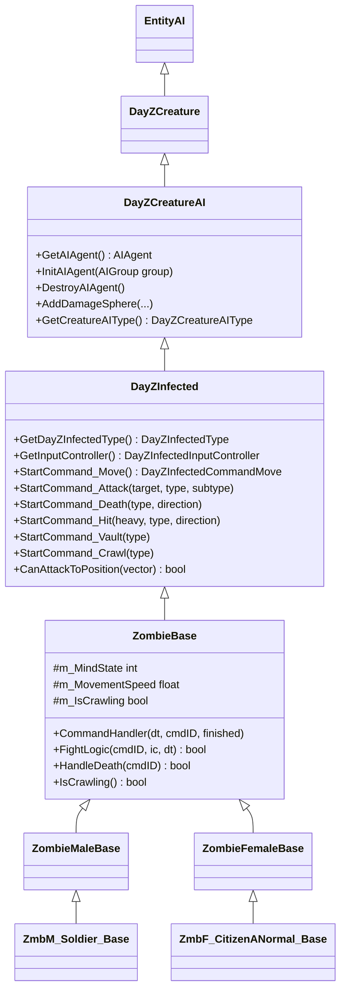

# Capítulo 6.21: Sistema de Zumbis e IA

[Início](../../README.md) | [<< Anterior: Sistema de Partículas e Efeitos](20-particle-effects.md) | **Sistema de Zumbis e IA** | [Próximo: Administração e Gerenciamento de Servidor >>](22-admin-server.md)

---

## Introdução

Zumbis (oficialmente chamados de "Infectados") são a principal entidade de IA hostil no DayZ. Eles patrulham, detectam jogadores através de visão, som e proximidade, transitam entre estados comportamentais, atacam, pulam, rastejam e morrem --- tudo conduzido por um motor de IA em C++ com hooks em nível de script para personalização. Entender como o sistema de infectados funciona é essencial para qualquer mod que spawna, modifica ou interage com zumbis.

Este capítulo cobre a hierarquia completa de classes, a máquina de estados mentais, comandos de movimento e ataque, o sistema de percepção/alvos, padrões de spawn e hooks de modding. Todas as assinaturas de métodos e constantes são extraídas diretamente do código-fonte vanilla dos scripts. Onde o comportamento é conduzido pelo motor C++ sem API visível no script, isso é indicado explicitamente.

---

## Hierarquia de Classes

A entidade infectada herda de uma cadeia profunda compartilhada com animais. Cada nível adiciona capacidades:

```
Class (raiz de todas as classes do Enforce Script)
+-- Managed
    +-- IEntity
        +-- Object
            +-- ObjectTyped
                +-- Entity
                    +-- EntityAI
                        +-- DayZCreature                 // 3_Game - animação, ossos, som
                            +-- DayZCreatureAI           // 3_Game - agente de IA, navmesh, esferas de dano
                                +-- DayZInfected         // 3_Game - comandos de infectados, tratamento de golpes
                                    +-- ZombieBase       // 4_World - handler de comandos, lógica de combate, sync
                                        +-- ZombieMaleBase     // sets de som, variantes masculinas
                                        |   +-- ZmbM_CitizenASkinny_Base
                                        |   +-- ZmbM_Soldier_Base  (IsZombieMilitary = true)
                                        |   +-- ZmbM_NBC_Yellow     (ResistContaminatedEffect = true)
                                        |   +-- ZmbM_Mummy          (luz personalizada + visual na morte)
                                        |   +-- ... (~35 tipos adicionais)
                                        +-- ZombieFemaleBase   // sets de som, IsMale = false
                                            +-- ZmbF_CitizenANormal_Base
                                            +-- ZmbF_PoliceWomanNormal_Base
                                            +-- ... (~20 tipos adicionais)
```

### Classes Chave em Cada Nível

| Classe | Arquivo do Script | Função |
|--------|-------------------|--------|
| `DayZCreature` | `3_Game/entities/dayzanimal.c` | Instância de animação, consultas de ossos, `StartDeath()` / `ResetDeath()` |
| `DayZCreatureAI` | `3_Game/entities/dayzanimal.c` | `GetAIAgent()`, `InitAIAgent()`, `DestroyAIAgent()`, `AddDamageSphere()` |
| `DayZInfected` | `3_Game/entities/dayzinfected.c` | Iniciadores de comandos (`StartCommand_Move`, `_Attack`, `_Death`, etc.), `EEHitBy` |
| `DayZInfectedType` | `3_Game/entities/dayzinfectedtype.c` | Registro de ataques, seleção de componente de impacto, escolha de ataque baseada em utilidade |
| `ZombieBase` | `4_World/entities/creatures/infected/zombiebase.c` | `CommandHandler`, lógica de combate, transição para rastejamento, avaliação de dano de impacto, sync de rede |

### Diagrama de Hierarquia



---

## Enums e Constantes

### DayZInfectedConstants

Definido em `3_Game/entities/dayzinfected.c`:

```csharp
enum DayZInfectedConstants
{
    // IDs de comandos de animação
    COMMANDID_MOVE,       // 0
    COMMANDID_VAULT,      // 1
    COMMANDID_DEATH,      // 2
    COMMANDID_HIT,        // 3
    COMMANDID_ATTACK,     // 4
    COMMANDID_CRAWL,      // 5
    COMMANDID_SCRIPT,     // 6

    // Estados mentais
    MINDSTATE_CALM,       // 7
    MINDSTATE_DISTURBED,  // 8
    MINDSTATE_ALERTED,    // 9
    MINDSTATE_CHASE,      // 10
    MINDSTATE_FIGHT,      // 11
}
```

### DayZInfectedConstantsMovement

```csharp
enum DayZInfectedConstantsMovement
{
    MOVEMENTSTATE_IDLE   = 0,
    MOVEMENTSTATE_WALK,        // 1
    MOVEMENTSTATE_RUN,         // 2
    MOVEMENTSTATE_SPRINT       // 3
}
```

### DayZInfectedDeathAnims

```csharp
enum DayZInfectedDeathAnims
{
    ANIM_DEATH_DEFAULT   = 0,
    ANIM_DEATH_IMPULSE   = 1,   // impacto de veículo / impulso de física
    ANIM_DEATH_BACKSTAB  = 2,   // finalizador: facada no fígado
    ANIM_DEATH_NECKSTAB  = 3    // finalizador: facada no pescoço
}
```

### GameConstants (Relacionadas à IA)

De `3_Game/constants.c`:

| Constante | Valor | Propósito |
|-----------|-------|-----------|
| `AI_ATTACKSPEED` | `1.5` | Multiplicador para taxa de redução de cooldown de ataque |
| `AI_MAX_BLOCKABLE_ANGLE` | `60` | Ângulo máximo (graus) onde a postura de bloqueio do jogador funciona contra infectados |
| `AI_CONTAMINATION_DMG_PER_SEC` | `3` | Dano por tick em zonas contaminadas |
| `NL_DAMAGE_CLOSECOMBAT_CONVERSION_INFECTED` | `0.20` | Conversão de choque para saúde para golpes corpo a corpo em infectados |
| `NL_DAMAGE_FIREARM_CONVERSION_INFECTED` | varia | Conversão de choque para saúde para tiros de arma de fogo em infectados |

---

## Estados Mentais

A IA dos infectados usa cinco estados mentais, gerenciados inteiramente pelo motor de IA em C++. O script lê o estado atual via `DayZInfectedInputController.GetMindState()` mas não pode defini-lo diretamente.

### Descrições dos Estados

| Estado | Valor do Enum | Comportamento |
|--------|---------------|---------------|
| **CALM** | `MINDSTATE_CALM` | Parado ou vagando. Nenhuma ameaça detectada. Estado de animação idle 0. |
| **DISTURBED** | `MINDSTATE_DISTURBED` | Ruído ou estímulo visual breve. Postura alerta, olhando ao redor. Estado de animação idle 1. |
| **ALERTED** | `MINDSTATE_ALERTED` | Estímulo forte confirmado. Busca ativa. Usado no tratamento de eventos sonoros. |
| **CHASE** | `MINDSTATE_CHASE` | Alvo adquirido, perseguindo. Correndo/sprintando. Ataques do grupo chase habilitados. Estado de animação idle 2. |
| **FIGHT** | `MINDSTATE_FIGHT` | Em alcance de combate corpo a corpo. Ataques em pé com cooldowns. Ataques do grupo fight habilitados. |

### Transições de Estado no Script

O método `HandleMindStateChange` em `ZombieBase` lê o estado mental do controlador de entrada a cada frame e dispara transições de animação idle:

```csharp
bool HandleMindStateChange(int pCurrentCommandID, DayZInfectedInputController pInputController, float pDt)
{
    m_MindState = pInputController.GetMindState();
    if (m_LastMindState != m_MindState)
    {
        switch (m_MindState)
        {
        case DayZInfectedConstants.MINDSTATE_CALM:
            if (moveCommand && !moveCommand.IsTurning())
                moveCommand.SetIdleState(0);
            break;
        case DayZInfectedConstants.MINDSTATE_DISTURBED:
            if (moveCommand && !moveCommand.IsTurning())
                moveCommand.SetIdleState(1);
            break;
        case DayZInfectedConstants.MINDSTATE_CHASE:
            if (moveCommand && !moveCommand.IsTurning() && (m_LastMindState < DayZInfectedConstants.MINDSTATE_CHASE))
                moveCommand.SetIdleState(2);
            break;
        }
        m_LastMindState = m_MindState;
        m_AttackCooldownTime = 0.0;
        SetSynchDirty();
    }
    return false;
}
```

> **Importante:** As transições reais de estado (CALM para DISTURBED, DISTURBED para CHASE, etc.) são conduzidas pelo sistema de percepção em C++. O script não pode forçar uma mudança de estado mental --- ele apenas reage ao que o motor decide.

### Sincronização de Rede

`m_MindState` é registrado como uma variável sincronizada:

```csharp
RegisterNetSyncVariableInt("m_MindState", -1, 4);
```

Nos clientes, `OnVariablesSynchronized()` dispara atualizações de eventos sonoros baseados no estado mental atual.

---

## Sistema de Movimento

### DayZInfectedCommandMove

O comando de movimento primário, iniciado com `StartCommand_Move()`. Métodos:

| Método | Assinatura | Descrição |
|--------|-----------|-----------|
| `SetStanceVariation` | `void SetStanceVariation(int pStanceVariation)` | Define variante de postura de animação (0-3, aleatório na inicialização) |
| `SetIdleState` | `void SetIdleState(int pIdleState)` | Define animação idle (0=calmo, 1=perturbado, 2=perseguição) |
| `StartTurn` | `void StartTurn(float pDirection, int pSpeedType)` | Inicia uma animação de virada |
| `IsTurning` | `bool IsTurning()` | Retorna true durante a animação de virada |

A velocidade de movimento é lida do controlador de entrada e sincronizada:

```csharp
RegisterNetSyncVariableFloat("m_MovementSpeed", -1, 3);
```

O método `HandleMove` atualiza `m_MovementSpeed` a partir de `ic.GetMovementSpeed()` e marca como dirty quando a mudança excede 0.9.

### DayZCreatureAIInputController (Base)

O controlador de entrada base (compartilhado com animais) fornece métodos de sobrescrita:

| Método | Assinatura | Descrição |
|--------|-----------|-----------|
| `OverrideMovementSpeed` | `void OverrideMovementSpeed(bool state, float movementSpeed)` | Forçar uma velocidade de movimento específica |
| `GetMovementSpeed` | `float GetMovementSpeed()` | Velocidade de movimento atual |
| `OverrideHeading` | `void OverrideHeading(bool state, float heading)` | Forçar direção de orientação |
| `OverrideTurnSpeed` | `void OverrideTurnSpeed(bool state, float turnSpeed)` | Forçar taxa de virada |
| `OverrideAlertLevel` | `void OverrideAlertLevel(bool state, bool alerted, int level, float inLevel)` | Forçar nível de alerta |
| `OverrideBehaviourSlot` | `void OverrideBehaviourSlot(bool state, int slot)` | Forçar slot de comportamento |

### DayZInfectedInputController (Específico para Infectados)

Estende o controlador base com consultas específicas para infectados:

| Método | Assinatura | Descrição |
|--------|-----------|-----------|
| `IsVault` | `bool IsVault()` | IA quer pular |
| `GetVaultHeight` | `float GetVaultHeight()` | Altura do obstáculo de pulo |
| `GetMindState` | `int GetMindState()` | Valor do enum do estado mental atual |
| `GetTargetEntity` | `EntityAI GetTargetEntity()` | Entidade alvo atual da IA |

### Salto

`HandleVault` em `ZombieBase` traduz a altura do salto em um tipo:

| Faixa de Altura | Tipo de Salto |
|----------------|---------------|
| <= 0.6m | 0 (passar por cima) |
| <= 1.1m | 1 (salto baixo) |
| <= 1.6m | 2 (salto médio) |
| > 1.6m | 3 (salto alto) |

Após aterrissar (`WasLand()` retorna true), um `m_KnuckleOutTimer` de 2 segundos é executado antes do comando de salto sair via `StartCommand_Vault(-1)`.

### Rastejamento

O rastejamento é acionado por dano nas pernas. Quando a saúde de qualquer perna chega a 0 (dano >= `LEG_CRIPPLE_THRESHOLD` de 74.0), `HandleSpecialZoneDamage` define a saúde da perna como zero, e `EvaluateCrawlTransitionAnimation` determina o tipo de transição de rastejamento:

| Condição | Tipo de Animação |
|----------|-----------------|
| Perna esquerda destruída, golpe por trás | 0 |
| Perna esquerda destruída, golpe pela frente | 1 |
| Perna direita destruída, golpe por trás | 2 |
| Perna direita destruída, golpe pela frente | 3 |

Após o comando de transição de rastejamento terminar, o zumbi permanece em `COMMANDID_MOVE` com `m_IsCrawling = true`. O método `IsCrawling()` retorna este flag.

```csharp
RegisterNetSyncVariableBool("m_IsCrawling");
```

---

## Sistema de Ataque

### Registro de Ataques

`DayZInfectedType.RegisterAttacks()` define dois grupos de ataque com parâmetros lidos da config:

```csharp
RegisterAttack(groupType, distance, pitch, type, subtype, ammoType, isHeavy, cooldown, probability);
```

### DayZInfectedAttackType

```csharp
class DayZInfectedAttackType
{
    float m_Distance;      // alcance do ataque em metros
    int m_Pitch;           // 1=cima, 0=centro, -1=baixo
    int m_Type;            // tipo de animação (esquerda/direita)
    float m_Subtype;       // subtipo de animação (cima/centro/baixo/corrida)
    string m_AmmoType;     // config de dano de cfgAmmo
    int m_IsHeavy;         // 0=leve (bloqueável), 1=pesado (não bloqueável)
    float m_Cooldown;      // segundos entre ataques
    float m_Probability;   // probabilidade de seleção [0..1]
}
```

### Grupos de Ataque

**Grupo Chase** (`DayZInfectedAttackGroupType.CHASE`): Ataques correndo a 2.4m de alcance, sem redução de cooldown, sempre pitch central (-1). Duas variantes: esquerda e direita.

**Grupo Fight** (`DayZInfectedAttackGroupType.FIGHT`): Ataques em pé a 1.4-1.7m de alcance. Dez variantes cobrindo pitch cima/centro/baixo e combinações esquerda/direita/pesado. Cooldowns de 0.1 a 0.6 segundos.

### Seleção de Ataque (Sistema de Utilidade)

`DayZInfectedType.ChooseAttack()` usa uma função de utilidade para selecionar ataques:

1. Filtrar por pitch correspondente
2. Rejeitar ataques onde o alvo está além da distância de ataque
3. Calcular utilidade = pontuação_distância (0-100) + pontuação_probabilidade (0-10)
4. Selecionar o ataque de maior utilidade

### Fluxo da Lógica de Combate

`ZombieBase.FightLogic()` é o despachante principal de combate:

1. Em **COMMANDID_MOVE** + **MINDSTATE_CHASE**: chama `ChaseAttackLogic`
2. Em **COMMANDID_MOVE** + **MINDSTATE_FIGHT**: chama `FightAttackLogic`
3. Em **COMMANDID_ATTACK**: verifica `WasHit()` e aplica dano

### Aplicação de Dano

Quando `attackCommand.WasHit()` retorna true:

- Verifica se o alvo está dentro da distância de ataque
- Se o jogador estiver bloqueando e de frente para o zumbi (dentro de `AI_MAX_BLOCKABLE_ANGLE` = 60 graus):
  - Ataque pesado: reduzido para tipo de munição `"MeleeZombie"`
  - Ataque leve: reduzido para `"Dummy_Light"` (sem dano real)
- Caso contrário: dano completo via `DamageSystem.CloseCombatDamageName()` com o `m_AmmoType` do ataque

Tipos de munição são lidos de caminhos de config:
- `cfgVehicles <ZombieClass> AttackActions AttackShort ammoType` (leve/fight)
- `cfgVehicles <ZombieClass> AttackActions AttackLong ammoType` (pesado/fight)
- `cfgVehicles <ZombieClass> AttackActions AttackRun ammoType` (chase)

### Cooldown de Ataque

Ataques fight usam um timer de cooldown decrementado por `pDt * GameConstants.AI_ATTACKSPEED` (velocidade 1.5x). Ataques chase não têm controle de cooldown no script --- disparam assim que o alinhamento do alvo é válido.

### Validação de Cone do Alvo

Antes de atacar, o zumbi verifica o alinhamento do alvo usando `DayZPlayerUtils.GetMeleeTarget()` com ângulos de cone:
- Chase: `TARGET_CONE_ANGLE_CHASE = 20` graus
- Fight: `TARGET_CONE_ANGLE_FIGHT = 30` graus

---

## Sistema de Percepção

A percepção do zumbi é primariamente tratada pelo motor C++. O script expõe o resultado (estado mental, entidade alvo) mas não a lógica interna de percepção. No entanto, o lado do script define os **callbacks de alvo** e o **sistema de ruído** que alimentam o motor.

### Visão (Modificadores de Visibilidade)

`AITargetCallbacksPlayer` (registrado em cada `PlayerBase`) fornece `GetMaxVisionRangeModifier()`, que informa ao motor o quão visível um jogador está:

**Modificadores de velocidade** (de `PlayerConstants`):

| Estado de Movimento | Multiplicador |
|--------------------|---------------|
| Sprint / Corrida | `AI_VISIBILITY_RUN = 1.0` |
| Caminhada | `AI_VISIBILITY_WALK = 0.66` |
| Parado | `AI_VISIBILITY_IDLE = 0.3` |

**Modificadores de postura**:

| Postura | Multiplicador |
|---------|---------------|
| Em pé | `AI_VISIBILITY_STANDING = 1.5` |
| Agachado | `AI_VISIBILITY_CROUCH = 0.6` |
| Deitado | `AI_VISIBILITY_PRONE = 0.15` |

O modificador final é a média dos coeficientes de velocidade e postura: `mod = (speedCoef + stanceCoef) / 2`.

**Seleção de ponto de visão** também depende do estado mental: quando o infectado está ALERTED ou superior, ele olha para o osso da cabeça do jogador; caso contrário, verifica o peito (osso Spine3).

### Som (Sistema de Ruído)

O sistema de ruído alimenta a percepção da IA via `g_Game.GetNoiseSystem().AddNoise()`. Ações do jogador geram ruído com multiplicadores:

**Ruído de velocidade** (de `PlayerConstants`):

| Ação | Multiplicador |
|------|---------------|
| Rolando (deitado) | `AI_NOISE_ROLL = 2.0` |
| Sprintando | `AI_NOISE_SPRINT = 1.0` |
| Correndo | `AI_NOISE_RUN = 0.8` |
| Correndo agachado | `AI_NOISE_CROUCH_RUN = 0.6` |
| Caminhando | `AI_NOISE_WALK = 0.4` |
| Parado | `AI_NOISE_IDLE = 0.0` |

**Ruído de calçado**:

| Tipo | Multiplicador |
|------|---------------|
| Botas | `AI_NOISE_SHOES_BOOTS = 0.85` |
| Tênis | `AI_NOISE_SHOES_SNEAKERS = 0.6` |
| Descalço | `AI_NOISE_SHOES_NONE = 0.45` |

O ruído final é calculado por `NoiseAIEvaluate.GetNoiseMultiplier()`:

```
surfaceNoise *= 0.25
avgNoise = (shoesNoise + surfaceNoise) / 1.25
finalNoise = avgNoise * speedNoise
```

O clima também reduz o ruído via `Weather.GetNoiseReductionByWeather()` (chuva reduz a detecção).

### Cheiro / Proximidade

Não existe uma API de "cheiro" visível no script. A detecção por proximidade parece ser tratada inteiramente no motor C++. Modders devem tratar a percepção do motor como uma caixa preta que produz estado mental e entidade alvo.

---

## O Command Handler

`ZombieBase.CommandHandler()` é chamado a cada frame pelo motor. É o ponto de decisão central:

```
CommandHandler(dt, currentCommandID, currentCommandFinished)
  |
  +-- ModCommandHandlerBefore() ........ [hook de mod, retorna true para sobrescrever]
  |
  +-- HandleDeath() .................... [se não está vivo ou finalizador em progresso]
  |
  +-- HandleMove() ..................... [sincronizar velocidade de movimento]
  +-- HandleOrientation() .............. [sincronizar ângulo de yaw]
  |
  +-- [se comando finalizado] ........... [reiniciar StartCommand_Move]
  |
  +-- ModCommandHandlerInside() ........ [hook de mod]
  |
  +-- HandleCrawlTransition() .......... [destruição de perna -> rastejamento]
  |
  +-- HandleDamageHit() ................ [reação de atordoamento/golpe]
  |
  +-- HandleVault() .................... [obstáculos de salto do navmesh]
  +-- HandleMindStateChange() .......... [atualizações de animação idle]
  +-- FightLogic() ..................... [ataques chase/fight]
  |
  +-- ModCommandHandlerAfter() ......... [hook de mod]
```

### Hooks de Mod

Três pontos de inserção permitem que mods sobrescrevam ou estendam o comportamento:

| Hook | Quando | Uso |
|------|--------|-----|
| `ModCommandHandlerBefore` | Antes de qualquer lógica vanilla | Retorna `true` para pular todo o comportamento padrão |
| `ModCommandHandlerInside` | Após tratamento de morte/movimento, antes do combate | Retorna `true` para pular a lógica de combate |
| `ModCommandHandlerAfter` | Após toda a lógica vanilla | Retorna `true` (sem efeito prático, executa por último) |

Todos os três são destinados a serem sobrescritos via `modded class ZombieBase`.

---

## Dano e Morte

### Reações a Golpes

Quando um zumbi recebe dano, `EEHitBy` em `ZombieBase`:

1. Chama `super.EEHitBy()` (nível DayZInfected trata conversão de choque para saúde e rastreamento do assassino)
2. Se morto: avalia animação de morte via `EvaluateDeathAnimationEx()`
3. Se vivo: verifica transição para rastejamento (perna destruída), depois avalia animação de reação a golpe

Reações a golpes são limitadas por `HIT_INTERVAL_MIN = 0.3` segundos. A chance de atordoamento é:

```
stunChance = SHOCK_TO_STUN_MULTIPLIER * shockDamage  // 2.82 * dano
```

Uma rolagem aleatória (0-100) deve ser <= `stunChance` para a animação de golpe ser reproduzida, a menos que:
- O golpe seja pesado (sempre atordoa)
- O zumbi esteja no estado CALM ou DISTURBED (sempre atordoa)

### Dano em Zonas Especiais

`DayZInfected.HandleSpecialZoneDamage()` verifica se o dano excede `LEG_CRIPPLE_THRESHOLD = 74.0`:
- **LeftLeg / RightLeg**: Define saúde da perna como 0 (aciona transição de rastejamento)
- **Torso / Head**: Define `m_HeavyHitOverride = true` (força animação de golpe pesado)

### Conversão de Choque para Saúde

`DayZInfected.ConvertNonlethalDamage()` converte dano de choque em dano real de saúde:
- Combate corpo a corpo: `dano * 0.20`
- Armas de fogo: `dano * PROJECTILE_CONVERSION_INFECTED`

### Morte

`HandleDeath()` é acionado quando `!IsAlive()` ou `m_FinisherInProgress`:

```csharp
StartCommand_Death(m_DeathType, m_DamageHitDirection);
m_MovementSpeed = -1;
m_MindState = -1;
SetSynchDirty();
```

Tipos de morte são selecionados por `EvaluateDeathAnimation()` baseado na config de munição (`doPhxImpulse`). Impactos de veículos aplicam impulso de física ao ragdoll.

### Sistema de Finalizador (Backstab)

`SetBeingBackstabbed()` desabilita a IA via `GetAIAgent().SetKeepInIdle(true)`, seleciona um tipo de animação de morte e define `m_FinisherInProgress = true`. A verificação `HandleDeath` captura este flag e dispara o comando de morte.

Se o finalizador falhar, `OnRecoverFromDeath()` reativa a IA:

```csharp
GetAIAgent().SetKeepInIdle(false);
m_FinisherInProgress = false;
```

---

## Spawnando Zumbis

### Spawn via Script com CreateObjectEx

```csharp
// Apenas do lado do servidor
DayZInfected zombie = DayZInfected.Cast(
    g_Game.CreateObjectEx(
        "ZmbF_JournalistNormal_Blue",        // nome da classe de cfgVehicles
        spawnPosition,                        // posição como vector
        ECE_PLACE_ON_SURFACE | ECE_INITAI | ECE_EQUIP_ATTACHMENTS
    )
);
```

**Flags ECE** (de `3_Game/ce/centraleconomy.c`):

| Flag | Valor | Propósito |
|------|-------|-----------|
| `ECE_INITAI` | `2048` | Inicializar o agente de IA (necessário para os zumbis funcionarem) |
| `ECE_EQUIP_ATTACHMENTS` | `8192` | Equipar anexos configurados da config |
| `ECE_PLACE_ON_SURFACE` | `1060` | Composto: criar física + atualizar pathgraph + traçar ao chão |

> **Crítico:** Omitir `ECE_INITAI` cria um zumbi sem cérebro de IA --- ele ficará parado imóvel. Você pode depois chamar `zombie.InitAIAgent(group)` manualmente, mas `ECE_INITAI` é a abordagem padrão.

### Inicialização Manual de IA

```csharp
// Criar sem IA
DayZInfected zombie = DayZInfected.Cast(
    g_Game.CreateObjectEx("ZmbM_Soldier_Normal", pos, ECE_PLACE_ON_SURFACE)
);

// Depois, inicializar a IA com um grupo
AIWorld aiWorld = g_Game.GetAIWorld();
AIGroup group = aiWorld.CreateDefaultGroup();
zombie.InitAIAgent(group);

// Para desabilitar a IA temporariamente
zombie.GetAIAgent().SetKeepInIdle(true);

// Para reativar
zombie.GetAIAgent().SetKeepInIdle(false);

// Para destruir o agente de IA
zombie.DestroyAIAgent();
```

### Spawn de Zumbis via Events.xml

A Central Economy spawna zumbis via `events.xml` usando nomes de classe de zumbis e definições de grupo. Isso não é script --- é configuração XML processada pelo motor CE:

```xml
<event name="InfectedCity">
    <nominal>15</nominal>
    <min>10</min>
    <max>18</max>
    <lifetime>150</lifetime>
    <restock>0</restock>
    <saferadius>1</saferadius>
    <distanceradius>80</distanceradius>
    <cleanupradius>120</cleanupradius>
    <flags deletable="1" init_random="0" remove_damaged="0"/>
    <position>fixed</position>
    <limit>child</limit>
    <active>1</active>
    <children>
        <child lootmax="0" lootmin="0" max="5" min="3" type="ZmbF_CitizenANormal"/>
        <child lootmax="0" lootmin="0" max="5" min="3" type="ZmbM_CitizenASkinny"/>
    </children>
</event>
```

Os valores de `type` devem corresponder a nomes de classe em `cfgVehicles`. O CE gerencia posições de spawn, raio de despawn e limites de população.

---

## Grupos de IA e Waypoints de Patrulha

### AIWorld

`AIWorld` fornece pathfinding de navmesh e gerenciamento de grupos:

```csharp
AIWorld aiWorld = g_Game.GetAIWorld();

// Pathfinding
PGFilter filter = new PGFilter();
filter.SetFlags(PGPolyFlags.WALK, PGPolyFlags.DISABLED, 0);
TVectorArray waypoints = new TVectorArray();
bool found = aiWorld.FindPath(fromPos, toPos, filter, waypoints);

// Amostragem de navmesh
vector sampledPos;
bool onNavmesh = aiWorld.SampleNavmeshPosition(pos, 5.0, filter, sampledPos);
```

### AIGroup e BehaviourGroupInfectedPack

Grupos podem ter waypoints de patrulha:

```csharp
AIGroup group = aiWorld.CreateGroup("BehaviourGroupInfectedPack");
BehaviourGroupInfectedPack behaviour = BehaviourGroupInfectedPack.Cast(group.GetBehaviour());

// Definir waypoints de patrulha
array<ref BehaviourGroupInfectedPackWaypointParams> waypoints = new array<ref BehaviourGroupInfectedPackWaypointParams>();
waypoints.Insert(new BehaviourGroupInfectedPackWaypointParams("100 0 200", 10.0));
waypoints.Insert(new BehaviourGroupInfectedPackWaypointParams("150 0 250", 15.0));

behaviour.SetWaypoints(waypoints, 0, true, true);   // iniciar em 0, avançar, repetir
```

### PGPolyFlags (Filtro de Navmesh)

| Flag | Propósito |
|------|-----------|
| `WALK` | Chão, grama, estrada |
| `DOOR` | Pode mover-se através de portas |
| `INSIDE` | Pode mover-se dentro de edifícios |
| `JUMP_OVER` | Pode pular obstáculos |
| `CRAWL` | Pode rastejar |
| `CLIMB` | Pode escalar |

---

## Configuração de Zumbis (DayZInfectedType)

### Componentes de Impacto

`DayZInfectedType.RegisterHitComponentsForAI()` define quais partes do corpo os zumbis alvejam e com qual probabilidade:

| Componente | Peso | Notas |
|-----------|------|-------|
| Head | 2 | Seleção de alvo rara |
| LeftArm | 50 | Comum |
| Torso | 65 | Mais comum |
| RightArm | 50 | Comum |
| LeftLeg | 50 | Comum |
| RightLeg | 50 | Comum |

Componente de impacto padrão: `"Torso"`. Componente de posição de impacto padrão: `"Spine1"`.

Componentes adequados para finalizadores: `"Head"`, `"Neck"`, `"Torso"`.

### Variantes de Tipo

Tipos específicos de zumbis sobrescrevem flags de comportamento:

| Sobrescrita | Tipos | Efeito |
|-------------|-------|--------|
| `IsZombieMilitary()` | ZmbM_PatrolNormal, ZmbM_Soldier, ZmbM_SoldierNormal, ZmbM_usSoldier_normal, ZmbM_NBC_Grey, ZmbM_NBC_White | Usado para seleção de tabela de loot |
| `ResistContaminatedEffect()` | ZmbM_NBC_Yellow, ZmbM_NBC_Grey, ZmbM_NBC_White, ZmbM_Mummy | Imune a dano de zona contaminada |
| `IsMale()` | Todos `ZombieFemaleBase` retornam `false` | Seleção de set de som |

---

## Padrões de Acesso via Script

### Lendo o Estado do Zumbi

```csharp
ZombieBase zombie = ZombieBase.Cast(someEntity);
if (zombie)
{
    // Estado mental (sincronizado)
    int mindState = zombie.GetMindStateSynced();

    // Velocidade de movimento (-1 a 3, sincronizada)
    // Acessar m_MovementSpeed via a variável sincronizada

    // Estado de rastejamento (sincronizado)
    bool crawling = zombie.IsCrawling();

    // Orientação (sincronizada, 0-359 graus)
    int yaw = zombie.GetOrientationSynced();

    // Verificação de vida
    bool alive = zombie.IsAlive();  // herdado de EntityAI

    // Verificações de tipo
    bool military = zombie.IsZombieMilitary();
    bool male = zombie.IsMale();
}
```

### Lendo via Controlador de Entrada (Apenas Servidor)

```csharp
DayZInfectedInputController ic = zombie.GetInputController();
if (ic)
{
    int mindState = ic.GetMindState();
    float speed = ic.GetMovementSpeed();
    EntityAI target = ic.GetTargetEntity();
}
```

### Sobrescrevendo Comportamento da IA (Apenas Servidor)

```csharp
DayZInfectedInputController ic = zombie.GetInputController();

// Forçar velocidade de movimento
ic.OverrideMovementSpeed(true, 2.0);   // forçar velocidade de corrida
ic.OverrideMovementSpeed(false, 0);     // liberar sobrescrita

// Forçar orientação
ic.OverrideHeading(true, 90.0);         // virar para leste
ic.OverrideHeading(false, 0);           // liberar

// Suspender IA inteiramente
zombie.GetAIAgent().SetKeepInIdle(true);

// Retomar IA
zombie.GetAIAgent().SetKeepInIdle(false);
```

---

## Tipos de Zumbis Personalizados

### Estendendo ZombieBase

```csharp
class MyCustomZombie extends ZombieMaleBase
{
    override bool IsZombieMilitary()
    {
        return true;    // dropa loot militar
    }

    override bool ResistContaminatedEffect()
    {
        return true;    // imune a zonas de gás
    }

    override string CaptureSound()
    {
        return "MyCustom_CaptureSound_Soundset";
    }

    override string ReleaseSound()
    {
        return "MyCustom_ReleaseSound_Soundset";
    }
}
```

Isso também requer uma entrada `config.cpp` em `CfgVehicles` herdando de uma classe de zumbi existente.

### Scripts de Comando Personalizados

`DayZInfectedCommandScript` permite comandos de animação totalmente scriptáveis:

```csharp
class MyZombieCommand extends DayZInfectedCommandScript
{
    void MyZombieCommand(DayZInfected pInfected)
    {
        // Construtor - primeiro parâmetro DEVE ser DayZInfected
    }

    bool PostPhysUpdate(float pDt)
    {
        // Chamado a cada frame após a física
        // Retorna true para continuar executando, false para finalizar
        return true;
    }
}

// Iniciar o comando personalizado
zombie.StartCommand_ScriptInst(MyZombieCommand);
```

> **Aviso:** `DayZInfectedCommandScript` é NÃO-GERENCIADO. Uma vez enviado ao CommandHandler via `StartCommand_Script` ou `StartCommand_ScriptInst`, o motor assume a propriedade. Não o delete manualmente enquanto ativo --- isso causará um crash.

### Modding via modded class

A abordagem recomendada para modificar todos os zumbis é `modded class ZombieBase`:

```csharp
modded class ZombieBase
{
    override bool ModCommandHandlerBefore(float pDt, int pCurrentCommandID, bool pCurrentCommandFinished)
    {
        // Pré-processamento personalizado
        // Retorna true para pular todo o tratamento padrão de comandos
        return false;
    }

    override bool ModCommandHandlerInside(float pDt, int pCurrentCommandID, bool pCurrentCommandFinished)
    {
        // Executa após tratamento de morte/movimento, antes do combate
        return false;
    }

    override bool ModCommandHandlerAfter(float pDt, int pCurrentCommandID, bool pCurrentCommandFinished)
    {
        // Executa após toda a lógica vanilla
        return false;
    }
}
```

---

## Sistema de Som

O som dos infectados é gerenciado por `InfectedSoundEventHandler` (apenas cliente), que mapeia estados mentais para IDs de eventos sonoros:

| Estado Mental | Evento Sonoro |
|--------------|---------------|
| CALM | `MINDSTATE_CALM_MOVE` |
| DISTURBED | `MINDSTATE_DISTURBED_IDLE` |
| ALERTED | `MINDSTATE_ALERTED_MOVE` |
| CHASE | `MINDSTATE_CHASE_MOVE` |
| FIGHT (e outros) | Som interrompido |

Eventos de voz acionados por animação (`OnSoundVoiceEvent`) interrompem sons baseados em estado. Zumbis masculinos e femininos usam sets de som diferentes:

- Masculino: `"ZmbM_Normal_HeavyHit_Soundset"`, `"ZmbM_Normal_CallToArmsShort_Soundset"`
- Feminino: `"ZmbF_Normal_HeavyHit_Soundset"`, `"ZmbF_Normal_CallToArmsShort_Soundset"`

---

## Boas Práticas

1. **Sempre use `ECE_INITAI` ao spawnar** --- sem ele, o zumbi não tem cérebro de IA e ficará imóvel.
2. **Spawn apenas do lado do servidor** --- `CreateObjectEx` para zumbis deve ser executado apenas no servidor; a rede cuida da replicação para clientes.
3. **Verifique `IsAlive()` antes de qualquer manipulação de IA** --- chamar `GetAIAgent()` em um zumbi morto pode produzir resultados inesperados.
4. **Use `SetKeepInIdle(true)` com moderação** --- suspende toda a IA, incluindo percepção. Lembre-se de restaurá-la.
5. **Respeite o fluxo do command handler** --- use `ModCommandHandlerBefore/Inside/After` em vez de sobrescrever `CommandHandler` diretamente.
6. **Evite deletar `DayZInfectedCommandScript` ativo** --- o motor é dono dele uma vez iniciado. Deixe-o terminar ou chame `SetFlagFinished(true)`.

---

## Observado em Mods Reais

### DayZ Expansion AI (eAIBase)

O mod Expansion estende o sistema de IA de zumbis/criaturas criando `eAIBase` (estendendo `DayZPlayer`, não `DayZInfected`) para IA semelhante a humanos. Para modificações de infectados, o Expansion usa `modded class ZombieBase` para adicionar rastreamento relacionado a quests (ex.: contagem de kills para objetivos). Isso demonstra que a abordagem `modded class` é o padrão para personalização de infectados.

### Plugin de Debug Vanilla

`PluginDayZInfectedDebug` (em `4_World/plugins/pluginbase/plugindayzinfecteddebug.c`) é uma ferramenta de debug embutida que demonstra a API completa:

- Spawna um zumbi com `CreateObjectEx("ZmbF_JournalistNormal_Blue", pos, ECE_PLACE_ON_SURFACE|ECE_INITAI|ECE_EQUIP_ATTACHMENTS)`
- Define `GetAIAgent().SetKeepInIdle(true)` para controle manual
- Sobrescreve velocidade de movimento via `GetInputController().OverrideMovementSpeed(true, speed)`
- Emite comandos diretamente: `StartCommand_Vault`, `StartCommand_Crawl`, `StartCommand_Hit`, `StartCommand_Death`, `StartCommand_Attack`

Este plugin é uma referência excelente para testar qualquer mod relacionado a infectados.

---

## Teoria vs Prática

| Teoria | Prática |
|--------|---------|
| Estados mentais podem ser definidos do script | O motor C++ controla as transições; o script pode apenas ler o estado e sobrescrever valores do controlador de entrada |
| Zumbis usam pathfinding para navegação | Sim, via `AIWorld.FindPath()` e navmesh, mas o planejamento de caminho é interno ao motor |
| Seleção de ataque é aleatória | Usa uma função de utilidade combinando distância, pitch e probabilidade ponderada |
| Todos os tipos de zumbis se comportam diferentemente | A maioria compartilha comportamento idêntico; apenas NBC (resistência à contaminação) e Militar (flags de loot) diferem no script |
| `DayZInfectedCommandCrawl` controla o rastejamento | Ele apenas trata a animação de transição; o rastejamento real usa `DayZInfectedCommandMove` com `m_IsCrawling = true` |
| `GetMindState()` funciona nos clientes | O método bruto do controlador é apenas servidor; clientes usam a variável sincronizada `m_MindState` via `GetMindStateSynced()` |

---

## Erros Comuns

1. **Esquecer `ECE_INITAI`** --- O bug de spawn mais comum. O zumbi aparece mas não faz nada.
2. **Chamar `StartCommand_Attack(null, ...)` em produção** --- O plugin de debug faz isso para testes, mas ataques reais precisam de uma entidade alvo válida ou o dano não será aplicado.
3. **Sobrescrever `CommandHandler` diretamente** --- Isso quebra a compatibilidade com outros mods. Use os três hooks `ModCommandHandler*` em vez disso.
4. **Assumir que `COMMANDID_CRAWL` significa que o zumbi está rastejando** --- `COMMANDID_CRAWL` é apenas a transição. Verifique `IsCrawling()` para o estado persistente.
5. **Ler `m_MindState` nos clientes sem sincronização** --- Use `GetMindStateSynced()` que lê a variável sincronizada de rede.
6. **Não verificar `!IsAlive()` antes de operações de IA** --- Zumbis mortos ainda existem como entidades, mas seu estado de IA é indefinido.
7. **Deletar entidades de zumbis sem `DestroyAIAgent()` primeiro** --- Pode causar agentes de IA órfãos. O motor geralmente lida com isso, mas limpeza explícita é mais segura para zumbis spawnados por mods.
8. **Definir saúde da perna como 0 sem acionar `m_CrawlTransition`** --- `SetHealth("LeftLeg", "Health", 0)` direto não aciona a transição de rastejamento; a lógica flui através de `EEHitBy` -> `HandleSpecialZoneDamage` -> `EvaluateCrawlTransitionAnimation`.

---

## Compatibilidade e Impacto

| Aspecto | Impacto |
|---------|---------|
| **Desempenho** | Cada zumbi executa seu `CommandHandler` a cada frame no servidor. Grandes populações de zumbis (50+) podem causar lag no servidor. |
| **Rede** | Três variáveis sincronizadas por zumbi (`m_MindState`, `m_MovementSpeed`, `m_IsCrawling`, `m_OrientationSynced`). Mudanças disparam `SetSynchDirty()`. |
| **Conflitos de mods** | Múltiplos mods usando `ModCommandHandlerBefore` retornando `true` vão conflitar --- apenas a sobrescrita do último mod carregado é executada. |
| **Cliente/Servidor** | Command handler, lógica de combate e dano executam apenas do lado do servidor. Eventos sonoros e reprodução de animação são do lado do cliente. |
| **Dependência do motor de IA** | Transições de estado mental, decisões de pathfinding e seleção de alvo são recursos do motor C++. O script não pode substituir ou contornar completamente a IA embutida. |

---

## Referência Rápida

```csharp
// Spawnar um zumbi (apenas servidor)
DayZInfected z = DayZInfected.Cast(
    g_Game.CreateObjectEx("ZmbM_Soldier_Normal", pos,
        ECE_PLACE_ON_SURFACE | ECE_INITAI | ECE_EQUIP_ATTACHMENTS));

// Verificar estado
int mind = z.GetInputController().GetMindState();     // servidor
int mindSync = ZombieBase.Cast(z).GetMindStateSynced(); // sincronizado

// Suspender/retomar IA
z.GetAIAgent().SetKeepInIdle(true);
z.GetAIAgent().SetKeepInIdle(false);

// Forçar movimento
z.GetInputController().OverrideMovementSpeed(true, 3.0); // sprint
z.GetInputController().OverrideMovementSpeed(false, 0);   // liberar

// Matar
z.SetHealth("", "Health", 0);
// (comando de morte é acionado automaticamente via HandleDeath no próximo frame)

// Verificar tipo
ZombieBase zb = ZombieBase.Cast(z);
bool isMilitary = zb.IsZombieMilitary();
bool isCrawling = zb.IsCrawling();
bool isZombie   = zb.IsZombie();       // sempre true para ZombieBase
```

---

*Arquivos de código-fonte referenciados: `3_Game/entities/dayzinfected.c`, `3_Game/entities/dayzinfectedtype.c`, `3_Game/entities/dayzinfectedinputcontroller.c`, `3_Game/entities/dayzcreatureaiinputcontroller.c`, `3_Game/entities/dayzanimal.c`, `3_Game/entities/dayzcreatureaitype.c`, `3_Game/ai/aiworld.c`, `3_Game/ai/aiagent.c`, `3_Game/ai/aigroup.c`, `3_Game/ai/aigroupbehaviour.c`, `3_Game/systems/ai/aitarget_callbacks.c`, `3_Game/constants.c`, `3_Game/playerconstants.c`, `3_Game/ce/centraleconomy.c`, `4_World/entities/creatures/infected/zombiebase.c`, `4_World/entities/creatures/infected/zombiemalebase.c`, `4_World/entities/creatures/infected/zombiefemalebase.c`, `4_World/entities/dayzinfectedimplement.c`, `4_World/entities/manbase/playerbase/aitargetcallbacksplayer.c`, `4_World/static/sensesaievaluate.c`, `4_World/plugins/pluginbase/plugindayzinfecteddebug.c`, `4_World/classes/soundevents/infectedsoundevents/`*
