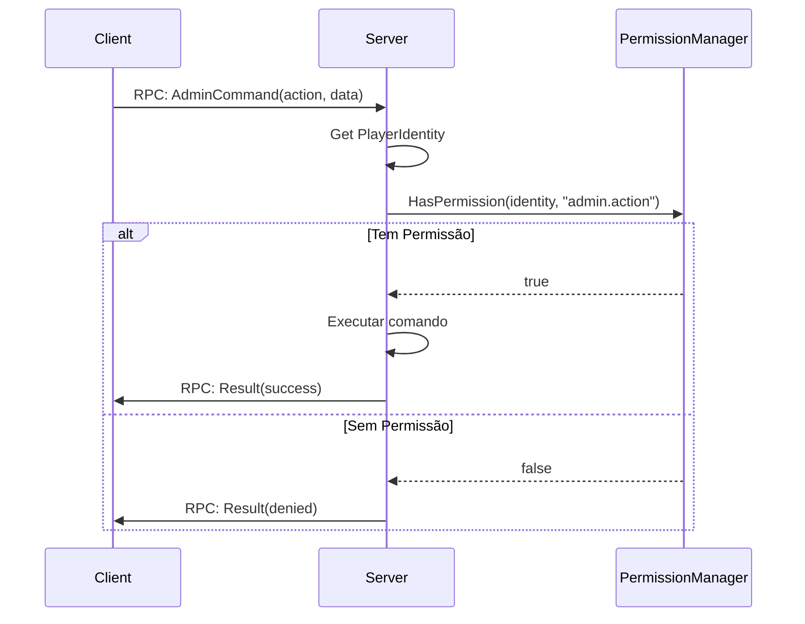

# Capítulo 6.22: Administração e Gerenciamento de Servidor

[Início](../../README.md) | [<< Anterior: Sistema de Zumbis e IA](21-zombie-ai-system.md) | **Administração e Gerenciamento de Servidor** | [Próximo: Sistemas de Mundo >>](23-world-systems.md)

---

## Introdução

A administração de servidores no DayZ cobre um amplo conjunto de responsabilidades: gerenciar jogadores conectados, aplicar regras, controlar o estado do mundo (hora, clima), registrar eventos para trilhas de auditoria e integrar com sistemas de persistência. Diferente da maioria dos motores de jogos que fornecem um painel de admin embutido, o DayZ oferece apenas APIs de scripting de baixo nível. O ecossistema de ferramentas de admin --- COT, VPP e soluções personalizadas --- é construído inteiramente sobre essas APIs.

Este capítulo documenta as APIs em nível de motor disponíveis para administração de servidores, os padrões estabelecidos por grandes mods de admin e os pontos de integração que conectam scripts ao banco de dados Hive, ao anti-cheat BattlEye e a serviços externos como Discord. Todas as assinaturas de métodos são extraídas do código-fonte vanilla dos scripts e verificadas contra implementações reais de mods.

---

## Gerenciamento de Jogadores

### Obtendo Todos os Jogadores Online

O motor fornece duas maneiras equivalentes de recuperar todas as entidades de jogadores conectados.

```c
// Via CGame (mais comum)
array<Man> players = new array<Man>();
GetGame().GetPlayers(players);

// Via objeto World (resultado idêntico)
array<Man> players = new array<Man>();
GetGame().GetWorld().GetPlayerList(players);
```

**Assinaturas** (de `3_Game/global/game.c` e `3_Game/global/world.c`):

```c
// CGame
proto native void GetPlayers(out array<Man> players);

// World
proto native void GetPlayerList(out array<Man> players);
```

Ambas preenchem um array de saída com referências `Man`. Faça cast de cada uma para `PlayerBase` para funcionalidade completa:

```c
array<Man> players = new array<Man>();
GetGame().GetPlayers(players);

foreach (Man man : players)
{
    PlayerBase player = PlayerBase.Cast(man);
    if (player && player.GetIdentity())
    {
        string name = player.GetIdentity().GetName();
        string steamId = player.GetIdentity().GetPlainId();
        // ... lógica de admin
    }
}
```

### PlayerIdentity

Cada jogador conectado tem um objeto `PlayerIdentity` que expõe identificação e estatísticas de rede. Acesse-o via `player.GetIdentity()`.

**Métodos chave** (de `3_Game/gameplay.c`):

```c
class PlayerIdentityBase : Managed
{
    // --- Identificação ---
    proto string GetName();         // Nome curto (nick) do jogador
    proto string GetPlainName();    // Nick sem qualquer processamento
    proto string GetFullName();     // Nome completo do jogador
    proto string GetId();           // ID único hasheado (GUID do BattlEye) - usar para BD/logs
    proto string GetPlainId();      // ID único em texto puro (Steam64 ID) - usar para buscas
    proto int    GetPlayerId();     // ID de sessão (reutilizado após desconexão)

    // --- Estatísticas de Rede ---
    proto int GetPingAct();         // Ping atual
    proto int GetPingMin();         // Ping mínimo
    proto int GetPingMax();         // Ping máximo
    proto int GetPingAvg();         // Ping médio
    proto int GetBandwidthMin();    // Estimativa de largura de banda (kbps)
    proto int GetBandwidthMax();
    proto int GetBandwidthAvg();
    proto float GetOutputThrottle(); // Limitação na saída (0-1)
    proto float GetInputThrottle();  // Limitação na entrada (0-1)

    // --- Jogador Associado ---
    proto Man GetPlayer();          // Obter a entidade do jogador
}

// Subclasse moddável (pode ser estendida por mods)
class PlayerIdentity : PlayerIdentityBase {}
```

**Orientação sobre IDs de identidade:**

| Método | Retorna | Usar Para |
|--------|---------|-----------|
| `GetPlainId()` | Steam64 ID bruto (ex: `"76561198012345678"`) | Listas de admin, buscas de perfil Steam, exibição |
| `GetId()` | Hash GUID do BattlEye | Chaves de banco de dados, armazenamento persistente, arquivos de log |
| `GetName()` | Nome de exibição (sanitizado) | Exibição na UI, mensagens de log |
| `GetPlayerId()` | ID inteiro de sessão | Operações de rede na sessão atual |

### Expulsando Jogadores

O DayZ não expõe uma função de script `KickPlayer()` direta. Em vez disso, o motor fornece `DisconnectPlayer()` que termina a conexão.

**Assinatura** (de `3_Game/global/game.c`):

```c
proto native void DisconnectPlayer(PlayerIdentity identity, string uid = "");
```

Mods de admin implementam funcionalidade de kick usando isso, combinado com um RPC de notificação para que o cliente veja uma mensagem de motivo antes da desconexão:

```c
// Padrão do VPP Admin Tools - enviar motivo, depois desconectar
void KickPlayerWithReason(PlayerBase target, string reason)
{
    if (!target || !target.GetIdentity())
        return;

    // Enviar motivo do kick ao cliente via RPC (cliente mostra como diálogo)
    // Depois desconectar após um curto atraso
    GetGame().DisconnectPlayer(target.GetIdentity());
}
```

O VPP usa uma abordagem diferida, enviando o motivo via RPC primeiro e chamando a desconexão em um timer:

```c
// De VPP missionServer.c - kick diferido via CallLater
GetGame().GetCallQueue(CALL_CATEGORY_SYSTEM).CallLater(
    this.InvokeKickPlayer, m_LoginTimeMs, true,
    identity.GetPlainId(), banReason
);
```

O enum `EClientKicked` (de `3_Game/global/errormodulehandler/clientkickedmodule.c`) define todos os possíveis motivos de kick que o motor reconhece:

```c
enum EClientKicked
{
    UNKNOWN = -1,
    OK = 0,
    SERVER_EXIT,        // Servidor desligando
    KICK_ALL_ADMIN,     // Admin expulsou todos (RCON)
    KICK_ALL_SERVER,    // Servidor expulsou todos
    TIMEOUT,            // Timeout de rede
    KICK,               // Kick genérico
    BAN,                // Jogador foi banido
    PING,               // Limite de ping excedido
    MODIFIED_DATA,      // Arquivos de jogo modificados
    NOT_WHITELISTED,    // Não está na whitelist
    ADMIN_KICK,         // Expulso por admin
    BATTLEYE = 240,     // Kick do BattlEye
    // ... códigos adicionais para erros de máquina de login, erros de BD, etc.
}
```

### Gerenciamento de Bans

O motor vanilla não tem API de ban em nível de script. Bans são gerenciados através de:

1. **BattlEye** -- Comandos RCON (`#kick`, `#ban`, `#exec ban`)
2. **Listas de ban do lado do servidor** -- Mods de admin mantêm seus próprios arquivos JSON de ban em `$profile:`

O VPP implementa um sistema completo de bans com datas de expiração, armazenado em `$profile:VPPAdminTools/`:

```c
// Padrão de ban do VPP (simplificado de PlayerManager.c)
void BanPlayer(PlayerIdentity sender, string targetId)
{
    // 1. Verificar se admin tem permissão
    if (!GetPermissionManager().VerifyPermission(sender.GetPlainId(), "PlayerManager:BanPlayer"))
        return;

    // 2. Criar registro de ban com timestamp
    BanDuration banDuration = GetBansManager().GetCurrentTimeStamp();
    banDuration.Permanent = true;

    // 3. Adicionar à lista de bans persistente (salvo em JSON)
    GetBansManager().AddToBanList(new BannedPlayer(
        playerName, targetId, hashedId, banDuration, authorDetails, reason
    ));

    // 4. Expulsar o jogador para aplicar imediatamente
    GetGame().DisconnectPlayer(targetIdentity);
}
```

Nas tentativas de conexão subsequentes, o VPP verifica a lista de bans durante `ClientPrepareEvent` e recusa a entrada agendando um kick antes do jogador carregar completamente.

---

## Comandos do Servidor e Controle de Mundo

### Log de Admin

O motor fornece um método nativo para escrever no arquivo de log de admin do servidor (arquivo `*.ADM` no perfil do servidor).

**Assinatura** (de `3_Game/global/game.c`):

```c
proto native void AdminLog(string text);
```

**Uso:**

```c
// Chamada direta ao motor
GetGame().AdminLog("Admin action: player teleported");

// Através do PluginAdminLog (padrão vanilla)
PluginAdminLog adm = PluginAdminLog.Cast(GetPlugin(PluginAdminLog));
if (adm)
    adm.DirectAdminLogPrint("Custom admin event occurred");
```

A classe vanilla `PluginAdminLog` (registrada em `4_World/plugins/pluginmanager.c`) envolve `AdminLog()` e fornece logging estruturado para eventos de jogadores:

| Método | Evento Registrado |
|--------|-------------------|
| `PlayerKilled(player, source)` | Kill com arma, distância, atacante |
| `PlayerHitBy(damageResult, ...)` | Detalhes do golpe: zona, dano, tipo de munição |
| `UnconStart(player)` / `UnconStop(player)` | Transições de inconsciência |
| `Suicide(player)` | Suicídio via emote |
| `BleedingOut(player)` | Morte por sangramento |
| `OnPlacementComplete(player, item)` | Colocação de item (tendas, armadilhas) |
| `OnContinouousAction(action_data)` | Ações de construir/desmontar/destruir |
| `PlayerList()` | Dump periódico de todos os jogadores com posições |
| `PlayerTeleportedLog(player, from, to, reason)` | Eventos de teleporte |

O plugin é controlado pelas configurações do `serverDZ.cfg`:

```c
// Lido no construtor do PluginAdminLog
m_HitFilter = g_Game.ServerConfigGetInt("adminLogPlayerHitsOnly");   // 1 = apenas golpes de jogadores
m_PlacementFilter = g_Game.ServerConfigGetInt("adminLogPlacement");  // 1 = registrar colocações
m_ActionsFilter = g_Game.ServerConfigGetInt("adminLogBuildActions"); // 1 = registrar ações de construção
m_PlayerListFilter = g_Game.ServerConfigGetInt("adminLogPlayerList"); // 1 = lista periódica
```

### Mensagens de Chat

```c
// Imprimir texto no chat local (lado do cliente)
proto native void Chat(string text, string colorClass);

// Enviar chat do servidor para jogador específico (comportamento não documentado)
proto native void ChatMP(Man recipient, string text, string colorClass);

// Enviar mensagem de chat do jogador (contexto do servidor)
proto native void ChatPlayer(string text);
```

O parâmetro `colorClass` mapeia para entradas de config. Valores comuns são `"colorAction"`, `"colorFriendly"`, `"colorImportant"`.

### Controle de Hora e Data

A classe `World` fornece controle direto sobre a data e hora do jogo.

**Assinaturas** (de `3_Game/global/world.c`):

```c
class World : Managed
{
    // Ler data/hora atual
    proto void GetDate(out int year, out int month, out int day, out int hour, out int minute);

    // Definir data/hora (apenas servidor, sincroniza com clientes)
    proto native void SetDate(int year, int month, int day, int hour, int minute);

    // Multiplicador de aceleração do tempo (0-64, -1 para resetar para config)
    proto native void SetTimeMultiplier(float timeMultiplier);

    // Consultas de dia/noite
    proto native bool IsNight();
    proto native float GetSunOrMoon(); // 0 = sol, 1 = lua
}
```

**Exemplo de uso** (padrão do TimeManager do VPP):

```c
// Ler hora atual
int year, month, day, hour, minute;
GetGame().GetWorld().GetDate(year, month, day, hour, minute);

// Definir para meio-dia
GetGame().GetWorld().SetDate(year, month, day, 12, 0);

// Acelerar o tempo (aceleração 2x)
GetGame().GetWorld().SetTimeMultiplier(2.0);
```

Também disponível de `CGame`:

```c
proto native float GetDayTime(); // Segundos desde meia-noite (0-86400 aprox.)
```

### Controle de Clima

A classe `Weather` (acessada via `GetGame().GetWeather()`) expõe objetos de fenômenos para nublado, chuva, neblina, neve e vento.

**Estrutura central** (de `3_Game/weather.c`):

```c
class Weather
{
    proto native Overcast       GetOvercast();
    proto native Fog            GetFog();
    proto native Rain           GetRain();
    proto native Snowfall       GetSnowfall();
    proto native WindDirection   GetWindDirection();
    proto native WindMagnitude   GetWindMagnitude();

    proto native void SetStorm(float density, float threshold, float timeOut);
    proto native void SetWind(vector wind);
    proto native float GetWindSpeed();

    void MissionWeather(bool use);  // Habilitar clima controlado pela missão
}
```

Cada fenômeno (Overcast, Rain, Fog, etc.) estende `WeatherPhenomenon` com estes métodos chave:

```c
class WeatherPhenomenon
{
    proto native float GetActual();     // Valor atual (0-1)
    proto native float GetForecast();   // Valor alvo

    // Definir previsão: valor, tempo de interpolação (segundos), duração mínima (segundos)
    proto native void Set(float forecast, float time = 0, float minDuration = 0);

    // Controlar comportamento de mudança automática
    proto native void SetLimits(float fnMin, float fnMax);
    proto native void SetForecastChangeLimits(float fcMin, float fcMax);
    proto native void SetForecastTimeLimits(float ftMin, float ftMax);
    proto native float GetNextChange();
    proto native void SetNextChange(float time);
}
```

**Exemplo de controle de clima pelo admin:**

```c
Weather weather = GetGame().GetWeather();

// Forçar céu limpo ao longo de 60 segundos, manter por 10 minutos
weather.GetOvercast().Set(0.0, 60, 600);

// Parar chuva imediatamente
weather.GetRain().Set(0.0, 0, 300);

// Neblina densa ao longo de 30 segundos
weather.GetFog().Set(0.8, 30, 600);

// Tempestade: alta densidade, dispara acima de 0.6 de nublado, 10s entre raios
weather.SetStorm(1.0, 0.6, 10);

// Assumir controle total (previne mudanças automáticas de clima)
weather.MissionWeather(true);
weather.GetOvercast().SetLimits(0.0, 0.2);   // Travar em limpo
weather.GetRain().SetLimits(0.0, 0.0);       // Sem chuva
```

---

## Padrões de Permissão de Admin



### Detecção de Admin Baseada em UID

A verificação de admin mais simples é comparar o Steam ID de um jogador contra uma lista hardcoded ou carregada de arquivo.

```c
// Verificação mínima de admin baseada em UID
ref array<string> m_AdminUIDs = new array<string>();

void LoadAdmins()
{
    // Carregar de arquivo em $profile:admins.txt
    // Cada linha contém um Steam64 ID
    FileHandle file = OpenFile("$profile:admins.txt", FileMode.READ);
    if (file == 0)
        return;

    string line;
    while (FGets(file, line) >= 0)
    {
        line = line.Trim();
        if (line.Length() > 0)
            m_AdminUIDs.Insert(line);
    }
    CloseFile(file);
}

bool IsAdmin(PlayerIdentity identity)
{
    if (!identity)
        return false;
    return m_AdminUIDs.Find(identity.GetPlainId()) != -1;
}
```

### Sistemas de Permissão Hierárquicos

Tanto o COT quanto o VPP implementam sistemas de permissão que vão além de simples verificações admin/não-admin:

**Padrão COT** (permissões hierárquicas separadas por ponto):

```c
// COT registra permissões ao iniciar a missão
GetPermissionsManager().RegisterPermission("Admin.Player.Read");
GetPermissionsManager().RegisterPermission("Admin.Player.Teleport.Position");
GetPermissionsManager().RegisterPermission("Camera.View");

// Verificar antes de executar qualquer operação privilegiada
if (!GetPermissionsManager().HasPermission("Admin.Player.Teleport.Position", senderRPC))
    return;
```

**Padrão VPP** (separado por dois pontos, grupos de usuários armazenados em `$profile:`):

```c
// VPP verifica permissão e também verifica proteção do alvo
if (!GetPermissionManager().VerifyPermission(
    sender.GetPlainId(), "PlayerManager:KickPlayer"))
    return;

// Forma com dois argumentos: também verifica se o alvo está protegido
if (GetPermissionManager().VerifyPermission(
    sender.GetPlainId(), "PlayerManager:BanPlayer", targetId))
{
    // Prosseguir com o ban
}
```

O VPP armazena dados de permissão em `$profile:VPPAdminTools/Permissions/`:

```
$profile:VPPAdminTools/
    Permissions/
        SuperAdmins/           -- Arquivos de UID para superadmins
        UserGroups/            -- Definições de grupo com conjuntos de permissões
    Logging/                   -- Arquivos de log de sessão
    ConfigurablePlugins/       -- JSON de config por plugin
```

### Integração com RPC

Cada comando de admin deve ser validado no lado do servidor. O padrão é:

1. Cliente envia RPC solicitando uma ação
2. Servidor recebe RPC, extrai identidade do remetente
3. Servidor verifica permissões usando `GetPlainId()` do remetente
4. Servidor executa ou rejeita a ação

```c
// Handler de RPC do lado do servidor (padrão VPP)
void KickPlayer(CallType type, ParamsReadContext ctx, PlayerIdentity sender, Object target)
{
    if (type == CallType.Server)
    {
        Param2<ref array<string>, string> data;
        if (!ctx.Read(data))
            return;

        // SEMPRE verificar permissões no lado do servidor
        if (!GetPermissionManager().VerifyPermission(
            sender.GetPlainId(), "PlayerManager:KickPlayer"))
            return;

        // Executar a ação privilegiada
        array<string> ids = data.param1;
        foreach (string tgId : ids)
        {
            PlayerBase tg = GetPermissionManager().GetPlayerBaseByID(tgId);
            if (tg)
                GetGame().DisconnectPlayer(tg.GetIdentity());
        }
    }
}
```

Nunca confie apenas em verificações de permissão do lado do cliente. Sempre revalide no servidor.

---

## Inicialização e Configuração do Servidor

### Execução do init.c

O ponto de entrada do servidor é `init.c`, localizado na pasta de missão (ex.: `mpmissions/dayzOffline.chernarusplus/`). Ele cria e atribui a missão:

```c
// init.c típico para servidor
void main()
{
    // Configuração do Hive para persistência
    Hive hive = CreateHive();
    if (hive)
    {
        hive.InitOnline("$mission:storage_1\\init.c");
        hive.SetShardID("");
        hive.SetEnviroment("dayz");
    }
}

// Motor chama isso para obter a classe da missão
Mission CreateCustomMission(string path)
{
    return new ChernarusPlus(path);
}
```

### Ciclo de Vida da Missão

`MissionServer` (estendendo `MissionBase`) recebe eventos de conexão através de seu despachante `OnEvent()`:

| Tipo de Evento | Método Chamado | Quando |
|----------------|---------------|--------|
| `ClientPrepareEventTypeID` | `OnClientPrepareEvent()` | Jogador começa a conectar |
| `ClientNewEventTypeID` | `OnClientNewEvent()` | Novo personagem criado |
| `ClientReadyEventTypeID` | `OnClientReadyEvent()` | Personagem existente carregado |
| `ClientReconnectEventTypeID` | `OnClientReconnectEvent()` | Reconectando a personagem existente |
| `ClientDisconnectedEventTypeID` | `OnClientDisconnectedEvent()` | Jogador desconectando |

Esses são os principais pontos de hook para mods de admin. Tanto COT quanto VPP usam `modded class MissionServer` para injetar lógica de admin em cada estágio.

### Pasta de Perfil do Servidor ($profile:)

O prefixo de caminho `$profile:` resolve para o diretório de perfil do servidor (definido via parâmetro de lançamento `-profiles=`). Esta é a localização principal para dados do lado do servidor:

| Caminho | Conteúdo |
|---------|----------|
| `$profile:` | Pasta raiz do perfil |
| `$profile:*.ADM` | Arquivos de log de admin |
| `$profile:*.RPT` | Log de script / relatórios de crash |
| `$profile:storage_1/` | Dados de persistência do Hive |
| `$profile:VPPAdminTools/` | Configuração e logs do VPP |
| `$profile:CommunityOnlineTools/` | Permissões de jogadores do COT |

### Parâmetros de Lançamento Comuns

| Parâmetro | Propósito |
|-----------|-----------|
| `-config=serverDZ.cfg` | Arquivo de configuração do servidor |
| `-port=2302` | Porta do jogo |
| `-profiles=ServerProfile` | Caminho do diretório de perfil |
| `-mission=mpmissions/dayzOffline.chernarusplus` | Pasta de missão |
| `-mod=@ModName` | Carregar mod(s) |
| `-servermod=@ServerMod` | Mod(s) apenas do servidor |
| `-BEpath=battleye` | Caminho do BattlEye |
| `-dologs` | Habilitar logging |
| `-adminlog` | Habilitar log de admin (arquivo ADM) |
| `-freezecheck` | Habilitar detecção de congelamento |
| `-cpuCount=4` | Dica de contagem de núcleos de CPU |

### Acesso ao ServerConfig

Scripts podem ler valores do `serverDZ.cfg` em tempo de execução:

```c
// De CGame
proto native int ServerConfigGetInt(string name);

// Exemplo de uso
int debugMonitor = g_Game.ServerConfigGetInt("enableDebugMonitor");
int personalLight = g_Game.ServerConfigGetInt("disablePersonalLight");
int adminLogHitsOnly = g_Game.ServerConfigGetInt("adminLogPlayerHitsOnly");
```

---

## Logging e Monitoramento

### Log de Admin (Arquivos ADM)

O log de auditoria principal do lado do servidor. Controlado pelas configurações do `serverDZ.cfg` (`adminLogPlayerHitsOnly`, `adminLogPlacement`, `adminLogBuildActions`, `adminLogPlayerList`). Escrito em `$profile:` como arquivos `.ADM`.

```c
// Escrever diretamente
GetGame().AdminLog("Custom message to ADM file");
```

A classe vanilla `PluginAdminLog` fornece logging estruturado. Ela formata automaticamente prefixos de jogador com nome, Steam ID e posição:

```c
// Formato de prefixo vanilla (de PluginAdminLog.GetPlayerPrefix):
// Player "PlayerName" (id=SteamGUID pos=<X, Y, Z>)
```

O `VPPLogManager` do VPP adicionalmente escreve em seus próprios arquivos de log e opcionalmente espelha para o log ADM:

```c
// Padrão de logging duplo do VPP
void Log(string str)
{
    // Escrever no arquivo de log de sessão do VPP
    FPrintln(m_LogFile, timeStamp + str);

    // Opcionalmente também escrever no log de admin do motor
    if (SendLogsToADM)
        GetGame().AdminLog(timeStamp + " [VPPAT] " + str);
}
```

### Log de Script (Arquivos RPT)

O log de tempo de execução do script, usado para depuração. Escrito via:

```c
Print("Debug message");                              // Saída padrão
PrintFormat("Player %1 at pos %2", name, pos);       // Saída formatada
Error("Something went wrong");                       // Saída nível de erro
```

### Arquivos de Log Personalizados

Para logging específico de mod, use a API de I/O de arquivo:

```c
// Criar diretório e arquivo de log
MakeDirectory("$profile:MyMod/Logs");

int hour, minute, second;
int year, month, day;
GetHourMinuteSecondUTC(hour, minute, second);
GetYearMonthDayUTC(year, month, day);

string fileName = string.Format("$profile:MyMod/Logs/Log_%1-%2-%3.txt", year, month, day);
FileHandle file = OpenFile(fileName, FileMode.WRITE);

if (file != 0)
{
    FPrintln(file, "=== Session Started ===");
    FPrintln(file, "Admin action logged at " + hour + ":" + minute);
    CloseFile(file);
}
```

### Padrões de Webhook do Discord

Tanto COT quanto VPP fornecem integração com Discord via URLs de webhook. O padrão geral é:

**COT** usa um `JMWebhookModule` que cria mensagens embed do Discord:

```c
// Padrão de webhook do COT (de PluginAdminLog.c override)
auto msg = m_Webhook.CreateDiscordMessage();
msg.GetEmbed().AddField("Player Death",
    player.FormatSteamWebhook() + " was killed by " + source.GetDisplayName());
m_Webhook.Post("PlayerDeath", msg);
```

**VPP** usa um `WebHooksManager` com classes de mensagem tipadas:

```c
// Padrão de webhook do VPP (de PlayerManager.c)
GetWebHooksManager().PostData(
    AdminActivityMessage,
    new AdminActivityMessage(
        sender.GetPlainId(),
        sender.GetName(),
        "[PlayerManager] Kicked " + ids.Count() + " player(s)"
    )
);
```

Ambos armazenam URLs de webhook em arquivos de configuração JSON em `$profile:`.

> **Nota:** O motor DayZ não fornece um cliente HTTP nativo. A funcionalidade de webhook depende do sistema `RestApi` do CF (Community Framework), que fornece um mecanismo de callback HTTP. Esta é uma dependência externa, não um recurso do motor vanilla.

---

## Hive e Banco de Dados

### O Que É o Hive

O Hive é a camada de persistência do DayZ --- um sistema nativo em C++ que armazena dados de personagens, objetos do mundo (tendas, barris, veículos) e estado do servidor em disco. Ele não é diretamente acessível do script além de um pequeno conjunto de métodos `proto native`.

**Classe Hive** (de `3_Game/hive/hive.c`):

```c
class Hive
{
    proto native void InitOnline(string ceSetup, string host = "");
    proto native void InitOffline();
    proto native void InitSandbox();
    proto native bool IsIdleMode();
    proto native void SetShardID(string shard);
    proto native void SetEnviroment(string env);
    proto native void CharacterSave(Man player);
    proto native void CharacterKill(Man player);
    proto native void CharacterExit(Man player);
    proto native void CallUpdater(string content);
    proto native bool CharacterIsLoginPositionChanged(Man player);
}

proto native Hive CreateHive();
proto native void DestroyHive();
proto native Hive GetHive();
```

### Persistência de Personagem

O Hive gerencia o ciclo de vida do personagem através destes métodos:

```c
// Salvar estado do personagem (chamado periodicamente e na desconexão)
GetHive().CharacterSave(player);

// Marcar personagem como morto no banco de dados
GetHive().CharacterKill(player);

// Marcar personagem como saído (desconexão sem morte)
GetHive().CharacterExit(player);
```

Esses são chamados automaticamente pelo `MissionServer` durante eventos de conexão e desconexão:

```c
// De MissionServer.OnClientDisconnectedEvent()
if (GetHive())
{
    GetHive().CharacterExit(player);
}
```

### Persistência de Objetos

Objetos do mundo (tendas, barris, esconderijos enterrados, veículos) persistem através do sistema Central Economy (CE), não através de chamadas diretas de script. O CE lê e escreve na pasta `storage_1/` no perfil do servidor. Scripts podem forçar um salvamento através do Hive, mas não podem consultar o banco de dados de persistência diretamente.

### Modos de Inicialização do Hive

| Modo | Método | Caso de Uso |
|------|--------|-------------|
| Online | `InitOnline(ceSetup)` | Servidor dedicado normal com persistência |
| Offline | `InitOffline()` | Singleplayer / listen server, armazenamento local |
| Sandbox | `InitSandbox()` | Teste, sem persistência alguma |

O modo do Hive é definido em `init.c` antes da missão iniciar. Se nenhum Hive for criado, `GetHive()` retorna null e o servidor roda sem qualquer persistência.

---

## Padrões Comuns de Mods de Admin

> Estes padrões foram confirmados estudando o código-fonte do COT (Community Online Tools) e VPP (Vanilla++ Admin Tools).

### Sistema de Teleporte

Mods de admin implementam teleporte definindo diretamente a posição do jogador. O VPP fornece três operações de teleporte:

```c
// Tipos de teleporte do VPP (de PlayerManager.c)
enum VPPAT_TeleportType
{
    GOTO,    // Admin teleporta até o jogador alvo
    BRING,   // Jogador alvo teleportado até o admin
    RETURN   // Retornar jogador à posição pré-teleporte
}
```

A mudança de posição real é direta:

```c
// Teleportar jogador para posição (lado do servidor)
void TeleportPlayer(PlayerBase player, vector targetPos)
{
    if (!player || !player.IsAlive())
        return;

    player.SetPosition(targetPos);
}
```

O COT adiciona um recurso de teleporte-para-cursor vinculado a uma tecla de atalho:

```c
// Teleporte para posição do cursor do COT (de MissionGameplay)
// Obtém posição do mundo no cursor, envia via RPC para o servidor
vector cursorPos = GetGame().GetCursorPos();
// RPC_TeleportToPosition -> servidor define posição do jogador
```

### ESP do Jogador (Percepção Extra-Sensorial)

Overlays de ESP mostram nomes de jogadores, distâncias e saúde acima de suas cabeças na tela do admin. O COT implementa isso como `JMESPModule` com layouts dedicados:

- Dados de ESP são coletados no lado do servidor e enviados ao cliente admin via RPC
- O cliente renderiza overlays de `CanvasWidget` em posições projetadas na tela
- Atualizações rodam em um timer para evitar tráfego de rede excessivo

### Spawner de Objetos

Tanto COT quanto VPP permitem spawnar qualquer item ou entidade:

```c
// Padrão de spawn do COT (de JMObjectSpawnerModule.c)
void SpawnEntity_Position(string className, vector position,
    float quantity, float health, float temp, int itemState)
{
    // No servidor: criar o objeto
    Object obj = GetGame().CreateObject(className, position, false, false, true);

    // Definir propriedades
    EntityAI entity = EntityAI.Cast(obj);
    if (entity)
    {
        if (health >= 0)
            entity.SetHealth("", "", health);
    }
}
```

A assinatura do `CreateObject` do motor:

```c
proto native Object CreateObject(string type, vector pos,
    bool create_local = false, bool init_ai = false, bool create_physics = true);

proto native Object CreateObjectEx(string type, vector pos,
    int iFlags, int iRotation = RF_DEFAULT);
```

### Controladores de Clima e Hora

Painéis de clima de admin envolvem a API `Weather` descrita acima:

```c
// Controle de clima do VPP (do plugin WeatherManager)
void ApplyWeather(float overcast, float rain, float fog,
    float interpTime, float duration)
{
    Weather w = GetGame().GetWeather();
    w.GetOvercast().Set(overcast, interpTime, duration);
    w.GetRain().Set(rain, interpTime, duration);
    w.GetFog().Set(fog, interpTime, duration);
}
```

O controle de hora usa gerenciamento de presets com configurações salvas:

```c
// Aplicação de preset de hora do VPP (de TimeManager.c)
void ApplyDate(int year, int month, int day, int hour, int minute)
{
    GetGame().GetWorld().SetDate(year, month, day, hour, minute);
}
```

### Visualizador de Stats do Jogador

Mods de admin leem stats do jogador via a API `PlayerBase` (veja Capítulo 6.14):

```c
// Leitura comum de stats para painel de admin
float health = player.GetHealth("", "Health");
float blood  = player.GetHealth("", "Blood");
float shock  = player.GetHealth("", "Shock");
float water  = player.GetStatWater().Get();
float energy = player.GetStatEnergy().Get();
vector pos   = player.GetPosition();
int bleedSources = player.GetBleedingManagerServer().GetBleedingSourcesCount();
```

---

## Integração com BattlEye

### O Que o BattlEye Faz

O BattlEye é o sistema anti-cheat do DayZ. Ele roda como um processo separado ao lado do servidor e monitora:

- Integridade de memória dos processos de jogo do cliente
- Validade de pacotes de rede
- Padrões de execução de script (via restrições de script)

### Restrições de Script

O BattlEye usa arquivos de restrição (`scripts.txt`, `remoteexec.txt`) na pasta `battleye/` para filtrar comandos de script. Quando uma chamada de script corresponde a um padrão de restrição, o BattlEye pode:

1. **Registrar** o evento (nível de restrição 1)
2. **Registrar e expulsar** o jogador (nível de restrição 5)

Mods de admin devem adicionar exceções a esses arquivos para que suas chamadas RPC funcionem. É por isso que mods de admin incluem arquivos de exceção do BattlEye em suas instruções de instalação.

### Como Ferramentas de Admin Funcionam com BattlEye

Ferramentas de admin operam dentro do framework do BattlEye ao:

1. Usar o sistema de RPC padrão do DayZ (registrado via `CGame.RPC()` ou `GetRPCManager()` do CF)
2. Fornecer entradas de exceção do BattlEye para suas chamadas RPC personalizadas
3. Validar permissões no lado do servidor (BattlEye apenas monitora, não aplica permissões de admin)

O sistema de chat inclui um canal BattlEye (`CCBattlEye = 64`) para mensagens RCON:

```c
// De chat.c - mensagens BattlEye/sistema exibidas diferentemente
if (channel & CCSystem || channel & CCBattlEye)
{
    // Exibir como mensagem do sistema (cor/estilo diferente)
}
```

RCON (Console Remoto) é a interface de admin do BattlEye, separada do script. Comandos RCON como `#kick`, `#ban`, `#shutdown` são tratados diretamente pelo BattlEye e não são acessíveis do Enforce Script.

---

## Boas Práticas

- **Sempre valide permissões no lado do servidor.** Verificações do lado do cliente são apenas cosméticas. Qualquer handler de RPC que realiza uma ação privilegiada deve chamar uma verificação de permissão antes de executar. O cliente pode ser modificado para pular verificações em nível de UI.
- **Use `GetPlainId()` para listas de UID de admin, `GetId()` para dados persistentes.** `GetPlainId()` retorna o Steam64 ID que os administradores realmente conhecem e usam. `GetId()` retorna o hash GUID do BattlEye, que é o que o DayZ usa internamente para persistência de personagens.
- **Verifique null em `GetIdentity()` em cada operação de admin.** Durante o handshake de conexão e teardown de desconexão, entidades de jogadores existem sem objetos de identidade. Ferramentas de admin que iteram jogadores devem lidar com isso graciosamente.
- **Registre cada ação de admin com identificadores tanto do admin quanto do alvo.** Inclua o nome do admin, Steam ID, a ação realizada e o alvo. Isso cria uma trilha de auditoria que ajuda a resolver disputas e detectar abuso de admin.
- **Use `$profile:` para todo armazenamento de arquivos do lado do servidor.** Nunca use caminhos absolutos hardcoded. O prefixo `$profile:` se adapta a qualquer diretório de perfil que o operador do servidor configurou.
- **Atrase kicks com `CallLater` ao enviar um motivo.** Se você desconectar um jogador instantaneamente, ele pode não receber o RPC contendo o motivo do kick. O VPP usa um curto atraso (configurável via `m_LoginTimeMs`) para garantir que a mensagem chegue primeiro.
- **Chame `MissionWeather(true)` antes de travar valores de clima.** Sem esse flag, o controlador automático de clima do motor vai sobrescrever suas configurações quando computar a próxima mudança de previsão.

---

## Observado em Mods Reais

> Estes padrões foram confirmados estudando o código-fonte de mods profissionais de admin do DayZ.

| Padrão | Mod | Arquivo/Localização |
|--------|-----|---------------------|
| Kick diferido via `CallLater` + `DisconnectPlayer` com RPC de motivo | VPP Admin Tools | `5_Mission/missionServer.c` |
| Verificação `GetPermissionsManager().HasPermission()` antes de cada handler de RPC | COT | `5_Mission/CommunityOnlineTools.c` |
| Grupos de usuários com granularidade por permissão armazenados em JSON em `$profile:` | VPP Admin Tools | `PermissionManager/PermissionManager.c` |
| Sobrescrita de `PluginAdminLog` para adicionar posts de webhook Discord em eventos de kill | COT | `4_World/Plugins/PluginAdminLog.c` |
| `WebHooksManager.PostData()` para notificações Discord em cada ação de admin | VPP Admin Tools | `PlayerManager/PlayerManager.c` |
| Lista de bans verificada durante `ClientPrepareEvent` com kick diferido | VPP Admin Tools | `5_Mission/missionServer.c` |
| `GetGame().GetWorld().SetDate()` envolvido em sistema de presets com configs salvas | VPP Admin Tools | `WeatherManager/TimeManager.c` |
| `JMObjectSpawnerModule` usando `GetGame().CreateObject()` com parâmetros de quantidade/saúde | COT | `modules/Object/JMObjectSpawnerModule.c` |
| Arquivos de log de sessão com timestamps UTC via `GetHourMinuteSecondUTC()` | VPP Admin Tools | `LogManager/LogManager.c` |

---

## Erros Comuns

### 1. Confiar em Verificações de Permissão do Lado do Cliente

Nunca confie apenas na UI do lado do cliente para prevenir ações não autorizadas. Um cliente modificado pode enviar qualquer RPC.

```c
// ERRADO - verificando apenas no cliente
if (m_IsAdmin)
    SendRPC_KickPlayer(targetId);

// CORRETO - verificação do cliente é cosmética, servidor revalida
// Cliente:
if (m_IsAdmin)
    SendRPC_KickPlayer(targetId);

// Handler de RPC no servidor:
void RPC_KickPlayer(PlayerIdentity sender, string targetId)
{
    // Revalidar no servidor
    if (!IsAdmin(sender))
        return;
    // ... prosseguir
}
```

### 2. Não Tratar Identidade Null Durante Eventos de Conexão

Durante `ClientPrepareEvent`, a entidade do jogador pode ainda não existir. Durante `ClientDisconnectedEvent`, a identidade pode já ser null.

```c
// ERRADO
void OnClientDisconnectedEvent(PlayerIdentity identity, PlayerBase player, ...)
{
    string name = identity.GetName(); // identidade pode ser null!
}

// CORRETO
void OnClientDisconnectedEvent(PlayerIdentity identity, PlayerBase player, ...)
{
    string name = "Unknown";
    if (identity)
        name = identity.GetName();
    // Continuar com fallback seguro
}
```

### 3. Definir Clima Sem o Flag MissionWeather

Se você definir valores de clima sem chamar `MissionWeather(true)`, o controlador automático de clima do motor vai sobrescrever suas alterações na próxima computação de previsão.

```c
// ERRADO - mudanças serão sobrescritas
GetGame().GetWeather().GetOvercast().Set(0.0, 0, 600);

// CORRETO - assumir controle primeiro
GetGame().GetWeather().MissionWeather(true);
GetGame().GetWeather().GetOvercast().Set(0.0, 0, 600);
```

### 4. Usar GetGame().GetPlayer() no Servidor

`GetGame().GetPlayer()` retorna a entidade do jogador local. Em um servidor dedicado, não há jogador local.

```c
// ERRADO - sempre null em servidor dedicado
PlayerBase admin = PlayerBase.Cast(GetGame().GetPlayer());

// CORRETO - usar GetPlayers() ou rastrear jogadores via eventos de conexão
array<Man> players = new array<Man>();
GetGame().GetPlayers(players);
```

### 5. Escrever Arquivos Sem Criar Diretórios Primeiro

`OpenFile()` vai falhar silenciosamente se o diretório pai não existir.

```c
// ERRADO - diretório pode não existir
FileHandle f = OpenFile("$profile:MyMod/Logs/session.txt", FileMode.WRITE);

// CORRETO - garantir que diretório existe primeiro
MakeDirectory("$profile:MyMod");
MakeDirectory("$profile:MyMod/Logs");
FileHandle f = OpenFile("$profile:MyMod/Logs/session.txt", FileMode.WRITE);
```

---

## Compatibilidade e Impacto

> **Compatibilidade de Mods:** `MissionServer` é fortemente modded por ferramentas de admin. COT, VPP e Expansion todos usam `modded class MissionServer` para interceptar eventos de conexão. A ordem de carregamento determina quais hooks de mod rodam mais externamente.

- **Ordem de Carregamento:** Mods de admin que sobrescrevem `OnEvent()`, `InvokeOnConnect()` ou `OnClientDisconnectedEvent()` devem chamar `super` para permitir que outros mods recebam esses eventos. Esquecer `super` quebra todos os mods carregados subsequentemente.
- **Conflitos de PluginAdminLog:** Se múltiplos mods sobrescreverem `PluginAdminLog` (ex.: COT adiciona suporte a webhook), apenas a última sobrescrita carregada está ativa a menos que cada uma chame `super` em cada método sobrescrito.
- **Colisões de ID de RPC:** COT usa roteamento de RPC baseado em string do CF. VPP usa `GetRPCManager().AddRPC()` com identificadores de string. Mods de admin personalizados devem evitar usar IDs inteiros brutos de RPC que possam colidir com valores de `ERPCs` vanilla.
- **Impacto de Desempenho:** Sistemas de ESP que enviam atualizações frequentes de posição de jogadores podem gerar tráfego de rede significativo. Tanto COT quanto VPP usam timers de atualização (tipicamente intervalos de 1-5 segundos) em vez de atualizações por frame. O `PluginAdminLog.PlayerList()` vanilla roda a cada 300 segundos (5 minutos) para minimizar overhead.
- **Servidor/Cliente:** Todos os comandos de admin são autoritativos do servidor. Mods de cliente fornecem apenas UI. Mods apenas de servidor (`-servermod=`) podem implementar lógica de admin sem distribuir scripts aos clientes, mas não podem fornecer UI dentro do jogo.
