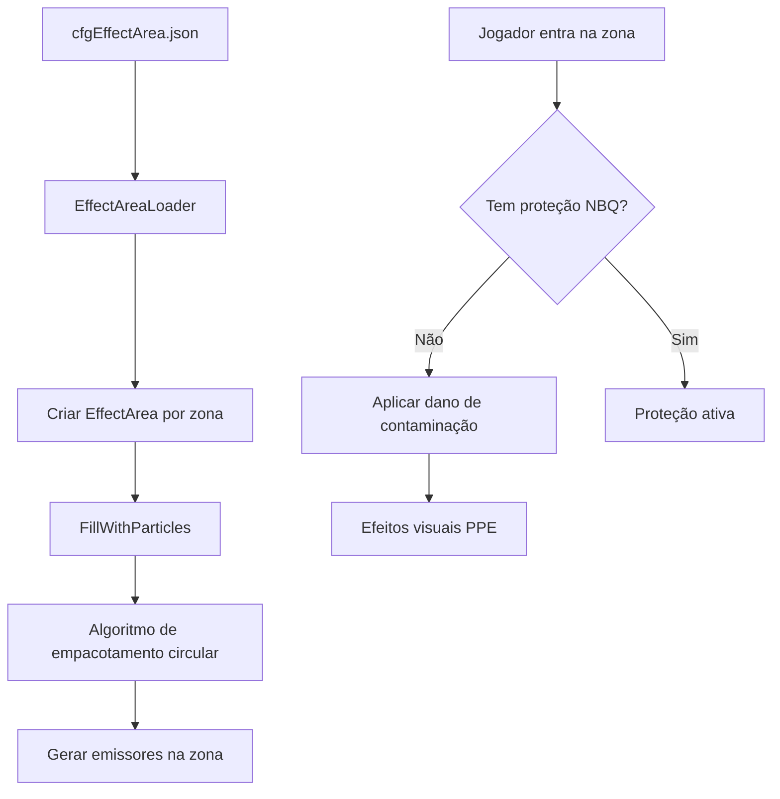

# Capítulo 6.23: Sistemas de Configuração de Mundo

[Início](../../README.md) | [<< Anterior: Administração e Gerenciamento de Servidor](22-admin-server.md) | **Sistemas de Mundo**

---

## Introdução

O DayZ fornece vários arquivos de configuração JSON e XML que controlam sistemas no nível do mundo sem exigir modificações de script. Esses arquivos ficam na **pasta da missão** e são carregados no início do servidor, permitindo que proprietários de servidores personalizem áreas contaminadas, escuridão subterrânea, comportamento do clima, regras de gameplay e posicionamento de objetos sem alterações de código e sem wipe necessário.

Este capítulo cobre cinco sistemas de configuração da pasta de missão:

1. **Áreas Contaminadas** (`cfgEffectArea.json`) --- zonas de gás tóxico com partículas, PPE e dano ao jogador
2. **Áreas Subterrâneas** (`cfgundergroundtriggers.json`) --- acomodação ocular (simulação de escuridão) para cavernas e bunkers
3. **Configuração de Clima** (`cfgweather.xml`) --- substituições declarativas de parâmetros meteorológicos
4. **Configurações de Gameplay** (`cfgGameplay.json`) --- stamina, construção, navegação e outros ajustes de gameplay
5. **Gerador de Objetos** --- posicionamento de objetos no mundo baseado em JSON no início da missão

---

## Áreas Contaminadas (cfgEffectArea.json)



As áreas contaminadas são zonas de gás tóxico que causam dano aos jogadores sem equipamento de proteção. Elas são configuradas através do `cfgEffectArea.json` na pasta da missão.

### Conceitos Principais

- **Áreas estáticas** são definidas no arquivo JSON e criadas no início da missão. Elas **não são persistentes** --- você pode adicionar ou remover zonas entre reinicializações sem wipe necessário.
- **Áreas dinâmicas** são geradas através da Economia Central como eventos dinâmicos (configurados separadamente através de arquivos CE, não cobertos aqui).
- Para **desabilitar todas as áreas de efeito**, coloque um arquivo JSON vazio (`{}`) na pasta da missão.

### Estrutura do Arquivo (v1.28+)

A partir da versão 1.28, a configuração de partículas usa um algoritmo de empacotamento circular via `FillWithParticles()`. Este é o formato recomendado atualmente:

```json
{
    "Areas":
    [
        {
            "AreaName": "Radunin-Village",
            "Type": "ContaminatedArea_Static",
            "TriggerType": "ContaminatedTrigger",
            "Data": {
                "Pos": [ 7347, 0, 6410 ],
                "Radius": 150,
                "PosHeight": 20,
                "NegHeight": 10,
                "InnerPartDist": 100,
                "OuterOffset": 30,
                "ParticleName": "graphics/particles/contaminated_area_gas_bigass_debug"
            },
            "PlayerData": {
                "AroundPartName": "graphics/particles/contaminated_area_gas_around",
                "TinyPartName": "graphics/particles/contaminated_area_gas_around_tiny",
                "PPERequesterType": "PPERequester_ContaminatedAreaTint"
            }
        }
    ]
}
```

### Campos da Área

| Campo | Tipo | Descrição |
|-------|------|-----------|
| `AreaName` | string | Identificador legível para a zona (também usado em debug) |
| `Type` | string | Nome da classe da subclasse de EffectArea a ser gerada (`ContaminatedArea_Static`) |
| `TriggerType` | string | Nome da classe do trigger (`ContaminatedTrigger`). Deixe vazio para nenhum trigger |
| `Pos` | float[3] | Posição no mundo `[X, Y, Z]`. Se Y for 0, a entidade se ajusta ao terreno |
| `Radius` | float | Raio da zona em metros |
| `PosHeight` | float | Altura do cilindro acima da posição âncora (metros) |
| `NegHeight` | float | Altura do cilindro abaixo da posição âncora (metros) |

### Campos de Partículas (v1.28+)

O novo sistema usa `FillWithParticles(pos, areaRadius, outwardsBleed, partSize, partId)`:

| Campo | Mapeia Para | Descrição |
|-------|-------------|-----------|
| `InnerPartDist` | `partSize` | Tamanho percebido da partícula em metros. Controla o espaçamento entre emissores |
| `OuterOffset` | `outwardsBleed` | Distância além do raio onde as partículas permanecem visíveis (metros) |
| `ParticleName` | --- | Caminho para a definição do efeito de partícula |

O algoritmo usa uma abordagem ingênua de empacotamento circular: dado o círculo da área de raio `R = Radius + OuterOffset` e círculos de partículas de raio `Rp = InnerPartDist / 2`, os emissores são empacotados com alguma margem de sobreposição.

> **Aviso de Performance:** O número máximo de emissores é limitado a 1000 por zona. Mais emissores significa pior performance. Mantenha `InnerPartDist` grande o suficiente para evitar exceder esse limite.

### Campos de Partículas (Pré-1.28, Legado)

O sistema legado usa configuração explícita de anéis. É retrocompatível mas não é recomendado para novas configurações:

| Campo | Tipo | Descrição |
|-------|------|-----------|
| `InnerRingCount` | int | Número de anéis concêntricos dentro da área (exclui anel externo) |
| `InnerPartDist` | int | Distância entre emissores nos anéis internos (metros em linha reta) |
| `OuterRingToggle` | bool | Se um anel externo de emissores é gerado |
| `OuterPartDist` | int | Distância entre emissores no anel externo |
| `OuterOffset` | int | Deslocamento do raio para o anel externo (negativo o empurra para fora) |
| `VerticalLayers` | int | Camadas verticais adicionais acima do nível do solo |
| `VerticalOffset` | int | Distância vertical entre camadas (metros) |
| `ParticleName` | string | Nome do efeito de partícula (sem prefixo `graphics/particles/` no formato antigo) |

**Fórmula de contagem de emissores legada:**

```
emissores_por_anel = 2 * PI / ACOS(1 - (espaçamento^2 / (2 * raio_do_anel^2)))
```

Para anéis internos, o raio do anel é calculado como: `raio_da_area / (contagem_de_aneis_internos + 1) * indice_do_anel`. Total de emissores = soma de todos os anéis + 1 (centro) multiplicado pelas camadas verticais.

### Dados do Jogador (PPE e Partículas)

| Campo | Descrição |
|-------|-----------|
| `AroundPartName` | Efeito de partícula gerado ao redor do jogador quando dentro da zona de trigger |
| `TinyPartName` | Efeito de partícula menor gerado perto do jogador dentro do trigger |
| `PPERequesterType` | Classe de efeito pós-processamento aplicada à câmera do jogador (`PPERequester_ContaminatedAreaTint`) |

### Impacto na Saúde do Jogador

Quando um jogador está dentro de uma zona de trigger contaminada sem proteção adequada:

- O agente de contaminação é aplicado, causando dano progressivo à saúde
- O efeito PPE tinge a visão do jogador (tonalidade verde/amarela por padrão)
- Partículas de gás aparecem ao redor do personagem do jogador

**Proteção:** Máscaras de gás com filtros intactos e trajes NBQ fornecem proteção. A lógica de proteção é tratada em script (`ContaminatedAreaAgent` e classes relacionadas), não na configuração JSON.

### Múltiplas Zonas

Adicione múltiplos objetos ao array `Areas`. Cada zona é independente:

```json
{
    "Areas":
    [
        {
            "AreaName": "Zone-Alpha",
            "Type": "ContaminatedArea_Static",
            "TriggerType": "ContaminatedTrigger",
            "Data": { "Pos": [ 4581, 0, 9592 ], "Radius": 300, "PosHeight": 25, "NegHeight": 10, "InnerPartDist": 100, "OuterOffset": 30, "ParticleName": "graphics/particles/contaminated_area_gas_bigass_debug" },
            "PlayerData": { "AroundPartName": "graphics/particles/contaminated_area_gas_around", "TinyPartName": "graphics/particles/contaminated_area_gas_around_tiny", "PPERequesterType": "PPERequester_ContaminatedAreaTint" }
        },
        {
            "AreaName": "Zone-Bravo",
            "Type": "ContaminatedArea_Static",
            "TriggerType": "ContaminatedTrigger",
            "Data": { "Pos": [ 4036, 0, 11712 ], "Radius": 150, "PosHeight": 30, "NegHeight": 60, "InnerPartDist": 80, "OuterOffset": 20, "ParticleName": "graphics/particles/contaminated_area_gas_bigass_debug" },
            "PlayerData": { "AroundPartName": "graphics/particles/contaminated_area_gas_around", "TinyPartName": "graphics/particles/contaminated_area_gas_around_tiny", "PPERequesterType": "PPERequester_ContaminatedAreaTint" }
        }
    ]
}
```

---

## Áreas Subterrâneas (cfgundergroundtriggers.json)

As áreas subterrâneas usam volumes de trigger e waypoints de migalhas de pão (breadcrumbs) para simular escuridão em cavernas, bunkers e outros espaços fechados. O sistema controla a **acomodação ocular** --- o grau em que o jogador pode ver sem fontes de luz artificial.

- Acomodação ocular `1.0` = visibilidade normal (superfície)
- Acomodação ocular `0.0` = escuridão total (subterrâneo profundo)

A configuração é armazenada em `cfgundergroundtriggers.json` na pasta da missão. Para um exemplo funcional, veja o [repositório oficial DayZ Central Economy](https://github.com/BohemiaInteractive/DayZ-Central-Economy).

> **Nota:** Os trechos JSON abaixo incluem comentários para clareza. Arquivos JSON reais não devem conter comentários.

### Objetos de Configuração

O arquivo define dois tipos de objetos:

1. **Triggers** --- volumes em forma de caixa que detectam a presença do jogador e gerenciam o nível de acomodação ocular e som ambiente
2. **Breadcrumbs** --- waypoints de ponto e raio que influenciam a acomodação ocular gradualmente dentro de triggers de transição

### Tipos de Trigger

Existem três tipos de trigger, determinados automaticamente por sua configuração:

| Tipo | Breadcrumbs? | EyeAccommodation | Propósito |
|------|-------------|-------------------|-----------|
| **Externo** | Array vazio | `1.0` | Faz luzes apenas noturnas (bastões químicos) funcionarem durante o dia. Posicionado logo fora da entrada |
| **Transição** | Tem entradas | Qualquer | Mudança gradual de acomodação ocular via breadcrumbs. Posicionado entre triggers externo e interno |
| **Interno** | Array vazio | `< 1.0` (tipicamente `0.0`) | Escuridão constante no subterrâneo profundo. Acomodação ocular fixada no valor configurado |

### Trigger Externo

Qualquer trigger com um array `Breadcrumbs` vazio e `EyeAccommodation` definido como `1` torna-se um trigger Externo. Posicione-os logo fora da entrada subterrânea:

```json
{
    "Position": [ 749.738708, 533.460144, 1228.527954 ],
    "Orientation": [ 0, 0, 0 ],
    "Size": [ 15, 5.6, 10.8 ],
    "EyeAccommodation": 1,
    "Breadcrumbs": [],
    "InterpolationSpeed": 1
}
```

| Campo | Tipo | Descrição |
|-------|------|-----------|
| `Position` | float[3] | Posição no mundo do centro do trigger |
| `Orientation` | float[3] | Rotação como Yaw, Pitch, Roll (graus) |
| `Size` | float[3] | Dimensões em X, Y, Z (metros) |
| `EyeAccommodation` | float | Nível alvo de acomodação ocular (0.0 - 1.0) |
| `Breadcrumbs` | array | Vazio para triggers externo/interno |
| `InterpolationSpeed` | float | Velocidade de transição do valor de acomodação anterior para o alvo |

### Trigger de Transição

Qualquer trigger **com breadcrumbs** automaticamente torna-se um trigger de Transição. Estes lidam com a transição gradual de claro para escuro:

```json
{
    "Position": [ 735.0, 533.7, 1229.1 ],
    "Orientation": [ 0, 0, 0 ],
    "Size": [ 15, 5.6, 10.8 ],
    "EyeAccommodation": 0,
    "Breadcrumbs":
    [
        {
            "Position": [ 741.294556, 531.522729, 1227.548218 ],
            "EyeAccommodation": 1,
            "UseRaycast": 0,
            "Radius": -1
        },
        {
            "Position": [ 739.904, 531.6, 1230.51 ],
            "EyeAccommodation": 0.7,
            "UseRaycast": 1,
            "Radius": -1
        }
    ]
}
```

### Trigger Interno

Qualquer trigger com um array `Breadcrumbs` vazio e `EyeAccommodation` menor que `1` torna-se um trigger Interno. Use-os para áreas subterrâneas profundas:

```json
{
    "Position": [ 701.8, 535.1, 1184.5 ],
    "Orientation": [ 0, 0, 0 ],
    "Size": [ 55.6, 8.6, 104.6 ],
    "EyeAccommodation": 0,
    "Breadcrumbs": [],
    "InterpolationSpeed": 1
}
```

### Configuração de Breadcrumbs

Os breadcrumbs são posicionados ao longo do caminho esperado do jogador através do trigger de transição. Cada breadcrumb ao alcance contribui para o nível atual de acomodação ocular do jogador, ponderado pela distância --- breadcrumbs mais próximos têm mais influência.

```json
{
    "Position": [ 741.294556, 531.522729, 1227.548218 ],
    "EyeAccommodation": 1,
    "UseRaycast": 0,
    "Radius": -1
}
```

| Campo | Tipo | Descrição |
|-------|------|-----------|
| `Position` | float[3] | Posição no mundo do breadcrumb |
| `EyeAccommodation` | float | O peso de acomodação que este breadcrumb contribui (0.0 - 1.0) |
| `UseRaycast` | int | Se `1`, um raio é lançado do jogador ao breadcrumb; ele só contribui se o traço não for obstruído |
| `Radius` | float | Raio de influência em metros. Defina como `-1` para o padrão do engine |

**Layout recomendado de breadcrumbs para um trigger de transição:**

1. Perto da entrada (próximo ao trigger externo): `EyeAccommodation: 1.0`
2. No meio da transição: `EyeAccommodation: 0.5`
3. Perto do trigger interno: `EyeAccommodation: 0.0`

O número exato e posicionamento depende da geometria da área de transição.

> **Dica:** Ao usar `UseRaycast: 1`, eleve a posição do breadcrumb ligeiramente acima do chão (alguns centímetros no eixo Y) para evitar que o raio seja bloqueado pela superfície do solo.

### Gerenciamento de Som

Os triggers de transição também lidam com o fade do volume do **som ambiente subterrâneo**. Conforme o jogador se aprofunda, o som ambiente aparece gradualmente. Conforme ele volta para a superfície, o som desaparece. Isso está vinculado ao mesmo sistema de trigger --- nenhuma configuração separada é necessária.

### Interpolação

O campo `InterpolationSpeed` nos triggers externo e interno controla quão rapidamente a acomodação ocular transiciona de seu valor anterior para o alvo. Valores mais altos produzem transições mais rápidas. Combinado com a ponderação de breadcrumbs em triggers de transição, isso cria uma experiência visual suave conforme os jogadores se movem entre superfície e subterrâneo.

### Depurando Áreas Subterrâneas

Usando `DayZDiag_x64`, as seguintes opções do menu de diagnóstico estão disponíveis:

| Caminho do Menu de Diagnóstico | Função |
|--------------------------------|--------|
| Script > Triggers > Show Triggers | Exibir triggers ativos e suas áreas de cobertura |
| Script > Underground Areas > Show Breadcrumbs | Exibir todos os breadcrumbs ativos |
| Script > Underground Areas > Disable Darkening | Alternar o efeito de escurecimento (também via `Ctrl+F`) |

---

## Configuração de Clima (cfgweather.xml)

Enquanto o Capítulo 6.3 cobre a API de Weather em script em detalhes, esta seção documenta o arquivo `cfgweather.xml` da pasta da missão para configuração declarativa de clima sem scripting.

### Visão Geral

Existem três maneiras de ajustar o comportamento do clima no DayZ:

1. **Máquina de estados de clima em script** --- sobrescrever `WorldData::WeatherOnBeforeChange()` (veja `4_World/Classes/Worlds/Enoch.c` para um exemplo)
2. **Script init da missão** --- chamar `MissionWeather(true)` em `init.c` e usar a API Weather
3. **cfgweather.xml** --- colocar um arquivo XML na pasta da missão (recomendado para administradores de servidor)

Por padrão, todas as missões de servidor vanilla usam a máquina de estados de clima em script. Para clima personalizado, a abordagem XML é a mais simples.

### Estrutura Completa do cfgweather.xml

```xml
<?xml version="1.0" encoding="UTF-8" standalone="yes" ?>
<weather reset="0" enable="1">
    <overcast>
        <current actual="0.45" time="120" duration="240" />
        <limits min="0.0" max="1.0" />
        <timelimits min="900" max="1800" />
        <changelimits min="0.0" max="1.0" />
    </overcast>
    <fog>
        <current actual="0.1" time="120" duration="240" />
        <limits min="0.0" max="1.0" />
        <timelimits min="900" max="1800" />
        <changelimits min="0.0" max="1.0" />
    </fog>
    <rain>
        <current actual="0.0" time="120" duration="240" />
        <limits min="0.0" max="1.0" />
        <timelimits min="300" max="600" />
        <changelimits min="0.0" max="1.0" />
        <thresholds min="0.5" max="1.0" end="120" />
    </rain>
    <windMagnitude>
        <current actual="8.0" time="120" duration="240" />
        <limits min="0.0" max="20.0" />
        <timelimits min="120" max="240" />
        <changelimits min="0.0" max="20.0" />
    </windMagnitude>
    <windDirection>
        <current actual="0.0" time="120" duration="240" />
        <limits min="-3.14" max="3.14" />
        <timelimits min="60" max="120" />
        <changelimits min="-1.0" max="1.0" />
    </windDirection>
    <snowfall>
        <current actual="0.0" time="0" duration="32768" />
        <limits min="0.0" max="0.0" />
        <timelimits min="300" max="3600" />
        <changelimits min="0.0" max="0.0" />
        <thresholds min="1.0" max="1.0" end="120" />
    </snowfall>
    <storm density="1.0" threshold="0.7" timeout="25"/>
</weather>
```

### Atributos do Elemento Raiz

| Atributo | Tipo | Padrão | Descrição |
|----------|------|--------|-----------|
| `reset` | bool | `false` | Se deve descartar o estado do clima armazenado ao iniciar o servidor |
| `enable` | bool | `true` | Se este arquivo está ativo |

Suporta `0`/`1`, `true`/`false`, ou `yes`/`no`.

### Parâmetros de Fenômenos

Cada fenômeno (`overcast`, `fog`, `rain`, `snowfall`, `windMagnitude`, `windDirection`) suporta estes elementos filhos:

| Elemento | Atributos | Descrição |
|----------|-----------|-----------|
| `current` | `actual`, `time`, `duration` | Valor inicial, segundos para alcançá-lo, segundos que ele mantém |
| `limits` | `min`, `max` | Intervalo do valor do fenômeno |
| `timelimits` | `min`, `max` | Intervalo de quanto tempo (segundos) uma transição leva |
| `changelimits` | `min`, `max` | Intervalo de quanto o valor pode mudar por transição |
| `thresholds` | `min`, `max`, `end` | Intervalo de nebulosidade que permite este fenômeno; `end` = segundos para parar se fora do intervalo |

`thresholds` aplica-se apenas a **chuva** e **neve** --- esses fenômenos requerem nebulosidade suficiente para aparecer.

### Configuração de Tempestade

```xml
<storm density="1.0" threshold="0.7" timeout="25"/>
```

| Atributo | Descrição |
|----------|-----------|
| `density` | Frequência de raios (0.0 - 1.0) |
| `threshold` | Nível mínimo de nebulosidade para raios aparecerem (0.0 - 1.0) |
| `timeout` | Segundos entre raios |

### Formatação XML Alternativa

Todos os parâmetros float podem ser escritos como atributos ou elementos filhos:

```xml
<!-- Estilo de atributo (compacto) -->
<limits min="0" max="1"/>

<!-- Estilo de elemento (verboso) -->
<limits>
    <min>0</min>
    <max>1</max>
</limits>
```

Ambos os formatos são equivalentes. Você pode misturá-los livremente dentro do mesmo arquivo.

### Perfis de Clima Comuns

**Céu permanentemente limpo (sem chuva, sem neblina):**

```xml
<weather reset="1" enable="1">
    <overcast>
        <current actual="0.0" time="0" duration="32768" />
        <limits min="0.0" max="0.2" />
    </overcast>
    <rain>
        <limits min="0.0" max="0.0" />
    </rain>
    <fog>
        <limits min="0.0" max="0.1" />
    </fog>
</weather>
```

**Inverno rigoroso (neve constante, sem chuva):**

```xml
<weather reset="1" enable="1">
    <overcast>
        <current actual="0.8" time="0" duration="32768" />
        <limits min="0.6" max="1.0" />
    </overcast>
    <rain>
        <limits min="0.0" max="0.0" />
    </rain>
    <snowfall>
        <current actual="0.7" time="60" duration="3600" />
        <limits min="0.3" max="1.0" />
        <thresholds min="0.5" max="1.0" end="120" />
    </snowfall>
</weather>
```

> **Nota:** Você só precisa incluir os fenômenos que deseja modificar. Fenômenos omitidos usam os padrões do engine.

---

## Configurações de Gameplay (cfgGameplay.json)

O arquivo `cfgGameplay.json` fornece aos administradores de servidor uma forma de ajustar o comportamento de gameplay sem modificar scripts.

### Configuração Inicial

1. Copie o `cfgGameplay.json` de `DZ/worlds/chernarusplus/ce/` (ou do [GitHub DayZ Central Economy](https://github.com/BohemiaInteractive/DayZ-Central-Economy)) para sua pasta de missão
2. Adicione `enableCfgGameplayFile = 1;` ao seu `serverDZ.cfg`
3. Modifique os valores conforme necessário e reinicie o servidor

### Configurações Gerais

| Tipo | Parâmetro | Padrão | Descrição |
|------|-----------|--------|-----------|
| int | `version` | Atual | Rastreador de versão interno |
| string[] | `spawnGearPresetFiles` | `[]` | Arquivos de configuração JSON de equipamento inicial do jogador para carregar |
| string[] | `objectSpawnersArr` | `[]` | Arquivos JSON do Gerador de Objetos (veja seção do Gerador de Objetos abaixo) |
| bool | `disableRespawnDialog` | `false` | Desabilitar a UI de seleção de tipo de respawn |
| bool | `disableRespawnInUnconsciousness` | `false` | Remover o botão "Respawn" quando inconsciente |
| bool | `disablePersonalLight` | `false` | Desabilitar a luz pessoal sutil durante a noite |
| int | `lightingConfig` | `1` | Iluminação noturna (0 = claro, 1 = escuro) |
| float[] | `wetnessWeightModifiers` | `[1.0, 1.0, 1.33, 1.66, 2.0]` | Multiplicadores de peso de item por nível de umidade: Seco, Úmido, Molhado, Encharcado, Ensopado |
| float | `boatDecayMultiplier` | `1` | Multiplicador para velocidade de deterioração de barcos |
| string[] | `playerRestrictedAreaFiles` | `["pra/warheadstorage.json"]` | Arquivos de configuração de área restrita do jogador |

### Configurações de Stamina

| Tipo | Parâmetro | Padrão | Descrição |
|------|-----------|--------|-----------|
| float | `sprintStaminaModifierErc` | `1.0` | Taxa de consumo de stamina durante sprint em pé |
| float | `sprintStaminaModifierCro` | `1.0` | Taxa de consumo de stamina durante sprint agachado |
| float | `staminaWeightLimitThreshold` | `6000.0` | Pontos de stamina (divididos por 1000) isentos de dedução por peso |
| float | `staminaMax` | `100.0` | Stamina máxima (não defina como 0) |
| float | `staminaKgToStaminaPercentPenalty` | `1.75` | Multiplicador de dedução de stamina baseado na carga do jogador |
| float | `staminaMinCap` | `5.0` | Limite mínimo de stamina (não defina como 0) |
| float | `sprintSwimmingStaminaModifier` | `1.0` | Consumo de stamina durante natação rápida |
| float | `sprintLadderStaminaModifier` | `1.0` | Consumo de stamina durante escalada rápida de escada |
| float | `meleeStaminaModifier` | `1.0` | Stamina consumida por ataque corpo a corpo pesado e evasão |
| float | `obstacleTraversalStaminaModifier` | `1.0` | Stamina consumida por pulo, escalada, salto |
| float | `holdBreathStaminaModifier` | `1.0` | Consumo de stamina ao prender a respiração |

### Configurações de Shock

| Tipo | Parâmetro | Padrão | Descrição |
|------|-----------|--------|-----------|
| float | `shockRefillSpeedConscious` | `5.0` | Recuperação de shock por segundo enquanto consciente |
| float | `shockRefillSpeedUnconscious` | `1.0` | Recuperação de shock por segundo enquanto inconsciente |
| bool | `allowRefillSpeedModifier` | `true` | Permitir modificador de recuperação de shock baseado no tipo de munição |

### Configurações de Inércia

| Tipo | Parâmetro | Padrão | Descrição |
|------|-----------|--------|-----------|
| float | `timeToStrafeJog` | `0.1` | Tempo para misturar movimentação lateral ao trotar (mín 0.01) |
| float | `rotationSpeedJog` | `0.15` | Velocidade de rotação do personagem ao trotar (mín 0.01) |
| float | `timeToSprint` | `0.45` | Tempo para alcançar sprint a partir do trote (mín 0.01) |
| float | `timeToStrafeSprint` | `0.3` | Tempo para misturar movimentação lateral ao sprintar (mín 0.01) |
| float | `rotationSpeedSprint` | `0.15` | Velocidade de rotação ao sprintar (mín 0.01) |
| bool | `allowStaminaAffectInertia` | `true` | Permitir que a stamina influencie a inércia |

### Construção de Base e Posicionamento de Objetos

Estes booleanos desabilitam verificações específicas de validação de posicionamento/construção:

| Parâmetro | Padrão | O Que Desabilita |
|-----------|--------|------------------|
| `disableBaseDamage` | `false` | Dano de estruturas de construção de base |
| `disableContainerDamage` | `false` | Dano de tendas, barris, etc. |
| `disableIsCollidingBBoxCheck` | `false` | Colisão de bounding-box com objetos do mundo |
| `disableIsCollidingPlayerCheck` | `false` | Colisão com jogadores |
| `disableIsClippingRoofCheck` | `false` | Clipping com telhados |
| `disableIsBaseViableCheck` | `false` | Posicionamento em superfícies dinâmicas/incompatíveis |
| `disableIsCollidingGPlotCheck` | `false` | Restrição de tipo de superfície para horta |
| `disableIsCollidingAngleCheck` | `false` | Verificação de limite de rolagem/inclinação/yaw |
| `disableIsPlacementPermittedCheck` | `false` | Permissão rudimentar de posicionamento |
| `disableHeightPlacementCheck` | `false` | Restrição de espaço em altura |
| `disableIsUnderwaterCheck` | `false` | Restrição de posicionamento subaquático |
| `disableIsInTerrainCheck` | `false` | Restrição de clipping com terreno |
| `disableColdAreaPlacementCheck` | `false` | Restrição de solo congelado para horta |
| `disablePerformRoofCheck` | `false` | Clipping de construção com telhado |
| `disableIsCollidingCheck` | `false` | Colisão de construção com objetos do mundo |
| `disableDistanceCheck` | `false` | Distância mínima de construção |
| `disallowedTypesInUnderground` | `["FenceKit", "TerritoryFlagKit", "WatchtowerKit"]` | Tipos de item proibidos no subterrâneo (inclui herdados) |

### Configurações de Navegação

| Tipo | Parâmetro | Padrão | Descrição |
|------|-----------|--------|-----------|
| bool | `use3DMap` | `false` | Usar apenas mapa 3D (desabilita sobreposição 2D) |
| bool | `ignoreMapOwnership` | `false` | Abrir mapa com tecla "M" sem ter um no inventário |
| bool | `ignoreNavItemsOwnership` | `false` | Mostrar auxiliares de bússola/GPS sem possuir os itens |
| bool | `displayPlayerPosition` | `false` | Mostrar marcador vermelho de posição do jogador no mapa |
| bool | `displayNavInfo` | `true` | Mostrar UI de GPS/bússola na legenda do mapa |

### Configurações de Indicador de Acerto

| Tipo | Parâmetro | Padrão | Descrição |
|------|-----------|--------|-----------|
| bool | `hitDirectionOverrideEnabled` | `false` | Habilitar configurações personalizadas de indicador de acerto |
| int | `hitDirectionBehaviour` | `1` | 0 = Desabilitado, 1 = Estático, 2 = Dinâmico |
| int | `hitDirectionStyle` | `0` | 0 = Respingo, 1 = Espinho, 2 = Seta |
| string | `hitDirectionIndicatorColorStr` | `"0xffbb0a1e"` | Cor do indicador em formato hexadecimal ARGB |
| float | `hitDirectionMaxDuration` | `2.0` | Duração máxima de exibição em segundos |
| float | `hitDirectionBreakPointRelative` | `0.2` | Fração da duração antes do início do fade-out |
| float | `hitDirectionScatter` | `10.0` | Dispersão de imprecisão em graus (aplicada +/-) |
| bool | `hitIndicationPostProcessEnabled` | `true` | Habilitar o efeito de flash vermelho de acerto |

### Configurações de Afogamento

| Tipo | Parâmetro | Padrão | Descrição |
|------|-----------|--------|-----------|
| float | `staminaDepletionSpeed` | `10.0` | Stamina perdida por segundo durante afogamento |
| float | `healthDepletionSpeed` | `10.0` | Vida perdida por segundo durante afogamento |
| float | `shockDepletionSpeed` | `10.0` | Shock perdido por segundo durante afogamento |

### Configurações de Ambiente

| Tipo | Parâmetro | Padrão | Descrição |
|------|-----------|--------|-----------|
| float[12] | `environmentMinTemps` | `[-3, -2, 0, 4, 9, 14, 18, 17, 12, 7, 4, 0]` | Temperatura mínima por mês (Jan-Dez) |
| float[12] | `environmentMaxTemps` | `[3, 5, 7, 14, 19, 24, 26, 25, 21, 16, 10, 5]` | Temperatura máxima por mês (Jan-Dez) |

### Configurações de Obstrução de Arma

| Tipo | Parâmetro | Padrão | Descrição |
|------|-----------|--------|-----------|
| int | `staticMode` | `1` | Obstrução por entidade estática (0 = Desligado, 1 = Ligado, 2 = Sempre) |
| int | `dynamicMode` | `1` | Obstrução por entidade dinâmica (0 = Desligado, 1 = Ligado, 2 = Sempre) |

### Formato de Cor ARGB

O `hitDirectionIndicatorColorStr` usa formato hexadecimal ARGB como string:

```
"0xAARRGGBB"
```

- `AA` = Alpha (00-FF)
- `RR` = Vermelho (00-FF)
- `GG` = Verde (00-FF)
- `BB` = Azul (00-FF)

Exemplo: `"0xffbb0a1e"` = vermelho escuro totalmente opaco. O valor não diferencia maiúsculas/minúsculas.

---

## Gerador de Objetos

O Gerador de Objetos permite que administradores de servidor posicionem objetos no mundo através de arquivos JSON, carregados no início da missão.

### Configuração

1. Habilite o `cfgGameplay.json` (veja acima)
2. Crie um arquivo JSON (ex.: `spawnerData.json`) na pasta da missão
3. Referencie-o no `cfgGameplay.json`:

```json
"objectSpawnersArr": ["spawnerData.json"]
```

Múltiplos arquivos são suportados:

```json
"objectSpawnersArr": ["mySpawnData1.json", "mySpawnData2.json", "mySpawnData3.json"]
```

### Estrutura do Arquivo

```json
{
    "Objects": [
        {
            "name": "Land_Wall_Gate_FenR",
            "pos": [ 4395.167480, 339.012421, 10353.140625 ],
            "ypr": [ 0.0, 0.0, 0.0 ],
            "scale": 1
        },
        {
            "name": "Land_Wall_Gate_FenR",
            "pos": [ 4395.501953, 339.736824, 10356.338867 ],
            "ypr": [ 90.0, 0.0, 0.0 ],
            "scale": 2
        },
        {
            "name": "Apple",
            "pos": [ 4395.501953, 339.736824, 10362.338867 ],
            "ypr": [ 0.0, 0.0, 0.0 ],
            "scale": 1,
            "enableCEPersistency": true
        }
    ]
}
```

### Parâmetros do Objeto

| Tipo | Campo | Descrição |
|------|-------|-----------|
| string | `name` | Nome da classe (ex.: `"Land_Wall_Gate_FenR"`) ou caminho do modelo p3d (ex.: `"DZ/plants/tree/t_BetulaPendula_1fb.p3d"`) |
| float[3] | `pos` | Posição no mundo `[X, Y, Z]` |
| float[3] | `ypr` | Orientação como Yaw, Pitch, Roll (graus) |
| float | `scale` | Multiplicador de tamanho (1.0 = tamanho original) |
| bool | `enableCEPersistency` | Quando `true`, gera sem persistência; persistência é habilitada quando um jogador interage com o item |
| string | `customString` | Dados personalizados do usuário, tratados ao sobrescrever `OnSpawnByObjectSpawner()` na classe de script do item |

### Limitações de Caminho de Modelo P3D

Apenas estes caminhos são suportados para geração direta de p3d:

- `DZ/plants`, `DZ/plants_bliss`, `DZ/plants_sakhal`
- `DZ/rocks`, `DZ/rocks_bliss`, `DZ/rocks_sakhal`

### Tratamento de Dados Personalizados

Para processar `customString`, sobrescreva `OnSpawnByObjectSpawner()` na classe de script do item gerado. Veja `StaticFlagPole` nos scripts vanilla para um exemplo onde a string personalizada especifica qual bandeira gerar no mastro.

> **Aviso de Performance:** Gerar um grande número de objetos através deste sistema impacta tanto a performance do servidor quanto do cliente. Use-o para objetos de detalhe e pequenas adições, não para modificações de mundo em grande escala.

---

## Boas Práticas

### Áreas Contaminadas

- **Comece com valores grandes de `InnerPartDist`** (80-100) para manter contagens de emissores baixas. Diminua apenas se a cobertura visual for insuficiente.
- **Teste a performance das partículas** com a contagem de jogadores alvo. Cada zona com muitos emissores tem um impacto mensurável no FPS do lado do cliente.
- **Use o formato v1.28+** para novas configurações. O sistema legado baseado em anéis é mantido para retrocompatibilidade mas a abordagem de empacotamento circular é mais simples e produz melhores resultados visuais.
- **Deixe `TriggerType` vazio** se você quiser uma nuvem de gás apenas visual sem dano ao jogador.

### Áreas Subterrâneas

- **Posicione os triggers corretamente:** Externo (na entrada) -> Transição (corredor) -> Interno (área profunda). Eles devem ser adjacentes com leve sobreposição.
- **Coloque pelo menos 3 breadcrumbs** em triggers de transição: um perto da entrada (`EyeAccommodation: 1.0`), um no meio (`0.5`), um perto do trigger interno (`0.0`).
- **Eleve breadcrumbs com raycast** ligeiramente acima do chão no eixo Y para prevenir interferência do solo.
- **Use o menu de diagnóstico** para visualizar volumes de trigger e posições de breadcrumbs durante o desenvolvimento.

### Clima (cfgweather.xml)

- **Inclua apenas os fenômenos que deseja alterar.** Fenômenos omitidos usam os padrões do engine.
- **Defina `reset="1"`** quando quiser um estado limpo de clima a cada reinicialização, ignorando persistência armazenada.
- **Chuva requer nebulosidade.** Se o `limits max` da sua nebulosidade estiver abaixo do `thresholds min` da chuva, a chuva nunca aparecerá.
- **Neve e chuva compartilham limiares de nebulosidade** mas são tipicamente mutuamente exclusivas por intervalos de limiar.

### Configurações de Gameplay

- **Sempre copie o `cfgGameplay.json` mais recente** do repositório oficial Central Economy. O formato do arquivo evolui com atualizações do jogo.
- **Não defina `staminaMax` ou `staminaMinCap` como 0** --- isso produz comportamento inesperado.
- **Todos os valores de inércia têm mínimo de 0.01** --- defini-los mais baixo não tem efeito adicional.
- **Teste as flags de desabilitar construção de base cuidadosamente.** Desabilitar verificações de colisão pode permitir que jogadores construam dentro do terreno ou paredes.

### Gerador de Objetos

- **Mantenha contagens de objetos razoáveis.** Cada objeto gerado consome recursos do servidor e do cliente.
- **Use nomes de classe em vez de caminhos p3d** quando possível --- caminhos p3d são limitados a diretórios específicos.
- **Cada entrada de objeto exceto a última deve terminar com vírgula** no array JSON.

---

## Erros Comuns

| Erro | Consequência | Correção |
|------|-------------|----------|
| Comentários JSON (`//` ou `/* */`) em arquivos de configuração | Arquivo falha ao ser analisado; recursos silenciosamente desabilitados | Remova todos os comentários de arquivos JSON de produção |
| Formato de número inválido (`0150` em vez de `150`) | Erro de análise JSON | Use notação padrão de inteiro/float |
| `enableCfgGameplayFile = 1` ausente no `serverDZ.cfg` | `cfgGameplay.json` é completamente ignorado | Adicione o parâmetro à configuração do servidor |
| Definir máximo de nebulosidade abaixo do limiar de chuva | Chuva nunca aparece apesar da configuração | Garanta que `limits max` da nebulosidade >= `thresholds min` da chuva |
| Muitos emissores de partículas por zona | FPS do cliente cai significativamente | Aumente `InnerPartDist` ou reduza `Radius` |
| Breadcrumbs colocados no chão com `UseRaycast: 1` | Raycast bloqueado pelo solo; breadcrumb não tem efeito | Eleve a posição Y do breadcrumb alguns centímetros |
| Triggers internos sobrepostos com diferentes `EyeAccommodation` | Piscamento imprevisível de escuridão | Garanta que triggers internos não se sobreponham |
| Vírgula ausente entre entradas do array JSON | Erro de análise; arquivo inteiro falha ao carregar | Valide o JSON antes de implantar |
| Definir `staminaMax` como 0 | Comportamento indefinido, potencial crash | Use um valor positivo (mínimo 1.0) |
| Gerar centenas de objetos via Gerador de Objetos | Degradação de performance do servidor e cliente | Mantenha contagens de objetos gerados mínimas |

---

## Compatibilidade e Impacto

### Áreas Contaminadas

- **Sem wipe necessário** para adicionar ou remover zonas estáticas entre reinicializações. As entidades não são persistentes.
- **Compatibilidade com mods:** Mods que sobrescrevem classes `ContaminatedArea_Static` ou `ContaminatedTrigger` afetarão todas as zonas configuradas. Apenas uma cadeia de sobrescrita executa por classe.
- **Zonas dinâmicas** (geradas pelo CE) usam padrões de script e são configuradas através da Economia Central, não pelo `cfgEffectArea.json`.

### Áreas Subterrâneas

- **Triggers são de nível do engine.** Eles funcionam com qualquer mod de terreno/mapa que tenha geometria subterrânea.
- **Sem conflitos de mod** a menos que outro mod sobrescreva as classes do sistema de trigger subterrâneo.
- **Disponível desde 1.20** com suporte de depuração por menu de diagnóstico.

### Clima (cfgweather.xml)

- **Sobrescreve a máquina de estados de script.** Se tanto `cfgweather.xml` quanto uma sobrescrita de `WeatherOnBeforeChange()` em script estiverem ativas, os limites do XML se aplicam e o script opera dentro desses limites.
- **Apenas um cfgweather.xml é carregado** por pasta de missão. Múltiplos mods de clima não podem empilhar arquivos XML.

### Configurações de Gameplay

- **Um cfgGameplay.json por missão.** Os valores são globais --- afetam todos os jogadores no servidor.
- **A versão do arquivo deve corresponder à versão do jogo.** Arquivos desatualizados podem ter parâmetros faltantes que são definidos com valores padrão do engine.
- **Interações com mods:** Mods que sobrescrevem stamina, construção de base ou sistemas de navegação em script podem conflitar com ou sobrescrever valores do cfgGameplay.json.

### Gerador de Objetos

- **Objetos são gerados novamente a cada reinicialização.** Eles não são persistentes a menos que o jogador interaja com itens que têm `enableCEPersistency: true`.
- **O gerador executa após a inicialização do CE.** Objetos gerados não interferem com as tabelas de loot da Economia Central.
- **Gerações falhas** (nome de classe ou caminho p3d inválido) produzem "Object spawner failed to spawn" no log RPT do servidor.

---

## Resumo

| Sistema | Arquivo | Localização | Propósito |
|---------|---------|-------------|-----------|
| Áreas Contaminadas | `cfgEffectArea.json` | Pasta da missão | Zonas de gás tóxico com partículas, PPE e dano |
| Áreas Subterrâneas | `cfgundergroundtriggers.json` | Pasta da missão | Acomodação ocular (escuridão) para cavernas/bunkers |
| Clima | `cfgweather.xml` | Pasta da missão | Substituições declarativas de parâmetros meteorológicos |
| Configurações de Gameplay | `cfgGameplay.json` | Pasta da missão | Ajustes de stamina, construção, navegação, combate |
| Gerador de Objetos | Arquivos JSON personalizados | Pasta da missão | Posicionamento de objetos estáticos no início da missão |

Todos os cinco sistemas compartilham estas características:
- Configurados através de arquivos na **pasta da missão**
- Carregados no **início do servidor** (mudanças requerem reinicialização)
- Não requerem **modificações de script** para uso básico
- Podem ser **combinados com scripting** para comportamento avançado

---

[Início](../../README.md) | [<< Anterior: Administração e Gerenciamento de Servidor](22-admin-server.md) | **Sistemas de Mundo**
