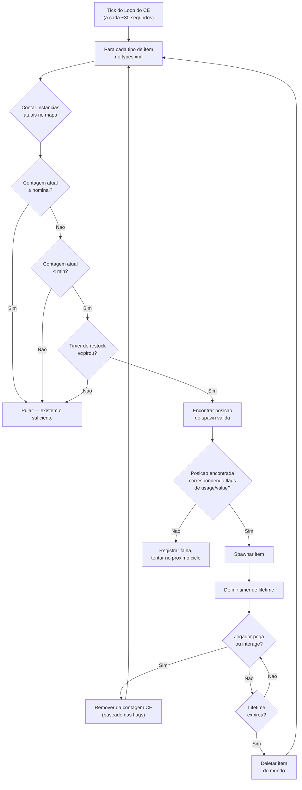

# Chapter 9.4: Economia de Loot em Profundidade

[Inicio](../README.md) | [<< Anterior: Referencia do serverDZ.cfg](03-server-cfg.md) | **Economia de Loot em Profundidade**

---

> **Resumo:** A Economia Central (CE) e o sistema que controla o spawn de todos os itens no DayZ -- de uma lata de feijao em uma prateleira ate uma AKM em um quartel militar. Este capitulo explica o ciclo completo de spawn, documenta cada campo do `types.xml`, `globals.xml`, `events.xml` e `cfgspawnabletypes.xml` com exemplos reais dos arquivos vanilla do servidor, e cobre os erros de economia mais comuns.

---

## Sumario

- [Como a Economia Central Funciona](#como-a-economia-central-funciona)
- [O Ciclo de Spawn](#o-ciclo-de-spawn)
- [types.xml -- Definicoes de Spawn de Itens](#typesxml----definicoes-de-spawn-de-itens)
- [Exemplos Reais de types.xml](#exemplos-reais-de-typesxml)
- [Referencia de Campos do types.xml](#referencia-de-campos-do-typesxml)
- [globals.xml -- Parametros da Economia](#globalsxml----parametros-da-economia)
- [events.xml -- Eventos Dinamicos](#eventsxml----eventos-dinamicos)
- [cfgspawnabletypes.xml -- Anexos e Carga](#cfgspawnabletypesxml----anexos-e-carga)
- [A Relacao Nominal/Restock](#a-relacao-nominalrestock)
- [Erros Comuns na Economia](#erros-comuns-na-economia)

---

## Como a Economia Central Funciona

A Economia Central (CE) e um sistema do lado do servidor que roda em um loop continuo. Seu trabalho e manter a populacao de itens do mundo nos niveis definidos nos seus arquivos de configuracao.

O CE **nao** coloca itens quando um jogador entra em uma construcao. Em vez disso, ele roda em um timer global e spawna itens por todo o mapa, independentemente da proximidade do jogador. Itens possuem um **lifetime** -- quando esse timer expira e nenhum jogador interagiu com o item, o CE o remove. Entao, no proximo ciclo, ele detecta que a contagem esta abaixo do alvo e spawna um substituto em outro lugar.

Conceitos-chave:

- **Nominal** -- o numero-alvo de copias de um item que devem existir no mapa
- **Min** -- o limite abaixo do qual o CE tentara respawnar o item
- **Lifetime** -- por quanto tempo (em segundos) um item intocado persiste antes da limpeza
- **Restock** -- tempo minimo (em segundos) antes que o CE possa respawnar um item apos ele ser pego/destruido
- **Flags** -- o que conta para o total (no mapa, em carga, no inventario do jogador, em esconderijos)

---

## O Ciclo de Spawn



Em resumo: o CE conta quantos de cada item existem, compara com os alvos nominal/min, e spawna substitutos quando a contagem cai abaixo de `min` e o timer de `restock` expirou.

---

## types.xml -- Definicoes de Spawn de Itens

Este e o arquivo de economia mais importante. Cada item que pode spawnar no mundo precisa de uma entrada aqui. O `types.xml` vanilla de Chernarus contem aproximadamente 23.000 linhas cobrindo milhares de itens.

### Exemplos Reais de types.xml

**Arma -- AKM**

```xml
<type name="AKM">
    <nominal>3</nominal>
    <lifetime>7200</lifetime>
    <restock>3600</restock>
    <min>2</min>
    <quantmin>30</quantmin>
    <quantmax>80</quantmax>
    <cost>100</cost>
    <flags count_in_cargo="0" count_in_hoarder="0" count_in_map="1" count_in_player="0" crafted="0" deloot="0"/>
    <category name="weapons"/>
    <usage name="Military"/>
    <value name="Tier4"/>
</type>
```

A AKM e uma arma rara de alto tier. Apenas 3 podem existir no mapa simultaneamente (`nominal`). Ela spawna em construcoes Militares em areas Tier 4 (noroeste). Quando um jogador pega uma, o CE ve a contagem no mapa cair abaixo de `min=2` e spawnara um substituto apos pelo menos 3600 segundos (1 hora). A arma spawna com 30-80% de municao no carregador interno (`quantmin`/`quantmax`).

**Comida -- BakedBeansCan**

```xml
<type name="BakedBeansCan">
    <nominal>15</nominal>
    <lifetime>14400</lifetime>
    <restock>0</restock>
    <min>12</min>
    <quantmin>-1</quantmin>
    <quantmax>-1</quantmax>
    <cost>100</cost>
    <flags count_in_cargo="0" count_in_hoarder="0" count_in_map="1" count_in_player="0" crafted="0" deloot="0"/>
    <category name="food"/>
    <tag name="shelves"/>
    <usage name="Town"/>
    <usage name="Village"/>
    <value name="Tier1"/>
    <value name="Tier2"/>
    <value name="Tier3"/>
</type>
```

Feijao em lata e uma comida comum. 15 latas devem existir a qualquer momento. Elas spawnam em prateleiras em construcoes de Town e Village nos Tiers 1-3 (costa ate meio do mapa). `restock=0` significa elegibilidade instantanea para respawn. `quantmin=-1` e `quantmax=-1` significam que o item nao usa o sistema de quantidade (nao e um recipiente de liquido ou municao).

**Roupa -- RidersJacket_Black**

```xml
<type name="RidersJacket_Black">
    <nominal>14</nominal>
    <lifetime>28800</lifetime>
    <restock>0</restock>
    <min>10</min>
    <quantmin>-1</quantmin>
    <quantmax>-1</quantmax>
    <cost>100</cost>
    <flags count_in_cargo="0" count_in_hoarder="0" count_in_map="1" count_in_player="0" crafted="0" deloot="0"/>
    <category name="clothes"/>
    <usage name="Town"/>
    <value name="Tier1"/>
    <value name="Tier2"/>
</type>
```

Uma jaqueta civil comum. 14 copias no mapa, encontrada em construcoes de Town perto da costa (Tiers 1-2). Lifetime de 28800 segundos (8 horas) significa que ela persiste por bastante tempo se ninguem a pegar.

**Medico -- BandageDressing**

```xml
<type name="BandageDressing">
    <nominal>40</nominal>
    <lifetime>14400</lifetime>
    <restock>0</restock>
    <min>30</min>
    <quantmin>-1</quantmin>
    <quantmax>-1</quantmax>
    <cost>100</cost>
    <flags count_in_cargo="0" count_in_hoarder="0" count_in_map="1" count_in_player="0" crafted="0" deloot="0"/>
    <category name="tools"/>
    <tag name="shelves"/>
    <usage name="Medic"/>
</type>
```

Bandagens sao muito comuns (40 nominal). Elas spawnam em construcoes Medic (hospitais, clinicas) em todos os tiers (sem tag `<value>` significa todos os tiers). Note que a categoria e `"tools"`, nao `"medical"` -- DayZ nao tem uma categoria medical; itens medicos usam a categoria tools.

**Item desativado (variante craftada)**

```xml
<type name="AK101_Black">
    <nominal>0</nominal>
    <lifetime>28800</lifetime>
    <restock>0</restock>
    <min>0</min>
    <quantmin>-1</quantmin>
    <quantmax>-1</quantmax>
    <cost>100</cost>
    <flags count_in_cargo="0" count_in_hoarder="0" count_in_map="1" count_in_player="0" crafted="1" deloot="0"/>
    <category name="weapons"/>
</type>
```

`nominal=0` e `min=0` significa que o CE nunca spawnara este item. `crafted=1` indica que ele so pode ser obtido atraves de crafting (pintar uma arma). Ele ainda tem um lifetime para que instancias persistidas eventualmente sejam limpas.

---

## Referencia de Campos do types.xml

### Campos Principais

| Campo | Tipo | Faixa | Descricao |
|-------|------|-------|-------------|
| `name` | string | -- | Nome de classe do item. Deve corresponder exatamente ao nome de classe do jogo. |
| `nominal` | int | 0+ | Numero-alvo deste item no mapa. Defina como 0 para prevenir spawn. |
| `min` | int | 0+ | Quando a contagem cai para este valor ou abaixo, o CE tentara spawnar mais. |
| `lifetime` | int | segundos | Quanto tempo um item intocado existe antes do CE deleta-lo. |
| `restock` | int | segundos | Cooldown minimo antes do CE poder spawnar um substituto. 0 = imediato. |
| `quantmin` | int | -1 a 100 | Porcentagem minima de quantidade ao spawnar (% de municao, % de liquido). -1 = nao aplicavel. |
| `quantmax` | int | -1 a 100 | Porcentagem maxima de quantidade ao spawnar. -1 = nao aplicavel. |
| `cost` | int | 0+ | Peso de prioridade para selecao de spawn. Atualmente todos os itens vanilla usam 100. |

### Flags

```xml
<flags count_in_cargo="0" count_in_hoarder="0" count_in_map="1" count_in_player="0" crafted="0" deloot="0"/>
```

| Flag | Valores | Descricao |
|------|--------|-------------|
| `count_in_map` | 0, 1 | Conta itens no chao ou em pontos de spawn de construcoes. **Quase sempre 1.** |
| `count_in_cargo` | 0, 1 | Conta itens dentro de outros containers (mochilas, tendas). |
| `count_in_hoarder` | 0, 1 | Conta itens em esconderijos, barris, containers enterrados, tendas. |
| `count_in_player` | 0, 1 | Conta itens no inventario do jogador (no corpo ou nas maos). |
| `crafted` | 0, 1 | Quando 1, este item so pode ser obtido atraves de crafting, nao por spawn do CE. |
| `deloot` | 0, 1 | Loot de Evento Dinamico. Quando 1, o item so spawna em locais de eventos dinamicos (helicrashes, etc.). |

**A estrategia de flags importa.** Se `count_in_player=1`, toda AKM que um jogador esta carregando conta para o nominal. Isso significa que pegar uma AKM nao dispararia um respawn porque a contagem nao mudou. A maioria dos itens vanilla usa `count_in_player=0` para que itens em posse de jogadores nao bloqueiem respawns.

### Tags

| Elemento | Proposito | Definido Em |
|---------|---------|-----------|
| `<category name="..."/>` | Categoria do item para correspondencia de ponto de spawn | `cfglimitsdefinition.xml` |
| `<usage name="..."/>` | Tipo de construcao onde este item pode spawnar | `cfglimitsdefinition.xml` |
| `<value name="..."/>` | Zona de tier do mapa onde este item pode spawnar | `cfglimitsdefinition.xml` |
| `<tag name="..."/>` | Tipo de posicao de spawn dentro de uma construcao | `cfglimitsdefinition.xml` |

**Categorias validas:** `tools`, `containers`, `clothes`, `food`, `weapons`, `books`, `explosives`, `lootdispatch`

**Flags de uso validas:** `Military`, `Police`, `Medic`, `Firefighter`, `Industrial`, `Farm`, `Coast`, `Town`, `Village`, `Hunting`, `Office`, `School`, `Prison`, `Lunapark`, `SeasonalEvent`, `ContaminatedArea`, `Historical`

**Flags de valor validas:** `Tier1`, `Tier2`, `Tier3`, `Tier4`, `Unique`

**Tags validas:** `floor`, `shelves`, `ground`

Um item pode ter **multiplas** tags `<usage>` e `<value>`. Multiplos usages significam que ele pode spawnar em qualquer um desses tipos de construcao. Multiplos values significam que ele pode spawnar em qualquer um desses tiers.

Se voce omitir `<value>` inteiramente, o item spawna em **todos** os tiers. Se voce omitir `<usage>`, o item nao tem local de spawn valido e **nao spawnara**.

---

## globals.xml -- Parametros da Economia

Este arquivo controla o comportamento global do CE. Todos os parametros do arquivo vanilla:

```xml
<variables>
    <var name="AnimalMaxCount" type="0" value="200"/>
    <var name="CleanupAvoidance" type="0" value="100"/>
    <var name="CleanupLifetimeDeadAnimal" type="0" value="1200"/>
    <var name="CleanupLifetimeDeadInfected" type="0" value="330"/>
    <var name="CleanupLifetimeDeadPlayer" type="0" value="3600"/>
    <var name="CleanupLifetimeDefault" type="0" value="45"/>
    <var name="CleanupLifetimeLimit" type="0" value="50"/>
    <var name="CleanupLifetimeRuined" type="0" value="330"/>
    <var name="FlagRefreshFrequency" type="0" value="432000"/>
    <var name="FlagRefreshMaxDuration" type="0" value="3456000"/>
    <var name="FoodDecay" type="0" value="1"/>
    <var name="IdleModeCountdown" type="0" value="60"/>
    <var name="IdleModeStartup" type="0" value="1"/>
    <var name="InitialSpawn" type="0" value="100"/>
    <var name="LootDamageMax" type="1" value="0.82"/>
    <var name="LootDamageMin" type="1" value="0.0"/>
    <var name="LootProxyPlacement" type="0" value="1"/>
    <var name="LootSpawnAvoidance" type="0" value="100"/>
    <var name="RespawnAttempt" type="0" value="2"/>
    <var name="RespawnLimit" type="0" value="20"/>
    <var name="RespawnTypes" type="0" value="12"/>
    <var name="RestartSpawn" type="0" value="0"/>
    <var name="SpawnInitial" type="0" value="1200"/>
    <var name="TimeHopping" type="0" value="60"/>
    <var name="TimeLogin" type="0" value="15"/>
    <var name="TimeLogout" type="0" value="15"/>
    <var name="TimePenalty" type="0" value="20"/>
    <var name="WorldWetTempUpdate" type="0" value="1"/>
    <var name="ZombieMaxCount" type="0" value="1000"/>
    <var name="ZoneSpawnDist" type="0" value="300"/>
</variables>
```

O atributo `type` indica o tipo de dado: `0` = inteiro, `1` = float.

### Referencia Completa de Parametros

| Parametro | Tipo | Padrao | Descricao |
|-----------|------|---------|-------------|
| **AnimalMaxCount** | int | 200 | Numero maximo de animais vivos no mapa simultaneamente. |
| **CleanupAvoidance** | int | 100 | Distancia em metros de um jogador onde o CE NAO limpara itens. Itens dentro desse raio estao protegidos da expiracao de lifetime. |
| **CleanupLifetimeDeadAnimal** | int | 1200 | Segundos antes de um corpo de animal morto ser removido. (20 minutos) |
| **CleanupLifetimeDeadInfected** | int | 330 | Segundos antes de um corpo de zumbi morto ser removido. (5,5 minutos) |
| **CleanupLifetimeDeadPlayer** | int | 3600 | Segundos antes de um corpo de jogador morto ser removido. (1 hora) |
| **CleanupLifetimeDefault** | int | 45 | Tempo de limpeza padrao em segundos para itens sem lifetime especifico. |
| **CleanupLifetimeLimit** | int | 50 | Numero maximo de itens processados por ciclo de limpeza. |
| **CleanupLifetimeRuined** | int | 330 | Segundos antes de itens arruinados serem limpos. (5,5 minutos) |
| **FlagRefreshFrequency** | int | 432000 | Com que frequencia um mastro de bandeira deve ser "refreshed" por interacao para prevenir decadencia de base, em segundos. (5 dias) |
| **FlagRefreshMaxDuration** | int | 3456000 | Lifetime maximo de um mastro de bandeira mesmo com refresh regular, em segundos. (40 dias) |
| **FoodDecay** | int | 1 | Ativar (1) ou desativar (0) deterioracao de comida ao longo do tempo. |
| **IdleModeCountdown** | int | 60 | Segundos antes do servidor entrar em modo ocioso quando nenhum jogador esta conectado. |
| **IdleModeStartup** | int | 1 | Se o servidor inicia em modo ocioso (1) ou modo ativo (0). |
| **InitialSpawn** | int | 100 | Porcentagem dos valores nominais a spawnar no primeiro inicio do servidor (0-100). |
| **LootDamageMax** | float | 0.82 | Estado maximo de dano para loot spawnado aleatoriamente (0.0 = pristine, 1.0 = arruinado). |
| **LootDamageMin** | float | 0.0 | Estado minimo de dano para loot spawnado aleatoriamente. |
| **LootProxyPlacement** | int | 1 | Ativar (1) colocacao visual de itens em prateleiras/mesas vs drops aleatorios no chao. |
| **LootSpawnAvoidance** | int | 100 | Distancia em metros de um jogador onde o CE NAO spawnara loot novo. Previne itens aparecendo na frente dos jogadores. |
| **RespawnAttempt** | int | 2 | Numero de tentativas de posicao de spawn por item por ciclo do CE antes de desistir. |
| **RespawnLimit** | int | 20 | Numero maximo de itens que o CE respawnara por ciclo. |
| **RespawnTypes** | int | 12 | Numero maximo de tipos de itens diferentes processados por ciclo de respawn. |
| **RestartSpawn** | int | 0 | Quando 1, re-aleatoriza todas as posicoes de loot no reinicio do servidor. Quando 0, carrega da persistencia. |
| **SpawnInitial** | int | 1200 | Numero de itens a spawnar durante a populacao economica inicial no primeiro inicio. |
| **TimeHopping** | int | 60 | Cooldown em segundos prevenindo um jogador de reconectar ao mesmo servidor (anti-server-hop). |
| **TimeLogin** | int | 15 | Timer de contagem regressiva de login em segundos (o timer "Aguarde" ao conectar). |
| **TimeLogout** | int | 15 | Timer de contagem regressiva de logout em segundos. O jogador permanece no mundo durante esse tempo. |
| **TimePenalty** | int | 20 | Tempo de penalidade extra em segundos adicionado ao timer de logout se o jogador desconectar de forma indevida (Alt+F4). |
| **WorldWetTempUpdate** | int | 1 | Ativar (1) ou desativar (0) atualizacoes de simulacao de temperatura e umidade do mundo. |
| **ZombieMaxCount** | int | 1000 | Numero maximo de zumbis vivos no mapa simultaneamente. |
| **ZoneSpawnDist** | int | 300 | Distancia em metros de um jogador na qual zonas de spawn de zumbis se tornam ativas. |

### Ajustes Comuns

**Mais loot (servidor PvP):**
```xml
<var name="InitialSpawn" type="0" value="100"/>
<var name="RespawnLimit" type="0" value="50"/>
<var name="RespawnTypes" type="0" value="30"/>
<var name="RespawnAttempt" type="0" value="4"/>
```

**Corpos mortos mais duraveis (mais tempo para lootar kills):**
```xml
<var name="CleanupLifetimeDeadPlayer" type="0" value="7200"/>
```

**Decadencia de base mais rapida (limpar bases abandonadas mais rapido):**
```xml
<var name="FlagRefreshFrequency" type="0" value="259200"/>
<var name="FlagRefreshMaxDuration" type="0" value="1728000"/>
```

---

## events.xml -- Eventos Dinamicos

Eventos definem spawns para entidades que precisam de tratamento especial: animais, veiculos e helicrashes. Diferente dos itens do `types.xml` que spawnam dentro de construcoes, eventos spawnam em posicoes predefinidas do mundo listadas no `cfgeventspawns.xml`.

### Exemplo Real de Evento de Veiculo

```xml
<event name="VehicleCivilianSedan">
    <nominal>8</nominal>
    <min>5</min>
    <max>11</max>
    <lifetime>300</lifetime>
    <restock>0</restock>
    <saferadius>500</saferadius>
    <distanceradius>500</distanceradius>
    <cleanupradius>200</cleanupradius>
    <flags deletable="0" init_random="0" remove_damaged="1"/>
    <position>fixed</position>
    <limit>mixed</limit>
    <active>1</active>
    <children>
        <child lootmax="0" lootmin="0" max="5" min="3" type="CivilianSedan"/>
        <child lootmax="0" lootmin="0" max="5" min="3" type="CivilianSedan_Black"/>
        <child lootmax="0" lootmin="0" max="5" min="3" type="CivilianSedan_Wine"/>
    </children>
</event>
```

### Exemplo Real de Evento de Animal

```xml
<event name="AnimalBear">
    <nominal>0</nominal>
    <min>2</min>
    <max>2</max>
    <lifetime>180</lifetime>
    <restock>0</restock>
    <saferadius>200</saferadius>
    <distanceradius>0</distanceradius>
    <cleanupradius>0</cleanupradius>
    <flags deletable="0" init_random="0" remove_damaged="1"/>
    <position>fixed</position>
    <limit>custom</limit>
    <active>1</active>
    <children>
        <child lootmax="0" lootmin="0" max="1" min="1" type="Animal_UrsusArctos"/>
    </children>
</event>
```

### Referencia de Campos de Evento

| Campo | Descricao |
|-------|-------------|
| `name` | Identificador do evento. Deve corresponder a uma entrada no `cfgeventspawns.xml` para eventos com `position="fixed"`. |
| `nominal` | Numero-alvo de grupos de evento ativos no mapa. |
| `min` | Minimo de membros do grupo por ponto de spawn. |
| `max` | Maximo de membros do grupo por ponto de spawn. |
| `lifetime` | Segundos antes do evento ser limpo e respawnado. Para veiculos, este e o intervalo de verificacao de respawn, nao o lifetime de persistencia do veiculo. |
| `restock` | Segundos minimos entre respawns. |
| `saferadius` | Distancia minima em metros de um jogador para o evento spawnar. |
| `distanceradius` | Distancia minima entre duas instancias do mesmo evento. |
| `cleanupradius` | Distancia de qualquer jogador abaixo da qual o evento NAO sera limpo. |
| `deletable` | Se o evento pode ser deletado pelo CE (0 = nao). |
| `init_random` | Aleatorizar posicoes iniciais (0 = usar posicoes fixas). |
| `remove_damaged` | Remover a entidade do evento se ela ficar danificada/arruinada (1 = sim). |
| `position` | `"fixed"` = usar posicoes do `cfgeventspawns.xml`. `"player"` = spawnar perto de jogadores. |
| `limit` | `"child"` = limite por tipo filho. `"mixed"` = limite entre todos os filhos. `"custom"` = comportamento especial. |
| `active` | 1 = ativado, 0 = desativado. |

### Filhos

Cada elemento `<child>` define uma variante que pode spawnar:

| Atributo | Descricao |
|-----------|-------------|
| `type` | Nome de classe da entidade a spawnar. |
| `min` | Instancias minimas desta variante (para `limit="child"`). |
| `max` | Instancias maximas desta variante (para `limit="child"`). |
| `lootmin` | Numero minimo de itens de loot spawnados dentro/sobre a entidade. |
| `lootmax` | Numero maximo de itens de loot spawnados dentro/sobre a entidade. |

---

## cfgspawnabletypes.xml -- Anexos e Carga

Este arquivo define quais anexos, carga e estado de dano um item tem ao spawnar. Sem uma entrada aqui, itens spawnam vazios e com dano aleatorio (dentro de `LootDamageMin`/`LootDamageMax` do `globals.xml`).

### Arma com Anexos -- AKM

```xml
<type name="AKM">
    <damage min="0.45" max="0.85" />
    <attachments chance="1.00">
        <item name="AK_PlasticBttstck" chance="1.00" />
    </attachments>
    <attachments chance="1.00">
        <item name="AK_PlasticHndgrd" chance="1.00" />
    </attachments>
    <attachments chance="0.50">
        <item name="KashtanOptic" chance="0.30" />
        <item name="PSO11Optic" chance="0.20" />
    </attachments>
    <attachments chance="0.05">
        <item name="AK_Suppressor" chance="1.00" />
    </attachments>
    <attachments chance="0.30">
        <item name="Mag_AKM_30Rnd" chance="1.00" />
    </attachments>
</type>
```

Lendo esta entrada:

1. A AKM spawna com dano entre 45-85% (gasta a muito danificada)
2. Ela **sempre** (100%) recebe um coronha e handguard de plastico
3. 50% de chance de um slot de mira ser preenchido -- se for, 30% de chance para Kashtan, 20% para PSO-11
4. 5% de chance de supressor
5. 30% de chance de carregador

Cada bloco `<attachments>` representa um slot de anexo. O `chance` no bloco e a probabilidade daquele slot ser preenchido. O `chance` em cada `<item>` dentro e o peso de selecao relativa -- o CE escolhe um item da lista usando esses valores como pesos.

### Arma com Anexos -- M4A1

```xml
<type name="M4A1">
    <damage min="0.45" max="0.85" />
    <attachments chance="1.00">
        <item name="M4_OEBttstck" chance="1.00" />
    </attachments>
    <attachments chance="1.00">
        <item name="M4_PlasticHndgrd" chance="1.00" />
    </attachments>
    <attachments chance="1.00">
        <item name="BUISOptic" chance="0.50" />
        <item name="M4_CarryHandleOptic" chance="1.00" />
    </attachments>
    <attachments chance="0.30">
        <item name="Mag_CMAG_40Rnd" chance="0.15" />
        <item name="Mag_CMAG_10Rnd" chance="0.50" />
        <item name="Mag_CMAG_20Rnd" chance="0.70" />
        <item name="Mag_CMAG_30Rnd" chance="1.00" />
    </attachments>
</type>
```

### Colete com Bolsos -- PlateCarrierVest_Camo

```xml
<type name="PlateCarrierVest_Camo">
    <damage min="0.1" max="0.6" />
    <attachments chance="0.85">
        <item name="PlateCarrierHolster_Camo" chance="1.00" />
    </attachments>
    <attachments chance="0.85">
        <item name="PlateCarrierPouches_Camo" chance="1.00" />
    </attachments>
</type>
```

### Mochila com Carga

```xml
<type name="AssaultBag_Ttsko">
    <cargo preset="mixArmy" />
    <cargo preset="mixArmy" />
    <cargo preset="mixArmy" />
</type>
```

O atributo `preset` referencia um pool de loot definido no `cfgrandompresets.xml`. Cada linha `<cargo>` e uma rolagem -- esta mochila recebe 3 rolagens do pool `mixArmy`. O proprio valor `chance` do pool determina se cada rolagem realmente produz um item.

### Itens de Hoarder

```xml
<type name="Barrel_Blue">
    <hoarder />
</type>
<type name="SeaChest">
    <hoarder />
</type>
```

A tag `<hoarder />` marca itens como containers de esconderijo. O CE conta itens dentro deles separadamente usando a flag `count_in_hoarder` do `types.xml`.

### Sobrescrita de Dano de Spawn

```xml
<type name="BandageDressing">
    <damage min="0.0" max="0.0" />
</type>
```

Forca bandagens a sempre spawnarem em condicao Pristine, sobrescrevendo o `LootDamageMin`/`LootDamageMax` global do `globals.xml`.

---

## A Relacao Nominal/Restock

Entender como `nominal`, `min` e `restock` trabalham juntos e critico para ajustar sua economia.

### A Matematica

```
SE (contagem_atual < min) E (tempo_desde_ultimo_spawn > restock):
    spawnar novo item (ate nominal)
```

**Exemplo com a AKM:**
- `nominal = 3`, `min = 2`, `restock = 3600`
- Servidor inicia: CE spawna 3 AKMs pelo mapa
- Jogador pega 1 AKM: contagem no mapa cai para 2
- Contagem (2) NAO e menor que min (2), entao sem respawn ainda
- Jogador pega outra AKM: contagem no mapa cai para 1
- Contagem (1) E menor que min (2), e timer de restock (3600s = 1 hora) comeca
- Apos 1 hora, CE spawna 2 novas AKMs para alcancar nominal (3) novamente

**Exemplo com BakedBeansCan:**
- `nominal = 15`, `min = 12`, `restock = 0`
- Jogador come uma lata: contagem no mapa cai para 14
- Contagem (14) NAO e menor que min (12), entao sem respawn
- Mais 3 latas comidas: contagem cai para 11
- Contagem (11) E menor que min (12), restock e 0 (instantaneo)
- Proximo ciclo do CE: spawna 4 latas para alcancar nominal (15)

### Insights Importantes

- **Diferenca entre nominal e min** determina quantos itens podem ser "consumidos" antes do CE reagir. Uma diferenca pequena (como AKM: 3/2) significa que o CE reage apos apenas 2 coletas. Uma diferenca grande significa que mais itens podem sair da economia antes do respawn entrar em acao.

- **restock = 0** torna o respawn efetivamente instantaneo (proximo ciclo do CE). Valores altos de restock criam escassez -- o CE sabe que precisa spawnar mais mas deve esperar.

- **Lifetime** e independente de nominal/min. Mesmo que o CE tenha spawnado um item para alcancar o nominal, o item sera deletado quando seu lifetime expirar se ninguem tocar nele. Isso cria uma "rotacao" constante de itens aparecendo e desaparecendo pelo mapa.

- Itens que jogadores pegam mas depois largam (em um local diferente) ainda contam se a flag relevante estiver definida. Uma AKM largada no chao ainda conta para o total do mapa porque `count_in_map=1`.

---

## Erros Comuns na Economia

### Item Tem uma Entrada no types.xml Mas Nao Spawna

**Verifique nesta ordem:**

1. O `nominal` e maior que 0?
2. O item tem pelo menos uma tag `<usage>`? (Sem usage = sem local de spawn valido)
3. A tag `<usage>` esta definida no `cfglimitsdefinition.xml`?
4. A tag `<value>` (se presente) esta definida no `cfglimitsdefinition.xml`?
5. A tag `<category>` e valida?
6. O item esta listado no `cfgignorelist.xml`? (Itens la sao bloqueados)
7. A flag `crafted` esta definida como 1? (Itens craftados nunca spawnam naturalmente)
8. O `RestartSpawn` no `globals.xml` esta definido como 0 com persistencia existente? (Persistencia antiga pode bloquear novos itens de spawnar ate um wipe)

### Itens Spawnam Mas Desaparecem Imediatamente

O valor de `lifetime` esta muito baixo. Um lifetime de 45 segundos (o `CleanupLifetimeDefault`) significa que o item e limpo quase imediatamente. Armas devem ter lifetimes de 7200-28800 segundos.

### Itens Demais/De Menos

Ajuste `nominal` e `min` juntos. Se voce definir `nominal=100` mas `min=1`, o CE nao spawnara substitutos ate que 99 itens tenham sido pegos. Se voce quer um fornecimento constante, mantenha `min` perto de `nominal` (ex.: `nominal=20, min=15`).

### Itens So Spawnam em Uma Area

Verifique suas tags `<value>`. Se um item so tem `<value name="Tier4"/>`, ele so spawnara na area militar do noroeste de Chernarus. Adicione mais tiers para espalha-lo pelo mapa:

```xml
<value name="Tier1"/>
<value name="Tier2"/>
<value name="Tier3"/>
<value name="Tier4"/>
```

### Itens de Mods Nao Spawnam

Ao adicionar itens de um mod ao `types.xml`:

1. Certifique-se de que o mod esta carregado (listado no parametro `-mod=`)
2. Verifique se o nome de classe esta **exatamente** correto (sensivel a maiusculas/minusculas)
3. Adicione as tags de categoria/uso/valor do item -- apenas ter uma entrada no `types.xml` nao e suficiente
4. Se o mod adiciona novas tags de uso ou valor, adicione-as ao `cfglimitsdefinitionuser.xml`
5. Verifique o log de script por avisos sobre nomes de classe desconhecidos

### Pecas de Veiculo Nao Spawnam Dentro de Veiculos

Pecas de veiculos spawnam atraves do `cfgspawnabletypes.xml`, nao do `types.xml`. Se um veiculo spawna sem rodas ou bateria, verifique se o veiculo tem uma entrada no `cfgspawnabletypes.xml` com as definicoes de anexo apropriadas.

### Todo Loot Esta Pristine ou Todo Loot Esta Arruinado

Verifique `LootDamageMin` e `LootDamageMax` no `globals.xml`. Valores vanilla sao `0.0` e `0.82`. Definir ambos como `0.0` torna tudo pristine. Definir ambos como `1.0` torna tudo arruinado. Tambem verifique sobrescritas por item no `cfgspawnabletypes.xml`.

### Economia Parece "Travada" Apos Editar types.xml

Apos editar arquivos de economia, faca um destes:
- Delete `storage_1/` para um wipe completo e inicio fresco de economia
- Defina `RestartSpawn` como `1` no `globals.xml` para um reinicio para re-aleatorizar loot, depois defina de volta para `0`
- Espere os lifetimes dos itens expirarem naturalmente (pode levar horas)

---

**Anterior:** [Referencia do serverDZ.cfg](03-server-cfg.md) | [Inicio](../README.md) | **Proximo:** [Spawn de Veiculos e Eventos Dinamicos](05-vehicle-spawning.md)
