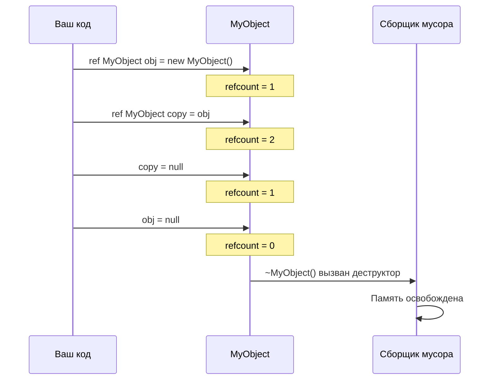
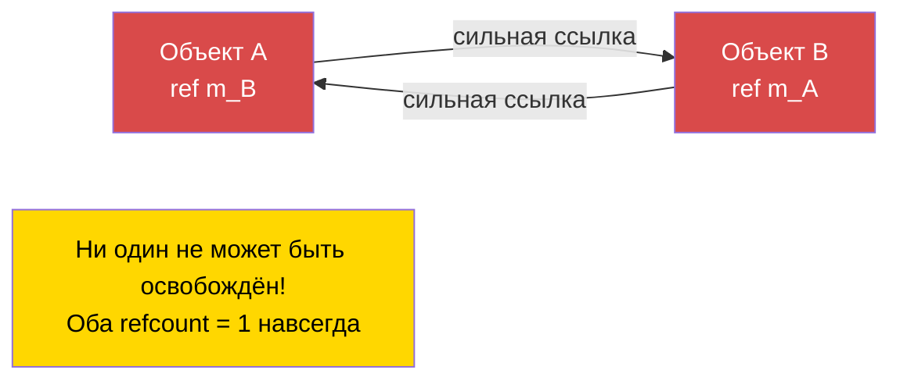

# Глава 1.8: Управление памятью

[Главная](../../README.md) | [<< Назад: Математика и векторы](07-math-vectors.md) | **Управление памятью** | [Далее: Приведение типов и рефлексия >>](09-casting-reflection.md)

---

## Введение

Enforce Script использует **автоматический подсчёт ссылок (ARC)** для управления памятью -- а не сборку мусора в традиционном понимании. Понимание того, как работают `ref`, `autoptr` и сырые указатели, необходимо для написания стабильных модов DayZ. Ошибки приведут либо к утечке памяти (ваш сервер постепенно потребляет всё больше RAM до тех пор, пока не упадёт), либо к обращению к удалённым объектам (мгновенный крэш без полезного сообщения об ошибке). Эта глава объясняет каждый тип указателя, когда использовать каждый из них, и как избежать самой опасной ловушки: циклических ссылок.

---

## Три типа указателей

Enforce Script предоставляет три способа хранения ссылки на объект:

| Тип указателя | Ключевое слово | Поддерживает объект живым? | Обнуляется при удалении? | Основное использование |
|-------------|---------|---------------------|-------------------|-------------|
| **Сырой указатель** | *(нет)* | Нет (слабая ссылка) | Только если класс наследует `Managed` | Обратные ссылки, наблюдатели, кэши |
| **Сильная ссылка** | `ref` | Да | Да | Собственные члены, коллекции |
| **Авто-указатель** | `autoptr` | Да, удаляется при выходе из области видимости | Да | Локальные переменные |

### Как работает ARC

Каждый объект имеет **счётчик ссылок** -- количество сильных ссылок (`ref`, `autoptr`, локальные переменные, аргументы функций), указывающих на него. Когда счётчик падает до нуля, объект автоматически уничтожается и вызывается его деструктор.

**Слабые ссылки** (сырые указатели) НЕ увеличивают счётчик ссылок. Они наблюдают за объектом, не удерживая его.

---

## Сырые указатели (слабые ссылки)

Сырой указатель -- это любая переменная, объявленная без `ref` или `autoptr`. Для членов класса это создаёт **слабую ссылку**: она указывает на объект, но НЕ удерживает его.

```c
class Observer
{
    PlayerBase m_WatchedPlayer;  // Слабая ссылка -- НЕ удерживает игрока

    void Watch(PlayerBase player)
    {
        m_WatchedPlayer = player;
    }

    void Report()
    {
        if (m_WatchedPlayer) // ВСЕГДА проверяйте слабые ссылки на null
        {
            Print("Watching: " + m_WatchedPlayer.GetIdentity().GetName());
        }
        else
        {
            Print("Player no longer exists");
        }
    }
}
```

### Managed и Non-Managed классы

Безопасность слабых ссылок зависит от того, наследует ли класс объекта `Managed`:

- **Managed-классы** (большинство игровых классов DayZ): при удалении объекта все слабые ссылки автоматически устанавливаются в `null`. Это безопасно.
- **Non-Managed-классы** (простой `class` без наследования `Managed`): при удалении объекта слабые ссылки становятся **висячими указателями** -- они всё ещё хранят старый адрес памяти. Обращение к ним вызывает крэш.

```c
// БЕЗОПАСНО -- Managed-класс, слабые ссылки обнуляются
class SafeData : Managed
{
    int m_Value;
}

void TestManaged()
{
    SafeData data = new SafeData();
    SafeData weakRef = data;
    delete data;

    if (weakRef) // false -- weakRef автоматически установлен в null
    {
        Print(weakRef.m_Value); // Никогда не выполнится
    }
}
```

```c
// ОПАСНО -- Non-Managed-класс, слабые ссылки становятся висячими
class UnsafeData
{
    int m_Value;
}

void TestNonManaged()
{
    UnsafeData data = new UnsafeData();
    UnsafeData weakRef = data;
    delete data;

    if (weakRef) // TRUE -- weakRef всё ещё хранит старый адрес!
    {
        Print(weakRef.m_Value); // КРЭШ! Обращение к удалённой памяти
    }
}
```

> **Правило:** если вы пишете собственные классы, всегда наследуйте от `Managed` для безопасности. Большинство классов движка DayZ (EntityAI, ItemBase, PlayerBase и др.) уже наследуют от `Managed`.

---

## ref (сильная ссылка)

Ключевое слово `ref` помечает переменную как **сильную ссылку**. Объект остаётся живым, пока существует хотя бы одна сильная ссылка. Когда последняя сильная ссылка уничтожается или перезаписывается, объект удаляется.

### Члены класса

Используйте `ref` для объектов, которые ваш класс **владеет** и отвечает за создание и уничтожение.

```c
class MissionManager
{
    protected ref array<ref MissionBase> m_ActiveMissions;
    protected ref map<string, ref MissionConfig> m_Configs;
    protected ref MyLog m_Logger;

    void MissionManager()
    {
        m_ActiveMissions = new array<ref MissionBase>;
        m_Configs = new map<string, ref MissionConfig>;
        m_Logger = new MyLog;
    }

    // Деструктор не нужен! При удалении MissionManager:
    // 1. Ссылка m_Logger освобождается -> MyLog удаляется
    // 2. Ссылка m_Configs освобождается -> map удаляется -> каждый MissionConfig удаляется
    // 3. Ссылка m_ActiveMissions освобождается -> array удаляется -> каждый MissionBase удаляется
}
```

### Коллекции принадлежащих объектов

Когда вы храните объекты в массиве или словаре и хотите, чтобы коллекция владела ими, используйте `ref` как для коллекции, ТАК И для элементов:

```c
class ZoneManager
{
    // Массив принадлежит (ref), и каждая зона внутри принадлежит (ref)
    protected ref array<ref SafeZone> m_Zones;

    void ZoneManager()
    {
        m_Zones = new array<ref SafeZone>;
    }

    void AddZone(vector center, float radius)
    {
        ref SafeZone zone = new SafeZone(center, radius);
        m_Zones.Insert(zone);
    }
}
```

**Критическое различие:** `array<SafeZone>` хранит **слабые** ссылки. `array<ref SafeZone>` хранит **сильные** ссылки. Если вы используете слабый вариант, объекты, вставленные в массив, могут быть немедленно удалены, потому что ни одна сильная ссылка не удерживает их.

```c
// НЕПРАВИЛЬНО -- Объекты удаляются сразу после вставки!
ref array<MyClass> weakArray = new array<MyClass>;
weakArray.Insert(new MyClass()); // Объект создан, вставлен как слабая ссылка,
                                  // сильной ссылки нет -> НЕМЕДЛЕННО удалён

// ПРАВИЛЬНО -- Объекты удерживаются массивом
ref array<ref MyClass> strongArray = new array<ref MyClass>;
strongArray.Insert(new MyClass()); // Объект живёт, пока находится в массиве
```

---

## autoptr (сильная ссылка с областью видимости)

`autoptr` идентичен `ref`, но предназначен для **локальных переменных**. Объект автоматически удаляется, когда переменная выходит из области видимости (когда функция возвращает управление).

```c
void ProcessData()
{
    autoptr JsonSerializer serializer = new JsonSerializer;
    // Используем serializer...

    // serializer автоматически удаляется здесь при выходе из функции
}
```

### Когда использовать autoptr

На практике **локальные переменные уже являются сильными ссылками по умолчанию** в Enforce Script. Ключевое слово `autoptr` делает это явным и самодокументируемым. Можно использовать любой вариант:

```c
void Example()
{
    // Функционально эквивалентны:
    MyClass a = new MyClass();       // Локальная переменная = сильная ссылка (неявно)
    autoptr MyClass b = new MyClass(); // Локальная переменная = сильная ссылка (явно)

    // Оба, a и b, удаляются при выходе из этой функции
}
```

> **Соглашение в моддинге DayZ:** большинство кодовых баз используют `ref` для членов класса и опускают `autoptr` для локальных переменных (полагаясь на неявное поведение сильных ссылок). В CLAUDE.md этого проекта указано: "**`autoptr` НЕ используется** -- используйте явный `ref`." Следуйте соглашению, установленному в вашем проекте.

---

## Модификатор параметра notnull

Модификатор `notnull` для параметра функции сообщает компилятору, что null не является допустимым аргументом. Компилятор принудительно проверяет это в местах вызова.

```c
void ProcessPlayer(notnull PlayerBase player)
{
    // Не нужно проверять на null -- компилятор это гарантирует
    string name = player.GetIdentity().GetName();
    Print("Processing: " + name);
}

void CallExample(PlayerBase maybeNull)
{
    if (maybeNull)
    {
        ProcessPlayer(maybeNull); // OK -- мы проверили
    }

    // ProcessPlayer(null); // ОШИБКА КОМПИЛЯЦИИ: нельзя передать null в notnull-параметр
}
```

Используйте `notnull` для параметров, где null всегда является ошибкой программиста. Это ловит баги на этапе компиляции, а не вызывает крэши во время выполнения.

---

## Циклические ссылки (ВНИМАНИЕ: УТЕЧКА ПАМЯТИ)

Циклическая ссылка возникает, когда два объекта держат сильные ссылки (`ref`) друг на друга. Ни один из объектов никогда не может быть удалён, потому что каждый удерживает другой. Это самый распространённый источник утечек памяти в модах DayZ.

### Проблема

```c
class Parent
{
    ref Child m_Child; // Сильная ссылка на Child
}

class Child
{
    ref Parent m_Parent; // Сильная ссылка на Parent -- ЦИКЛ!
}

void CreateCycle()
{
    ref Parent parent = new Parent();
    ref Child child = new Child();

    parent.m_Child = child;
    child.m_Parent = parent;

    // При выходе из функции:
    // - Локальная ссылка 'parent' освобождается, но child.m_Parent всё ещё удерживает parent
    // - Локальная ссылка 'child' освобождается, но parent.m_Child всё ещё удерживает child
    // НИ ОДИН объект никогда не будет удалён! Это постоянная утечка памяти.
}
```

### Решение: одна сторона должна быть сырой (слабой) ссылкой

Разорвите цикл, сделав одну сторону слабой ссылкой. "Потомок" должен держать слабую ссылку на "родителя":

```c
class Parent
{
    ref Child m_Child; // Сильная -- родитель ВЛАДЕЕТ потомком
}

class Child
{
    Parent m_Parent; // Слабая (сырая) -- потомок НАБЛЮДАЕТ за родителем
}

void NoCycle()
{
    ref Parent parent = new Parent();
    ref Child child = new Child();

    parent.m_Child = child;
    child.m_Parent = parent;

    // При выходе из функции:
    // - Локальная ссылка 'parent' освобождается -> счётчик ссылок parent = 0 -> УДАЛЁН
    // - Деструктор Parent освобождает m_Child -> счётчик ссылок child = 0 -> УДАЛЁН
    // Оба объекта корректно очищены!
}
```

### Пример из практики: UI-панели

Распространённый паттерн в UI-коде DayZ -- панель, которая содержит виджеты, где виджетам нужна обратная ссылка на панель. Панель владеет виджетами (сильная ссылка), а виджеты наблюдают за панелью (слабая ссылка).

```c
class AdminPanel
{
    protected ref array<ref AdminPanelTab> m_Tabs; // Владеет вкладками

    void AdminPanel()
    {
        m_Tabs = new array<ref AdminPanelTab>;
    }

    void AddTab(string name)
    {
        ref AdminPanelTab tab = new AdminPanelTab(name, this);
        m_Tabs.Insert(tab);
    }
}

class AdminPanelTab
{
    protected string m_Name;
    protected AdminPanel m_Owner; // СЛАБАЯ -- избегает цикла

    void AdminPanelTab(string name, AdminPanel owner)
    {
        m_Name = name;
        m_Owner = owner; // Слабая ссылка на родителя
    }

    AdminPanel GetOwner()
    {
        return m_Owner; // Может быть null, если панель была удалена
    }
}
```

### Жизненный цикл подсчёта ссылок



### Циклическая ссылка (утечка памяти)



---

## Ключевое слово delete

Вы можете вручную удалить объект в любой момент с помощью `delete`. Это уничтожает объект **немедленно**, независимо от его счётчика ссылок. Все ссылки (как сильные, так и слабые, для Managed-классов) устанавливаются в null.

```c
void ManualDelete()
{
    ref MyClass obj = new MyClass();
    ref MyClass anotherRef = obj;

    Print(obj != null);        // true
    Print(anotherRef != null); // true

    delete obj;

    Print(obj != null);        // false
    Print(anotherRef != null); // false (тоже обнулён, для Managed-классов)
}
```

### Когда использовать delete

- Когда нужно освободить ресурс **немедленно** (не дожидаясь ARC)
- При очистке в методе завершения/уничтожения
- При удалении объектов из игрового мира (`GetGame().ObjectDelete(obj)` для игровых сущностей)

### Когда НЕ использовать delete

- Для объектов, принадлежащих другому владельцу (`ref` владельца неожиданно станет null)
- Для объектов, всё ещё используемых другими системами (таймеры, обратные вызовы, UI)
- Для сущностей, управляемых движком, без использования надлежащих каналов

---

## Поведение сборки мусора

Enforce Script НЕ имеет традиционного сборщика мусора, который периодически сканирует недостижимые объекты. Вместо этого он использует **детерминированный подсчёт ссылок:**

1. Когда создаётся сильная ссылка (присвоение `ref`, локальная переменная, аргумент функции), счётчик ссылок объекта увеличивается.
2. Когда сильная ссылка выходит из области видимости или перезаписывается, счётчик ссылок уменьшается.
3. Когда счётчик ссылок достигает нуля, объект **немедленно** уничтожается (вызывается деструктор, память освобождается).
4. `delete` обходит счётчик ссылок и уничтожает объект немедленно.

Это означает:
- Время жизни объектов предсказуемо и детерминировано
- Нет "пауз GC" или непредсказуемых задержек
- Циклические ссылки НИКОГДА не собираются -- они являются постоянными утечками
- Порядок уничтожения чётко определён: объекты уничтожаются в обратном порядке освобождения их последней ссылки

---

## Пример из практики: правильный класс менеджера

Вот полный пример, показывающий правильные паттерны управления памятью для типичного менеджера мода DayZ:

```c
class MyZoneManager
{
    // Экземпляр-синглтон -- единственная сильная ссылка, удерживающая его
    private static ref MyZoneManager s_Instance;

    // Принадлежащие коллекции -- менеджер отвечает за них
    protected ref array<ref MyZone> m_Zones;
    protected ref map<string, ref MyZoneConfig> m_Configs;

    // Слабая ссылка на внешнюю систему -- мы не владеем этим
    protected PlayerBase m_LastEditor;

    void MyZoneManager()
    {
        m_Zones = new array<ref MyZone>;
        m_Configs = new map<string, ref MyZoneConfig>;
    }

    void ~MyZoneManager()
    {
        // Явная очистка (необязательно -- ARC обработает, но хорошая практика)
        m_Zones.Clear();
        m_Configs.Clear();
        m_LastEditor = null;

        Print("[MyZoneManager] Destroyed");
    }

    static MyZoneManager GetInstance()
    {
        if (!s_Instance)
        {
            s_Instance = new MyZoneManager();
        }
        return s_Instance;
    }

    static void DestroyInstance()
    {
        s_Instance = null; // Освобождает сильную ссылку, вызывает деструктор
    }

    void CreateZone(string name, vector center, float radius, PlayerBase editor)
    {
        ref MyZoneConfig config = new MyZoneConfig(name, center, radius);
        m_Configs.Set(name, config);

        ref MyZone zone = new MyZone(config);
        m_Zones.Insert(zone);

        m_LastEditor = editor; // Слабая ссылка -- мы не владеем игроком
    }

    void RemoveZone(int index)
    {
        if (!m_Zones.IsValidIndex(index))
            return;

        MyZone zone = m_Zones.Get(index);
        string name = zone.GetName();

        m_Zones.RemoveOrdered(index); // Сильная ссылка освобождена, зона может быть удалена
        m_Configs.Remove(name);       // Ссылка на конфиг освобождена, конфиг удалён
    }

    MyZone FindZoneAtPosition(vector pos)
    {
        foreach (MyZone zone : m_Zones)
        {
            if (zone.ContainsPosition(pos))
                return zone; // Возвращает слабую ссылку вызывающему
        }
        return null;
    }
}

class MyZone
{
    protected string m_Name;
    protected vector m_Center;
    protected float m_Radius;
    protected MyZoneConfig m_Config; // Слабая -- конфиг принадлежит менеджеру

    void MyZone(MyZoneConfig config)
    {
        m_Config = config; // Слабая ссылка
        m_Name = config.GetName();
        m_Center = config.GetCenter();
        m_Radius = config.GetRadius();
    }

    string GetName() { return m_Name; }

    bool ContainsPosition(vector pos)
    {
        return vector.Distance(m_Center, pos) <= m_Radius;
    }
}

class MyZoneConfig
{
    protected string m_Name;
    protected vector m_Center;
    protected float m_Radius;

    void MyZoneConfig(string name, vector center, float radius)
    {
        m_Name = name;
        m_Center = center;
        m_Radius = radius;
    }

    string GetName() { return m_Name; }
    vector GetCenter() { return m_Center; }
    float GetRadius() { return m_Radius; }
}
```

### Диаграмма владения памятью для этого примера

```
MyZoneManager (синглтон, принадлежит статическому s_Instance)
  |
  |-- ref array<ref MyZone>   m_Zones     [СИЛЬНАЯ -> СИЛЬНЫЕ элементы]
  |     |
  |     +-- MyZone
  |           |-- MyZoneConfig m_Config    [СЛАБАЯ -- принадлежит m_Configs]
  |
  |-- ref map<string, ref MyZoneConfig> m_Configs  [СИЛЬНАЯ -> СИЛЬНЫЕ элементы]
  |     |
  |     +-- MyZoneConfig                   [ПРИНАДЛЕЖИТ здесь]
  |
  +-- PlayerBase m_LastEditor                [СЛАБАЯ -- принадлежит движку]
```

При вызове `DestroyInstance()`:
1. `s_Instance` устанавливается в null, освобождая сильную ссылку
2. Выполняется деструктор `MyZoneManager`
3. `m_Zones` освобождается -> массив удаляется -> каждый `MyZone` удаляется
4. `m_Configs` освобождается -> словарь удаляется -> каждый `MyZoneConfig` удаляется
5. `m_LastEditor` -- слабая ссылка, ничего не нужно очищать
6. Вся память освобождена. Утечек нет.

---

## Лучшие практики

- Используйте `ref` для членов класса, которые ваш класс создаёт и которыми владеет; используйте сырые указатели (без ключевого слова) для обратных ссылок и внешних наблюдений.
- Всегда наследуйте от `Managed` для чисто скриптовых классов -- это гарантирует обнуление слабых ссылок при удалении, предотвращая крэши от висячих указателей.
- Разрывайте циклические ссылки, делая потомка хранящим сырой указатель на родителя: родитель владеет потомком (`ref`), потомок наблюдает за родителем (сырой).
- Используйте `array<ref MyClass>`, когда коллекция владеет своими элементами; `array<MyClass>` хранит слабые ссылки, которые не будут удерживать объекты.
- Предпочитайте очистку через ARC вместо ручного `delete` -- позвольте освобождению последнего `ref` вызвать деструктор естественным образом.

---

## Замечено в реальных модах

> Паттерны, подтверждённые изучением исходного кода профессиональных модов DayZ.

| Паттерн | Мод | Детали |
|---------|-----|--------|
| Родитель `ref` + обратный сырой указатель потомка | COT / Expansion UI | Панели владеют вкладками через `ref`, вкладки держат сырой указатель на родительскую панель для избежания циклов |
| `static ref` синглтон + обнуление через `Destroy()` | Dabs / VPP | Все синглтоны используют `s_Instance = null` в статическом `Destroy()` для запуска очистки |
| `ref array<ref T>` для управляемых коллекций | Expansion Market | И массив, и его элементы являются `ref` для обеспечения правильного владения |
| Сырой указатель для сущностей движка (игроки, предметы) | COT Admin | Ссылки на игроков хранятся как сырые указатели, поскольку движок управляет временем жизни сущностей |

---

## Теория и практика

| Концепция | Теория | Реальность |
|---------|--------|---------|
| `autoptr` для локальных переменных | Должен авто-удалять при выходе из области видимости | Локальные переменные и так являются неявными сильными ссылками; `autoptr` редко используется на практике |
| ARC обрабатывает всю очистку | Объекты освобождаются при достижении refcount нуля | Циклические ссылки никогда не собираются -- они утекают навсегда до перезагрузки сервера |
| `delete` для немедленной очистки | Уничтожает объект сразу | Может неожиданно обнулить ссылки, удерживаемые другими системами -- предпочитайте позволить ARC справиться |

---

## Распространённые ошибки

| Ошибка | Проблема | Решение |
|---------|---------|-----|
| Два объекта с `ref` друг на друга | Циклическая ссылка, постоянная утечка памяти | Одна сторона должна быть сырой (слабой) ссылкой |
| `array<MyClass>` вместо `array<ref MyClass>` | Элементы -- слабые ссылки, объекты могут быть сразу удалены | Используйте `array<ref MyClass>` для принадлежащих элементов |
| Обращение к сырому указателю после удаления объекта | Крэш (висячий указатель для non-Managed классов) | Наследуйте `Managed` и всегда проверяйте слабые ссылки на null |
| Отсутствие проверки слабых ссылок на null | Крэш, когда объект по ссылке был удалён | Всегда: `if (weakRef) { weakRef.DoThing(); }` |
| Использование `delete` для объектов, принадлежащих другой системе | `ref` владельца неожиданно становится null | Позвольте владельцу освободить объект через ARC |
| Хранение `ref` на сущности движка (игроки, предметы) | Может конфликтовать с управлением временем жизни движка | Используйте сырые указатели для сущностей движка |
| Забыли `ref` для коллекций -- членов класса | Коллекция -- слабая ссылка, может быть собрана | Всегда: `protected ref array<...> m_List;` |
| Циклический родитель-потомок с `ref` на обеих сторонах | Классический цикл; ни родитель, ни потомок никогда не будут освобождены | Родитель владеет потомком (`ref`), потомок наблюдает за родителем (сырой) |

---

## Руководство по выбору: какой тип указателя?

```
Это член класса, который этот класс СОЗДАЁТ и которым ВЛАДЕЕТ?
  -> ДА: Используйте ref
  -> НЕТ: Это обратная ссылка или внешнее наблюдение?
    -> ДА: Используйте сырой указатель (без ключевого слова), всегда проверяйте на null
    -> НЕТ: Это локальная переменная в функции?
      -> ДА: Сырой подходит (локальные переменные неявно сильные)
      -> Явный autoptr необязателен для ясности

Хранение объектов в коллекции (array/map)?
  -> Объекты ПРИНАДЛЕЖАТ коллекции: array<ref MyClass>
  -> Объекты НАБЛЮДАЮТСЯ коллекцией: array<MyClass>

Параметр функции, который никогда не должен быть null?
  -> Используйте модификатор notnull
```

---

## Краткая справка

```c
// Сырой указатель (слабая ссылка для членов класса)
MyClass m_Observer;              // НЕ удерживает объект
                                 // Устанавливается в null при удалении (только Managed)

// Сильная ссылка (удерживает объект)
ref MyClass m_Owned;             // Объект живёт, пока ссылка не освобождена
ref array<ref MyClass> m_List;   // И массив, И элементы удерживаются сильно

// Авто-указатель (сильная ссылка с областью видимости)
autoptr MyClass local;           // Удаляется при выходе из области видимости

// notnull (проверка null на этапе компиляции)
void Func(notnull MyClass obj);  // Компилятор отклоняет null-аргументы

// Ручное удаление (немедленное, обходит ARC)
delete obj;                      // Уничтожает немедленно, обнуляет все ссылки (Managed)

// Разрыв циклических ссылок: одна сторона должна быть слабой
class Parent { ref Child m_Child; }      // Сильная -- родитель владеет потомком
class Child  { Parent m_Parent; }        // Слабая  -- потомок наблюдает за родителем
```

---

[<< 1.7: Математика и векторы](07-math-vectors.md) | [Главная](../../README.md) | [1.9: Приведение типов и рефлексия >>](09-casting-reflection.md)
