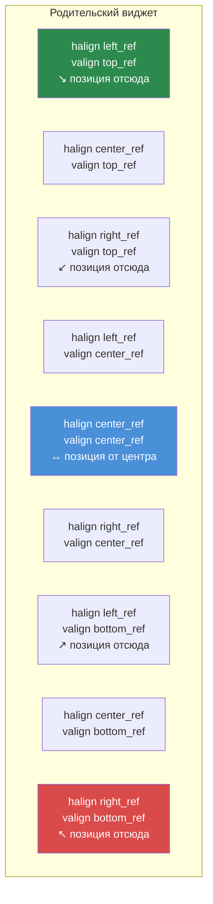

# Глава 3.3: Размеры и позиционирование

[Главная](../../README.md) | [<< Назад: Формат файлов Layout](02-layout-files.md) | **Размеры и позиционирование** | [Далее: Виджеты-контейнеры >>](04-containers.md)

---

Система компоновки DayZ использует **двойной режим координат** — каждая размерность может быть либо пропорциональной (относительно родителя), либо пиксельной (абсолютные экранные пиксели). Непонимание этой системы — причина номер один ошибок в компоновке. В этой главе она объясняется подробно.

---

## Основная концепция: пропорциональный режим и пиксельный

У каждого виджета есть позиция (`x, y`) и размер (`width, height`). Каждое из этих четырёх значений может независимо быть:

- **Пропорциональным** (от 0.0 до 1.0) — относительно размеров родительского виджета
- **Пиксельным** (любое положительное число) — абсолютные экранные пиксели

Режим для каждой оси управляется четырьмя флагами:

| Флаг | Управляет | `0` = Пропорциональный | `1` = Пиксельный |
|---|---|---|---|
| `hexactpos` | Позиция X | Доля ширины родителя | Пиксели от левого края |
| `vexactpos` | Позиция Y | Доля высоты родителя | Пиксели от верхнего края |
| `hexactsize` | Ширина | Доля ширины родителя | Ширина в пикселях |
| `vexactsize` | Высота | Доля высоты родителя | Высота в пикселях |

Это значит, что вы можете свободно комбинировать режимы. Например, виджет может иметь пропорциональную ширину, но пиксельную высоту — очень распространённый паттерн для строк и полос.

---

## Пропорциональный режим

Когда флаг равен `0` (пропорциональный), значение представляет **долю размера родителя**:

- `size 1 1` с `hexactsize 0` и `vexactsize 0` означает «100% ширины родителя, 100% высоты родителя» — дочерний виджет заполняет родителя.
- `size 0.5 0.3` означает «50% ширины родителя, 30% высоты родителя».
- `position 0.5 0` с `hexactpos 0` означает «начать с 50% ширины родителя от левого края».

Пропорциональный режим не зависит от разрешения. Виджет автоматически масштабируется при изменении размера родителя или при запуске игры в другом разрешении.

```
// Виджет, заполняющий левую половину родителя
FrameWidgetClass LeftHalf {
 position 0 0
 size 0.5 1
 hexactpos 0
 vexactpos 0
 hexactsize 0
 vexactsize 0
}
```

---

## Пиксельный режим

Когда флаг равен `1` (пиксельный/точный), значение задаётся в **экранных пикселях**:

- `size 200 40` с `hexactsize 1` и `vexactsize 1` означает «200 пикселей в ширину, 40 пикселей в высоту».
- `position 10 10` с `hexactpos 1` и `vexactpos 1` означает «10 пикселей от левого края родителя, 10 пикселей от верхнего края родителя».

Пиксельный режим даёт точный контроль, но НЕ масштабируется автоматически с разрешением.

```
// Кнопка фиксированного размера: 120x30 пикселей
ButtonWidgetClass MyButton {
 position 10 10
 size 120 30
 hexactpos 1
 vexactpos 1
 hexactsize 1
 vexactsize 1
 text "Click Me"
}
```

---

## Комбинирование режимов: самый распространённый паттерн

Настоящая мощь появляется при комбинировании пропорционального и пиксельного режимов. Самый распространённый паттерн в профессиональных DayZ-модах:

**Пропорциональная ширина, пиксельная высота** — для полос, строк и заголовков.

```
// Строка на всю ширину, ровно 30 пикселей в высоту
FrameWidgetClass Row {
 position 0 0
 size 1 30
 hexactpos 0
 vexactpos 0
 hexactsize 0        // Ширина: пропорциональная (100% родителя)
 vexactsize 1        // Высота: пиксельная (30px)
}
```

**Пропорциональные ширина и высота, пиксельная позиция** — для центрированных панелей со смещением на фиксированную величину.

```
// Панель 60% x 70%, смещение 0px от центра
FrameWidgetClass Dialog {
 position 0 0
 size 0.6 0.7
 halign center_ref
 valign center_ref
 hexactpos 1         // Позиция: пиксельная (смещение 0px от центра)
 vexactpos 1
 hexactsize 0        // Размер: пропорциональный (60% x 70%)
 vexactsize 0
}
```

---

## Ссылки выравнивания: halign и valign

Атрибуты `halign` и `valign` изменяют **точку отсчёта** для позиционирования:

| Значение | Эффект |
|---|---|
| `left_ref` (по умолчанию) | Позиция отсчитывается от левого края родителя |
| `center_ref` | Позиция отсчитывается от центра родителя |
| `right_ref` | Позиция отсчитывается от правого края родителя |
| `top_ref` (по умолчанию) | Позиция отсчитывается от верхнего края родителя |
| `center_ref` | Позиция отсчитывается от центра родителя |
| `bottom_ref` | Позиция отсчитывается от нижнего края родителя |

### Точки отсчёта выравнивания



В сочетании с пиксельной позицией (`hexactpos 1`) ссылки выравнивания делают центрирование тривиальным:

```
// Центрирован на экране без смещения
FrameWidgetClass CenteredDialog {
 position 0 0
 size 0.4 0.5
 halign center_ref
 valign center_ref
 hexactpos 1
 vexactpos 1
 hexactsize 0
 vexactsize 0
}
```

С `center_ref` позиция `0 0` означает «в центре родителя». Позиция `10 0` означает «10 пикселей правее центра».

### Элементы с выравниванием вправо

```
// Иконка, прикреплённая к правому краю, 5px от края
ImageWidgetClass StatusIcon {
 position 5 5
 size 24 24
 halign right_ref
 valign top_ref
 hexactpos 1
 vexactpos 1
 hexactsize 1
 vexactsize 1
}
```

### Элементы с выравниванием вниз

```
// Строка состояния внизу родителя
FrameWidgetClass StatusBar {
 position 0 0
 size 1 30
 halign left_ref
 valign bottom_ref
 hexactpos 1
 vexactpos 1
 hexactsize 0
 vexactsize 1
}
```

---

## КРИТИЧНО: никаких отрицательных значений размера

**Никогда не используйте отрицательные значения для размера виджета в файлах layout.** Отрицательные размеры вызывают неопределённое поведение — виджеты могут стать невидимыми, отображаться некорректно или обрушить систему UI. Если вам нужно скрыть виджет, используйте вместо этого `visible 0`.

Это одна из самых распространённых ошибок в компоновке. Если ваш виджет не отображается, проверьте, не задали ли вы случайно отрицательное значение размера.

---

## Типичные паттерны размеров

### Полноэкранный оверлей

```
FrameWidgetClass Overlay {
 position 0 0
 size 1 1
 hexactpos 0
 vexactpos 0
 hexactsize 0
 vexactsize 0
}
```

### Центрированный диалог (60% x 70%)

```
FrameWidgetClass Dialog {
 position 0 0
 size 0.6 0.7
 halign center_ref
 valign center_ref
 hexactpos 1
 vexactpos 1
 hexactsize 0
 vexactsize 0
}
```

### Боковая панель справа (25% ширины)

```
FrameWidgetClass SidePanel {
 position 0 0
 size 0.25 1
 halign right_ref
 hexactpos 1
 vexactpos 0
 hexactsize 0
 vexactsize 0
}
```

### Верхняя полоса (полная ширина, фиксированная высота)

```
FrameWidgetClass TopBar {
 position 0 0
 size 1 40
 hexactpos 0
 vexactpos 0
 hexactsize 0
 vexactsize 1
}
```

### Значок в правом нижнем углу

```
FrameWidgetClass Badge {
 position 10 10
 size 80 24
 halign right_ref
 valign bottom_ref
 hexactpos 1
 vexactpos 1
 hexactsize 1
 vexactsize 1
}
```

### Иконка фиксированного размера в центре

```
ImageWidgetClass Icon {
 position 0 0
 size 64 64
 halign center_ref
 valign center_ref
 hexactpos 1
 vexactpos 1
 hexactsize 1
 vexactsize 1
}
```

---

## Программная установка позиции и размера

В коде вы можете читать и устанавливать позицию и размер, используя как пропорциональные, так и пиксельные (экранные) координаты:

```c
// Пропорциональные координаты (диапазон 0-1)
float x, y, w, h;
widget.GetPos(x, y);           // Читать пропорциональную позицию
widget.SetPos(0.5, 0.1);      // Установить пропорциональную позицию
widget.GetSize(w, h);          // Читать пропорциональный размер
widget.SetSize(0.3, 0.2);     // Установить пропорциональный размер

// Пиксельные/экранные координаты
widget.GetScreenPos(x, y);     // Читать пиксельную позицию
widget.SetScreenPos(100, 50);  // Установить пиксельную позицию
widget.GetScreenSize(w, h);    // Читать пиксельный размер
widget.SetScreenSize(400, 300);// Установить пиксельный размер
```

Для центрирования виджета на экране программно:

```c
int screen_w, screen_h;
GetScreenSize(screen_w, screen_h);

float w, h;
widget.GetScreenSize(w, h);
widget.SetScreenPos((screen_w - w) / 2, (screen_h - h) / 2);
```

---

## Атрибут `scaled`

Когда установлен `scaled 1`, виджет учитывает настройку масштабирования UI в DayZ (Опции > Видео > Размер HUD). Это важно для элементов HUD, которые должны масштабироваться в соответствии с предпочтениями пользователя.

Без `scaled` виджеты с пиксельными размерами будут одинакового физического размера вне зависимости от настройки масштабирования UI.

---

## Атрибут `fixaspect`

Используйте `fixaspect` для сохранения соотношения сторон виджета:

- `fixaspect fixwidth` — высота подстраивается для сохранения соотношения сторон на основе ширины
- `fixaspect fixheight` — ширина подстраивается для сохранения соотношения сторон на основе высоты

Это в основном полезно для `ImageWidget`, чтобы предотвратить искажение изображения.

---

## Z-порядок и приоритет

Атрибут `priority` управляет тем, какие виджеты отображаются поверх других при перекрытии. Более высокие значения отображаются поверх более низких.

| Диапазон приоритета | Типичное использование |
|----------------|-------------|
| 0-5 | Фоновые элементы, декоративные панели |
| 10-50 | Обычные элементы UI, компоненты HUD |
| 50-100 | Элементы наложения, плавающие панели |
| 100-200 | Уведомления, всплывающие подсказки |
| 998-999 | Модальные диалоги, блокирующие оверлеи |

```
FrameWidget myBackground {
    priority 1
    // ...
}

FrameWidget myDialog {
    priority 999
    // ...
}
```

**Важно:** Приоритет влияет только на порядок отрисовки среди соседних элементов одного родителя. Вложенные дочерние элементы всегда отображаются поверх своего родителя вне зависимости от значений приоритета.

---

## Отладка проблем с размерами

Когда виджет не появляется там, где вы ожидаете:

1. **Проверьте флаги exact** — установлен ли `hexactsize` в `0`, когда вы имели в виду пиксели? Значение `200` в пропорциональном режиме означает 200-кратную ширину родителя (далеко за экраном).
2. **Проверьте отрицательные размеры** — любое отрицательное значение в `size` вызовет проблемы.
3. **Проверьте размер родителя** — пропорциональный дочерний элемент родителя нулевого размера имеет нулевой размер.
4. **Проверьте `visible`** — виджеты по умолчанию видимы, но если родитель скрыт, все дочерние элементы тоже.
5. **Проверьте `priority`** — виджет с более низким приоритетом может быть скрыт за другим.
6. **Используйте `clipchildren`** — если у родителя установлен `clipchildren 1`, дочерние элементы за пределами его границ не видны.

---

## Лучшие практики

- Всегда указывайте все четыре флага exact явно (`hexactpos`, `vexactpos`, `hexactsize`, `vexactsize`). Пропуск приводит к непредсказуемому поведению, поскольку значения по умолчанию различаются между типами виджетов.
- Используйте паттерн «пропорциональная ширина + пиксельная высота» для строк и полос. Это наиболее безопасная комбинация для разных разрешений и стандарт в профессиональных модах.
- Центрируйте диалоги с помощью `halign center_ref` + `valign center_ref` + пиксельная позиция `0 0`, а не с пропорциональной позицией `0.5 0.5`. Подход со ссылкой выравнивания остаётся центрированным вне зависимости от размера виджета.
- Избегайте пиксельных размеров для полноэкранных или почти полноэкранных элементов. Используйте пропорциональные размеры, чтобы UI адаптировался к любому разрешению (1080p, 1440p, 4K).
- При использовании `SetScreenPos()` / `SetScreenSize()` в коде вызывайте их после прикрепления виджета к родителю. Вызов до прикрепления может дать некорректные координаты.

---

## Теория и практика

> Что говорит документация и как всё работает на самом деле в рантайме.

| Концепция | Теория | Реальность |
|---------|--------|---------|
| Пропорциональные размеры | Значения 0.0-1.0 масштабируются относительно родителя | Если у родителя пиксельный размер, пропорциональные значения дочернего элемента вычисляются относительно этого пиксельного значения, а не экрана — дочерний элемент родителя шириной 200px при `size 0.5` будет 100px |
| Выравнивание `center_ref` | Виджет центрируется внутри родителя | Левый верхний угол виджета размещается в центральной точке — виджет выступает вправо и вниз от центра, если позиция не `0 0` с пиксельным режимом |
| Z-порядок через `priority` | Более высокие значения отображаются поверх | Приоритет влияет только на соседние элементы одного родителя. Дочерний элемент всегда отображается поверх своего родителя вне зависимости от значений приоритета |
| Атрибут `scaled` | Виджет учитывает настройку размера HUD | Влияет только на размеры в пиксельном режиме. Пропорциональные размеры уже масштабируются с родителем и игнорируют флаг `scaled` |
| Отрицательные значения позиции | Должны смещать в обратном направлении | Работает для позиции (смещение влево/вверх от точки отсчёта), но отрицательные значения размера вызывают неопределённое поведение отрисовки — никогда не используйте их |

---

## Совместимость и влияние

- **Мультимод:** Размеры и позиционирование задаются для каждого виджета и не могут конфликтовать между модами. Однако моды, использующие полноэкранные оверлеи (`size 1 1` на корневом элементе) с `priority 999`, могут блокировать получение ввода элементами UI других модов.
- **Производительность:** Пропорциональные размеры требуют перерасчёта относительно родителя каждый кадр для анимированных или динамических виджетов. Для статических компоновок нет измеримой разницы между пропорциональным и пиксельным режимами.
- **Версия:** Система двойных координат (пропорциональные vs пиксельные) стабильна с DayZ 0.63 Experimental. Поведение атрибута `scaled` было уточнено в DayZ 1.14 для лучшего учёта ползунка «Размер HUD».

---

## Следующие шаги

- [3.4 Виджеты-контейнеры](04-containers.md) — Как spacer-ы и ScrollWidget управляют компоновкой автоматически
- [3.5 Программное создание виджетов](05-programmatic-widgets.md) — Установка размера и позиции из кода
