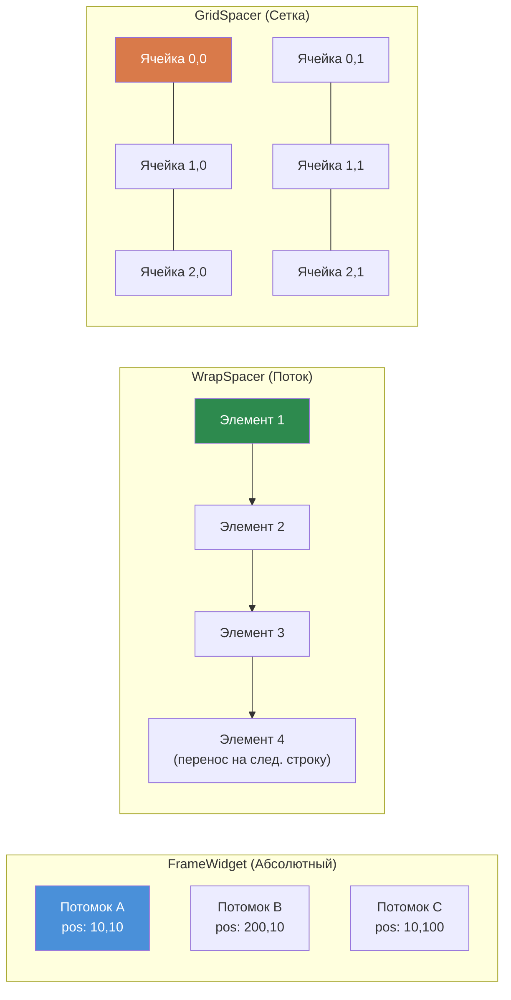
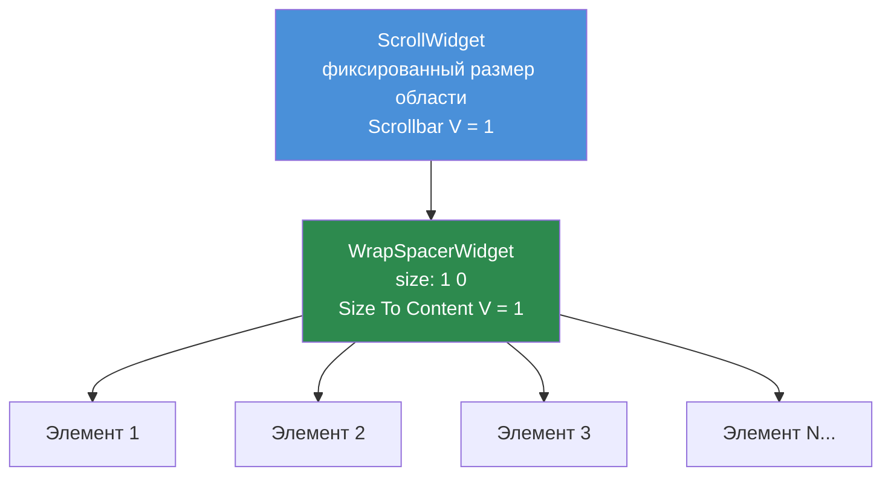

# Глава 3.4: Виджеты-контейнеры

[Главная](../../README.md) | [<< Назад: Размеры и позиционирование](03-sizing-positioning.md) | **Виджеты-контейнеры** | [Далее: Программное создание виджетов >>](05-programmatic-widgets.md)

---

Виджеты-контейнеры организуют дочерние виджеты внутри себя. Хотя `FrameWidget` — самый простой (невидимый блок, ручное позиционирование), DayZ предоставляет три специализированных контейнера, которые управляют компоновкой автоматически: `WrapSpacerWidget`, `GridSpacerWidget` и `ScrollWidget`.

### Сравнение контейнеров



---

## FrameWidget — структурный контейнер

`FrameWidget` — самый базовый контейнер. Он ничего не отрисовывает на экране и не размещает своих потомков — вы должны позиционировать каждого потомка вручную.

**Когда использовать:**
- Группировка связанных виджетов для совместного отображения/скрытия
- Корневой виджет панели или диалога
- Любая структурная группировка, где вы сами управляете позиционированием

```
FrameWidgetClass MyPanel {
 size 0.5 0.5
 halign center_ref
 valign center_ref
 hexactpos 1
 vexactpos 1
 hexactsize 0
 vexactsize 0
 {
  TextWidgetClass Header {
   position 0 0
   size 1 0.1
   text "Panel Title"
   "text halign" center
  }
  PanelWidgetClass Divider {
   position 0 0.1
   size 1 2
   hexactsize 0
   vexactsize 1
   color 1 1 1 0.3
  }
  FrameWidgetClass Content {
   position 0 0.12
   size 1 0.88
  }
 }
}
```

**Основные характеристики:**
- Нет визуального отображения (прозрачный)
- Потомки позиционируются относительно границ фрейма
- Нет автоматической компоновки — каждому потомку нужна явная позиция/размер
- Легковесный — нулевые затраты на рендеринг помимо потомков

---

## WrapSpacerWidget — поточная компоновка

`WrapSpacerWidget` автоматически размещает своих потомков последовательно. Потомки располагаются один за другим горизонтально, переносясь на следующую строку при превышении доступной ширины. Это виджет для динамических списков, где количество потомков меняется во время выполнения.

### Атрибуты компоновки

| Атрибут | Значения | Описание |
|---|---|---|
| `Padding` | целое число (пиксели) | Отступ между краем спейсера и его потомками |
| `Margin` | целое число (пиксели) | Расстояние между отдельными потомками |
| `"Size To Content H"` | `0` или `1` | Подгонка ширины под всех потомков |
| `"Size To Content V"` | `0` или `1` | Подгонка высоты под всех потомков |
| `content_halign` | `left`, `center`, `right` | Горизонтальное выравнивание группы потомков |
| `content_valign` | `top`, `center`, `bottom` | Вертикальное выравнивание группы потомков |

### Базовая поточная компоновка

```
WrapSpacerWidgetClass TagList {
 size 1 0
 hexactsize 0
 "Size To Content V" 1
 Padding 5
 Margin 3
 {
  ButtonWidgetClass Tag1 {
   size 80 24
   hexactsize 1
   vexactsize 1
   text "Weapons"
  }
  ButtonWidgetClass Tag2 {
   size 60 24
   hexactsize 1
   vexactsize 1
   text "Food"
  }
  ButtonWidgetClass Tag3 {
   size 90 24
   hexactsize 1
   vexactsize 1
   text "Medical"
  }
 }
}
```

В этом примере:
- Спейсер занимает полную ширину родителя (`size 1`), но его высота подстраивается под потомков (`"Size To Content V" 1`).
- Потомки — кнопки шириной 80px, 60px и 90px.
- Если доступной ширины не хватает для всех трёх в одной строке, спейсер переносит их на следующую.
- `Padding 5` добавляет 5px отступа внутри краёв спейсера.
- `Margin 3` добавляет 3px между каждым потомком.

### Вертикальный список с WrapSpacer

Чтобы создать вертикальный список (один элемент на строку), сделайте потомков полноширинными:

```
WrapSpacerWidgetClass ItemList {
 size 1 0
 hexactsize 0
 "Size To Content V" 1
 Margin 2
 {
  FrameWidgetClass Item1 {
   size 1 30
   hexactsize 0
   vexactsize 1
  }
  FrameWidgetClass Item2 {
   size 1 30
   hexactsize 0
   vexactsize 1
  }
 }
}
```

Каждый потомок имеет ширину 100% (`size 1` с `hexactsize 0`), поэтому в строку помещается только один, образуя вертикальный стек.

### Динамические потомки

`WrapSpacerWidget` идеален для программно добавляемых потомков. При добавлении или удалении потомков вызовите `Update()` у спейсера для пересчёта компоновки:

```c
WrapSpacerWidget spacer;

// Добавление потомка из файла компоновки
Widget child = GetGame().GetWorkspace().CreateWidgets("MyMod/gui/layouts/ListItem.layout", spacer);

// Принудительный пересчёт спейсера
spacer.Update();
```

---

## GridSpacerWidget — сеточная компоновка

`GridSpacerWidget` размещает потомков в равномерной сетке. Вы определяете количество столбцов и строк, и каждая ячейка получает равное пространство.

### Атрибуты компоновки

| Атрибут | Значения | Описание |
|---|---|---|
| `Columns` | целое число | Количество столбцов сетки |
| `Rows` | целое число | Количество строк сетки |
| `Margin` | целое число (пиксели) | Расстояние между ячейками сетки |
| `"Size To Content V"` | `0` или `1` | Подгонка высоты под содержимое |

### Базовая сетка

```
GridSpacerWidgetClass InventoryGrid {
 size 0.5 0.5
 hexactsize 0
 vexactsize 0
 Columns 4
 Rows 3
 Margin 2
 {
  // 12 ячеек (4 столбца x 3 строки)
  // Потомки размещаются по порядку: слева направо, сверху вниз
  FrameWidgetClass Slot1 { }
  FrameWidgetClass Slot2 { }
  FrameWidgetClass Slot3 { }
  FrameWidgetClass Slot4 { }
  FrameWidgetClass Slot5 { }
  FrameWidgetClass Slot6 { }
  FrameWidgetClass Slot7 { }
  FrameWidgetClass Slot8 { }
  FrameWidgetClass Slot9 { }
  FrameWidgetClass Slot10 { }
  FrameWidgetClass Slot11 { }
  FrameWidgetClass Slot12 { }
 }
}
```

### Одноколоночная сетка (вертикальный список)

Установка `Columns 1` создаёт простой вертикальный стек, где каждый потомок занимает полную ширину:

```
GridSpacerWidgetClass SettingsList {
 size 1 0
 hexactsize 0
 "Size To Content V" 1
 Columns 1
 {
  FrameWidgetClass Setting1 {
   size 150 30
   hexactsize 1
   vexactsize 1
  }
  FrameWidgetClass Setting2 {
   size 150 30
   hexactsize 1
   vexactsize 1
  }
  FrameWidgetClass Setting3 {
   size 150 30
   hexactsize 1
   vexactsize 1
  }
 }
}
```

### GridSpacer vs. WrapSpacer

| Свойство | GridSpacer | WrapSpacer |
|---|---|---|
| Размер ячейки | Одинаковый (равный) | Каждый потомок сохраняет свой размер |
| Режим компоновки | Фиксированная сетка (столбцы x строки) | Поток с переносом |
| Лучше для | Инвентарных слотов, равномерных галерей | Динамических списков, облаков тегов |
| Размеры потомков | Игнорируются (сетка управляет ими) | Учитываются (размер потомка важен) |

---

## ScrollWidget — прокручиваемая область просмотра

`ScrollWidget` оборачивает содержимое, которое может быть выше (или шире) видимой области, предоставляя полосы прокрутки для навигации.

### Атрибуты компоновки

| Атрибут | Значения | Описание |
|---|---|---|
| `"Scrollbar V"` | `0` или `1` | Показывать вертикальную полосу прокрутки |
| `"Scrollbar H"` | `0` или `1` | Показывать горизонтальную полосу прокрутки |

### API скриптов

```c
ScrollWidget sw;
sw.VScrollToPos(float pos);     // Прокрутить к вертикальной позиции (0 = верх)
sw.GetVScrollPos();             // Получить текущую позицию прокрутки
sw.GetContentHeight();          // Получить общую высоту содержимого
sw.VScrollStep(int step);       // Прокрутить на шаг
```

### Базовый прокручиваемый список

```
ScrollWidgetClass ListScroll {
 size 1 300
 hexactsize 0
 vexactsize 1
 "Scrollbar V" 1
 {
  WrapSpacerWidgetClass ListContent {
   size 1 0
   hexactsize 0
   "Size To Content V" 1
   {
    // Много потомков...
    FrameWidgetClass Item1 {
     size 1 30
     hexactsize 0
     vexactsize 1
    }
    FrameWidgetClass Item2 {
     size 1 30
     hexactsize 0
     vexactsize 1
    }
    // ... ещё элементы
   }
  }
 }
}
```

---

## Паттерн ScrollWidget + WrapSpacer



Это **основной** паттерн для прокручиваемых динамических списков в модах DayZ. Он комбинирует `ScrollWidget` фиксированной высоты с `WrapSpacerWidget`, который растёт для вмещения потомков.

```
// Область прокрутки фиксированной высоты
ScrollWidgetClass DialogScroll {
 size 0.97 235
 hexactsize 0
 vexactsize 1
 "Scrollbar V" 1
 {
  // Содержимое растёт вертикально для вмещения всех потомков
  WrapSpacerWidgetClass DialogContent {
   size 1 0
   hexactsize 0
   "Size To Content V" 1
  }
 }
}
```

Как это работает:

1. `ScrollWidget` имеет **фиксированную** высоту (235 пикселей в этом примере).
2. Внутри него `WrapSpacerWidget` имеет `"Size To Content V" 1`, поэтому его высота растёт при добавлении потомков.
3. Когда содержимое спейсера превышает 235 пикселей, появляется полоса прокрутки и пользователь может прокручивать.

Этот паттерн встречается во всех DabsFramework, DayZ Editor, Expansion и практически каждом профессиональном моде DayZ.

### Программное добавление элементов

```c
ScrollWidget m_Scroll;
WrapSpacerWidget m_Content;

void AddItem(string text)
{
    // Создаём нового потомка внутри WrapSpacer
    Widget item = GetGame().GetWorkspace().CreateWidgets(
        "MyMod/gui/layouts/ListItem.layout", m_Content);

    // Настраиваем новый элемент
    TextWidget tw = TextWidget.Cast(item.FindAnyWidget("Label"));
    tw.SetText(text);

    // Принудительный пересчёт компоновки
    m_Content.Update();
}

void ScrollToBottom()
{
    m_Scroll.VScrollToPos(m_Scroll.GetContentHeight());
}

void ClearAll()
{
    // Удаляем всех потомков
    Widget child = m_Content.GetChildren();
    while (child)
    {
        Widget next = child.GetSibling();
        child.Unlink();
        child = next;
    }
    m_Content.Update();
}
```

---

## Правила вложенности

Контейнеры можно вкладывать друг в друга для создания сложных компоновок. Некоторые рекомендации:

1. **FrameWidget внутри чего угодно** — Всегда работает. Используйте фреймы для группировки подсекций внутри спейсеров или сеток.

2. **WrapSpacer внутри ScrollWidget** — Стандартный паттерн для прокручиваемых списков. Спейсер растёт; прокрутка обрезает.

3. **GridSpacer внутри WrapSpacer** — Работает. Полезно для размещения фиксированной сетки как одного элемента в поточной компоновке.

4. **ScrollWidget внутри WrapSpacer** — Возможно, но требует фиксированной высоты для ScrollWidget (`vexactsize 1`). Без фиксированной высоты ScrollWidget будет пытаться расти под содержимое (что лишает смысла прокрутку).

5. **Избегайте глубокой вложенности** — Каждый уровень вложенности добавляет вычислительные затраты на компоновку. Три-четыре уровня глубины типичны для сложных UI; более шести уровней говорит о необходимости реструктуризации.

---

## Когда использовать каждый контейнер

| Сценарий | Лучший контейнер |
|---|---|
| Статическая панель с вручную расположенными элементами | `FrameWidget` |
| Динамический список элементов различного размера | `WrapSpacerWidget` |
| Равномерная сетка (инвентарь, галерея) | `GridSpacerWidget` |
| Вертикальный список с одним элементом на строку | `WrapSpacerWidget` (полноширинные потомки) или `GridSpacerWidget` (`Columns 1`) |
| Содержимое выше доступного пространства | `ScrollWidget`, оборачивающий спейсер |
| Область содержимого вкладок | `FrameWidget` (переключение видимости потомков) |
| Кнопки панели инструментов | `WrapSpacerWidget` или `GridSpacerWidget` |

---

## Полный пример: прокручиваемая панель настроек

Панель настроек с заголовком, прокручиваемой областью содержимого с параметрами в сеточном расположении и нижней панелью кнопок:

```
FrameWidgetClass SettingsPanel {
 size 0.4 0.6
 halign center_ref
 valign center_ref
 hexactpos 1
 vexactpos 1
 hexactsize 0
 vexactsize 0
 {
  // Заголовок
  PanelWidgetClass TitleBar {
   position 0 0
   size 1 30
   hexactsize 0
   vexactsize 1
   color 0.2 0.4 0.8 1
  }

  // Прокручиваемая область настроек
  ScrollWidgetClass SettingsScroll {
   position 0 30
   size 1 0
   hexactpos 0
   vexactpos 1
   hexactsize 0
   vexactsize 0
   "Scrollbar V" 1
   {
    GridSpacerWidgetClass SettingsGrid {
     size 1 0
     hexactsize 0
     "Size To Content V" 1
     Columns 1
     Margin 2
    }
   }
  }

  // Панель кнопок внизу
  FrameWidgetClass ButtonBar {
   size 1 40
   halign left_ref
   valign bottom_ref
   hexactpos 0
   vexactpos 1
   hexactsize 0
   vexactsize 1
  }
 }
}
```

---

## Лучшие практики

- Всегда вызывайте `Update()` у `WrapSpacerWidget` или `GridSpacerWidget` после программного добавления или удаления потомков. Без этого вызова спейсер не пересчитывает компоновку, и потомки могут наложиться друг на друга или стать невидимыми.
- Используйте `ScrollWidget` + `WrapSpacerWidget` как стандартный паттерн для любого динамического списка. Установите для прокрутки фиксированную пиксельную высоту, а для внутреннего спейсера — `"Size To Content V" 1`.
- Предпочитайте `WrapSpacerWidget` с полноширинными потомками вместо `GridSpacerWidget Columns 1` для вертикальных списков, где элементы имеют различную высоту. GridSpacer принудительно делает ячейки одинакового размера.
- Всегда устанавливайте `clipchildren 1` на `ScrollWidget`. Без этого содержимое, выходящее за границы, рендерится за пределами области просмотра прокрутки.
- Избегайте вложенности контейнеров глубже 4-5 уровней. Каждый уровень добавляет вычислительные затраты на компоновку и значительно усложняет отладку.

---

## Теория vs практика

> Что говорит документация и как всё работает на самом деле.

| Концепция | Теория | Реальность |
|---------|--------|---------|
| `WrapSpacerWidget.Update()` | Компоновка автоматически пересчитывается при изменении потомков | Нужно вызывать `Update()` вручную после `CreateWidgets()` или `Unlink()`. Забыть это — самый частый баг спейсера |
| `"Size To Content V"` | Спейсер растёт под потомков | Работает только если потомки имеют явные размеры (пиксельная высота или известный пропорциональный родитель). Если потомки тоже `Size To Content`, получится нулевая высота |
| Размеры ячеек `GridSpacerWidget` | Сетка управляет размером ячеек равномерно | Собственные атрибуты размера потомков игнорируются — сетка переопределяет их. Установка `size` на потомке сетки не имеет эффекта |
| Позиция прокрутки `ScrollWidget` | `VScrollToPos(0)` прокручивает к верху | После добавления потомков может потребоваться отложить `VScrollToPos()` на один кадр (через `CallLater`), потому что высота содержимого ещё не пересчитана |
| Вложенные спейсеры | Спейсеры можно свободно вкладывать | `WrapSpacer` внутри `WrapSpacer` работает, но `Size To Content` на обоих уровнях может вызвать бесконечный цикл компоновки, замораживающий UI |

---

## Совместимость и влияние

- **Мульти-мод:** Виджеты-контейнеры принадлежат конкретному макету и не конфликтуют между модами. Однако если два мода добавляют потомков в один и тот же ванильный `ScrollWidget` (через `modded class`), порядок потомков непредсказуем.
- **Производительность:** `WrapSpacerWidget.Update()` пересчитывает позиции всех потомков. Для списков со 100+ элементами вызывайте `Update()` один раз после пакетных операций, а не после каждого отдельного добавления. GridSpacer быстрее для равномерных сеток, потому что позиции ячеек вычисляются арифметически.
- **Версии:** `WrapSpacerWidget` и `GridSpacerWidget` доступны с DayZ 1.0. Атрибуты `"Size To Content H/V"` присутствовали с самого начала, но их поведение с глубоко вложенными макетами стабилизировалось примерно в DayZ 1.10.

---

## Замечено в реальных модах

| Паттерн | Мод | Подробности |
|---------|-----|--------|
| `ScrollWidget` + `WrapSpacerWidget` для динамических списков | DabsFramework, Expansion, COT | Область прокрутки фиксированной высоты с автоматически растущим внутренним спейсером — универсальный паттерн прокручиваемого списка |
| `GridSpacerWidget Columns 10` для инвентаря | Ванильный DayZ | Инвентарная сетка использует GridSpacer с фиксированным числом столбцов, соответствующим раскладке слотов |
| Пулинг потомков в WrapSpacer | VPP Admin Tools | Предварительно создаёт пул виджетов элементов списка, показывает/скрывает их вместо создания/уничтожения для избежания накладных расходов `Update()` |
| `WrapSpacerWidget` как корень диалога | COT, DayZ Editor | Корень диалога использует `Size To Content V/H`, чтобы диалог автоматически подгонялся под содержимое без жёстко заданных размеров |

---

## Следующие шаги

- [3.5 Программное создание виджетов](05-programmatic-widgets.md) — Создание виджетов из кода
- [3.6 Обработка событий](06-event-handling.md) — Реагирование на клики, изменения и другие события
