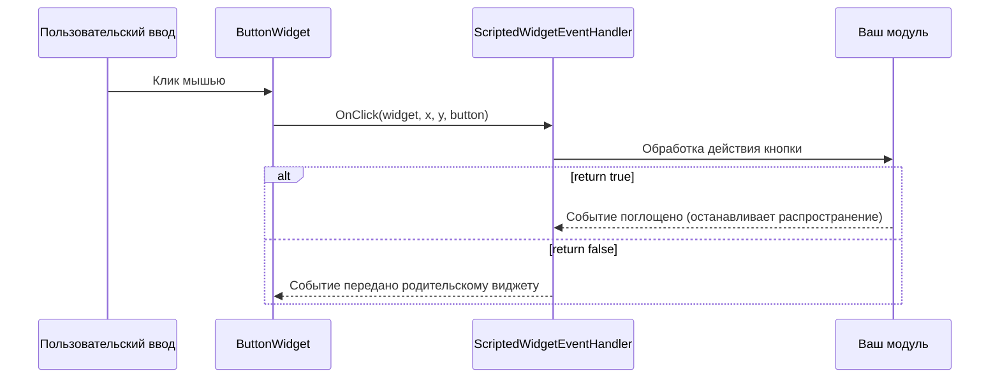

# Глава 3.6: Обработка событий

[Главная](../../README.md) | [<< Назад: Программное создание виджетов](05-programmatic-widgets.md) | **Обработка событий** | [Далее: Стили, шрифты и изображения >>](07-styles-fonts.md)

---

Виджеты генерируют события, когда пользователь взаимодействует с ними — нажимает кнопки, вводит текст в поля ввода, перемещает мышь, перетаскивает элементы. Эта глава рассматривает, как получать и обрабатывать эти события.

---

## ScriptedWidgetEventHandler

Класс `ScriptedWidgetEventHandler` является основой всей обработки событий виджетов в DayZ. Он предоставляет методы для переопределения для каждого возможного события виджета.

Чтобы получать события от виджета, создайте класс, расширяющий `ScriptedWidgetEventHandler`, переопределите нужные методы событий и прикрепите обработчик к виджету через `SetHandler()`.

### Полный список методов событий

```c
class ScriptedWidgetEventHandler
{
    // События кликов
    bool OnClick(Widget w, int x, int y, int button);
    bool OnDoubleClick(Widget w, int x, int y, int button);

    // События выбора
    bool OnSelect(Widget w, int x, int y);
    bool OnItemSelected(Widget w, int x, int y, int row, int column,
                         int oldRow, int oldColumn);

    // События фокуса
    bool OnFocus(Widget w, int x, int y);
    bool OnFocusLost(Widget w, int x, int y);

    // События мыши
    bool OnMouseEnter(Widget w, int x, int y);
    bool OnMouseLeave(Widget w, Widget enterW, int x, int y);
    bool OnMouseWheel(Widget w, int x, int y, int wheel);
    bool OnMouseButtonDown(Widget w, int x, int y, int button);
    bool OnMouseButtonUp(Widget w, int x, int y, int button);

    // События клавиатуры
    bool OnKeyDown(Widget w, int x, int y, int key);
    bool OnKeyUp(Widget w, int x, int y, int key);
    bool OnKeyPress(Widget w, int x, int y, int key);

    // События изменения (ползунки, чекбоксы, поля ввода)
    bool OnChange(Widget w, int x, int y, bool finished);

    // События перетаскивания
    bool OnDrag(Widget w, int x, int y);
    bool OnDragging(Widget w, int x, int y, Widget receiver);
    bool OnDraggingOver(Widget w, int x, int y, Widget receiver);
    bool OnDrop(Widget w, int x, int y, Widget receiver);
    bool OnDropReceived(Widget w, int x, int y, Widget receiver);

    // События контроллера (геймпада)
    bool OnController(Widget w, int control, int value);

    // События компоновки
    bool OnResize(Widget w, int x, int y);
    bool OnChildAdd(Widget w, Widget child);
    bool OnChildRemove(Widget w, Widget child);

    // Прочее
    bool OnUpdate(Widget w);
    bool OnModalResult(Widget w, int x, int y, int code, int result);
}
```

### Возвращаемое значение: поглощение или передача

Каждый обработчик события возвращает `bool`:

- **`return true;`** — Событие **поглощено**. Никакой другой обработчик его не получит. Событие прекращает распространение вверх по иерархии виджетов.
- **`return false;`** — Событие **передаётся дальше** обработчику родительского виджета (если есть).

Это критично для построения многослойных UI. Например, обработчик клика кнопки должен возвращать `true`, чтобы предотвратить срабатывание клика на панели за ней.

### Поток событий



---

## Регистрация обработчиков через SetHandler()

Самый простой способ обработки событий — вызвать `SetHandler()` на виджете:

```c
class MyPanel : ScriptedWidgetEventHandler
{
    protected Widget m_Root;
    protected ButtonWidget m_SaveBtn;
    protected ButtonWidget m_CancelBtn;

    void MyPanel()
    {
        m_Root = GetGame().GetWorkspace().CreateWidgets(
            "MyMod/gui/layouts/panel.layout");

        m_SaveBtn = ButtonWidget.Cast(m_Root.FindAnyWidget("SaveButton"));
        m_CancelBtn = ButtonWidget.Cast(m_Root.FindAnyWidget("CancelButton"));

        // Зарегистрировать этот класс как обработчик событий для обеих кнопок
        m_SaveBtn.SetHandler(this);
        m_CancelBtn.SetHandler(this);
    }

    override bool OnClick(Widget w, int x, int y, int button)
    {
        if (w == m_SaveBtn)
        {
            Save();
            return true;  // Поглощено
        }

        if (w == m_CancelBtn)
        {
            Cancel();
            return true;
        }

        return false;  // Не наш виджет, передать дальше
    }
}
```

Один экземпляр обработчика может быть зарегистрирован на нескольких виджетах. Внутри метода события сравнивайте `w` (виджет, сгенерировавший событие) с вашими кэшированными ссылками, чтобы определить, какой виджет был задействован.

---

## Основные события подробно

### OnClick

```c
bool OnClick(Widget w, int x, int y, int button)
```

Генерируется при клике на `ButtonWidget` (мышь отпущена над виджетом).

- `w` — Нажатый виджет
- `x, y` — Позиция курсора мыши (экранные пиксели)
- `button` — Индекс кнопки мыши: `0` = левая, `1` = правая, `2` = средняя

```c
override bool OnClick(Widget w, int x, int y, int button)
{
    if (button != 0) return false;  // Обрабатывать только левый клик

    if (w == m_MyButton)
    {
        DoAction();
        return true;
    }
    return false;
}
```

### OnChange

```c
bool OnChange(Widget w, int x, int y, bool finished)
```

Генерируется `SliderWidget`, `CheckBoxWidget`, `EditBoxWidget` и другими виджетами со значениями при изменении значения.

- `w` — Виджет, значение которого изменилось
- `finished` — Для ползунков: `true`, когда пользователь отпускает ручку. Для полей ввода: `true`, когда нажат Enter.

```c
override bool OnChange(Widget w, int x, int y, bool finished)
{
    if (w == m_VolumeSlider)
    {
        SliderWidget slider = SliderWidget.Cast(w);
        float value = slider.GetCurrent();

        // Применять только когда пользователь закончил перетаскивание
        if (finished)
        {
            ApplyVolume(value);
        }
        else
        {
            // Предпросмотр во время перетаскивания
            PreviewVolume(value);
        }
        return true;
    }

    if (w == m_NameInput)
    {
        EditBoxWidget edit = EditBoxWidget.Cast(w);
        string text = edit.GetText();

        if (finished)
        {
            // Пользователь нажал Enter
            SubmitName(text);
        }
        return true;
    }

    if (w == m_EnableCheckbox)
    {
        CheckBoxWidget cb = CheckBoxWidget.Cast(w);
        bool checked = cb.IsChecked();
        ToggleFeature(checked);
        return true;
    }

    return false;
}
```

### OnMouseEnter / OnMouseLeave

```c
bool OnMouseEnter(Widget w, int x, int y)
bool OnMouseLeave(Widget w, Widget enterW, int x, int y)
```

Генерируются, когда курсор мыши входит в область виджета или покидает её. Параметр `enterW` в `OnMouseLeave` — виджет, на который переместился курсор.

Типичное использование: эффекты наведения.

```c
override bool OnMouseEnter(Widget w, int x, int y)
{
    if (w == m_HoverPanel)
    {
        m_HoverPanel.SetColor(ARGB(255, 80, 130, 200));  // Подсветка
        return true;
    }
    return false;
}

override bool OnMouseLeave(Widget w, Widget enterW, int x, int y)
{
    if (w == m_HoverPanel)
    {
        m_HoverPanel.SetColor(ARGB(255, 50, 50, 50));  // По умолчанию
        return true;
    }
    return false;
}
```

### OnFocus / OnFocusLost

```c
bool OnFocus(Widget w, int x, int y)
bool OnFocusLost(Widget w, int x, int y)
```

Генерируются, когда виджет получает или теряет фокус клавиатуры. Важно для полей ввода и других виджетов текстового ввода.

### OnMouseWheel

```c
bool OnMouseWheel(Widget w, int x, int y, int wheel)
```

Генерируется при прокрутке колеса мыши над виджетом. `wheel` положительный при прокрутке вверх, отрицательный при прокрутке вниз.

### OnKeyDown / OnKeyUp / OnKeyPress

```c
bool OnKeyDown(Widget w, int x, int y, int key)
bool OnKeyUp(Widget w, int x, int y, int key)
bool OnKeyPress(Widget w, int x, int y, int key)
```

События клавиатуры. Параметр `key` соответствует константам `KeyCode` (например, `KeyCode.KC_ESCAPE`, `KeyCode.KC_RETURN`).

### OnDrag / OnDrop / OnDropReceived

```c
bool OnDrag(Widget w, int x, int y)
bool OnDrop(Widget w, int x, int y, Widget receiver)
bool OnDropReceived(Widget w, int x, int y, Widget receiver)
```

События перетаскивания. Виджет должен иметь `draggable 1` в layout (или `WidgetFlags.DRAGGABLE` в коде).

- `OnDrag` — Пользователь начал перетаскивание виджета `w`
- `OnDrop` — Виджет `w` был отпущен; `receiver` — виджет под ним
- `OnDropReceived` — Виджет `w` принял отпущенный элемент; `receiver` — отпущенный виджет

### OnItemSelected

```c
bool OnItemSelected(Widget w, int x, int y, int row, int column,
                     int oldRow, int oldColumn)
```

Генерируется `TextListboxWidget` при выборе строки.

---

## Ванильный WidgetEventHandler (регистрация коллбэков)

Ванильный код DayZ использует альтернативный паттерн: `WidgetEventHandler` — синглтон, маршрутизирующий события на именованные функции обратного вызова. Часто используется в ванильных меню.

```c
WidgetEventHandler handler = WidgetEventHandler.GetInstance();

// Регистрация коллбэков по имени функции
handler.RegisterOnClick(myButton, this, "OnMyButtonClick");
handler.RegisterOnMouseEnter(myWidget, this, "OnHoverStart");
handler.RegisterOnMouseLeave(myWidget, this, "OnHoverEnd");
handler.RegisterOnDoubleClick(myWidget, this, "OnDoubleClick");

// Отмена регистрации всех коллбэков для виджета
handler.UnregisterWidget(myWidget);
```

Сигнатуры функций обратного вызова должны соответствовать типу события:

```c
void OnMyButtonClick(Widget w, int x, int y, int button)
{
    // Обработка клика
}

void OnHoverStart(Widget w, int x, int y)
{
    // Обработка входа мыши
}
```

### SetHandler() vs. WidgetEventHandler

| Аспект | SetHandler() | WidgetEventHandler |
|---|---|---|
| Паттерн | Переопределение виртуальных методов | Регистрация именованных коллбэков |
| Обработчик на виджет | Один обработчик на виджет | Несколько коллбэков на событие |
| Используется | DabsFramework, Expansion, пользовательские моды | Ванильные меню DayZ |
| Гибкость | Все события в одном классе | Можно регистрировать разные цели для разных событий |
| Очистка | Неявная при уничтожении обработчика | Нужно вызывать `UnregisterWidget()` |

Для новых модов рекомендуется подход `SetHandler()` с `ScriptedWidgetEventHandler`.

---

## Полный пример: интерактивная панель кнопок

Панель с тремя кнопками, которые меняют цвет при наведении и выполняют действия по клику:

```c
class InteractivePanel : ScriptedWidgetEventHandler
{
    protected Widget m_Root;
    protected ButtonWidget m_BtnStart;
    protected ButtonWidget m_BtnStop;
    protected ButtonWidget m_BtnReset;
    protected TextWidget m_StatusText;

    protected int m_DefaultColor = ARGB(255, 60, 60, 60);
    protected int m_HoverColor   = ARGB(255, 80, 130, 200);
    protected int m_ActiveColor  = ARGB(255, 50, 180, 80);

    void InteractivePanel()
    {
        m_Root = GetGame().GetWorkspace().CreateWidgets(
            "MyMod/gui/layouts/interactive_panel.layout");

        m_BtnStart  = ButtonWidget.Cast(m_Root.FindAnyWidget("BtnStart"));
        m_BtnStop   = ButtonWidget.Cast(m_Root.FindAnyWidget("BtnStop"));
        m_BtnReset  = ButtonWidget.Cast(m_Root.FindAnyWidget("BtnReset"));
        m_StatusText = TextWidget.Cast(m_Root.FindAnyWidget("StatusText"));

        // Зарегистрировать обработчик на всех интерактивных виджетах
        m_BtnStart.SetHandler(this);
        m_BtnStop.SetHandler(this);
        m_BtnReset.SetHandler(this);
    }

    override bool OnClick(Widget w, int x, int y, int button)
    {
        if (button != 0) return false;

        if (w == m_BtnStart)
        {
            m_StatusText.SetText("Started");
            m_StatusText.SetColor(m_ActiveColor);
            return true;
        }
        if (w == m_BtnStop)
        {
            m_StatusText.SetText("Stopped");
            m_StatusText.SetColor(ARGB(255, 200, 50, 50));
            return true;
        }
        if (w == m_BtnReset)
        {
            m_StatusText.SetText("Ready");
            m_StatusText.SetColor(ARGB(255, 200, 200, 200));
            return true;
        }
        return false;
    }

    override bool OnMouseEnter(Widget w, int x, int y)
    {
        if (w == m_BtnStart || w == m_BtnStop || w == m_BtnReset)
        {
            w.SetColor(m_HoverColor);
            return true;
        }
        return false;
    }

    override bool OnMouseLeave(Widget w, Widget enterW, int x, int y)
    {
        if (w == m_BtnStart || w == m_BtnStop || w == m_BtnReset)
        {
            w.SetColor(m_DefaultColor);
            return true;
        }
        return false;
    }

    void Show(bool visible)
    {
        m_Root.Show(visible);
    }

    void ~InteractivePanel()
    {
        if (m_Root)
        {
            m_Root.Unlink();
            m_Root = null;
        }
    }
}
```

---

## Лучшие практики обработки событий

1. **Всегда возвращайте `true`, когда обрабатываете событие** — иначе событие распространится на родительские виджеты и может вызвать непредвиденное поведение.

2. **Возвращайте `false` для событий, которые не обрабатываете** — это позволяет родительским виджетам обработать событие.

3. **Кэшируйте ссылки на виджеты** — не вызывайте `FindAnyWidget()` внутри обработчиков событий. Ищите виджеты один раз в конструкторе и сохраняйте ссылки.

4. **Проверяйте виджеты на null в событиях** — виджет `w` обычно валиден, но защитное программирование предотвращает крэши.

5. **Очищайте обработчики** — при уничтожении панели отвяжите корневой виджет. При использовании `WidgetEventHandler` вызовите `UnregisterWidget()`.

6. **Используйте параметр `finished` с умом** — для ползунков применяйте тяжёлые операции только при `finished == true` (пользователь отпустил ручку). Используйте события без `finished` для предпросмотра.

7. **Откладывайте тяжёлую работу** — если обработчику события нужно выполнить затратные вычисления, используйте `CallLater` для отложенного выполнения:

```c
override bool OnClick(Widget w, int x, int y, int button)
{
    if (w == m_HeavyActionBtn)
    {
        GetGame().GetCallQueue(CALL_CATEGORY_GUI).CallLater(DoHeavyWork, 0, false);
        return true;
    }
    return false;
}
```

---

## Теория и практика

> Что говорит документация и как всё работает на самом деле в рантайме.

| Концепция | Теория | Реальность |
|---------|--------|---------|
| `OnClick` генерируется на любом виджете | Любой виджет может получать события клика | Только `ButtonWidget` надёжно генерирует `OnClick`. Для других типов виджетов используйте `OnMouseButtonDown` / `OnMouseButtonUp` |
| `SetHandler()` заменяет обработчик | Установка нового обработчика заменяет старый | Верно, но старый обработчик не уведомляется. Если он удерживал ресурсы, они утекут. Всегда очищайте перед заменой обработчиков |
| Параметр `finished` в `OnChange` | `true`, когда пользователь завершил взаимодействие | Для `EditBoxWidget` `finished` равен `true` только по клавише Enter — переключение табом или клик в другое место НЕ устанавливает `finished` в `true` |
| Распространение возвращаемого значения | `return false` передаёт событие родителю | События распространяются вверх по дереву виджетов, не к соседним. `return false` от дочернего идёт к его родителю, никогда к соседнему виджету |
| Имена коллбэков `WidgetEventHandler` | Любое имя функции подходит | Функция должна существовать на целевом объекте в момент регистрации. Если имя функции с ошибкой, регистрация молча проходит, но коллбэк никогда не вызывается |

---

## Совместимость и влияние

- **Мультимод:** `SetHandler()` допускает только один обработчик на виджет. Если мод A и мод B оба вызовут `SetHandler()` на одном ванильном виджете (через `modded class`), последний побеждает, а другой молча перестаёт получать события. Используйте `WidgetEventHandler.RegisterOnClick()` для аддитивной мультимодовой совместимости.
- **Производительность:** Обработчики событий выполняются в главном потоке игры. Медленный обработчик `OnClick` (например, файловый ввод-вывод или сложные вычисления) вызывает видимое подвисание кадра. Откладывайте тяжёлую работу через `GetGame().GetCallQueue(CALL_CATEGORY_GUI).CallLater()`.
- **Версия:** API `ScriptedWidgetEventHandler` стабилен с DayZ 1.0. Коллбэки синглтона `WidgetEventHandler` — ванильные паттерны, присутствующие с ранних версий Enforce Script, и остаются без изменений.

---

## Наблюдения в реальных модах

| Паттерн | Мод | Детали |
|---------|-----|--------|
| Один обработчик для всей панели | COT, VPP Admin Tools | Один подкласс `ScriptedWidgetEventHandler` обрабатывает все кнопки панели, маршрутизируя по сравнению `w` с кэшированными ссылками |
| `WidgetEventHandler.RegisterOnClick` для модульных кнопок | Expansion Market | Каждая динамически созданная кнопка покупки/продажи регистрирует свой коллбэк, позволяя обработчики для каждого предмета |
| `OnMouseEnter` / `OnMouseLeave` для всплывающих подсказок | DayZ Editor | События наведения запускают виджеты подсказок, следующие за позицией курсора через `GetMousePos()` |
| Отложенный `CallLater` в `OnClick` | DabsFramework | Тяжёлые операции (сохранение конфига, отправка RPC) откладываются на 0мс через `CallLater`, чтобы не блокировать поток UI во время события |

---

## Следующие шаги

- [3.7 Стили, шрифты и изображения](07-styles-fonts.md) — Визуальное оформление стилями, шрифтами и ссылками на imageset-ы
- [3.5 Программное создание виджетов](05-programmatic-widgets.md) — Создание виджетов, генерирующих события
