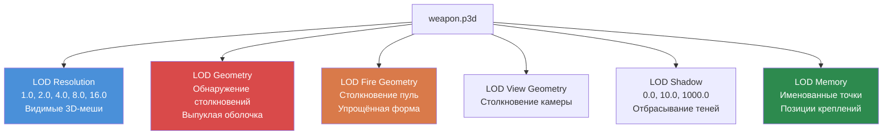

# Глава 4.2: 3D-модели (.p3d)

[Главная](../../README.md) | [<< Назад: Текстуры](01-textures.md) | **3D-модели** | [Далее: Материалы >>](03-materials.md)

---

## Введение

Каждый физический объект в DayZ -- оружие, одежда, здания, транспорт, деревья, камни -- это 3D-модель, хранящаяся в проприетарном формате **P3D** от Bohemia. Формат P3D -- это гораздо больше, чем контейнер мешей: он кодирует множество уровней детализации, геометрию столкновений, выборки для анимаций, точки памяти для креплений и эффектов, а также позиции прокси для устанавливаемых предметов. Понимание того, как работают P3D-файлы и как их создавать с помощью **Object Builder**, необходимо для любого мода, добавляющего физические предметы в игровой мир.

Эта глава охватывает структуру формата P3D, систему LOD, именованные выборки, точки памяти, систему прокси, настройку анимаций через `model.cfg` и рабочий процесс импорта из стандартных 3D-форматов.

---

## Содержание

- [Обзор формата P3D](#обзор-формата-p3d)
- [Object Builder](#object-builder)
- [Система LOD](#система-lod)
- [Именованные выборки](#именованные-выборки)
- [Точки памяти](#точки-памяти)
- [Система прокси](#система-прокси)
- [Model.cfg для анимаций](#modelcfg-для-анимаций)
- [Импорт из FBX/OBJ](#импорт-из-fbxobj)
- [Типичные типы моделей](#типичные-типы-моделей)
- [Распространённые ошибки](#распространённые-ошибки)
- [Лучшие практики](#лучшие-практики)

---

## Обзор формата P3D

**P3D** (Point 3D) -- это бинарный формат 3D-моделей от Bohemia Interactive, унаследованный от движка Real Virtuality и перенесённый в Enfusion. Это скомпилированный, готовый для движка формат -- вы не пишете P3D-файлы вручную.

### Ключевые характеристики

- **Бинарный формат:** Не читаем человеком. Создаётся и редактируется исключительно в Object Builder.
- **Мульти-LOD контейнер:** Один P3D-файл содержит несколько LOD (уровней детализации) мешей, каждый с разным назначением.
- **Нативный для движка:** Движок DayZ загружает P3D напрямую. Конвертация во время выполнения не происходит.
- **Бинаризированный vs необинаризированный:** Исходные P3D-файлы из Object Builder являются "MLOD" (редактируемые). Binarize конвертирует их в "ODOL" (оптимизированные, только для чтения). Игра может загружать оба, но ODOL загружается быстрее и меньше по размеру.

### Типы файлов, которые вы встретите

| Расширение | Описание |
|-----------|-------------|
| `.p3d` | 3D-модель (как MLOD исходный, так и ODOL бинаризированный) |
| `.rtm` | Runtime Motion -- данные ключевых кадров анимации |
| `.bisurf` | Файл свойств поверхности (используется вместе с P3D) |

### MLOD vs ODOL

| Свойство | MLOD (исходный) | ODOL (бинаризированный) |
|----------|---------------|-------------------|
| Создаётся | Object Builder | Binarize |
| Редактируемый | Да | Нет |
| Размер файла | Больше | Меньше |
| Скорость загрузки | Медленнее | Быстрее |
| Используется при | Разработке | Релизе |
| Содержит | Полные данные редактирования, именованные выборки | Оптимизированные данные мешей |

> **Важно:** При упаковке PBO с включённой бинаризацией ваши MLOD P3D-файлы автоматически конвертируются в ODOL. При упаковке с `-packonly` MLOD-файлы включаются как есть. Оба варианта работают в игре, но ODOL предпочтителен для релизных сборок.

---

## Object Builder

**Object Builder** -- это инструмент от Bohemia для создания и редактирования P3D-моделей. Он входит в состав DayZ Tools на Steam.

### Основные возможности

- Создание и редактирование 3D-мешей с вершинами, рёбрами и гранями.
- Определение нескольких LOD в одном P3D-файле.
- Назначение **именованных выборок** (групп вершин/граней) для анимаций и управления текстурами.
- Размещение **точек памяти** для позиций креплений, источников частиц и звуков.
- Добавление **прокси-объектов** для присоединяемых предметов (магазины, оптика и т.д.).
- Назначение материалов (`.rvmat`) и текстур (`.paa`) граням.
- Импорт мешей из форматов FBX, OBJ и 3DS.
- Экспорт валидированных P3D-файлов для Binarize.

### Настройка рабочего пространства

Object Builder требует настройки **диска P:** (рабочего диска). Этот виртуальный диск обеспечивает единый префикс пути, который движок использует для поиска ассетов.

```
P:\
  DZ\                        <-- Ванильные данные DayZ (извлечённые)
  DayZ Tools\                <-- Установка инструментов
  MyMod\                     <-- Исходная директория вашего мода
    data\
      models\
        my_item.p3d
      textures\
        my_item_co.paa
```

Все пути в P3D-файлах и материалах являются относительными к корню диска P:. Например, ссылка на материал внутри модели будет `MyMod\data\textures\my_item_co.paa`.

### Базовый рабочий процесс в Object Builder

1. **Создайте или импортируйте** геометрию меша.
2. **Определите LOD** -- как минимум, создайте LOD Resolution, Geometry и Fire Geometry.
3. **Назначьте материалы** граням в LOD Resolution.
4. **Назовите выборки** для частей, которые анимируются, меняют текстуры или требуют взаимодействия кода.
5. **Разместите точки памяти** для креплений, позиций вспышки дула, портов выброса гильз и т.д.
6. **Добавьте прокси** для предметов, которые можно прикрепить (оптика, магазины, глушители).
7. **Валидируйте** с помощью встроенной валидации Object Builder (Structure --> Validate).
8. **Сохраните** как P3D.
9. **Соберите** через Binarize или AddonBuilder.

---

## Система LOD

P3D-файл содержит несколько **LOD** (уровней детализации), каждый из которых служит определённой цели. Движок выбирает, какой LOD использовать, в зависимости от ситуации -- расстояние до камеры, физические расчёты, рендеринг теней и т.д.

### Типы LOD

| LOD | Значение разрешения | Назначение |
|-----|-----------------|---------|
| **Resolution 0** | 1.000 | Визуальный меш наивысшей детализации. Рендерится когда объект близко к камере. |
| **Resolution 1** | 1.100 | Средняя детализация. Рендерится на умеренном расстоянии. |
| **Resolution 2** | 1.200 | Низкая детализация. Рендерится на дальнем расстоянии. |
| **Resolution 3+** | 1.300+ | Дополнительные LOD расстояния. |
| **View Geometry** | Специальный | Определяет, что блокирует обзор игрока (от первого лица). Упрощённый меш. |
| **Fire Geometry** | Специальный | Столкновение для пуль и снарядов. Должен быть выпуклым или состоять из выпуклых частей. |
| **Geometry** | Специальный | Физическое столкновение. Используется для столкновений при движении, гравитации, размещения. Должен быть выпуклым или состоять из выпуклой декомпозиции. |
| **Shadow 0** | Специальный | Меш отбрасывания теней (близкое расстояние). |
| **Shadow 1000** | Специальный | Меш отбрасывания теней (дальнее расстояние). Проще, чем Shadow 0. |
| **Memory** | Специальный | Содержит только именованные точки (без видимой геометрии). Используется для позиций креплений, источников звука и т.д. |
| **Roadway** | Специальный | Определяет проходимые поверхности на объектах (транспорт, здания с проходимым интерьером). |
| **Paths** | Специальный | Подсказки навигации AI для зданий. |

### Иерархия LOD



### Значения разрешения LOD (визуальные LOD)

Движок использует формулу на основе расстояния и размера объекта для определения, какой визуальный LOD рендерить:

```
Выбранный LOD = (расстояние_до_объекта * LOD_фактор) / радиус_ограничивающей_сферы_объекта
```

Меньшие значения = ближе камера. Движок находит LOD, значение разрешения которого наиболее близко к вычисленному значению.

### Создание LOD в Object Builder

1. **File --> New LOD** или правый клик по списку LOD.
2. Выберите тип LOD из выпадающего списка.
3. Для визуальных LOD (Resolution) введите значение разрешения.
4. Моделируйте геометрию для этого LOD.

### Требования к LOD по типу предмета

| Тип предмета | Обязательные LOD | Рекомендуемые дополнительные LOD |
|-----------|---------------|----------------------------|
| **Ручной предмет** | Resolution 0, Geometry, Fire Geometry, Memory | Shadow 0, Resolution 1 |
| **Одежда** | Resolution 0, Geometry, Fire Geometry, Memory | Shadow 0, Resolution 1, Resolution 2 |
| **Оружие** | Resolution 0, Geometry, Fire Geometry, View Geometry, Memory | Shadow 0, Resolution 1, Resolution 2 |
| **Здание** | Resolution 0, Geometry, Fire Geometry, View Geometry, Memory | Shadow 0, Shadow 1000, Roadway, Paths |
| **Транспорт** | Resolution 0, Geometry, Fire Geometry, View Geometry, Memory | Shadow 0, Roadway, Resolution 1+ |

### Правила LOD Geometry

LOD Geometry и Fire Geometry имеют строгие требования:

- **Должны быть выпуклыми** или состоять из нескольких выпуклых компонентов. Физическая система движка требует выпуклых форм столкновений.
- **Именованные выборки должны совпадать** с выборками в LOD Resolution (для анимированных частей).
- **Масса должна быть определена.** Выделите все вершины в LOD Geometry и назначьте массу через **Structure --> Mass**. Это определяет физический вес объекта.
- **Делайте просто.** Меньше треугольников = лучшая физическая производительность. LOD Geometry оружия может иметь 20-50 треугольников против тысяч в визуальном LOD.

---

## Именованные выборки

Именованные выборки -- это группы вершин, рёбер или граней внутри LOD, помеченные именем. Они служат дескрипторами, которые движок и скрипты используют для манипуляции частями модели.

### Назначение именованных выборок

| Назначение | Пример имени выборки | Используется |
|---------|----------------------|---------|
| **Анимация** | `bolt`, `trigger`, `magazine` | Источники анимации в `model.cfg` |
| **Замена текстур** | `camo`, `camo1`, `body` | `hiddenSelections[]` в config.cpp |
| **Текстуры повреждений** | `zbytek` | Система повреждений движка, замена материалов |
| **Точки крепления** | `magazine`, `optics`, `suppressor` | Система прокси и креплений |

### hiddenSelections (замена текстур)

Наиболее распространённое использование именованных выборок для моддеров -- **hiddenSelections** -- возможность замены текстур во время выполнения через config.cpp.

**В P3D-модели (LOD Resolution):**
1. Выделите грани, которые должны быть ретекстурируемыми.
2. Назовите выборку (например, `camo`).

**В config.cpp:**
```cpp
class MyRifle: Rifle_Base
{
    hiddenSelections[] = {"camo"};
    hiddenSelectionsTextures[] = {"MyMod\data\my_rifle_co.paa"};
    hiddenSelectionsMaterials[] = {"MyMod\data\my_rifle.rvmat"};
};
```

Это позволяет создавать различные варианты одной модели с разными текстурами без дублирования P3D-файла.

### Создание именованных выборок

В Object Builder:

1. Выделите вершины или грани, которые хотите сгруппировать.
2. Перейдите в **Structure --> Named Selections** (или нажмите Ctrl+N).
3. Нажмите **New**, введите имя выборки.
4. Нажмите **Assign**, чтобы привязать выделенную геометрию к этому имени.

> **Совет:** Имена выборок чувствительны к регистру. `Camo` и `camo` -- это разные выборки. Соглашение -- нижний регистр.

### Выборки между LOD

Именованные выборки должны быть согласованы между LOD для работы анимаций:

- Если выборка `bolt` существует в Resolution 0, она должна также существовать в LOD Geometry и Fire Geometry (покрывая соответствующую геометрию столкновений).
- LOD Shadow также должны иметь выборку, если анимированная часть должна отбрасывать корректные тени.

---

## Точки памяти

Точки памяти -- это именованные позиции, определённые в **LOD Memory**. Они не имеют визуального представления в игре -- они определяют пространственные координаты, на которые движок и скрипты ссылаются для позиционирования эффектов, креплений, звуков и прочего.

### Распространённые точки памяти

| Имя точки | Назначение |
|------------|---------|
| `usti hlavne` | Позиция дула (откуда появляются пули, вспышка дула) |
| `konec hlavne` | Конец ствола (используется с `usti hlavne` для определения направления ствола) |
| `nabojnicestart` | Начало порта выброса гильз (откуда появляются гильзы) |
| `nabojniceend` | Конец порта выброса (направление выброса) |
| `handguard` | Точка крепления цевья |
| `magazine` | Позиция приёмника магазина |
| `optics` | Позиция планки оптики |
| `suppressor` | Позиция крепления глушителя |
| `trigger` | Позиция спускового крючка (для IK руки) |
| `pistolgrip` | Позиция пистолетной рукоятки (для IK руки) |
| `lefthand` | Позиция хвата левой руки |
| `righthand` | Позиция хвата правой руки |
| `eye` | Позиция глаз (для выравнивания вида от первого лица) |
| `pilot` | Позиция сиденья водителя/пилота (транспорт) |
| `light_l` / `light_r` | Позиции левой/правой фары (транспорт) |

### Направленные точки памяти

Многие эффекты нуждаются как в позиции, так и в направлении. Это достигается парными точками памяти:

```
usti hlavne  ------>  konec hlavne
(начало дула)         (конец дула)

Вектор направления: konec hlavne - usti hlavne
```

### Создание точек памяти в Object Builder

1. Переключитесь на **LOD Memory** в списке LOD.
2. Создайте вершину в нужной позиции.
3. Назовите её через **Structure --> Named Selections**: создайте выборку с именем точки и назначьте одну вершину.

> **Примечание:** LOD Memory должен содержать ТОЛЬКО именованные точки (отдельные вершины). Не создавайте грани или рёбра в LOD Memory.

---

## Система прокси

Прокси определяют позиции, где другие P3D-модели могут быть прикреплены. Когда вы видите магазин, вставленный в оружие, оптику на планке или глушитель, навинченный на ствол -- это модели, прикреплённые через прокси.

### Как работают прокси

Прокси -- это специальная ссылка, размещённая в LOD Resolution, которая указывает на другой P3D-файл. Движок рендерит модель, на которую ссылается прокси, в позиции и ориентации прокси.

### Соглашение об именовании прокси

Имена прокси следуют паттерну: `proxy:\путь\к\модели.p3d`

Для прокси креплений на оружии стандартные имена:

| Путь прокси | Тип крепления |
|------------|----------------|
| `proxy:\dz\weapons\attachments\magazine\mag_placeholder.p3d` | Слот магазина |
| `proxy:\dz\weapons\attachments\optics\optic_placeholder.p3d` | Планка оптики |
| `proxy:\dz\weapons\attachments\suppressor\sup_placeholder.p3d` | Крепление глушителя |
| `proxy:\dz\weapons\attachments\handguard\handguard_placeholder.p3d` | Слот цевья |
| `proxy:\dz\weapons\attachments\stock\stock_placeholder.p3d` | Слот приклада |

### Добавление прокси в Object Builder

1. В LOD Resolution расположите 3D-курсор в месте, где должно появиться крепление.
2. Перейдите в **Structure --> Proxy --> Create**.
3. Введите путь прокси (например, `dz\weapons\attachments\magazine\mag_placeholder.p3d`).
4. Прокси появится как маленькая стрелка, указывающая позицию и ориентацию.
5. Поверните и расположите прокси для корректного выравнивания с геометрией крепления.

### Индекс прокси

Каждый прокси имеет номер индекса (начиная с 1). Когда модель имеет несколько прокси одного типа, индекс их различает. Индекс указывается в config.cpp:

```cpp
class MyWeapon: Rifle_Base
{
    class Attachments
    {
        class magazine
        {
            type = "magazine";
            proxy = "proxy:\dz\weapons\attachments\magazine\mag_placeholder.p3d";
            proxyIndex = 1;
        };
    };
};
```

---

## Model.cfg для анимаций

Файл `model.cfg` определяет анимации для P3D-моделей. Он связывает источники анимации (управляемые игровой логикой) с трансформациями именованных выборок.

### Базовая структура

```cpp
class CfgModels
{
    class Default
    {
        sectionsInherit = "";
        sections[] = {};
        skeletonName = "";
    };

    class MyRifle: Default
    {
        skeletonName = "MyRifle_skeleton";
        sections[] = {"camo"};

        class Animations
        {
            class bolt_move
            {
                type = "translation";
                source = "reload";        // Источник анимации движка
                selection = "bolt";       // Именованная выборка в P3D
                axis = "bolt_axis";       // Пара точек памяти оси
                memory = 1;               // Ось определена в LOD Memory
                minValue = 0;
                maxValue = 1;
                offset0 = 0;
                offset1 = 0.05;           // Смещение 5 см
            };

            class trigger_move
            {
                type = "rotation";
                source = "trigger";
                selection = "trigger";
                axis = "trigger_axis";
                memory = 1;
                minValue = 0;
                maxValue = 1;
                angle0 = 0;
                angle1 = -0.4;            // Радианы
            };
        };
    };
};

class CfgSkeletons
{
    class Default
    {
        isDiscrete = 0;
        skeletonInherit = "";
        skeletonBones[] = {};
    };

    class MyRifle_skeleton: Default
    {
        skeletonBones[] =
        {
            "bolt", "",          // "имя_кости", "родительская_кость" ("" = корень)
            "trigger", "",
            "magazine", ""
        };
    };
};
```

### Типы анимаций

| Тип | Ключевое слово | Движение | Управляется |
|------|---------|----------|---------------|
| **Перемещение** | `translation` | Линейное движение вдоль оси | `offset0` / `offset1` (метры) |
| **Вращение** | `rotation` | Вращение вокруг оси | `angle0` / `angle1` (радианы) |
| **ВращениеX/Y/Z** | `rotationX` | Вращение вокруг фиксированной мировой оси | `angle0` / `angle1` |
| **Скрытие** | `hide` | Показать/скрыть выборку | Порог `hideValue` |

### Источники анимации

Источники анимации -- это значения, предоставляемые движком, которые управляют анимациями:

| Источник | Диапазон | Описание |
|--------|-------|-------------|
| `reload` | 0-1 | Фаза перезарядки оружия |
| `trigger` | 0-1 | Нажатие спускового крючка |
| `zeroing` | 0-N | Настройка пристрелки оружия |
| `isFlipped` | 0-1 | Состояние откидного прицела |
| `door` | 0-1 | Открытие/закрытие двери |
| `rpm` | 0-N | Обороты двигателя транспорта |
| `speed` | 0-N | Скорость транспорта |
| `fuel` | 0-1 | Уровень топлива транспорта |
| `damper` | 0-1 | Подвеска транспорта |

---

## Импорт из FBX/OBJ

Большинство моддеров создают 3D-модели во внешних программах (Blender, 3ds Max, Maya) и импортируют их в Object Builder.

### Поддерживаемые форматы импорта

| Формат | Расширение | Примечания |
|--------|-----------|-------|
| **FBX** | `.fbx` | Лучшая совместимость. Экспортируйте как FBX 2013 или новее (бинарный). |
| **OBJ** | `.obj` | Wavefront OBJ. Только простые данные мешей (без анимаций). |
| **3DS** | `.3ds` | Устаревший формат 3ds Max. Ограничение 65K вершин на меш. |

### Рабочий процесс импорта

**Шаг 1: Подготовка в вашем 3D-ПО**
- Модель должна быть отцентрирована в начале координат.
- Примените все трансформации (позиция, вращение, масштаб).
- Масштаб: 1 единица = 1 метр. DayZ использует метры.
- Триангулируйте меш (Object Builder работает с треугольниками).
- Разверните UV модели.
- Экспортируйте как FBX (бинарный, без анимации, Y-вверх или Z-вверх -- Object Builder обрабатывает оба).

**Шаг 2: Импорт в Object Builder**
1. Откройте Object Builder.
2. **File --> Import --> FBX** (или OBJ/3DS).
3. Просмотрите настройки импорта:
   - Масштабный фактор (должен быть 1.0 если ваш исходник в метрах).
   - Конвертация осей (Z-вверх в Y-вверх при необходимости).
4. Меш появится в новом LOD Resolution.

**Шаг 3: Пост-импортная настройка**
1. Назначьте материалы граням (выделите грани, правый клик --> **Face Properties**).
2. Создайте дополнительные LOD (Geometry, Fire Geometry, Memory, Shadow).
3. Упростите геометрию для столкновительных LOD (удалите мелкие детали, обеспечьте выпуклость).
4. Добавьте именованные выборки, точки памяти и прокси.
5. Валидируйте и сохраните.

### Советы для Blender

- Используйте аддон сообщества **Blender DayZ Toolbox**, если доступен -- он упрощает настройки экспорта.
- Экспортируйте с: **Apply Modifiers**, **Triangulate Faces**, **Apply Scale**.
- Установите **Forward: -Z Forward**, **Up: Y Up** в диалоге экспорта FBX.
- Назовите объекты мешей в Blender для соответствия предполагаемым именованным выборкам -- некоторые импортёры сохраняют имена объектов.

---

## Типичные типы моделей

### Оружие

Оружие -- наиболее сложные P3D-модели, требующие:
- Высокополигональный LOD Resolution (5000-20000 треугольников)
- Множество именованных выборок (bolt, trigger, magazine, camo и т.д.)
- Полный набор точек памяти (дуло, выброс, позиции хвата)
- Множество прокси (магазин, оптика, глушитель, цевьё, приклад)
- Скелет и анимации в model.cfg
- View Geometry для перекрытия в первом лице

### Одежда

Модели одежды привязаны к скелету персонажа:
- LOD Resolution следует костной структуре персонажа
- Именованные выборки для вариантов текстур (`camo`, `camo1`)
- Упрощённая геометрия столкновений
- Без прокси (обычно)
- hiddenSelections для цветовых/камуфляжных вариантов

### Здания

Здания имеют уникальные требования:
- Большие, детализированные LOD Resolution
- LOD Roadway для проходимых поверхностей (полы, лестницы)
- LOD Paths для навигации AI
- View Geometry для предотвращения просмотра сквозь стены
- Множество LOD Shadow для производительности на разных расстояниях
- Именованные выборки для дверей и окон, которые открываются

### Транспорт

Транспорт объединяет множество систем:
- Детализированный LOD Resolution с анимированными частями (колёса, двери, капот)
- Сложный скелет с множеством костей
- LOD Roadway для пассажиров, стоящих в кузове грузовика
- Точки памяти для фар, выхлопа, позиции водителя, пассажирских мест
- Множество прокси для креплений (колёса, двери)

---

## Распространённые ошибки

### 1. Отсутствие LOD Geometry

**Симптом:** Объект не имеет столкновений. Игроки и пули проходят сквозь него.
**Исправление:** Создайте LOD Geometry с упрощённым выпуклым мешем. Назначьте массу вершинам.

### 2. Невыпуклые формы столкновений

**Симптом:** Физические глюки, объекты прыгают хаотично, предметы проваливаются сквозь поверхности.
**Исправление:** Разбейте сложные формы на несколько выпуклых компонентов в LOD Geometry. Каждый компонент должен быть замкнутым выпуклым телом.

### 3. Несогласованные именованные выборки

**Симптом:** Анимации работают только визуально, но не для столкновений, или тень не анимируется.
**Исправление:** Убедитесь, что каждая именованная выборка, существующая в LOD Resolution, также существует в LOD Geometry, Fire Geometry и Shadow.

### 4. Неправильный масштаб

**Симптом:** Объект гигантский или микроскопический в игре.
**Исправление:** Убедитесь, что ваше 3D-ПО использует метры как единицу измерения. Персонаж DayZ имеет рост примерно 1.8 метра.

### 5. Отсутствие точек памяти

**Симптом:** Вспышка дула появляется в неправильной позиции, крепления висят в воздухе.
**Исправление:** Создайте LOD Memory и добавьте все необходимые именованные точки в правильных позициях.

### 6. Не определена масса

**Симптом:** Объект нельзя подобрать, или физическое взаимодействие ведёт себя странно.
**Исправление:** Выделите все вершины в LOD Geometry и назначьте массу через **Structure --> Mass**.

---

## Лучшие практики

1. **Начинайте с LOD Geometry.** Сначала заблокируйте форму столкновения, затем стройте визуальные детали сверху. Это предотвращает распространённую ошибку создания красивой модели, которая не может корректно сталкиваться.

2. **Используйте эталонные модели.** Извлеките ванильные P3D-файлы из данных игры и изучите их в Object Builder. Они точно показывают, что движок ожидает для каждого типа предмета.

3. **Валидируйте часто.** Используйте **Structure --> Validate** в Object Builder после каждого значительного изменения. Исправляйте предупреждения до того, как они станут загадочными багами в игре.

4. **Поддерживайте пропорциональное количество треугольников LOD.** Resolution 0 может иметь 10000 треугольников; Resolution 1 должен иметь ~5000; Geometry -- ~100-500. Драматическое сокращение на каждом уровне.

5. **Называйте выборки описательно.** Используйте `bolt_carrier` вместо `sel01`. Ваш будущий я (и другие моддеры) скажет вам спасибо.

6. **Тестируйте сначала с файловым патчингом.** Загрузите ваш небинаризированный P3D через режим файлового патчинга до полной PBO-сборки. Это быстрее выявляет большинство проблем.

7. **Документируйте точки памяти.** Ведите справочное изображение или текстовый файл со списком всех точек памяти и их предполагаемых позиций. Сложное оружие может иметь 20+ точек.

---

## Использование в реальных модах

| Паттерн | Мод | Детали |
|---------|-----|--------|
| Полная цепочка LOD с 5+ уровнями разрешения | DayZ-Samples (Test_Weapon) | Показывает полную иерархию LOD: Resolution от 1.0 до 16.0, плюс Geometry, Fire Geometry, Memory, Shadow |
| Сложные скелеты с 20+ костями | Expansion Vehicles | Модели вертолётов и лодок используют обширные костные иерархии для дверей, роторов, рулей и турелей |
| Стекирование прокси для модульного оружия | Dabs Framework (RFCP weapons) | Оружие использует множество слотов прокси для крепления на планки, позволяя комбинации оптика + лазер + рукоятка |

---

## Совместимость и влияние

- **Мульти-мод:** Два мода могут безопасно ссылаться на разные P3D-модели без конфликтов. Конфликты возникают только когда оба мода пытаются `modded class` одну и ту же сущность и меняют её путь `model` в config.cpp.
- **Производительность:** Каждый видимый P3D добавляет вызовы отрисовки пропорционально количеству его материалов. Модели с 10+ материалами на визуальный LOD могут быть дорогими в сценах с множеством экземпляров. Держите количество материалов под 4 на визуальный LOD, когда возможно.
- **Версионность:** Формат P3D (MLOD/ODOL) оставался стабильным на протяжении обновлений DayZ. Object Builder иногда получает незначительные обновления через DayZ Tools, но сам формат не менялся с DayZ 1.0.

---

## Навигация

| Предыдущая | Вверх | Следующая |
|----------|----|------|
| [4.1 Текстуры](01-textures.md) | [Часть 4: Форматы файлов и DayZ Tools](01-textures.md) | [4.3 Материалы](03-materials.md) |
