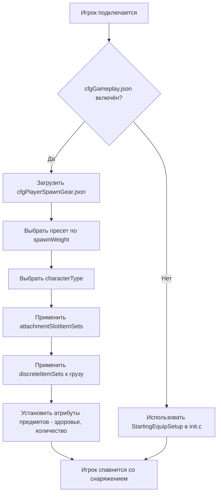

# Глава 5.6: Конфигурация снаряжения при спавне

[Главная](../../README.md) | [<< Предыдущая: Конфигурационные файлы сервера](05-server-configs.md) | **Конфигурация снаряжения при спавне**

---

> **Краткое описание:** В DayZ есть две взаимодополняющие системы, которые контролируют появление игроков в мире: **точки спавна** определяют, *где* на карте появляется персонаж, а **снаряжение спавна** определяет, *какое оборудование* он несёт. Эта глава подробно охватывает обе системы, включая структуру файлов, справочник по полям, практические пресеты и интеграцию с модами.

---

## Содержание

- [Обзор](#обзор)
- [Две системы](#две-системы)
- [Снаряжение спавна: cfgPlayerSpawnGear.json](#снаряжение-спавна-cfgplayerspawngearjson)
  - [Включение пресетов снаряжения](#включение-пресетов-снаряжения)
  - [Структура пресета](#структура-пресета)
  - [attachmentSlotItemSets](#attachmentslotitemsets)
  - [DiscreteItemSets](#discreteitemsets)
  - [discreteUnsortedItemSets](#discreteunsorteditemsets)
  - [ComplexChildrenTypes](#complexchildrentypes)
  - [SimpleChildrenTypes](#simplechildrentypes)
  - [Атрибуты](#атрибуты)
- [Точки спавна: cfgplayerspawnpoints.xml](#точки-спавна-cfgplayerspawnpointsxml)
  - [Структура файла](#структура-файла)
  - [spawn_params](#spawn_params)
  - [generator_params](#generator_params)
  - [Группы спавна](#группы-спавна)
  - [Конфигурации для конкретных карт](#конфигурации-для-конкретных-карт)
- [Практические примеры](#практические-примеры)
  - [Стандартный набор выжившего](#стандартный-набор-выжившего)
  - [Военный набор спавна](#военный-набор-спавна)
  - [Медицинский набор спавна](#медицинский-набор-спавна)
  - [Случайный выбор снаряжения](#случайный-выбор-снаряжения)
- [Интеграция с модами](#интеграция-с-модами)
- [Лучшие практики](#лучшие-практики)
- [Типичные ошибки](#типичные-ошибки)

---

## Обзор



Когда игрок спавнится как новый персонаж в DayZ, сервер отвечает на два вопроса:

1. **Где появляется персонаж?** --- Контролируется файлом `cfgplayerspawnpoints.xml`.
2. **Что несёт персонаж?** --- Контролируется JSON-файлами пресетов снаряжения, зарегистрированными через `cfggameplay.json`.

Обе системы работают только на стороне сервера. Клиенты никогда не видят эти конфигурационные файлы и не могут их изменить. Система снаряжения спавна была введена как альтернатива скриптовым загрузкам в `init.c`, позволяя администраторам серверов определять несколько взвешенных пресетов в JSON без написания какого-либо кода Enforce Script.

> **Важно:** Система пресетов снаряжения при спавне **полностью переопределяет** метод `StartingEquipSetup()` в вашем файле миссии `init.c`. Если вы включите пресеты снаряжения в `cfggameplay.json`, ваш скриптовый код загрузки будет проигнорирован. Аналогично, типы персонажей, определённые в пресетах, переопределяют модель персонажа, выбранную в главном меню.

---

## Две системы

| Система | Файл | Формат | Контролирует |
|--------|------|--------|----------|
| Точки спавна | `cfgplayerspawnpoints.xml` | XML | **Где** --- позиции на карте, оценка расстояний, группы спавна |
| Снаряжение спавна | Пользовательские JSON-файлы пресетов | JSON | **Что** --- модель персонажа, одежда, оружие, груз, быстрая панель |

Две системы независимы. Вы можете использовать пользовательские точки спавна с ванильным снаряжением, пользовательское снаряжение с ванильными точками спавна или настроить оба варианта.

---

## Снаряжение спавна: cfgPlayerSpawnGear.json

### Включение пресетов снаряжения

Пресеты снаряжения при спавне **не** включены по умолчанию. Чтобы их использовать, вы должны:

1. Создать один или несколько JSON-файлов пресетов в папке вашей миссии (например, `mpmissions/dayzOffline.chernarusplus/`).
2. Зарегистрировать их в `cfggameplay.json` в секции `PlayerData.spawnGearPresetFiles`.
3. Убедиться, что `enableCfgGameplayFile = 1` установлено в `serverDZ.cfg`.

```json
{
  "version": 122,
  "PlayerData": {
    "spawnGearPresetFiles": [
      "survivalist.json",
      "casual.json",
      "military.json"
    ]
  }
}
```

Файлы пресетов могут быть вложены в поддиректории внутри папки миссии:

```json
"spawnGearPresetFiles": [
  "custom/survivalist.json",
  "custom/casual.json",
  "custom/military.json"
]
```

Каждый JSON-файл содержит один объект пресета. Все зарегистрированные пресеты объединяются, и сервер выбирает один на основе `spawnWeight` каждый раз, когда спавнится новый персонаж.

### Структура пресета

Пресет --- это JSON-объект верхнего уровня со следующими полями:

| Поле | Тип | Описание |
|-------|------|-------------|
| `name` | string | Человекочитаемое имя пресета (любая строка, используется только для идентификации) |
| `spawnWeight` | integer | Вес для случайного выбора. Минимум `1`. Более высокие значения повышают вероятность выбора этого пресета |
| `characterTypes` | array | Массив имён классов типов персонажей (например, `"SurvivorM_Mirek"`). Один выбирается случайно при спавне этого пресета |
| `attachmentSlotItemSets` | array | Массив структур `AttachmentSlots`, определяющих что носит персонаж (одежда, оружие на плечах и т.д.) |
| `discreteUnsortedItemSets` | array | Массив структур `DiscreteUnsortedItemSets`, определяющих грузовые предметы, размещаемые в любое доступное пространство инвентаря |

> **Примечание:** Если `characterTypes` пуст или опущен, будет использована модель персонажа, последний раз выбранная на экране создания персонажа в главном меню.

Минимальный пример:

```json
{
  "spawnWeight": 1,
  "name": "Basic Survivor",
  "characterTypes": [
    "SurvivorM_Mirek",
    "SurvivorF_Eva"
  ],
  "attachmentSlotItemSets": [],
  "discreteUnsortedItemSets": []
}
```

### attachmentSlotItemSets

Этот массив определяет предметы, которые помещаются в конкретные слоты прикреплений персонажа --- тело, ноги, ступни, голова, спина, жилет, плечи, очки и т.д.

Каждая запись нацелена на один слот:

| Поле | Тип | Описание |
|-------|------|-------------|
| `slotName` | string | Имя слота прикрепления. Берётся из CfgSlots. Распространённые значения: `"Body"`, `"Legs"`, `"Feet"`, `"Head"`, `"Back"`, `"Vest"`, `"Eyewear"`, `"Gloves"`, `"Hips"`, `"shoulderL"`, `"shoulderR"` |
| `discreteItemSets` | array | Массив вариантов предметов, которые могут заполнить этот слот (один выбирается на основе `spawnWeight`) |

> **Сокращения для плеч:** Вы можете использовать `"shoulderL"` и `"shoulderR"` в качестве имён слотов. Движок автоматически преобразует их в правильные внутренние имена CfgSlots.

```json
{
  "slotName": "Body",
  "discreteItemSets": [
    {
      "itemType": "TShirt_Beige",
      "spawnWeight": 1,
      "attributes": {
        "healthMin": 0.45,
        "healthMax": 0.65,
        "quantityMin": 1.0,
        "quantityMax": 1.0
      },
      "quickBarSlot": -1
    },
    {
      "itemType": "TShirt_Black",
      "spawnWeight": 1,
      "attributes": {
        "healthMin": 0.45,
        "healthMax": 0.65,
        "quantityMin": 1.0,
        "quantityMax": 1.0
      },
      "quickBarSlot": -1
    }
  ]
}
```

### DiscreteItemSets

Каждая запись в `discreteItemSets` представляет один возможный предмет для данного слота. Сервер выбирает одну запись случайно, взвешенную по `spawnWeight`. Эта структура используется внутри `attachmentSlotItemSets` (для предметов в слотах) и является механизмом случайного выбора.

| Поле | Тип | Описание |
|-------|------|-------------|
| `itemType` | string | Имя класса предмета (typename). Используйте `""` (пустую строку) для обозначения "ничего" --- слот остаётся пустым |
| `spawnWeight` | integer | Вес для выбора. Минимум `1`. Больше = вероятнее |
| `attributes` | object | Диапазоны здоровья и количества для этого предмета. См. [Атрибуты](#атрибуты) |
| `quickBarSlot` | integer | Назначение слота быстрой панели (с нуля). Используйте `-1` для отсутствия назначения |
| `complexChildrenTypes` | array | Предметы для спавна внутри этого предмета. См. [ComplexChildrenTypes](#complexchildrentypes) |
| `simpleChildrenTypes` | array | Имена классов предметов для спавна внутри этого предмета с атрибутами по умолчанию или родительскими |
| `simpleChildrenUseDefaultAttributes` | bool | Если `true`, простые дочерние элементы используют `attributes` родителя. Если `false`, они используют значения по умолчанию конфигурации |

**Трюк с пустым предметом:** Чтобы слот имел шанс 50/50 быть пустым или заполненным, используйте пустой `itemType`:

```json
{
  "slotName": "Eyewear",
  "discreteItemSets": [
    {
      "itemType": "AviatorGlasses",
      "spawnWeight": 1,
      "attributes": {
        "healthMin": 1.0,
        "healthMax": 1.0
      },
      "quickBarSlot": -1
    },
    {
      "itemType": "",
      "spawnWeight": 1
    }
  ]
}
```

### discreteUnsortedItemSets

Этот массив верхнего уровня определяет предметы, которые помещаются в **груз** персонажа --- любое доступное пространство инвентаря во всей прикреплённой одежде и контейнерах. В отличие от `attachmentSlotItemSets`, эти предметы не помещаются в конкретный слот; движок находит место автоматически.

Каждая запись представляет один вариант груза, и сервер выбирает один на основе `spawnWeight`.

| Поле | Тип | Описание |
|-------|------|-------------|
| `name` | string | Человекочитаемое имя (только для идентификации) |
| `spawnWeight` | integer | Вес для выбора. Минимум `1` |
| `attributes` | object | Диапазоны здоровья/количества по умолчанию. Используются дочерними элементами, когда `simpleChildrenUseDefaultAttributes` равно `true` |
| `complexChildrenTypes` | array | Предметы для спавна в груз, каждый со своими атрибутами и вложенностью |
| `simpleChildrenTypes` | array | Имена классов предметов для спавна в груз |
| `simpleChildrenUseDefaultAttributes` | bool | Если `true`, простые дочерние элементы используют `attributes` этой структуры. Если `false`, они используют значения по умолчанию конфигурации |

```json
{
  "name": "Cargo1",
  "spawnWeight": 1,
  "attributes": {
    "healthMin": 1.0,
    "healthMax": 1.0,
    "quantityMin": 1.0,
    "quantityMax": 1.0
  },
  "complexChildrenTypes": [
    {
      "itemType": "BandageDressing",
      "attributes": {
        "healthMin": 1.0,
        "healthMax": 1.0,
        "quantityMin": 1.0,
        "quantityMax": 1.0
      },
      "quickBarSlot": 2
    }
  ],
  "simpleChildrenUseDefaultAttributes": false,
  "simpleChildrenTypes": [
    "Rag",
    "Apple"
  ]
}
```

### ComplexChildrenTypes

Сложные дочерние элементы --- это предметы, спавнящиеся **внутри** родительского предмета с полным контролем над их атрибутами, назначением быстрой панели и собственными вложенными дочерними элементами. Основной вариант использования --- спавн предметов с содержимым, например, оружие с обвесами или кастрюля с едой внутри.

| Поле | Тип | Описание |
|-------|------|-------------|
| `itemType` | string | Имя класса предмета |
| `attributes` | object | Диапазоны здоровья/количества для данного конкретного предмета |
| `quickBarSlot` | integer | Назначение слота быстрой панели. `-1` = не назначать |
| `simpleChildrenUseDefaultAttributes` | bool | Наследуют ли простые дочерние элементы эти атрибуты |
| `simpleChildrenTypes` | array | Имена классов предметов для спавна внутри этого предмета |

Пример --- оружие с обвесами и магазином:

```json
{
  "itemType": "AKM",
  "attributes": {
    "healthMin": 0.5,
    "healthMax": 1.0,
    "quantityMin": 1.0,
    "quantityMax": 1.0
  },
  "quickBarSlot": 1,
  "complexChildrenTypes": [
    {
      "itemType": "AK_PlasticBttstck",
      "attributes": {
        "healthMin": 0.4,
        "healthMax": 0.6
      },
      "quickBarSlot": -1
    },
    {
      "itemType": "PSO1Optic",
      "attributes": {
        "healthMin": 0.1,
        "healthMax": 0.2
      },
      "quickBarSlot": -1,
      "simpleChildrenUseDefaultAttributes": true,
      "simpleChildrenTypes": [
        "Battery9V"
      ]
    },
    {
      "itemType": "Mag_AKM_30Rnd",
      "attributes": {
        "healthMin": 0.5,
        "healthMax": 0.5,
        "quantityMin": 1.0,
        "quantityMax": 1.0
      },
      "quickBarSlot": -1
    }
  ],
  "simpleChildrenUseDefaultAttributes": false,
  "simpleChildrenTypes": [
    "AK_PlasticHndgrd",
    "AK_Bayonet"
  ]
}
```

В этом примере АКМ спавнится с прикладом, прицелом (с батарейкой внутри) и заряженным магазином в качестве сложных дочерних элементов, а также с цевьём и штыком в качестве простых дочерних элементов. Простые дочерние элементы используют значения по умолчанию конфигурации, поскольку `simpleChildrenUseDefaultAttributes` установлено в `false`.

### SimpleChildrenTypes

Простые дочерние элементы --- это сокращённый способ спавна предметов внутри родителя без указания индивидуальных атрибутов. Они представляют собой массив имён классов предметов (строк).

Их атрибуты определяются флагом `simpleChildrenUseDefaultAttributes`:

- **`true`** --- Предметы используют `attributes`, определённые в родительской структуре.
- **`false`** --- Предметы используют значения по умолчанию конфигурации движка (обычно полное здоровье и количество).

Простые дочерние элементы не могут иметь собственных вложенных дочерних элементов или назначений быстрой панели. Для этих возможностей используйте `complexChildrenTypes`.

### Атрибуты

Атрибуты контролируют состояние и количество предметов при спавне. Все значения --- числа с плавающей запятой от `0.0` до `1.0`:

| Поле | Тип | Описание |
|-------|------|-------------|
| `healthMin` | float | Минимальный процент здоровья. `1.0` = безупречное, `0.0` = уничтоженное |
| `healthMax` | float | Максимальный процент здоровья. Применяется случайное значение между min и max |
| `quantityMin` | float | Минимальный процент количества. Для магазинов: уровень заполнения. Для еды: оставшиеся порции |
| `quantityMax` | float | Максимальный процент количества |

Когда указаны оба значения min и max, движок выбирает случайное значение в этом диапазоне. Это создаёт естественную вариативность --- например, здоровье между `0.45` и `0.65` означает, что предметы спавнятся в изношенном или повреждённом состоянии.

```json
"attributes": {
  "healthMin": 0.45,
  "healthMax": 0.65,
  "quantityMin": 1.0,
  "quantityMax": 1.0
}
```

---

## Точки спавна: cfgplayerspawnpoints.xml

Этот XML-файл определяет, где на карте появляются игроки. Он расположен в папке миссии (например, `mpmissions/dayzOffline.chernarusplus/cfgplayerspawnpoints.xml`).

### Структура файла

Корневой элемент содержит до трёх секций:

| Секция | Назначение |
|---------|---------|
| `<fresh>` | **Обязательная.** Точки спавна для вновь созданных персонажей |
| `<hop>` | Точки спавна для игроков, перепрыгивающих с другого сервера на той же карте (только для официальных серверов) |
| `<travel>` | Точки спавна для игроков, путешествующих с другой карты (только для официальных серверов) |

Каждая секция содержит одни и те же три подэлемента: `<spawn_params>`, `<generator_params>` и `<generator_posbubbles>`.

```xml
<?xml version="1.0" encoding="UTF-8" standalone="yes" ?>
<playerspawnpoints>
    <fresh>
        <spawn_params>...</spawn_params>
        <generator_params>...</generator_params>
        <generator_posbubbles>...</generator_posbubbles>
    </fresh>
    <hop>
        <spawn_params>...</spawn_params>
        <generator_params>...</generator_params>
        <generator_posbubbles>...</generator_posbubbles>
    </hop>
    <travel>
        <spawn_params>...</spawn_params>
        <generator_params>...</generator_params>
        <generator_posbubbles>...</generator_posbubbles>
    </travel>
</playerspawnpoints>
```

### spawn_params

Параметры времени выполнения, которые оценивают кандидатные точки спавна относительно близлежащих сущностей. Точки ближе `min_dist` отклоняются. Точки между `min_dist` и `max_dist` предпочтительнее точек за пределами `max_dist`.

```xml
<spawn_params>
    <min_dist_infected>30</min_dist_infected>
    <max_dist_infected>70</max_dist_infected>
    <min_dist_player>65</min_dist_player>
    <max_dist_player>150</max_dist_player>
    <min_dist_static>0</min_dist_static>
    <max_dist_static>2</max_dist_static>
</spawn_params>
```

| Параметр | Описание |
|-----------|-------------|
| `min_dist_infected` | Минимальное расстояние в метрах от заражённых. Более близкие точки штрафуются |
| `max_dist_infected` | Максимальное расстояние оценки от заражённых |
| `min_dist_player` | Минимальное расстояние в метрах от других игроков. Предотвращает появление свежих спавнов поверх существующих игроков |
| `max_dist_player` | Максимальное расстояние оценки от других игроков |
| `min_dist_static` | Минимальное расстояние в метрах от зданий/объектов |
| `max_dist_static` | Максимальное расстояние оценки от зданий/объектов |

Карта Сахалин также добавляет параметры `min_dist_trigger` и `max_dist_trigger` с 6-кратным множителем веса для расстояний до триггерных зон.

**Логика оценки:** Движок рассчитывает оценку для каждой кандидатной точки. Расстояние от `0` до `min_dist` оценивается как `-1` (практически отклоняется). Расстояние от `min_dist` до середины оценивается до `1.1`. Расстояние от середины до `max_dist` оценивается от `1.1` до `0.1`. За пределами `max_dist` оценка `0`. Более высокая общая оценка = более вероятное место спавна.

### generator_params

Контролирует генерацию сетки кандидатных точек спавна вокруг каждого пузыря позиции:

```xml
<generator_params>
    <grid_density>4</grid_density>
    <grid_width>200</grid_width>
    <grid_height>200</grid_height>
    <min_dist_static>0</min_dist_static>
    <max_dist_static>2</max_dist_static>
    <min_steepness>-45</min_steepness>
    <max_steepness>45</max_steepness>
</generator_params>
```

| Параметр | Описание |
|-----------|-------------|
| `grid_density` | Частота выборки. `4` означает сетку 4x4 кандидатных точек. Больше = больше кандидатов, больше нагрузка на CPU. Должно быть не менее `1`. При `0` используется только центральная точка |
| `grid_width` | Общая ширина прямоугольника выборки в метрах |
| `grid_height` | Общая высота прямоугольника выборки в метрах |
| `min_dist_static` | Минимальное расстояние от зданий для допустимого кандидата |
| `max_dist_static` | Максимальное расстояние от зданий, используемое для оценки |
| `min_steepness` | Минимальный уклон местности в градусах. Точки на более крутой местности отбрасываются |
| `max_steepness` | Максимальный уклон местности в градусах |

Вокруг каждого `<pos>`, определённого в `generator_posbubbles`, движок создаёт прямоугольник размером `grid_width` x `grid_height` метров, выбирает его с частотой `grid_density` и отбрасывает точки, пересекающиеся с объектами, водой или превышающие допустимый уклон.

### Группы спавна

Группы позволяют кластеризовать точки спавна и чередовать их с течением времени. Это предотвращает постоянный спавн всех игроков в одних и тех же местах.

Группы включаются через `<group_params>` внутри каждой секции:

```xml
<group_params>
    <enablegroups>true</enablegroups>
    <groups_as_regular>true</groups_as_regular>
    <lifetime>240</lifetime>
    <counter>-1</counter>
</group_params>
```

| Параметр | Описание |
|-----------|-------------|
| `enablegroups` | `true` для включения ротации групп, `false` для плоского списка точек |
| `groups_as_regular` | Когда `enablegroups` равно `false`, рассматривать точки групп как обычные точки спавна вместо их игнорирования. По умолчанию: `true` |
| `lifetime` | Секунды, в течение которых группа остаётся активной перед переключением на другую. Используйте `-1` для отключения таймера |
| `counter` | Количество спавнов, которое сбрасывает время жизни. Каждый спавн игрока в группе сбрасывает таймер. Используйте `-1` для отключения счётчика |

Позиции организованы в именованные группы внутри `<generator_posbubbles>`:

```xml
<generator_posbubbles>
    <group name="WestCherno">
        <pos x="6063.018555" z="1931.907227" />
        <pos x="5933.964844" z="2171.072998" />
        <pos x="6199.782715" z="2241.805176" />
    </group>
    <group name="EastCherno">
        <pos x="8040.858398" z="3332.236328" />
        <pos x="8207.115234" z="3115.650635" />
    </group>
</generator_posbubbles>
```

Отдельные группы могут переопределять глобальные значения lifetime и counter:

```xml
<group name="Tents" lifetime="300" counter="25">
    <pos x="4212.421875" z="11038.256836" />
</group>
```

**Без групп** позиции перечисляются непосредственно внутри `<generator_posbubbles>`:

```xml
<generator_posbubbles>
    <pos x="4212.421875" z="11038.256836" />
    <pos x="4712.299805" z="10595" />
    <pos x="5334.310059" z="9850.320313" />
</generator_posbubbles>
```

> **Формат позиций:** Атрибуты `x` и `z` используют мировые координаты DayZ. `x` --- это восток-запад, `z` --- это север-юг. Координата `y` (высота) не указывается --- движок размещает точку на поверхности местности. Вы можете найти координаты с помощью внутриигрового отладочного монитора или мода DayZ Editor.

### Конфигурации для конкретных карт

У каждой карты есть свой `cfgplayerspawnpoints.xml` в папке миссии:

| Карта | Папка миссии | Примечания |
|-----|----------------|-------|
| Chernarus | `dayzOffline.chernarusplus/` | Прибрежные спавны: Черно, Электро, Камышово, Березино, Светлоярск |
| Livonia | `dayzOffline.enoch/` | Распределены по карте с разными именами групп |
| Sakhal | `dayzOffline.sakhal/` | Добавлены параметры `min_dist_trigger`/`max_dist_trigger`, более подробные комментарии |

При создании пользовательской карты или изменении мест спавна всегда отталкивайтесь от ванильного файла и корректируйте позиции в соответствии с географией вашей карты.

---

## Практические примеры

### Стандартный набор выжившего

Ванильный пресет выдаёт свежим спавнам случайную футболку, парусиновые штаны, спортивные кроссовки, а также груз, содержащий бинт, химсвет (случайного цвета) и фрукт (случайный между грушей, сливой или яблоком). Все предметы спавнятся в изношенном или повреждённом состоянии.

```json
{
  "spawnWeight": 1,
  "name": "Player",
  "characterTypes": [
    "SurvivorM_Mirek",
    "SurvivorM_Boris",
    "SurvivorM_Denis",
    "SurvivorF_Eva",
    "SurvivorF_Frida",
    "SurvivorF_Gabi"
  ],
  "attachmentSlotItemSets": [
    {
      "slotName": "Body",
      "discreteItemSets": [
        {
          "itemType": "TShirt_Beige",
          "spawnWeight": 1,
          "attributes": {
            "healthMin": 0.45,
            "healthMax": 0.65,
            "quantityMin": 1.0,
            "quantityMax": 1.0
          },
          "quickBarSlot": -1
        },
        {
          "itemType": "TShirt_Black",
          "spawnWeight": 1,
          "attributes": {
            "healthMin": 0.45,
            "healthMax": 0.65,
            "quantityMin": 1.0,
            "quantityMax": 1.0
          },
          "quickBarSlot": -1
        }
      ]
    },
    {
      "slotName": "Legs",
      "discreteItemSets": [
        {
          "itemType": "CanvasPantsMidi_Beige",
          "spawnWeight": 1,
          "attributes": {
            "healthMin": 0.45,
            "healthMax": 0.65,
            "quantityMin": 1.0,
            "quantityMax": 1.0
          },
          "quickBarSlot": -1
        }
      ]
    },
    {
      "slotName": "Feet",
      "discreteItemSets": [
        {
          "itemType": "AthleticShoes_Black",
          "spawnWeight": 1,
          "attributes": {
            "healthMin": 0.45,
            "healthMax": 0.65,
            "quantityMin": 1.0,
            "quantityMax": 1.0
          },
          "quickBarSlot": -1
        }
      ]
    }
  ],
  "discreteUnsortedItemSets": [
    {
      "name": "Cargo1",
      "spawnWeight": 1,
      "attributes": {
        "healthMin": 1.0,
        "healthMax": 1.0,
        "quantityMin": 1.0,
        "quantityMax": 1.0
      },
      "complexChildrenTypes": [
        {
          "itemType": "BandageDressing",
          "attributes": {
            "healthMin": 1.0,
            "healthMax": 1.0,
            "quantityMin": 1.0,
            "quantityMax": 1.0
          },
          "quickBarSlot": 2
        },
        {
          "itemType": "Chemlight_Red",
          "attributes": {
            "healthMin": 1.0,
            "healthMax": 1.0,
            "quantityMin": 1.0,
            "quantityMax": 1.0
          },
          "quickBarSlot": 1
        },
        {
          "itemType": "Pear",
          "attributes": {
            "healthMin": 1.0,
            "healthMax": 1.0,
            "quantityMin": 1.0,
            "quantityMax": 1.0
          },
          "quickBarSlot": 3
        }
      ]
    }
  ]
}
```

### Военный набор спавна

Тяжело экипированный пресет с АКМ (с обвесами), бронежилетом, формой горка, рюкзаком с дополнительными магазинами и несортированным грузом, включающим пистолет и еду. Здесь используются различные значения `spawnWeight` для создания уровней редкости вариантов оружия.

```json
{
  "spawnWeight": 1,
  "name": "Military - AKM",
  "characterTypes": [
    "SurvivorF_Judy",
    "SurvivorM_Lewis"
  ],
  "attachmentSlotItemSets": [
    {
      "slotName": "shoulderL",
      "discreteItemSets": [
        {
          "itemType": "AKM",
          "spawnWeight": 3,
          "attributes": {
            "healthMin": 0.5,
            "healthMax": 1.0,
            "quantityMin": 1.0,
            "quantityMax": 1.0
          },
          "quickBarSlot": 1,
          "complexChildrenTypes": [
            {
              "itemType": "AK_PlasticBttstck",
              "attributes": { "healthMin": 0.4, "healthMax": 0.6 },
              "quickBarSlot": -1
            },
            {
              "itemType": "PSO1Optic",
              "attributes": { "healthMin": 0.1, "healthMax": 0.2 },
              "quickBarSlot": -1,
              "simpleChildrenUseDefaultAttributes": true,
              "simpleChildrenTypes": ["Battery9V"]
            },
            {
              "itemType": "Mag_AKM_30Rnd",
              "attributes": {
                "healthMin": 0.5,
                "healthMax": 0.5,
                "quantityMin": 1.0,
                "quantityMax": 1.0
              },
              "quickBarSlot": -1
            }
          ],
          "simpleChildrenUseDefaultAttributes": false,
          "simpleChildrenTypes": ["AK_PlasticHndgrd", "AK_Bayonet"]
        },
        {
          "itemType": "AKM",
          "spawnWeight": 1,
          "attributes": {
            "healthMin": 1.0,
            "healthMax": 1.0,
            "quantityMin": 1.0,
            "quantityMax": 1.0
          },
          "quickBarSlot": 1,
          "complexChildrenTypes": [
            {
              "itemType": "AK_WoodBttstck",
              "attributes": { "healthMin": 1.0, "healthMax": 1.0 },
              "quickBarSlot": -1
            },
            {
              "itemType": "Mag_AKM_30Rnd",
              "attributes": {
                "healthMin": 1.0,
                "healthMax": 1.0,
                "quantityMin": 1.0,
                "quantityMax": 1.0
              },
              "quickBarSlot": -1
            }
          ],
          "simpleChildrenUseDefaultAttributes": false,
          "simpleChildrenTypes": ["AK_WoodHndgrd"]
        }
      ]
    },
    {
      "slotName": "Vest",
      "discreteItemSets": [
        {
          "itemType": "PlateCarrierVest",
          "spawnWeight": 1,
          "attributes": { "healthMin": 1.0, "healthMax": 1.0 },
          "quickBarSlot": -1,
          "simpleChildrenUseDefaultAttributes": false,
          "simpleChildrenTypes": ["PlateCarrierHolster"]
        }
      ]
    },
    {
      "slotName": "Back",
      "discreteItemSets": [
        {
          "itemType": "TaloonBag_Blue",
          "spawnWeight": 1,
          "attributes": { "healthMin": 0.5, "healthMax": 0.8 },
          "quickBarSlot": 3,
          "simpleChildrenUseDefaultAttributes": false,
          "simpleChildrenTypes": ["Mag_AKM_Drum75Rnd"]
        },
        {
          "itemType": "TaloonBag_Orange",
          "spawnWeight": 1,
          "attributes": { "healthMin": 0.5, "healthMax": 0.8 },
          "quickBarSlot": 3,
          "simpleChildrenUseDefaultAttributes": true,
          "simpleChildrenTypes": ["Mag_AKM_30Rnd", "Mag_AKM_30Rnd"]
        }
      ]
    },
    {
      "slotName": "Body",
      "discreteItemSets": [
        {
          "itemType": "GorkaEJacket_Flat",
          "spawnWeight": 1,
          "attributes": { "healthMin": 1.0, "healthMax": 1.0 },
          "quickBarSlot": -1
        }
      ]
    },
    {
      "slotName": "Legs",
      "discreteItemSets": [
        {
          "itemType": "GorkaPants_Flat",
          "spawnWeight": 1,
          "attributes": { "healthMin": 1.0, "healthMax": 1.0 },
          "quickBarSlot": -1
        }
      ]
    },
    {
      "slotName": "Feet",
      "discreteItemSets": [
        {
          "itemType": "MilitaryBoots_Bluerock",
          "spawnWeight": 1,
          "attributes": { "healthMin": 1.0, "healthMax": 1.0 },
          "quickBarSlot": -1
        }
      ]
    }
  ],
  "discreteUnsortedItemSets": [
    {
      "name": "Military Cargo",
      "spawnWeight": 1,
      "attributes": {
        "healthMin": 0.5,
        "healthMax": 1.0,
        "quantityMin": 0.6,
        "quantityMax": 0.8
      },
      "complexChildrenTypes": [
        {
          "itemType": "Mag_AKM_30Rnd",
          "attributes": {
            "healthMin": 0.1,
            "healthMax": 0.8,
            "quantityMin": 1.0,
            "quantityMax": 1.0
          },
          "quickBarSlot": -1
        }
      ],
      "simpleChildrenUseDefaultAttributes": false,
      "simpleChildrenTypes": [
        "Rag",
        "BoarSteakMeat",
        "FNX45",
        "Mag_FNX45_15Rnd",
        "AmmoBox_45ACP_25rnd"
      ]
    }
  ]
}
```

Ключевые моменты этого примера:

- **Два варианта оружия** для одного плечевого слота: вариант с `spawnWeight: 3` (пластиковая фурнитура, прицел ПСО-1) спавнится в 3 раза чаще, чем вариант с `spawnWeight: 1` (деревянная фурнитура, без прицела).
- **Вложенные дочерние элементы**: у PSO1Optic есть `simpleChildrenTypes: ["Battery9V"]`, поэтому прицел спавнится с батарейкой внутри.
- **Содержимое рюкзака**: синий рюкзак получает барабанный магазин, а оранжевый --- два стандартных магазина.

### Медицинский набор спавна

Пресет на медицинскую тематику с медицинской формой, аптечкой с медикаментами и оружием ближнего боя для защиты.

```json
{
  "spawnWeight": 1,
  "name": "Medic",
  "attachmentSlotItemSets": [
    {
      "slotName": "shoulderR",
      "discreteItemSets": [
        {
          "itemType": "PipeWrench",
          "spawnWeight": 2,
          "attributes": { "healthMin": 0.5, "healthMax": 0.8 },
          "quickBarSlot": 2
        },
        {
          "itemType": "Crowbar",
          "spawnWeight": 1,
          "attributes": { "healthMin": 0.5, "healthMax": 0.8 },
          "quickBarSlot": 2
        }
      ]
    },
    {
      "slotName": "Vest",
      "discreteItemSets": [
        {
          "itemType": "PressVest_LightBlue",
          "spawnWeight": 1,
          "attributes": { "healthMin": 1.0, "healthMax": 1.0 },
          "quickBarSlot": -1
        }
      ]
    },
    {
      "slotName": "Back",
      "discreteItemSets": [
        {
          "itemType": "TortillaBag",
          "spawnWeight": 1,
          "attributes": { "healthMin": 0.5, "healthMax": 0.8 },
          "quickBarSlot": 1
        },
        {
          "itemType": "CoyoteBag_Green",
          "spawnWeight": 1,
          "attributes": { "healthMin": 0.5, "healthMax": 0.8 },
          "quickBarSlot": 1
        }
      ]
    },
    {
      "slotName": "Body",
      "discreteItemSets": [
        {
          "itemType": "MedicalScrubsShirt_Blue",
          "spawnWeight": 1,
          "attributes": { "healthMin": 1.0, "healthMax": 1.0 },
          "quickBarSlot": -1
        }
      ]
    },
    {
      "slotName": "Legs",
      "discreteItemSets": [
        {
          "itemType": "MedicalScrubsPants_Blue",
          "spawnWeight": 1,
          "attributes": { "healthMin": 1.0, "healthMax": 1.0 },
          "quickBarSlot": -1
        }
      ]
    },
    {
      "slotName": "Feet",
      "discreteItemSets": [
        {
          "itemType": "WorkingBoots_Yellow",
          "spawnWeight": 1,
          "attributes": { "healthMin": 1.0, "healthMax": 1.0 },
          "quickBarSlot": -1
        }
      ]
    }
  ],
  "discreteUnsortedItemSets": [
    {
      "name": "Medic Cargo 1",
      "spawnWeight": 1,
      "attributes": {
        "healthMin": 0.5,
        "healthMax": 1.0,
        "quantityMin": 0.6,
        "quantityMax": 0.8
      },
      "complexChildrenTypes": [
        {
          "itemType": "FirstAidKit",
          "attributes": {
            "healthMin": 0.7,
            "healthMax": 0.8,
            "quantityMin": 0.05,
            "quantityMax": 0.1
          },
          "quickBarSlot": 3,
          "simpleChildrenUseDefaultAttributes": false,
          "simpleChildrenTypes": ["BloodBagIV", "BandageDressing"]
        }
      ],
      "simpleChildrenUseDefaultAttributes": false,
      "simpleChildrenTypes": ["Rag", "SheepSteakMeat"]
    },
    {
      "name": "Medic Cargo 2",
      "spawnWeight": 1,
      "attributes": {
        "healthMin": 0.5,
        "healthMax": 1.0,
        "quantityMin": 0.6,
        "quantityMax": 0.8
      },
      "complexChildrenTypes": [
        {
          "itemType": "FirstAidKit",
          "attributes": {
            "healthMin": 0.7,
            "healthMax": 0.8,
            "quantityMin": 0.05,
            "quantityMax": 0.1
          },
          "quickBarSlot": 3,
          "simpleChildrenUseDefaultAttributes": false,
          "simpleChildrenTypes": ["TetracyclineAntibiotics", "BandageDressing"]
        }
      ],
      "simpleChildrenUseDefaultAttributes": false,
      "simpleChildrenTypes": ["Canteen", "Rag", "Apple"]
    }
  ]
}
```

Обратите внимание, что `characterTypes` опущен --- этот пресет использует любого персонажа, выбранного игроком в главном меню. Два варианта груза предлагают разное содержимое аптечки (пакет крови или антибиотики), выбираемое по `spawnWeight`.

### Случайный выбор снаряжения

Вы можете создавать рандомизированные наборы, используя несколько пресетов с разными весами, а внутри каждого пресета --- несколько `discreteItemSets` для каждого слота:

**Файл: `cfggameplay.json`**

```json
"spawnGearPresetFiles": [
  "presets/common_survivor.json",
  "presets/rare_military.json",
  "presets/uncommon_hunter.json"
]
```

**Пример расчёта вероятности:**

| Файл пресета | spawnWeight | Вероятность |
|-------------|------------|--------|
| `common_survivor.json` | 5 | 5/8 = 62.5% |
| `uncommon_hunter.json` | 2 | 2/8 = 25.0% |
| `rare_military.json` | 1 | 1/8 = 12.5% |

Внутри каждого пресета каждый слот также имеет свою собственную рандомизацию. Если слот Body имеет три варианта футболок с `spawnWeight: 1` каждый, каждый имеет 33% шанс. Футболка с `spawnWeight: 3` в пуле с двумя предметами `spawnWeight: 1` имела бы 60% шанс (3/5).

---

## Интеграция с модами

### Использование системы JSON-пресетов из модов

Система пресетов снаряжения при спавне предназначена для настройки на уровне миссии. Моды, которые хотят предоставить пользовательские наборы, должны:

1. **Поставлять шаблонный JSON-файл** с документацией мода, не встроенный в PBO.
2. **Документировать имена классов**, чтобы администраторы серверов могли добавить предметы мода в свои собственные файлы пресетов.
3. Позволить администраторам серверов зарегистрировать файл пресета через их `cfggameplay.json`.

### Переопределение через init.c

Если вам нужен программный контроль над спавном (например, выбор роли, наборы на основе базы данных или условное снаряжение на основе состояния игрока), переопределите `StartingEquipSetup()` в `init.c`:

```c
override void StartingEquipSetup(PlayerBase player, bool clothesChosen)
{
    player.RemoveAllItems();

    EntityAI jacket = player.GetInventory().CreateInInventory("GorkaEJacket_Flat");
    player.GetInventory().CreateInInventory("GorkaPants_Flat");
    player.GetInventory().CreateInInventory("MilitaryBoots_Bluerock");

    if (jacket)
    {
        jacket.GetInventory().CreateInInventory("BandageDressing");
        jacket.GetInventory().CreateInInventory("Rag");
    }

    EntityAI weapon = player.GetHumanInventory().CreateInHands("AKM");
    if (weapon)
    {
        weapon.GetInventory().CreateInInventory("Mag_AKM_30Rnd");
        weapon.GetInventory().CreateInInventory("AK_PlasticBttstck");
        weapon.GetInventory().CreateInInventory("AK_PlasticHndgrd");
    }
}
```

> **Помните:** Если `spawnGearPresetFiles` настроен в `cfggameplay.json`, JSON-пресеты имеют приоритет и `StartingEquipSetup()` не будет вызван.

### Предметы модов в пресетах

Предметы модов работают идентично ванильным предметам в файлах пресетов. Используйте имя класса предмета, определённое в `config.cpp` мода:

```json
{
  "itemType": "MyMod_CustomRifle",
  "spawnWeight": 1,
  "attributes": {
    "healthMin": 1.0,
    "healthMax": 1.0
  },
  "quickBarSlot": 1,
  "simpleChildrenUseDefaultAttributes": false,
  "simpleChildrenTypes": [
    "MyMod_CustomMag_30Rnd",
    "MyMod_CustomOptic"
  ]
}
```

Если мод не загружен на сервере, предметы с неизвестными именами классов молча не спавнятся. Остальная часть пресета продолжает работать.

---

## Лучшие практики

1. **Начинайте с ванильных файлов.** Скопируйте ванильный пресет из официальной документации в качестве основы и модифицируйте его, вместо написания с нуля.

2. **Используйте несколько файлов пресетов.** Разделяйте пресеты по тематике (выживший, военный, медик) в отдельных JSON-файлах. Это упрощает обслуживание по сравнению с одним монолитным файлом.

3. **Тестируйте пошагово.** Добавляйте по одному пресету за раз и проверяйте в игре. Ошибка синтаксиса JSON в любом файле пресета приведёт к тихому отказу всех пресетов.

4. **Используйте взвешенные вероятности осознанно.** Спланируйте распределение весов спавна на бумаге. При 5 пресетах `spawnWeight: 10` на одном будет доминировать над всеми остальными.

5. **Проверяйте синтаксис JSON.** Используйте валидатор JSON перед развёртыванием. Движок DayZ не предоставляет полезных сообщений об ошибках для некорректного JSON --- он просто игнорирует файл.

6. **Назначайте слоты быстрой панели осознанно.** Слоты быстрой панели нумеруются с 0. Назначение нескольких предметов на один и тот же слот приведёт к перезаписи. Используйте `-1` для предметов, которые не должны быть на быстрой панели.

7. **Располагайте точки спавна подальше от воды.** Генератор отбрасывает точки в воде, но точки очень близко к береговой линии могут поставить игроков в неудобные позиции. Переместите пузыри позиций на несколько метров вглубь суши.

8. **Используйте группы для прибрежных карт.** Группы спавна на Черноруссии распределяют свежие спавны вдоль побережья, предотвращая столпотворение в популярных местах вроде Электро.

9. **Согласуйте одежду и ёмкость груза.** Несортированные грузовые предметы могут спавниться только при наличии места в инвентаре у игрока. Если вы определите слишком много грузовых предметов, но дадите игроку только футболку (маленький инвентарь), лишние предметы не заспавнятся.

---

## Типичные ошибки

| Ошибка | Последствие | Исправление |
|---------|-------------|-----|
| Забыли `enableCfgGameplayFile = 1` в `serverDZ.cfg` | `cfggameplay.json` не загружается, пресеты игнорируются | Добавьте флаг и перезапустите сервер |
| Некорректный синтаксис JSON (лишняя запятая, пропущенная скобка) | Все пресеты в этом файле молча не работают | Проверяйте JSON внешним инструментом перед развёртыванием |
| Использование `spawnGearPresetFiles` без удаления кода `StartingEquipSetup()` | Скриптовый набор молча переопределяется JSON-пресетом. Код init.c выполняется, но его предметы заменяются | Это ожидаемое поведение, не баг. Удалите или закомментируйте код загрузки в init.c во избежание путаницы |
| Установка `spawnWeight: 0` | Значение ниже минимума. Поведение не определено | Всегда используйте `spawnWeight: 1` или выше |
| Ссылка на несуществующее имя класса | Этот конкретный предмет молча не спавнится, но остальной пресет работает | Перепроверьте имена классов по `config.cpp` мода или types.xml |
| Назначение предмета в слот, который он не может занять | Предмет не спавнится. Ошибка не логируется | Проверьте, что `inventorySlot[]` предмета в config.cpp совпадает со `slotName` |
| Спавн слишком большого количества грузовых предметов для доступного инвентаря | Лишние предметы молча отбрасываются (не спавнятся) | Убедитесь, что одежда имеет достаточную ёмкость, или уменьшите количество грузовых предметов |
| Использование несуществующих имён классов `characterTypes` | Создание персонажа не удаётся, игрок может заспавниться с моделью по умолчанию | Используйте только валидные имена классов выживших из CfgVehicles |
| Размещение точек спавна в воде или на крутых обрывах | Точки отбрасываются, уменьшая доступные спавны. Если слишком многие невалидны, игроки могут не заспавниться | Тестируйте координаты в игре с отладочным монитором |
| Путаница координат `x`/`z` в точках спавна | Игроки спавнятся в неправильных местах на карте | `x` = восток-запад, `z` = север-юг. Координаты `y` (вертикаль) в определениях точек спавна отсутствуют |

---

## Сводка потока данных

```
serverDZ.cfg
  └─ enableCfgGameplayFile = 1
       └─ cfggameplay.json
            └─ PlayerData.spawnGearPresetFiles: ["preset1.json", "preset2.json"]
                 ├─ preset1.json  (spawnWeight: 3)  ── 75% шанс
                 └─ preset2.json  (spawnWeight: 1)  ── 25% шанс
                      ├─ characterTypes[]         → случайная модель персонажа
                      ├─ attachmentSlotItemSets[] → экипировка по слотам
                      │    └─ discreteItemSets[]  → взвешенный случайный выбор по слоту
                      │         ├─ complexChildrenTypes[] → вложенные предметы с атрибутами
                      │         └─ simpleChildrenTypes[]  → вложенные предметы, простые
                      └─ discreteUnsortedItemSets[] → грузовые предметы
                           ├─ complexChildrenTypes[]
                           └─ simpleChildrenTypes[]

cfgplayerspawnpoints.xml
  ├─ <fresh>   → новые персонажи (обязательно)
  ├─ <hop>     → перебежчики серверов (только официальные)
  └─ <travel>  → путешественники с карт (только официальные)
       ├─ spawn_params   → оценка относительно заражённых/игроков/зданий
       ├─ generator_params → плотность сетки, размер, ограничения уклона
       └─ generator_posbubbles → позиции (опционально в именованных группах)
```

---

[Главная](../../README.md) | [<< Предыдущая: Конфигурационные файлы сервера](05-server-configs.md) | **Конфигурация снаряжения при спавне**
