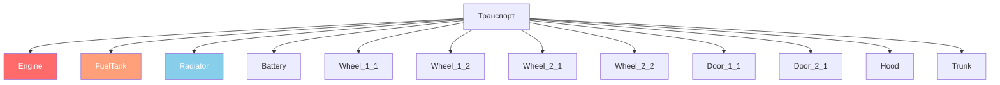

# Глава 6.2: Система транспорта

[Главная](../../README.md) | [<< Предыдущая: Система сущностей](01-entity-system.md) | **Транспорт** | [Следующая: Погода >>](03-weather.md)

---

## Введение

Транспорт в DayZ --- это сущности, расширяющие транспортную систему. Автомобили наследуют от `CarScript`, лодки от `BoatScript`, и оба типа наследуют от `Transport`. Транспорт имеет систему жидкостей, детали с независимым здоровьем, симуляцию передач и физику, управляемую движком. В этой главе описаны методы API, необходимые для взаимодействия с транспортом в скриптах.

---

## Иерархия классов

```
EntityAI
└── Transport                    // 3_Game - базовый для всего транспорта
    ├── Car                      // 3_Game - нативная физика автомобиля
    │   └── CarScript            // 4_World - скриптуемый базовый класс
    │       ├── CivilianSedan
    │       ├── OffroadHatchback
    │       ├── Hatchback_02
    │       ├── Sedan_02
    │       ├── Truck_01_Base
    │       └── ...
    └── Boat                     // 3_Game - нативная физика лодки
        └── BoatScript           // 4_World - скриптуемый базовый класс
```

---

## Transport (базовый)

**Файл:** `3_Game/entities/transport.c`

Абстрактный базовый класс для всего транспорта. Предоставляет управление местами и доступ к экипажу.

### Управление экипажем

```c
proto native int   CrewSize();                          // Общее количество мест
proto native int   CrewMemberIndex(Human crew_member);  // Получить индекс места пассажира
proto native Human CrewMember(int posIdx);              // Получить пассажира по индексу места
proto native void  CrewGetOut(int posIdx);              // Принудительно высадить из места
proto native void  CrewDeath(int posIdx);               // Убить пассажира на месте
```

### Посадка экипажа

```c
proto native int  GetAnimInstance();
proto native int  CrewPositionIndex(int componentIdx);  // Компонент в индекс места
proto native vector CrewEntryPoint(int posIdx);         // Мировая точка посадки для места
```

**Пример --- высадка всех пассажиров:**

```c
void EjectAllCrew(Transport vehicle)
{
    for (int i = 0; i < vehicle.CrewSize(); i++)
    {
        Human crew = vehicle.CrewMember(i);
        if (crew)
        {
            vehicle.CrewGetOut(i);
        }
    }
}
```

---

## Car (нативный движок)

**Файл:** `3_Game/entities/car.c`

Физика автомобиля на уровне движка. Все `proto native` методы, управляющие симуляцией транспорта.

### Двигатель

```c
proto native bool  EngineIsOn();
proto native void  EngineStart();
proto native void  EngineStop();
proto native float EngineGetRPM();
proto native float EngineGetRPMRedline();
proto native float EngineGetRPMMax();
proto native int   GetGear();
```

### Жидкости

Транспорт в DayZ имеет четыре типа жидкостей, определённых в перечислении `CarFluid`:

```c
enum CarFluid
{
    FUEL,
    OIL,
    BRAKE,
    COOLANT
}
```

```c
proto native float GetFluidCapacity(CarFluid fluid);
proto native float GetFluidFraction(CarFluid fluid);     // 0.0 - 1.0
proto native void  Fill(CarFluid fluid, float amount);
proto native void  Leak(CarFluid fluid, float amount);
proto native void  LeakAll(CarFluid fluid);
```

**Пример --- заправка транспорта:**

```c
void RefuelVehicle(Car car)
{
    float capacity = car.GetFluidCapacity(CarFluid.FUEL);
    float current = car.GetFluidFraction(CarFluid.FUEL) * capacity;
    float needed = capacity - current;
    car.Fill(CarFluid.FUEL, needed);
}
```

### Скорость

```c
proto native float GetSpeedometer();    // Скорость в км/ч (абсолютное значение)
```

### Управление (симуляция)

```c
proto native void  SetBrake(float value, int wheel = -1);    // 0.0 - 1.0, -1 = все колёса
proto native void  SetHandbrake(float value);                 // 0.0 - 1.0
proto native void  SetSteering(float value, bool analog = true);
proto native void  SetThrust(float value, int wheel = -1);    // 0.0 - 1.0
proto native void  SetClutchState(bool engaged);
```

### Колёса

```c
proto native int   WheelCount();
proto native bool  WheelIsAnyLocked();
proto native float WheelGetSurface(int wheelIdx);
```

### Обратные вызовы (переопределяйте в CarScript)

```c
void OnEngineStart();
void OnEngineStop();
void OnContact(string zoneName, vector localPos, IEntity other, Contact data);
void OnFluidChanged(CarFluid fluid, float newValue, float oldValue);
void OnGearChanged(int newGear, int oldGear);
void OnSound(CarSoundCtrl ctrl, float oldValue);
```

---

## CarScript

**Файл:** `4_World/entities/vehicles/carscript.c`

Скриптуемый класс автомобиля, от которого наследует большинство модов транспорта. Добавляет управление деталями, дверьми, фарами и звуком.

### Здоровье деталей

CarScript использует зоны урона для представления деталей транспорта. Каждая деталь может повреждаться независимо:

```c
// Проверка здоровья детали через стандартный API EntityAI
float engineHP = car.GetHealth("Engine", "Health");
float fuelTankHP = car.GetHealth("FuelTank", "Health");

// Установка здоровья детали
car.SetHealth("Engine", "Health", 0);       // Уничтожить двигатель
car.SetHealth("FuelTank", "Health", 100);   // Починить топливный бак
```

### Диаграмма зон урона



Распространённые зоны урона транспорта:

| Зона | Описание |
|------|----------|
| `""` (глобальная) | Общее здоровье транспорта |
| `"Engine"` | Двигатель |
| `"FuelTank"` | Топливный бак |
| `"Radiator"` | Радиатор (охлаждающая жидкость) |
| `"Battery"` | Аккумулятор |
| `"SparkPlug"` | Свеча зажигания |
| `"FrontLeft"` / `"FrontRight"` | Передние колёса |
| `"RearLeft"` / `"RearRight"` | Задние колёса |
| `"DriverDoor"` / `"CoDriverDoor"` | Передние двери |
| `"Hood"` / `"Trunk"` | Капот и багажник |

### Фары

```c
void SetLightsState(int state);   // 0 = выключены, 1 = включены
int  GetLightsState();
```

### Управление дверьми

```c
bool IsDoorOpen(string doorSource);
void OpenDoor(string doorSource);
void CloseDoor(string doorSource);
```

### Ключевые переопределения для пользовательского транспорта

```c
override void EEInit();                    // Инициализация деталей, жидкостей
override void OnEngineStart();             // Пользовательское поведение при запуске
override void OnEngineStop();              // Пользовательское поведение при остановке
override void EOnSimulate(IEntity other, float dt);  // Потиковая симуляция
override bool CanObjectAttachWeapon(string slot_name);
```

**Пример --- создание транспорта с полными жидкостями:**

```c
void SpawnReadyVehicle(vector pos)
{
    Car car = Car.Cast(GetGame().CreateObjectEx("CivilianSedan", pos,
                        ECE_PLACE_ON_SURFACE | ECE_INITAI | ECE_CREATEPHYSICS));
    if (!car)
        return;

    // Заполнить все жидкости
    car.Fill(CarFluid.FUEL, car.GetFluidCapacity(CarFluid.FUEL));
    car.Fill(CarFluid.OIL, car.GetFluidCapacity(CarFluid.OIL));
    car.Fill(CarFluid.BRAKE, car.GetFluidCapacity(CarFluid.BRAKE));
    car.Fill(CarFluid.COOLANT, car.GetFluidCapacity(CarFluid.COOLANT));

    // Заспавнить необходимые детали
    EntityAI carEntity = EntityAI.Cast(car);
    carEntity.GetInventory().CreateAttachment("CarBattery");
    carEntity.GetInventory().CreateAttachment("SparkPlug");
    carEntity.GetInventory().CreateAttachment("CarRadiator");
    carEntity.GetInventory().CreateAttachment("HatchbackWheel");
}
```

---

## BoatScript

**Файл:** `4_World/entities/vehicles/boatscript.c`

Скриптуемый базовый класс для лодок. API аналогичен CarScript, но с физикой на основе гребного винта.

### Двигатель и движение

```c
proto native bool  EngineIsOn();
proto native void  EngineStart();
proto native void  EngineStop();
proto native float EngineGetRPM();
```

### Жидкости

Лодки используют то же перечисление `CarFluid`, но обычно только `FUEL`:

```c
float fuel = boat.GetFluidFraction(CarFluid.FUEL);
boat.Fill(CarFluid.FUEL, boat.GetFluidCapacity(CarFluid.FUEL));
```

### Скорость

```c
proto native float GetSpeedometer();   // Скорость в км/ч
```

**Пример --- спавн лодки:**

```c
void SpawnBoat(vector waterPos)
{
    BoatScript boat = BoatScript.Cast(
        GetGame().CreateObjectEx("Boat_01", waterPos,
                                  ECE_CREATEPHYSICS | ECE_INITAI)
    );
    if (boat)
    {
        boat.Fill(CarFluid.FUEL, boat.GetFluidCapacity(CarFluid.FUEL));
    }
}
```

---

## Проверки взаимодействия с транспортом

### Проверка, находится ли игрок в транспорте

```c
PlayerBase player;
if (player.IsInVehicle())
{
    EntityAI vehicle = player.GetDrivingVehicle();
    CarScript car;
    if (Class.CastTo(car, vehicle))
    {
        float speed = car.GetSpeedometer();
        Print(string.Format("Едет со скоростью %1 км/ч", speed));
    }
}
```

### Поиск всего транспорта в мире

```c
void FindAllVehicles(out array<Transport> vehicles)
{
    vehicles = new array<Transport>;
    array<Object> objects = new array<Object>;
    array<CargoBase> proxyCargos = new array<CargoBase>;

    // Использовать большой радиус от центра карты
    GetGame().GetObjectsAtPosition(Vector(7500, 0, 7500), 15000, objects, proxyCargos);

    foreach (Object obj : objects)
    {
        Transport transport;
        if (Class.CastTo(transport, obj))
        {
            vehicles.Insert(transport);
        }
    }
}
```

---

## Итоги

| Концепция | Ключевой момент |
|-----------|----------------|
| Иерархия | `Transport` > `Car`/`Boat` > `CarScript`/`BoatScript` |
| Двигатель | `EngineStart()`, `EngineStop()`, `EngineIsOn()`, `EngineGetRPM()` |
| Жидкости | Перечисление `CarFluid`: `FUEL`, `OIL`, `BRAKE`, `COOLANT` |
| Заполнение/Утечка | `Fill(fluid, amount)`, `Leak(fluid, amount)`, `GetFluidFraction(fluid)` |
| Скорость | `GetSpeedometer()` возвращает км/ч |
| Экипаж | `CrewSize()`, `CrewMember(idx)`, `CrewGetOut(idx)` |
| Детали | Стандартные зоны урона: `"Engine"`, `"FuelTank"`, `"Radiator"` и т.д. |
| Создание | `CreateObjectEx` с `ECE_PLACE_ON_SURFACE \| ECE_INITAI \| ECE_CREATEPHYSICS` |

---

## Лучшие практики

- **Всегда включайте `ECE_CREATEPHYSICS | ECE_INITAI` при спавне транспорта.** Без физики транспорт провалится сквозь землю. Без инициализации AI симуляция двигателя не запустится и транспорт нельзя будет водить.
- **Заполняйте все четыре жидкости после спавна.** Транспорт без масла, тормозной жидкости или охлаждающей жидкости повредит себя сразу при запуске двигателя. Используйте `GetFluidCapacity()` для получения правильных максимальных значений по типу транспорта.
- **Проверяйте `CrewMember()` на null перед операциями с экипажем.** Пустые места возвращают `null`. Итерация по `CrewSize()` без проверки каждого индекса вызывает вылеты, когда места незаняты.
- **Используйте `GetSpeedometer()` вместо ручного вычисления скорости.** Спидометр движка учитывает контакт колёс, состояние трансмиссии и физику корректно. Ручные вычисления скорости по дельтам позиции ненадёжны.

---

## Совместимость и влияние

> **Совместимость модов:** Моды транспорта обычно расширяют `CarScript` через modded-классы. Конфликты возникают, когда несколько модов переопределяют одни и те же обратные вызовы вроде `OnEngineStart()` или `EOnSimulate()`.

- **Порядок загрузки:** Если два мода оба `modded class CarScript` и переопределяют `OnEngineStart()`, только последний загруженный мод выполнится, если оба не вызывают `super`. Моды, переработывающие транспорт, должны всегда вызывать `super` в каждом обратном вызове.
- **Конфликты modded-классов:** Expansion Vehicles и ванильные моды транспорта часто конфликтуют в `EEInit()` и инициализации жидкостей. Тестируйте с обоими загруженными.
- **Влияние на производительность:** `EOnSimulate()` выполняется каждый физический тик для каждого активного транспорта. Логика в этом обратном вызове должна быть минимальной; используйте аккумуляторы таймеров для затратных операций.
- **Сервер/Клиент:** `EngineStart()`, `EngineStop()`, `Fill()`, `Leak()` и `CrewGetOut()` авторитетны на сервере. `GetSpeedometer()`, `EngineIsOn()` и `GetFluidFraction()` безопасно читаются на обеих сторонах.

---

## Примеры из реальных модов

> Эти паттерны подтверждены изучением исходного кода профессиональных модов DayZ.

| Паттерн | Мод | Файл/Расположение |
|---------|-----|-------------------|
| Переопределение `EEInit()` для установки пользовательских ёмкостей жидкостей и спавна деталей | Expansion Vehicles | Подклассы `CarScript` |
| Аккумулятор в `EOnSimulate` для периодических проверок расхода топлива | Моды Vanilla+ транспорта | Переопределения `CarScript` |
| Цикл `CrewGetOut()` в команде администратора «высадить всех» | VPP Admin Tools | Модуль управления транспортом |
| Пользовательское переопределение `OnContact()` для настройки урона от столкновений | Expansion | `ExpansionCarScript` |

---

[Главная](../../README.md) | [<< Предыдущая: Система сущностей](01-entity-system.md) | **Транспорт** | [Следующая: Погода >>](03-weather.md)
