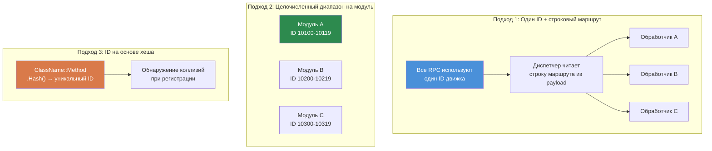

# Глава 7.3: Паттерны RPC-коммуникации

[Главная](../../README.md) | [<< Предыдущая: Модульные системы](02-module-systems.md) | **Паттерны RPC-коммуникации** | [Следующая: Персистентность конфигураций >>](04-config-persistence.md)

---

## Введение

Remote Procedure Calls (RPC) --- единственный способ передачи данных между клиентом и сервером в DayZ. Каждая админ-панель, каждый синхронизированный UI, каждое уведомление от сервера клиенту и каждый запрос действия от клиента серверу проходит через RPC. Понимание того, как правильно их строить --- с корректным порядком сериализации, проверками разрешений и обработкой ошибок --- необходимо для любого мода, который делает что-то большее, чем добавление предметов в CfgVehicles.

Эта глава охватывает фундаментальный паттерн `ScriptRPC`, жизненный цикл клиент-серверного обмена, обработку ошибок, а затем сравнивает три основных подхода к маршрутизации RPC, используемых в сообществе моддеров DayZ.

---

## Содержание

- [Основы ScriptRPC](#основы-scriptrpc)
- [Обмен клиент-сервер-клиент](#обмен-клиент-сервер-клиент)
- [Проверка разрешений перед выполнением](#проверка-разрешений-перед-выполнением)
- [Обработка ошибок и уведомления](#обработка-ошибок-и-уведомления)
- [Сериализация: контракт чтения/записи](#сериализация-контракт-чтениязаписи)
- [Сравнение трёх подходов к RPC](#сравнение-трёх-подходов-к-rpc)
- [Распространённые ошибки](#распространённые-ошибки)
- [Лучшие практики](#лучшие-практики)

---

## Основы ScriptRPC

Каждый RPC в DayZ использует класс `ScriptRPC`. Паттерн всегда один и тот же: создать, записать данные, отправить.

### Сторона отправки

```c
void SendDamageReport(PlayerIdentity target, string weaponName, float damage)
{
    ScriptRPC rpc = new ScriptRPC();

    // Записываем поля в определённом порядке
    rpc.Write(weaponName);    // поле 1: string
    rpc.Write(damage);        // поле 2: float

    // Отправляем через движок
    // Параметры: целевой объект, ID RPC, гарантированная доставка, получатель
    rpc.Send(null, MY_RPC_ID, true, target);
}
```

### Сторона приёма

Получатель читает поля в **точно таком же порядке**, в каком они были записаны:

```c
void OnRPC_DamageReport(PlayerIdentity sender, Object target, ParamsReadContext ctx)
{
    string weaponName;
    if (!ctx.Read(weaponName)) return;  // поле 1: string

    float damage;
    if (!ctx.Read(damage)) return;      // поле 2: float

    // Используем данные
    Print("Hit by " + weaponName + " for " + damage.ToString() + " damage");
}
```

### Параметры Send

```c
rpc.Send(object, rpcId, guaranteed, identity);
```

| Параметр | Тип | Описание |
|----------|-----|----------|
| `object` | `Object` | Целевая сущность (например, игрок или транспорт). Используйте `null` для глобальных RPC. |
| `rpcId` | `int` | Целое число, идентифицирующее тип RPC. Должно совпадать на обеих сторонах. |
| `guaranteed` | `bool` | `true` = надёжная доставка (подобно TCP, повторная отправка при потере). `false` = ненадёжная (отправил и забыл). |
| `identity` | `PlayerIdentity` | Получатель. `null` от клиента = отправка на сервер. `null` от сервера = рассылка всем клиентам. Конкретный identity = отправка только этому клиенту. |

### Когда использовать `guaranteed`

- **`true` (надёжная):** Изменения конфигурации, выдача разрешений, команды телепортации, действия бана --- всё, где потерянный пакет приведёт к рассинхронизации клиента и сервера.
- **`false` (ненадёжная):** Частые обновления позиции, визуальные эффекты, состояние HUD, которое и так обновляется каждые несколько секунд. Меньше накладных расходов, нет очереди повторной отправки.

---

## Обмен клиент-сервер-клиент

Самый распространённый паттерн RPC --- это обмен «туда-обратно»: клиент запрашивает действие, сервер проверяет и выполняет, сервер отправляет результат обратно.

```
КЛИЕНТ                          СЕРВЕР
  │                               │
  │  1. Запрос RPC ──────────►   │
  │     (действие + параметры)   │
  │                               │  2. Проверка разрешений
  │                               │  3. Выполнение действия
  │                               │  4. Подготовка ответа
  │  ◄────────── 5. Ответ RPC    │
  │     (результат + данные)     │
  │                               │
  │  6. Обновление UI            │
```

### Полный пример: запрос телепортации

**Клиент отправляет запрос:**

```c
class TeleportClient
{
    void RequestTeleport(vector position)
    {
        ScriptRPC rpc = new ScriptRPC();
        rpc.Write(position);
        rpc.Send(null, MYMOD_RPC_TELEPORT, true, null);  // null identity = отправка на сервер
    }
};
```

**Сервер получает, проверяет, выполняет, отвечает:**

```c
class TeleportServer
{
    void OnRPC_TeleportRequest(PlayerIdentity sender, Object target, ParamsReadContext ctx)
    {
        // 1. Читаем данные запроса
        vector position;
        if (!ctx.Read(position)) return;

        // 2. Проверяем разрешения
        if (!MyPermissions.GetInstance().HasPermission(sender.GetPlainId(), "MyMod.Admin.Teleport"))
        {
            SendError(sender, "No permission to teleport");
            return;
        }

        // 3. Валидируем данные
        if (position[1] < 0 || position[1] > 1000)
        {
            SendError(sender, "Invalid teleport height");
            return;
        }

        // 4. Выполняем действие
        PlayerBase player = PlayerBase.Cast(sender.GetPlayer());
        if (!player) return;

        player.SetPosition(position);

        // 5. Отправляем ответ об успехе
        ScriptRPC response = new ScriptRPC();
        response.Write(true);           // флаг успеха
        response.Write(position);       // возвращаем позицию
        response.Send(null, MYMOD_RPC_TELEPORT_RESULT, true, sender);
    }
};
```

**Клиент получает ответ:**

```c
class TeleportClient
{
    void OnRPC_TeleportResult(PlayerIdentity sender, Object target, ParamsReadContext ctx)
    {
        bool success;
        if (!ctx.Read(success)) return;

        vector position;
        if (!ctx.Read(position)) return;

        if (success)
        {
            // Обновляем UI: "Телепортирован в X, Y, Z"
        }
    }
};
```

---

## Проверка разрешений перед выполнением

Каждый серверный обработчик RPC, выполняющий привилегированное действие, **обязан** проверять разрешения перед выполнением. Никогда не доверяйте клиенту.

### Паттерн

```c
void OnRPC_AdminAction(PlayerIdentity sender, Object target, ParamsReadContext ctx)
{
    // ПРАВИЛО 1: Всегда проверяйте, что отправитель существует
    if (!sender) return;

    // ПРАВИЛО 2: Проверяйте разрешения до чтения данных
    if (!MyPermissions.GetInstance().HasPermission(sender.GetPlainId(), "MyMod.Admin.Ban"))
    {
        MyLog.Warning("BanRPC", "Unauthorized ban attempt from " + sender.GetName());
        return;
    }

    // ПРАВИЛО 3: Только теперь читайте и выполняйте
    string targetUid;
    if (!ctx.Read(targetUid)) return;

    // ... выполнение бана
}
```

### Почему проверять до чтения?

Чтение данных от неавторизованного клиента тратит серверные ресурсы. Что ещё важнее, неправильно сформированные данные от вредоносного клиента могут вызвать ошибки парсинга. Предварительная проверка разрешений --- это дешёвая защита, которая немедленно отклоняет злоумышленников.

### Логирование неавторизованных попыток

Всегда логируйте неудачные проверки разрешений. Это создаёт журнал аудита и помогает владельцам серверов обнаруживать попытки эксплойтов:

```c
if (!HasPermission(sender, "MyMod.Spawn"))
{
    MyLog.Warning("SpawnRPC", "Denied spawn request from "
        + sender.GetName() + " (" + sender.GetPlainId() + ")");
    return;
}
```

---

## Обработка ошибок и уведомления

RPC могут отказать по множеству причин: разрыв сети, некорректные данные, ошибки валидации на сервере. Надёжные моды обрабатывают все эти случаи.

### Ошибки чтения

Каждый вызов `ctx.Read()` может завершиться неудачей. Всегда проверяйте возвращаемое значение:

```c
// ПЛОХО: Игнорирование ошибок чтения
string name;
ctx.Read(name);     // Если это не удастся, name будет "" — тихое повреждение данных
int count;
ctx.Read(count);    // Здесь считываются неправильные байты — всё после этого мусор

// ХОРОШО: Ранний возврат при любой ошибке чтения
string name;
if (!ctx.Read(name)) return;
int count;
if (!ctx.Read(count)) return;
```

### Паттерн ответа с ошибкой

Когда сервер отклоняет запрос, отправьте структурированную ошибку обратно клиенту, чтобы UI мог её отобразить:

```c
// Сервер: отправка ошибки
void SendError(PlayerIdentity target, string errorMsg)
{
    ScriptRPC rpc = new ScriptRPC();
    rpc.Write(false);        // success = false
    rpc.Write(errorMsg);     // причина
    rpc.Send(null, MY_RPC_RESPONSE_ID, true, target);
}

// Клиент: обработка ошибки
void OnRPC_Response(PlayerIdentity sender, Object target, ParamsReadContext ctx)
{
    bool success;
    if (!ctx.Read(success)) return;

    if (!success)
    {
        string errorMsg;
        if (!ctx.Read(errorMsg)) return;

        // Отображаем ошибку в UI
        MyLog.Warning("MyMod", "Server error: " + errorMsg);
        return;
    }

    // Обработка успеха...
}
```

### Широковещательные уведомления

Для событий, которые должны видеть все клиенты (килфид, объявления, изменения погоды), сервер рассылает с `identity = null`:

```c
// Сервер: рассылка всем клиентам
void BroadcastAnnouncement(string message)
{
    ScriptRPC rpc = new ScriptRPC();
    rpc.Write(message);
    rpc.Send(null, RPC_ANNOUNCEMENT, true, null);  // null = всем клиентам
}
```

---

## Сериализация: контракт чтения/записи

Самое важное правило RPC в DayZ: **порядок чтения должен точно совпадать с порядком записи, тип в тип.**

### Контракт

```c
// ОТПРАВИТЕЛЬ записывает:
rpc.Write("hello");      // 1. string
rpc.Write(42);           // 2. int
rpc.Write(3.14);         // 3. float
rpc.Write(true);         // 4. bool

// ПОЛУЧАТЕЛЬ читает в ТОМ ЖЕ порядке:
string s;   ctx.Read(s);     // 1. string
int i;      ctx.Read(i);     // 2. int
float f;    ctx.Read(f);     // 3. float
bool b;     ctx.Read(b);     // 4. bool
```

### Что происходит при несовпадении порядка

Если вы поменяете порядок чтения, десериализатор интерпретирует байты, предназначенные для одного типа, как другой. Чтение `int` там, где был записан `string`, выдаст мусор, и каждое последующее чтение будет со смещением --- повреждая все оставшиеся поля. Движок не выбрасывает исключение; он тихо возвращает неверные данные или заставляет `Read()` возвращать `false`.

### Поддерживаемые типы

| Тип | Примечания |
|-----|-----------|
| `int` | 32-битный знаковый |
| `float` | 32-битный IEEE 754 |
| `bool` | Один байт |
| `string` | UTF-8 с префиксом длины |
| `vector` | Три float (x, y, z) |
| `Object` (как параметр target) | Ссылка на сущность, разрешается движком |

### Сериализация коллекций

Встроенной сериализации массивов нет. Сначала запишите количество, затем каждый элемент:

```c
// ОТПРАВИТЕЛЬ
array<string> names = {"Alice", "Bob", "Charlie"};
rpc.Write(names.Count());
for (int i = 0; i < names.Count(); i++)
{
    rpc.Write(names[i]);
}

// ПОЛУЧАТЕЛЬ
int count;
if (!ctx.Read(count)) return;

array<string> names = new array<string>();
for (int i = 0; i < count; i++)
{
    string name;
    if (!ctx.Read(name)) return;
    names.Insert(name);
}
```

### Сериализация сложных объектов

Для сложных данных сериализуйте поле за полем. Не пытайтесь передавать объекты напрямую через `Write()`:

```c
// ОТПРАВИТЕЛЬ: разворачиваем объект в примитивы
rpc.Write(player.GetName());
rpc.Write(player.GetHealth());
rpc.Write(player.GetPosition());

// ПОЛУЧАТЕЛЬ: восстанавливаем
string name;    ctx.Read(name);
float health;   ctx.Read(health);
vector pos;     ctx.Read(pos);
```

---

## Сравнение трёх подходов к RPC

Сообщество моддеров DayZ использует три принципиально разных подхода к маршрутизации RPC. У каждого есть свои компромиссы.

### Сравнение трёх подходов к RPC



### 1. Именованные RPC через CF

Community Framework предоставляет `GetRPCManager()`, который маршрутизирует RPC по строковым именам, сгруппированным по пространству имён мода.

```c
// Регистрация (в OnInit):
GetRPCManager().AddRPC("MyMod", "RPC_SpawnItem", this, SingleplayerExecutionType.Server);

// Отправка с клиента:
GetRPCManager().SendRPC("MyMod", "RPC_SpawnItem", new Param1<string>("AK74"), true);

// Обработчик получает:
void RPC_SpawnItem(CallType type, ParamsReadContext ctx, PlayerIdentity sender, Object target)
{
    if (type != CallType.Server) return;

    Param1<string> data;
    if (!ctx.Read(data)) return;

    string className = data.param1;
    // ... спавн предмета
}
```

**Преимущества:**
- Строковая маршрутизация читаема и свободна от коллизий
- Группировка по пространству имён (`"MyMod"`) предотвращает конфликты имён между модами
- Широко используется --- если вы интегрируетесь с COT/Expansion, вы это используете

**Недостатки:**
- Требует CF в качестве зависимости
- Использует обёртки `Param`, которые громоздки для сложных payload
- Сравнение строк при каждой диспетчеризации (незначительные накладные расходы)

### 2. COT / ванильные RPC на целочисленных диапазонах

Ванильный DayZ и некоторые части COT используют сырые целочисленные ID RPC. Каждый мод занимает диапазон целых чисел и диспетчеризует в переопределённом `OnRPC` модифицированного класса.

```c
// Определяем ID RPC (выбираем уникальный диапазон, чтобы избежать коллизий)
const int MY_RPC_SPAWN_ITEM     = 90001;
const int MY_RPC_DELETE_ITEM    = 90002;
const int MY_RPC_TELEPORT       = 90003;

// Отправка:
ScriptRPC rpc = new ScriptRPC();
rpc.Write("AK74");
rpc.Send(null, MY_RPC_SPAWN_ITEM, true, null);

// Получение (в модифицированном DayZGame или сущности):
modded class DayZGame
{
    override void OnRPC(PlayerIdentity sender, Object target, int rpc_type, ParamsReadContext ctx)
    {
        switch (rpc_type)
        {
            case MY_RPC_SPAWN_ITEM:
                HandleSpawnItem(sender, ctx);
                return;
            case MY_RPC_DELETE_ITEM:
                HandleDeleteItem(sender, ctx);
                return;
        }

        super.OnRPC(sender, target, rpc_type, ctx);
    }
};
```

**Преимущества:**
- Нет зависимостей --- работает с ванильным DayZ
- Сравнение целых чисел быстрое
- Полный контроль над конвейером RPC

**Недостатки:**
- **Риск коллизии ID**: два мода, выбравших один и тот же целочисленный диапазон, будут тихо перехватывать RPC друг друга
- Ручная логика диспетчеризации (switch/case) становится громоздкой при большом количестве RPC
- Нет изоляции пространств имён
- Нет встроенного реестра или обнаружения

### 3. Пользовательские RPC со строковой маршрутизацией

Пользовательская система со строковой маршрутизацией использует один ID RPC движка и мультиплексирует, записывая имя мода + имя функции как строковый заголовок в каждый RPC. Вся маршрутизация происходит внутри статического класса-менеджера (`MyRPC` в этом примере).

```c
// Регистрация:
MyRPC.Register("MyMod", "RPC_SpawnItem", this, MyRPCSide.SERVER);

// Отправка (только заголовок, без payload):
MyRPC.Send("MyMod", "RPC_SpawnItem", null, true, null);

// Отправка (с payload):
ScriptRPC rpc = MyRPC.CreateRPC("MyMod", "RPC_SpawnItem");
rpc.Write("AK74");
rpc.Write(5);    // количество
rpc.Send(null, MyRPC.FRAMEWORK_RPC_ID, true, null);

// Обработчик:
void RPC_SpawnItem(PlayerIdentity sender, Object target, ParamsReadContext ctx)
{
    string className;
    if (!ctx.Read(className)) return;

    int quantity;
    if (!ctx.Read(quantity)) return;

    // ... спавн предметов
}
```

**Преимущества:**
- Нулевой риск коллизий --- строковое пространство имён + имя функции глобально уникальны
- Нулевая зависимость от CF (но опционально мост к `GetRPCManager()` CF, когда CF присутствует)
- Один ID движка означает минимальный след от хуков
- Хелпер `CreateRPC()` предзаписывает заголовок маршрутизации, так что вы записываете только payload
- Чистая сигнатура обработчика: `(PlayerIdentity, Object, ParamsReadContext)`

**Недостатки:**
- Два дополнительных чтения строк на каждый RPC (заголовок маршрутизации) --- минимальные накладные расходы на практике
- Пользовательская система означает, что другие моды не могут обнаружить ваши RPC через реестр CF
- Диспетчеризация только через рефлексию `CallFunctionParams`, что немного медленнее прямого вызова метода

### Сравнительная таблица

| Функция | Именованные CF | Целочисленный диапазон | Пользовательская строковая маршрутизация |
|---------|---------------|----------------------|----------------------------------------|
| **Риск коллизий** | Нет (пространства имён) | Высокий | Нет (пространства имён) |
| **Зависимости** | Требует CF | Нет | Нет |
| **Сигнатура обработчика** | `(CallType, ctx, sender, target)` | Пользовательская | `(sender, target, ctx)` |
| **Обнаруживаемость** | Реестр CF | Нет | `MyRPC.s_Handlers` |
| **Накладные расходы диспетчеризации** | Поиск по строке | Switch по целому числу | Поиск по строке |
| **Стиль payload** | Обёртки Param | Сырой Write/Read | Сырой Write/Read |
| **Мост к CF** | Нативный | Ручной | Автоматический (`#ifdef`) |

### Какой выбрать?

- **Ваш мод и так зависит от CF** (интеграция с COT/Expansion): используйте именованные RPC через CF
- **Автономный мод, минимум зависимостей**: используйте целочисленный диапазон или постройте систему строковой маршрутизации
- **Создаёте фреймворк**: рассмотрите систему строковой маршрутизации, как в примере `MyRPC` выше
- **Обучение / прототипирование**: целочисленный диапазон проще всего для понимания

---

## Распространённые ошибки

### 1. Забыли зарегистрировать обработчик

Вы отправляете RPC, но на другой стороне ничего не происходит. Обработчик не был зарегистрирован.

```c
// НЕПРАВИЛЬНО: Нет регистрации — сервер не знает об этом обработчике
class MyModule
{
    void RPC_DoThing(PlayerIdentity sender, Object target, ParamsReadContext ctx) { ... }
};

// ПРАВИЛЬНО: Регистрация в OnInit
class MyModule
{
    void OnInit()
    {
        MyRPC.Register("MyMod", "RPC_DoThing", this, MyRPCSide.SERVER);
    }

    void RPC_DoThing(PlayerIdentity sender, Object target, ParamsReadContext ctx) { ... }
};
```

### 2. Несовпадение порядка чтения/записи

Самый частый баг RPC. Отправитель записывает `(string, int, float)`, а получатель читает `(string, float, int)`. Никакого сообщения об ошибке --- просто мусорные данные.

**Исправление:** Напишите блок комментариев, документирующий порядок полей, как на стороне отправки, так и на стороне приёма:

```c
// Формат передачи: [string weaponName] [int damage] [float distance]
```

### 3. Отправка клиентских данных на сервер

Сервер не может прочитать состояние виджетов клиента, состояние ввода или локальные переменные. Если вам нужно отправить выбор из UI на сервер, сериализуйте соответствующее значение (строку, индекс, ID) --- а не сам объект виджета.

### 4. Широковещание вместо адресной отправки

```c
// НЕПРАВИЛЬНО: Отправляет ВСЕМ клиентам, когда вы хотели отправить одному
rpc.Send(null, MY_RPC_ID, true, null);

// ПРАВИЛЬНО: Отправка конкретному клиенту
rpc.Send(null, MY_RPC_ID, true, targetIdentity);
```

### 5. Необработка устаревших обработчиков при перезапуске миссии

Если модуль регистрирует обработчик RPC, а затем уничтожается при завершении миссии, обработчик всё ещё указывает на мёртвый объект. Следующая диспетчеризация RPC приведёт к краху.

**Исправление:** Всегда отменяйте регистрацию или очищайте обработчики при завершении миссии:

```c
override void OnMissionFinish()
{
    MyRPC.Unregister("MyMod", "RPC_DoThing");
}
```

Или используйте централизованный `Cleanup()`, который очищает всю карту обработчиков (как это делает `MyRPC.Cleanup()`).

---

## Лучшие практики

1. **Всегда проверяйте возвращаемые значения `ctx.Read()`.** Каждое чтение может завершиться неудачей. Немедленно возвращайтесь при ошибке.

2. **Всегда валидируйте отправителя на сервере.** Проверяйте, что `sender` не null и имеет необходимое разрешение, прежде чем что-либо делать.

3. **Документируйте формат передачи.** Как на стороне отправки, так и на стороне приёма пишите комментарий со списком полей в порядке с их типами.

4. **Используйте надёжную доставку для изменений состояния.** Ненадёжная доставка подходит только для быстрых, кратковременных обновлений (позиция, эффекты).

5. **Держите payload маленькими.** DayZ имеет практическое ограничение размера RPC. Для больших данных (синхронизация конфигурации, списки игроков) разбивайте на несколько RPC или используйте пагинацию.

6. **Регистрируйте обработчики рано.** `OnInit()` --- самое безопасное место. Клиенты могут подключиться до завершения `OnMissionStart()`.

7. **Очищайте обработчики при завершении.** Либо отменяйте регистрацию по одному, либо очищайте весь реестр в `OnMissionFinish()`.

8. **Используйте `CreateRPC()` для данных, `Send()` для сигналов.** Если вам нечего отправлять (просто сигнал «сделай это»), используйте `Send()` только с заголовком. Если есть данные, используйте `CreateRPC()` + ручная запись + ручной `rpc.Send()`.

---

## Совместимость и влияние

- **Мульти-мод:** RPC на целочисленных диапазонах подвержены коллизиям --- два мода, выбравших один и тот же ID, тихо перехватывают сообщения друг друга. RPC со строковой маршрутизацией или именованные через CF избегают этого, используя пространство имён + имя функции в качестве ключа.
- **Порядок загрузки:** Порядок регистрации обработчиков RPC имеет значение только тогда, когда несколько модов `modded class DayZGame` и переопределяют `OnRPC`. Каждый должен вызывать `super.OnRPC()` для необработанных ID, иначе нижестоящие моды никогда не получат свои RPC. Системы строковой маршрутизации избегают этого, используя один ID движка.
- **Listen-сервер:** На listen-серверах и клиент, и сервер работают в одном процессе. RPC, отправленный с `identity = null` со стороны сервера, также будет получен локально. Защищайте обработчики с помощью `if (type != CallType.Server) return;` или проверяйте `GetGame().IsServer()` / `GetGame().IsClient()` соответственно.
- **Производительность:** Накладные расходы диспетчеризации RPC минимальны (поиск по строке или switch по целому числу). Узкое место --- размер payload --- DayZ имеет практический лимит на RPC (~64 КБ). Для больших данных (синхронизация конфигурации) пагинируйте по нескольким RPC.
- **Миграция:** ID RPC --- внутренняя деталь мода, не зависящая от обновлений версии DayZ. Если вы измените формат передачи RPC (добавите/удалите поля), старые клиенты, общающиеся с новым сервером, тихо рассинхронизируются. Версионируйте ваши payload RPC или принудительно обновляйте клиентов.

---

## Теория и практика

| Учебник говорит | Реальность DayZ |
|-----------------|-----------------|
| Используйте протобуферы или сериализацию на основе схем | Enforce Script не поддерживает protobuf; вы вручную пишете `Write`/`Read` примитивов в согласованном порядке |
| Валидируйте все входные данные с применением схемы | Валидации по схеме не существует; каждое возвращаемое значение `ctx.Read()` нужно проверять индивидуально |
| RPC должны быть идемпотентными | Практично в DayZ только для RPC-запросов; мутирующие RPC (спавн, удаление, телепорт) по сути неидемпотентны --- защищайте проверками разрешений |

---

[Главная](../../README.md) | [<< Предыдущая: Модульные системы](02-module-systems.md) | **Паттерны RPC-коммуникации** | [Следующая: Персистентность конфигураций >>](04-config-persistence.md)
