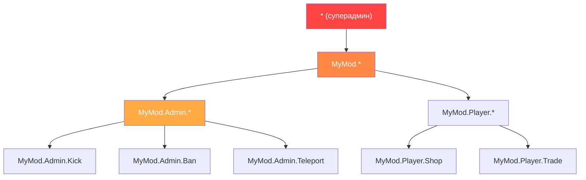

# Глава 7.5: Системы разрешений

[Главная](../../README.md) | [<< Предыдущая: Персистентность конфигурации](04-config-persistence.md) | **Системы разрешений** | [Следующая: Событийно-ориентированная архитектура >>](06-events.md)

---

## Введение

Каждому инструменту администратора, каждому привилегированному действию и каждой функции модерации в DayZ нужна система разрешений. Вопрос не в том, проверять ли разрешения, а в том, как их структурировать. Сообщество моддеров DayZ выработало три основных паттерна: иерархические разрешения с точечным разделением, назначение ролей через группы пользователей (VPP) и ролевой доступ на уровне фреймворка (CF/COT). Каждый имеет свои компромиссы в гранулярности, сложности и удобстве для владельцев серверов.

Эта глава охватывает все три паттерна, процесс проверки разрешений, форматы хранения и работу с подстановочными знаками/суперадмином.

---

## Содержание

- [Почему разрешения важны](#почему-разрешения-важны)
- [Иерархические с точечным разделением (паттерн MyMod)](#иерархические-с-точечным-разделением-паттерн-mymod)
- [Паттерн VPP UserGroup](#паттерн-vpp-usergroup)
- [Ролевой паттерн CF (COT)](#ролевой-паттерн-cf-cot)
- [Процесс проверки разрешений](#процесс-проверки-разрешений)
- [Форматы хранения](#форматы-хранения)
- [Подстановочные знаки и паттерны суперадмина](#подстановочные-знаки-и-паттерны-суперадмина)
- [Миграция между системами](#миграция-между-системами)
- [Лучшие практики](#лучшие-практики)

---

## Почему разрешения важны

Без системы разрешений у вас два варианта: либо каждый игрок может делать всё (хаос), либо вы жёстко вписываете Steam64 ID в скрипты (неподдерживаемо). Система разрешений позволяет владельцам серверов определять, кто что может делать, без изменения кода.

Три правила безопасности:

1. **Никогда не доверяй клиенту.** Клиент отправляет запрос; сервер решает, выполнять ли его.
2. **Запрет по умолчанию.** Если игроку не предоставлено разрешение явно, он его не имеет.
3. **Отказ при ошибке.** Если сама проверка разрешений завершилась ошибкой (null identity, повреждённые данные), действие запрещается.

---

## Иерархические с точечным разделением (паттерн MyMod)

MyMod использует строки разрешений с точечным разделением, организованные в древовидную иерархию. Каждое разрешение --- это путь вроде `"MyMod.Admin.Teleport"` или `"MyMod.Missions.Start"`. Подстановочные знаки позволяют предоставлять целые поддеревья.

### Формат разрешений

```
MyMod                           (корневое пространство имён)
├── Admin                        (инструменты администратора)
│   ├── Panel                    (открыть панель администратора)
│   ├── Teleport                 (телепортация себя/других)
│   ├── Kick                     (кик игроков)
│   ├── Ban                      (бан игроков)
│   └── Weather                  (изменение погоды)
├── Missions                     (система миссий)
│   ├── Start                    (запуск миссий вручную)
│   └── Stop                     (остановка миссий)
└── AI                           (система AI)
    ├── Spawn                    (спавн AI вручную)
    └── Config                   (редактирование конфига AI)
```

### Модель данных

Каждый игрок (идентифицируется по Steam64 ID) имеет массив предоставленных строк разрешений:

```c
class MyPermissionsData
{
    // ключ: Steam64 ID, значение: массив строк разрешений
    ref map<string, ref TStringArray> Admins;

    void MyPermissionsData()
    {
        Admins = new map<string, ref TStringArray>();
    }
};
```

### Проверка разрешений

Проверка проходит по предоставленным разрешениям игрока и поддерживает три типа совпадений: точное совпадение, полный подстановочный знак (`"*"`) и префиксный подстановочный знак (`"MyMod.Admin.*"`):

```c
bool HasPermission(string plainId, string permission)
{
    if (plainId == "" || permission == "")
        return false;

    TStringArray perms;
    if (!m_Permissions.Find(plainId, perms))
        return false;

    for (int i = 0; i < perms.Count(); i++)
    {
        string granted = perms[i];

        // Полный подстановочный знак: суперадмин
        if (granted == "*")
            return true;

        // Точное совпадение
        if (granted == permission)
            return true;

        // Префиксный подстановочный знак: "MyMod.Admin.*" совпадает с "MyMod.Admin.Teleport"
        if (granted.IndexOf("*") > 0)
        {
            string prefix = granted.Substring(0, granted.Length() - 1);
            if (permission.IndexOf(prefix) == 0)
                return true;
        }
    }

    return false;
}
```

### Хранение в JSON

```json
{
    "Admins": {
        "76561198000000001": ["*"],
        "76561198000000002": ["MyMod.Admin.Panel", "MyMod.Admin.Teleport"],
        "76561198000000003": ["MyMod.Missions.*"],
        "76561198000000004": ["MyMod.Admin.Kick", "MyMod.Admin.Ban"]
    }
}
```

### Преимущества

- **Тонкая настройка:** вы можете предоставить именно те разрешения, которые нужны каждому администратору
- **Иерархичность:** подстановочные знаки предоставляют целые поддеревья без перечисления каждого разрешения
- **Самодокументируемость:** строка разрешения говорит вам, что она контролирует
- **Расширяемость:** новые разрешения --- это просто новые строки --- никаких изменений схемы

### Недостатки

- **Нет именованных ролей:** если 10 администраторам нужен одинаковый набор, его придётся указать 10 раз
- **На основе строк:** опечатки в строках разрешений молча не совпадают (просто не срабатывают)

---

## Паттерн VPP UserGroup

VPP Admin Tools использует систему на основе групп. Вы определяете именованные группы (роли) с наборами разрешений, а затем назначаете игроков группам.

### Концепция

```
Группы:
  "SuperAdmin"  → [все разрешения]
  "Moderator"   → [kick, ban, mute, teleport]
  "Builder"     → [spawn objects, teleport, ESP]

Игроки:
  "76561198000000001" → "SuperAdmin"
  "76561198000000002" → "Moderator"
  "76561198000000003" → "Builder"
```

### Паттерн реализации

```c
class VPPUserGroup
{
    string GroupName;
    ref array<string> Permissions;
    ref array<string> Members;  // Steam64 ID

    bool HasPermission(string permission)
    {
        if (!Permissions) return false;

        for (int i = 0; i < Permissions.Count(); i++)
        {
            if (Permissions[i] == permission)
                return true;
            if (Permissions[i] == "*")
                return true;
        }
        return false;
    }
};

class VPPPermissionManager
{
    ref array<ref VPPUserGroup> m_Groups;

    bool PlayerHasPermission(string plainId, string permission)
    {
        for (int i = 0; i < m_Groups.Count(); i++)
        {
            VPPUserGroup group = m_Groups[i];

            // Проверить, находится ли игрок в этой группе
            if (group.Members.Find(plainId) == -1)
                continue;

            if (group.HasPermission(permission))
                return true;
        }
        return false;
    }
};
```

### Хранение в JSON

```json
{
    "Groups": [
        {
            "GroupName": "SuperAdmin",
            "Permissions": ["*"],
            "Members": ["76561198000000001"]
        },
        {
            "GroupName": "Moderator",
            "Permissions": [
                "admin.kick",
                "admin.ban",
                "admin.mute",
                "admin.teleport"
            ],
            "Members": [
                "76561198000000002",
                "76561198000000003"
            ]
        },
        {
            "GroupName": "Builder",
            "Permissions": [
                "admin.spawn",
                "admin.teleport",
                "admin.esp"
            ],
            "Members": [
                "76561198000000004"
            ]
        }
    ]
}
```

### Преимущества

- **Ролевая модель:** определите роль один раз, назначьте её множеству игроков
- **Привычность:** владельцы серверов понимают системы групп/ролей из других игр
- **Простые массовые изменения:** измените разрешения группы, и все участники будут обновлены

### Недостатки

- **Менее гранулярно без дополнительных усилий:** предоставление одному конкретному администратору одного дополнительного разрешения означает создание новой группы или добавление пользовательских переопределений
- **Наследование групп сложное:** VPP не поддерживает нативно иерархию групп (например, «Admin» наследует все разрешения «Moderator»)

---

## Ролевой паттерн CF (COT)

Community Framework / COT использует систему ролей и разрешений, где роли определяются с явными наборами разрешений, а игроки назначаются ролям.

### Концепция

Система разрешений CF похожа на группы VPP, но интегрирована на уровне фреймворка, что делает её доступной для всех модов на основе CF:

```c
// Паттерн COT (упрощённо)
// Роли определяются в AuthFile.json
// Каждая роль имеет имя и массив разрешений
// Игроки назначаются ролям по Steam64 ID

class CF_Permission
{
    string m_Name;
    ref array<ref CF_Permission> m_Children;
    int m_State;  // ALLOW, DENY, INHERIT
};
```

### Дерево разрешений

CF представляет разрешения в виде древовидной структуры, где каждый узел может быть явно разрешён, запрещён или наследовать от родителя:

```
Root
├── Admin [ALLOW]
│   ├── Kick [INHERIT → ALLOW]
│   ├── Ban [INHERIT → ALLOW]
│   └── Teleport [DENY]        ← Явно запрещено, хотя Admin имеет ALLOW
└── ESP [ALLOW]
```

Эта трёхсостоятельная система (разрешить/запретить/наследовать) более выразительна, чем бинарные (предоставлено/не предоставлено) системы MyMod и VPP. Она позволяет предоставить широкую категорию и затем создать исключения.

### Хранение в JSON

```json
{
    "Roles": {
        "Moderator": {
            "admin": {
                "kick": 2,
                "ban": 2,
                "teleport": 1
            }
        }
    },
    "Players": {
        "76561198000000001": {
            "Role": "SuperAdmin"
        }
    }
}
```

(Где `2 = ALLOW`, `1 = DENY`, `0 = INHERIT`)

### Преимущества

- **Трёхсостоятельные разрешения:** разрешить, запретить, наследовать дают максимальную гибкость
- **Древовидная структура:** отражает иерархическую природу путей разрешений
- **Уровень фреймворка:** все моды на CF разделяют одну систему разрешений

### Недостатки

- **Сложность:** три состояния сложнее для понимания владельцами серверов, чем простое «предоставлено»
- **Зависимость от CF:** работает только с Community Framework

---

## Процесс проверки разрешений

Независимо от используемой системы, серверная проверка разрешений следует одному и тому же паттерну:

```
Клиент отправляет RPC-запрос
        │
        ▼
Серверный обработчик RPC получает его
        │
        ▼
    ┌─────────────────────────────────┐
    │ Идентичность отправителя         │
    │ не null?                         │
    │ (Валидация на сетевом уровне)    │
    └───────────┬─────────────────────┘
                │ Нет → return (молча отбросить)
                │ Да ▼
    ┌─────────────────────────────────┐
    │ У отправителя есть необходимое   │
    │ разрешение для этого действия?   │
    └───────────┬─────────────────────┘
                │ Нет → залогировать предупреждение, при необходимости отправить ошибку клиенту, return
                │ Да ▼
    ┌─────────────────────────────────┐
    │ Валидировать данные запроса      │
    │ (прочитать параметры, проверить  │
    │ границы)                        │
    └───────────┬─────────────────────┘
                │ Невалидно → отправить ошибку клиенту, return
                │ Валидно ▼
    ┌─────────────────────────────────┐
    │ Выполнить привилегированное      │
    │ действие                        │
    │ Залогировать действие с ID       │
    │ администратора                   │
    │ Отправить ответ об успехе        │
    └─────────────────────────────────┘
```

### Реализация

```c
void OnRPC_KickPlayer(PlayerIdentity sender, Object target, ParamsReadContext ctx)
{
    // Шаг 1: Валидация отправителя
    if (!sender) return;

    // Шаг 2: Проверка разрешения
    if (!MyPermissions.GetInstance().HasPermission(sender.GetPlainId(), "MyMod.Admin.Kick"))
    {
        MyLog.Warning("Admin", "Unauthorized kick attempt: " + sender.GetName());
        return;
    }

    // Шаг 3: Чтение и валидация данных
    string targetUid;
    if (!ctx.Read(targetUid)) return;

    if (targetUid == sender.GetPlainId())
    {
        // Нельзя кикнуть себя
        SendError(sender, "Cannot kick yourself");
        return;
    }

    // Шаг 4: Выполнение
    PlayerIdentity targetIdentity = FindPlayerByUid(targetUid);
    if (!targetIdentity)
    {
        SendError(sender, "Player not found");
        return;
    }

    GetGame().DisconnectPlayer(targetIdentity);

    // Шаг 5: Логирование и ответ
    MyLog.Info("Admin", sender.GetName() + " kicked " + targetIdentity.GetName());
    SendSuccess(sender, "Player kicked");
}
```

---

## Форматы хранения

Все три системы хранят разрешения в JSON. Различия в структуре:

### Плоский формат для каждого игрока

```json
{
    "Admins": {
        "STEAM64_ID": ["perm.a", "perm.b", "perm.c"]
    }
}
```

**Файл:** Один файл для всех игроков.
**Плюсы:** Просто, легко редактировать вручную.
**Минусы:** Избыточно, если многие игроки имеют одинаковые разрешения.

### Файл для каждого игрока (Expansion / Player Data)

```json
// Файл: $profile:MyMod/Players/76561198xxxxx.json
{
    "UID": "76561198xxxxx",
    "Permissions": ["perm.a", "perm.b"],
    "LastLogin": "2025-01-15 14:30:00"
}
```

**Плюсы:** Каждый игрок независим; нет проблем с блокировками.
**Минусы:** Много маленьких файлов; поиск «кто имеет разрешение X?» требует сканирования всех файлов.

### На основе групп (VPP)

```json
{
    "Groups": [
        {
            "GroupName": "RoleName",
            "Permissions": ["perm.a", "perm.b"],
            "Members": ["STEAM64_ID_1", "STEAM64_ID_2"]
        }
    ]
}
```

**Плюсы:** Изменения ролей распространяются на всех участников мгновенно.
**Минусы:** Игрок не может легко иметь индивидуальные переопределения разрешений без выделенной группы.

### Выбор формата

| Фактор | Плоский для игрока | Файл для игрока | На основе групп |
|--------|----------------|-----------------|-------------|
| **Маленький сервер (1-5 админов)** | Лучший | Избыточно | Избыточно |
| **Средний сервер (5-20 админов)** | Хорошо | Хорошо | Лучший |
| **Большое сообщество (20+ ролей)** | Избыточно | Файлы множатся | Лучший |
| **Индивидуальная настройка** | Нативно | Нативно | Требует обходного решения |
| **Ручное редактирование** | Легко | Легко для каждого | Умеренно |

---

## Подстановочные знаки и паттерны суперадмина



### Полный подстановочный знак: `"*"`

Предоставляет все разрешения. Это паттерн суперадмина. Игрок с `"*"` может делать что угодно.

```c
if (granted == "*")
    return true;
```

**Соглашение:** Каждая система разрешений в сообществе моддинга DayZ использует `"*"` для суперадмина. Не изобретайте другое соглашение.

### Префиксный подстановочный знак: `"MyMod.Admin.*"`

Предоставляет все разрешения, начинающиеся с `"MyMod.Admin."`. Это позволяет предоставить целую подсистему без перечисления каждого разрешения:

```c
// "MyMod.Admin.*" совпадает с:
//   "MyMod.Admin.Teleport"  ✓
//   "MyMod.Admin.Kick"      ✓
//   "MyMod.Admin.Ban"       ✓
//   "MyMod.Missions.Start"  ✗ (другое поддерево)
```

### Реализация

```c
if (granted.IndexOf("*") > 0)
{
    // "MyMod.Admin.*" → prefix = "MyMod.Admin."
    string prefix = granted.Substring(0, granted.Length() - 1);
    if (permission.IndexOf(prefix) == 0)
        return true;
}
```

### Отсутствие негативных разрешений (точечное разделение / VPP)

И система с точечным разделением, и VPP используют только аддитивные разрешения. Вы можете предоставлять разрешения, но не можете явно запрещать их. Если разрешение отсутствует в списке игрока, оно запрещено.

CF/COT является исключением со своей трёхсостоятельной системой (ALLOW/DENY/INHERIT), которая поддерживает явные запреты.

### Обходной путь суперадмина

Предоставьте способ проверить, является ли кто-то суперадмином, без проверки конкретного разрешения. Это полезно для логики обхода:

```c
bool IsSuperAdmin(string plainId)
{
    return HasPermission(plainId, "*");
}
```

---

## Миграция между системами

Если вашему моду нужно поддерживать серверы, мигрирующие с одной системы разрешений на другую (например, с плоского списка UID администраторов на иерархические разрешения), реализуйте автоматическую миграцию при загрузке:

```c
void Load()
{
    if (!FileExist(PERMISSIONS_FILE))
    {
        CreateDefaultFile();
        return;
    }

    // Сначала попробовать новый формат
    if (LoadNewFormat())
        return;

    // Откат к устаревшему формату и миграция
    LoadLegacyAndMigrate();
}

void LoadLegacyAndMigrate()
{
    // Чтение старого формата: { "AdminUIDs": ["uid1", "uid2"] }
    LegacyPermissionData legacyData = new LegacyPermissionData();
    JsonFileLoader<LegacyPermissionData>.JsonLoadFile(PERMISSIONS_FILE, legacyData);

    // Миграция: каждый устаревший админ становится суперадмином в новой системе
    for (int i = 0; i < legacyData.AdminUIDs.Count(); i++)
    {
        string uid = legacyData.AdminUIDs[i];
        GrantPermission(uid, "*");
    }

    // Сохранение в новом формате
    Save();
    MyLog.Info("Permissions", "Migrated " + legacyData.AdminUIDs.Count().ToString()
        + " admin(s) from legacy format");
}
```

Это распространённый паттерн, используемый для миграции с оригинального плоского массива `AdminUIDs` на иерархическую карту `Admins`.

---

## Лучшие практики

1. **Запрет по умолчанию.** Если разрешение не предоставлено явно, ответ --- «нет».

2. **Проверяйте на сервере, никогда на клиенте.** Клиентские проверки разрешений --- только для удобства UI (скрытие кнопок). Сервер всегда должен перепроверять.

3. **Используйте `"*"` для суперадмина.** Это универсальное соглашение. Не изобретайте `"all"`, `"admin"` или `"root"`.

4. **Логируйте каждое отклонённое привилегированное действие.** Это ваш журнал аудита безопасности.

5. **Предоставьте файл разрешений по умолчанию с заполнителем.** Новые владельцы серверов должны видеть понятный пример:

```json
{
    "Admins": {
        "PUT_STEAM64_ID_HERE": ["*"]
    }
}
```

6. **Используйте пространства имён для разрешений.** Применяйте `"YourMod.Category.Action"` для избежания коллизий с другими модами.

7. **Поддерживайте префиксные подстановочные знаки.** Владельцы серверов должны иметь возможность предоставить `"YourMod.Admin.*"` вместо перечисления каждого административного разрешения по отдельности.

8. **Делайте файл разрешений редактируемым вручную.** Владельцы серверов будут редактировать его руками. Используйте понятные имена ключей, одно разрешение на строку в JSON и документируйте доступные разрешения в документации вашего мода.

9. **Реализуйте миграцию с первого дня.** Когда формат разрешений изменится (а он изменится), автоматическая миграция предотвратит обращения в поддержку.

10. **Синхронизируйте разрешения с клиентом при подключении.** Клиенту нужно знать свои собственные разрешения для целей UI (показ/скрытие кнопок администратора). Отправляйте сводку при подключении; не отправляйте весь файл разрешений сервера.

---

## Совместимость и влияние

- **Мульти-мод:** Каждый мод может определить своё собственное пространство имён разрешений (`"ModA.Admin.Kick"`, `"ModB.Build.Spawn"`). Подстановочный знак `"*"` предоставляет суперадмина по *всем* модам, разделяющим одно хранилище разрешений. Если моды используют независимые файлы разрешений, `"*"` применяется только в рамках этого мода.
- **Порядок загрузки:** Файлы разрешений загружаются один раз при запуске сервера. Проблем с межмодовым порядком нет, пока каждый мод читает свой файл. Если общий фреймворк (CF/COT) управляет разрешениями, все моды на этом фреймворке разделяют одно дерево разрешений.
- **Listen-сервер:** Проверки разрешений всегда должны выполняться на стороне сервера. На listen-серверах клиентский код может вызывать `HasPermission()` для UI-фильтрации (показ/скрытие кнопок администратора), но серверная проверка является авторитетной.
- **Производительность:** Проверки разрешений --- это линейный перебор строкового массива для каждого игрока. При типичном количестве администраторов (1--20 админов, 5--30 разрешений у каждого) это ничтожно мало. Для очень больших наборов разрешений рассмотрите `set<string>` вместо массива для поиска за O(1).
- **Миграция:** Добавление новых строк разрешений не ломает совместимость --- существующие администраторы просто не имеют нового разрешения, пока оно не будет предоставлено. Переименование разрешений молча ломает существующие гранты. Используйте версионирование конфигурации для автоматической миграции переименованных строк разрешений.

---

## Распространённые ошибки

| Ошибка | Последствия | Исправление |
|---------|--------|-----|
| Доверие данным разрешений, отправленным клиентом | Эксплуатирующие клиенты отправляют «Я админ», и сервер им верит; полная компрометация сервера | Никогда не читайте разрешения из RPC-нагрузки; всегда ищите `sender.GetPlainId()` в серверном хранилище разрешений |
| Отсутствие запрета по умолчанию | Пропущенная проверка разрешений предоставляет доступ всем; случайное повышение привилегий | Каждый обработчик RPC для привилегированного действия должен проверять `HasPermission()` и возвращать управление при ошибке |
| Опечатка в строке разрешения молча не совпадает | `"MyMod.Amin.Kick"` (опечатка) никогда не совпадёт --- админ не может кикнуть, ошибка не логируется | Определяйте строки разрешений как `static const` переменные; ссылайтесь на константу, никогда на сырой строковый литерал |
| Отправка полного файла разрешений клиенту | Раскрывает все Steam64 ID администраторов и их наборы разрешений любому подключённому клиенту | Отправляйте только список разрешений запрашивающего игрока, никогда полный серверный файл |
| Нет поддержки подстановочных знаков в HasPermission | Владельцы серверов должны перечислять каждое разрешение для каждого администратора; утомительно и подвержено ошибкам | Реализуйте префиксные подстановочные знаки (`"MyMod.Admin.*"`) и полный подстановочный знак (`"*"`) с первого дня |

---

## Теория vs Практика

| Учебник говорит | Реальность DayZ |
|---------------|-------------|
| Используйте RBAC (ролевое управление доступом) с наследованием групп | Только CF/COT поддерживает трёхсостоятельные разрешения; большинство модов используют плоские гранты для каждого игрока ради простоты |
| Разрешения должны храниться в базе данных | Доступа к базам данных нет; JSON-файлы в `$profile:` --- единственный вариант |
| Используйте криптографические токены для авторизации | В Enforce Script нет криптографических библиотек; доверие основано на `PlayerIdentity.GetPlainId()` (Steam64 ID), проверяемом движком |

---

[<< Предыдущая: Персистентность конфигурации](04-config-persistence.md) | [Главная](../../README.md) | [Следующая: Событийно-ориентированная архитектура >>](06-events.md)
