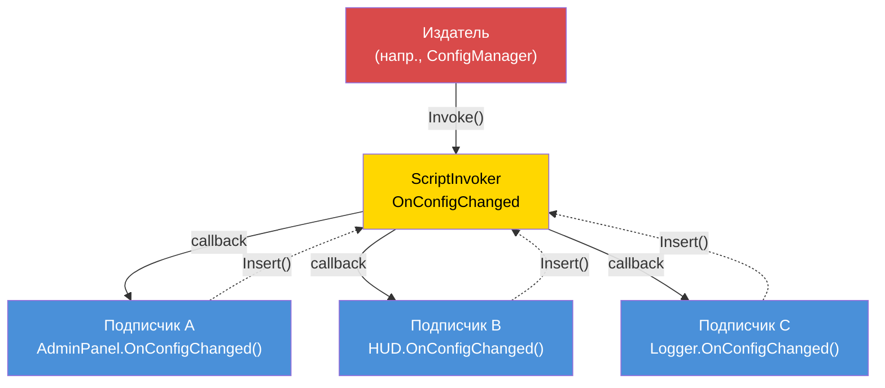

# Глава 7.6: Событийно-ориентированная архитектура

[Главная](../../README.md) | [<< Предыдущая: Системы прав доступа](05-permissions.md) | **Событийно-ориентированная архитектура** | [Следующая: Оптимизация производительности >>](07-performance.md)

---

## Введение

Событийно-ориентированная архитектура отделяет производителя события от его потребителей. Когда игрок подключается, обработчик подключения не должен знать о килфиде, админ-панели, системе миссий или модуле логирования --- он генерирует событие «игрок подключился», и каждая заинтересованная система подписывается независимо. Это основа расширяемого дизайна модов: новые возможности подписываются на существующие события без изменения кода, который их генерирует.

DayZ предоставляет `ScriptInvoker` как встроенный примитив событий. Поверх него профессиональные моды строят шины событий с именованными топиками, типизированными обработчиками и управлением жизненным циклом. В этой главе описаны все три основных паттерна и критически важная дисциплина предотвращения утечек памяти.

---

## Содержание

- [Паттерн ScriptInvoker](#паттерн-scriptinvoker)
- [Паттерн EventBus (строковая маршрутизация топиков)](#паттерн-eventbus-строковая-маршрутизация-топиков)
- [Паттерн CF_EventHandler](#паттерн-cf_eventhandler)
- [Когда использовать события vs прямые вызовы](#когда-использовать-события-vs-прямые-вызовы)
- [Предотвращение утечек памяти](#предотвращение-утечек-памяти)
- [Продвинутое: пользовательские данные событий](#продвинутое-пользовательские-данные-событий)
- [Лучшие практики](#лучшие-практики)

---

## Паттерн ScriptInvoker

`ScriptInvoker` --- это встроенный примитив издатель/подписчик в движке. Он хранит список функций обратного вызова и вызывает их все при срабатывании события. Это самый низкоуровневый механизм событий в DayZ.

### Создание события

```c
class WeatherManager
{
    // Событие. Кто угодно может подписаться для уведомления об изменении погоды.
    ref ScriptInvoker OnWeatherChanged = new ScriptInvoker();

    protected string m_CurrentWeather;

    void SetWeather(string newWeather)
    {
        m_CurrentWeather = newWeather;

        // Генерация события — все подписчики уведомлены
        OnWeatherChanged.Invoke(newWeather);
    }
};
```

### Подписка на событие

```c
class WeatherUI
{
    void Init(WeatherManager mgr)
    {
        // Подписка: при изменении погоды вызвать наш обработчик
        mgr.OnWeatherChanged.Insert(OnWeatherChanged);
    }

    void OnWeatherChanged(string newWeather)
    {
        // Обновить UI
        m_WeatherLabel.SetText("Погода: " + newWeather);
    }

    void Cleanup(WeatherManager mgr)
    {
        // КРИТИЧЕСКИ ВАЖНО: Отписаться по завершении
        mgr.OnWeatherChanged.Remove(OnWeatherChanged);
    }
};
```

### API ScriptInvoker

| Метод | Описание |
|-------|----------|
| `Insert(func)` | Добавить обратный вызов в список подписчиков |
| `Remove(func)` | Удалить конкретный обратный вызов |
| `Invoke(...)` | Вызвать все подписанные обратные вызовы с заданными аргументами |
| `Clear()` | Удалить всех подписчиков |

### Событийно-ориентированный паттерн



### Как работают Insert/Remove

`Insert` добавляет ссылку на функцию во внутренний список. `Remove` ищет в списке и удаляет совпадающую запись. Если вы вызовете `Insert` дважды с одной и той же функцией, она будет вызвана дважды при каждом `Invoke`. Если вызвать `Remove` один раз, он удалит одну запись.

```c
// Подписка одного обработчика дважды — это баг:
mgr.OnWeatherChanged.Insert(OnWeatherChanged);
mgr.OnWeatherChanged.Insert(OnWeatherChanged);  // Теперь вызывается 2 раза за Invoke

// Один Remove удаляет только одну запись:
mgr.OnWeatherChanged.Remove(OnWeatherChanged);
// Всё ещё вызывается 1 раз за Invoke — второй Insert всё ещё здесь
```

### Типизированные сигнатуры

`ScriptInvoker` не обеспечивает проверку типов параметров во время компиляции. Соглашение --- документировать ожидаемую сигнатуру в комментарии:

```c
// Сигнатура: void(string weatherName, float temperature)
ref ScriptInvoker OnWeatherChanged = new ScriptInvoker();
```

Если подписчик имеет неправильную сигнатуру, поведение в рантайме не определено --- может произойти вылет, получение мусорных значений или молчаливое бездействие. Всегда точно соответствуйте документированной сигнатуре.

### ScriptInvoker в ванильных классах

Многие ванильные классы DayZ предоставляют события `ScriptInvoker`:

```c
// UIScriptedMenu имеет OnVisibilityChanged
class UIScriptedMenu
{
    ref ScriptInvoker m_OnVisibilityChanged;
};

// MissionBase имеет хуки событий
class MissionBase
{
    void OnUpdate(float timeslice);
    void OnEvent(EventType eventTypeId, Param params);
};
```

Вы можете подписываться на эти ванильные события из modded-классов для реакции на изменения состояния на уровне движка.

---

## Паттерн EventBus (строковая маршрутизация топиков)

`ScriptInvoker` --- это один канал события. EventBus --- это коллекция именованных каналов, предоставляющая центральный узел, где любой модуль может публиковать или подписываться на события по имени топика.

### Пользовательский паттерн EventBus

Этот паттерн реализует EventBus как статический класс с именованными полями `ScriptInvoker` для известных событий, плюс общий канал `OnCustomEvent` для произвольных топиков:

```c
class MyEventBus
{
    // Известные события жизненного цикла
    static ref ScriptInvoker OnPlayerConnected;      // void(PlayerIdentity)
    static ref ScriptInvoker OnPlayerDisconnected;    // void(PlayerIdentity)
    static ref ScriptInvoker OnPlayerReady;           // void(PlayerBase, PlayerIdentity)
    static ref ScriptInvoker OnConfigChanged;         // void(string modId, string field, string value)
    static ref ScriptInvoker OnAdminPanelToggled;     // void(bool opened)
    static ref ScriptInvoker OnMissionStarted;        // void(MyInstance)
    static ref ScriptInvoker OnMissionCompleted;      // void(MyInstance, int reason)
    static ref ScriptInvoker OnAdminDataSynced;       // void()

    // Общий канал пользовательских событий
    static ref ScriptInvoker OnCustomEvent;           // void(string eventName, Param params)

    static void Init() { ... }   // Создаёт все инвокеры
    static void Cleanup() { ... } // Обнуляет все инвокеры

    // Вспомогательный метод для генерации пользовательского события
    static void Fire(string eventName, Param params)
    {
        if (!OnCustomEvent) Init();
        OnCustomEvent.Invoke(eventName, params);
    }
};
```

### Подписка на EventBus

```c
class MyMissionModule : MyServerModule
{
    override void OnInit()
    {
        super.OnInit();

        // Подписка на жизненный цикл игрока
        MyEventBus.OnPlayerConnected.Insert(OnPlayerJoined);
        MyEventBus.OnPlayerDisconnected.Insert(OnPlayerLeft);

        // Подписка на изменения конфигурации
        MyEventBus.OnConfigChanged.Insert(OnConfigChanged);
    }

    override void OnMissionFinish()
    {
        // Всегда отписывайтесь при завершении
        MyEventBus.OnPlayerConnected.Remove(OnPlayerJoined);
        MyEventBus.OnPlayerDisconnected.Remove(OnPlayerLeft);
        MyEventBus.OnConfigChanged.Remove(OnConfigChanged);
    }

    void OnPlayerJoined(PlayerIdentity identity)
    {
        MyLog.Info("Missions", "Игрок подключился: " + identity.GetName());
    }

    void OnPlayerLeft(PlayerIdentity identity)
    {
        MyLog.Info("Missions", "Игрок отключился: " + identity.GetName());
    }

    void OnConfigChanged(string modId, string field, string value)
    {
        if (modId == "MyMod_Missions")
        {
            // Перезагрузить наши настройки
            ReloadSettings();
        }
    }
};
```

### Использование пользовательских событий

Для разовых или модоспецифичных событий, не требующих выделенного поля `ScriptInvoker`:

```c
// Издатель (напр., в системе лута):
MyEventBus.Fire("LootRespawned", new Param1<int>(spawnedCount));

// Подписчик (напр., в модуле логирования):
MyEventBus.OnCustomEvent.Insert(OnCustomEvent);

void OnCustomEvent(string eventName, Param params)
{
    if (eventName == "LootRespawned")
    {
        Param1<int> data;
        if (Class.CastTo(data, params))
        {
            MyLog.Info("Loot", "Возрождено " + data.param1.ToString() + " предметов");
        }
    }
}
```

### Когда использовать именованные поля vs пользовательские события

| Подход | Когда использовать |
|--------|-------------------|
| Именованное поле `ScriptInvoker` | Событие известное, часто используемое и имеет стабильную сигнатуру |
| `OnCustomEvent` + строковое имя | Событие модоспецифичное, экспериментальное или используется одним подписчиком |

Именованные поля типобезопасны по соглашению и обнаруживаемы при чтении класса. Пользовательские события гибкие, но требуют строкового сопоставления и приведения типов.

---

## Паттерн CF_EventHandler

Community Framework предоставляет `CF_EventHandler` как более структурированную систему событий с типобезопасными аргументами.

### Концепция

```c
// Паттерн обработчика событий CF (упрощённый):
class CF_EventArgs
{
    // Базовый класс для всех аргументов событий
};

class CF_EventPlayerArgs : CF_EventArgs
{
    PlayerIdentity Identity;
    PlayerBase Player;
};

// Модули переопределяют методы обработчиков событий:
class MyModule : CF_ModuleWorld
{
    override void OnEvent(Class sender, CF_EventArgs args)
    {
        // Обработка общих событий
    }

    override void OnClientReady(Class sender, CF_EventArgs args)
    {
        // Клиент готов, можно создавать UI
    }
};
```

### Ключевые отличия от ScriptInvoker

| Характеристика | ScriptInvoker | CF_EventHandler |
|----------------|--------------|-----------------|
| **Типобезопасность** | Только по соглашению | Типизированные классы EventArgs |
| **Обнаруживаемость** | Чтение комментариев | Переопределение именованных методов |
| **Подписка** | `Insert()` / `Remove()` | Переопределение виртуальных методов |
| **Пользовательские данные** | Обёртки Param | Пользовательские подклассы EventArgs |
| **Очистка** | Ручной `Remove()` | Автоматическая (переопределение метода, без регистрации) |

Подход CF устраняет необходимость ручной подписки и отписки --- вы просто переопределяете метод обработчика. Это исключает целый класс багов (забытые вызовы `Remove()`) ценой зависимости от CF.

---

## Когда использовать события vs прямые вызовы

### Используйте события когда:

1. **Множество независимых потребителей** должны реагировать на одно и то же событие. Игрок подключился? Килфид, админ-панель, система миссий и логгер --- все заинтересованы.

2. **Производитель не должен знать о потребителях.** Обработчик подключения не должен импортировать модуль килфида.

3. **Набор потребителей меняется во время выполнения.** Модули могут подписываться и отписываться динамически.

4. **Межмодовое взаимодействие.** Мод A генерирует событие; Мод B подписывается на него. Ни один не импортирует другой.

### Используйте прямые вызовы когда:

1. **Есть ровно один потребитель**, известный на этапе компиляции. Если только система здоровья интересуется расчётом урона, вызывайте её напрямую.

2. **Нужны возвращаемые значения.** События работают по принципу «выстрелил и забыл». Если нужен ответ («разрешено ли это действие?»), используйте прямой вызов метода.

3. **Важен порядок.** Подписчики событий вызываются в порядке вставки, но зависеть от этого порядка хрупко. Если шаг B должен произойти после шага A, вызывайте A затем B явно.

4. **Критична производительность.** События имеют накладные расходы (итерация списка подписчиков, вызов через отражение). Для покадровой, попредметной логики прямые вызовы быстрее.

### Руководство по принятию решения

```
                    Нужно ли производителю возвращаемое значение?
                         /                    \
                        ДА                    НЕТ
                        |                       |
                   Прямой вызов         Сколько потребителей?
                                       /              \
                                     ОДИН            НЕСКОЛЬКО
                                      |                |
                                 Прямой вызов       СОБЫТИЕ
```

---

## Предотвращение утечек памяти

Наиболее опасный аспект событийно-ориентированной архитектуры в Enforce Script --- **утечки подписчиков**. Если объект подписывается на событие и затем уничтожается без отписки, происходит одно из двух:

1. **Если объект наследует `Managed`:** Слабая ссылка в инвокере автоматически обнуляется. Инвокер вызовет null-функцию --- что ничего не делает, но тратит циклы на итерацию мёртвых записей.

2. **Если объект НЕ наследует `Managed`:** Инвокер держит висячий указатель на функцию. Когда событие срабатывает, он обращается к освобождённой памяти. **Вылет.**

### Золотое правило

**Каждый `Insert()` должен иметь соответствующий `Remove()`.** Без исключений.

### Паттерн: подписка в OnInit, отписка в OnMissionFinish

```c
class MyModule : MyServerModule
{
    override void OnInit()
    {
        super.OnInit();
        MyEventBus.OnPlayerConnected.Insert(HandlePlayerConnect);
    }

    override void OnMissionFinish()
    {
        MyEventBus.OnPlayerConnected.Remove(HandlePlayerConnect);
        // Затем вызвать super или выполнить другую очистку
    }

    void HandlePlayerConnect(PlayerIdentity identity) { ... }
};
```

### Паттерн: подписка в конструкторе, отписка в деструкторе

Для объектов с чётким жизненным циклом владения:

```c
class PlayerTracker : Managed
{
    void PlayerTracker()
    {
        MyEventBus.OnPlayerConnected.Insert(OnPlayerConnected);
        MyEventBus.OnPlayerDisconnected.Insert(OnPlayerDisconnected);
    }

    void ~PlayerTracker()
    {
        if (MyEventBus.OnPlayerConnected)
            MyEventBus.OnPlayerConnected.Remove(OnPlayerConnected);
        if (MyEventBus.OnPlayerDisconnected)
            MyEventBus.OnPlayerDisconnected.Remove(OnPlayerDisconnected);
    }

    void OnPlayerConnected(PlayerIdentity identity) { ... }
    void OnPlayerDisconnected(PlayerIdentity identity) { ... }
};
```

**Обратите внимание на проверки null в деструкторе.** При завершении работы `MyEventBus.Cleanup()` может быть уже выполнен, установив все инвокеры в `null`. Вызов `Remove()` на `null`-инвокере вызывает вылет.

### Паттерн: очистка EventBus обнуляет всё

Метод `MyEventBus.Cleanup()` устанавливает все инвокеры в `null`, что сбрасывает все ссылки на подписчиков разом. Это «ядерный вариант» --- он гарантирует, что никакие устаревшие подписчики не переживут перезапуск миссии:

```c
static void Cleanup()
{
    OnPlayerConnected    = null;
    OnPlayerDisconnected = null;
    OnConfigChanged      = null;
    // ... все остальные инвокеры
    s_Initialized = false;
}
```

Это вызывается из `MyFramework.ShutdownAll()` во время `OnMissionFinish`. Модули всё равно должны вызывать `Remove()` для своих подписок для корректности, но очистка EventBus действует как страховочная сеть.

### Антипаттерн: анонимные функции

```c
// ПЛОХО: Вы не можете вызвать Remove для анонимной функции
MyEventBus.OnPlayerConnected.Insert(function(PlayerIdentity id) {
    Print("Подключился: " + id.GetName());
});
// Как вы сделаете Remove? Нельзя получить ссылку на неё.
```

Всегда используйте именованные методы, чтобы можно было отписаться позже.

---

## Продвинутое: пользовательские данные событий

Для событий с комплексной полезной нагрузкой используйте обёртки `Param`:

### Классы Param

DayZ предоставляет `Param1<T>` --- `Param4<T1, T2, T3, T4>` для обёртывания типизированных данных:

```c
// Генерация со структурированными данными:
Param2<string, int> data = new Param2<string, int>("AK74", 5);
MyEventBus.Fire("ItemSpawned", data);

// Получение:
void OnCustomEvent(string eventName, Param params)
{
    if (eventName == "ItemSpawned")
    {
        Param2<string, int> data;
        if (Class.CastTo(data, params))
        {
            string className = data.param1;
            int quantity = data.param2;
        }
    }
}
```

### Пользовательский класс данных события

Для событий с множеством полей создайте выделенный класс данных:

```c
class KillEventData : Managed
{
    string KillerName;
    string VictimName;
    string WeaponName;
    float Distance;
    vector KillerPos;
    vector VictimPos;
};

// Генерация:
KillEventData killData = new KillEventData();
killData.KillerName = killer.GetIdentity().GetName();
killData.VictimName = victim.GetIdentity().GetName();
killData.WeaponName = weapon.GetType();
killData.Distance = vector.Distance(killer.GetPosition(), victim.GetPosition());
OnKillEvent.Invoke(killData);
```

---

## Лучшие практики

1. **Каждый `Insert()` должен иметь соответствующий `Remove()`.** Аудируйте свой код: найдите каждый вызов `Insert` и убедитесь, что у него есть соответствующий `Remove` в пути очистки.

2. **Проверяйте инвокер на null перед `Remove()` в деструкторах.** При завершении работы EventBus может быть уже очищен.

3. **Документируйте сигнатуры событий.** Над каждым объявлением `ScriptInvoker` пишите комментарий с ожидаемой сигнатурой обратного вызова:
   ```c
   // Сигнатура: void(PlayerBase player, float damage, string source)
   static ref ScriptInvoker OnPlayerDamaged;
   ```

4. **Не полагайтесь на порядок выполнения подписчиков.** Если порядок важен, используйте прямые вызовы.

5. **Держите обработчики событий быстрыми.** Если обработчику нужно выполнить затратную работу, запланируйте её на следующий тик, а не блокируйте всех остальных подписчиков.

6. **Используйте именованные события для стабильных API, пользовательские события для экспериментов.** Именованные поля `ScriptInvoker` обнаруживаемы и документированы. Пользовательские события со строковой маршрутизацией гибкие, но их сложнее найти.

7. **Инициализируйте EventBus рано.** События могут генерироваться до `OnMissionStart()`. Вызывайте `Init()` во время `OnInit()` или используйте ленивый паттерн (проверка на `null` перед `Insert`).

8. **Очищайте EventBus при завершении миссии.** Обнуляйте все инвокеры для предотвращения устаревших ссылок между перезапусками миссий.

9. **Никогда не используйте анонимные функции как подписчиков событий.** Вы не сможете отписать их.

10. **Предпочитайте события поллингу.** Вместо проверки «изменилась ли конфигурация?» каждый кадр, подпишитесь на `OnConfigChanged` и реагируйте только при срабатывании.

---

## Совместимость и влияние

- **Мультимод:** Несколько модов могут подписываться на одни и те же топики EventBus без конфликтов. Каждый подписчик вызывается независимо. Однако если один подписчик выбрасывает неисправимую ошибку (напр., null-ссылка), последующие подписчики на этом инвокере могут не выполниться.
- **Порядок загрузки:** Порядок подписки равен порядку вызова при `Invoke()`. Моды, загруженные раньше, регистрируются первыми и получают события первыми. Не зависьте от этого порядка --- если порядок выполнения важен, используйте прямые вызовы.
- **Listen Server:** На listen-серверах события, генерируемые серверным кодом, видны клиентским подписчикам, если они разделяют один и тот же статический `ScriptInvoker`. Используйте отдельные поля EventBus для серверных и клиентских событий, или защитите обработчики проверками `GetGame().IsServer()` / `GetGame().IsClient()`.
- **Производительность:** `ScriptInvoker.Invoke()` итерирует всех подписчиков линейно. При 5-15 подписчиках на событие это пренебрежимо. Избегайте подписки по-сущностно (100+ сущностей, каждая подписывается на одно событие) --- используйте паттерн менеджера.
- **Миграция:** `ScriptInvoker` --- стабильный ванильный API, маловероятно что изменится между версиями DayZ. Пользовательские обёртки EventBus --- это ваш собственный код и мигрируют с вашим модом.

---

## Распространённые ошибки

| Ошибка | Последствие | Исправление |
|--------|------------|-------------|
| Подписка через `Insert()` без вызова `Remove()` | Утечка памяти: инвокер хранит ссылку на мёртвый объект; при `Invoke()` вызывает освобождённую память (вылет) или бесполезно итерирует | Сопоставляйте каждый `Insert()` с `Remove()` в `OnMissionFinish` или деструкторе |
| Вызов `Remove()` на null-инвокере EventBus при завершении | `MyEventBus.Cleanup()` мог уже обнулить инвокер; вызов `.Remove()` на null вызывает вылет | Всегда проверяйте инвокер на null перед `Remove()`: `if (MyEventBus.OnPlayerConnected) MyEventBus.OnPlayerConnected.Remove(handler);` |
| Двойной `Insert()` одного обработчика | Обработчик вызывается дважды за `Invoke()`; один `Remove()` удаляет только одну запись, оставляя устаревшую подписку | Проверяйте перед вставкой или убедитесь, что `Insert()` вызывается только один раз (напр., в `OnInit` с защитным флагом) |
| Использование анонимных/лямбда-функций как обработчиков | Невозможно удалить, так как нет ссылки для передачи в `Remove()` | Всегда используйте именованные методы как обработчики событий |
| Генерация событий с несовпадающими сигнатурами аргументов | Подписчики получают мусорные данные или вылетают в рантайме; нет проверки на этапе компиляции | Документируйте ожидаемую сигнатуру над каждым объявлением `ScriptInvoker` и точно соответствуйте ей во всех обработчиках |

---

[Главная](../../README.md) | [<< Предыдущая: Системы прав доступа](05-permissions.md) | **Событийно-ориентированная архитектура** | [Следующая: Оптимизация производительности >>](07-performance.md)
