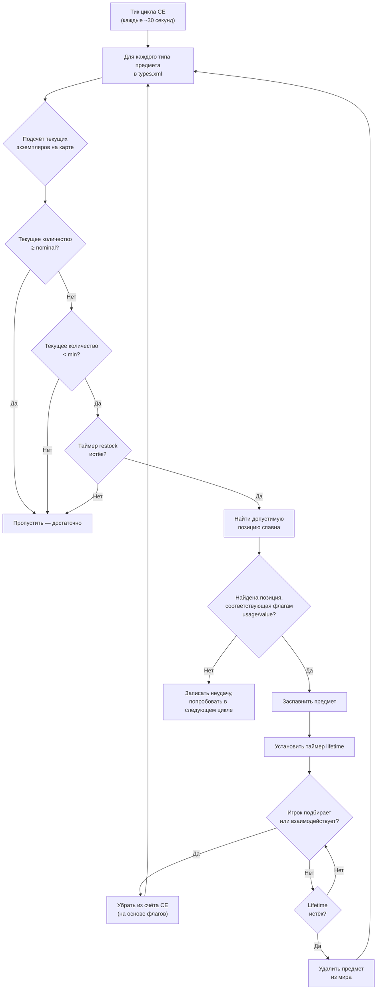

# Глава 9.4: Подробно о лут-экономике

[Главная](../README.md) | [<< Назад: Справочник serverDZ.cfg](03-server-cfg.md) | **Подробно о лут-экономике**

---

> **Краткое содержание:** Центральная Экономика (CE) -- это система, управляющая каждым спавном предметов в DayZ -- от банки фасоли на полке до АКМ в военных казармах. Эта глава объясняет полный цикл спавна, документирует каждое поле в `types.xml`, `globals.xml`, `events.xml` и `cfgspawnabletypes.xml` с реальными примерами из ванильных серверных файлов и описывает самые распространённые ошибки экономики.

---

## Содержание

- [Как работает Центральная Экономика](#как-работает-центральная-экономика)
- [Цикл спавна](#цикл-спавна)
- [types.xml -- определения спавна предметов](#typesxml----определения-спавна-предметов)
- [Реальные примеры types.xml](#реальные-примеры-typesxml)
- [Справочник полей types.xml](#справочник-полей-typesxml)
- [globals.xml -- параметры экономики](#globalsxml----параметры-экономики)
- [events.xml -- динамические события](#eventsxml----динамические-события)
- [cfgspawnabletypes.xml -- вложения и содержимое](#cfgspawnabletypesxml----вложения-и-содержимое)
- [Взаимосвязь nominal/restock](#взаимосвязь-nominalrestock)
- [Распространённые ошибки экономики](#распространённые-ошибки-экономики)

---

## Как работает Центральная Экономика

Центральная Экономика (CE) -- это серверная система, работающая в непрерывном цикле. Её задача -- поддерживать популяцию предметов мира на уровнях, определённых в ваших конфигурационных файлах.

CE **не** размещает предметы при входе игрока в здание. Вместо этого она работает по глобальному таймеру и создаёт предметы по всей карте, независимо от близости игроков. У предметов есть **время жизни** -- когда этот таймер истекает и ни один игрок не взаимодействовал с предметом, CE удаляет его. Затем на следующем цикле она обнаруживает, что количество ниже целевого, и создаёт замену в другом месте.

Ключевые понятия:

- **Nominal** -- целевое количество копий предмета, которое должно существовать на карте
- **Min** -- порог, ниже которого CE попытается заспавнить предмет заново
- **Lifetime** -- как долго (в секундах) нетронутый предмет сохраняется перед удалением
- **Restock** -- минимальное время (в секундах) перед тем, как CE сможет заспавнить замену
- **Flags** -- что учитывается в общем счёте (на карте, в контейнерах, в инвентаре игроков, в тайниках)

---

## Цикл спавна



Вкратце: CE подсчитывает, сколько каждого предмета существует, сравнивает с целями nominal/min и создаёт замены, когда количество падает ниже `min` и таймер `restock` истёк.

---

## types.xml -- определения спавна предметов

Это самый важный файл экономики. Каждый предмет, который может появиться в мире, нуждается в записи здесь. Ванильный `types.xml` для Чернаруси содержит приблизительно 23 000 строк, охватывающих тысячи предметов.

### Реальные примеры types.xml

**Оружие -- AKM**

```xml
<type name="AKM">
    <nominal>3</nominal>
    <lifetime>7200</lifetime>
    <restock>3600</restock>
    <min>2</min>
    <quantmin>30</quantmin>
    <quantmax>80</quantmax>
    <cost>100</cost>
    <flags count_in_cargo="0" count_in_hoarder="0" count_in_map="1" count_in_player="0" crafted="0" deloot="0"/>
    <category name="weapons"/>
    <usage name="Military"/>
    <value name="Tier4"/>
</type>
```

AKM -- редкое оружие высокого уровня. На карте может существовать только 3 экземпляра одновременно (`nominal`). Оно появляется в военных зданиях в зонах Tier 4 (северо-запад). Когда игрок подбирает его, CE видит, что количество на карте упало ниже `min=2`, и заспавнит замену через минимум 3600 секунд (1 час). Оружие появляется с 30-80% патронов во внутреннем магазине (`quantmin`/`quantmax`).

**Еда -- BakedBeansCan**

```xml
<type name="BakedBeansCan">
    <nominal>15</nominal>
    <lifetime>14400</lifetime>
    <restock>0</restock>
    <min>12</min>
    <quantmin>-1</quantmin>
    <quantmax>-1</quantmax>
    <cost>100</cost>
    <flags count_in_cargo="0" count_in_hoarder="0" count_in_map="1" count_in_player="0" crafted="0" deloot="0"/>
    <category name="food"/>
    <tag name="shelves"/>
    <usage name="Town"/>
    <usage name="Village"/>
    <value name="Tier1"/>
    <value name="Tier2"/>
    <value name="Tier3"/>
</type>
```

Консервированная фасоль -- распространённая еда. 15 банок должно существовать в любой момент. Они появляются на полках в зданиях Town и Village в зонах Tier 1-3 (побережье и центр карты). `restock=0` означает мгновенную готовность к респавну. `quantmin=-1` и `quantmax=-1` означают, что предмет не использует систему количества (это не жидкость и не боеприпасы).

**Одежда -- RidersJacket_Black**

```xml
<type name="RidersJacket_Black">
    <nominal>14</nominal>
    <lifetime>28800</lifetime>
    <restock>0</restock>
    <min>10</min>
    <quantmin>-1</quantmin>
    <quantmax>-1</quantmax>
    <cost>100</cost>
    <flags count_in_cargo="0" count_in_hoarder="0" count_in_map="1" count_in_player="0" crafted="0" deloot="0"/>
    <category name="clothes"/>
    <usage name="Town"/>
    <value name="Tier1"/>
    <value name="Tier2"/>
</type>
```

Обычная гражданская куртка. 14 экземпляров на карте, находится в городских зданиях вблизи побережья (Tier 1-2). Lifetime 28800 секунд (8 часов) означает, что она сохраняется долго, если никто не подберёт.

**Медицина -- BandageDressing**

```xml
<type name="BandageDressing">
    <nominal>40</nominal>
    <lifetime>14400</lifetime>
    <restock>0</restock>
    <min>30</min>
    <quantmin>-1</quantmin>
    <quantmax>-1</quantmax>
    <cost>100</cost>
    <flags count_in_cargo="0" count_in_hoarder="0" count_in_map="1" count_in_player="0" crafted="0" deloot="0"/>
    <category name="tools"/>
    <tag name="shelves"/>
    <usage name="Medic"/>
</type>
```

Бинты очень распространены (40 nominal). Они появляются в зданиях Medic (больницы, клиники) во всех зонах (отсутствие тега `<value>` означает все зоны). Обратите внимание, что категория -- `"tools"`, а не `"medical"` -- в DayZ нет категории medical; медицинские предметы используют категорию tools.

**Отключённый предмет (созданный вариант)**

```xml
<type name="AK101_Black">
    <nominal>0</nominal>
    <lifetime>28800</lifetime>
    <restock>0</restock>
    <min>0</min>
    <quantmin>-1</quantmin>
    <quantmax>-1</quantmax>
    <cost>100</cost>
    <flags count_in_cargo="0" count_in_hoarder="0" count_in_map="1" count_in_player="0" crafted="1" deloot="0"/>
    <category name="weapons"/>
</type>
```

`nominal=0` и `min=0` означают, что CE никогда не заспавнит этот предмет. `crafted=1` указывает, что его можно получить только через крафт (покраска оружия). У него всё ещё есть lifetime, чтобы сохранённые экземпляры со временем были удалены.

---

## Справочник полей types.xml

### Основные поля

| Поле | Тип | Диапазон | Описание |
|-------|------|-------|-------------|
| `name` | string | -- | Имя класса предмета. Должно точно совпадать с именем класса в игре. |
| `nominal` | int | 0+ | Целевое количество этого предмета на карте. Установите 0 для предотвращения спавна. |
| `min` | int | 0+ | Когда количество падает до этого значения или ниже, CE попытается заспавнить ещё. |
| `lifetime` | int | секунды | Как долго нетронутый предмет существует перед удалением CE. |
| `restock` | int | секунды | Минимальная задержка перед тем, как CE сможет заспавнить замену. 0 = мгновенно. |
| `quantmin` | int | -1 до 100 | Минимальный процент количества при спавне (% патронов, % жидкости). -1 = неприменимо. |
| `quantmax` | int | -1 до 100 | Максимальный процент количества при спавне. -1 = неприменимо. |
| `cost` | int | 0+ | Вес приоритета для выбора спавна. В настоящее время все ванильные предметы используют 100. |

### Флаги

```xml
<flags count_in_cargo="0" count_in_hoarder="0" count_in_map="1" count_in_player="0" crafted="0" deloot="0"/>
```

| Флаг | Значения | Описание |
|------|--------|-------------|
| `count_in_map` | 0, 1 | Считать предметы, лежащие на земле или в точках спавна зданий. **Почти всегда 1.** |
| `count_in_cargo` | 0, 1 | Считать предметы внутри других контейнеров (рюкзаки, палатки). |
| `count_in_hoarder` | 0, 1 | Считать предметы в тайниках, бочках, закопанных контейнерах, палатках. |
| `count_in_player` | 0, 1 | Считать предметы в инвентаре игрока (на теле или в руках). |
| `crafted` | 0, 1 | При 1 этот предмет можно получить только через крафт, а не через спавн CE. |
| `deloot` | 0, 1 | Лут динамических событий. При 1 предмет появляется только в местах динамических событий (крушения вертолётов и т.д.). |

**Стратегия флагов имеет значение.** Если `count_in_player=1`, каждый АКМ, который несёт игрок, считается в номинал. Это означает, что подбор АКМ не вызовет респавн, потому что счёт не изменился. Большинство ванильных предметов используют `count_in_player=0`, чтобы предметы в руках игроков не блокировали респавн.

### Теги

| Элемент | Назначение | Определён в |
|---------|---------|-----------|
| `<category name="..."/>` | Категория предмета для сопоставления с точками спавна | `cfglimitsdefinition.xml` |
| `<usage name="..."/>` | Тип здания, где этот предмет может появиться | `cfglimitsdefinition.xml` |
| `<value name="..."/>` | Зона уровня карты, где этот предмет может появиться | `cfglimitsdefinition.xml` |
| `<tag name="..."/>` | Тип позиции спавна внутри здания | `cfglimitsdefinition.xml` |

**Допустимые категории:** `tools`, `containers`, `clothes`, `food`, `weapons`, `books`, `explosives`, `lootdispatch`

**Допустимые флаги usage:** `Military`, `Police`, `Medic`, `Firefighter`, `Industrial`, `Farm`, `Coast`, `Town`, `Village`, `Hunting`, `Office`, `School`, `Prison`, `Lunapark`, `SeasonalEvent`, `ContaminatedArea`, `Historical`

**Допустимые флаги value:** `Tier1`, `Tier2`, `Tier3`, `Tier4`, `Unique`

**Допустимые теги:** `floor`, `shelves`, `ground`

Предмет может иметь **несколько** тегов `<usage>` и `<value>`. Несколько usage означают, что он может появиться в любом из этих типов зданий. Несколько value означают, что он может появиться в любой из этих зон.

Если вы полностью опустите `<value>`, предмет появляется во **всех** зонах. Если вы опустите `<usage>`, у предмета нет допустимого места спавна и он **не появится**.

---

## globals.xml -- параметры экономики

Этот файл управляет глобальным поведением CE. Все параметры из ванильного файла:

```xml
<variables>
    <var name="AnimalMaxCount" type="0" value="200"/>
    <var name="CleanupAvoidance" type="0" value="100"/>
    <var name="CleanupLifetimeDeadAnimal" type="0" value="1200"/>
    <var name="CleanupLifetimeDeadInfected" type="0" value="330"/>
    <var name="CleanupLifetimeDeadPlayer" type="0" value="3600"/>
    <var name="CleanupLifetimeDefault" type="0" value="45"/>
    <var name="CleanupLifetimeLimit" type="0" value="50"/>
    <var name="CleanupLifetimeRuined" type="0" value="330"/>
    <var name="FlagRefreshFrequency" type="0" value="432000"/>
    <var name="FlagRefreshMaxDuration" type="0" value="3456000"/>
    <var name="FoodDecay" type="0" value="1"/>
    <var name="IdleModeCountdown" type="0" value="60"/>
    <var name="IdleModeStartup" type="0" value="1"/>
    <var name="InitialSpawn" type="0" value="100"/>
    <var name="LootDamageMax" type="1" value="0.82"/>
    <var name="LootDamageMin" type="1" value="0.0"/>
    <var name="LootProxyPlacement" type="0" value="1"/>
    <var name="LootSpawnAvoidance" type="0" value="100"/>
    <var name="RespawnAttempt" type="0" value="2"/>
    <var name="RespawnLimit" type="0" value="20"/>
    <var name="RespawnTypes" type="0" value="12"/>
    <var name="RestartSpawn" type="0" value="0"/>
    <var name="SpawnInitial" type="0" value="1200"/>
    <var name="TimeHopping" type="0" value="60"/>
    <var name="TimeLogin" type="0" value="15"/>
    <var name="TimeLogout" type="0" value="15"/>
    <var name="TimePenalty" type="0" value="20"/>
    <var name="WorldWetTempUpdate" type="0" value="1"/>
    <var name="ZombieMaxCount" type="0" value="1000"/>
    <var name="ZoneSpawnDist" type="0" value="300"/>
</variables>
```

Атрибут `type` указывает тип данных: `0` = целое число, `1` = число с плавающей точкой.

### Полный справочник параметров

| Параметр | Тип | По умолчанию | Описание |
|-----------|------|---------|-------------|
| **AnimalMaxCount** | int | 200 | Максимальное количество животных, живых на карте одновременно. |
| **CleanupAvoidance** | int | 100 | Расстояние в метрах от игрока, в пределах которого CE НЕ будет удалять предметы. Предметы в этом радиусе защищены от истечения lifetime. |
| **CleanupLifetimeDeadAnimal** | int | 1200 | Секунды до удаления трупа мёртвого животного. (20 минут) |
| **CleanupLifetimeDeadInfected** | int | 330 | Секунды до удаления трупа мёртвого зомби. (5.5 минут) |
| **CleanupLifetimeDeadPlayer** | int | 3600 | Секунды до удаления тела мёртвого игрока. (1 час) |
| **CleanupLifetimeDefault** | int | 45 | Время очистки по умолчанию в секундах для предметов без определённого lifetime. |
| **CleanupLifetimeLimit** | int | 50 | Максимальное количество предметов, обрабатываемых за один цикл очистки. |
| **CleanupLifetimeRuined** | int | 330 | Секунды до удаления разрушенных предметов. (5.5 минут) |
| **FlagRefreshFrequency** | int | 432000 | Как часто флагшток должен быть "обновлён" взаимодействием для предотвращения разрушения базы, в секундах. (5 дней) |
| **FlagRefreshMaxDuration** | int | 3456000 | Максимальный срок жизни флагштока даже при регулярном обновлении, в секундах. (40 дней) |
| **FoodDecay** | int | 1 | Включить (1) или отключить (0) порчу еды со временем. |
| **IdleModeCountdown** | int | 60 | Секунды до перехода сервера в режим ожидания, когда нет подключённых игроков. |
| **IdleModeStartup** | int | 1 | Запускается ли сервер в режиме ожидания (1) или в активном режиме (0). |
| **InitialSpawn** | int | 100 | Процент от номинальных значений для спавна при первом запуске сервера (0-100). |
| **LootDamageMax** | float | 0.82 | Максимальное состояние повреждения для случайно заспавненного лута (0.0 = новый, 1.0 = разрушен). |
| **LootDamageMin** | float | 0.0 | Минимальное состояние повреждения для случайно заспавненного лута. |
| **LootProxyPlacement** | int | 1 | Включить (1) визуальное размещение предметов на полках/столах вместо случайного размещения на полу. |
| **LootSpawnAvoidance** | int | 100 | Расстояние в метрах от игрока, в пределах которого CE НЕ будет создавать новый лут. Предотвращает появление предметов на глазах у игроков. |
| **RespawnAttempt** | int | 2 | Количество попыток поиска позиции спавна на предмет за цикл CE перед отказом. |
| **RespawnLimit** | int | 20 | Максимальное количество предметов, которые CE будет респавнить за цикл. |
| **RespawnTypes** | int | 12 | Максимальное количество различных типов предметов, обрабатываемых за цикл респавна. |
| **RestartSpawn** | int | 0 | При 1 -- перерандомизировать все позиции лута при перезапуске сервера. При 0 -- загрузить из персистентности. |
| **SpawnInitial** | int | 1200 | Количество предметов для спавна при начальном наполнении экономики при первом запуске. |
| **TimeHopping** | int | 60 | Задержка в секундах, предотвращающая переподключение игрока к тому же серверу (защита от серверхоппинга). |
| **TimeLogin** | int | 15 | Таймер обратного отсчёта входа в секундах (таймер "Подождите" при подключении). |
| **TimeLogout** | int | 15 | Таймер обратного отсчёта выхода в секундах. Игрок остаётся в мире в течение этого времени. |
| **TimePenalty** | int | 20 | Дополнительное штрафное время в секундах, добавляемое к таймеру выхода при некорректном отключении (Alt+F4). |
| **WorldWetTempUpdate** | int | 1 | Включить (1) или отключить (0) обновления симуляции температуры и влажности мира. |
| **ZombieMaxCount** | int | 1000 | Максимальное количество зомби, живых на карте одновременно. |
| **ZoneSpawnDist** | int | 300 | Расстояние в метрах от игрока, на котором активируются зоны спавна зомби. |

### Типичные настройки

**Больше лута (PvP-сервер):**
```xml
<var name="InitialSpawn" type="0" value="100"/>
<var name="RespawnLimit" type="0" value="50"/>
<var name="RespawnTypes" type="0" value="30"/>
<var name="RespawnAttempt" type="0" value="4"/>
```

**Более длительное сохранение тел (больше времени на лут убитых):**
```xml
<var name="CleanupLifetimeDeadPlayer" type="0" value="7200"/>
```

**Более быстрое разрушение баз (быстрый вайп неактивных баз):**
```xml
<var name="FlagRefreshFrequency" type="0" value="259200"/>
<var name="FlagRefreshMaxDuration" type="0" value="1728000"/>
```

---

## events.xml -- динамические события

События определяют спавн сущностей, требующих специальной обработки: животных, транспорта и крушений вертолётов. В отличие от предметов `types.xml`, которые появляются внутри зданий, события появляются в заранее определённых мировых позициях, указанных в `cfgeventspawns.xml`.

### Реальный пример события транспорта

```xml
<event name="VehicleCivilianSedan">
    <nominal>8</nominal>
    <min>5</min>
    <max>11</max>
    <lifetime>300</lifetime>
    <restock>0</restock>
    <saferadius>500</saferadius>
    <distanceradius>500</distanceradius>
    <cleanupradius>200</cleanupradius>
    <flags deletable="0" init_random="0" remove_damaged="1"/>
    <position>fixed</position>
    <limit>mixed</limit>
    <active>1</active>
    <children>
        <child lootmax="0" lootmin="0" max="5" min="3" type="CivilianSedan"/>
        <child lootmax="0" lootmin="0" max="5" min="3" type="CivilianSedan_Black"/>
        <child lootmax="0" lootmin="0" max="5" min="3" type="CivilianSedan_Wine"/>
    </children>
</event>
```

### Реальный пример события животных

```xml
<event name="AnimalBear">
    <nominal>0</nominal>
    <min>2</min>
    <max>2</max>
    <lifetime>180</lifetime>
    <restock>0</restock>
    <saferadius>200</saferadius>
    <distanceradius>0</distanceradius>
    <cleanupradius>0</cleanupradius>
    <flags deletable="0" init_random="0" remove_damaged="1"/>
    <position>fixed</position>
    <limit>custom</limit>
    <active>1</active>
    <children>
        <child lootmax="0" lootmin="0" max="1" min="1" type="Animal_UrsusArctos"/>
    </children>
</event>
```

### Справочник полей событий

| Поле | Описание |
|-------|-------------|
| `name` | Идентификатор события. Должен совпадать с записью в `cfgeventspawns.xml` для событий с `position="fixed"`. |
| `nominal` | Целевое количество активных групп событий на карте. |
| `min` | Минимальное количество участников группы на точку спавна. |
| `max` | Максимальное количество участников группы на точку спавна. |
| `lifetime` | Секунды до удаления события и повторного спавна. Для транспорта это интервал проверки респавна, а не время жизни самого транспорта. |
| `restock` | Минимальные секунды между респавнами. |
| `saferadius` | Минимальное расстояние в метрах от игрока для спавна события. |
| `distanceradius` | Минимальное расстояние между двумя экземплярами одного события. |
| `cleanupradius` | Расстояние от любого игрока, в пределах которого событие НЕ будет удалено. |
| `deletable` | Может ли CE удалить эту сущность события (0 = нет). |
| `init_random` | Рандомизировать начальные позиции (0 = использовать фиксированные позиции). |
| `remove_damaged` | Удалить сущность события при повреждении/разрушении (1 = да). |
| `position` | `"fixed"` = использовать позиции из `cfgeventspawns.xml`. `"player"` = спавн вблизи игроков. |
| `limit` | `"child"` = лимит по типу дочернего элемента. `"mixed"` = лимит для всех дочерних. `"custom"` = особое поведение. |
| `active` | 1 = включено, 0 = отключено. |

### Дочерние элементы

Каждый элемент `<child>` определяет вариант, который может быть заспавнен:

| Атрибут | Описание |
|-----------|-------------|
| `type` | Имя класса сущности для спавна. |
| `min` | Минимальное количество экземпляров этого варианта (для `limit="child"`). |
| `max` | Максимальное количество экземпляров этого варианта (для `limit="child"`). |
| `lootmin` | Минимальное количество предметов лута, заспавненных внутри/на сущности. |
| `lootmax` | Максимальное количество предметов лута, заспавненных внутри/на сущности. |

---

## cfgspawnabletypes.xml -- вложения и содержимое

Этот файл определяет, какие вложения, содержимое и состояние повреждения имеет предмет при спавне. Без записи здесь предметы появляются пустыми и со случайным уроном (в пределах `LootDamageMin`/`LootDamageMax` из `globals.xml`).

### Оружие с вложениями -- AKM

```xml
<type name="AKM">
    <damage min="0.45" max="0.85" />
    <attachments chance="1.00">
        <item name="AK_PlasticBttstck" chance="1.00" />
    </attachments>
    <attachments chance="1.00">
        <item name="AK_PlasticHndgrd" chance="1.00" />
    </attachments>
    <attachments chance="0.50">
        <item name="KashtanOptic" chance="0.30" />
        <item name="PSO11Optic" chance="0.20" />
    </attachments>
    <attachments chance="0.05">
        <item name="AK_Suppressor" chance="1.00" />
    </attachments>
    <attachments chance="0.30">
        <item name="Mag_AKM_30Rnd" chance="1.00" />
    </attachments>
</type>
```

Чтение этой записи:

1. АКМ появляется с повреждением от 45-85% (изношен до сильно повреждённого)
2. Он **всегда** (100%) получает пластиковый приклад и цевьё
3. 50% шанс заполнения слота прицела -- если заполнен, 30% шанс на Kashtan, 20% на PSO-11
4. 5% шанс глушителя
5. 30% шанс заряженного магазина

Каждый блок `<attachments>` представляет один слот вложений. `chance` в блоке -- вероятность заполнения этого слота вообще. `chance` у каждого `<item>` внутри -- относительный вес выбора -- CE выбирает один предмет из списка, используя их как веса.

### Оружие с вложениями -- M4A1

```xml
<type name="M4A1">
    <damage min="0.45" max="0.85" />
    <attachments chance="1.00">
        <item name="M4_OEBttstck" chance="1.00" />
    </attachments>
    <attachments chance="1.00">
        <item name="M4_PlasticHndgrd" chance="1.00" />
    </attachments>
    <attachments chance="1.00">
        <item name="BUISOptic" chance="0.50" />
        <item name="M4_CarryHandleOptic" chance="1.00" />
    </attachments>
    <attachments chance="0.30">
        <item name="Mag_CMAG_40Rnd" chance="0.15" />
        <item name="Mag_CMAG_10Rnd" chance="0.50" />
        <item name="Mag_CMAG_20Rnd" chance="0.70" />
        <item name="Mag_CMAG_30Rnd" chance="1.00" />
    </attachments>
</type>
```

### Жилет с подсумками -- PlateCarrierVest_Camo

```xml
<type name="PlateCarrierVest_Camo">
    <damage min="0.1" max="0.6" />
    <attachments chance="0.85">
        <item name="PlateCarrierHolster_Camo" chance="1.00" />
    </attachments>
    <attachments chance="0.85">
        <item name="PlateCarrierPouches_Camo" chance="1.00" />
    </attachments>
</type>
```

### Рюкзак с содержимым

```xml
<type name="AssaultBag_Ttsko">
    <cargo preset="mixArmy" />
    <cargo preset="mixArmy" />
    <cargo preset="mixArmy" />
</type>
```

Атрибут `preset` ссылается на пул лута, определённый в `cfgrandompresets.xml`. Каждая строка `<cargo>` -- один бросок -- этот рюкзак получает 3 броска из пула `mixArmy`. Значение `chance` самого пула определяет, создаст ли каждый бросок предмет.

### Предметы только для хранения

```xml
<type name="Barrel_Blue">
    <hoarder />
</type>
<type name="SeaChest">
    <hoarder />
</type>
```

Тег `<hoarder />` помечает предметы как контейнеры для хранения. CE учитывает предметы внутри них отдельно, используя флаг `count_in_hoarder` из `types.xml`.

### Переопределение урона при спавне

```xml
<type name="BandageDressing">
    <damage min="0.0" max="0.0" />
</type>
```

Принудительно заставляет бинты всегда появляться в состоянии "Новый", переопределяя глобальные значения `LootDamageMin`/`LootDamageMax` из `globals.xml`.

---

## Взаимосвязь nominal/restock

Понимание совместной работы `nominal`, `min` и `restock` критично для настройки экономики.

### Формула

```
ЕСЛИ (текущее_количество < min) И (время_с_последнего_спавна > restock):
    заспавнить новый предмет (до nominal)
```

**Пример с AKM:**
- `nominal = 3`, `min = 2`, `restock = 3600`
- Сервер запускается: CE спавнит 3 АКМ по карте
- Игрок подбирает 1 АКМ: количество на карте падает до 2
- Количество (2) НЕ меньше min (2), поэтому респавна пока нет
- Игрок подбирает ещё один АКМ: количество на карте падает до 1
- Количество (1) МЕНЬШЕ min (2), и запускается таймер restock (3600с = 1 час)
- Через 1 час CE спавнит 2 новых АКМ для достижения nominal (3) снова

**Пример с BakedBeansCan:**
- `nominal = 15`, `min = 12`, `restock = 0`
- Игрок съедает банку: количество на карте падает до 14
- Количество (14) НЕ меньше min (12), поэтому респавна нет
- Ещё 3 банки съедены: количество падает до 11
- Количество (11) МЕНЬШЕ min (12), restock равен 0 (мгновенно)
- Следующий цикл CE: спавнит 4 банки для достижения nominal (15)

### Ключевые выводы

- **Разрыв между nominal и min** определяет, сколько предметов может быть "потреблено" до реакции CE. Малый разрыв (как у АКМ: 3/2) означает, что CE реагирует уже после 2 подборов. Большой разрыв означает, что больше предметов может покинуть экономику до начала респавна.

- **restock = 0** делает респавн фактически мгновенным (следующий цикл CE). Высокие значения restock создают дефицит -- CE знает, что нужно спавнить больше, но должна ждать.

- **Lifetime** не зависит от nominal/min. Даже если CE заспавнила предмет для достижения nominal, предмет будет удалён при истечении lifetime, если никто его не тронет. Это создаёт постоянную "ротацию" предметов, появляющихся и исчезающих по всей карте.

- Предметы, которые игроки подбирают, а затем бросают (в другом месте), всё равно учитываются, если установлен соответствующий флаг. Брошенный АКМ на земле всё ещё считается в общее количество на карте, потому что `count_in_map=1`.

---

## Распространённые ошибки экономики

### Предмет имеет запись в types.xml, но не появляется

**Проверьте по порядку:**

1. `nominal` больше 0?
2. У предмета есть хотя бы один тег `<usage>`? (Нет usage = нет допустимого места спавна)
3. Тег `<usage>` определён в `cfglimitsdefinition.xml`?
4. Тег `<value>` (если есть) определён в `cfglimitsdefinition.xml`?
5. Тег `<category>` допустим?
6. Предмет указан в `cfgignorelist.xml`? (Перечисленные там предметы заблокированы)
7. Флаг `crafted` установлен в 1? (Крафтовые предметы никогда не спавнятся естественно)
8. `RestartSpawn` в `globals.xml` установлен в 0 с существующей персистентностью? (Старая персистентность может блокировать спавн новых предметов до вайпа)

### Предметы появляются, но немедленно исчезают

Значение `lifetime` слишком низкое. Lifetime в 45 секунд (`CleanupLifetimeDefault`) означает, что предмет удаляется практически сразу. Оружие должно иметь lifetime 7200-28800 секунд.

### Слишком много/мало предмета

Настройте `nominal` и `min` вместе. Если вы установите `nominal=100`, но `min=1`, CE не будет спавнить замены, пока не будет взято 99 предметов. Если вам нужно стабильное снабжение, держите `min` близко к `nominal` (например, `nominal=20, min=15`).

### Предметы появляются только в одной области

Проверьте теги `<value>`. Если у предмета только `<value name="Tier4"/>`, он будет появляться только в северо-западной военной зоне Чернаруси. Добавьте больше зон для распределения по карте:

```xml
<value name="Tier1"/>
<value name="Tier2"/>
<value name="Tier3"/>
<value name="Tier4"/>
```

### Модовые предметы не появляются

При добавлении предметов из мода в `types.xml`:

1. Убедитесь, что мод загружен (указан в параметре `-mod=`)
2. Проверьте, что имя класса **точно** совпадает (чувствительно к регистру)
3. Добавьте теги category/usage/value -- просто наличие записи в `types.xml` недостаточно
4. Если мод добавляет новые теги usage или value, добавьте их в `cfglimitsdefinitionuser.xml`
5. Проверьте скрипт-лог на предупреждения о неизвестных именах классов

### Запчасти не появляются внутри транспорта

Запчасти транспорта спавнятся через `cfgspawnabletypes.xml`, а не `types.xml`. Если транспорт появляется без колёс или аккумулятора, проверьте, что у него есть запись в `cfgspawnabletypes.xml` с соответствующими определениями вложений.

### Весь лут в состоянии "Новый" или весь лут "Разрушен"

Проверьте `LootDamageMin` и `LootDamageMax` в `globals.xml`. Ванильные значения -- `0.0` и `0.82`. Установка обоих в `0.0` делает всё новым. Установка обоих в `1.0` делает всё разрушенным. Также проверьте переопределения для конкретных предметов в `cfgspawnabletypes.xml`.

### Экономика "зависла" после редактирования types.xml

После редактирования файлов экономики выполните одно из:
- Удалите `storage_1/` для полного вайпа и нового старта экономики
- Установите `RestartSpawn` в `1` в `globals.xml` на один перезапуск для перерандомизации лута, затем верните обратно в `0`
- Дождитесь естественного истечения lifetime предметов (может занять часы)

---

**Назад:** [Справочник serverDZ.cfg](03-server-cfg.md) | [Главная](../README.md) | **Далее:** [Спавн транспорта и динамические события](05-vehicle-spawning.md)
