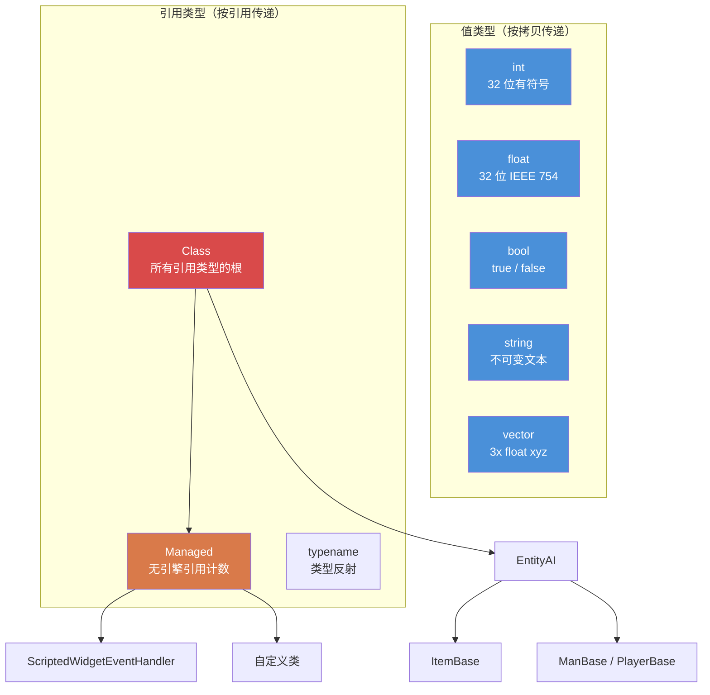

# 第 1.1 章：变量与类型

[首页](../../README.md) | **变量与类型** | [下一章：数组、映射与集合 >>](02-arrays-maps-sets.md)

---

## 简介

Enforce Script 是 Enfusion 引擎的脚本语言，用于 DayZ 独立版。它是一种具有类 C 语法的面向对象语言，在很多方面类似于 C#，但拥有自己独特的类型集、规则和限制。如果你有 C#、Java 或 C++ 的经验，你会很快上手 --- 但请密切关注差异之处，因为 Enforce Script 与这些语言不同的地方正是 Bug 隐藏的地方。

本章涵盖基本构建模块：基本类型、如何声明和初始化变量，以及类型转换的工作方式。每一行 DayZ Mod 代码都从这里开始。

---

## 基本类型

Enforce Script 有一组固定的基本类型。你无法定义新的值类型 --- 只能定义类（在[第 1.3 章](03-classes-inheritance.md)中介绍）。

| 类型 | 大小 | 默认值 | 说明 |
|------|------|---------------|-------------|
| `int` | 32 位有符号 | `0` | 范围从 -2,147,483,648 到 2,147,483,647 的整数 |
| `float` | 32 位 IEEE 754 | `0.0` | 浮点数 |
| `bool` | 1 位逻辑值 | `false` | `true` 或 `false` |
| `string` | 可变长度 | `""` (空) | 文本。不可变值类型 --- 按值传递，非按引用 |
| `vector` | 3x float | `"0 0 0"` | 三分量浮点数 (x, y, z)。按值传递 |
| `typename` | 引擎引用 | `null` | 对类型本身的引用，用于反射 |
| `void` | N/A | N/A | 仅用作返回类型，表示"不返回任何值" |

### 类型层次图



### 类型常量

一些类型公开了有用的常量：

```c
// int 范围
int maxInt = int.MAX;    // 2147483647
int minInt = int.MIN;    // -2147483648

// float 范围
float smallest = float.MIN;     // 最小正 float (~1.175e-38)
float largest  = float.MAX;     // 最大 float (~3.403e+38)
float lowest   = float.LOWEST;  // 最小负 float (-3.403e+38)
```

---

## 声明变量

通过先写类型名再写变量名来声明变量。可以在一条语句中声明并赋值，也可以分开进行。

```c
void MyFunction()
{
    // 仅声明（初始化为默认值）
    int health;          // health == 0
    float speed;         // speed == 0.0
    bool isAlive;        // isAlive == false
    string name;         // name == ""

    // 带初始化的声明
    int maxPlayers = 60;
    float gravity = 9.81;
    bool debugMode = true;
    string serverName = "My DayZ Server";
}
```

### `auto` 关键字

当右侧的类型显而易见时，可以使用 `auto` 让编译器推断类型：

```c
void Example()
{
    auto count = 10;           // int
    auto ratio = 0.75;         // float
    auto label = "Hello";      // string
    auto player = GetGame().GetPlayer();  // DayZPlayer（GetPlayer 的返回类型）
}
```

这纯粹是一种便利功能 --- 编译器在编译时解析类型。没有性能差异。

### 常量

对于初始化后不应更改的值，使用 `const` 关键字：

```c
const int MAX_SQUAD_SIZE = 8;
const float SPAWN_RADIUS = 150.0;
const string MOD_PREFIX = "[MyMod]";

void Example()
{
    int a = MAX_SQUAD_SIZE;  // OK：读取常量
    MAX_SQUAD_SIZE = 10;     // 错误：无法对常量赋值
}
```

常量通常在文件作用域（任何函数外部）或作为类成员声明。命名约定：`UPPER_SNAKE_CASE`。

---

## 使用 `int`

整数是最常用的类型。DayZ 使用它们来表示物品数量、玩家 ID、生命值（离散化时）、枚举值、位标志等。

```c
void IntExamples()
{
    int count = 5;
    int total = count + 10;     // 15
    int doubled = count * 2;    // 10
    int remainder = 17 % 5;     // 2（取模）

    // 递增和递减
    count++;    // count 现在是 6
    count--;    // count 又变回 5

    // 复合赋值
    count += 3;  // count 现在是 8
    count -= 2;  // count 现在是 6
    count *= 4;  // count 现在是 24
    count /= 6;  // count 现在是 4

    // 整数除法截断（不进行四舍五入）
    int result = 7 / 2;    // result == 3，不是 3.5

    // 位运算（用于标志）
    int flags = 0;
    flags = flags | 0x01;   // 设置位 0
    flags = flags | 0x04;   // 设置位 2
    bool hasBit0 = (flags & 0x01) != 0;  // true
}
```

### 实际示例：玩家数量

```c
void PrintPlayerCount()
{
    array<Man> players = new array<Man>;
    GetGame().GetPlayers(players);
    int count = players.Count();
    Print(string.Format("Players online: %1", count));
}
```

---

## 使用 `float`

float 表示小数。DayZ 广泛使用它们来表示位置、距离、生命值百分比、伤害值和计时器。

```c
void FloatExamples()
{
    float health = 100.0;
    float damage = 25.5;
    float remaining = health - damage;   // 74.5

    // DayZ 特有：伤害倍率
    float headMultiplier = 3.0;
    float actualDamage = damage * headMultiplier;  // 76.5

    // float 除法返回小数结果
    float ratio = 7.0 / 2.0;   // 3.5

    // 有用的数学函数
    float dist = 150.7;
    float rounded = Math.Round(dist);    // 151
    float floored = Math.Floor(dist);    // 150
    float ceiled  = Math.Ceil(dist);     // 151
    float clamped = Math.Clamp(dist, 0.0, 100.0);  // 100
}
```

### 实际示例：距离检查

```c
bool IsPlayerNearby(PlayerBase player, vector targetPos, float radius)
{
    if (!player)
        return false;

    vector playerPos = player.GetPosition();
    float distance = vector.Distance(playerPos, targetPos);
    return distance <= radius;
}
```

---

## 使用 `bool`

布尔值保存 `true` 或 `false`。用于条件判断、标志和状态跟踪。

```c
void BoolExamples()
{
    bool isAdmin = true;
    bool isBanned = false;

    // 逻辑运算符
    bool canPlay = isAdmin || !isBanned;    // true (OR, NOT)
    bool isSpecial = isAdmin && !isBanned;  // true (AND)

    // 取反
    bool notAdmin = !isAdmin;   // false

    // 比较结果是 bool
    int health = 50;
    bool isLow = health < 25;       // false
    bool isHurt = health < 100;     // true
    bool isDead = health == 0;      // false
    bool isAlive = health != 0;     // true
}
```

### 条件中的真值判断

在 Enforce Script 中，你可以在条件中使用非 bool 值。以下被视为 `false`：
- `0` (int)
- `0.0` (float)
- `""` (空字符串)
- `null` (空对象引用)

其他所有值都是 `true`。这常用于空值检查：

```c
void SafeCheck(PlayerBase player)
{
    // 以下两种写法等价：
    if (player != null)
        Print("Player exists");

    if (player)
        Print("Player exists");

    // 以下两种也等价：
    if (player == null)
        Print("No player");

    if (!player)
        Print("No player");
}
```

---

## 使用 `string`

Enforce Script 中的字符串是**值类型** --- 它们在赋值或传递给函数时会被复制，就像 `int` 或 `float` 一样。这与 C# 或 Java 中字符串是引用类型不同。

```c
void StringExamples()
{
    string greeting = "Hello";
    string name = "Survivor";

    // 用 + 连接
    string message = greeting + ", " + name + "!";  // "Hello, Survivor!"

    // 字符串格式化（从 1 开始的占位符）
    string formatted = string.Format("Player %1 has %2 health", name, 75);
    // 结果: "Player Survivor has 75 health"

    // 长度
    int len = message.Length();    // 17

    // 比较
    bool same = (greeting == "Hello");  // true

    // 从其他类型转换
    string fromInt = "Score: " + 42;     // 不起作用 -- 必须显式转换
    string correct = "Score: " + 42.ToString();  // "Score: 42"

    // 使用 Format 是推荐的方法
    string best = string.Format("Score: %1", 42);  // "Score: 42"
}
```

### 转义序列

字符串支持标准转义序列：

| 序列 | 含义 |
|----------|---------|
| `\n` | 换行 |
| `\r` | 回车 |
| `\t` | 制表符 |
| `\\` | 字面反斜杠 |
| `\"` | 字面双引号 |

**警告：** 虽然这些有文档记载，但反斜杠（`\\`）和转义引号（`\"`）在某些情况下已知会导致 CParser 出现问题，特别是在 JSON 相关操作中。处理文件路径或 JSON 字符串时，尽可能避免使用反斜杠。路径请使用正斜杠 --- DayZ 在所有平台上都接受正斜杠。

### 实际示例：聊天消息

```c
void SendAdminMessage(string adminName, string text)
{
    string msg = string.Format("[ADMIN] %1: %2", adminName, text);
    Print(msg);
}
```

---

## 使用 `vector`

`vector` 类型保存三个 `float` 分量 (x, y, z)。它是 DayZ 中表示位置、方向、旋转和速度的基本类型。与字符串和基本类型一样，vector 是**值类型** --- 赋值时会被复制。

### 初始化

vector 可以通过两种方式初始化：

```c
void VectorInit()
{
    // 方法 1：字符串初始化（三个空格分隔的数字）
    vector pos1 = "100.5 0 200.3";

    // 方法 2：Vector() 构造函数
    vector pos2 = Vector(100.5, 0, 200.3);

    // 默认值是 "0 0 0"
    vector empty;   // empty == <0, 0, 0>
}
```

**重要：** 字符串初始化格式使用**空格**作为分隔符，不是逗号。`"1 2 3"` 是有效的；`"1,2,3"` 是无效的。

### 分量访问

使用数组风格的索引访问各个分量：

```c
void VectorComponents()
{
    vector pos = Vector(100.5, 25.0, 200.3);

    // 读取分量
    float x = pos[0];   // 100.5  (东/西)
    float y = pos[1];   // 25.0   (上/下，海拔)
    float z = pos[2];   // 200.3  (北/南)

    // 写入分量
    pos[1] = 50.0;      // 将海拔改为 50
}
```

DayZ 坐标系：
- `[0]` = X = 东(+) / 西(-)
- `[1]` = Y = 上(+) / 下(-) (海拔高度)
- `[2]` = Z = 北(+) / 南(-)

### 静态常量

```c
vector zero    = vector.Zero;      // "0 0 0"
vector up      = vector.Up;        // "0 1 0"
vector right   = vector.Aside;     // "1 0 0"
vector forward = vector.Forward;   // "0 0 1"
```

### 常用 vector 操作

```c
void VectorOps()
{
    vector pos1 = Vector(100, 0, 200);
    vector pos2 = Vector(150, 0, 250);

    // 两点间的距离
    float dist = vector.Distance(pos1, pos2);

    // 距离的平方（更快，适合比较）
    float distSq = vector.DistanceSq(pos1, pos2);

    // 从 pos1 到 pos2 的方向
    vector dir = vector.Direction(pos1, pos2);

    // 归一化向量（使长度 = 1）
    vector norm = dir.Normalized();

    // 向量的长度
    float len = dir.Length();

    // 线性插值（pos1 和 pos2 之间 50% 处）
    vector midpoint = vector.Lerp(pos1, pos2, 0.5);

    // 点积
    float dot = vector.Dot(dir, vector.Up);
}
```

### 实际示例：生成位置

```c
// 获取指定 X,Z 坐标处地面上的位置
vector GetGroundPosition(float x, float z)
{
    vector pos = Vector(x, 0, z);
    pos[1] = GetGame().SurfaceY(x, z);  // 将 Y 设为地形高度
    return pos;
}

// 获取中心点半径内的随机位置
vector GetRandomPositionAround(vector center, float radius)
{
    float angle = Math.RandomFloat(0, Math.PI2);
    float dist = Math.RandomFloat(0, radius);

    vector offset = Vector(Math.Cos(angle) * dist, 0, Math.Sin(angle) * dist);
    vector pos = center + offset;
    pos[1] = GetGame().SurfaceY(pos[0], pos[2]);
    return pos;
}
```

---

## 使用 `typename`

`typename` 类型保存对类型本身的引用。它用于反射 --- 在运行时检查和操作类型。在编写通用系统、配置加载器和工厂模式时会遇到它。

```c
void TypenameExamples()
{
    // 获取类的 typename
    typename t = PlayerBase;

    // 从字符串获取 typename
    typename t2 = t.StringToEnum(PlayerBase, "PlayerBase");

    // 比较类型
    if (t == PlayerBase)
        Print("It's PlayerBase!");

    // 获取对象实例的 typename
    PlayerBase player;
    // ... 假设 player 有效 ...
    typename objType = player.Type();

    // 检查继承关系
    bool isMan = objType.IsInherited(Man);

    // 将 typename 转换为字符串
    string name = t.ToString();  // "PlayerBase"

    // 从 typename 创建实例（工厂模式）
    Class instance = t.Spawn();
}
```

### 使用 typename 进行 Enum 转换

```c
enum DamageType
{
    MELEE = 0,
    BULLET = 1,
    EXPLOSION = 2
};

void EnumConvert()
{
    // Enum 转字符串
    string name = typename.EnumToString(DamageType, DamageType.BULLET);
    // name == "BULLET"

    // 字符串转 Enum
    int value;
    typename.StringToEnum(DamageType, "EXPLOSION", value);
    // value == 2
}
```

---

## Managed 类

`Managed` 是一个特殊的基类，它**禁用引擎引用计数**。继承 `Managed` 的类不会被引擎的垃圾回收器跟踪 --- 它们的生命周期完全由脚本的 `ref` 引用管理。

```c
class MyScriptHandler : Managed
{
    // 此类不会被引擎垃圾回收
    // 只有当最后一个 ref 被释放时才会被删除
}
```

大多数纯脚本类（不表示游戏实体的类）应该继承 `Managed`。`PlayerBase`、`ItemBase` 等实体类继承 `EntityAI`（由引擎管理，不是 `Managed`）。

### 何时使用 Managed

| 使用 `Managed` 的情况... | 不使用 `Managed` 的情况... |
|----------------------|-----------------------------|
| 配置数据类 | 物品 (`ItemBase`) |
| 管理器单例 | 武器 (`Weapon_Base`) |
| UI 控制器 | 载具 (`CarScript`) |
| 事件处理器对象 | 玩家 (`PlayerBase`) |
| 辅助/工具类 | 任何继承 `EntityAI` 的类 |

如果你的类不表示游戏世界中的物理实体，它几乎肯定应该继承 `Managed`。

---

## 类型转换

Enforce Script 支持类型之间的隐式和显式转换。

### 隐式转换

一些转换会自动发生：

```c
void ImplicitConversions()
{
    // int 转 float（始终安全，无数据丢失）
    int count = 42;
    float fCount = count;    // 42.0

    // float 转 int（截断，不是四舍五入！）
    float precise = 3.99;
    int truncated = precise;  // 3，不是 4

    // int/float 转 bool
    bool fromInt = 5;      // true（非零）
    bool fromZero = 0;     // false
    bool fromFloat = 0.1;  // true（非零）

    // bool 转 int
    int fromBool = true;   // 1
    int fromFalse = false; // 0
}
```

### 显式转换（解析）

要在字符串和数值类型之间转换，使用解析方法：

```c
void ExplicitConversions()
{
    // 字符串转 int
    int num = "42".ToInt();           // 42
    int bad = "hello".ToInt();        // 0（静默失败）

    // 字符串转 float
    float f = "3.14".ToFloat();       // 3.14

    // 字符串转 vector
    vector v = "100 25 200".ToVector();  // <100, 25, 200>

    // 数值转字符串（使用 Format）
    string s1 = string.Format("%1", 42);       // "42"
    string s2 = string.Format("%1", 3.14);     // "3.14"

    // int/float 的 .ToString()
    string s3 = (42).ToString();     // "42"
}
```

### 对象转换

对于类类型，使用 `Class.CastTo()` 或 `ClassName.Cast()`。这在[第 1.3 章](03-classes-inheritance.md)中有详细介绍，但基本模式如下：

```c
void CastExample()
{
    Object obj = GetSomeObject();

    // 安全转换（推荐）
    PlayerBase player;
    if (Class.CastTo(player, obj))
    {
        // player 有效且可以安全使用
        string name = player.GetIdentity().GetName();
    }

    // 替代转换语法
    PlayerBase player2 = PlayerBase.Cast(obj);
    if (player2)
    {
        // player2 有效
    }
}
```

---

## 变量作用域

变量仅存在于声明它的代码块（花括号）内。Enforce Script **不允许**在嵌套或兄弟作用域中重新声明同名变量。

```c
void ScopeExample()
{
    int x = 10;

    if (true)
    {
        // int x = 20;  // 错误：在嵌套作用域中重新声明 'x'
        x = 20;         // OK：修改外部的 x
        int y = 30;     // OK：此作用域中的新变量
    }

    // y 在这里不可访问（在内部作用域中声明）
    // Print(y);  // 错误：未声明的标识符 'y'

    // 重要：这也适用于 for 循环
    for (int i = 0; i < 5; i++)
    {
        // i 存在于此
    }
    // for (int i = 0; i < 3; i++)  // DayZ 中错误：'i' 已声明
    // 使用不同的名称：
    for (int j = 0; j < 3; j++)
    {
        // j 存在于此
    }
}
```

### 兄弟作用域陷阱

这是 Enforce Script 最臭名昭著的陷阱之一。在 `if` 和 `else` 块中声明同名变量会导致编译错误：

```c
void SiblingTrap()
{
    if (someCondition)
    {
        int result = 10;    // 在此声明
        Print(result);
    }
    else
    {
        // int result = 20; // 错误：'result' 的多重声明
        // 即使这是兄弟作用域，也不是同一作用域
    }

    // 修复：在 if/else 之前声明
    int result;
    if (someCondition)
    {
        result = 10;
    }
    else
    {
        result = 20;
    }
}
```

---

## 运算符优先级

从高到低排列：

| 优先级 | 运算符 | 描述 | 结合性 |
|----------|----------|-------------|---------------|
| 1 | `()` `[]` `.` | 分组、数组访问、成员访问 | 从左到右 |
| 2 | `!` `-` (一元) `~` | 逻辑非、取负、按位非 | 从右到左 |
| 3 | `*` `/` `%` | 乘法、除法、取模 | 从左到右 |
| 4 | `+` `-` | 加法、减法 | 从左到右 |
| 5 | `<<` `>>` | 位移 | 从左到右 |
| 6 | `<` `<=` `>` `>=` | 关系运算 | 从左到右 |
| 7 | `==` `!=` | 等值运算 | 从左到右 |
| 8 | `&` | 按位与 | 从左到右 |
| 9 | `^` | 按位异或 | 从左到右 |
| 10 | `\|` | 按位或 | 从左到右 |
| 11 | `&&` | 逻辑与 | 从左到右 |
| 12 | `\|\|` | 逻辑或 | 从左到右 |
| 13 | `=` `+=` `-=` `*=` `/=` `%=` `&=` `\|=` `^=` `<<=` `>>=` | 赋值 | 从右到左 |

> **提示：** 不确定时使用括号。Enforce Script 遵循类 C 的优先级规则，但显式分组可以防止 Bug 并提高可读性。

---

## 最佳实践

- 即使默认值与你的意图一致，也要在声明时显式初始化变量 -- 这向未来的读者传达了意图。
- 对任何不应更改的值使用 `const`；以 `UPPER_SNAKE_CASE` 命名放在文件或类作用域中。
- 混合类型时优先使用 `string.Format()` 而不是 `+` 连接 -- 避免隐式转换问题，更易于阅读。
- 比较距离时使用 `vector.DistanceSq()` 代替 `vector.Distance()` -- 避免昂贵的平方根运算。
- 永远不要用 `==` 比较 float；始终使用 epsilon 容差，如 `Math.AbsFloat(a - b) < 0.001`。

---

## 在实际 Mod 中的观察

> 通过研究专业 DayZ Mod 源代码确认的模式。

| 模式 | Mod | 详情 |
|---------|-----|--------|
| 类作用域的 `const string LOG_PREFIX` | COT / Expansion | 每个模块都定义字符串常量作为日志前缀，避免拼写错误 |
| `m_PascalCase` 成员命名 | VPP / Dabs Framework | 所有成员变量一致使用 `m_` 前缀，即使是基本类型 |
| 所有日志输出使用 `string.Format` | Expansion Market | 从不使用 `+` 与数字连接 -- 始终使用 `%1`..`%9` 占位符 |
| 使用 `vector.Zero` 代替 `"0 0 0"` 字面量 | COT Admin Tools | 使用命名常量提高可读性并避免字符串解析开销 |

---

## 理论与实践

| 概念 | 理论 | 现实 |
|---------|--------|---------|
| `auto` 关键字 | 应该能推断任何类型 | 对简单赋值有效但可能让读者困惑 -- 大多数 Mod 显式声明类型 |
| `float` 到 `int` 截断 | 记录为"向零方向取整" | 几乎每个人都至少踩过一次坑；`3.99` 变成 `3`，不是 `4` |
| `string` 是值类型 | 像 `int` 一样按拷贝传递 | 让期望引用语义的 C#/Java 开发者感到惊讶；对副本的修改不会影响原始值 |

---

## 常见错误

### 1. 在逻辑中使用未初始化的变量

基本类型有默认值（`0`、`0.0`、`false`、`""`），但依赖默认值会使代码脆弱且难以阅读。始终显式初始化。

```c
// 不好：依赖隐式零值
int count;
if (count > 0)  // 因为 count == 0 所以能工作，但意图不明确
    DoThing();

// 好：显式初始化
int count = 0;
if (count > 0)
    DoThing();
```

### 2. float 到 int 的截断

float 到 int 的转换是截断（向零取整），不是四舍五入：

```c
float f = 3.99;
int i = f;         // i == 3，不是 4

// 如果需要四舍五入：
int rounded = Math.Round(f);  // 4
```

### 3. float 比较精度

永远不要对 float 进行精确相等比较：

```c
float a = 0.1 + 0.2;
// 不好：可能因浮点表示而失败
if (a == 0.3)
    Print("Equal");

// 好：使用容差（epsilon）
if (Math.AbsFloat(a - 0.3) < 0.001)
    Print("Close enough");
```

### 4. 数字与字符串连接

不能简单地用 `+` 将数字连接到字符串。使用 `string.Format()`：

```c
int kills = 5;
// 可能有问题：
// string msg = "Kills: " + kills;

// 正确：使用 Format
string msg = string.Format("Kills: %1", kills);
```

### 5. vector 字符串格式

vector 字符串初始化需要空格，不是逗号：

```c
vector good = "100 25 200";     // 正确
// vector bad = "100, 25, 200"; // 错误：逗号无法正确解析
// vector bad2 = "100,25,200";  // 错误
```

### 6. 忘记 string 和 vector 是值类型

与类对象不同，字符串和 vector 在赋值时被复制。修改副本不会影响原始值：

```c
vector posA = "10 20 30";
vector posB = posA;       // posB 是一个副本
posB[1] = 99;             // 只有 posB 改变
// posA 仍然是 "10 20 30"
```

---

## 练习题

### 练习 1：变量基础
声明变量来存储：
- 玩家的名称 (string)
- 生命值百分比 (float, 0-100)
- 击杀数 (int)
- 是否为管理员 (bool)
- 世界位置 (vector)

使用 `string.Format()` 打印格式化的摘要。

### 练习 2：温度转换器
编写函数 `float CelsiusToFahrenheit(float celsius)` 及其逆函数 `float FahrenheitToCelsius(float fahrenheit)`。用沸点（100C = 212F）和冰点（0C = 32F）测试。

### 练习 3：距离计算器
编写一个接受两个 vector 并返回以下内容的函数：
- 3D 距离
- 2D 距离（忽略高度/Y 轴）
- 高度差

提示：对于 2D 距离，在计算距离之前创建将 `[1]` 设为 `0` 的新 vector。

### 练习 4：类型转换
给定字符串 `"42"`，将其转换为：
1. `int`
2. `float`
3. 使用 `string.Format()` 转回 `string`
4. `bool`（由于 int 值非零，应该是 `true`）

### 练习 5：地面位置
编写函数 `vector SnapToGround(vector pos)`，接受任意位置并返回将 Y 分量设置为该 X,Z 位置地形高度的结果。使用 `GetGame().SurfaceY()`。

---

## 总结

| 概念 | 要点 |
|---------|-----------|
| 类型 | `int`, `float`, `bool`, `string`, `vector`, `typename`, `void` |
| 默认值 | `0`, `0.0`, `false`, `""`, `"0 0 0"`, `null` |
| 常量 | `const` 关键字，`UPPER_SNAKE_CASE` 约定 |
| vector | 用 `"x y z"` 字符串或 `Vector(x,y,z)` 初始化，用 `[0]`、`[1]`、`[2]` 访问 |
| 作用域 | 变量作用域限于 `{}` 块内；嵌套/兄弟块中不可重新声明 |
| 转换 | `float` 到 `int` 截断；字符串解析使用 `.ToInt()`、`.ToFloat()`、`.ToVector()` |
| 格式化 | 始终使用 `string.Format()` 构建混合类型的字符串 |

---

[首页](../../README.md) | **变量与类型** | [下一章：数组、映射与集合 >>](02-arrays-maps-sets.md)
