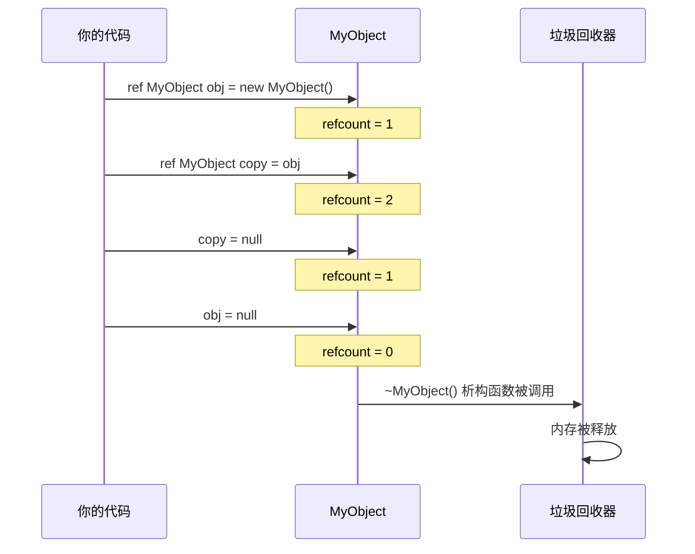
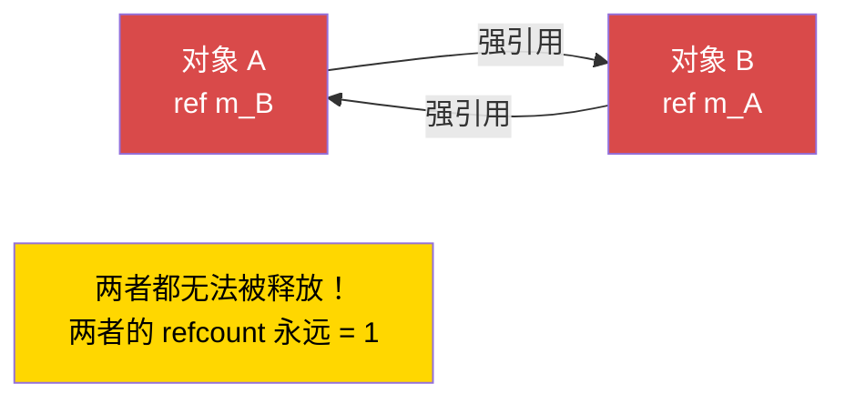

# 第 1.8 章：内存管理

[首页](../../README.md) | [<< 上一章：数学与向量](07-math-vectors.md) | **内存管理** | [下一章：类型转换与反射 >>](09-casting-reflection.md)

---

## 简介

Enforce Script 使用**自动引用计数（ARC）**进行内存管理——而非传统意义上的垃圾回收。理解 `ref`、`autoptr` 和原始指针的工作原理对于编写稳定的 DayZ 模组至关重要。如果处理不当，你要么会泄漏内存（服务器逐渐消耗越来越多的 RAM，直到崩溃），要么会访问已删除的对象（立即崩溃且没有有用的错误信息）。本章解释每种指针类型、何时使用它们，以及如何避免最危险的陷阱：引用循环。

---

## 三种指针类型

Enforce Script 有三种方式来持有对象的引用：

| 指针类型 | 关键字 | 是否保持对象存活？ | 删除时是否置空？ | 主要用途 |
|-------------|---------|---------------------|-------------------|-------------|
| **原始指针** | *（无）* | 否（弱引用） | 仅当类继承自 `Managed` 时 | 反向引用、观察者、缓存 |
| **强引用** | `ref` | 是 | 是 | 拥有的成员、集合 |
| **自动指针** | `autoptr` | 是，在作用域结束时删除 | 是 | 局部变量 |

### ARC 的工作原理

每个对象都有一个**引用计数**——指向它的强引用（`ref`、`autoptr`、局部变量、函数参数）的数量。当计数降至零时，对象会被自动销毁并调用其析构函数。

**弱引用**（原始指针）不会增加引用计数。它们观察对象但不保持其存活。

---

## 原始指针（弱引用）

原始指针是任何不使用 `ref` 或 `autoptr` 声明的变量。对于类成员，这将创建一个**弱引用**：它指向对象但不保持其存活。

```c
class Observer
{
    PlayerBase m_WatchedPlayer;  // 弱引用——不保持玩家存活

    void Watch(PlayerBase player)
    {
        m_WatchedPlayer = player;
    }

    void Report()
    {
        if (m_WatchedPlayer) // 始终对弱引用进行空值检查
        {
            Print("Watching: " + m_WatchedPlayer.GetIdentity().GetName());
        }
        else
        {
            Print("Player no longer exists");
        }
    }
}
```

### Managed 与 Non-Managed 类

弱引用的安全性取决于对象的类是否继承自 `Managed`：

- **Managed 类**（大多数 DayZ 游戏类）：当对象被删除时，所有弱引用会自动设为 `null`。这是安全的。
- **Non-Managed 类**（不继承 `Managed` 的普通 `class`）：当对象被删除时，弱引用会变成**悬空指针**——它们仍然持有旧的内存地址。访问它们会导致崩溃。

```c
// 安全——Managed 类，弱引用会被置空
class SafeData : Managed
{
    int m_Value;
}

void TestManaged()
{
    SafeData data = new SafeData();
    SafeData weakRef = data;
    delete data;

    if (weakRef) // false——weakRef 已自动设为 null
    {
        Print(weakRef.m_Value); // 永远不会执行到这里
    }
}
```

```c
// 危险——Non-Managed 类，弱引用会变成悬空指针
class UnsafeData
{
    int m_Value;
}

void TestNonManaged()
{
    UnsafeData data = new UnsafeData();
    UnsafeData weakRef = data;
    delete data;

    if (weakRef) // TRUE——weakRef 仍然持有旧地址！
    {
        Print(weakRef.m_Value); // 崩溃！访问已删除的内存
    }
}
```

> **规则：**如果你在编写自己的类，始终继承 `Managed` 以确保安全。大多数 DayZ 引擎类（EntityAI、ItemBase、PlayerBase 等）已经继承自 `Managed`。

---

## ref（强引用）

`ref` 关键字将变量标记为**强引用**。只要存在至少一个强引用，对象就会保持存活。当最后一个强引用被销毁或覆盖时，对象将被删除。

### 类成员

对你的类**拥有**并负责创建和销毁的对象使用 `ref`。

```c
class MissionManager
{
    protected ref array<ref MissionBase> m_ActiveMissions;
    protected ref map<string, ref MissionConfig> m_Configs;
    protected ref MyLog m_Logger;

    void MissionManager()
    {
        m_ActiveMissions = new array<ref MissionBase>;
        m_Configs = new map<string, ref MissionConfig>;
        m_Logger = new MyLog;
    }

    // 不需要析构函数！当 MissionManager 被删除时：
    // 1. m_Logger 的 ref 被释放 -> MyLog 被删除
    // 2. m_Configs 的 ref 被释放 -> map 被删除 -> 每个 MissionConfig 被删除
    // 3. m_ActiveMissions 的 ref 被释放 -> array 被删除 -> 每个 MissionBase 被删除
}
```

### 拥有对象的集合

当你在数组或映射中存储对象并希望集合拥有它们时，对集合和元素都使用 `ref`：

```c
class ZoneManager
{
    // 数组被拥有（ref），内部每个区域也被拥有（ref）
    protected ref array<ref SafeZone> m_Zones;

    void ZoneManager()
    {
        m_Zones = new array<ref SafeZone>;
    }

    void AddZone(vector center, float radius)
    {
        ref SafeZone zone = new SafeZone(center, radius);
        m_Zones.Insert(zone);
    }
}
```

**关键区别：**`array<SafeZone>` 持有**弱**引用。`array<ref SafeZone>` 持有**强**引用。如果你使用弱引用版本，插入数组的对象可能会被立即删除，因为没有强引用保持它们存活。

```c
// 错误——对象在插入后立即被删除！
ref array<MyClass> weakArray = new array<MyClass>;
weakArray.Insert(new MyClass()); // 对象被创建，作为弱引用插入，
                                  // 没有强引用存在 -> 立即被删除

// 正确——对象由数组保持存活
ref array<ref MyClass> strongArray = new array<ref MyClass>;
strongArray.Insert(new MyClass()); // 只要对象在数组中就保持存活
```

---

## autoptr（作用域强引用）

`autoptr` 与 `ref` 相同，但适用于**局部变量**。当变量超出作用域时（函数返回时），对象会被自动删除。

```c
void ProcessData()
{
    autoptr JsonSerializer serializer = new JsonSerializer;
    // 使用 serializer...

    // 函数退出时 serializer 会被自动删除
}
```

### 何时使用 autoptr

实际上，在 Enforce Script 中**局部变量默认就是强引用**。`autoptr` 关键字使这一点显式化且自文档化。你可以使用任一方式：

```c
void Example()
{
    // 这两种方式在功能上等价：
    MyClass a = new MyClass();       // 局部变量 = 强引用（隐式）
    autoptr MyClass b = new MyClass(); // 局部变量 = 强引用（显式）

    // 当此函数退出时 a 和 b 都会被删除
}
```

> **DayZ 模组开发惯例：**大多数代码库对类成员使用 `ref`，对局部变量省略 `autoptr`（依赖隐式强引用行为）。本项目的 CLAUDE.md 中指出："**不使用 `autoptr`**——使用显式 `ref`。"请遵循你的项目建立的任何惯例。

---

## notnull 参数修饰符

函数参数上的 `notnull` 修饰符告诉编译器 null 不是有效的参数。编译器会在调用处强制执行此检查。

```c
void ProcessPlayer(notnull PlayerBase player)
{
    // 无需检查 null——编译器保证了这一点
    string name = player.GetIdentity().GetName();
    Print("Processing: " + name);
}

void CallExample(PlayerBase maybeNull)
{
    if (maybeNull)
    {
        ProcessPlayer(maybeNull); // OK——我们先进行了检查
    }

    // ProcessPlayer(null); // 编译错误：不能将 null 传递给 notnull 参数
}
```

在 null 始终是编程错误的参数上使用 `notnull`。它在编译时而非运行时捕获错误。

---

## 引用循环（内存泄漏警告）

引用循环发生在两个对象互相持有强引用（`ref`）时。两个对象都无法被删除，因为每个对象都保持另一个存活。这是 DayZ 模组中最常见的内存泄漏来源。

### 问题

```c
class Parent
{
    ref Child m_Child; // 对 Child 的强引用
}

class Child
{
    ref Parent m_Parent; // 对 Parent 的强引用——循环！
}

void CreateCycle()
{
    ref Parent parent = new Parent();
    ref Child child = new Child();

    parent.m_Child = child;
    child.m_Parent = parent;

    // 当此函数退出时：
    // - 局部变量 'parent' 的 ref 被释放，但 child.m_Parent 仍然保持 parent 存活
    // - 局部变量 'child' 的 ref 被释放，但 parent.m_Child 仍然保持 child 存活
    // 两个对象都永远不会被删除！这是永久性的内存泄漏。
}
```

### 修复方法：一侧必须是原始（弱）引用

通过使一侧成为弱引用来打破循环。"子"对象应持有对其"父"对象的弱引用：

```c
class Parent
{
    ref Child m_Child; // 强引用——父对象拥有子对象
}

class Child
{
    Parent m_Parent; // 弱（原始）引用——子对象观察父对象
}

void NoCycle()
{
    ref Parent parent = new Parent();
    ref Child child = new Child();

    parent.m_Child = child;
    child.m_Parent = parent;

    // 当此函数退出时：
    // - 局部变量 'parent' 的 ref 被释放 -> parent 的引用计数 = 0 -> 被删除
    // - Parent 析构函数释放 m_Child -> child 的引用计数 = 0 -> 被删除
    // 两个对象都被正确清理！
}
```

### 真实案例：UI 面板

DayZ UI 代码中的常见模式是面板持有控件，而控件需要引用回面板。面板拥有控件（强引用），控件观察面板（弱引用）。

```c
class AdminPanel
{
    protected ref array<ref AdminPanelTab> m_Tabs; // 拥有标签页

    void AdminPanel()
    {
        m_Tabs = new array<ref AdminPanelTab>;
    }

    void AddTab(string name)
    {
        ref AdminPanelTab tab = new AdminPanelTab(name, this);
        m_Tabs.Insert(tab);
    }
}

class AdminPanelTab
{
    protected string m_Name;
    protected AdminPanel m_Owner; // 弱引用——避免循环

    void AdminPanelTab(string name, AdminPanel owner)
    {
        m_Name = name;
        m_Owner = owner; // 对父对象的弱引用
    }

    AdminPanel GetOwner()
    {
        return m_Owner; // 如果面板已被删除，可能为 null
    }
}
```

### 引用计数生命周期



### 引用循环（内存泄漏）



---

## delete 关键字

你可以随时使用 `delete` 手动删除对象。这会**立即**销毁对象，无论其引用计数如何。所有引用（Managed 类上的强引用和弱引用）都会被设为 null。

```c
void ManualDelete()
{
    ref MyClass obj = new MyClass();
    ref MyClass anotherRef = obj;

    Print(obj != null);        // true
    Print(anotherRef != null); // true

    delete obj;

    Print(obj != null);        // false
    Print(anotherRef != null); // false（在 Managed 类上也被置空）
}
```

### 何时使用 delete

- 当你需要**立即**释放资源时（不等待 ARC）
- 在关闭/销毁方法中进行清理时
- 从游戏世界中移除对象时（对游戏实体使用 `GetGame().ObjectDelete(obj)`）

### 何时不使用 delete

- 对其他人拥有的对象（拥有者的 `ref` 会意外变为 null）
- 对仍被其他系统使用的对象（计时器、回调、UI）
- 对引擎管理的实体（不通过适当渠道）

---

## 垃圾回收行为

Enforce Script 没有周期性扫描不可达对象的传统垃圾回收器。相反，它使用**确定性引用计数：**

1. 当创建强引用时（赋值给 `ref`、局部变量、函数参数），对象的引用计数增加。
2. 当强引用超出作用域或被覆盖时，引用计数减少。
3. 当引用计数降至零时，对象会被**立即**销毁（调用析构函数，释放内存）。
4. `delete` 绕过引用计数并立即销毁对象。

这意味着：
- 对象生命周期是可预测的和确定性的
- 没有"GC 暂停"或不可预测的延迟
- 引用循环永远不会被回收——它们是永久性泄漏
- 销毁顺序是明确定义的：对象按其最后一个引用被释放的相反顺序销毁

---

## 真实案例：正确的管理器类

以下是一个完整的示例，展示了典型 DayZ 模组管理器的正确内存管理模式：

```c
class MyZoneManager
{
    // 单例实例——唯一保持此对象存活的强引用
    private static ref MyZoneManager s_Instance;

    // 拥有的集合——管理器负责这些
    protected ref array<ref MyZone> m_Zones;
    protected ref map<string, ref MyZoneConfig> m_Configs;

    // 对外部系统的弱引用——我们不拥有它
    protected PlayerBase m_LastEditor;

    void MyZoneManager()
    {
        m_Zones = new array<ref MyZone>;
        m_Configs = new map<string, ref MyZoneConfig>;
    }

    void ~MyZoneManager()
    {
        // 显式清理（可选——ARC 会处理，但这是好的实践）
        m_Zones.Clear();
        m_Configs.Clear();
        m_LastEditor = null;

        Print("[MyZoneManager] Destroyed");
    }

    static MyZoneManager GetInstance()
    {
        if (!s_Instance)
        {
            s_Instance = new MyZoneManager();
        }
        return s_Instance;
    }

    static void DestroyInstance()
    {
        s_Instance = null; // 释放强引用，触发析构函数
    }

    void CreateZone(string name, vector center, float radius, PlayerBase editor)
    {
        ref MyZoneConfig config = new MyZoneConfig(name, center, radius);
        m_Configs.Set(name, config);

        ref MyZone zone = new MyZone(config);
        m_Zones.Insert(zone);

        m_LastEditor = editor; // 弱引用——我们不拥有玩家
    }

    void RemoveZone(int index)
    {
        if (!m_Zones.IsValidIndex(index))
            return;

        MyZone zone = m_Zones.Get(index);
        string name = zone.GetName();

        m_Zones.RemoveOrdered(index); // 强引用被释放，zone 可能被删除
        m_Configs.Remove(name);       // Config 的引用被释放，config 被删除
    }

    MyZone FindZoneAtPosition(vector pos)
    {
        foreach (MyZone zone : m_Zones)
        {
            if (zone.ContainsPosition(pos))
                return zone; // 向调用者返回弱引用
        }
        return null;
    }
}

class MyZone
{
    protected string m_Name;
    protected vector m_Center;
    protected float m_Radius;
    protected MyZoneConfig m_Config; // 弱引用——config 由管理器拥有

    void MyZone(MyZoneConfig config)
    {
        m_Config = config; // 弱引用
        m_Name = config.GetName();
        m_Center = config.GetCenter();
        m_Radius = config.GetRadius();
    }

    string GetName() { return m_Name; }

    bool ContainsPosition(vector pos)
    {
        return vector.Distance(m_Center, pos) <= m_Radius;
    }
}

class MyZoneConfig
{
    protected string m_Name;
    protected vector m_Center;
    protected float m_Radius;

    void MyZoneConfig(string name, vector center, float radius)
    {
        m_Name = name;
        m_Center = center;
        m_Radius = radius;
    }

    string GetName() { return m_Name; }
    vector GetCenter() { return m_Center; }
    float GetRadius() { return m_Radius; }
}
```

### 此示例的内存所有权图

```
MyZoneManager（单例，由静态 s_Instance 拥有）
  |
  |-- ref array<ref MyZone>   m_Zones     [强引用 -> 强引用元素]
  |     |
  |     +-- MyZone
  |           |-- MyZoneConfig m_Config    [弱引用——由 m_Configs 拥有]
  |
  |-- ref map<string, ref MyZoneConfig> m_Configs  [强引用 -> 强引用元素]
  |     |
  |     +-- MyZoneConfig                   [在此处被拥有]
  |
  +-- PlayerBase m_LastEditor                [弱引用——由引擎拥有]
```

当调用 `DestroyInstance()` 时：
1. `s_Instance` 被设为 null，释放强引用
2. `MyZoneManager` 析构函数运行
3. `m_Zones` 被释放 -> 数组被删除 -> 每个 `MyZone` 被删除
4. `m_Configs` 被释放 -> 映射被删除 -> 每个 `MyZoneConfig` 被删除
5. `m_LastEditor` 是弱引用，无需清理
6. 所有内存被释放。没有泄漏。

---

## 最佳实践

- 对你的类创建和拥有的类成员使用 `ref`；对反向引用和外部观察使用原始指针（无关键字）。
- 对纯脚本类始终继承 `Managed`——它确保弱引用在删除时被置空，防止悬空指针崩溃。
- 通过让子对象持有指向父对象的原始指针来打破引用循环：父对象拥有子对象（`ref`），子对象观察父对象（原始指针）。
- 当集合拥有其元素时使用 `array<ref MyClass>`；`array<MyClass>` 持有弱引用，不会保持对象存活。
- 优先使用 ARC 驱动的清理而非手动 `delete`——让最后一个 `ref` 的释放自然触发析构函数。

---

## 真实模组中的观察

> 通过研究专业 DayZ 模组源代码确认的模式。

| 模式 | 模组 | 细节 |
|---------|-----|--------|
| 父对象 `ref` + 子对象原始反向指针 | COT / Expansion UI | 面板使用 `ref` 拥有标签页，标签页持有指向父面板的原始指针以避免循环 |
| `static ref` 单例 + `Destroy()` 置空 | Dabs / VPP | 所有单例在静态 `Destroy()` 中使用 `s_Instance = null` 触发清理 |
| `ref array<ref T>` 用于托管集合 | Expansion Market | 数组及其元素都是 `ref` 以确保正确的所有权 |
| 对引擎实体（玩家、物品）使用原始指针 | COT Admin | 玩家引用存储为原始指针，因为引擎管理实体生命周期 |

---

## 理论与实践

| 概念 | 理论 | 现实 |
|---------|--------|---------|
| 局部变量使用 `autoptr` | 应在作用域退出时自动删除 | 局部变量已经是隐式强引用；实践中很少使用 `autoptr` |
| ARC 处理所有清理 | 当引用计数归零时释放对象 | 引用循环永远不会被回收——它们会永久泄漏直到服务器重启 |
| `delete` 用于立即清理 | 立即销毁对象 | 可能意外地将其他系统持有的引用置空——优先让 ARC 处理 |

---

## 常见错误

| 错误 | 问题 | 修复方法 |
|---------|---------|-----|
| 两个对象互相持有 `ref` | 引用循环，永久性内存泄漏 | 一侧必须是原始（弱）引用 |
| 使用 `array<MyClass>` 而非 `array<ref MyClass>` | 元素是弱引用，对象可能被立即删除 | 对拥有的元素使用 `array<ref MyClass>` |
| 在对象被删除后访问原始指针 | 崩溃（Non-Managed 类上的悬空指针） | 继承 `Managed` 并始终对弱引用进行空值检查 |
| 不检查弱引用是否为 null | 当引用的对象已被删除时崩溃 | 始终：`if (weakRef) { weakRef.DoThing(); }` |
| 对其他系统拥有的对象使用 `delete` | 拥有者的 `ref` 意外变为 null | 让拥有者通过 ARC 释放对象 |
| 对引擎实体（玩家、物品）存储 `ref` | 可能与引擎生命周期管理冲突 | 对引擎实体使用原始指针 |
| 忘记在类成员集合上使用 `ref` | 集合是弱引用，可能被回收 | 始终：`protected ref array<...> m_List;` |
| 在两侧都使用 `ref` 的循环父子关系 | 经典循环；父对象和子对象都永远不会被释放 | 父对象拥有子对象（`ref`），子对象观察父对象（原始指针） |

---

## 决策指南：使用哪种指针类型？

```
这是一个此类创建并拥有的类成员吗？
  -> 是：使用 ref
  -> 否：这是反向引用或外部观察吗？
    -> 是：使用原始指针（无关键字），始终进行空值检查
    -> 否：这是函数中的局部变量吗？
      -> 是：原始指针就可以（局部变量是隐式强引用）
      -> 为清晰起见可选择使用显式 autoptr

在集合（数组/映射）中存储对象？
  -> 集合拥有的对象：array<ref MyClass>
  -> 集合观察的对象：array<MyClass>

绝不能为 null 的函数参数？
  -> 使用 notnull 修饰符
```

---

## 快速参考

```c
// 原始指针（类成员的弱引用）
MyClass m_Observer;              // 不保持对象存活
                                 // 删除时设为 null（仅 Managed）

// 强引用（保持对象存活）
ref MyClass m_Owned;             // 对象在 ref 被释放前一直存活
ref array<ref MyClass> m_List;   // 数组和元素都被强持有

// 自动指针（作用域强引用）
autoptr MyClass local;           // 作用域退出时删除

// notnull（编译时空值守卫）
void Func(notnull MyClass obj);  // 编译器拒绝 null 参数

// 手动删除（立即，绕过 ARC）
delete obj;                      // 立即销毁，将所有引用置空（Managed）

// 打破引用循环：一侧必须是弱引用
class Parent { ref Child m_Child; }      // 强引用——父对象拥有子对象
class Child  { Parent m_Parent; }        // 弱引用——子对象观察父对象
```

---

[<< 1.7：数学与向量](07-math-vectors.md) | [首页](../../README.md) | [1.9：类型转换与反射 >>](09-casting-reflection.md)
