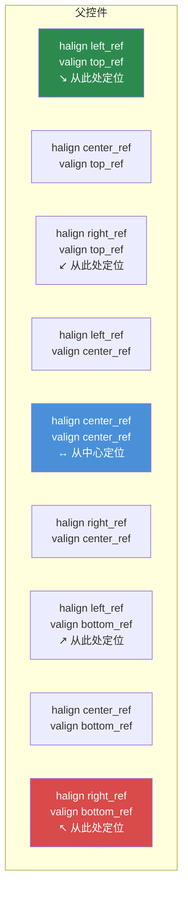

# 第 3.3 章：尺寸与定位

[首页](../../README.md) | [<< 上一章：布局文件格式](02-layout-files.md) | **尺寸与定位** | [下一章：容器控件 >>](04-containers.md)

---

DayZ 布局系统使用**双坐标模式**——每个尺寸值既可以是比例值（相对于父控件），也可以是像素值（绝对屏幕像素）。误解这个系统是布局 bug 的头号来源。本章将对此进行详细讲解。

---

## 核心概念：比例模式与像素模式

每个控件都有一个位置（`x, y`）和一个尺寸（`width, height`）。这四个值中的每一个都可以独立选择：

- **比例模式**（0.0 到 1.0）——相对于父控件的尺寸
- **像素模式**（任意正数）——绝对屏幕像素

每个轴的模式由四个标志控制：

| 标志 | 控制 | `0` = 比例模式 | `1` = 像素模式 |
|---|---|---|---|
| `hexactpos` | X 位置 | 父宽度的比例 | 从左边开始的像素 |
| `vexactpos` | Y 位置 | 父高度的比例 | 从顶部开始的像素 |
| `hexactsize` | 宽度 | 父宽度的比例 | 像素宽度 |
| `vexactsize` | 高度 | 父高度的比例 | 像素高度 |

这意味着你可以自由混合模式。例如，一个控件可以使用比例宽度但像素高度——这是用于行和条形的非常常见的模式。

---

## 理解比例模式

当标志为 `0`（比例模式）时，值表示**父控件尺寸的比例**：

- `size 1 1`，`hexactsize 0` 和 `vexactsize 0` 表示"100% 父宽度，100% 父高度"——子控件填满父控件。
- `size 0.5 0.3` 表示"50% 父宽度，30% 父高度。"
- `position 0.5 0`，`hexactpos 0` 表示"从左边开始在父宽度的 50% 位置。"

比例模式与分辨率无关。当父控件尺寸改变或游戏以不同分辨率运行时，控件会自动缩放。

```
// 填充父控件左半部分的控件
FrameWidgetClass LeftHalf {
 position 0 0
 size 0.5 1
 hexactpos 0
 vexactpos 0
 hexactsize 0
 vexactsize 0
}
```

---

## 理解像素模式

当标志为 `1`（像素/精确模式）时，值以**屏幕像素**为单位：

- `size 200 40`，`hexactsize 1` 和 `vexactsize 1` 表示"200 像素宽，40 像素高。"
- `position 10 10`，`hexactpos 1` 和 `vexactpos 1` 表示"距父控件左边缘 10 像素，距父控件顶部边缘 10 像素。"

像素模式提供精确控制，但不会随分辨率自动缩放。

```
// 固定尺寸按钮：120x30 像素
ButtonWidgetClass MyButton {
 position 10 10
 size 120 30
 hexactpos 1
 vexactpos 1
 hexactsize 1
 vexactsize 1
 text "Click Me"
}
```

---

## 混合模式：最常见的模式

真正的强大之处在于混合使用比例和像素模式。专业 DayZ 模组中最常见的模式是：

**比例宽度，像素高度**——用于条形、行和标题。

```
// 全宽行，正好 30 像素高
FrameWidgetClass Row {
 position 0 0
 size 1 30
 hexactpos 0
 vexactpos 0
 hexactsize 0        // 宽度：比例模式（父控件的 100%）
 vexactsize 1        // 高度：像素模式（30px）
}
```

**比例宽度和高度，像素位置**——用于偏移固定量的居中面板。

```
// 60% x 70% 面板，距中心偏移 0px
FrameWidgetClass Dialog {
 position 0 0
 size 0.6 0.7
 halign center_ref
 valign center_ref
 hexactpos 1         // 位置：像素模式（距中心 0px 偏移）
 vexactpos 1
 hexactsize 0        // 尺寸：比例模式（60% x 70%）
 vexactsize 0
}
```

---

## 对齐参考：halign 和 valign

`halign` 和 `valign` 属性改变定位的**参考点**：

| 值 | 效果 |
|---|---|
| `left_ref`（默认） | 位置从父控件的左边缘测量 |
| `center_ref` | 位置从父控件的中心测量 |
| `right_ref` | 位置从父控件的右边缘测量 |
| `top_ref`（默认） | 位置从父控件的顶部边缘测量 |
| `center_ref` | 位置从父控件的中心测量 |
| `bottom_ref` | 位置从父控件的底部边缘测量 |

### 对齐参考点



与像素位置（`hexactpos 1`）结合使用时，对齐参考使居中变得简单：

```
// 在屏幕上居中，无偏移
FrameWidgetClass CenteredDialog {
 position 0 0
 size 0.4 0.5
 halign center_ref
 valign center_ref
 hexactpos 1
 vexactpos 1
 hexactsize 0
 vexactsize 0
}
```

使用 `center_ref` 时，位置 `0 0` 表示"在父控件中居中"。位置 `10 0` 表示"在中心右边 10 像素"。

### 右对齐元素

```
// 图标固定在右边缘，距边缘 5px
ImageWidgetClass StatusIcon {
 position 5 5
 size 24 24
 halign right_ref
 valign top_ref
 hexactpos 1
 vexactpos 1
 hexactsize 1
 vexactsize 1
}
```

### 底部对齐元素

```
// 父控件底部的状态栏
FrameWidgetClass StatusBar {
 position 0 0
 size 1 30
 halign left_ref
 valign bottom_ref
 hexactpos 1
 vexactpos 1
 hexactsize 0
 vexactsize 1
}
```

---

## 关键警告：不允许负尺寸值

**永远不要在布局文件中对控件尺寸使用负值。** 负尺寸会导致未定义行为——控件可能变得不可见、渲染不正确或导致 UI 系统崩溃。如果需要隐藏控件，请使用 `visible 0`。

这是最常见的布局错误之一。如果你的控件没有显示出来，请检查是否意外设置了负尺寸值。

---

## 常见尺寸模式

### 全屏覆盖层

```
FrameWidgetClass Overlay {
 position 0 0
 size 1 1
 hexactpos 0
 vexactpos 0
 hexactsize 0
 vexactsize 0
}
```

### 居中对话框（60% x 70%）

```
FrameWidgetClass Dialog {
 position 0 0
 size 0.6 0.7
 halign center_ref
 valign center_ref
 hexactpos 1
 vexactpos 1
 hexactsize 0
 vexactsize 0
}
```

### 右对齐侧面板（25% 宽度）

```
FrameWidgetClass SidePanel {
 position 0 0
 size 0.25 1
 halign right_ref
 hexactpos 1
 vexactpos 0
 hexactsize 0
 vexactsize 0
}
```

### 顶部栏（全宽，固定高度）

```
FrameWidgetClass TopBar {
 position 0 0
 size 1 40
 hexactpos 0
 vexactpos 0
 hexactsize 0
 vexactsize 1
}
```

### 右下角徽章

```
FrameWidgetClass Badge {
 position 10 10
 size 80 24
 halign right_ref
 valign bottom_ref
 hexactpos 1
 vexactpos 1
 hexactsize 1
 vexactsize 1
}
```

### 固定尺寸居中图标

```
ImageWidgetClass Icon {
 position 0 0
 size 64 64
 halign center_ref
 valign center_ref
 hexactpos 1
 vexactpos 1
 hexactsize 1
 vexactsize 1
}
```

---

## 代码中的位置和尺寸操作

在代码中，你可以使用比例坐标和像素（屏幕）坐标来读取和设置位置和尺寸：

```c
// 比例坐标（0-1 范围）
float x, y, w, h;
widget.GetPos(x, y);           // 读取比例位置
widget.SetPos(0.5, 0.1);      // 设置比例位置
widget.GetSize(w, h);          // 读取比例尺寸
widget.SetSize(0.3, 0.2);     // 设置比例尺寸

// 像素/屏幕坐标
widget.GetScreenPos(x, y);     // 读取像素位置
widget.SetScreenPos(100, 50);  // 设置像素位置
widget.GetScreenSize(w, h);    // 读取像素尺寸
widget.SetScreenSize(400, 300);// 设置像素尺寸
```

通过代码将控件居中到屏幕上：

```c
int screen_w, screen_h;
GetScreenSize(screen_w, screen_h);

float w, h;
widget.GetScreenSize(w, h);
widget.SetScreenPos((screen_w - w) / 2, (screen_h - h) / 2);
```

---

## `scaled` 属性

当设置 `scaled 1` 时，控件会遵循 DayZ 的 UI 缩放设置（选项 > 视频 > HUD 大小）。这对于应随用户偏好缩放的 HUD 元素很重要。

如果不设置 `scaled`，像素尺寸的控件将始终保持相同的物理大小，不受 UI 缩放选项的影响。

---

## `fixaspect` 属性

使用 `fixaspect` 来保持控件的宽高比：

- `fixaspect fixwidth`——高度根据宽度调整以保持宽高比
- `fixaspect fixheight`——宽度根据高度调整以保持宽高比

这主要用于 `ImageWidget` 以防止图像变形。

---

## Z 轴顺序和优先级

`priority` 属性控制重叠时哪些控件渲染在上面。较高的值渲染在较低值的上面。

| 优先级范围 | 典型用途 |
|----------------|-------------|
| 0-5 | 背景元素，装饰面板 |
| 10-50 | 普通 UI 元素，HUD 组件 |
| 50-100 | 覆盖层元素，浮动面板 |
| 100-200 | 通知，工具提示 |
| 998-999 | 模态对话框，阻塞覆盖层 |

```
FrameWidget myBackground {
    priority 1
    // ...
}

FrameWidget myDialog {
    priority 999
    // ...
}
```

**重要：** 优先级仅影响同一父控件内兄弟元素之间的渲染顺序。嵌套的子控件始终渲染在其父控件之上，与优先级值无关。

---

## 调试尺寸问题

当控件没有出现在你期望的位置时：

1. **检查精确标志**——`hexactsize` 是否在你想使用像素时设置为 `0`？在比例模式下值为 `200` 意味着父宽度的 200 倍（远在屏幕之外）。
2. **检查是否有负尺寸**——`size` 中的任何负值都会导致问题。
3. **检查父控件的尺寸**——零尺寸父控件的比例子控件也是零尺寸。
4. **检查 `visible`**——控件默认可见，但如果父控件被隐藏，所有子控件也会被隐藏。
5. **检查 `priority`**——优先级较低的控件可能被另一个控件遮挡。
6. **使用 `clipchildren`**——如果父控件设置了 `clipchildren 1`，超出其边界的子控件将不可见。

---

## 最佳实践

- 始终显式指定所有四个精确标志（`hexactpos`、`vexactpos`、`hexactsize`、`vexactsize`）。省略它们会导致不可预测的行为，因为不同控件类型的默认值不同。
- 对行和条形使用比例宽度 + 像素高度模式。这是最安全的分辨率适配组合，也是专业模组的标准做法。
- 使用 `halign center_ref` + `valign center_ref` + 像素位置 `0 0` 来居中对话框，而不是使用比例位置 `0.5 0.5`。对齐参考方法无论控件尺寸如何都保持居中。
- 避免对全屏或接近全屏的元素使用像素尺寸。使用比例尺寸，使 UI 适应任何分辨率（1080p、1440p、4K）。
- 在代码中使用 `SetScreenPos()` / `SetScreenSize()` 时，在控件附加到其父控件之后调用它们。在附加之前调用可能会产生不正确的坐标。

---

## 理论与实践

> 文档说的内容与运行时的实际行为对比。

| 概念 | 理论 | 现实 |
|---------|--------|---------|
| 比例尺寸 | 值 0.0-1.0 相对于父控件缩放 | 如果父控件有像素尺寸，子控件的比例值是相对于该像素值的，而不是屏幕——200px 宽父控件的子控件 `size 0.5` 是 100px |
| `center_ref` 对齐 | 控件在父控件中自动居中 | 控件的左上角被放置在中心点——除非位置为 `0 0` 并使用像素模式，否则控件会从中心向右下方延伸 |
| `priority` Z 轴排序 | 较高的值渲染在上面 | 优先级仅影响同一父控件内的兄弟元素。子控件始终渲染在其父控件之上，与优先级值无关 |
| `scaled` 属性 | 控件遵循 HUD 大小设置 | 仅影响像素模式的尺寸。比例尺寸已随父控件缩放，忽略 `scaled` 标志 |
| 负位置值 | 应在反方向偏移 | 对位置有效（从参考点向左/上偏移），但负尺寸值会导致未定义的渲染行为——永远不要使用 |

---

## 兼容性与影响

- **多模组兼容：** 尺寸和定位是按控件设置的，不会在模组之间冲突。但是，使用全屏覆盖层（根控件 `size 1 1`）且 `priority 999` 的模组可能会阻止其他模组的 UI 元素接收输入。
- **性能：** 对于动画或动态控件，比例尺寸每帧需要相对于父控件重新计算。对于静态布局，比例模式和像素模式之间没有可测量的差异。
- **版本：** 双坐标系统（比例 vs 像素）自 DayZ 0.63 实验版以来一直稳定。`scaled` 属性的行为在 DayZ 1.14 中进行了改进，以更好地遵循 HUD 大小滑块。

---

## 后续步骤

- [3.4 容器控件](04-containers.md)——间距控件和滚动控件如何自动处理布局
- [3.5 代码创建控件](05-programmatic-widgets.md)——通过代码设置尺寸和位置
