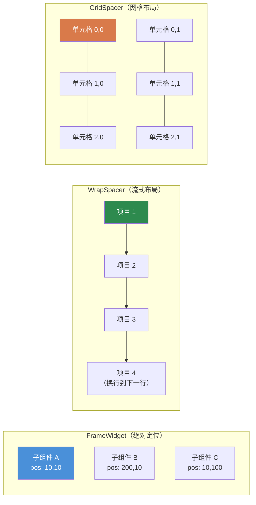
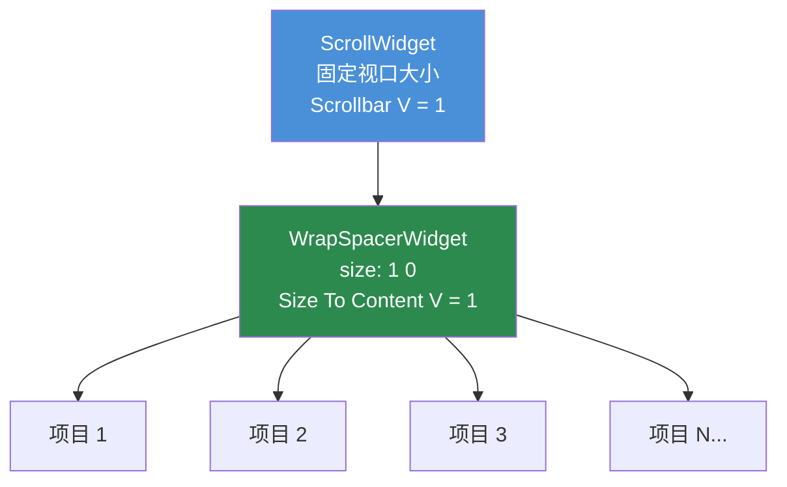

# 第 3.4 章：容器组件

[首页](../../README.md) | [<< 上一章：尺寸与定位](03-sizing-positioning.md) | **容器组件** | [下一章：程序化组件 >>](05-programmatic-widgets.md)

---

容器组件用于在其内部组织子组件。`FrameWidget` 是最简单的（不可见的盒子，手动定位），DayZ 提供了三个专用容器来自动处理布局：`WrapSpacerWidget`、`GridSpacerWidget` 和 `ScrollWidget`。

### 容器对比



---

## FrameWidget -- 结构容器

`FrameWidget` 是最基本的容器。它在屏幕上不绘制任何内容，也不排列其子组件 -- 你必须手动定位每个子组件。

**何时使用：**
- 将相关组件分组以便一起显示/隐藏
- 面板或对话框的根组件
- 任何由你自行处理定位的结构分组

```
FrameWidgetClass MyPanel {
 size 0.5 0.5
 halign center_ref
 valign center_ref
 hexactpos 1
 vexactpos 1
 hexactsize 0
 vexactsize 0
 {
  TextWidgetClass Header {
   position 0 0
   size 1 0.1
   text "Panel Title"
   "text halign" center
  }
  PanelWidgetClass Divider {
   position 0 0.1
   size 1 2
   hexactsize 0
   vexactsize 1
   color 1 1 1 0.3
  }
  FrameWidgetClass Content {
   position 0 0.12
   size 1 0.88
  }
 }
}
```

**关键特性：**
- 没有视觉外观（透明）
- 子组件相对于框架的边界定位
- 没有自动布局 -- 每个子组件都需要明确的位置/尺寸
- 轻量级 -- 除了子组件外零渲染成本

---

## WrapSpacerWidget -- 流式布局

`WrapSpacerWidget` 自动将其子组件按流式序列排列。子组件水平放置，当超过可用宽度时换到下一行。这是用于子组件数量在运行时变化的动态列表的组件。

### 布局属性

| 属性 | 值 | 描述 |
|---|---|---|
| `Padding` | 整数（像素） | 间隔器边缘与其子组件之间的空间 |
| `Margin` | 整数（像素） | 各个子组件之间的空间 |
| `"Size To Content H"` | `0` 或 `1` | 调整宽度以适应所有子组件 |
| `"Size To Content V"` | `0` 或 `1` | 调整高度以适应所有子组件 |
| `content_halign` | `left`、`center`、`right` | 子组件组的水平对齐 |
| `content_valign` | `top`、`center`、`bottom` | 子组件组的垂直对齐 |

### 基本流式布局

```
WrapSpacerWidgetClass TagList {
 size 1 0
 hexactsize 0
 "Size To Content V" 1
 Padding 5
 Margin 3
 {
  ButtonWidgetClass Tag1 {
   size 80 24
   hexactsize 1
   vexactsize 1
   text "Weapons"
  }
  ButtonWidgetClass Tag2 {
   size 60 24
   hexactsize 1
   vexactsize 1
   text "Food"
  }
  ButtonWidgetClass Tag3 {
   size 90 24
   hexactsize 1
   vexactsize 1
   text "Medical"
  }
 }
}
```

在这个示例中：
- 间隔器占满父组件宽度（`size 1`），但其高度会调整以适应子组件（`"Size To Content V" 1`）。
- 子组件是 80px、60px 和 90px 宽的按钮。
- 如果可用宽度不能在一行中容纳所有三个，间隔器会将它们换到下一行。
- `Padding 5` 在间隔器边缘内部添加 5px 的空间。
- `Margin 3` 在每个子组件之间添加 3px。

### 使用 WrapSpacer 的垂直列表

要创建垂直列表（每行一个项目），使子组件占满宽度：

```
WrapSpacerWidgetClass ItemList {
 size 1 0
 hexactsize 0
 "Size To Content V" 1
 Margin 2
 {
  FrameWidgetClass Item1 {
   size 1 30
   hexactsize 0
   vexactsize 1
  }
  FrameWidgetClass Item2 {
   size 1 30
   hexactsize 0
   vexactsize 1
  }
 }
}
```

每个子组件都是 100% 宽度（`size 1` 配合 `hexactsize 0`），因此每行只能容纳一个，形成垂直堆叠。

### 动态子组件

`WrapSpacerWidget` 非常适合以编程方式添加的子组件。当你添加或移除子组件时，在间隔器上调用 `Update()` 来触发重新布局：

```c
WrapSpacerWidget spacer;

// 从布局文件添加子组件
Widget child = GetGame().GetWorkspace().CreateWidgets("MyMod/gui/layouts/ListItem.layout", spacer);

// 强制间隔器重新计算
spacer.Update();
```

---

## GridSpacerWidget -- 网格布局

`GridSpacerWidget` 将子组件排列成统一的网格。你定义列数和行数，每个单元格获得相等的空间。

### 布局属性

| 属性 | 值 | 描述 |
|---|---|---|
| `Columns` | 整数 | 网格列数 |
| `Rows` | 整数 | 网格行数 |
| `Margin` | 整数（像素） | 网格单元格之间的空间 |
| `"Size To Content V"` | `0` 或 `1` | 调整高度以适应内容 |

### 基本网格

```
GridSpacerWidgetClass InventoryGrid {
 size 0.5 0.5
 hexactsize 0
 vexactsize 0
 Columns 4
 Rows 3
 Margin 2
 {
  // 12 个单元格（4 列 x 3 行）
  // 子组件按顺序放置：从左到右，从上到下
  FrameWidgetClass Slot1 { }
  FrameWidgetClass Slot2 { }
  FrameWidgetClass Slot3 { }
  FrameWidgetClass Slot4 { }
  FrameWidgetClass Slot5 { }
  FrameWidgetClass Slot6 { }
  FrameWidgetClass Slot7 { }
  FrameWidgetClass Slot8 { }
  FrameWidgetClass Slot9 { }
  FrameWidgetClass Slot10 { }
  FrameWidgetClass Slot11 { }
  FrameWidgetClass Slot12 { }
 }
}
```

### 单列网格（垂直列表）

将 `Columns 1` 设置为创建简单的垂直堆叠，每个子组件获得完整宽度：

```
GridSpacerWidgetClass SettingsList {
 size 1 0
 hexactsize 0
 "Size To Content V" 1
 Columns 1
 {
  FrameWidgetClass Setting1 {
   size 150 30
   hexactsize 1
   vexactsize 1
  }
  FrameWidgetClass Setting2 {
   size 150 30
   hexactsize 1
   vexactsize 1
  }
  FrameWidgetClass Setting3 {
   size 150 30
   hexactsize 1
   vexactsize 1
  }
 }
}
```

### GridSpacer 与 WrapSpacer 对比

| 特性 | GridSpacer | WrapSpacer |
|---|---|---|
| 单元格大小 | 统一（相等） | 每个子组件保持自己的大小 |
| 布局模式 | 固定网格（列 x 行） | 带换行的流式布局 |
| 最适合 | 库存槽位、统一画廊 | 动态列表、标签云 |
| 子组件尺寸 | 被忽略（由网格控制） | 被尊重（子组件大小有意义） |

---

## ScrollWidget -- 可滚动视口

`ScrollWidget` 包裹可能高于（或宽于）可见区域的内容，提供滚动条以进行导航。

### 布局属性

| 属性 | 值 | 描述 |
|---|---|---|
| `"Scrollbar V"` | `0` 或 `1` | 显示垂直滚动条 |
| `"Scrollbar H"` | `0` 或 `1` | 显示水平滚动条 |

### 脚本 API

```c
ScrollWidget sw;
sw.VScrollToPos(float pos);     // 滚动到垂直位置（0 = 顶部）
sw.GetVScrollPos();             // 获取当前滚动位置
sw.GetContentHeight();          // 获取总内容高度
sw.VScrollStep(int step);       // 按步长滚动
```

### 基本可滚动列表

```
ScrollWidgetClass ListScroll {
 size 1 300
 hexactsize 0
 vexactsize 1
 "Scrollbar V" 1
 {
  WrapSpacerWidgetClass ListContent {
   size 1 0
   hexactsize 0
   "Size To Content V" 1
   {
    // 这里有许多子组件...
    FrameWidgetClass Item1 {
     size 1 30
     hexactsize 0
     vexactsize 1
    }
    FrameWidgetClass Item2 {
     size 1 30
     hexactsize 0
     vexactsize 1
    }
    // ... 更多项目
   }
  }
 }
}
```

---

## ScrollWidget + WrapSpacer 模式

### ScrollWidget + WrapSpacer 模式



这是 DayZ 模组中可滚动动态列表的**标准**模式。它将固定高度的 `ScrollWidget` 与会增长以适应其子组件的 `WrapSpacerWidget` 结合在一起。

```
// 固定高度的滚动视口
ScrollWidgetClass DialogScroll {
 size 0.97 235
 hexactsize 0
 vexactsize 1
 "Scrollbar V" 1
 {
  // 内容垂直增长以适应所有子组件
  WrapSpacerWidgetClass DialogContent {
   size 1 0
   hexactsize 0
   "Size To Content V" 1
  }
 }
}
```

工作原理：

1. `ScrollWidget` 有一个**固定**高度（此示例中为 235 像素）。
2. 在其内部，`WrapSpacerWidget` 设置了 `"Size To Content V" 1`，因此其高度会随着子组件的添加而增长。
3. 当间隔器的内容超过 235 像素时，滚动条出现，用户可以滚动。

这个模式出现在 DabsFramework、DayZ Editor、Expansion 和几乎所有专业 DayZ 模组中。

### 以编程方式添加项目

```c
ScrollWidget m_Scroll;
WrapSpacerWidget m_Content;

void AddItem(string text)
{
    // 在 WrapSpacer 内创建新的子组件
    Widget item = GetGame().GetWorkspace().CreateWidgets(
        "MyMod/gui/layouts/ListItem.layout", m_Content);

    // 配置新项目
    TextWidget tw = TextWidget.Cast(item.FindAnyWidget("Label"));
    tw.SetText(text);

    // 强制布局重新计算
    m_Content.Update();
}

void ScrollToBottom()
{
    m_Scroll.VScrollToPos(m_Scroll.GetContentHeight());
}

void ClearAll()
{
    // 移除所有子组件
    Widget child = m_Content.GetChildren();
    while (child)
    {
        Widget next = child.GetSibling();
        child.Unlink();
        child = next;
    }
    m_Content.Update();
}
```

---

## 嵌套规则

容器可以嵌套以创建复杂的布局。一些指导原则：

1. **FrameWidget 在任何容器内** -- 始终有效。使用框架在间隔器或网格中对子部分进行分组。

2. **WrapSpacer 在 ScrollWidget 内** -- 可滚动列表的标准模式。间隔器增长；滚动裁剪。

3. **GridSpacer 在 WrapSpacer 内** -- 有效。用于将固定网格作为流式布局中的一个项目。

4. **ScrollWidget 在 WrapSpacer 内** -- 可能但需要在滚动组件上设置固定高度（`vexactsize 1`）。没有固定高度，滚动组件会尝试增长以适应其内容（这违背了滚动的目的）。

5. **避免深层嵌套** -- 每一层嵌套都增加布局计算成本。三到四层深度对于复杂 UI 来说很典型；超过六层则建议重构布局。

---

## 何时使用哪种容器

| 场景 | 最佳容器 |
|---|---|
| 手动定位元素的静态面板 | `FrameWidget` |
| 大小不同项目的动态列表 | `WrapSpacerWidget` |
| 统一网格（库存、画廊） | `GridSpacerWidget` |
| 每行一个项目的垂直列表 | `WrapSpacerWidget`（全宽子组件）或 `GridSpacerWidget`（`Columns 1`） |
| 内容高于可用空间 | `ScrollWidget` 包裹一个间隔器 |
| 选项卡内容区域 | `FrameWidget`（切换子组件的可见性） |
| 工具栏按钮 | `WrapSpacerWidget` 或 `GridSpacerWidget` |

---

## 完整示例：可滚动设置面板

一个包含标题栏、网格排列选项的可滚动内容区域和底部按钮栏的设置面板：

```
FrameWidgetClass SettingsPanel {
 size 0.4 0.6
 halign center_ref
 valign center_ref
 hexactpos 1
 vexactpos 1
 hexactsize 0
 vexactsize 0
 {
  // 标题栏
  PanelWidgetClass TitleBar {
   position 0 0
   size 1 30
   hexactsize 0
   vexactsize 1
   color 0.2 0.4 0.8 1
  }

  // 可滚动设置区域
  ScrollWidgetClass SettingsScroll {
   position 0 30
   size 1 0
   hexactpos 0
   vexactpos 1
   hexactsize 0
   vexactsize 0
   "Scrollbar V" 1
   {
    GridSpacerWidgetClass SettingsGrid {
     size 1 0
     hexactsize 0
     "Size To Content V" 1
     Columns 1
     Margin 2
    }
   }
  }

  // 底部按钮栏
  FrameWidgetClass ButtonBar {
   size 1 40
   halign left_ref
   valign bottom_ref
   hexactpos 0
   vexactpos 1
   hexactsize 0
   vexactsize 1
  }
 }
}
```

---

## 最佳实践

- 以编程方式添加或移除子组件后，始终在 `WrapSpacerWidget` 或 `GridSpacerWidget` 上调用 `Update()`。没有此调用，间隔器不会重新计算其布局，子组件可能会重叠或不可见。
- 将 `ScrollWidget` + `WrapSpacerWidget` 作为任何动态列表的标准模式。将滚动设置为固定像素高度，内部间隔器设置为 `"Size To Content V" 1`。
- 对于项目高度不同的垂直列表，优先使用带全宽子组件的 `WrapSpacerWidget`，而不是 `GridSpacerWidget Columns 1`。GridSpacer 强制统一的单元格大小。
- 始终在 `ScrollWidget` 上设置 `clipchildren 1`。没有它，溢出的内容会渲染到滚动视口边界之外。
- 避免嵌套超过 4-5 层容器深度。每层都增加布局计算成本，使调试显著困难。

---

## 理论与实践

> 文档所说的与运行时实际工作方式的对比。

| 概念 | 理论 | 现实 |
|---------|--------|---------|
| `WrapSpacerWidget.Update()` | 子组件变化时自动重新计算布局 | 你必须在 `CreateWidgets()` 或 `Unlink()` 后手动调用 `Update()`。忘记这一点是最常见的间隔器错误 |
| `"Size To Content V"` | 间隔器增长以适应子组件 | 仅在子组件具有明确大小（像素高度或已知比例父组件）时有效。如果子组件也是 `Size To Content`，你会得到零高度 |
| `GridSpacerWidget` 单元格大小 | 网格统一控制单元格大小 | 子组件自身的大小属性被忽略 -- 网格覆盖它们。在网格子组件上设置 `size` 没有效果 |
| `ScrollWidget` 滚动位置 | `VScrollToPos(0)` 滚动到顶部 | 添加子组件后，你可能需要延迟一帧调用 `VScrollToPos()`（通过 `CallLater`），因为内容高度尚未重新计算 |
| 嵌套间隔器 | 间隔器可以自由嵌套 | `WrapSpacer` 内的 `WrapSpacer` 可以工作，但两层都使用 `Size To Content` 可能导致无限布局循环，冻结 UI |

---

## 兼容性与影响

- **多模组：** 容器组件是每个布局独立的，模组之间不会冲突。但是，如果两个模组通过 `modded class` 向同一个原版 `ScrollWidget` 注入子组件，子组件的顺序是不可预测的。
- **性能：** `WrapSpacerWidget.Update()` 重新计算所有子组件的位置。对于包含 100+ 项目的列表，在批量操作之后调用一次 `Update()`，而不是每次单独添加后都调用。GridSpacer 对于统一网格更快，因为单元格位置是通过算术计算的。
- **版本：** `WrapSpacerWidget` 和 `GridSpacerWidget` 从 DayZ 1.0 起就可用。`"Size To Content H/V"` 属性从一开始就存在，但它们在深度嵌套布局中的行为大约在 DayZ 1.10 时趋于稳定。

---

## 在真实模组中的观察

| 模式 | 模组 | 详情 |
|---------|-----|--------|
| 用于动态列表的 `ScrollWidget` + `WrapSpacerWidget` | DabsFramework、Expansion、COT | 带有自动增长内部间隔器的固定高度滚动视口 -- 通用的可滚动列表模式 |
| 用于库存的 `GridSpacerWidget Columns 10` | 原版 DayZ | 库存网格使用 GridSpacer 和匹配槽位布局的固定列数 |
| WrapSpacer 中的池化子组件 | VPP Admin Tools | 预创建列表项组件池，显示/隐藏它们而不是创建/销毁，以避免 `Update()` 开销 |
| `WrapSpacerWidget` 作为对话框根 | COT、DayZ Editor | 对话框根使用 `Size To Content V/H`，使对话框自动围绕其内容调整大小，无需硬编码尺寸 |

---

## 下一步

- [3.5 程序化组件创建](05-programmatic-widgets.md) -- 从代码创建组件
- [3.6 事件处理](06-event-handling.md) -- 响应点击、变化和其他事件
