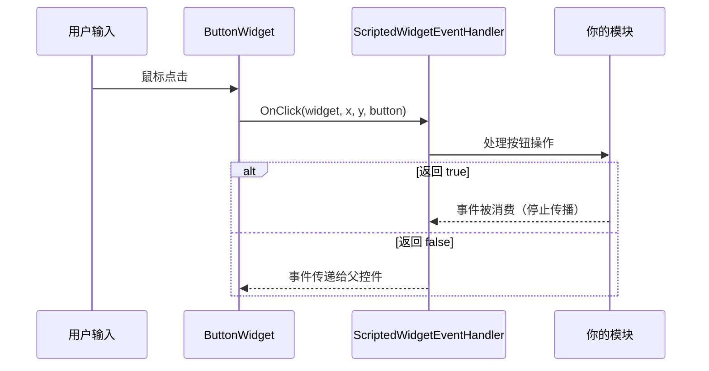

# 第 3.6 章：事件处理

[首页](../../README.md) | [<< 上一章：编程式控件创建](05-programmatic-widgets.md) | **事件处理** | [下一章：样式、字体与图像 >>](07-styles-fonts.md)

---

控件在用户与之交互时会生成事件 —— 点击按钮、在编辑框中输入、移动鼠标、拖动元素。本章介绍如何接收和处理这些事件。

---

## ScriptedWidgetEventHandler

`ScriptedWidgetEventHandler` 类是 DayZ 中所有控件事件处理的基础。它提供了每种可能控件事件的可重写方法。

要从控件接收事件，创建一个继承 `ScriptedWidgetEventHandler` 的类，重写你关心的事件方法，然后使用 `SetHandler()` 将处理器附加到控件。

### 完整事件方法列表

```c
class ScriptedWidgetEventHandler
{
    // 点击事件
    bool OnClick(Widget w, int x, int y, int button);
    bool OnDoubleClick(Widget w, int x, int y, int button);

    // 选择事件
    bool OnSelect(Widget w, int x, int y);
    bool OnItemSelected(Widget w, int x, int y, int row, int column,
                         int oldRow, int oldColumn);

    // 焦点事件
    bool OnFocus(Widget w, int x, int y);
    bool OnFocusLost(Widget w, int x, int y);

    // 鼠标事件
    bool OnMouseEnter(Widget w, int x, int y);
    bool OnMouseLeave(Widget w, Widget enterW, int x, int y);
    bool OnMouseWheel(Widget w, int x, int y, int wheel);
    bool OnMouseButtonDown(Widget w, int x, int y, int button);
    bool OnMouseButtonUp(Widget w, int x, int y, int button);

    // 键盘事件
    bool OnKeyDown(Widget w, int x, int y, int key);
    bool OnKeyUp(Widget w, int x, int y, int key);
    bool OnKeyPress(Widget w, int x, int y, int key);

    // 更改事件（滑块、复选框、编辑框）
    bool OnChange(Widget w, int x, int y, bool finished);

    // 拖放事件
    bool OnDrag(Widget w, int x, int y);
    bool OnDragging(Widget w, int x, int y, Widget receiver);
    bool OnDraggingOver(Widget w, int x, int y, Widget receiver);
    bool OnDrop(Widget w, int x, int y, Widget receiver);
    bool OnDropReceived(Widget w, int x, int y, Widget receiver);

    // 手柄（手柄）事件
    bool OnController(Widget w, int control, int value);

    // 布局事件
    bool OnResize(Widget w, int x, int y);
    bool OnChildAdd(Widget w, Widget child);
    bool OnChildRemove(Widget w, Widget child);

    // 其他
    bool OnUpdate(Widget w);
    bool OnModalResult(Widget w, int x, int y, int code, int result);
}
```

### 返回值：消费 vs 传递

每个事件处理器返回一个 `bool`：

- **`return true;`** -- 事件被**消费**。没有其他处理器会接收到它。事件停止沿控件层次向上传播。
- **`return false;`** -- 事件被**传递**给父控件的处理器（如果有的话）。

这对于构建分层 UI 至关重要。例如，按钮点击处理器应返回 `true` 以防止点击同时触发后面面板的行为。

### 事件流程



---

## 使用 SetHandler() 注册处理器

处理事件的最简单方式是对控件调用 `SetHandler()`：

```c
class MyPanel : ScriptedWidgetEventHandler
{
    protected Widget m_Root;
    protected ButtonWidget m_SaveBtn;
    protected ButtonWidget m_CancelBtn;

    void MyPanel()
    {
        m_Root = GetGame().GetWorkspace().CreateWidgets(
            "MyMod/gui/layouts/panel.layout");

        m_SaveBtn = ButtonWidget.Cast(m_Root.FindAnyWidget("SaveButton"));
        m_CancelBtn = ButtonWidget.Cast(m_Root.FindAnyWidget("CancelButton"));

        // 将此类注册为两个按钮的事件处理器
        m_SaveBtn.SetHandler(this);
        m_CancelBtn.SetHandler(this);
    }

    override bool OnClick(Widget w, int x, int y, int button)
    {
        if (w == m_SaveBtn)
        {
            Save();
            return true;  // 已消费
        }

        if (w == m_CancelBtn)
        {
            Cancel();
            return true;
        }

        return false;  // 不是我们的控件，传递
    }
}
```

单个处理器实例可以注册到多个控件上。在事件方法内部，将 `w`（生成事件的控件）与你缓存的引用进行比较，以确定是哪个控件被交互了。

---

## 常见事件详解

### OnClick

```c
bool OnClick(Widget w, int x, int y, int button)
```

当 `ButtonWidget` 被点击时触发（鼠标在控件上释放）。

- `w` -- 被点击的控件
- `x, y` -- 鼠标光标位置（屏幕像素）
- `button` -- 鼠标按钮索引：`0` = 左键，`1` = 右键，`2` = 中键

```c
override bool OnClick(Widget w, int x, int y, int button)
{
    if (button != 0) return false;  // 只处理左键点击

    if (w == m_MyButton)
    {
        DoAction();
        return true;
    }
    return false;
}
```

### OnChange

```c
bool OnChange(Widget w, int x, int y, bool finished)
```

当 `SliderWidget`、`CheckBoxWidget`、`EditBoxWidget` 及其他基于值的控件的值发生变化时触发。

- `w` -- 值发生变化的控件
- `finished` -- 对于滑块：当用户释放滑块手柄时为 `true`。对于编辑框：当按下 Enter 键时为 `true`。

```c
override bool OnChange(Widget w, int x, int y, bool finished)
{
    if (w == m_VolumeSlider)
    {
        SliderWidget slider = SliderWidget.Cast(w);
        float value = slider.GetCurrent();

        // 仅在用户完成拖动时应用
        if (finished)
        {
            ApplyVolume(value);
        }
        else
        {
            // 拖动时预览
            PreviewVolume(value);
        }
        return true;
    }

    if (w == m_NameInput)
    {
        EditBoxWidget edit = EditBoxWidget.Cast(w);
        string text = edit.GetText();

        if (finished)
        {
            // 用户按下了 Enter
            SubmitName(text);
        }
        return true;
    }

    if (w == m_EnableCheckbox)
    {
        CheckBoxWidget cb = CheckBoxWidget.Cast(w);
        bool checked = cb.IsChecked();
        ToggleFeature(checked);
        return true;
    }

    return false;
}
```

### OnMouseEnter / OnMouseLeave

```c
bool OnMouseEnter(Widget w, int x, int y)
bool OnMouseLeave(Widget w, Widget enterW, int x, int y)
```

当鼠标光标进入或离开控件边界时触发。`OnMouseLeave` 中的 `enterW` 参数是光标移入的控件。

常见用途：悬停效果。

```c
override bool OnMouseEnter(Widget w, int x, int y)
{
    if (w == m_HoverPanel)
    {
        m_HoverPanel.SetColor(ARGB(255, 80, 130, 200));  // 高亮
        return true;
    }
    return false;
}

override bool OnMouseLeave(Widget w, Widget enterW, int x, int y)
{
    if (w == m_HoverPanel)
    {
        m_HoverPanel.SetColor(ARGB(255, 50, 50, 50));  // 默认
        return true;
    }
    return false;
}
```

### OnFocus / OnFocusLost

```c
bool OnFocus(Widget w, int x, int y)
bool OnFocusLost(Widget w, int x, int y)
```

当控件获得或失去键盘焦点时触发。对于编辑框和其他文本输入控件很重要。

```c
override bool OnFocus(Widget w, int x, int y)
{
    if (w == m_SearchBox)
    {
        m_SearchBox.SetColor(ARGB(255, 100, 160, 220));
        return true;
    }
    return false;
}

override bool OnFocusLost(Widget w, int x, int y)
{
    if (w == m_SearchBox)
    {
        m_SearchBox.SetColor(ARGB(255, 60, 60, 60));
        return true;
    }
    return false;
}
```

### OnMouseWheel

```c
bool OnMouseWheel(Widget w, int x, int y, int wheel)
```

当鼠标滚轮在控件上滚动时触发。`wheel` 向上滚动为正值，向下滚动为负值。

### OnKeyDown / OnKeyUp / OnKeyPress

```c
bool OnKeyDown(Widget w, int x, int y, int key)
bool OnKeyUp(Widget w, int x, int y, int key)
bool OnKeyPress(Widget w, int x, int y, int key)
```

键盘事件。`key` 参数对应 `KeyCode` 常量（例如 `KeyCode.KC_ESCAPE`、`KeyCode.KC_RETURN`）。

### OnDrag / OnDrop / OnDropReceived

```c
bool OnDrag(Widget w, int x, int y)
bool OnDrop(Widget w, int x, int y, Widget receiver)
bool OnDropReceived(Widget w, int x, int y, Widget receiver)
```

拖放事件。控件必须在布局中设置 `draggable 1`（或在代码中设置 `WidgetFlags.DRAGGABLE`）。

- `OnDrag` -- 用户开始拖动控件 `w`
- `OnDrop` -- 控件 `w` 被放下；`receiver` 是下方的控件
- `OnDropReceived` -- 控件 `w` 接收到一个放置；`receiver` 是被放置的控件

### OnItemSelected

```c
bool OnItemSelected(Widget w, int x, int y, int row, int column,
                     int oldRow, int oldColumn)
```

当 `TextListboxWidget` 中的行被选中时触发。

---

## 原版 WidgetEventHandler（回调注册）

DayZ 的原版代码使用另一种模式：`WidgetEventHandler`，一个将事件路由到命名回调函数的单例。这在原版菜单中常用。

```c
WidgetEventHandler handler = WidgetEventHandler.GetInstance();

// 按函数名注册事件回调
handler.RegisterOnClick(myButton, this, "OnMyButtonClick");
handler.RegisterOnMouseEnter(myWidget, this, "OnHoverStart");
handler.RegisterOnMouseLeave(myWidget, this, "OnHoverEnd");
handler.RegisterOnDoubleClick(myWidget, this, "OnDoubleClick");
handler.RegisterOnMouseButtonDown(myWidget, this, "OnMouseDown");
handler.RegisterOnMouseButtonUp(myWidget, this, "OnMouseUp");
handler.RegisterOnMouseWheel(myWidget, this, "OnWheel");
handler.RegisterOnFocus(myWidget, this, "OnFocusGained");
handler.RegisterOnFocusLost(myWidget, this, "OnFocusLost");
handler.RegisterOnDrag(myWidget, this, "OnDragStart");
handler.RegisterOnDrop(myWidget, this, "OnDropped");
handler.RegisterOnDropReceived(myWidget, this, "OnDropReceived");
handler.RegisterOnDraggingOver(myWidget, this, "OnDragOver");
handler.RegisterOnChildAdd(myWidget, this, "OnChildAdded");
handler.RegisterOnChildRemove(myWidget, this, "OnChildRemoved");

// 取消注册控件的所有回调
handler.UnregisterWidget(myWidget);
```

回调函数签名必须匹配事件类型：

```c
void OnMyButtonClick(Widget w, int x, int y, int button)
{
    // 处理点击
}

void OnHoverStart(Widget w, int x, int y)
{
    // 处理鼠标进入
}

void OnHoverEnd(Widget w, Widget enterW, int x, int y)
{
    // 处理鼠标离开
}
```

### SetHandler() vs. WidgetEventHandler

| 方面 | SetHandler() | WidgetEventHandler |
|---|---|---|
| 模式 | 重写虚方法 | 注册命名回调 |
| 每个控件的处理器 | 一个控件一个处理器 | 每个事件可以有多个回调 |
| 使用者 | DabsFramework、Expansion、自定义模组 | 原版 DayZ 菜单 |
| 灵活性 | 必须在一个类中处理所有事件 | 可以为不同事件注册不同目标 |
| 清理 | 处理器销毁时隐式清理 | 必须调用 `UnregisterWidget()` |

对于新模组，推荐使用 `SetHandler()` 配合 `ScriptedWidgetEventHandler`。

---

## 完整示例：交互式按钮面板

一个包含三个按钮的面板，悬停时变色，点击时执行操作：

```c
class InteractivePanel : ScriptedWidgetEventHandler
{
    protected Widget m_Root;
    protected ButtonWidget m_BtnStart;
    protected ButtonWidget m_BtnStop;
    protected ButtonWidget m_BtnReset;
    protected TextWidget m_StatusText;

    protected int m_DefaultColor = ARGB(255, 60, 60, 60);
    protected int m_HoverColor   = ARGB(255, 80, 130, 200);
    protected int m_ActiveColor  = ARGB(255, 50, 180, 80);

    void InteractivePanel()
    {
        m_Root = GetGame().GetWorkspace().CreateWidgets(
            "MyMod/gui/layouts/interactive_panel.layout");

        m_BtnStart  = ButtonWidget.Cast(m_Root.FindAnyWidget("BtnStart"));
        m_BtnStop   = ButtonWidget.Cast(m_Root.FindAnyWidget("BtnStop"));
        m_BtnReset  = ButtonWidget.Cast(m_Root.FindAnyWidget("BtnReset"));
        m_StatusText = TextWidget.Cast(m_Root.FindAnyWidget("StatusText"));

        // 在所有交互控件上注册此处理器
        m_BtnStart.SetHandler(this);
        m_BtnStop.SetHandler(this);
        m_BtnReset.SetHandler(this);
    }

    override bool OnClick(Widget w, int x, int y, int button)
    {
        if (button != 0) return false;

        if (w == m_BtnStart)
        {
            m_StatusText.SetText("Started");
            m_StatusText.SetColor(m_ActiveColor);
            return true;
        }
        if (w == m_BtnStop)
        {
            m_StatusText.SetText("Stopped");
            m_StatusText.SetColor(ARGB(255, 200, 50, 50));
            return true;
        }
        if (w == m_BtnReset)
        {
            m_StatusText.SetText("Ready");
            m_StatusText.SetColor(ARGB(255, 200, 200, 200));
            return true;
        }
        return false;
    }

    override bool OnMouseEnter(Widget w, int x, int y)
    {
        if (w == m_BtnStart || w == m_BtnStop || w == m_BtnReset)
        {
            w.SetColor(m_HoverColor);
            return true;
        }
        return false;
    }

    override bool OnMouseLeave(Widget w, Widget enterW, int x, int y)
    {
        if (w == m_BtnStart || w == m_BtnStop || w == m_BtnReset)
        {
            w.SetColor(m_DefaultColor);
            return true;
        }
        return false;
    }

    void Show(bool visible)
    {
        m_Root.Show(visible);
    }

    void ~InteractivePanel()
    {
        if (m_Root)
        {
            m_Root.Unlink();
            m_Root = null;
        }
    }
}
```

---

## 事件处理最佳实践

1. **处理事件时始终返回 `true`** -- 否则事件会传播到父控件并可能触发意外行为。

2. **对不处理的事件返回 `false`** -- 这允许父控件处理该事件。

3. **缓存控件引用** -- 不要在事件处理器内部调用 `FindAnyWidget()`。在构造函数中一次性查找控件并存储引用。

4. **在事件中对控件进行空值检查** -- 控件 `w` 通常是有效的，但防御性编码可以防止崩溃。

5. **清理处理器** -- 销毁面板时，取消链接根控件。如果使用 `WidgetEventHandler`，调用 `UnregisterWidget()`。

6. **明智地使用 `finished` 参数** -- 对于滑块，仅在 `finished` 为 `true`（用户释放手柄）时执行昂贵的操作。使用非 finished 事件进行预览。

7. **延迟重度工作** -- 如果事件处理器需要执行昂贵的计算，使用 `CallLater` 延迟执行：

```c
override bool OnClick(Widget w, int x, int y, int button)
{
    if (w == m_HeavyActionBtn)
    {
        GetGame().GetCallQueue(CALL_CATEGORY_GUI).CallLater(DoHeavyWork, 0, false);
        return true;
    }
    return false;
}
```

---

## 理论与实践

> 文档所说的与运行时实际表现的对比。

| 概念 | 理论 | 现实 |
|---------|--------|---------|
| `OnClick` 在任何控件上触发 | 任何控件都可以接收点击事件 | 只有 `ButtonWidget` 能可靠地触发 `OnClick`。对于其他控件类型，改用 `OnMouseButtonDown` / `OnMouseButtonUp` |
| `SetHandler()` 替换处理器 | 设置新处理器会替换旧处理器 | 正确，但旧处理器不会被通知。如果它持有资源，会导致泄漏。替换处理器前始终先清理 |
| `OnChange` 的 `finished` 参数 | 用户完成交互时为 `true` | 对于 `EditBoxWidget`，`finished` 仅在按 Enter 键时为 `true` —— 切换标签页或点击其他地方不会将 `finished` 设为 `true` |
| 事件返回值传播 | `return false` 将事件传递给父控件 | 事件沿控件树向上传播，而非传递给兄弟控件。子控件的 `return false` 传递给其父控件，永远不会传递给相邻控件 |
| `WidgetEventHandler` 回调名称 | 任何函数名都可以 | 函数必须在注册时存在于目标对象上。如果函数名拼写错误，注册会静默成功但回调永远不会触发 |

---

## 兼容性与影响

- **多模组：** `SetHandler()` 每个控件只允许一个处理器。如果模组 A 和模组 B 都在同一个原版控件上调用 `SetHandler()`（通过 `modded class`），最后一个获胜，另一个静默停止接收事件。使用 `WidgetEventHandler.RegisterOnClick()` 以实现多模组兼容的增量添加。
- **性能：** 事件处理器在游戏主线程上触发。慢速的 `OnClick` 处理器（例如文件 I/O 或复杂计算）会导致明显的帧率卡顿。使用 `GetGame().GetCallQueue(CALL_CATEGORY_GUI).CallLater()` 延迟重度工作。
- **版本：** `ScriptedWidgetEventHandler` API 自 DayZ 1.0 以来一直保持稳定。`WidgetEventHandler` 单例回调是原版模式，自早期 Enforce Script 版本以来一直存在且未改变。

---

## 在真实模组中的观察

| 模式 | 模组 | 详情 |
|---------|-----|--------|
| 整个面板使用单个处理器 | COT、VPP Admin Tools | 一个 `ScriptedWidgetEventHandler` 子类处理面板中的所有按钮，通过将 `w` 与缓存的控件引用进行比较来分派 |
| `WidgetEventHandler.RegisterOnClick` 用于模块化按钮 | Expansion Market | 每个动态创建的买入/卖出按钮注册自己的回调，允许每项单独的处理函数 |
| `OnMouseEnter` / `OnMouseLeave` 用于悬停提示 | DayZ Editor | 悬停事件触发提示控件，通过 `GetMousePos()` 跟随光标位置 |
| `OnClick` 中使用 `CallLater` 延迟 | DabsFramework | 重度操作（配置保存、RPC 发送）通过 `CallLater` 以 0ms 延迟，避免在事件期间阻塞 UI 线程 |

---

## 后续步骤

- [3.7 样式、字体与图像](07-styles-fonts.md) -- 使用样式、字体和图像集引用进行视觉样式设置
- [3.5 编程式控件创建](05-programmatic-widgets.md) -- 创建生成事件的控件
