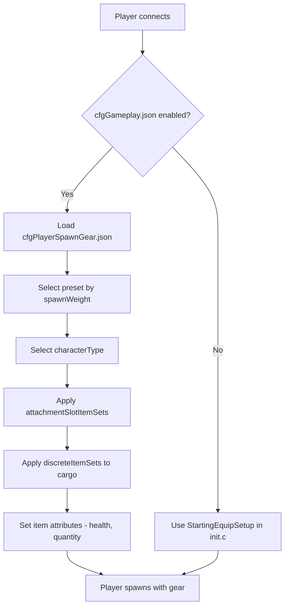

# 第5.6章：出生装备配置

[首页](../../README.md) | [<< 上一章：服务器配置文件](05-server-configs.md) | **出生装备配置**

---

> **摘要：** DayZ 有两个互补的系统控制玩家如何进入世界：**出生点**决定角色在地图上*出现的位置*，**出生装备**决定他们*携带什么装备*。本章深入介绍这两个系统，包括文件结构、字段参考、实用预设和模组集成。

---

## 目录

- [概述](#overview)
- [两个系统](#the-two-systems)
- [出生装备：cfgPlayerSpawnGear.json](#spawn-gear-cfgplayerspawngearjson)
  - [启用出生装备预设](#enabling-spawn-gear-presets)
  - [预设结构](#preset-structure)
  - [attachmentSlotItemSets](#attachmentslotitemsets)
  - [DiscreteItemSets](#discreteitemsets)
  - [discreteUnsortedItemSets](#discreteunsorteditemsets)
  - [ComplexChildrenTypes](#complexchildrentypes)
  - [SimpleChildrenTypes](#simplechildrentypes)
  - [Attributes](#attributes)
- [出生点：cfgplayerspawnpoints.xml](#spawn-points-cfgplayerspawnpointsxml)
  - [文件结构](#file-structure)
  - [spawn_params](#spawn_params)
  - [generator_params](#generator_params)
  - [出生组](#spawning-groups)
  - [地图特定配置](#map-specific-configs)
- [实用示例](#practical-examples)
  - [默认幸存者装备](#default-survivor-loadout)
  - [军事出生套件](#military-spawn-kit)
  - [医疗出生套件](#medical-spawn-kit)
  - [随机装备选择](#random-gear-selection)
- [与模组的集成](#integration-with-mods)
- [最佳实践](#best-practices)
- [常见错误](#common-mistakes)

---

## 概述



当玩家在 DayZ 中作为新角色出生时，服务器回答两个问题：

1. **角色出现在哪里？** --- 由 `cfgplayerspawnpoints.xml` 控制。
2. **角色携带什么？** --- 由通过 `cfggameplay.json` 注册的出生装备预设 JSON 文件控制。

这两个系统都是仅服务器端的。客户端永远看不到这些配置文件，也无法篡改它们。出生装备系统是作为在 `init.c` 中脚本化装备的替代方案而引入的，允许服务器管理员在 JSON 中定义多个加权预设，而无需编写任何 Enforce Script 代码。

> **重要：** 出生装备预设系统**完全覆盖**你任务 `init.c` 中的 `StartingEquipSetup()` 方法。如果你在 `cfggameplay.json` 中启用了出生装备预设，你的脚本化装备代码将被忽略。同样，预设中定义的角色类型会覆盖在主菜单中选择的角色模型。

---

## 两个系统

| 系统 | 文件 | 格式 | 控制 |
|--------|------|--------|----------|
| 出生点 | `cfgplayerspawnpoints.xml` | XML | **在哪里** --- 地图位置、距离评分、出生组 |
| 出生装备 | 自定义预设 JSON 文件 | JSON | **带什么** --- 角色模型、服装、武器、货物、快捷栏 |

这两个系统是独立的。你可以使用自定义出生点配合原版装备、自定义装备配合原版出生点，或两者都自定义。

---

## 出生装备：cfgPlayerSpawnGear.json

### 启用出生装备预设

出生装备预设**默认未启用**。要使用它们，你必须：

1. 在你的任务文件夹（例如 `mpmissions/dayzOffline.chernarusplus/`）中创建一个或多个 JSON 预设文件。
2. 在 `cfggameplay.json` 的 `PlayerData.spawnGearPresetFiles` 中注册它们。
3. 确保在 `serverDZ.cfg` 中设置了 `enableCfgGameplayFile = 1`。

```json
{
  "version": 122,
  "PlayerData": {
    "spawnGearPresetFiles": [
      "survivalist.json",
      "casual.json",
      "military.json"
    ]
  }
}
```

预设文件可以嵌套在任务文件夹下的子目录中：

```json
"spawnGearPresetFiles": [
  "custom/survivalist.json",
  "custom/casual.json",
  "custom/military.json"
]
```

每个 JSON 文件包含一个预设对象。所有注册的预设会被汇集在一起，每次新角色出生时，服务器根据 `spawnWeight` 选择一个。

### 预设结构

预设是顶层 JSON 对象，包含以下字段：

| 字段 | 类型 | 说明 |
|-------|------|-------------|
| `name` | string | 预设的可读名称（任意字符串，仅用于标识） |
| `spawnWeight` | integer | 随机选择的权重。最小值为 `1`。值越高，此预设被选中的可能性越大 |
| `characterTypes` | array | 角色类型类名数组（例如 `"SurvivorM_Mirek"`）。此预设出生时随机选取一个 |
| `attachmentSlotItemSets` | array | `AttachmentSlots` 结构数组，定义角色穿戴什么（服装、肩上的武器等） |
| `discreteUnsortedItemSets` | array | `DiscreteUnsortedItemSets` 结构数组，定义放入任何可用库存空间的货物物品 |

> **注意：** 如果 `characterTypes` 为空或省略，将使用上次在主菜单角色创建屏幕中选择的角色模型。

最小示例：

```json
{
  "spawnWeight": 1,
  "name": "Basic Survivor",
  "characterTypes": [
    "SurvivorM_Mirek",
    "SurvivorF_Eva"
  ],
  "attachmentSlotItemSets": [],
  "discreteUnsortedItemSets": []
}
```

### attachmentSlotItemSets

此数组定义进入特定角色附件槽的物品——身体、腿部、脚部、头部、背部、背心、肩膀、眼镜等。

每个条目针对一个槽位：

| 字段 | 类型 | 说明 |
|-------|------|-------------|
| `slotName` | string | 附件槽名称。派生自 CfgSlots。常见值：`"Body"`、`"Legs"`、`"Feet"`、`"Head"`、`"Back"`、`"Vest"`、`"Eyewear"`、`"Gloves"`、`"Hips"`、`"shoulderL"`、`"shoulderR"` |
| `discreteItemSets` | array | 可以填充此槽的物品变体数组（根据 `spawnWeight` 选择一个） |

> **肩部快捷方式：** 你可以使用 `"shoulderL"` 和 `"shoulderR"` 作为槽位名称。引擎自动将它们转换为正确的内部 CfgSlots 名称。

```json
{
  "slotName": "Body",
  "discreteItemSets": [
    {
      "itemType": "TShirt_Beige",
      "spawnWeight": 1,
      "attributes": {
        "healthMin": 0.45,
        "healthMax": 0.65,
        "quantityMin": 1.0,
        "quantityMax": 1.0
      },
      "quickBarSlot": -1
    },
    {
      "itemType": "TShirt_Black",
      "spawnWeight": 1,
      "attributes": {
        "healthMin": 0.45,
        "healthMax": 0.65,
        "quantityMin": 1.0,
        "quantityMax": 1.0
      },
      "quickBarSlot": -1
    }
  ]
}
```

### DiscreteItemSets

`discreteItemSets` 中的每个条目代表该槽位的一个可能物品。服务器按 `spawnWeight` 加权随机选择一个条目。此结构在 `attachmentSlotItemSets`（用于基于槽位的物品）中使用，是随机选择的机制。

| 字段 | 类型 | 说明 |
|-------|------|-------------|
| `itemType` | string | 物品类名（typename）。使用 `""`（空字符串）表示"无"——槽位保持为空 |
| `spawnWeight` | integer | 选择权重。最小值 `1`。越高 = 越可能 |
| `attributes` | object | 此物品的耐久度和数量范围。参见 [Attributes](#attributes) |
| `quickBarSlot` | integer | 快捷栏槽位分配（从 0 开始）。使用 `-1` 表示不分配快捷栏 |
| `complexChildrenTypes` | array | 嵌套在此物品内部生成的物品。参见 [ComplexChildrenTypes](#complexchildrentypes) |
| `simpleChildrenTypes` | array | 使用默认或父级属性在此物品内部生成的物品类名 |
| `simpleChildrenUseDefaultAttributes` | bool | 如果为 `true`，简单子项使用父级的 `attributes`。如果为 `false`，使用配置默认值 |

**空物品技巧：** 要让一个槽位有 50/50 的几率为空或被填充，使用空的 `itemType`：

```json
{
  "slotName": "Eyewear",
  "discreteItemSets": [
    {
      "itemType": "AviatorGlasses",
      "spawnWeight": 1,
      "attributes": {
        "healthMin": 1.0,
        "healthMax": 1.0
      },
      "quickBarSlot": -1
    },
    {
      "itemType": "",
      "spawnWeight": 1
    }
  ]
}
```

### discreteUnsortedItemSets

此顶层数组定义进入角色**货物**的物品——所有已附着服装和容器中的任何可用库存空间。与 `attachmentSlotItemSets` 不同，这些物品不放入特定槽位；引擎自动寻找空间。

每个条目代表一个货物变体，服务器根据 `spawnWeight` 选择一个。

| 字段 | 类型 | 说明 |
|-------|------|-------------|
| `name` | string | 可读名称（仅用于标识） |
| `spawnWeight` | integer | 选择权重。最小值 `1` |
| `attributes` | object | 默认耐久度/数量范围。当 `simpleChildrenUseDefaultAttributes` 为 `true` 时供子项使用 |
| `complexChildrenTypes` | array | 生成到货物中的物品，每个都有自己的属性和嵌套 |
| `simpleChildrenTypes` | array | 生成到货物中的物品类名 |
| `simpleChildrenUseDefaultAttributes` | bool | 如果为 `true`，简单子项使用此结构的 `attributes`。如果为 `false`，使用配置默认值 |

```json
{
  "name": "Cargo1",
  "spawnWeight": 1,
  "attributes": {
    "healthMin": 1.0,
    "healthMax": 1.0,
    "quantityMin": 1.0,
    "quantityMax": 1.0
  },
  "complexChildrenTypes": [
    {
      "itemType": "BandageDressing",
      "attributes": {
        "healthMin": 1.0,
        "healthMax": 1.0,
        "quantityMin": 1.0,
        "quantityMax": 1.0
      },
      "quickBarSlot": 2
    }
  ],
  "simpleChildrenUseDefaultAttributes": false,
  "simpleChildrenTypes": [
    "Rag",
    "Apple"
  ]
}
```

### ComplexChildrenTypes

复杂子项是在父物品**内部**生成的物品，可以完全控制其属性、快捷栏分配和自己的嵌套子项。主要用例是生成带内容物的物品——例如，带有配件的武器，或装有食物的烹饪锅。

| 字段 | 类型 | 说明 |
|-------|------|-------------|
| `itemType` | string | 物品类名 |
| `attributes` | object | 此特定物品的耐久度/数量范围 |
| `quickBarSlot` | integer | 快捷栏槽位分配。`-1` = 不分配 |
| `simpleChildrenUseDefaultAttributes` | bool | 简单子项是否继承这些属性 |
| `simpleChildrenTypes` | array | 在此物品内部生成的物品类名 |

示例——带配件和弹匣的武器：

```json
{
  "itemType": "AKM",
  "attributes": {
    "healthMin": 0.5,
    "healthMax": 1.0,
    "quantityMin": 1.0,
    "quantityMax": 1.0
  },
  "quickBarSlot": 1,
  "complexChildrenTypes": [
    {
      "itemType": "AK_PlasticBttstck",
      "attributes": {
        "healthMin": 0.4,
        "healthMax": 0.6
      },
      "quickBarSlot": -1
    },
    {
      "itemType": "PSO1Optic",
      "attributes": {
        "healthMin": 0.1,
        "healthMax": 0.2
      },
      "quickBarSlot": -1,
      "simpleChildrenUseDefaultAttributes": true,
      "simpleChildrenTypes": [
        "Battery9V"
      ]
    },
    {
      "itemType": "Mag_AKM_30Rnd",
      "attributes": {
        "healthMin": 0.5,
        "healthMax": 0.5,
        "quantityMin": 1.0,
        "quantityMax": 1.0
      },
      "quickBarSlot": -1
    }
  ],
  "simpleChildrenUseDefaultAttributes": false,
  "simpleChildrenTypes": [
    "AK_PlasticHndgrd",
    "AK_Bayonet"
  ]
}
```

在此示例中，AKM 生成时带有枪托、瞄准镜（内含电池）和装满的弹匣作为复杂子项，加上护木和刺刀作为简单子项。简单子项使用配置默认值，因为 `simpleChildrenUseDefaultAttributes` 是 `false`。

### SimpleChildrenTypes

简单子项是在不指定单独属性的情况下在父物品内部生成物品的简写方式。它们是物品类名（字符串）的数组。

它们的属性由 `simpleChildrenUseDefaultAttributes` 标志决定：

- **`true`** --- 物品使用父结构上定义的 `attributes`。
- **`false`** --- 物品使用引擎的配置默认值（通常为满耐久度和数量）。

简单子项不能有自己的嵌套子项或快捷栏分配。对于这些功能，请使用 `complexChildrenTypes`。

### Attributes

属性控制生成物品的状态和数量。所有值都是 `0.0` 到 `1.0` 之间的浮点数：

| 字段 | 类型 | 说明 |
|-------|------|-------------|
| `healthMin` | float | 最低耐久度百分比。`1.0` = 崭新，`0.0` = 损坏 |
| `healthMax` | float | 最高耐久度百分比。在最小值和最大值之间随机取值 |
| `quantityMin` | float | 最低数量百分比。对于弹匣：填充量。对于食物：剩余口数 |
| `quantityMax` | float | 最高数量百分比 |

当同时指定最小值和最大值时，引擎在该范围内随机选取一个值。这创造了自然的变化——例如，耐久度在 `0.45` 和 `0.65` 之间意味着物品以磨损到损坏的状态出生。

```json
"attributes": {
  "healthMin": 0.45,
  "healthMax": 0.65,
  "quantityMin": 1.0,
  "quantityMax": 1.0
}
```

---

## 出生点：cfgplayerspawnpoints.xml

此 XML 文件定义玩家在地图上出现的位置。它位于任务文件夹中（例如 `mpmissions/dayzOffline.chernarusplus/cfgplayerspawnpoints.xml`）。

### 文件结构

根元素最多包含三个部分：

| 部分 | 用途 |
|---------|---------|
| `<fresh>` | **必需。** 新创建角色的出生点 |
| `<hop>` | 从同一地图的另一个服务器跳转的玩家的出生点（仅官方服务器） |
| `<travel>` | 从不同地图旅行的玩家的出生点（仅官方服务器） |

每个部分包含相同的三个子元素：`<spawn_params>`、`<generator_params>` 和 `<generator_posbubbles>`。

```xml
<?xml version="1.0" encoding="UTF-8" standalone="yes" ?>
<playerspawnpoints>
    <fresh>
        <spawn_params>...</spawn_params>
        <generator_params>...</generator_params>
        <generator_posbubbles>...</generator_posbubbles>
    </fresh>
    <hop>
        <spawn_params>...</spawn_params>
        <generator_params>...</generator_params>
        <generator_posbubbles>...</generator_posbubbles>
    </hop>
    <travel>
        <spawn_params>...</spawn_params>
        <generator_params>...</generator_params>
        <generator_posbubbles>...</generator_posbubbles>
    </travel>
</playerspawnpoints>
```

### spawn_params

运行时参数，根据附近实体对候选出生点进行评分。低于 `min_dist` 的点被无效化。`min_dist` 和 `max_dist` 之间的点优于超过 `max_dist` 的点。

```xml
<spawn_params>
    <min_dist_infected>30</min_dist_infected>
    <max_dist_infected>70</max_dist_infected>
    <min_dist_player>65</min_dist_player>
    <max_dist_player>150</max_dist_player>
    <min_dist_static>0</min_dist_static>
    <max_dist_static>2</max_dist_static>
</spawn_params>
```

| 参数 | 说明 |
|-----------|-------------|
| `min_dist_infected` | 距感染者最小米数。比此更近的点被惩罚 |
| `max_dist_infected` | 距感染者的最大评分距离 |
| `min_dist_player` | 距其他玩家最小米数。防止新出生的角色出现在现有玩家身上 |
| `max_dist_player` | 距其他玩家的最大评分距离 |
| `min_dist_static` | 距建筑/物体最小米数 |
| `max_dist_static` | 距建筑/物体的最大评分距离 |

Sakhal 地图还添加了 `min_dist_trigger` 和 `max_dist_trigger` 参数，对触发区域距离使用 6 倍权重乘数。

**评分逻辑：** 引擎计算每个候选点的分数。距离 `0` 到 `min_dist` 评分 `-1`（几乎无效化）。距离 `min_dist` 到中点评分最高至 `1.1`。距离中点到 `max_dist` 评分从 `1.1` 降至 `0.1`。超过 `max_dist` 评分 `0`。总分越高 = 越可能的出生位置。

### generator_params

控制如何在每个位置气泡周围生成候选出生点网格：

```xml
<generator_params>
    <grid_density>4</grid_density>
    <grid_width>200</grid_width>
    <grid_height>200</grid_height>
    <min_dist_static>0</min_dist_static>
    <max_dist_static>2</max_dist_static>
    <min_steepness>-45</min_steepness>
    <max_steepness>45</max_steepness>
</generator_params>
```

| 参数 | 说明 |
|-----------|-------------|
| `grid_density` | 采样频率。`4` 表示 4x4 的候选点网格。越高 = 越多候选点，越多 CPU 开销。必须至少为 `1`。当为 `0` 时，仅使用中心点 |
| `grid_width` | 采样矩形的总宽度（米） |
| `grid_height` | 采样矩形的总高度（米） |
| `min_dist_static` | 有效候选点距建筑的最小距离 |
| `max_dist_static` | 用于评分的距建筑的最大距离 |
| `min_steepness` | 最小地形坡度（度）。更陡地形上的点被丢弃 |
| `max_steepness` | 最大地形坡度（度） |

在 `generator_posbubbles` 中定义的每个 `<pos>` 周围，引擎创建一个 `grid_width` x `grid_height` 米的矩形，以 `grid_density` 频率采样，并丢弃与物体、水体重叠或超过坡度限制的点。

### 出生组

组允许你聚集出生点并随时间轮换。这防止所有玩家总是在相同位置出生。

组通过每个部分内的 `<group_params>` 启用：

```xml
<group_params>
    <enablegroups>true</enablegroups>
    <groups_as_regular>true</groups_as_regular>
    <lifetime>240</lifetime>
    <counter>-1</counter>
</group_params>
```

| 参数 | 说明 |
|-----------|-------------|
| `enablegroups` | `true` 启用组轮换，`false` 使用扁平的点列表 |
| `groups_as_regular` | 当 `enablegroups` 为 `false` 时，将组点作为常规出生点处理而非忽略它们。默认：`true` |
| `lifetime` | 一个组在轮换到另一个之前保持活动的秒数。使用 `-1` 禁用计时器 |
| `counter` | 重置生存时间的出生次数。每个在组中出生的玩家重置计时器。使用 `-1` 禁用计数器 |

位置被组织在 `<generator_posbubbles>` 内的命名组中：

```xml
<generator_posbubbles>
    <group name="WestCherno">
        <pos x="6063.018555" z="1931.907227" />
        <pos x="5933.964844" z="2171.072998" />
        <pos x="6199.782715" z="2241.805176" />
    </group>
    <group name="EastCherno">
        <pos x="8040.858398" z="3332.236328" />
        <pos x="8207.115234" z="3115.650635" />
    </group>
</generator_posbubbles>
```

单个组可以覆盖全局的 lifetime 和 counter 值：

```xml
<group name="Tents" lifetime="300" counter="25">
    <pos x="4212.421875" z="11038.256836" />
</group>
```

**不使用组时**，位置直接列在 `<generator_posbubbles>` 下：

```xml
<generator_posbubbles>
    <pos x="4212.421875" z="11038.256836" />
    <pos x="4712.299805" z="10595" />
    <pos x="5334.310059" z="9850.320313" />
</generator_posbubbles>
```

> **位置格式：** `x` 和 `z` 属性使用 DayZ 世界坐标。`x` 是东西方向，`z` 是南北方向。`y`（高度）坐标未指定——引擎将点放置在地形表面上。你可以使用游戏内调试监视器或 DayZ Editor 模组查找坐标。

### 地图特定配置

每个地图在其任务文件夹中都有自己的 `cfgplayerspawnpoints.xml`：

| 地图 | 任务文件夹 | 备注 |
|-----|----------------|-------|
| Chernarus | `dayzOffline.chernarusplus/` | 海岸出生点：Cherno、Elektro、Kamyshovo、Berezino、Svetlojarsk |
| Livonia | `dayzOffline.enoch/` | 分布在地图各处，使用不同的组名 |
| Sakhal | `dayzOffline.sakhal/` | 添加了 `min_dist_trigger`/`max_dist_trigger` 参数，更详细的注释 |

创建自定义地图或修改出生位置时，始终从原版文件开始并调整位置以匹配你地图的地理。

---

## 实用示例

### 默认幸存者装备

原版预设给新出生角色一件随机 T 恤、帆布裤、运动鞋，加上包含绷带、荧光棒（随机颜色）和水果（随机梨、李子或苹果）的货物。所有物品以磨损到损坏的状态出生。

```json
{
  "spawnWeight": 1,
  "name": "Player",
  "characterTypes": [
    "SurvivorM_Mirek",
    "SurvivorM_Boris",
    "SurvivorM_Denis",
    "SurvivorF_Eva",
    "SurvivorF_Frida",
    "SurvivorF_Gabi"
  ],
  "attachmentSlotItemSets": [
    {
      "slotName": "Body",
      "discreteItemSets": [
        {
          "itemType": "TShirt_Beige",
          "spawnWeight": 1,
          "attributes": {
            "healthMin": 0.45,
            "healthMax": 0.65,
            "quantityMin": 1.0,
            "quantityMax": 1.0
          },
          "quickBarSlot": -1
        },
        {
          "itemType": "TShirt_Black",
          "spawnWeight": 1,
          "attributes": {
            "healthMin": 0.45,
            "healthMax": 0.65,
            "quantityMin": 1.0,
            "quantityMax": 1.0
          },
          "quickBarSlot": -1
        }
      ]
    },
    {
      "slotName": "Legs",
      "discreteItemSets": [
        {
          "itemType": "CanvasPantsMidi_Beige",
          "spawnWeight": 1,
          "attributes": {
            "healthMin": 0.45,
            "healthMax": 0.65,
            "quantityMin": 1.0,
            "quantityMax": 1.0
          },
          "quickBarSlot": -1
        }
      ]
    },
    {
      "slotName": "Feet",
      "discreteItemSets": [
        {
          "itemType": "AthleticShoes_Black",
          "spawnWeight": 1,
          "attributes": {
            "healthMin": 0.45,
            "healthMax": 0.65,
            "quantityMin": 1.0,
            "quantityMax": 1.0
          },
          "quickBarSlot": -1
        }
      ]
    }
  ],
  "discreteUnsortedItemSets": [
    {
      "name": "Cargo1",
      "spawnWeight": 1,
      "attributes": {
        "healthMin": 1.0,
        "healthMax": 1.0,
        "quantityMin": 1.0,
        "quantityMax": 1.0
      },
      "complexChildrenTypes": [
        {
          "itemType": "BandageDressing",
          "attributes": {
            "healthMin": 1.0,
            "healthMax": 1.0,
            "quantityMin": 1.0,
            "quantityMax": 1.0
          },
          "quickBarSlot": 2
        },
        {
          "itemType": "Chemlight_Red",
          "attributes": {
            "healthMin": 1.0,
            "healthMax": 1.0,
            "quantityMin": 1.0,
            "quantityMax": 1.0
          },
          "quickBarSlot": 1
        },
        {
          "itemType": "Pear",
          "attributes": {
            "healthMin": 1.0,
            "healthMax": 1.0,
            "quantityMin": 1.0,
            "quantityMax": 1.0
          },
          "quickBarSlot": 3
        }
      ]
    }
  ]
}
```

### 军事出生套件

一个装备齐全的预设，带有 AKM（含配件）、板甲背心、Gorka 制服、装有额外弹匣的背包，以及包含副武器和食物的未分类货物。这使用多个 `spawnWeight` 值来创建武器变体的稀有度层级。

```json
{
  "spawnWeight": 1,
  "name": "Military - AKM",
  "characterTypes": [
    "SurvivorF_Judy",
    "SurvivorM_Lewis"
  ],
  "attachmentSlotItemSets": [
    {
      "slotName": "shoulderL",
      "discreteItemSets": [
        {
          "itemType": "AKM",
          "spawnWeight": 3,
          "attributes": {
            "healthMin": 0.5,
            "healthMax": 1.0,
            "quantityMin": 1.0,
            "quantityMax": 1.0
          },
          "quickBarSlot": 1,
          "complexChildrenTypes": [
            {
              "itemType": "AK_PlasticBttstck",
              "attributes": { "healthMin": 0.4, "healthMax": 0.6 },
              "quickBarSlot": -1
            },
            {
              "itemType": "PSO1Optic",
              "attributes": { "healthMin": 0.1, "healthMax": 0.2 },
              "quickBarSlot": -1,
              "simpleChildrenUseDefaultAttributes": true,
              "simpleChildrenTypes": ["Battery9V"]
            },
            {
              "itemType": "Mag_AKM_30Rnd",
              "attributes": {
                "healthMin": 0.5,
                "healthMax": 0.5,
                "quantityMin": 1.0,
                "quantityMax": 1.0
              },
              "quickBarSlot": -1
            }
          ],
          "simpleChildrenUseDefaultAttributes": false,
          "simpleChildrenTypes": ["AK_PlasticHndgrd", "AK_Bayonet"]
        },
        {
          "itemType": "AKM",
          "spawnWeight": 1,
          "attributes": {
            "healthMin": 1.0,
            "healthMax": 1.0,
            "quantityMin": 1.0,
            "quantityMax": 1.0
          },
          "quickBarSlot": 1,
          "complexChildrenTypes": [
            {
              "itemType": "AK_WoodBttstck",
              "attributes": { "healthMin": 1.0, "healthMax": 1.0 },
              "quickBarSlot": -1
            },
            {
              "itemType": "Mag_AKM_30Rnd",
              "attributes": {
                "healthMin": 1.0,
                "healthMax": 1.0,
                "quantityMin": 1.0,
                "quantityMax": 1.0
              },
              "quickBarSlot": -1
            }
          ],
          "simpleChildrenUseDefaultAttributes": false,
          "simpleChildrenTypes": ["AK_WoodHndgrd"]
        }
      ]
    },
    {
      "slotName": "Vest",
      "discreteItemSets": [
        {
          "itemType": "PlateCarrierVest",
          "spawnWeight": 1,
          "attributes": { "healthMin": 1.0, "healthMax": 1.0 },
          "quickBarSlot": -1,
          "simpleChildrenUseDefaultAttributes": false,
          "simpleChildrenTypes": ["PlateCarrierHolster"]
        }
      ]
    },
    {
      "slotName": "Back",
      "discreteItemSets": [
        {
          "itemType": "TaloonBag_Blue",
          "spawnWeight": 1,
          "attributes": { "healthMin": 0.5, "healthMax": 0.8 },
          "quickBarSlot": 3,
          "simpleChildrenUseDefaultAttributes": false,
          "simpleChildrenTypes": ["Mag_AKM_Drum75Rnd"]
        },
        {
          "itemType": "TaloonBag_Orange",
          "spawnWeight": 1,
          "attributes": { "healthMin": 0.5, "healthMax": 0.8 },
          "quickBarSlot": 3,
          "simpleChildrenUseDefaultAttributes": true,
          "simpleChildrenTypes": ["Mag_AKM_30Rnd", "Mag_AKM_30Rnd"]
        }
      ]
    },
    {
      "slotName": "Body",
      "discreteItemSets": [
        {
          "itemType": "GorkaEJacket_Flat",
          "spawnWeight": 1,
          "attributes": { "healthMin": 1.0, "healthMax": 1.0 },
          "quickBarSlot": -1
        }
      ]
    },
    {
      "slotName": "Legs",
      "discreteItemSets": [
        {
          "itemType": "GorkaPants_Flat",
          "spawnWeight": 1,
          "attributes": { "healthMin": 1.0, "healthMax": 1.0 },
          "quickBarSlot": -1
        }
      ]
    },
    {
      "slotName": "Feet",
      "discreteItemSets": [
        {
          "itemType": "MilitaryBoots_Bluerock",
          "spawnWeight": 1,
          "attributes": { "healthMin": 1.0, "healthMax": 1.0 },
          "quickBarSlot": -1
        }
      ]
    }
  ],
  "discreteUnsortedItemSets": [
    {
      "name": "Military Cargo",
      "spawnWeight": 1,
      "attributes": {
        "healthMin": 0.5,
        "healthMax": 1.0,
        "quantityMin": 0.6,
        "quantityMax": 0.8
      },
      "complexChildrenTypes": [
        {
          "itemType": "Mag_AKM_30Rnd",
          "attributes": {
            "healthMin": 0.1,
            "healthMax": 0.8,
            "quantityMin": 1.0,
            "quantityMax": 1.0
          },
          "quickBarSlot": -1
        }
      ],
      "simpleChildrenUseDefaultAttributes": false,
      "simpleChildrenTypes": [
        "Rag",
        "BoarSteakMeat",
        "FNX45",
        "Mag_FNX45_15Rnd",
        "AmmoBox_45ACP_25rnd"
      ]
    }
  ]
}
```

此示例的要点：

- **同一肩部槽位有两个武器变体**：`spawnWeight: 3` 的变体（塑料护木，PSO1 瞄准镜）出现频率是 `spawnWeight: 1` 变体（木质护木，无瞄准镜）的 3 倍。
- **嵌套子项**：PSO1Optic 有 `simpleChildrenTypes: ["Battery9V"]`，所以瞄准镜生成时内含电池。
- **背包内容**：蓝色背包获得弹鼓，橙色的获得两个标准弹匣。

### 医疗出生套件

医疗主题预设，包含手术服、装有医疗用品的急救包和一把近战武器用于防卫。

```json
{
  "spawnWeight": 1,
  "name": "Medic",
  "attachmentSlotItemSets": [
    {
      "slotName": "shoulderR",
      "discreteItemSets": [
        {
          "itemType": "PipeWrench",
          "spawnWeight": 2,
          "attributes": { "healthMin": 0.5, "healthMax": 0.8 },
          "quickBarSlot": 2
        },
        {
          "itemType": "Crowbar",
          "spawnWeight": 1,
          "attributes": { "healthMin": 0.5, "healthMax": 0.8 },
          "quickBarSlot": 2
        }
      ]
    },
    {
      "slotName": "Vest",
      "discreteItemSets": [
        {
          "itemType": "PressVest_LightBlue",
          "spawnWeight": 1,
          "attributes": { "healthMin": 1.0, "healthMax": 1.0 },
          "quickBarSlot": -1
        }
      ]
    },
    {
      "slotName": "Back",
      "discreteItemSets": [
        {
          "itemType": "TortillaBag",
          "spawnWeight": 1,
          "attributes": { "healthMin": 0.5, "healthMax": 0.8 },
          "quickBarSlot": 1
        },
        {
          "itemType": "CoyoteBag_Green",
          "spawnWeight": 1,
          "attributes": { "healthMin": 0.5, "healthMax": 0.8 },
          "quickBarSlot": 1
        }
      ]
    },
    {
      "slotName": "Body",
      "discreteItemSets": [
        {
          "itemType": "MedicalScrubsShirt_Blue",
          "spawnWeight": 1,
          "attributes": { "healthMin": 1.0, "healthMax": 1.0 },
          "quickBarSlot": -1
        }
      ]
    },
    {
      "slotName": "Legs",
      "discreteItemSets": [
        {
          "itemType": "MedicalScrubsPants_Blue",
          "spawnWeight": 1,
          "attributes": { "healthMin": 1.0, "healthMax": 1.0 },
          "quickBarSlot": -1
        }
      ]
    },
    {
      "slotName": "Feet",
      "discreteItemSets": [
        {
          "itemType": "WorkingBoots_Yellow",
          "spawnWeight": 1,
          "attributes": { "healthMin": 1.0, "healthMax": 1.0 },
          "quickBarSlot": -1
        }
      ]
    }
  ],
  "discreteUnsortedItemSets": [
    {
      "name": "Medic Cargo 1",
      "spawnWeight": 1,
      "attributes": {
        "healthMin": 0.5,
        "healthMax": 1.0,
        "quantityMin": 0.6,
        "quantityMax": 0.8
      },
      "complexChildrenTypes": [
        {
          "itemType": "FirstAidKit",
          "attributes": {
            "healthMin": 0.7,
            "healthMax": 0.8,
            "quantityMin": 0.05,
            "quantityMax": 0.1
          },
          "quickBarSlot": 3,
          "simpleChildrenUseDefaultAttributes": false,
          "simpleChildrenTypes": ["BloodBagIV", "BandageDressing"]
        }
      ],
      "simpleChildrenUseDefaultAttributes": false,
      "simpleChildrenTypes": ["Rag", "SheepSteakMeat"]
    },
    {
      "name": "Medic Cargo 2",
      "spawnWeight": 1,
      "attributes": {
        "healthMin": 0.5,
        "healthMax": 1.0,
        "quantityMin": 0.6,
        "quantityMax": 0.8
      },
      "complexChildrenTypes": [
        {
          "itemType": "FirstAidKit",
          "attributes": {
            "healthMin": 0.7,
            "healthMax": 0.8,
            "quantityMin": 0.05,
            "quantityMax": 0.1
          },
          "quickBarSlot": 3,
          "simpleChildrenUseDefaultAttributes": false,
          "simpleChildrenTypes": ["TetracyclineAntibiotics", "BandageDressing"]
        }
      ],
      "simpleChildrenUseDefaultAttributes": false,
      "simpleChildrenTypes": ["Canteen", "Rag", "Apple"]
    }
  ]
}
```

注意 `characterTypes` 被省略了——此预设使用玩家在主菜单中选择的任何角色。两个货物变体提供不同的急救包内容（血袋 vs. 抗生素），通过 `spawnWeight` 选择。

### 随机装备选择

你可以通过使用不同权重的多个预设，以及在每个预设中每个槽位使用多个 `discreteItemSets` 来创建随机化装备：

**文件：`cfggameplay.json`**

```json
"spawnGearPresetFiles": [
  "presets/common_survivor.json",
  "presets/rare_military.json",
  "presets/uncommon_hunter.json"
]
```

**概率计算示例：**

| 预设文件 | spawnWeight | 概率 |
|-------------|------------|--------|
| `common_survivor.json` | 5 | 5/8 = 62.5% |
| `uncommon_hunter.json` | 2 | 2/8 = 25.0% |
| `rare_military.json` | 1 | 1/8 = 12.5% |

在每个预设中，每个槽位也有自己的随机化。如果 Body 槽位有三个 T 恤选项，每个 `spawnWeight: 1`，则每个有 33% 的几率。一件 `spawnWeight: 3` 的衬衫在有两个 `spawnWeight: 1` 物品的池中有 60%（3/5）的几率。

---

## 与模组的集成

### 从模组使用 JSON 预设系统

出生装备预设系统设计用于任务级别的配置。想要提供自定义装备的模组应该：

1. **随模组文档提供模板 JSON** 文件，不嵌入 PBO 中。
2. **记录类名** 以便服务器管理员可以将模组物品添加到他们自己的预设文件中。
3. 让服务器管理员通过他们的 `cfggameplay.json` 注册预设文件。

### 使用 init.c 覆盖

如果你需要对出生进行程序化控制（例如角色选择、数据库驱动的装备或基于玩家状态的条件装备），请在 `init.c` 中覆盖 `StartingEquipSetup()`：

```c
override void StartingEquipSetup(PlayerBase player, bool clothesChosen)
{
    player.RemoveAllItems();

    EntityAI jacket = player.GetInventory().CreateInInventory("GorkaEJacket_Flat");
    player.GetInventory().CreateInInventory("GorkaPants_Flat");
    player.GetInventory().CreateInInventory("MilitaryBoots_Bluerock");

    if (jacket)
    {
        jacket.GetInventory().CreateInInventory("BandageDressing");
        jacket.GetInventory().CreateInInventory("Rag");
    }

    EntityAI weapon = player.GetHumanInventory().CreateInHands("AKM");
    if (weapon)
    {
        weapon.GetInventory().CreateInInventory("Mag_AKM_30Rnd");
        weapon.GetInventory().CreateInInventory("AK_PlasticBttstck");
        weapon.GetInventory().CreateInInventory("AK_PlasticHndgrd");
    }
}
```

> **记住：** 如果在 `cfggameplay.json` 中配置了 `spawnGearPresetFiles`，JSON 预设优先，`StartingEquipSetup()` 将不会被调用。

### 预设中的模组物品

模组物品在预设文件中与原版物品的工作方式完全相同。使用模组 `config.cpp` 中定义的物品类名：

```json
{
  "itemType": "MyMod_CustomRifle",
  "spawnWeight": 1,
  "attributes": {
    "healthMin": 1.0,
    "healthMax": 1.0
  },
  "quickBarSlot": 1,
  "simpleChildrenUseDefaultAttributes": false,
  "simpleChildrenTypes": [
    "MyMod_CustomMag_30Rnd",
    "MyMod_CustomOptic"
  ]
}
```

如果模组未在服务器上加载，具有未知类名的物品将静默失败。预设的其余部分仍然适用。

---

## 最佳实践

1. **从原版开始。** 从官方文档复制原版预设作为基础并修改它，而不是从头编写。

2. **使用多个预设文件。** 按主题（幸存者、军事、医疗）将预设分开到单独的 JSON 文件中。这比单个庞大的文件更易于维护。

3. **逐步测试。** 一次添加一个预设并在游戏中验证。任何预设文件中的 JSON 语法错误都会导致所有预设静默失败。

4. **有意识地使用加权概率。** 在纸上规划你的出生权重分配。有 5 个预设时，其中一个 `spawnWeight: 10` 将压倒所有其他预设。

5. **验证 JSON 语法。** 部署前使用 JSON 验证器。DayZ 引擎不会为格式错误的 JSON 提供有用的错误消息——它只是忽略该文件。

6. **有意识地分配快捷栏槽位。** 快捷栏槽位从 0 开始索引。将多个物品分配到同一槽位会覆盖。对不应在快捷栏上的物品使用 `-1`。

7. **保持出生点远离水域。** 生成器会丢弃水中的点，但非常接近海岸线的点可能将玩家放在尴尬的位置。将位置气泡向内陆移动几米。

8. **在海岸地图上使用组。** Chernarus 上的出生组将新出生的角色分散在海岸各处，防止在 Elektro 等热门位置过度拥挤。

9. **匹配服装和货物容量。** 未分类的货物物品只有在玩家有库存空间时才能出生。如果你定义了太多货物物品但只给玩家一件 T 恤（小库存），多余的物品将不会出生。

---

## 常见错误

| 错误 | 后果 | 修复方法 |
|---------|-------------|-----|
| 忘记在 `serverDZ.cfg` 中设置 `enableCfgGameplayFile = 1` | `cfggameplay.json` 未加载，预设被忽略 | 添加该标志并重启服务器 |
| 无效的 JSON 语法（尾随逗号、缺少括号） | 该文件中的所有预设静默失败 | 部署前使用外部工具验证 JSON |
| 使用 `spawnGearPresetFiles` 而未删除 `StartingEquipSetup()` 代码 | 脚本化装备被 JSON 预设静默覆盖。init.c 代码运行但其物品被替换 | 这是预期行为，不是 bug。删除或注释掉 init.c 装备代码以避免混淆 |
| 设置 `spawnWeight: 0` | 低于最小值。行为未定义 | 始终使用 `spawnWeight: 1` 或更高 |
| 引用不存在的类名 | 该特定物品静默失败，但预设的其余部分正常工作 | 对照模组的 `config.cpp` 或 types.xml 仔细检查类名 |
| 将物品分配到它不能占用的槽位 | 物品不出生。没有错误日志 | 验证物品 config.cpp 中的 `inventorySlot[]` 是否与 `slotName` 匹配 |
| 货物物品超出可用库存空间 | 多余的物品被静默丢弃（不出生） | 确保服装有足够的容量，或减少货物物品数量 |
| 使用不存在的 `characterTypes` 类名 | 角色创建失败，玩家可能以默认模型出生 | 仅使用 CfgVehicles 中的有效幸存者类名 |
| 将出生点放在水中或陡峭悬崖上 | 点被丢弃，减少可用出生点。如果太多无效，玩家可能无法出生 | 使用游戏内调试监视器测试坐标 |
| 混淆出生点中的 `x`/`z` 坐标 | 玩家出生在错误的地图位置 | `x` = 东西方向，`z` = 南北方向。出生点定义中没有 `y`（垂直） |

---

## 数据流摘要

```
serverDZ.cfg
  └─ enableCfgGameplayFile = 1
       └─ cfggameplay.json
            └─ PlayerData.spawnGearPresetFiles: ["preset1.json", "preset2.json"]
                 ├─ preset1.json  (spawnWeight: 3)  ── 75% 概率
                 └─ preset2.json  (spawnWeight: 1)  ── 25% 概率
                      ├─ characterTypes[]         → 随机角色模型
                      ├─ attachmentSlotItemSets[] → 基于槽位的装备
                      │    └─ discreteItemSets[]  → 每槽位加权随机
                      │         ├─ complexChildrenTypes[] → 带属性的嵌套物品
                      │         └─ simpleChildrenTypes[]  → 简单嵌套物品
                      └─ discreteUnsortedItemSets[] → 货物物品
                           ├─ complexChildrenTypes[]
                           └─ simpleChildrenTypes[]

cfgplayerspawnpoints.xml
  ├─ <fresh>   → 新角色（必需）
  ├─ <hop>     → 服务器跳转者（仅官方）
  └─ <travel>  → 地图旅行者（仅官方）
       ├─ spawn_params   → 距感染者/玩家/建筑的评分
       ├─ generator_params → 网格密度、大小、坡度限制
       └─ generator_posbubbles → 位置（可选在命名组中）
```

---

[首页](../../README.md) | [<< 上一章：服务器配置文件](05-server-configs.md) | **出生装备配置**
