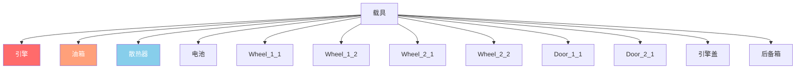

# 第 6.2 章：载具系统

[首页](../../README.md) | [<< 上一章：实体系统](01-entity-system.md) | **载具** | [下一章：天气 >>](03-weather.md)

---

## 简介

DayZ 载具是扩展交通系统的实体。汽车继承自 `CarScript`，船只继承自 `BoatScript`，两者都继承自 `Transport`。载具拥有流体系统、独立生命值的部件、变速箱模拟和引擎管理的物理系统。本章介绍在脚本中与载具交互所需的 API 方法。

---

## 类层级

```
EntityAI
└── Transport                    // 3_Game - 所有载具的基类
    ├── Car                      // 3_Game - 引擎原生汽车物理
    │   └── CarScript            // 4_World - 可脚本化的汽车基类
    │       ├── CivilianSedan
    │       ├── OffroadHatchback
    │       ├── Hatchback_02
    │       ├── Sedan_02
    │       ├── Truck_01_Base
    │       └── ...
    └── Boat                     // 3_Game - 引擎原生船只物理
        └── BoatScript           // 4_World - 可脚本化的船只基类
```

---

## Transport（基类）

**文件：** `3_Game/entities/transport.c`

所有载具的抽象基类。提供座位管理和乘员访问。

### 乘员管理

```c
proto native int   CrewSize();                          // 总座位数
proto native int   CrewMemberIndex(Human crew_member);  // 获取人员的座位索引
proto native Human CrewMember(int posIdx);              // 获取座位索引上的人员
proto native void  CrewGetOut(int posIdx);              // 强制乘员下车
proto native void  CrewDeath(int posIdx);               // 击杀座位上的乘员
```

### 乘员进入

```c
proto native int  GetAnimInstance();
proto native int  CrewPositionIndex(int componentIdx);  // 组件到座位索引
proto native vector CrewEntryPoint(int posIdx);         // 座位的世界进入点
```

**示例 --- 弹出所有乘客：**

```c
void EjectAllCrew(Transport vehicle)
{
    for (int i = 0; i < vehicle.CrewSize(); i++)
    {
        Human crew = vehicle.CrewMember(i);
        if (crew)
        {
            vehicle.CrewGetOut(i);
        }
    }
}
```

---

## Car（引擎原生）

**文件：** `3_Game/entities/car.c`

引擎级别的汽车物理。所有驱动载具模拟的 `proto native` 方法。

### 引擎

```c
proto native bool  EngineIsOn();
proto native void  EngineStart();
proto native void  EngineStop();
proto native float EngineGetRPM();
proto native float EngineGetRPMRedline();
proto native float EngineGetRPMMax();
proto native int   GetGear();
```

### 流体

DayZ 载具有四种流体类型，定义在 `CarFluid` 枚举中：

```c
enum CarFluid
{
    FUEL,
    OIL,
    BRAKE,
    COOLANT
}
```

```c
proto native float GetFluidCapacity(CarFluid fluid);
proto native float GetFluidFraction(CarFluid fluid);     // 0.0 - 1.0
proto native void  Fill(CarFluid fluid, float amount);
proto native void  Leak(CarFluid fluid, float amount);
proto native void  LeakAll(CarFluid fluid);
```

**示例 --- 给载具加油：**

```c
void RefuelVehicle(Car car)
{
    float capacity = car.GetFluidCapacity(CarFluid.FUEL);
    float current = car.GetFluidFraction(CarFluid.FUEL) * capacity;
    float needed = capacity - current;
    car.Fill(CarFluid.FUEL, needed);
}
```

### 速度

```c
proto native float GetSpeedometer();    // 速度（千米/时，绝对值）
```

### 控制（模拟）

```c
proto native void  SetBrake(float value, int wheel = -1);    // 0.0 - 1.0，-1 = 所有车轮
proto native void  SetHandbrake(float value);                 // 0.0 - 1.0
proto native void  SetSteering(float value, bool analog = true);
proto native void  SetThrust(float value, int wheel = -1);    // 0.0 - 1.0
proto native void  SetClutchState(bool engaged);
```

### 车轮

```c
proto native int   WheelCount();
proto native bool  WheelIsAnyLocked();
proto native float WheelGetSurface(int wheelIdx);
```

### 回调（在 CarScript 中覆盖）

```c
void OnEngineStart();
void OnEngineStop();
void OnContact(string zoneName, vector localPos, IEntity other, Contact data);
void OnFluidChanged(CarFluid fluid, float newValue, float oldValue);
void OnGearChanged(int newGear, int oldGear);
void OnSound(CarSoundCtrl ctrl, float oldValue);
```

---

## CarScript

**文件：** `4_World/entities/vehicles/carscript.c`

大多数载具模组继承的可脚本化汽车类。添加了部件、车门、灯光和音效管理。

### 部件生命值

CarScript 使用伤害区域来表示载具部件。每个部件可以独立受损：

```c
// 通过标准 EntityAI API 检查部件生命值
float engineHP = car.GetHealth("Engine", "Health");
float fuelTankHP = car.GetHealth("FuelTank", "Health");

// 设置部件生命值
car.SetHealth("Engine", "Health", 0);       // 摧毁引擎
car.SetHealth("FuelTank", "Health", 100);   // 修复油箱
```

### 伤害区域图



载具的常见伤害区域：

| 区域 | 描述 |
|------|------|
| `""`（全局） | 载具整体生命值 |
| `"Engine"` | 引擎部件 |
| `"FuelTank"` | 油箱 |
| `"Radiator"` | 散热器（冷却液） |
| `"Battery"` | 电池 |
| `"SparkPlug"` | 火花塞 |
| `"FrontLeft"` / `"FrontRight"` | 前轮 |
| `"RearLeft"` / `"RearRight"` | 后轮 |
| `"DriverDoor"` / `"CoDriverDoor"` | 前门 |
| `"Hood"` / `"Trunk"` | 引擎盖和后备箱 |

### 灯光

```c
void SetLightsState(int state);   // 0 = 关闭，1 = 开启
int  GetLightsState();
```

### 车门控制

```c
bool IsDoorOpen(string doorSource);
void OpenDoor(string doorSource);
void CloseDoor(string doorSource);
```

### 自定义载具的关键覆盖

```c
override void EEInit();                    // 初始化载具部件、流体
override void OnEngineStart();             // 自定义引擎启动行为
override void OnEngineStop();              // 自定义引擎停止行为
override void EOnSimulate(IEntity other, float dt);  // 每帧模拟
override bool CanObjectAttachWeapon(string slot_name);
```

**示例 --- 创建一个满油的载具：**

```c
void SpawnReadyVehicle(vector pos)
{
    Car car = Car.Cast(GetGame().CreateObjectEx("CivilianSedan", pos,
                        ECE_PLACE_ON_SURFACE | ECE_INITAI | ECE_CREATEPHYSICS));
    if (!car)
        return;

    // 填充所有流体
    car.Fill(CarFluid.FUEL, car.GetFluidCapacity(CarFluid.FUEL));
    car.Fill(CarFluid.OIL, car.GetFluidCapacity(CarFluid.OIL));
    car.Fill(CarFluid.BRAKE, car.GetFluidCapacity(CarFluid.BRAKE));
    car.Fill(CarFluid.COOLANT, car.GetFluidCapacity(CarFluid.COOLANT));

    // 生成必需部件
    EntityAI carEntity = EntityAI.Cast(car);
    carEntity.GetInventory().CreateAttachment("CarBattery");
    carEntity.GetInventory().CreateAttachment("SparkPlug");
    carEntity.GetInventory().CreateAttachment("CarRadiator");
    carEntity.GetInventory().CreateAttachment("HatchbackWheel");
}
```

---

## BoatScript

**文件：** `4_World/entities/vehicles/boatscript.c`

船只实体的可脚本化基类。API 与 CarScript 类似但使用基于螺旋桨的物理。

### 引擎与推进

```c
proto native bool  EngineIsOn();
proto native void  EngineStart();
proto native void  EngineStop();
proto native float EngineGetRPM();
```

### 流体

船只使用相同的 `CarFluid` 枚举，但通常只使用 `FUEL`：

```c
float fuel = boat.GetFluidFraction(CarFluid.FUEL);
boat.Fill(CarFluid.FUEL, boat.GetFluidCapacity(CarFluid.FUEL));
```

### 速度

```c
proto native float GetSpeedometer();   // 速度（千米/时）
```

**示例 --- 生成一艘船：**

```c
void SpawnBoat(vector waterPos)
{
    BoatScript boat = BoatScript.Cast(
        GetGame().CreateObjectEx("Boat_01", waterPos,
                                  ECE_CREATEPHYSICS | ECE_INITAI)
    );
    if (boat)
    {
        boat.Fill(CarFluid.FUEL, boat.GetFluidCapacity(CarFluid.FUEL));
    }
}
```

---

## 载具交互检查

### 检查玩家是否在载具中

```c
PlayerBase player;
if (player.IsInVehicle())
{
    EntityAI vehicle = player.GetDrivingVehicle();
    CarScript car;
    if (Class.CastTo(car, vehicle))
    {
        float speed = car.GetSpeedometer();
        Print(string.Format("Driving at %1 km/h", speed));
    }
}
```

### 查找世界中的所有载具

```c
void FindAllVehicles(out array<Transport> vehicles)
{
    vehicles = new array<Transport>;
    array<Object> objects = new array<Object>;
    array<CargoBase> proxyCargos = new array<CargoBase>;

    // 从地图中心使用大半径
    GetGame().GetObjectsAtPosition(Vector(7500, 0, 7500), 15000, objects, proxyCargos);

    foreach (Object obj : objects)
    {
        Transport transport;
        if (Class.CastTo(transport, obj))
        {
            vehicles.Insert(transport);
        }
    }
}
```

---

## 总结

| 概念 | 要点 |
|------|------|
| 层级 | `Transport` > `Car`/`Boat` > `CarScript`/`BoatScript` |
| 引擎 | `EngineStart()`, `EngineStop()`, `EngineIsOn()`, `EngineGetRPM()` |
| 流体 | `CarFluid` 枚举：`FUEL`, `OIL`, `BRAKE`, `COOLANT` |
| 填充/泄漏 | `Fill(fluid, amount)`, `Leak(fluid, amount)`, `GetFluidFraction(fluid)` |
| 速度 | `GetSpeedometer()` 返回千米/时 |
| 乘员 | `CrewSize()`, `CrewMember(idx)`, `CrewGetOut(idx)` |
| 部件 | 标准伤害区域：`"Engine"`, `"FuelTank"`, `"Radiator"` 等 |
| 创建 | `CreateObjectEx` 使用 `ECE_PLACE_ON_SURFACE \| ECE_INITAI \| ECE_CREATEPHYSICS` |

---

## 最佳实践

- **生成载具时始终包含 `ECE_CREATEPHYSICS | ECE_INITAI`。** 没有物理，载具会穿过地面。没有 AI 初始化，引擎模拟不会启动，载具无法驾驶。
- **生成后填充全部四种流体。** 缺少机油、制动液或冷却液的载具在引擎启动时会立即自我损坏。使用 `GetFluidCapacity()` 获取每种载具类型的正确最大值。
- **操作乘员前对 `CrewMember()` 进行空检查。** 空座位返回 `null`。在不检查每个索引的情况下遍历 `CrewSize()` 会在座位无人时导致崩溃。
- **使用 `GetSpeedometer()` 而非手动计算速度。** 引擎的速度计正确考虑了车轮接触、变速箱状态和物理。通过位置差手动计算速度是不可靠的。

---

## 兼容性与影响

> **模组兼容性：** 载具模组通常使用 modded 类扩展 `CarScript`。当多个模组覆盖相同的回调（如 `OnEngineStart()` 或 `EOnSimulate()`）时会产生冲突。

- **加载顺序：** 如果两个模组都 `modded class CarScript` 并覆盖 `OnEngineStart()`，除非两者都调用 `super`，否则只有最后加载的模组会运行。载具大修模组应在每个回调中始终调用 `super`。
- **Modded 类冲突：** Expansion Vehicles 和原版载具模组经常在 `EEInit()` 和流体初始化上产生冲突。请同时加载两者进行测试。
- **性能影响：** `EOnSimulate()` 在每个物理帧对每个活动载具运行。在此回调中保持逻辑最小化；对昂贵的操作使用定时器累加器。
- **服务端/客户端：** `EngineStart()`, `EngineStop()`, `Fill()`, `Leak()` 和 `CrewGetOut()` 是服务端权威的。`GetSpeedometer()`, `EngineIsOn()` 和 `GetFluidFraction()` 在两端都可以安全读取。

---

## 真实模组中的观察

> 这些模式已通过研究专业 DayZ 模组的源代码得到确认。

| 模式 | 模组 | 文件/位置 |
|------|------|-----------|
| 覆盖 `EEInit()` 以设置自定义流体容量并生成部件 | Expansion Vehicles | `CarScript` 子类 |
| `EOnSimulate` 累加器用于周期性油耗检查 | Vanilla+ 载具模组 | `CarScript` 覆盖 |
| 管理员弹出所有人命令中的 `CrewGetOut()` 循环 | VPP 管理工具 | 载具管理模块 |
| 自定义 `OnContact()` 覆盖用于碰撞伤害调整 | Expansion | `ExpansionCarScript` |

---

[首页](../../README.md) | [<< 上一章：实体系统](01-entity-system.md) | **载具** | [下一章：天气 >>](03-weather.md)
