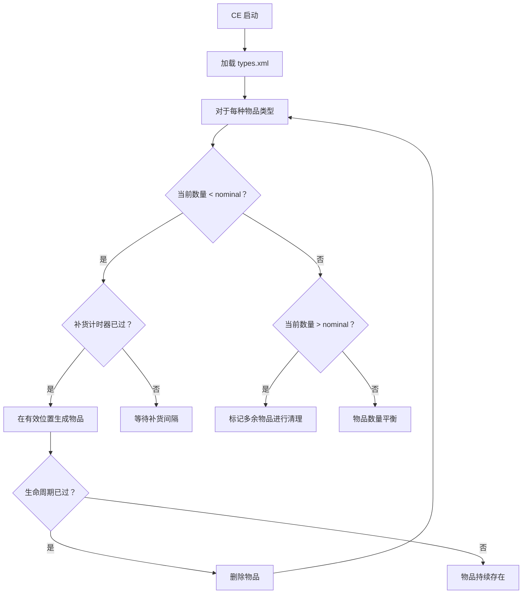

# 第 6.10 章：中央经济系统

[首页](../../README.md) | [<< 上一章：网络与 RPC](09-networking.md) | **中央经济系统** | [下一章：任务钩子 >>](11-mission-hooks.md)

---

## 简介

中央经济系统（CE）是 DayZ 的服务器端系统，用于管理世界中所有可生成的实体：战利品、车辆、感染者、动物和动态事件。它完全通过任务文件夹中的 XML 文件进行配置。虽然 CE 本身是引擎系统（不能直接通过脚本操作），但理解其配置文件对于任何服务器模组都是必不可少的。本章涵盖所有 CE 配置文件、它们的结构、关键参数以及它们之间的交互方式。

---

## CE 的工作原理

1. 服务器读取 `types.xml` 以了解每个物品的 **nominal**（目标数量）和 **min**（补货前的最低数量）。
2. 物品被分配 **usage 标志**（例如 `Military`、`Town`），映射到建筑/位置类型。
3. 物品被分配 **value 标志**（例如 `Tier1` 到 `Tier4`），将它们限制在地图区域。
4. CE 定期扫描世界，统计现有物品，当数量低于 `min` 时生成新物品。
5. 超过其 `lifetime`（秒）未被触碰的物品会被清理。
6. 动态事件（`events.xml`）按自己的时间表生成车辆、直升机坠毁点和感染者群体。

---

## 文件概览

所有 CE 文件位于任务文件夹中（例如 `dayzOffline.chernarusplus/`）。

| 文件 | 用途 |
|------|---------|
| `db/types.xml` | 每个可生成物品的参数 |
| `db/events.xml` | 动态事件定义（车辆、坠毁、感染者） |
| `db/globals.xml` | 全局 CE 参数（计时器、限制） |
| `db/economy.xml` | 子系统开关 |
| `cfgeconomycore.xml` | 根类、默认值、CE 日志 |
| `cfgspawnabletypes.xml` | 每个物品的附件和货物规则 |
| `cfgrandompresets.xml` | 随机战利品预设池 |
| `cfgeventspawns.xml` | 事件生成位置的世界坐标 |
| `cfglimitsdefinition.xml` | 所有有效的类别、用途和值标志名称 |
| `cfgplayerspawnpoints.xml` | 新生位置 |

---

## 生成周期



---

## types.xml

最关键的 CE 文件。世界中可以存在的每个物品都必须在此有条目。

### 结构

```xml
<types>
    <type name="AKM">
        <nominal>10</nominal>
        <lifetime>14400</lifetime>
        <restock>0</restock>
        <min>5</min>
        <quantmin>-1</quantmin>
        <quantmax>-1</quantmax>
        <cost>100</cost>
        <flags count_in_cargo="0" count_in_hoarder="0"
               count_in_map="1" count_in_player="0" crafted="0" deloot="0"/>
        <category name="weapons"/>
        <usage name="Military"/>
        <value name="Tier3"/>
        <value name="Tier4"/>
    </type>
</types>
```

### 参数

| 参数 | 描述 | 典型值 |
|-----------|-------------|----------------|
| `nominal` | 整个地图上的目标数量 | 1 - 200 |
| `lifetime` | 未触碰物品消失前的秒数 | 3600（1小时）- 14400（4小时） |
| `restock` | 物品被拾取后 CE 尝试重新生成的等待秒数 | 0（立即）- 1800 |
| `min` | CE 生成更多之前的最低数量 | 通常为 `nominal / 2` |
| `quantmin` | 最低数量百分比（弹药、液体）；-1 = 不适用 | -1、0 - 100 |
| `quantmax` | 最高数量百分比；-1 = 不适用 | -1、0 - 100 |
| `cost` | 优先级成本（原版中始终为 100） | 100 |

### 标志

| 标志 | 描述 |
|------|-------------|
| `count_in_cargo` | 将玩家/容器货物中的物品计入 nominal |
| `count_in_hoarder` | 将存储（帐篷、桶、掩埋藏匿处）中的物品计入 |
| `count_in_map` | 将地面和建筑中的物品计入 |
| `count_in_player` | 将玩家角色身上的物品计入 |
| `crafted` | 物品可制作（CE 不会自然生成它） |
| `deloot` | 动态事件战利品（由事件生成，而非 CE） |

### Category、Usage 和 Value

- **category**：物品类别（例如 `weapons`、`tools`、`food`、`clothes`、`containers`）
- **usage**：物品生成的位置（例如 `Military`、`Police`、`Town`、`Village`、`Farm`、`Hunting`、`Coast`）
- **value**：地图层级限制（例如 `Tier1` = 海岸、`Tier2` = 内陆、`Tier3` = 军事区、`Tier4` = 深内陆）

一个物品可以有多个 `<usage>` 和 `<value>` 标签，以便在多个位置和层级生成。

**示例 --- 将自定义物品添加到经济系统：**

```xml
<type name="MyCustomRifle">
    <nominal>5</nominal>
    <lifetime>14400</lifetime>
    <restock>1800</restock>
    <min>2</min>
    <quantmin>-1</quantmin>
    <quantmax>-1</quantmax>
    <cost>100</cost>
    <flags count_in_cargo="0" count_in_hoarder="0"
           count_in_map="1" count_in_player="0" crafted="0" deloot="0"/>
    <category name="weapons"/>
    <usage name="Military"/>
    <value name="Tier3"/>
    <value name="Tier4"/>
</type>
```

---

## globals.xml

影响所有物品的全局 CE 参数。

```xml
<variables>
    <var name="AnimalMaxCount" type="0" value="200"/>
    <var name="CleanupAvoidance" type="0" value="100"/>
    <var name="CleanupLifetimeDeadAnimal" type="0" value="1200"/>
    <var name="CleanupLifetimeDeadInfected" type="0" value="330"/>
    <var name="CleanupLifetimeDeadPlayer" type="0" value="3600"/>
    <var name="CleanupLifetimeDefault" type="0" value="45"/>
    <var name="CleanupLifetimeLimit" type="0" value="7200"/>
    <var name="CleanupLifetimeRuined" type="0" value="330"/>
    <var name="FlagRefreshFrequency" type="0" value="432000"/>
    <var name="FlagRefreshMaxDuration" type="0" value="3456000"/>
    <var name="IdleModeCountdown" type="0" value="60"/>
    <var name="IdleModeStartup" type="0" value="1"/>
    <var name="InitialSpawn" type="0" value="1200"/>
    <var name="LootDamageMax" type="0" value="2"/>
    <var name="LootDamageMin" type="0" value="0"/>
    <var name="RespawnAttempt" type="0" value="2"/>
    <var name="RespawnLimit" type="0" value="20"/>
    <var name="RespawnTypes" type="0" value="12"/>
    <var name="RestartSpawn" type="0" value="0"/>
    <var name="SpawnInitial" type="0" value="1200"/>
    <var name="TimeHopping" type="0" value="60"/>
    <var name="TimeLogin" type="0" value="15"/>
    <var name="TimeLogout" type="0" value="15"/>
    <var name="TimePenalty" type="0" value="20"/>
    <var name="WorldWetTempUpdate" type="0" value="1"/>
    <var name="ZombieMaxCount" type="0" value="1000"/>
</variables>
```

### 关键参数

| 变量 | 描述 |
|----------|-------------|
| `AnimalMaxCount` | 同时存活的最大动物数量 |
| `ZombieMaxCount` | 同时存活的最大感染者数量 |
| `CleanupLifetimeDeadPlayer` | 死亡玩家尸体消失前的秒数 |
| `CleanupLifetimeDeadInfected` | 死亡僵尸消失前的秒数 |
| `InitialSpawn` | 服务器启动时生成的物品数量 |
| `SpawnInitial` | 启动时的生成尝试次数 |
| `LootDamageMin` / `LootDamageMax` | 应用于生成战利品的损伤范围（0-4：崭新到损坏） |
| `RespawnAttempt` | 重生检查之间的秒数 |
| `FlagRefreshFrequency` | 领地旗帜刷新间隔（秒） |
| `TimeLogin` / `TimeLogout` | 登录/登出计时器（秒） |

---

## events.xml

定义动态事件：感染者生成区域、车辆生成、直升机坠毁和其他世界事件。

### 结构

```xml
<events>
    <event name="StaticHeliCrash">
        <nominal>3</nominal>
        <min>1</min>
        <max>3</max>
        <lifetime>1800</lifetime>
        <restock>0</restock>
        <saferadius>500</saferadius>
        <distanceradius>500</distanceradius>
        <cleanupradius>200</cleanupradius>
        <flags deletable="1" init_random="0" remove_damaged="1"/>
        <position>fixed</position>
        <limit>child</limit>
        <active>1</active>
        <children>
            <child lootmax="10" lootmin="5" max="3" min="1"
                   type="Wreck_Mi8_Crashed"/>
        </children>
    </event>
</events>
```

### 事件参数

| 参数 | 描述 |
|-----------|-------------|
| `nominal` | 活动事件的目标数量 |
| `min` / `max` | 同时活动的最小和最大数量 |
| `lifetime` | 事件消失前的秒数 |
| `saferadius` | 生成时距离玩家的最小距离 |
| `distanceradius` | 事件实例之间的最小距离 |
| `cleanupradius` | 清理检查的半径 |
| `position` | `"fixed"`（来自 cfgeventspawns.xml）或 `"player"`（靠近玩家） |
| `active` | `1` = 启用、`0` = 禁用 |

### Children（事件对象）

每个事件可以生成一个或多个子对象：

| 属性 | 描述 |
|-----------|-------------|
| `type` | 要生成的对象的类名 |
| `min` / `max` | 此子对象的数量范围 |
| `lootmin` / `lootmax` | 与此子对象一起生成的战利品物品数量 |

---

## cfgspawnabletypes.xml

定义特定物品生成时附带什么附件和货物。

```xml
<spawnabletypes>
    <type name="AKM">
        <attachments chance="0.3">
            <item name="AK_WoodBttstck" chance="0.5"/>
            <item name="AK_PlasticBttstck" chance="0.3"/>
            <item name="AK_FoldingBttstck" chance="0.2"/>
        </attachments>
        <attachments chance="0.2">
            <item name="AK_WoodHndgrd" chance="0.6"/>
            <item name="AK_PlasticHndgrd" chance="0.4"/>
        </attachments>
        <cargo chance="0.15">
            <item name="Mag_AKM_30Rnd" chance="0.7"/>
            <item name="Mag_AKM_Drum75Rnd" chance="0.3"/>
        </cargo>
    </type>
</spawnabletypes>
```

### 工作原理

- 每个 `<attachments>` 块有一个被应用的 `chance`（0.0 - 1.0）。
- 在一个块内，物品按其各自的 `chance` 值选择（在块内归一化为 100%）。
- 多个 `<attachments>` 块允许不同的附件槽位独立进行随机选择。
- `<cargo>` 块对放入实体货物中的物品工作方式相同。

---

## cfgrandompresets.xml

定义 `cfgspawnabletypes.xml` 引用的可重用战利品预设池。

```xml
<randompresets>
    <cargo name="foodGeneral" chance="0.5">
        <item name="Apple" chance="0.15"/>
        <item name="Pear" chance="0.15"/>
        <item name="BakedBeansCan" chance="0.3"/>
        <item name="SardinesCan" chance="0.3"/>
        <item name="WaterBottle" chance="0.1"/>
    </cargo>
</randompresets>
```

这些预设可以在 `cfgspawnabletypes.xml` 中按名称引用：

```xml
<type name="Barrel_Green">
    <cargo preset="foodGeneral"/>
</type>
```

---

## cfgeconomycore.xml

根级 CE 配置。定义默认值、CE 类和日志标志。

```xml
<economycore>
    <classes>
        <rootclass name="CfgVehicles" act="character" reportMemoryLOD="no"/>
        <rootclass name="CfgVehicles" act="car"/>
        <rootclass name="CfgVehicles" act="deployable"/>
        <rootclass name="CfgAmmo" act="none" reportMemoryLOD="no"/>
    </classes>
    <defaults>
        <default name="dyn_radius" value="40"/>
        <default name="dyn_smin" value="0"/>
        <default name="dyn_smax" value="0"/>
        <default name="dyn_dmin" value="0"/>
        <default name="dyn_dmax" value="10"/>
    </defaults>
    <ce folder="db"/>
</economycore>
```

`<ce folder="db"/>` 标签告诉 CE 在哪里找到 `types.xml`、`events.xml` 和 `globals.xml`。

---

## cfglimitsdefinition.xml

定义 `types.xml` 中可以使用的所有有效类别、用途、标签和值标志名称。

```xml
<lists>
    <categories>
        <category name="weapons"/>
        <category name="tools"/>
        <category name="food"/>
        <category name="clothes"/>
        <category name="containers"/>
        <category name="vehiclesparts"/>
        <category name="explosives"/>
    </categories>
    <usageflags>
        <usage name="Military"/>
        <usage name="Police"/>
        <usage name="Hunting"/>
        <usage name="Town"/>
        <usage name="Village"/>
        <usage name="Farm"/>
        <usage name="Coast"/>
        <usage name="Industrial"/>
        <usage name="Medic"/>
        <usage name="Firefighter"/>
        <usage name="School"/>
        <usage name="Office"/>
        <usage name="Prison"/>
        <usage name="Lunapark"/>
        <usage name="ContaminatedArea"/>
    </usageflags>
    <valueflags>
        <value name="Tier1"/>
        <value name="Tier2"/>
        <value name="Tier3"/>
        <value name="Tier4"/>
    </valueflags>
</lists>
```

自定义模组可以在此添加新标志，并在其 `types.xml` 条目中引用它们。

---

## 脚本中的 ECE 标志

从脚本生成实体时，ECE 标志（在[第 6.1 章](01-entity-system.md)中介绍）决定实体如何与 CE 交互：

| 标志 | CE 行为 |
|------|-------------|
| `ECE_NOLIFETIME` | 实体永远不会消失（不受 CE 生命周期跟踪） |
| `ECE_DYNAMIC_PERSISTENCY` | 实体仅在玩家交互后才变为持久化 |
| `ECE_EQUIP_ATTACHMENTS` | CE 从 `cfgspawnabletypes.xml` 生成配置的附件 |
| `ECE_EQUIP_CARGO` | CE 从 `cfgspawnabletypes.xml` 生成配置的货物 |

**示例 --- 生成一个永久存在的物品：**

```c
int flags = ECE_PLACE_ON_SURFACE | ECE_NOLIFETIME;
Object obj = GetGame().CreateObjectEx("Barrel_Green", pos, flags);
```

**示例 --- 使用 CE 配置的附件生成：**

```c
int flags = ECE_PLACE_ON_SURFACE | ECE_EQUIP_ATTACHMENTS | ECE_EQUIP_CARGO;
Object obj = GetGame().CreateObjectEx("AKM", pos, flags);
// AKM 将按照 cfgspawnabletypes.xml 生成随机附件
```

---

## CE 交互的脚本 API

虽然 CE 主要通过 XML 配置，但有一些脚本端的交互：

### 读取配置值

```c
// 检查物品是否存在于 CfgVehicles 中
bool exists = GetGame().ConfigIsExisting("CfgVehicles MyCustomItem");

// 读取配置属性
string displayName;
GetGame().ConfigGetText("CfgVehicles AKM displayName", displayName);

int weight = GetGame().ConfigGetInt("CfgVehicles AKM weight");
```

### 查询世界中的对象

```c
// 获取某位置附近的对象
array<Object> objects = new array<Object>;
array<CargoBase> proxyCargos = new array<CargoBase>;
GetGame().GetObjectsAtPosition(pos, 50.0, objects, proxyCargos);
```

### 地表和位置查询

```c
// 获取地形高度（用于将物品放置在地面上）
float surfaceY = GetGame().SurfaceY(x, z);

// 获取位置处的地表类型
string surfaceType;
GetGame().SurfaceGetType(x, z, surfaceType);
```

---

## 修改中央经济系统

### 添加自定义物品

1. 在你的模组的 `config.cpp` 的 `CfgVehicles` 下定义物品类。
2. 在 `types.xml` 中添加 `<type>` 条目，包含 nominal、lifetime、usage 和 value 标志。
3. 可选地在 `cfgspawnabletypes.xml` 中添加附件/货物规则。
4. 如果使用新的 usage/value 标志，在 `cfglimitsdefinition.xml` 中定义它们。

### 修改现有物品

编辑 `types.xml` 中的 `<type>` 条目以更改生成率、生命周期或位置限制。更改在服务器重启后生效。

### 禁用物品

将 `nominal` 和 `min` 设置为 `0`：

```xml
<type name="UnwantedItem">
    <nominal>0</nominal>
    <min>0</min>
    <!-- 其余参数 -->
</type>
```

### 添加自定义事件

在 `events.xml` 中添加新的 `<event>` 块，并在 `cfgeventspawns.xml` 中添加相应的生成位置：

```xml
<!-- events.xml -->
<event name="MyCustomEvent">
    <nominal>5</nominal>
    <min>2</min>
    <max>5</max>
    <lifetime>3600</lifetime>
    <restock>0</restock>
    <saferadius>300</saferadius>
    <distanceradius>800</distanceradius>
    <cleanupradius>100</cleanupradius>
    <flags deletable="1" init_random="1" remove_damaged="1"/>
    <position>fixed</position>
    <limit>child</limit>
    <active>1</active>
    <children>
        <child lootmax="5" lootmin="2" max="1" min="1"
               type="MyCustomObject"/>
    </children>
</event>
```

```xml
<!-- cfgeventspawns.xml -->
<event name="MyCustomEvent">
    <pos x="6543.2" z="2872.5" a="180"/>
    <pos x="7821.0" z="3100.8" a="90"/>
    <pos x="4200.5" z="8500.3" a="0"/>
</event>
```

---

## 总结

| 文件 | 用途 | 关键参数 |
|------|---------|----------------|
| `types.xml` | 物品生成定义 | `nominal`、`min`、`lifetime`、`usage`、`value` |
| `globals.xml` | 全局 CE 变量 | `ZombieMaxCount`、`AnimalMaxCount`、清理计时器 |
| `events.xml` | 动态事件 | `nominal`、`lifetime`、`position`、`children` |
| `cfgspawnabletypes.xml` | 每个物品的附件/货物规则 | `attachments`、`cargo`、`chance` |
| `cfgrandompresets.xml` | 可重用战利品池 | `cargo`/`attachments` 预设 |
| `cfgeconomycore.xml` | 根 CE 配置 | `classes`、`defaults`、CE 文件夹 |
| `cfglimitsdefinition.xml` | 有效标志定义 | `categories`、`usageflags`、`valueflags` |

| 概念 | 关键要点 |
|---------|-----------|
| Nominal/Min | CE 在数量降至 `min` 以下时生成物品，目标为 `nominal` |
| Lifetime | 未触碰物品消失前的秒数 |
| Usage 标志 | 物品生成的位置（Military、Town 等） |
| Value 标志 | 地图层级限制（Tier1 = 海岸 到 Tier4 = 深内陆） |
| Count 标志 | 哪些物品计入 nominal（cargo、hoarder、map、player） |
| Events | 具有自己生命周期的动态生成（坠毁、车辆、感染者） |
| ECE 标志 | 脚本生成物品用 `ECE_NOLIFETIME`、`ECE_EQUIP` |

---

## 最佳实践

- **为高价值物品设置 `count_in_hoarder="1"`。** 没有此标志，玩家可以在藏匿处囤积稀有武器而不减少世界生成数量，实际上导致物品复制。
- **大多数物品保持 `restock` 为 0。** 非零的 restock 值会延迟物品被拾取后的重新生成。仅对不应立即重新出现的物品使用（例如稀有军事装备）。
- **在有玩家的正式服务器上测试 nominal/min 比率。** 静态测试无法揭示真实的 CE 行为。物品与玩家移动模式、容器存储和清理计时器的交互方式，只有在真实负载下才能看到。
- **始终在 `config.cpp` 和 `types.xml` 中都定义新物品。** 有 config 条目但没有 types.xml 条目意味着物品永远不会自然生成。有 types.xml 条目但没有 config 类会导致 CE 错误。
- **使用 `cfgspawnabletypes.xml` 创建武器多样性。** 不要生成裸武器，而是定义附件预设，让玩家找到带有随机枪托、护木和弹匣的武器 -- 这极大地改善了战利品质量感知。

---

## 兼容性与影响

- **多模组：** 多个模组可以向 `types.xml` 添加条目。如果两个模组定义了相同的 `<type name="">`，最后加载的文件获胜。使用唯一的类名以避免冲突。在社区服务器上仔细合并 types.xml 条目。
- **性能：** 许多物品类型的高 `nominal` 值（200+）会给 CE 的生成循环带来压力。CE 运行的定期扫描与跟踪的实体总数成正比。保持 nominal 在合理范围 -- 武器 5-20，普通物品 20-100。
- **服务器/客户端：** CE 完全在服务器上运行。客户端无法看到 CE 状态。所有 XML 文件都是服务器端的，不会分发给客户端。

---

[首页](../../README.md) | [<< 上一章：网络与 RPC](09-networking.md) | **中央经济系统** | [下一章：任务钩子 >>](11-mission-hooks.md)
