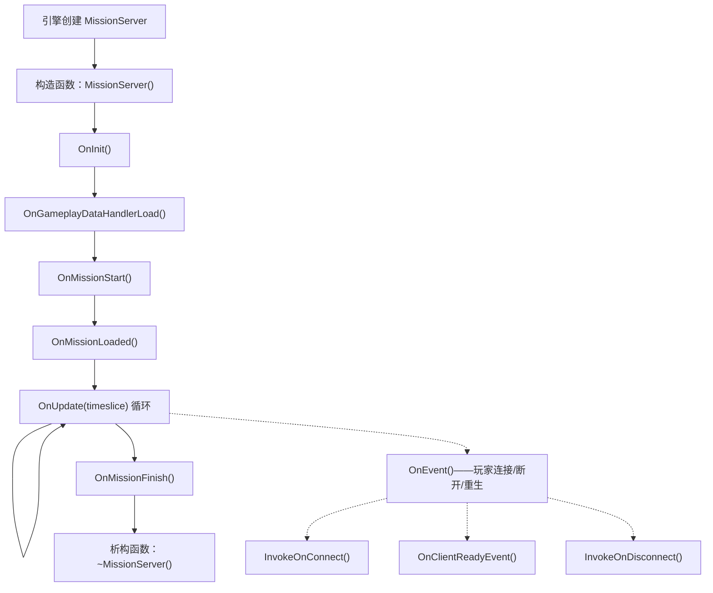
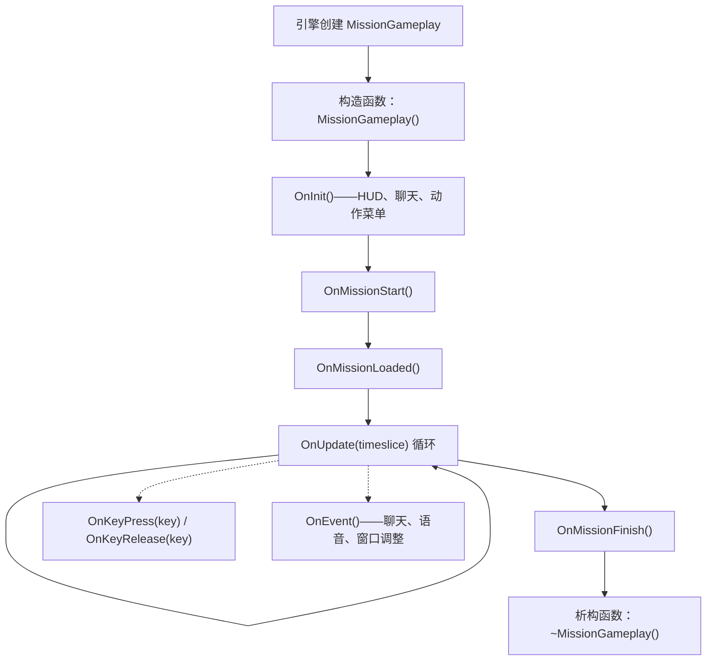
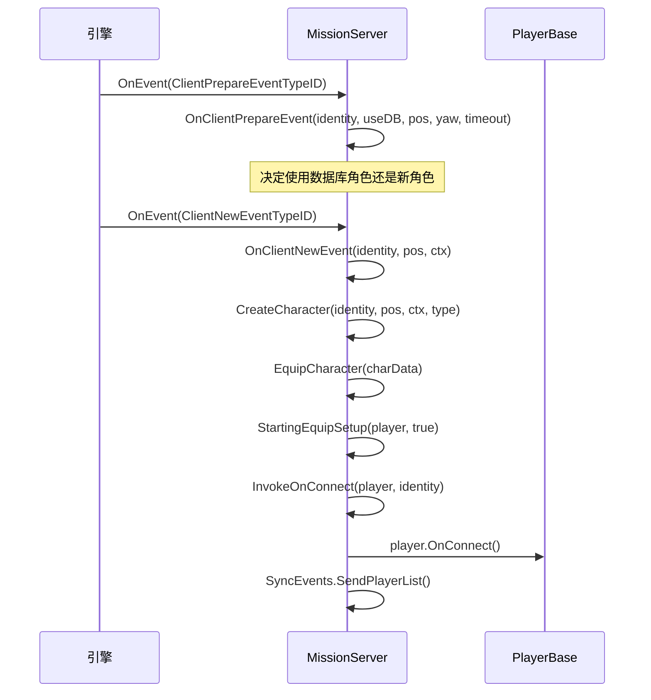
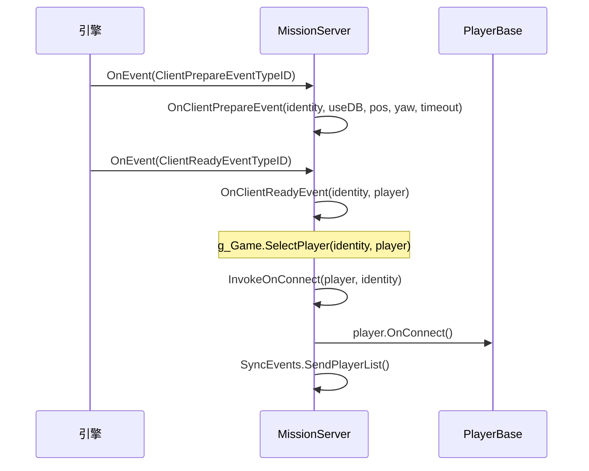
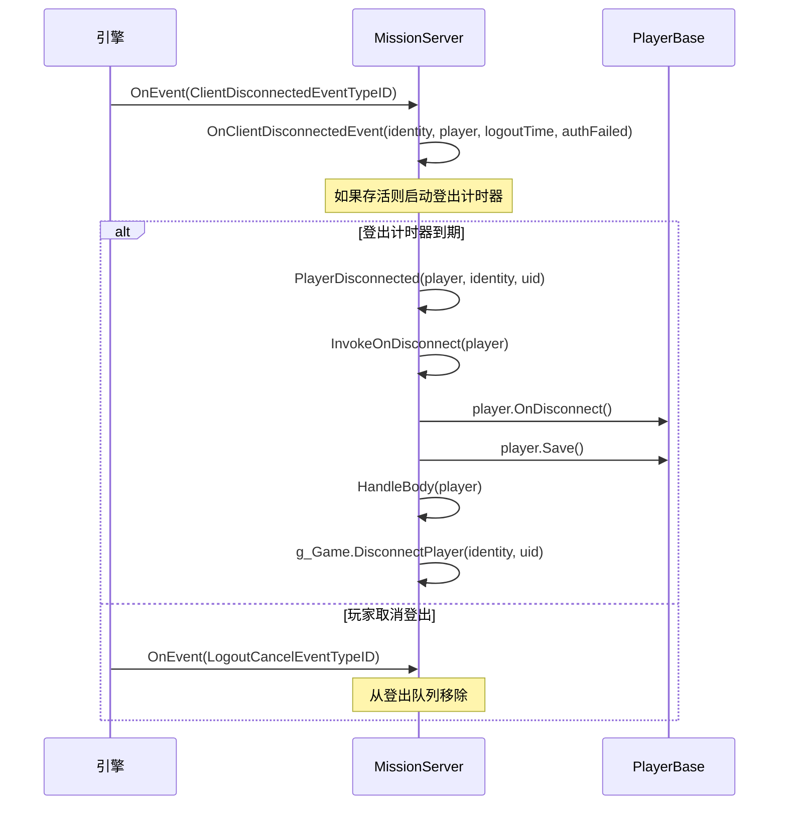

# 第 6.11 章：任务钩子

[首页](../../README.md) | [<< 上一章：中央经济](10-central-economy.md) | **任务钩子** | [下一章：动作系统 >>](12-action-system.md)

---

## 简介

每个 DayZ 模组都需要一个入口点——一个初始化管理器、注册 RPC 处理器、钩入玩家连接和关闭时清理的地方。这个入口点就是 **Mission** 类。当场景加载时，引擎创建恰好一个 Mission 实例：专用服务器上的 `MissionServer`，客户端上的 `MissionGameplay`，或者在监听服务器上两者都有。这些类提供按保证顺序触发的生命周期钩子，为模组提供可靠的行为注入点。

本章涵盖完整的 Mission 类层次结构、每个可钩入的方法、正确的 `modded class` 扩展模式，以及来自原版 DayZ、COT 和 Expansion 的真实案例。

---

## 类层次结构

```
Mission                      // 3_Game/gameplay.c（基类，定义所有钩子签名）
└── MissionBaseWorld         // 4_World/classes/missionbaseworld.c（最小桥接）
    └── MissionBase          // 5_Mission/mission/missionbase.c（共享设置：HUD、菜单、插件）
        ├── MissionServer    // 5_Mission/mission/missionserver.c（服务器端）
        └── MissionGameplay  // 5_Mission/mission/missiongameplay.c（客户端）
```

- **Mission** 定义所有钩子签名为空方法：`OnInit()`、`OnUpdate()`、`OnEvent()`、`OnMissionStart()`、`OnMissionFinish()`、`OnKeyPress()`、`OnKeyRelease()` 等。
- **MissionBase** 初始化插件管理器、控件事件处理器、世界数据、动态音乐、声音集和输入设备跟踪。它是服务器和客户端的共同父类。
- **MissionServer** 处理玩家连接、断开连接、重生、尸体管理、定时调度和炮击。
- **MissionGameplay** 处理 HUD 创建、聊天、动作菜单、语音通信 UI、物品栏、输入排除和客户端玩家调度。

---

## 生命周期概览

### MissionServer 生命周期（服务器端）



### MissionGameplay 生命周期（客户端）



---

## Mission 基类方法

**文件：**`3_Game/gameplay.c`

`Mission` 基类定义了每个可钩入的方法。除非另有说明，所有方法都是带空默认实现的虚方法。

### 生命周期钩子

| 方法 | 签名 | 触发时机 |
|--------|-----------|---------------|
| `OnInit` | `void OnInit()` | 构造函数之后，任务启动之前。主要设置点。 |
| `OnMissionStart` | `void OnMissionStart()` | OnInit 之后。任务世界已激活。 |
| `OnMissionLoaded` | `void OnMissionLoaded()` | OnMissionStart 之后。所有原版系统已初始化。 |
| `OnGameplayDataHandlerLoad` | `void OnGameplayDataHandlerLoad()` | 服务器：游戏数据（cfggameplay.json）加载后。 |
| `OnUpdate` | `void OnUpdate(float timeslice)` | 每帧。`timeslice` 是自上一帧以来的秒数（通常 0.016-0.033）。 |
| `OnMissionFinish` | `void OnMissionFinish()` | 关闭或断开连接时。在此清理所有内容。 |

### 输入钩子（客户端）

| 方法 | 签名 | 触发时机 |
|--------|-----------|---------------|
| `OnKeyPress` | `void OnKeyPress(int key)` | 物理按键按下。`key` 是 `KeyCode` 常量。 |
| `OnKeyRelease` | `void OnKeyRelease(int key)` | 物理按键释放。 |
| `OnMouseButtonPress` | `void OnMouseButtonPress(int button)` | 鼠标按钮按下。 |
| `OnMouseButtonRelease` | `void OnMouseButtonRelease(int button)` | 鼠标按钮释放。 |

### 事件钩子

| 方法 | 签名 | 触发时机 |
|--------|-----------|---------------|
| `OnEvent` | `void OnEvent(EventType eventTypeId, Param params)` | 引擎事件：聊天、语音、玩家连接/断开、窗口调整等。 |

### 工具方法

| 方法 | 签名 | 描述 |
|--------|-----------|-------------|
| `GetHud` | `Hud GetHud()` | 返回 HUD 实例（仅客户端）。 |
| `GetWorldData` | `WorldData GetWorldData()` | 返回世界特定数据（温度曲线等）。 |
| `IsPaused` | `bool IsPaused()` | 游戏是否暂停（单人/监听服务器）。 |
| `IsServer` | `bool IsServer()` | MissionServer 为 `true`，MissionGameplay 为 `false`。 |
| `IsMissionGameplay` | `bool IsMissionGameplay()` | MissionGameplay 为 `true`，MissionServer 为 `false`。 |
| `PlayerControlEnable` | `void PlayerControlEnable(bool bForceSuppress)` | 禁用后重新启用玩家输入。 |
| `PlayerControlDisable` | `void PlayerControlDisable(int mode)` | 禁用玩家输入（例如 `INPUT_EXCLUDE_ALL`）。 |
| `IsControlDisabled` | `bool IsControlDisabled()` | 玩家控制是否当前被禁用。 |
| `GetControlDisabledMode` | `int GetControlDisabledMode()` | 返回当前输入排除模式。 |

---

## MissionServer 钩子（服务器端）

**文件：**`5_Mission/mission/missionserver.c`

MissionServer 由引擎在专用服务器上实例化。它处理与服务器上玩家生命周期相关的一切。

### 关键原版行为

- **构造函数**：设置玩家统计的 `CallQueue`（30 秒间隔）、死亡玩家数组、登出跟踪映射、降雨采购处理器。
- **OnInit**：加载 `CfgGameplayHandler`、`PlayerSpawnHandler`、`CfgPlayerRestrictedAreaHandler`、`UndergroundAreaLoader`、炮击发射位置。
- **OnMissionStart**：创建效果区域（污染区域等）。
- **OnUpdate**：运行定时调度器、处理登出计时器、更新基础环境温度、降雨采购、随机炮击。

### OnEvent——玩家连接事件

服务器的 `OnEvent` 是所有玩家生命周期事件的中央调度器。引擎发送带有类型化 `Param` 对象的事件。原版通过 `switch` 块处理它们：

| 事件 | 参数类型 | 发生了什么 |
|-------|-----------|--------------|
| `ClientPrepareEventTypeID` | `ClientPrepareEventParams` | 决定使用数据库角色还是新角色 |
| `ClientNewEventTypeID` | `ClientNewEventParams` | 创建 + 装备新角色，调用 `InvokeOnConnect` |
| `ClientReadyEventTypeID` | `ClientReadyEventParams` | 已有角色加载，调用 `OnClientReadyEvent` + `InvokeOnConnect` |
| `ClientRespawnEventTypeID` | `ClientRespawnEventParams` | 玩家重生请求，如果失去意识则杀死旧角色 |
| `ClientReconnectEventTypeID` | `ClientReconnectEventParams` | 玩家重新连接到存活角色 |
| `ClientDisconnectedEventTypeID` | `ClientDisconnectedEventParams` | 玩家断开连接，启动登出计时器 |
| `LogoutCancelEventTypeID` | `LogoutCancelEventParams` | 玩家取消登出倒计时 |

### 玩家连接方法

从 `OnEvent` 内部调用，当玩家相关事件触发时：

| 方法 | 签名 | 原版行为 |
|--------|-----------|-----------------|
| `InvokeOnConnect` | `void InvokeOnConnect(PlayerBase player, PlayerIdentity identity)` | 调用 `player.OnConnect()`。主要的"玩家加入"钩子。 |
| `InvokeOnDisconnect` | `void InvokeOnDisconnect(PlayerBase player)` | 调用 `player.OnDisconnect()`。玩家完全断开连接。 |
| `OnClientReadyEvent` | `void OnClientReadyEvent(PlayerIdentity identity, PlayerBase player)` | 调用 `g_Game.SelectPlayer()`。已有角色从数据库加载。 |
| `OnClientNewEvent` | `PlayerBase OnClientNewEvent(PlayerIdentity identity, vector pos, ParamsReadContext ctx)` | 创建 + 装备新角色。返回 `PlayerBase`。 |
| `OnClientRespawnEvent` | `void OnClientRespawnEvent(PlayerIdentity identity, PlayerBase player)` | 如果失去意识/被束缚则杀死旧角色。 |
| `OnClientReconnectEvent` | `void OnClientReconnectEvent(PlayerIdentity identity, PlayerBase player)` | 调用 `player.OnReconnect()`。 |
| `PlayerDisconnected` | `void PlayerDisconnected(PlayerBase player, PlayerIdentity identity, string uid)` | 调用 `InvokeOnDisconnect`，保存玩家，退出 hive，处理尸体，从服务器移除。 |

### 角色设置

| 方法 | 签名 | 描述 |
|--------|-----------|-------------|
| `CreateCharacter` | `PlayerBase CreateCharacter(PlayerIdentity identity, vector pos, ParamsReadContext ctx, string characterName)` | 通过 `g_Game.CreatePlayer()` + `g_Game.SelectPlayer()` 创建玩家实体。 |
| `EquipCharacter` | `void EquipCharacter(MenuDefaultCharacterData char_data)` | 迭代附件槽位，如果自定义重生被禁用则随机化。调用 `StartingEquipSetup()`。 |
| `StartingEquipSetup` | `void StartingEquipSetup(PlayerBase player, bool clothesChosen)` | **原版中为空**——你的初始装备入口点。 |

---

## MissionGameplay 钩子（客户端）

**文件：**`5_Mission/mission/missiongameplay.c`

MissionGameplay 在客户端连接到服务器或启动单人游戏时实例化。它管理所有客户端 UI 和输入。

### 关键原版行为

- **构造函数**：销毁现有菜单，创建 Chat、ActionMenu、IngameHud、VoN 状态、淡入淡出计时器、SyncEvents 注册。
- **OnInit**：使用 `m_Initialized` 防止双重初始化。从 `"gui/layouts/day_z_hud.layout"` 创建 HUD 根控件、聊天控件、动作菜单、麦克风图标、VoN 语音级别控件、聊天频道区域。调用 `PPEffects.Init()` 和 `MapMarkerTypes.Init()`。
- **OnMissionStart**：隐藏光标，将任务状态设为 `MISSION_STATE_GAME`，在单人游戏中加载效果区域。
- **OnUpdate**：本地玩家的定时调度器、全息图更新、径向快捷栏（主机）、手势菜单、物品栏/聊天/VoN 的输入处理、调试监视器、暂停行为。
- **OnMissionFinish**：隐藏对话框，销毁所有菜单和聊天，删除 HUD 根控件，停止所有 PPE 效果，重新启用所有输入，将任务状态设为 `MISSION_STATE_FINNISH`。

### 输入钩子

```c
override void OnKeyPress(int key)
{
    super.OnKeyPress(key);
    // 原版转发到 Hud.KeyPress(key)
    // key 值是 KeyCode 常量（例如 KeyCode.KC_F1 = 59）
}

override void OnKeyRelease(int key)
{
    super.OnKeyRelease(key);
}
```

### 事件钩子

原版 `MissionGameplay.OnEvent()` 处理 `ChatMessageEventTypeID`（添加到聊天控件）、`ChatChannelEventTypeID`（更新频道指示器）、`WindowsResizeEventTypeID`（重建菜单/HUD）、`SetFreeCameraEventTypeID`（调试相机）和 `VONStateEventTypeID`（语音状态）。使用相同的 `switch` 模式重写它并始终调用 `super.OnEvent()`。

### 输入控制

`PlayerControlDisable(int mode)` 激活输入排除组（例如 `INPUT_EXCLUDE_ALL`、`INPUT_EXCLUDE_INVENTORY`）。`PlayerControlEnable(bool bForceSuppress)` 移除它。这些映射到 `specific.xml` 中定义的排除组。如果你的模组需要自定义输入排除行为（如 Expansion 为其菜单所做的），请重写它们。

---

## 服务器端事件流：玩家加入

理解玩家连接时事件的确切顺序对于知道在哪里钩入代码至关重要。

### 新角色（首次加入或死亡后）



### 已有角色（断开连接后重新连接）



### 玩家断开连接



---

## 如何钩入：modded class 模式

扩展 Mission 类的正确方式是 `modded class` 模式。这使用 Enforce Script 的类继承机制，其中 `modded class` 扩展现有类而不替换它，允许多个模组共存。

### 基本服务器钩子

```c
// 你的模组：Scripts/5_Mission/YourMod/MissionServer.c
modded class MissionServer
{
    ref MyServerManager m_MyManager;

    override void OnInit()
    {
        super.OnInit();  // 始终先调用 super

        m_MyManager = new MyServerManager();
        m_MyManager.Init();
        Print("[MyMod] Server manager initialized");
    }

    override void OnMissionFinish()
    {
        if (m_MyManager)
        {
            m_MyManager.Cleanup();
            m_MyManager = null;
        }

        super.OnMissionFinish();  // 调用 super（在你的清理之前或之后）
    }
}
```

### 基本客户端钩子

```c
// 你的模组：Scripts/5_Mission/YourMod/MissionGameplay.c
modded class MissionGameplay
{
    ref MyHudWidget m_MyHud;

    override void OnInit()
    {
        super.OnInit();  // 始终先调用 super

        // 创建自定义 HUD 元素
        m_MyHud = new MyHudWidget();
        m_MyHud.Init();
    }

    override void OnUpdate(float timeslice)
    {
        super.OnUpdate(timeslice);

        // 每帧更新自定义 HUD
        if (m_MyHud)
        {
            m_MyHud.Update(timeslice);
        }
    }

    override void OnMissionFinish()
    {
        if (m_MyHud)
        {
            m_MyHud.Destroy();
            m_MyHud = null;
        }

        super.OnMissionFinish();
    }
}
```

### 钩入玩家连接

```c
modded class MissionServer
{
    override void InvokeOnConnect(PlayerBase player, PlayerIdentity identity)
    {
        super.InvokeOnConnect(player, identity);

        // 你的代码在原版和所有之前的模组之后运行
        if (player && identity)
        {
            string uid = identity.GetId();
            string name = identity.GetName();
            Print("[MyMod] Player connected: " + name + " (" + uid + ")");

            // 加载玩家数据、发送设置等
            MyPlayerData.Load(uid);
        }
    }

    override void InvokeOnDisconnect(PlayerBase player)
    {
        // 在 super 之前保存数据（玩家可能在之后被删除）
        if (player && player.GetIdentity())
        {
            string uid = player.GetIdentity().GetId();
            MyPlayerData.Save(uid);
        }

        super.InvokeOnDisconnect(player);
    }
}
```

### 钩入键盘输入（客户端）

```c
modded class MissionGameplay
{
    override void OnKeyPress(int key)
    {
        super.OnKeyPress(key);

        // 按 F6 打开自定义菜单
        if (key == KeyCode.KC_F6)
        {
            if (!GetGame().GetUIManager().GetMenu())
            {
                MyCustomMenu.Open();
            }
        }
    }
}
```

### 在哪里注册 RPC 处理器

RPC 处理器应在 `OnInit` 中注册，而不是在构造函数中。到 `OnInit` 时，所有脚本模块已加载，网络层已就绪。

```c
modded class MissionServer
{
    override void OnInit()
    {
        super.OnInit();

        // 在这里注册 RPC 处理器
        GetDayZGame().Event_OnRPC.Insert(OnMyRPC);
    }

    override void OnMissionFinish()
    {
        GetDayZGame().Event_OnRPC.Remove(OnMyRPC);
        super.OnMissionFinish();
    }

    void OnMyRPC(PlayerIdentity sender, Object target, int rpc_type,
                 ParamsReadContext ctx)
    {
        // 处理你的 RPC
    }
}
```

---

## 按用途的常用钩子

| 我想要... | 钩入此方法 | 在哪个类上 |
|--------------|------------------|----------------|
| 在服务器初始化我的模组 | `OnInit()` | `MissionServer` |
| 在客户端初始化我的模组 | `OnInit()` | `MissionGameplay` |
| 每帧运行代码（服务器） | `OnUpdate(float timeslice)` | `MissionServer` |
| 每帧运行代码（客户端） | `OnUpdate(float timeslice)` | `MissionGameplay` |
| 响应玩家加入 | `InvokeOnConnect(player, identity)` | `MissionServer` |
| 响应玩家离开 | `InvokeOnDisconnect(player)` | `MissionServer` |
| 向新客户端发送初始数据 | `OnClientReadyEvent(identity, player)` | `MissionServer` |
| 响应新角色生成 | `OnClientNewEvent(identity, pos, ctx)` | `MissionServer` |
| 给予初始装备 | `StartingEquipSetup(player, clothesChosen)` | `MissionServer` |
| 响应玩家重生 | `OnClientRespawnEvent(identity, player)` | `MissionServer` |
| 响应玩家重新连接 | `OnClientReconnectEvent(identity, player)` | `MissionServer` |
| 处理断开连接/登出逻辑 | `OnClientDisconnectedEvent(identity, player, logoutTime, authFailed)` | `MissionServer` |
| 拦截服务器事件（连接、聊天） | `OnEvent(eventTypeId, params)` | `MissionServer` |
| 拦截客户端事件（聊天、语音） | `OnEvent(eventTypeId, params)` | `MissionGameplay` |
| 处理键盘输入 | `OnKeyPress(key)` / `OnKeyRelease(key)` | `MissionGameplay` |
| 创建 HUD 元素 | `OnInit()` | `MissionGameplay` |
| 服务器关闭时清理 | `OnMissionFinish()` | `MissionServer` |
| 客户端断开时清理 | `OnMissionFinish()` | `MissionGameplay` |
| 所有系统加载后运行一次代码 | `OnMissionLoaded()` | 两者均可 |
| 禁用/启用玩家输入 | `PlayerControlDisable(mode)` / `PlayerControlEnable(bForceSuppress)` | `MissionGameplay` |

---

## 服务器与客户端：哪些钩子在哪里触发

| 钩子 | 服务器 | 客户端 | 备注 |
|------|--------|--------|-------|
| 构造函数 | 是 | 是 | 每侧不同的类 |
| `OnInit()` | 是 | 是 | |
| `OnMissionStart()` | 是 | 是 | |
| `OnMissionLoaded()` | 是 | 是 | |
| `OnGameplayDataHandlerLoad()` | 是 | 否 | cfggameplay.json 已加载 |
| `OnUpdate(timeslice)` | 是 | 是 | 两者运行自己的帧循环 |
| `OnMissionFinish()` | 是 | 是 | |
| `OnEvent()` | 是 | 是 | 每侧不同的事件类型 |
| `InvokeOnConnect()` | 是 | 否 | 仅服务器 |
| `InvokeOnDisconnect()` | 是 | 否 | 仅服务器 |
| `OnClientReadyEvent()` | 是 | 否 | 仅服务器 |
| `OnClientNewEvent()` | 是 | 否 | 仅服务器 |
| `OnClientRespawnEvent()` | 是 | 否 | 仅服务器 |
| `OnClientReconnectEvent()` | 是 | 否 | 仅服务器 |
| `OnClientDisconnectedEvent()` | 是 | 否 | 仅服务器 |
| `PlayerDisconnected()` | 是 | 否 | 仅服务器 |
| `StartingEquipSetup()` | 是 | 否 | 仅服务器 |
| `EquipCharacter()` | 是 | 否 | 仅服务器 |
| `OnKeyPress()` | 否 | 是 | 仅客户端 |
| `OnKeyRelease()` | 否 | 是 | 仅客户端 |
| `OnMouseButtonPress()` | 否 | 是 | 仅客户端 |
| `OnMouseButtonRelease()` | 否 | 是 | 仅客户端 |
| `PlayerControlDisable()` | 否 | 是 | 仅客户端 |
| `PlayerControlEnable()` | 否 | 是 | 仅客户端 |

---

## OnInit 与 OnMissionStart 与 OnMissionLoaded

| 钩子 | 时机 | 用途 |
|------|------|---------|
| `OnInit()` | 第一。脚本模块已加载，世界尚未激活。 | 创建管理器、注册 RPC、加载配置。 |
| `OnMissionStart()` | 第二。世界已激活，可以生成实体。 | 生成实体、启动游戏系统、创建触发器。 |
| `OnMissionLoaded()` | 第三。所有原版系统已完全初始化。 | 跨模组查询、依赖于所有内容就绪的最终化。 |

始终在所有三个上调用 `super`。使用 `OnInit` 作为主要初始化点。仅当你需要保证其他模组已经初始化时才使用 `OnMissionLoaded`。

---

## 常见错误

### 1. 忘记 super.OnInit()

每个 `override` **必须**调用 `super`。忘记它会破坏原版和链中每个其他模组。这是最常见的模组开发错误。

```c
// 错误                                    // 正确
override void OnInit()                      override void OnInit()
{                                           {
    m_MyManager = new MyManager();              super.OnInit();  // 始终第一！
}                                               m_MyManager = new MyManager();
                                            }
```

### 2. 在服务器上使用 GetGame().GetPlayer()

`GetGame().GetPlayer()` 在专用服务器上**始终为 null**。没有"本地"玩家。使用 `GetGame().GetPlayers(array)` 迭代所有已连接的玩家。

### 3. 没有在 OnMissionFinish 中清理

始终在 `OnMissionFinish()` 中清理控件、回调和引用。

### 4. OnUpdate 没有帧限制

`OnUpdate` 每帧触发（15-60+ FPS）。对任何非轻量工作使用计时器累加器。

### 5. 在构造函数中注册 RPC

构造函数在所有脚本模块加载之前运行。在 `OnInit()` 中注册回调（最早的安全点），在 `OnMissionFinish()` 中取消注册。

---

## 总结

| 概念 | 关键点 |
|---------|-----------|
| Mission 层次结构 | `Mission` > `MissionBaseWorld` > `MissionBase` > `MissionServer` / `MissionGameplay` |
| 服务器类 | `MissionServer`——处理玩家连接、生成、定时调度 |
| 客户端类 | `MissionGameplay`——处理 HUD、输入、聊天、菜单 |
| 生命周期顺序 | 构造函数 > `OnInit()` > `OnMissionStart()` > `OnMissionLoaded()` > `OnUpdate()` 循环 > `OnMissionFinish()` > 析构函数 |
| 玩家加入（服务器） | `OnEvent(ClientNewEventTypeID/ClientReadyEventTypeID)` > `InvokeOnConnect()` |
| 玩家离开（服务器） | `OnEvent(ClientDisconnectedEventTypeID)` > `PlayerDisconnected()` > `InvokeOnDisconnect()` |
| 钩入模式 | `modded class MissionServer/MissionGameplay` 配合 `override` 和 `super` 调用 |
| super 调用 | **始终在每个重写上调用 super**，否则你会破坏整个模组链 |
| 清理 | **始终在 `OnMissionFinish()` 中清理**——移除 RPC 处理器、销毁控件、置空引用 |

---

## 最佳实践

- **始终在每个 Mission 重写中将 `super` 作为第一行调用。**这是最常见的 DayZ 模组开发错误。忘记 `super.OnInit()` 会静默破坏原版初始化和链中每个其他模组。
- **保持任务钩子代码精简——委托给管理器类。**创建单例管理器并从钩子调用 `manager.Init()` / `manager.Update()` / `manager.Cleanup()`。这反映了 COT 和 Expansion 使用的模式。
- **在 `OnUpdate()` 中对不需要每帧运行的工作使用计时器累加器。**`OnUpdate` 每秒触发 15-60+ 次。以帧率运行数据库查询、文件 I/O 或玩家迭代会浪费服务器 CPU。
- **在 `OnInit()` 中注册 RPC 和事件处理器，而不是在构造函数中。**构造函数在所有脚本模块加载之前运行。网络层直到 `OnInit()` 才就绪。
- **始终在 `OnMissionFinish()` 中清理。**销毁控件、移除 `CallLater` 注册、取消注册 RPC 处理器、置空管理器引用。不清理会导致任务重载之间的陈旧引用。

---

## 真实模组中的观察

> 这些模式通过研究专业 DayZ 模组源代码确认。

| 模式 | 模组 | 文件/位置 |
|---------|-----|---------------|
| 精简的 `modded class MissionServer.OnInit()` 委托给单例管理器 | COT | MissionServer 中的 `CommunityOnlineTools` 初始化 |
| `InvokeOnConnect` 重写加载每玩家 JSON 数据 | Expansion | 连接时的玩家设置同步 |
| `StartingEquipSetup` 重写用于自定义初始装备 | 多个社区模组 | MissionServer 初始装备钩子 |
| 在 `super` 之前的 `OnEvent` 拦截以阻止被封禁玩家 | COT | MissionServer 中的封禁系统 |
| `OnMissionFinish` 清理配合控件 `Unlink()` 和置空赋值 | Expansion | HUD 和菜单清理 |

---

[首页](../../README.md) | [<< 上一章：中央经济](10-central-economy.md) | **任务钩子** | [下一章：动作系统 >>](12-action-system.md)
