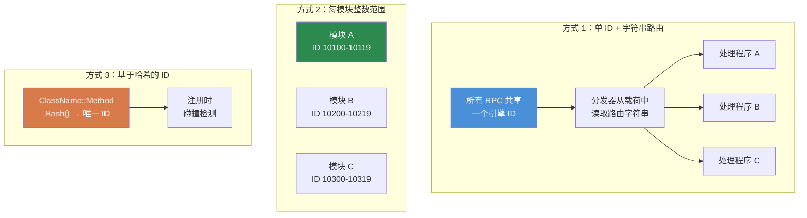

# 第 7.3 章：RPC 通信模式

[首页](../../README.md) | [<< 上一章：模块系统](02-module-systems.md) | **RPC 通信模式** | [下一章：配置持久化 >>](04-config-persistence.md)

---

## 简介

远程过程调用（RPC）是 DayZ 中客户端和服务器之间发送数据的唯一方式。每个管理面板、每个同步的 UI、每个服务器到客户端的通知，以及每个客户端到服务器的操作请求都通过 RPC 进行。理解如何正确构建它们——使用正确的序列化顺序、权限检查和错误处理——对于任何不仅仅是向 CfgVehicles 添加物品的 mod 都至关重要。

本章涵盖基本的 `ScriptRPC` 模式、客户端-服务器往返生命周期、错误处理，然后比较 DayZ modding 社区使用的三种主要 RPC 路由方式。

---

## 目录

- [ScriptRPC 基础](#scriptrpc-基础)
- [客户端到服务器到客户端往返](#客户端到服务器到客户端往返)
- [执行前的权限检查](#执行前的权限检查)
- [错误处理和通知](#错误处理和通知)
- [序列化：读写契约](#序列化读写契约)
- [三种 RPC 方式对比](#三种-rpc-方式对比)
- [常见错误](#常见错误)
- [最佳实践](#最佳实践)

---

## ScriptRPC 基础

DayZ 中的每个 RPC 都使用 `ScriptRPC` 类。模式始终相同：创建、写入数据、发送。

### 发送端

```c
void SendDamageReport(PlayerIdentity target, string weaponName, float damage)
{
    ScriptRPC rpc = new ScriptRPC();

    // 按特定顺序写入字段
    rpc.Write(weaponName);    // 字段 1：string
    rpc.Write(damage);        // 字段 2：float

    // 通过引擎发送
    // 参数：目标对象、RPC ID、保证送达、接收者
    rpc.Send(null, MY_RPC_ID, true, target);
}
```

### 接收端

接收端按**完全相同的顺序**读取写入时的字段：

```c
void OnRPC_DamageReport(PlayerIdentity sender, Object target, ParamsReadContext ctx)
{
    string weaponName;
    if (!ctx.Read(weaponName)) return;  // 字段 1：string

    float damage;
    if (!ctx.Read(damage)) return;      // 字段 2：float

    // 使用数据
    Print("Hit by " + weaponName + " for " + damage.ToString() + " damage");
}
```

### Send 参数说明

```c
rpc.Send(object, rpcId, guaranteed, identity);
```

| 参数 | 类型 | 描述 |
|-----------|------|-------------|
| `object` | `Object` | 目标实体（例如玩家或车辆）。全局 RPC 使用 `null`。|
| `rpcId` | `int` | 标识此 RPC 类型的整数。两端必须匹配。|
| `guaranteed` | `bool` | `true` = 可靠的（类似 TCP，丢包时重传）。`false` = 不可靠的（发射即忘）。|
| `identity` | `PlayerIdentity` | 接收者。客户端 `null` = 发送到服务器。服务器 `null` = 广播到所有客户端。指定 identity = 仅发送到该客户端。|

### 何时使用 `guaranteed`

- **`true`（可靠）：** 配置更改、权限授予、传送命令、封禁操作——任何丢包会导致客户端和服务器不同步的内容。
- **`false`（不可靠）：** 快速位置更新、视觉效果、每几秒刷新一次的 HUD 状态。更低的开销，没有重传队列。

---

## 客户端到服务器到客户端往返

最常见的 RPC 模式是往返：客户端请求操作，服务器验证并执行，服务器发回结果。

```
客户端                          服务器
  │                               │
  │  1. 请求 RPC ──────────────►  │
  │     （操作 + 参数）           │
  │                               │  2. 验证权限
  │                               │  3. 执行操作
  │                               │  4. 准备响应
  │  ◄─────────── 5. 响应 RPC    │
  │     （结果 + 数据）           │
  │                               │
  │  6. 更新 UI                  │
```

### 完整示例：传送请求

**客户端发送请求：**

```c
class TeleportClient
{
    void RequestTeleport(vector position)
    {
        ScriptRPC rpc = new ScriptRPC();
        rpc.Write(position);
        rpc.Send(null, MY_RPC_TELEPORT, true, null);  // null identity = 发送到服务器
    }
};
```

**服务器接收、验证、执行、响应：**

```c
class TeleportServer
{
    void OnRPC_TeleportRequest(PlayerIdentity sender, Object target, ParamsReadContext ctx)
    {
        // 1. 读取请求数据
        vector position;
        if (!ctx.Read(position)) return;

        // 2. 验证权限
        if (!MyPermissions.GetInstance().HasPermission(sender.GetPlainId(), "MyMod.Admin.Teleport"))
        {
            SendError(sender, "No permission to teleport");
            return;
        }

        // 3. 验证数据
        if (position[1] < 0 || position[1] > 1000)
        {
            SendError(sender, "Invalid teleport height");
            return;
        }

        // 4. 执行操作
        PlayerBase player = PlayerBase.Cast(sender.GetPlayer());
        if (!player) return;

        player.SetPosition(position);

        // 5. 发送成功响应
        ScriptRPC response = new ScriptRPC();
        response.Write(true);           // 成功标志
        response.Write(position);       // 回传位置
        response.Send(null, MY_RPC_TELEPORT_RESULT, true, sender);
    }
};
```

**客户端接收响应：**

```c
class TeleportClient
{
    void OnRPC_TeleportResult(PlayerIdentity sender, Object target, ParamsReadContext ctx)
    {
        bool success;
        if (!ctx.Read(success)) return;

        vector position;
        if (!ctx.Read(position)) return;

        if (success)
        {
            // 更新 UI："已传送到 X, Y, Z"
        }
    }
};
```

---

## 执行前的权限检查

每个执行特权操作的服务器端 RPC 处理程序**必须**在执行前检查权限。永远不要信任客户端。

### 模式

```c
void OnRPC_AdminAction(PlayerIdentity sender, Object target, ParamsReadContext ctx)
{
    // 规则 1：始终验证发送者存在
    if (!sender) return;

    // 规则 2：在读取数据之前检查权限
    if (!MyPermissions.GetInstance().HasPermission(sender.GetPlainId(), "MyMod.Admin.Ban"))
    {
        MyLog.Warning("BanRPC", "Unauthorized ban attempt from " + sender.GetName());
        return;
    }

    // 规则 3：现在才读取并执行
    string targetUid;
    if (!ctx.Read(targetUid)) return;

    // ... 执行封禁
}
```

### 为什么在读取之前检查？

从未授权的客户端读取数据会浪费服务器周期。更重要的是，来自恶意客户端的畸形数据可能导致解析错误。先检查权限是一个低成本的守卫，能立即拒绝恶意参与者。

### 记录未授权的尝试

始终记录失败的权限检查。这创建了审计跟踪，帮助服务器所有者检测漏洞利用尝试：

```c
if (!HasPermission(sender, "MyMod.Spawn"))
{
    MyLog.Warning("SpawnRPC", "Denied spawn request from "
        + sender.GetName() + " (" + sender.GetPlainId() + ")");
    return;
}
```

---

## 错误处理和通知

RPC 可能以多种方式失败：网络中断、畸形数据、服务器端验证失败。健壮的 mod 处理所有这些情况。

### 读取失败

每个 `ctx.Read()` 都可能失败。始终检查返回值：

```c
// 差：忽略读取失败
string name;
ctx.Read(name);     // 如果失败，name 为 "" — 静默损坏
int count;
ctx.Read(count);    // 这读取了错误的字节 — 之后的一切都是垃圾数据

// 好：任何读取失败时立即返回
string name;
if (!ctx.Read(name)) return;
int count;
if (!ctx.Read(count)) return;
```

### 错误响应模式

当服务器拒绝请求时，发送结构化错误给客户端，以便 UI 可以显示：

```c
// 服务器：发送错误
void SendError(PlayerIdentity target, string errorMsg)
{
    ScriptRPC rpc = new ScriptRPC();
    rpc.Write(false);        // success = false
    rpc.Write(errorMsg);     // 原因
    rpc.Send(null, MY_RPC_RESPONSE_ID, true, target);
}

// 客户端：处理错误
void OnRPC_Response(PlayerIdentity sender, Object target, ParamsReadContext ctx)
{
    bool success;
    if (!ctx.Read(success)) return;

    if (!success)
    {
        string errorMsg;
        if (!ctx.Read(errorMsg)) return;

        // 在 UI 中显示错误
        MyLog.Warning("MyMod", "Server error: " + errorMsg);
        return;
    }

    // 处理成功...
}
```

### 通知广播

对于所有客户端都应看到的事件（击杀信息、公告、天气变化），服务器使用 `identity = null` 进行广播：

```c
// 服务器：广播到所有客户端
void BroadcastAnnouncement(string message)
{
    ScriptRPC rpc = new ScriptRPC();
    rpc.Write(message);
    rpc.Send(null, RPC_ANNOUNCEMENT, true, null);  // null = 所有客户端
}
```

---

## 序列化：读写契约

DayZ RPC 的最重要规则：**读取顺序必须与写入顺序完全匹配，类型对类型。**

### 契约

```c
// 发送端写入：
rpc.Write("hello");      // 1. string
rpc.Write(42);           // 2. int
rpc.Write(3.14);         // 3. float
rpc.Write(true);         // 4. bool

// 接收端以相同顺序读取：
string s;   ctx.Read(s);     // 1. string
int i;      ctx.Read(i);     // 2. int
float f;    ctx.Read(f);     // 3. float
bool b;     ctx.Read(b);     // 4. bool
```

### 顺序不匹配时会发生什么

如果你交换了读取顺序，反序列化器会将用于一种类型的字节解释为另一种类型。在 `string` 位置读取 `int` 会产生垃圾数据，之后的每次读取都会偏移——损坏所有剩余字段。引擎不会抛出异常；它静默返回错误数据或导致 `Read()` 返回 `false`。

### 支持的类型

| 类型 | 说明 |
|------|-------|
| `int` | 32 位有符号 |
| `float` | 32 位 IEEE 754 |
| `bool` | 单字节 |
| `string` | 长度前缀 UTF-8 |
| `vector` | 三个 float（x, y, z）|
| `Object`（作为 target 参数）| 实体引用，由引擎解析 |

### 序列化集合

没有内置的数组序列化。先写入计数，然后写入每个元素：

```c
// 发送端
array<string> names = {"Alice", "Bob", "Charlie"};
rpc.Write(names.Count());
for (int i = 0; i < names.Count(); i++)
{
    rpc.Write(names[i]);
}

// 接收端
int count;
if (!ctx.Read(count)) return;

array<string> names = new array<string>();
for (int i = 0; i < count; i++)
{
    string name;
    if (!ctx.Read(name)) return;
    names.Insert(name);
}
```

### 序列化复杂对象

对于复杂数据，逐字段序列化。不要试图通过 `Write()` 直接传递对象：

```c
// 发送端：将对象展平为原语
rpc.Write(player.GetName());
rpc.Write(player.GetHealth());
rpc.Write(player.GetPosition());

// 接收端：重建
string name;    ctx.Read(name);
float health;   ctx.Read(health);
vector pos;     ctx.Read(pos);
```

---

## 三种 RPC 方式对比

DayZ modding 社区使用三种根本不同的 RPC 路由方式。每种都有其权衡。

### 三种 RPC 方式对比



### 1. CF 命名 RPC

Community Framework 提供 `GetRPCManager()`，按 mod 命名空间分组的字符串名称路由 RPC。

```c
// 注册（在 OnInit 中）：
GetRPCManager().AddRPC("MyMod", "RPC_SpawnItem", this, SingleplayerExecutionType.Server);

// 从客户端发送：
GetRPCManager().SendRPC("MyMod", "RPC_SpawnItem", new Param1<string>("AK74"), true);

// 处理程序接收：
void RPC_SpawnItem(CallType type, ParamsReadContext ctx, PlayerIdentity sender, Object target)
{
    if (type != CallType.Server) return;

    Param1<string> data;
    if (!ctx.Read(data)) return;

    string className = data.param1;
    // ... 生成物品
}
```

**优点：**
- 基于字符串的路由可读性强且无碰撞
- 命名空间分组（`"MyMod"`）防止 mod 间名称冲突
- 广泛使用——如果你与 COT/Expansion 集成，你就用这个

**缺点：**
- 需要 CF 作为依赖
- 使用 `Param` 包装器，对复杂载荷来说很冗长
- 每次分发都进行字符串比较（微小开销）

### 2. COT / 原版整数范围 RPC

原版 DayZ 和 COT 的某些部分使用原始整数 RPC ID。每个 mod 占用一个整数范围，在 modded `OnRPC` 覆盖中分发。

```c
// 定义你的 RPC ID（选择唯一范围以避免碰撞）
const int MY_RPC_SPAWN_ITEM     = 90001;
const int MY_RPC_DELETE_ITEM    = 90002;
const int MY_RPC_TELEPORT       = 90003;

// 发送：
ScriptRPC rpc = new ScriptRPC();
rpc.Write("AK74");
rpc.Send(null, MY_RPC_SPAWN_ITEM, true, null);

// 接收（在 modded DayZGame 或实体中）：
modded class DayZGame
{
    override void OnRPC(PlayerIdentity sender, Object target, int rpc_type, ParamsReadContext ctx)
    {
        switch (rpc_type)
        {
            case MY_RPC_SPAWN_ITEM:
                HandleSpawnItem(sender, ctx);
                return;
            case MY_RPC_DELETE_ITEM:
                HandleDeleteItem(sender, ctx);
                return;
        }

        super.OnRPC(sender, target, rpc_type, ctx);
    }
};
```

**优点：**
- 无依赖——与原版 DayZ 配合使用
- 整数比较速度快
- 完全控制 RPC 管道

**缺点：**
- **ID 碰撞风险**：两个 mod 选择相同的整数范围会静默截获彼此的 RPC
- 手动分发逻辑（switch/case）在 RPC 多时变得难以管理
- 没有命名空间隔离
- 没有内置注册表或可发现性

### 3. 自定义字符串路由 RPC

自定义字符串路由系统使用单个引擎 RPC ID，通过在每个 RPC 中写入 mod 名称 + 函数名称作为字符串头来进行多路复用。所有路由都在静态管理器类（此例中为 `MyRPC`）内部进行。

```c
// 注册：
MyRPC.Register("MyMod", "RPC_SpawnItem", this, MyRPCSide.SERVER);

// 发送（仅头部，无载荷）：
MyRPC.Send("MyMod", "RPC_SpawnItem", null, true, null);

// 发送（带载荷）：
ScriptRPC rpc = MyRPC.CreateRPC("MyMod", "RPC_SpawnItem");
rpc.Write("AK74");
rpc.Write(5);    // 数量
rpc.Send(null, MyRPC.FRAMEWORK_RPC_ID, true, null);

// 处理程序：
void RPC_SpawnItem(PlayerIdentity sender, Object target, ParamsReadContext ctx)
{
    string className;
    if (!ctx.Read(className)) return;

    int quantity;
    if (!ctx.Read(quantity)) return;

    // ... 生成物品
}
```

**优点：**
- 零碰撞风险——字符串命名空间 + 函数名称全局唯一
- 不依赖 CF（但当 CF 存在时可选地桥接到 CF 的 `GetRPCManager()`）
- 单个引擎 ID 意味着最小的钩子足迹
- `CreateRPC()` 辅助函数预写路由头，你只需写载荷
- 干净的处理程序签名：`(PlayerIdentity, Object, ParamsReadContext)`

**缺点：**
- 每个 RPC 多两次字符串读取（路由头）——实际开销极小
- 自定义系统意味着其他 mod 无法通过 CF 的注册表发现你的 RPC
- 仅通过 `CallFunctionParams` 反射分发，比直接方法调用略慢

### 对比表

| 功能 | CF 命名 | 整数范围 | 自定义字符串路由 |
|---------|----------|---------------|---------------------|
| **碰撞风险** | 无（有命名空间）| 高 | 无（有命名空间）|
| **依赖** | 需要 CF | 无 | 无 |
| **处理程序签名** | `(CallType, ctx, sender, target)` | 自定义 | `(sender, target, ctx)` |
| **可发现性** | CF 注册表 | 无 | `MyRPC.s_Handlers` |
| **分发开销** | 字符串查找 | 整数 switch | 字符串查找 |
| **载荷风格** | Param 包装器 | 原始 Write/Read | 原始 Write/Read |
| **CF 桥接** | 原生 | 手动 | 自动（`#ifdef`）|

### 你应该使用哪种？

- **你的 mod 已经依赖 CF**（COT/Expansion 集成）：使用 CF 命名 RPC
- **独立 mod，最小依赖**：使用整数范围或构建字符串路由系统
- **构建框架**：考虑像上面自定义 `MyRPC` 模式的字符串路由系统
- **学习/原型设计**：整数范围最容易理解

---

## 常见错误

### 1. 忘记注册处理程序

你发送了 RPC 但对面什么都没发生。处理程序从未注册。

```c
// 错误：没有注册——服务器永远不知道这个处理程序
class MyModule
{
    void RPC_DoThing(PlayerIdentity sender, Object target, ParamsReadContext ctx) { ... }
};

// 正确：在 OnInit 中注册
class MyModule
{
    void OnInit()
    {
        MyRPC.Register("MyMod", "RPC_DoThing", this, MyRPCSide.SERVER);
    }

    void RPC_DoThing(PlayerIdentity sender, Object target, ParamsReadContext ctx) { ... }
};
```

### 2. 读/写顺序不匹配

最常见的 RPC bug。发送端写入 `(string, int, float)` 但接收端读取 `(string, float, int)`。没有错误消息——只有垃圾数据。

**修复：** 在发送端和接收端都写注释块记录字段顺序：

```c
// 线路格式：[string weaponName] [int damage] [float distance]
```

### 3. 向服务器发送仅客户端数据

服务器无法读取客户端的 widget 状态、输入状态或本地变量。如果你需要向服务器发送 UI 选择，序列化相关值（字符串、索引、ID）——而不是 widget 对象本身。

### 4. 想单播时却广播了

```c
// 错误：发送到所有客户端，而你只想发给一个
rpc.Send(null, MY_RPC_ID, true, null);

// 正确：发送到特定客户端
rpc.Send(null, MY_RPC_ID, true, targetIdentity);
```

### 5. 在任务重启时未处理过期处理程序

如果模块注册了 RPC 处理程序然后在任务结束时被销毁，处理程序仍然指向已销毁的对象。下次 RPC 分发将崩溃。

**修复：** 始终在任务结束时注销或清理处理程序：

```c
override void OnMissionFinish()
{
    MyRPC.Unregister("MyMod", "RPC_DoThing");
}
```

或使用集中的 `Cleanup()` 来清除整个处理程序映射（如 `MyRPC.Cleanup()` 所做的）。

---

## 最佳实践

1. **始终检查 `ctx.Read()` 返回值。** 每次读取都可能失败。失败时立即返回。

2. **始终在服务器上验证发送者。** 在做任何事情之前，检查 `sender` 非空且具有所需权限。

3. **记录线路格式。** 在发送端和接收端都写注释，列出按顺序排列的字段及其类型。

4. **对状态变更使用可靠传输。** 不可靠传输仅适用于快速的、短暂的更新（位置、效果）。

5. **保持载荷小。** DayZ 有实际的单 RPC 大小限制。对于大数据（配置同步、玩家列表），拆分为多个 RPC 或使用分页。

6. **尽早注册处理程序。** `OnInit()` 是最安全的位置。客户端可以在 `OnMissionStart()` 完成之前连接。

7. **在关闭时清理处理程序。** 要么逐个注销，要么在 `OnMissionFinish()` 中清除整个注册表。

8. **载荷用 `CreateRPC()`，信号用 `Send()`。** 如果没有数据要发送（只是"执行"信号），使用仅头部的 `Send()`。如果有数据，使用 `CreateRPC()` + 手动写入 + 手动 `rpc.Send()`。

---

## 兼容性与影响

- **多 Mod：** 整数范围 RPC 容易碰撞——两个 mod 选择相同的 ID 会静默截获彼此的消息。字符串路由或 CF 命名 RPC 通过使用命名空间 + 函数名称作为键来避免这个问题。
- **加载顺序：** RPC 处理程序注册顺序仅在多个 mod `modded class DayZGame` 并覆盖 `OnRPC` 时才重要。每个都必须为未处理的 ID 调用 `super.OnRPC()`，否则下游 mod 永远不会收到其 RPC。字符串路由系统通过使用单个引擎 ID 避免了这个问题。
- **Listen 服务器：** 在 listen 服务器上，客户端和服务器在同一进程中运行。从服务器端用 `identity = null` 发送的 RPC 也会在本地接收。用 `if (type != CallType.Server) return;` 守卫处理程序，或适当检查 `GetGame().IsServer()` / `GetGame().IsClient()`。
- **性能：** RPC 分发开销很小（字符串查找或整数 switch）。瓶颈是载荷大小——DayZ 有约 64 KB 的实际单 RPC 限制。对于大数据（配置同步），跨多个 RPC 分页。
- **迁移：** RPC ID 是 mod 内部细节，不受 DayZ 版本更新影响。如果你更改了 RPC 线路格式（添加/删除字段），旧客户端与新服务器通信会静默不同步。对 RPC 载荷进行版本控制或强制客户端更新。

---

## 理论与实践

| 教科书说 | DayZ 现实 |
|---------------|-------------|
| 使用 protocol buffers 或基于 schema 的序列化 | Enforce Script 没有 protobuf 支持；你需要手动按匹配顺序 `Write`/`Read` 原语 |
| 使用 schema 强制验证所有输入 | 不存在 schema 验证；每个 `ctx.Read()` 返回值必须逐个检查 |
| RPC 应该是幂等的 | 在 DayZ 中仅对查询 RPC 实用；变更 RPC（生成、删除、传送）本质上不是幂等的——用权限检查代替 |

---

[首页](../../README.md) | [<< 上一章：模块系统](02-module-systems.md) | **RPC 通信模式** | [下一章：配置持久化 >>](04-config-persistence.md)
