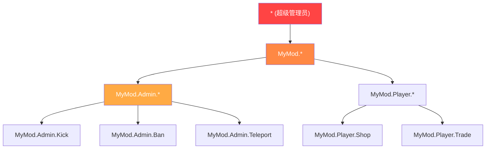

# 第7.5章：权限系统

[首页](../../README.md) | [<< 上一章：配置持久化](04-config-persistence.md) | **权限系统** | [下一章：事件驱动架构 >>](06-events.md)

---

## 简介

DayZ 中的每个管理工具、每个特权操作以及每个管理功能都需要一个权限系统。问题不在于是否检查权限，而在于如何构建权限结构。DayZ 模组社区已经形成了三种主要模式：层级化点分隔权限、用户组角色分配（VPP）以及框架级别的基于角色的访问控制（CF/COT）。每种模式在粒度、复杂性和服务器管理员体验方面都有不同的权衡。

本章涵盖了所有三种模式、权限检查流程、存储格式以及通配符/超级管理员处理。

---

## 目录

- [为什么权限很重要](#why-permissions-matter)
- [层级化点分隔权限（MyMod 模式）](#hierarchical-dot-separated-mymod-pattern)
- [VPP UserGroup 模式](#vpp-usergroup-pattern)
- [CF 基于角色的模式（COT）](#cf-role-based-pattern-cot)
- [权限检查流程](#permission-checking-flow)
- [存储格式](#storage-formats)
- [通配符和超级管理员模式](#wildcard-and-superadmin-patterns)
- [系统间迁移](#migration-between-systems)
- [最佳实践](#best-practices)

---

## 为什么权限很重要

没有权限系统，你只有两个选择：要么每个玩家都能做任何事情（一片混乱），要么在脚本中硬编码 Steam64 ID（不可维护）。权限系统让服务器管理员无需修改代码就能定义谁可以做什么。

三条安全规则：

1. **永远不要信任客户端。** 客户端发送请求；服务器决定是否执行。
2. **默认拒绝。** 如果玩家没有被明确授予某个权限，他就没有该权限。
3. **失败时关闭。** 如果权限检查本身失败（空身份、损坏的数据），拒绝该操作。

---

## 层级化点分隔权限（MyMod 模式）

MyMod 使用以树形层级组织的点分隔权限字符串。每个权限都是一个路径，如 `"MyMod.Admin.Teleport"` 或 `"MyMod.Missions.Start"`。通配符允许授予整个子树。

### 权限格式

```
MyMod                           （根命名空间）
├── Admin                        （管理工具）
│   ├── Panel                    （打开管理面板）
│   ├── Teleport                 （传送自己/他人）
│   ├── Kick                     （踢出玩家）
│   ├── Ban                      （封禁玩家）
│   └── Weather                  （更改天气）
├── Missions                     （任务系统）
│   ├── Start                    （手动启动任务）
│   └── Stop                     （停止任务）
└── AI                           （AI 系统）
    ├── Spawn                    （手动生成 AI）
    └── Config                   （编辑 AI 配置）
```

### 数据模型

每个玩家（通过 Steam64 ID 标识）拥有一个已授权权限字符串的数组：

```c
class MyPermissionsData
{
    // 键：Steam64 ID，值：权限字符串数组
    ref map<string, ref TStringArray> Admins;

    void MyPermissionsData()
    {
        Admins = new map<string, ref TStringArray>();
    }
};
```

### 权限检查

检查过程遍历玩家已授权的权限，支持三种匹配类型：精确匹配、完全通配符（`"*"`）和前缀通配符（`"MyMod.Admin.*"`）：

```c
bool HasPermission(string plainId, string permission)
{
    if (plainId == "" || permission == "")
        return false;

    TStringArray perms;
    if (!m_Permissions.Find(plainId, perms))
        return false;

    for (int i = 0; i < perms.Count(); i++)
    {
        string granted = perms[i];

        // 完全通配符：超级管理员
        if (granted == "*")
            return true;

        // 精确匹配
        if (granted == permission)
            return true;

        // 前缀通配符："MyMod.Admin.*" 匹配 "MyMod.Admin.Teleport"
        if (granted.IndexOf("*") > 0)
        {
            string prefix = granted.Substring(0, granted.Length() - 1);
            if (permission.IndexOf(prefix) == 0)
                return true;
        }
    }

    return false;
}
```

### JSON 存储

```json
{
    "Admins": {
        "76561198000000001": ["*"],
        "76561198000000002": ["MyMod.Admin.Panel", "MyMod.Admin.Teleport"],
        "76561198000000003": ["MyMod.Missions.*"],
        "76561198000000004": ["MyMod.Admin.Kick", "MyMod.Admin.Ban"]
    }
}
```

### 优点

- **细粒度：** 你可以精确授予每个管理员所需的权限
- **层级化：** 通配符可以授予整个子树，无需列出每个权限
- **自文档化：** 权限字符串本身就说明了它控制什么
- **可扩展：** 新权限只是新字符串——无需修改架构

### 缺点

- **没有命名角色：** 如果 10 个管理员需要相同的权限集，你需要列出 10 次
- **基于字符串：** 权限字符串中的拼写错误会静默失败（它们只是不匹配）

---

## VPP UserGroup 模式

VPP Admin Tools 使用基于组的系统。你定义具有权限集的命名组（角色），然后将玩家分配到组中。

### 概念

```
组：
  "SuperAdmin"  → [所有权限]
  "Moderator"   → [踢出, 封禁, 禁言, 传送]
  "Builder"     → [生成物体, 传送, ESP]

玩家：
  "76561198000000001" → "SuperAdmin"
  "76561198000000002" → "Moderator"
  "76561198000000003" → "Builder"
```

### 实现模式

```c
class VPPUserGroup
{
    string GroupName;
    ref array<string> Permissions;
    ref array<string> Members;  // Steam64 ID

    bool HasPermission(string permission)
    {
        if (!Permissions) return false;

        for (int i = 0; i < Permissions.Count(); i++)
        {
            if (Permissions[i] == permission)
                return true;
            if (Permissions[i] == "*")
                return true;
        }
        return false;
    }
};

class VPPPermissionManager
{
    ref array<ref VPPUserGroup> m_Groups;

    bool PlayerHasPermission(string plainId, string permission)
    {
        for (int i = 0; i < m_Groups.Count(); i++)
        {
            VPPUserGroup group = m_Groups[i];

            // 检查玩家是否在此组中
            if (group.Members.Find(plainId) == -1)
                continue;

            if (group.HasPermission(permission))
                return true;
        }
        return false;
    }
};
```

### JSON 存储

```json
{
    "Groups": [
        {
            "GroupName": "SuperAdmin",
            "Permissions": ["*"],
            "Members": ["76561198000000001"]
        },
        {
            "GroupName": "Moderator",
            "Permissions": [
                "admin.kick",
                "admin.ban",
                "admin.mute",
                "admin.teleport"
            ],
            "Members": [
                "76561198000000002",
                "76561198000000003"
            ]
        },
        {
            "GroupName": "Builder",
            "Permissions": [
                "admin.spawn",
                "admin.teleport",
                "admin.esp"
            ],
            "Members": [
                "76561198000000004"
            ]
        }
    ]
}
```

### 优点

- **基于角色：** 定义一次角色，分配给多个玩家
- **易于理解：** 服务器管理员从其他游戏中了解组/角色系统
- **易于批量更改：** 更改组的权限，所有成员都会更新

### 缺点

- **粒度较低：** 给一个特定管理员额外添加一个权限意味着创建新组或添加每用户覆盖
- **组继承复杂：** VPP 不原生支持组层级（例如，"Admin" 继承所有 "Moderator" 权限）

---

## CF 基于角色的模式（COT）

Community Framework / COT 使用角色和权限系统，其中角色通过显式权限集定义，玩家被分配到角色中。

### 概念

CF 的权限系统类似于 VPP 的组，但集成在框架层级，使其对所有基于 CF 的模组可用：

```c
// COT 模式（简化版）
// 角色在 AuthFile.json 中定义
// 每个角色有一个名称和一个权限数组
// 玩家通过 Steam64 ID 分配到角色

class CF_Permission
{
    string m_Name;
    ref array<ref CF_Permission> m_Children;
    int m_State;  // ALLOW, DENY, INHERIT
};
```

### 权限树

CF 将权限表示为树结构，每个节点可以被显式允许、拒绝或从父节点继承：

```
Root
├── Admin [ALLOW]
│   ├── Kick [INHERIT → ALLOW]
│   ├── Ban [INHERIT → ALLOW]
│   └── Teleport [DENY]        ← 即使 Admin 是 ALLOW，也被显式拒绝
└── ESP [ALLOW]
```

这种三态系统（允许/拒绝/继承）比 MyMod 和 VPP 使用的二元（已授予/未授予）系统更具表达力。它允许你授予一个广泛的类别，然后划出例外。

### JSON 存储

```json
{
    "Roles": {
        "Moderator": {
            "admin": {
                "kick": 2,
                "ban": 2,
                "teleport": 1
            }
        }
    },
    "Players": {
        "76561198000000001": {
            "Role": "SuperAdmin"
        }
    }
}
```

（其中 `2 = ALLOW`，`1 = DENY`，`0 = INHERIT`）

### 优点

- **三态权限：** 允许、拒绝、继承提供最大灵活性
- **树结构：** 镜像权限路径的层级性质
- **框架级别：** 所有 CF 模组共享同一个权限系统

### 缺点

- **复杂性：** 三种状态比简单的"已授予"更难让服务器管理员理解
- **依赖 CF：** 仅适用于 Community Framework

---

## 权限检查流程

无论你使用哪种系统，服务器端的权限检查都遵循相同的模式：

```
客户端发送 RPC 请求
        │
        ▼
服务器 RPC 处理程序接收请求
        │
        ▼
    ┌─────────────────────────────────┐
    │ 发送者身份是否非空？              │
    │ （网络级别验证）                  │
    └───────────┬─────────────────────┘
                │ 否 → 返回（静默丢弃）
                │ 是 ▼
    ┌─────────────────────────────────┐
    │ 发送者是否拥有此操作所需的权限？   │
    └───────────┬─────────────────────┘
                │ 否 → 记录警告，可选地向客户端发送错误，返回
                │ 是 ▼
    ┌─────────────────────────────────┐
    │ 验证请求数据                     │
    │ （读取参数，检查范围）             │
    └───────────┬─────────────────────┘
                │ 无效 → 向客户端发送错误，返回
                │ 有效 ▼
    ┌─────────────────────────────────┐
    │ 执行特权操作                     │
    │ 记录操作及管理员 ID              │
    │ 发送成功响应                     │
    └─────────────────────────────────┘
```

### 实现

```c
void OnRPC_KickPlayer(PlayerIdentity sender, Object target, ParamsReadContext ctx)
{
    // 步骤 1：验证发送者
    if (!sender) return;

    // 步骤 2：检查权限
    if (!MyPermissions.GetInstance().HasPermission(sender.GetPlainId(), "MyMod.Admin.Kick"))
    {
        MyLog.Warning("Admin", "Unauthorized kick attempt: " + sender.GetName());
        return;
    }

    // 步骤 3：读取和验证数据
    string targetUid;
    if (!ctx.Read(targetUid)) return;

    if (targetUid == sender.GetPlainId())
    {
        // 不能踢出自己
        SendError(sender, "Cannot kick yourself");
        return;
    }

    // 步骤 4：执行
    PlayerIdentity targetIdentity = FindPlayerByUid(targetUid);
    if (!targetIdentity)
    {
        SendError(sender, "Player not found");
        return;
    }

    GetGame().DisconnectPlayer(targetIdentity);

    // 步骤 5：记录日志和响应
    MyLog.Info("Admin", sender.GetName() + " kicked " + targetIdentity.GetName());
    SendSuccess(sender, "Player kicked");
}
```

---

## 存储格式

所有三种系统都将权限存储在 JSON 中。差异在于结构上：

### 扁平化每玩家存储

```json
{
    "Admins": {
        "STEAM64_ID": ["perm.a", "perm.b", "perm.c"]
    }
}
```

**文件：** 所有玩家一个文件。
**优点：** 简单，易于手动编辑。
**缺点：** 如果多个玩家共享相同权限则存在冗余。

### 每玩家文件（Expansion / 玩家数据）

```json
// 文件：$profile:MyMod/Players/76561198xxxxx.json
{
    "UID": "76561198xxxxx",
    "Permissions": ["perm.a", "perm.b"],
    "LastLogin": "2025-01-15 14:30:00"
}
```

**优点：** 每个玩家独立；无锁定问题。
**缺点：** 大量小文件；搜索"谁拥有权限 X？"需要扫描所有文件。

### 基于组（VPP）

```json
{
    "Groups": [
        {
            "GroupName": "RoleName",
            "Permissions": ["perm.a", "perm.b"],
            "Members": ["STEAM64_ID_1", "STEAM64_ID_2"]
        }
    ]
}
```

**优点：** 角色变更即时传播到所有成员。
**缺点：** 玩家无法轻松拥有每用户权限覆盖，除非创建专用组。

### 选择格式

| 因素 | 扁平化每玩家 | 每玩家文件 | 基于组 |
|--------|----------------|-----------------|-------------|
| **小型服务器（1-5 管理员）** | 最佳 | 过度 | 过度 |
| **中型服务器（5-20 管理员）** | 良好 | 良好 | 最佳 |
| **大型社区（20+ 角色）** | 冗余 | 文件增多 | 最佳 |
| **每用户自定义** | 原生支持 | 原生支持 | 需要变通 |
| **手动编辑** | 容易 | 按玩家容易 | 中等 |

---

## 通配符和超级管理员模式



### 完全通配符：`"*"`

授予所有权限。这是超级管理员模式。拥有 `"*"` 的玩家可以做任何事情。

```c
if (granted == "*")
    return true;
```

**约定：** DayZ 模组社区中的每个权限系统都使用 `"*"` 表示超级管理员。不要发明不同的约定。

### 前缀通配符：`"MyMod.Admin.*"`

授予以 `"MyMod.Admin."` 开头的所有权限。这允许授予整个子系统而无需列出每个权限：

```c
// "MyMod.Admin.*" 匹配：
//   "MyMod.Admin.Teleport"  ✓
//   "MyMod.Admin.Kick"      ✓
//   "MyMod.Admin.Ban"       ✓
//   "MyMod.Missions.Start"  ✗ （不同子树）
```

### 实现

```c
if (granted.IndexOf("*") > 0)
{
    // "MyMod.Admin.*" → prefix = "MyMod.Admin."
    string prefix = granted.Substring(0, granted.Length() - 1);
    if (permission.IndexOf(prefix) == 0)
        return true;
}
```

### 无否定权限（点分隔 / VPP）

点分隔和 VPP 系统都使用仅添加式权限。你可以授予权限但不能显式拒绝它们。如果一个权限不在玩家的列表中，它就被拒绝。

CF/COT 是例外，其三态系统（ALLOW/DENY/INHERIT）支持显式拒绝。

### 超级管理员快捷检查

提供一种无需检查特定权限即可判断某人是否为超级管理员的方法。这对于旁路逻辑很有用：

```c
bool IsSuperAdmin(string plainId)
{
    return HasPermission(plainId, "*");
}
```

---

## 系统间迁移

如果你的模组需要支持服务器从一种权限系统迁移到另一种（例如，从扁平管理员 UID 列表迁移到层级化权限），在加载时实现自动迁移：

```c
void Load()
{
    if (!FileExist(PERMISSIONS_FILE))
    {
        CreateDefaultFile();
        return;
    }

    // 首先尝试新格式
    if (LoadNewFormat())
        return;

    // 回退到旧格式并迁移
    LoadLegacyAndMigrate();
}

void LoadLegacyAndMigrate()
{
    // 读取旧格式：{ "AdminUIDs": ["uid1", "uid2"] }
    LegacyPermissionData legacyData = new LegacyPermissionData();
    JsonFileLoader<LegacyPermissionData>.JsonLoadFile(PERMISSIONS_FILE, legacyData);

    // 迁移：每个旧管理员在新系统中成为超级管理员
    for (int i = 0; i < legacyData.AdminUIDs.Count(); i++)
    {
        string uid = legacyData.AdminUIDs[i];
        GrantPermission(uid, "*");
    }

    // 以新格式保存
    Save();
    MyLog.Info("Permissions", "Migrated " + legacyData.AdminUIDs.Count().ToString()
        + " admin(s) from legacy format");
}
```

这是一种常见模式，用于将原始的扁平 `AdminUIDs` 数组迁移到层级化的 `Admins` 映射。

---

## 最佳实践

1. **默认拒绝。** 如果一个权限没有被明确授予，答案就是"否"。

2. **在服务器端检查，永远不要在客户端。** 客户端权限检查仅用于 UI 便利（隐藏按钮）。服务器必须始终重新验证。

3. **使用 `"*"` 表示超级管理员。** 这是通用约定。不要发明 `"all"`、`"admin"` 或 `"root"`。

4. **记录每个被拒绝的特权操作。** 这是你的安全审计追踪。

5. **提供带有占位符的默认权限文件。** 新服务器管理员应该看到一个清晰的示例：

```json
{
    "Admins": {
        "PUT_STEAM64_ID_HERE": ["*"]
    }
}
```

6. **为你的权限添加命名空间。** 使用 `"YourMod.Category.Action"` 以避免与其他模组冲突。

7. **支持前缀通配符。** 服务器管理员应该能够授予 `"YourMod.Admin.*"` 而不是逐个列出每个管理员权限。

8. **保持权限文件可手动编辑。** 服务器管理员会手动编辑它。在 JSON 中使用清晰的键名，每行一个权限，并在模组文档中记录可用权限。

9. **从第一天就实现迁移。** 当你的权限格式更改时（它会的），自动迁移可以避免支持工单。

10. **在连接时将权限同步到客户端。** 客户端需要知道自己的权限以便于 UI 使用（显示/隐藏管理员按钮）。在连接时发送摘要；不要发送整个服务器权限文件。

---

## 兼容性与影响

- **多模组：** 每个模组可以定义自己的权限命名空间（`"ModA.Admin.Kick"`、`"ModB.Build.Spawn"`）。`"*"` 通配符在共享同一权限存储的*所有*模组中授予超级管理员权限。如果模组使用独立的权限文件，`"*"` 仅在该模组的范围内适用。
- **加载顺序：** 权限文件在服务器启动时加载一次。只要每个模组读取自己的文件，就不会有跨模组排序问题。如果共享框架（CF/COT）管理权限，使用该框架的所有模组共享同一个权限树。
- **监听服务器：** 权限检查应始终在服务器端运行。在监听服务器上，客户端代码可以调用 `HasPermission()` 进行 UI 筛选（显示/隐藏管理员按钮），但服务器端检查是权威的。
- **性能：** 权限检查是每个玩家的字符串数组线性扫描。在典型的管理员数量（1-20 个管理员，每人 5-30 个权限）下，这可以忽略不计。对于极大的权限集，考虑使用 `set<string>` 代替数组以实现 O(1) 查找。
- **迁移：** 添加新的权限字符串是非破坏性的——现有管理员在被授予之前根本没有新权限。重命名权限会静默破坏现有授权。使用配置版本控制来自动迁移重命名的权限字符串。

---

## 常见错误

| 错误 | 影响 | 修复方法 |
|---------|--------|-----|
| 信任客户端发送的权限数据 | 被利用的客户端发送"我是管理员"，服务器就信了；完全的服务器入侵 | 永远不要从 RPC 负载中读取权限；始终在服务器端权限存储中查找 `sender.GetPlainId()` |
| 缺少默认拒绝 | 缺少权限检查会授予所有人访问权限；意外的权限提升 | 每个特权操作的 RPC 处理程序都必须检查 `HasPermission()` 并在失败时提前返回 |
| 权限字符串拼写错误静默失败 | `"MyMod.Amin.Kick"`（拼写错误）永远不匹配——管理员无法踢人，没有错误日志 | 将权限字符串定义为 `static const` 变量；引用常量，永远不要使用原始字符串字面量 |
| 向客户端发送完整权限文件 | 向任何连接的客户端暴露所有管理员 Steam64 ID 及其权限集 | 仅发送请求玩家自己的权限列表，永远不要发送完整的服务器文件 |
| HasPermission 中不支持通配符 | 服务器管理员必须为每个管理员列出每一个权限；繁琐且容易出错 | 从第一天就实现前缀通配符（`"MyMod.Admin.*"`）和完全通配符（`"*"`） |

---

## 理论与实践

| 教科书说 | DayZ 现实 |
|---------------|-------------|
| 使用带有组继承的 RBAC（基于角色的访问控制） | 只有 CF/COT 支持三态权限；大多数模组为了简单使用扁平化的每玩家授权 |
| 权限应存储在数据库中 | 无法访问数据库；`$profile:` 中的 JSON 文件是唯一选择 |
| 使用加密令牌进行授权 | Enforce Script 中没有加密库；信任基于引擎验证的 `PlayerIdentity.GetPlainId()`（Steam64 ID） |

---

[首页](../../README.md) | [<< 上一章：配置持久化](04-config-persistence.md) | **权限系统** | [下一章：事件驱动架构 >>](06-events.md)
