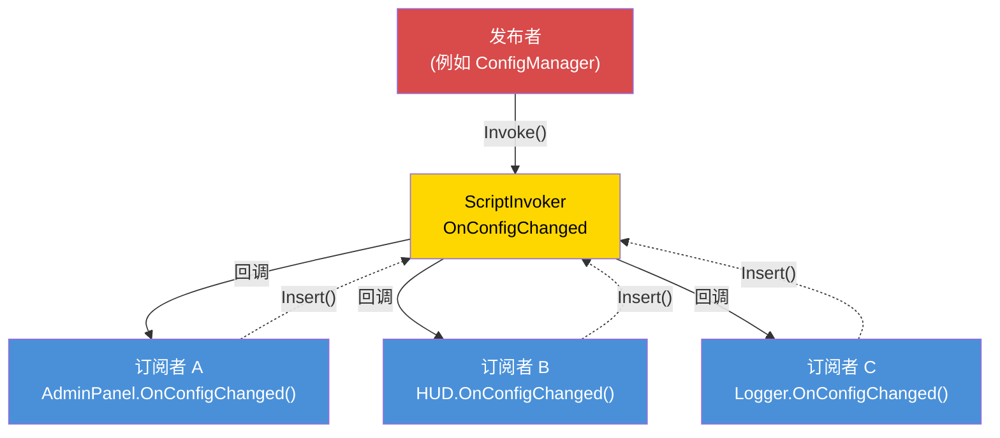

# 第 7.6 章：事件驱动架构

[首页](../../README.md) | [<< 上一章：权限系统](05-permissions.md) | **事件驱动架构** | [下一章：性能优化 >>](07-performance.md)

---

## 简介

事件驱动架构将事件的生产者与消费者解耦。当玩家连接时，连接处理器不需要知道击杀信息、管理面板、任务系统或日志模块的存在——它触发一个"玩家已连接"事件，每个感兴趣的系统独立订阅。这是可扩展 Mod 设计的基础：新功能订阅现有事件，无需修改触发事件的代码。

DayZ 提供 `ScriptInvoker` 作为其内置的事件原语。在此基础上，专业 Mod 构建具有命名主题、类型化处理器和生命周期管理的事件总线。本章涵盖所有三种主要模式以及防止内存泄漏的关键规范。

---

## 目录

- [ScriptInvoker 模式](#scriptinvoker-模式)
- [EventBus 模式（字符串路由主题）](#eventbus-模式字符串路由主题)
- [CF_EventHandler 模式](#cf_eventhandler-模式)
- [何时使用事件 vs 直接调用](#何时使用事件-vs-直接调用)
- [内存泄漏预防](#内存泄漏预防)
- [进阶：自定义事件数据](#进阶自定义事件数据)
- [最佳实践](#最佳实践)

---

## ScriptInvoker 模式

`ScriptInvoker` 是引擎内置的发布/订阅原语。它持有一个函数回调列表，并在事件触发时调用所有回调。这是 DayZ 中最低级别的事件机制。

### 创建事件

```c
class WeatherManager
{
    // 事件。任何人都可以订阅以在天气变化时收到通知。
    ref ScriptInvoker OnWeatherChanged = new ScriptInvoker();

    protected string m_CurrentWeather;

    void SetWeather(string newWeather)
    {
        m_CurrentWeather = newWeather;

        // 触发事件——所有订阅者都会收到通知
        OnWeatherChanged.Invoke(newWeather);
    }
};
```

### 订阅事件

```c
class WeatherUI
{
    void Init(WeatherManager mgr)
    {
        // 订阅：当天气变化时，调用我们的处理器
        mgr.OnWeatherChanged.Insert(OnWeatherChanged);
    }

    void OnWeatherChanged(string newWeather)
    {
        // 更新 UI
        m_WeatherLabel.SetText("Weather: " + newWeather);
    }

    void Cleanup(WeatherManager mgr)
    {
        // 关键：完成后取消订阅
        mgr.OnWeatherChanged.Remove(OnWeatherChanged);
    }
};
```

### ScriptInvoker API

| 方法 | 说明 |
|--------|-------------|
| `Insert(func)` | 将回调添加到订阅者列表 |
| `Remove(func)` | 移除特定回调 |
| `Invoke(...)` | 使用给定参数调用所有已订阅的回调 |
| `Clear()` | 移除所有订阅者 |

### 事件驱动模式



### Insert/Remove 的工作原理

`Insert` 将函数引用添加到内部列表。`Remove` 搜索列表并移除匹配的条目。如果你对同一函数调用两次 `Insert`，它将在每次 `Invoke` 时被调用两次。如果调用一次 `Remove`，它只移除一个条目。

```c
// 两次订阅同一处理器是一个 bug：
mgr.OnWeatherChanged.Insert(OnWeatherChanged);
mgr.OnWeatherChanged.Insert(OnWeatherChanged);  // 现在每次 Invoke 调用 2 次

// 一次 Remove 只移除一个条目：
mgr.OnWeatherChanged.Remove(OnWeatherChanged);
// 每次 Invoke 仍调用 1 次——第二个 Insert 仍然存在
```

### 类型化签名

`ScriptInvoker` 在编译时不强制参数类型。惯例是在注释中记录预期签名：

```c
// 签名：void(string weatherName, float temperature)
ref ScriptInvoker OnWeatherChanged = new ScriptInvoker();
```

如果订阅者的签名错误，运行时行为是未定义的——它可能崩溃、接收到垃圾值，或者静默地什么都不做。始终精确匹配记录的签名。

### 原版类上的 ScriptInvoker

许多原版 DayZ 类暴露了 `ScriptInvoker` 事件：

```c
// UIScriptedMenu 有 OnVisibilityChanged
class UIScriptedMenu
{
    ref ScriptInvoker m_OnVisibilityChanged;
};

// MissionBase 有事件钩子
class MissionBase
{
    void OnUpdate(float timeslice);
    void OnEvent(EventType eventTypeId, Param params);
};
```

你可以从 modded 类订阅这些原版事件，以响应引擎级别的状态变化。

---

## EventBus 模式（字符串路由主题）

`ScriptInvoker` 是单个事件通道。EventBus 是命名通道的集合，提供一个中央枢纽，任何模块都可以按主题名称发布或订阅事件。

### 自定义 EventBus 模式

此模式将 EventBus 实现为一个静态类，使用命名的 `ScriptInvoker` 字段用于已知事件，加上一个通用的 `OnCustomEvent` 通道用于临时主题：

```c
class MyEventBus
{
    // 已知的生命周期事件
    static ref ScriptInvoker OnPlayerConnected;      // void(PlayerIdentity)
    static ref ScriptInvoker OnPlayerDisconnected;    // void(PlayerIdentity)
    static ref ScriptInvoker OnPlayerReady;           // void(PlayerBase, PlayerIdentity)
    static ref ScriptInvoker OnConfigChanged;         // void(string modId, string field, string value)
    static ref ScriptInvoker OnAdminPanelToggled;     // void(bool opened)
    static ref ScriptInvoker OnMissionStarted;        // void(MyInstance)
    static ref ScriptInvoker OnMissionCompleted;      // void(MyInstance, int reason)
    static ref ScriptInvoker OnAdminDataSynced;       // void()

    // 通用自定义事件通道
    static ref ScriptInvoker OnCustomEvent;           // void(string eventName, Param params)

    static void Init() { ... }   // 创建所有 invokers
    static void Cleanup() { ... } // 将所有 invokers 置空

    // 触发自定义事件的辅助方法
    static void Fire(string eventName, Param params)
    {
        if (!OnCustomEvent) Init();
        OnCustomEvent.Invoke(eventName, params);
    }
};
```

### 订阅 EventBus

```c
class MyMissionModule : MyServerModule
{
    override void OnInit()
    {
        super.OnInit();

        // 订阅玩家生命周期
        MyEventBus.OnPlayerConnected.Insert(OnPlayerJoined);
        MyEventBus.OnPlayerDisconnected.Insert(OnPlayerLeft);

        // 订阅配置变更
        MyEventBus.OnConfigChanged.Insert(OnConfigChanged);
    }

    override void OnMissionFinish()
    {
        // 关闭时始终取消订阅
        MyEventBus.OnPlayerConnected.Remove(OnPlayerJoined);
        MyEventBus.OnPlayerDisconnected.Remove(OnPlayerLeft);
        MyEventBus.OnConfigChanged.Remove(OnConfigChanged);
    }

    void OnPlayerJoined(PlayerIdentity identity)
    {
        MyLog.Info("Missions", "Player joined: " + identity.GetName());
    }

    void OnPlayerLeft(PlayerIdentity identity)
    {
        MyLog.Info("Missions", "Player left: " + identity.GetName());
    }

    void OnConfigChanged(string modId, string field, string value)
    {
        if (modId == "MyMod_Missions")
        {
            // 重新加载我们的配置
            ReloadSettings();
        }
    }
};
```

### 使用自定义事件

对于不需要专用 `ScriptInvoker` 字段的一次性或 Mod 特定事件：

```c
// 发布者（例如，在战利品系统中）：
MyEventBus.Fire("LootRespawned", new Param1<int>(spawnedCount));

// 订阅者（例如，在日志模块中）：
MyEventBus.OnCustomEvent.Insert(OnCustomEvent);

void OnCustomEvent(string eventName, Param params)
{
    if (eventName == "LootRespawned")
    {
        Param1<int> data;
        if (Class.CastTo(data, params))
        {
            MyLog.Info("Loot", "Respawned " + data.param1.ToString() + " items");
        }
    }
}
```

### 何时使用命名字段 vs 自定义事件

| 方式 | 使用场景 |
|----------|----------|
| 命名的 `ScriptInvoker` 字段 | 事件是已知的、频繁使用的，且具有稳定的签名 |
| `OnCustomEvent` + 字符串名称 | 事件是 Mod 特定的、实验性的，或仅由单个订阅者使用 |

命名字段按惯例是类型安全的，可以通过阅读类来发现。自定义事件灵活但需要字符串匹配和类型转换。

---

## CF_EventHandler 模式

Community Framework 提供 `CF_EventHandler` 作为具有类型安全事件参数的更结构化的事件系统。

### 概念

```c
// CF 事件处理器模式（简化版）：
class CF_EventArgs
{
    // 所有事件参数的基类
};

class CF_EventPlayerArgs : CF_EventArgs
{
    PlayerIdentity Identity;
    PlayerBase Player;
};

// 模块重写事件处理方法：
class MyModule : CF_ModuleWorld
{
    override void OnEvent(Class sender, CF_EventArgs args)
    {
        // 处理通用事件
    }

    override void OnClientReady(Class sender, CF_EventArgs args)
    {
        // 客户端就绪，可以创建 UI
    }
};
```

### 与 ScriptInvoker 的关键区别

| 特性 | ScriptInvoker | CF_EventHandler |
|---------|--------------|-----------------|
| **类型安全** | 仅按惯例 | 类型化的 EventArgs 类 |
| **发现性** | 阅读注释 | 重写命名方法 |
| **订阅** | `Insert()` / `Remove()` | 重写虚方法 |
| **自定义数据** | Param 包装器 | 自定义 EventArgs 子类 |
| **清理** | 手动 `Remove()` | 自动（方法重写，无需注册） |

CF 的方式消除了手动订阅和取消订阅的需要——你只需重写处理方法。这消除了一整类 bug（忘记 `Remove()` 调用），代价是需要 CF 作为依赖。

---

## 何时使用事件 vs 直接调用

### 使用事件的场景：

1. **多个独立消费者**需要对同一事件作出反应。玩家连接了？击杀信息、管理面板、任务系统和日志记录器都关心。

2. **生产者不应该知道消费者。** 连接处理器不应该导入击杀信息模块。

3. **消费者集合在运行时变化。** 模块可以动态订阅和取消订阅。

4. **跨 Mod 通信。** Mod A 触发事件；Mod B 订阅它。双方都不导入对方。

### 使用直接调用的场景：

1. **恰好只有一个消费者**且在编译时已知。如果只有生命值系统关心伤害计算，直接调用它。

2. **需要返回值。** 事件是触发即忘的。如果你需要响应（"这个操作应该被允许吗？"），使用直接方法调用。

3. **顺序很重要。** 事件订阅者按插入顺序调用，但依赖这个顺序是脆弱的。如果步骤 B 必须在步骤 A 之后发生，显式调用 A 然后 B。

4. **性能至关重要。** 事件有开销（遍历订阅者列表，通过反射调用）。对于每帧、每实体的逻辑，直接调用更快。

### 决策指南

```
                    生产者需要返回值吗？
                         /                    \
                       是                      否
                        |                       |
                   直接调用            有多少消费者？
                                       /              \
                                     一个            多个
                                      |                |
                                 直接调用            事件
```

---

## 内存泄漏预防

事件驱动架构在 Enforce Script 中最危险的方面是**订阅者泄漏**。如果一个对象订阅了事件然后在未取消订阅的情况下被销毁，会发生以下两种情况之一：

1. **如果对象继承 `Managed`：** invoker 中的弱引用被自动置空。invoker 将调用一个空函数——什么都不做，但浪费了遍历死条目的 CPU 周期。

2. **如果对象不继承 `Managed`：** invoker 持有一个悬挂的函数指针。当事件触发时，它会调用已释放的内存。**崩溃。**

### 黄金法则

**每个 `Insert()` 都必须有匹配的 `Remove()`。** 没有例外。

### 模式：在 OnInit 中订阅，在 OnMissionFinish 中取消订阅

```c
class MyModule : MyServerModule
{
    override void OnInit()
    {
        super.OnInit();
        MyEventBus.OnPlayerConnected.Insert(HandlePlayerConnect);
    }

    override void OnMissionFinish()
    {
        MyEventBus.OnPlayerConnected.Remove(HandlePlayerConnect);
        // 然后调用 super 或做其他清理
    }

    void HandlePlayerConnect(PlayerIdentity identity) { ... }
};
```

### 模式：在构造函数中订阅，在析构函数中取消订阅

对于具有明确所有权生命周期的对象：

```c
class PlayerTracker : Managed
{
    void PlayerTracker()
    {
        MyEventBus.OnPlayerConnected.Insert(OnPlayerConnected);
        MyEventBus.OnPlayerDisconnected.Insert(OnPlayerDisconnected);
    }

    void ~PlayerTracker()
    {
        if (MyEventBus.OnPlayerConnected)
            MyEventBus.OnPlayerConnected.Remove(OnPlayerConnected);
        if (MyEventBus.OnPlayerDisconnected)
            MyEventBus.OnPlayerDisconnected.Remove(OnPlayerDisconnected);
    }

    void OnPlayerConnected(PlayerIdentity identity) { ... }
    void OnPlayerDisconnected(PlayerIdentity identity) { ... }
};
```

**注意析构函数中的空检查。** 在关闭期间，`MyEventBus.Cleanup()` 可能已经运行，将所有 invoker 设置为 `null`。在 `null` invoker 上调用 `Remove()` 会崩溃。

### 模式：EventBus 清理将所有内容置空

`MyEventBus.Cleanup()` 方法将所有 invoker 设置为 `null`，一次性释放所有订阅者引用。这是核选项——它保证在任务重启时不会有过时的订阅者存活：

```c
static void Cleanup()
{
    OnPlayerConnected    = null;
    OnPlayerDisconnected = null;
    OnConfigChanged      = null;
    // ... 所有其他 invokers
    s_Initialized = false;
}
```

这从 `MyFramework.ShutdownAll()` 在 `OnMissionFinish` 期间调用。模块仍应 `Remove()` 自己的订阅以确保正确性，但 EventBus 清理充当安全网。

### 反模式：匿名函数

```c
// 错误：你无法 Remove 匿名函数
MyEventBus.OnPlayerConnected.Insert(function(PlayerIdentity id) {
    Print("Connected: " + id.GetName());
});
// 你如何 Remove 这个？你无法引用它。
```

始终使用命名方法，以便稍后取消订阅。

---

## 进阶：自定义事件数据

对于携带复杂负载的事件，使用 `Param` 包装器：

### Param 类

DayZ 提供 `Param1<T>` 到 `Param4<T1, T2, T3, T4>` 用于包装类型化数据：

```c
// 使用结构化数据触发：
Param2<string, int> data = new Param2<string, int>("AK74", 5);
MyEventBus.Fire("ItemSpawned", data);

// 接收：
void OnCustomEvent(string eventName, Param params)
{
    if (eventName == "ItemSpawned")
    {
        Param2<string, int> data;
        if (Class.CastTo(data, params))
        {
            string className = data.param1;
            int quantity = data.param2;
        }
    }
}
```

### 自定义事件数据类

对于具有多个字段的事件，创建专用数据类：

```c
class KillEventData : Managed
{
    string KillerName;
    string VictimName;
    string WeaponName;
    float Distance;
    vector KillerPos;
    vector VictimPos;
};

// 触发：
KillEventData killData = new KillEventData();
killData.KillerName = killer.GetIdentity().GetName();
killData.VictimName = victim.GetIdentity().GetName();
killData.WeaponName = weapon.GetType();
killData.Distance = vector.Distance(killer.GetPosition(), victim.GetPosition());
OnKillEvent.Invoke(killData);
```

---

## 最佳实践

1. **每个 `Insert()` 都必须有匹配的 `Remove()`。** 审查你的代码：搜索每个 `Insert` 调用并验证它在清理路径中有对应的 `Remove`。

2. **在析构函数中 `Remove()` 之前进行空检查。** 在关闭期间，EventBus 可能已经被清理。

3. **记录事件签名。** 在每个 `ScriptInvoker` 声明之上，写一个注释说明预期的回调签名：
   ```c
   // 签名：void(PlayerBase player, float damage, string source)
   static ref ScriptInvoker OnPlayerDamaged;
   ```

4. **不要依赖订阅者的执行顺序。** 如果顺序重要，使用直接调用代替。

5. **保持事件处理器快速。** 如果处理器需要执行昂贵的工作，将其安排到下一帧而不是阻塞所有其他订阅者。

6. **使用命名事件用于稳定的 API，自定义事件用于实验。** 命名的 `ScriptInvoker` 字段可被发现且有文档。字符串路由的自定义事件灵活但更难找到。

7. **尽早初始化 EventBus。** 事件可能在 `OnMissionStart()` 之前触发。在 `OnInit()` 期间调用 `Init()` 或使用懒加载模式（在 `Insert` 之前检查 `null`）。

8. **在任务结束时清理 EventBus。** 将所有 invoker 置空以防止跨任务重启的过时引用。

9. **永远不要使用匿名函数作为事件订阅者。** 你无法取消订阅它们。

10. **优先使用事件而非轮询。** 不要每帧检查"配置是否已更改？"，而是订阅 `OnConfigChanged` 并仅在触发时作出反应。

---

## 兼容性与影响

- **多 Mod 共存：** 多个 Mod 可以订阅相同的 EventBus 主题而不冲突。每个订阅者独立调用。但是，如果一个订阅者抛出不可恢复的错误（例如空引用），该 invoker 上的后续订阅者可能不会执行。
- **加载顺序：** 订阅顺序等于 `Invoke()` 的调用顺序。较早加载的 Mod 先注册并先接收事件。不要依赖此顺序——如果执行顺序重要，使用直接调用代替。
- **Listen 服务器：** 在 Listen 服务器上，从服务器端代码触发的事件如果共享相同的静态 `ScriptInvoker`，则对客户端订阅者可见。对仅服务器和仅客户端的事件使用单独的 EventBus 字段，或在处理器中使用 `GetGame().IsServer()` / `GetGame().IsClient()` 进行保护。
- **性能：** `ScriptInvoker.Invoke()` 线性遍历所有订阅者。每个事件 5-15 个订阅者时，这可以忽略不计。避免每实体订阅（100+ 实体每个都订阅同一事件）——改用管理器模式。
- **迁移：** `ScriptInvoker` 是一个稳定的原版 API，不太可能在 DayZ 版本之间改变。自定义 EventBus 包装器是你自己的代码，随你的 Mod 一起迁移。

---

## 常见错误

| 错误 | 影响 | 修复 |
|------|------|------|
| 使用 `Insert()` 订阅但从未调用 `Remove()` | 内存泄漏：invoker 持有对已死对象的引用；在 `Invoke()` 时，调用已释放的内存（崩溃）或空操作浪费迭代 | 在 `OnMissionFinish` 或析构函数中将每个 `Insert()` 与 `Remove()` 配对 |
| 在关闭期间对空的 EventBus invoker 调用 `Remove()` | `MyEventBus.Cleanup()` 可能已经将 invoker 置空；对 null 调用 `.Remove()` 会崩溃 | 在 `Remove()` 之前始终对 invoker 进行空检查：`if (MyEventBus.OnPlayerConnected) MyEventBus.OnPlayerConnected.Remove(handler);` |
| 对同一处理器双重 `Insert()` | 处理器每次 `Invoke()` 被调用两次；一次 `Remove()` 只移除一个条目，留下过时的订阅 | 在插入前检查，或确保 `Insert()` 只调用一次（例如，在 `OnInit` 中使用保护标志） |
| 使用匿名/Lambda 函数作为处理器 | 无法移除因为没有引用可以传递给 `Remove()` | 始终使用命名方法作为事件处理器 |
| 使用不匹配的参数签名触发事件 | 订阅者接收垃圾数据或在运行时崩溃；没有编译时检查 | 在每个 `ScriptInvoker` 声明上方记录预期签名，并在所有处理器中精确匹配 |

---

## 理论与实践

| 教科书说 | DayZ 现实 |
|----------|-----------|
| 使用 RBAC（基于角色的访问控制）和组继承 | 只有 CF/COT 支持三态权限；大多数 Mod 为了简单使用平面的每玩家授权 |
| 权限应存储在数据库中 | 没有数据库访问；`$profile:` 中的 JSON 文件是唯一选择 |
| 使用加密令牌进行授权 | Enforce Script 中没有加密库；信任基于引擎验证的 `PlayerIdentity.GetPlainId()`（Steam64 ID） |

---

[<< 上一章：权限系统](05-permissions.md) | [首页](../../README.md) | [下一章：性能优化 >>](07-performance.md)
