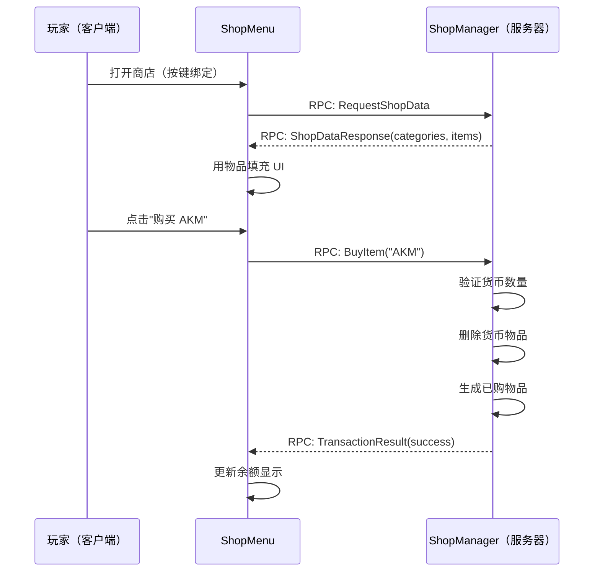

# 第 8.12 章：构建交易系统

[首页](../../README.md) | [<< 上一章：创建自定义服装](11-clothing-mod.md) | **构建交易系统** | [下一章：诊断菜单 >>](13-diag-menu.md)

---

> **摘要：** 构建一个完整的无 NPC 商店系统：JSON 配置、服务器验证的买卖、分类 UI、基于货币的交易。这是本维基中最复杂的教程 —— 涵盖数据建模、RPC 往返、物品栏操作和反作弊原则。

---

## 目录

- [我们要构建什么](#what-we-are-building)
- [步骤 1：数据模型（3_Game）](#step-1-data-model-3_game)
- [步骤 2：RPC 常量（3_Game）](#step-2-rpc-constants-3_game)
- [步骤 3：服务端商店管理器（4_World）](#step-3-server-side-shop-manager-4_world)
- [步骤 4：客户端商店 UI（5_Mission）](#step-4-client-side-shop-ui-5_mission)
- [步骤 5：布局文件](#step-5-layout-file)
- [步骤 6：Mission 挂钩和按键绑定](#step-6-mission-hook-and-keybind)
- [步骤 7：货币物品](#step-7-currency-item)
- [步骤 8：商店配置 JSON](#step-8-shop-config-json)
- [步骤 9：构建和测试](#step-9-build-and-test)
- [安全注意事项](#security-considerations)
- [完整代码参考](#complete-code-reference)
- [最佳实践 / 常见错误 / 学到了什么](#best-practices)

---

## 我们要构建什么

玩家按 F6 打开商店菜单，按类别（武器、食物、医疗）浏览物品，并使用货币物品进行买卖。服务器验证每笔交易 —— 客户端永远不会决定价格或生成物品。



```
客户端                                 服务器
1. 按 F6 --> REQUEST_SHOP_DATA ->     2. 加载配置，统计货币
                                         SHOP_DATA_RESPONSE ->
3. 显示类别和物品
   点击购买 --> BUY_ITEM (cls,qty) -> 4. 验证、移除货币、生成物品
                                         TRANSACTION_RESULT ->
5. 显示结果，更新余额
```

**关键规则：** 客户端仅发送 `(className, quantity)`。服务器查找价格。

### Mod 结构

```
ShopDemo/
    mod.cpp
    GUI/layouts/shop_menu.layout
    Scripts/config.cpp
        3_Game/ShopDemo/  ShopDemoRPC.c  ShopDemoData.c
        4_World/ShopDemo/ ShopDemoManager.c
        5_Mission/ShopDemo/ ShopDemoMenu.c  ShopDemoMission.c
```

---

## 步骤 1：数据模型（3_Game）

### `Scripts/3_Game/ShopDemo/ShopDemoData.c`

```c
class ShopItem
{
    string ClassName;
    string DisplayName;
    int BuyPrice;
    int SellPrice;
    void ShopItem() { ClassName = ""; DisplayName = ""; BuyPrice = 0; SellPrice = 0; }
};

class ShopCategory
{
    string Name;
    ref array<ref ShopItem> Items;
    void ShopCategory() { Name = ""; Items = new array<ref ShopItem>; }
};

class ShopConfig
{
    string CurrencyClassName;
    ref array<ref ShopCategory> Categories;
    void ShopConfig() { CurrencyClassName = "GoldCoin"; Categories = new array<ref ShopCategory>; }
};
```

始终保持 `SellPrice < BuyPrice` 以防止无限刷钱循环。

---

## 步骤 2：RPC 常量（3_Game）

### `Scripts/3_Game/ShopDemo/ShopDemoRPC.c`

```c
class ShopDemoRPC
{
    static const int REQUEST_SHOP_DATA   = 79101;  // 客户端 -> 服务器
    static const int BUY_ITEM            = 79102;
    static const int SELL_ITEM           = 79103;
    static const int SHOP_DATA_RESPONSE  = 79201;  // 服务器 -> 客户端
    static const int TRANSACTION_RESULT  = 79202;
};
```

---

## 步骤 3：服务端商店管理器（4_World）

### `Scripts/4_World/ShopDemo/ShopDemoManager.c`

```c
class ShopDemoManager
{
    private static ref ShopDemoManager s_Instance;
    static ShopDemoManager Get() { if (!s_Instance) s_Instance = new ShopDemoManager(); return s_Instance; }

    protected ref ShopConfig m_Config;
    protected string m_ConfigPath;
    void ShopDemoManager() { m_ConfigPath = "$profile:ShopDemo/ShopConfig.json"; }

    void Init()
    {
        m_Config = new ShopConfig();
        if (FileExist(m_ConfigPath))
        {
            string err;
            if (!JsonFileLoader<ShopConfig>.LoadFile(m_ConfigPath, m_Config, err))
                CreateDefaultConfig();
        }
        else CreateDefaultConfig();
        Print("[ShopDemo] Init: " + m_Config.Categories.Count().ToString() + " categories");
    }

    ShopConfig GetConfig() { return m_Config; }

    protected void CreateDefaultConfig()
    {
        m_Config = new ShopConfig();
        m_Config.CurrencyClassName = "GoldCoin";
        ShopCategory c1 = new ShopCategory(); c1.Name = "Weapons";
        AddItem(c1, "IJ70", "IJ-70 Pistol", 50, 25);
        AddItem(c1, "KA74", "KA-74", 200, 100);
        AddItem(c1, "Mosin9130", "Mosin 91/30", 150, 75);
        m_Config.Categories.Insert(c1);
        ShopCategory c2 = new ShopCategory(); c2.Name = "Food";
        AddItem(c2, "SodaCan_Cola", "Cola", 5, 2);
        AddItem(c2, "TunaCan", "Tuna Can", 8, 4);
        AddItem(c2, "Apple", "Apple", 3, 1);
        m_Config.Categories.Insert(c2);
        ShopCategory c3 = new ShopCategory(); c3.Name = "Medical";
        AddItem(c3, "BandageDressing", "Bandage", 10, 5);
        AddItem(c3, "Morphine", "Morphine", 30, 15);
        AddItem(c3, "SalineBagIV", "Saline Bag IV", 25, 12);
        m_Config.Categories.Insert(c3);
        SaveConfig();
    }

    protected void AddItem(ShopCategory cat, string cls, string disp, int buy, int sell)
    {
        ShopItem si = new ShopItem();
        si.ClassName = cls; si.DisplayName = disp; si.BuyPrice = buy; si.SellPrice = sell;
        cat.Items.Insert(si);
    }

    protected void SaveConfig()
    {
        MakeDirectory("$profile:ShopDemo");
        string err;
        JsonFileLoader<ShopConfig>.SaveFile(m_ConfigPath, m_Config, err);
    }

    int CountPlayerCurrency(PlayerBase player)
    {
        if (!player) return 0;
        int total = 0;
        array<EntityAI> items = new array<EntityAI>;
        player.GetInventory().EnumerateInventory(InventoryTraversalType.PREORDER, items);
        for (int i = 0; i < items.Count(); i++)
        {
            EntityAI ent = items.Get(i);
            if (!ent || ent.GetType() != m_Config.CurrencyClassName) continue;
            ItemBase ib = ItemBase.Cast(ent);
            if (ib && ib.HasQuantity()) total = total + ib.GetQuantity();
            else total = total + 1;
        }
        return total;
    }

    protected bool RemoveCurrency(PlayerBase player, int amount)
    {
        int remaining = amount;
        array<EntityAI> items = new array<EntityAI>;
        player.GetInventory().EnumerateInventory(InventoryTraversalType.PREORDER, items);
        for (int i = 0; i < items.Count(); i++)
        {
            if (remaining <= 0) break;
            EntityAI ent = items.Get(i);
            if (!ent || ent.GetType() != m_Config.CurrencyClassName) continue;
            ItemBase ib = ItemBase.Cast(ent);
            if (!ib) continue;
            if (ib.HasQuantity())
            {
                int qty = ib.GetQuantity();
                if (qty <= remaining) { remaining = remaining - qty; ib.DeleteSafe(); }
                else { ib.SetQuantity(qty - remaining); remaining = 0; }
            }
            else { remaining = remaining - 1; ib.DeleteSafe(); }
        }
        return (remaining <= 0);
    }

    protected bool GiveCurrency(PlayerBase player, int amount)
    {
        EntityAI spawned = player.GetInventory().CreateInInventory(m_Config.CurrencyClassName);
        if (!spawned)
            spawned = EntityAI.Cast(GetGame().CreateObjectEx(m_Config.CurrencyClassName, player.GetPosition(), ECE_PLACE_ON_SURFACE));
        if (!spawned) return false;
        ItemBase ci = ItemBase.Cast(spawned);
        if (ci && ci.HasQuantity()) ci.SetQuantity(amount);
        return true;
    }

    protected ShopItem FindShopItem(string className)
    {
        for (int c = 0; c < m_Config.Categories.Count(); c++)
            for (int i = 0; i < m_Config.Categories.Get(c).Items.Count(); i++)
                if (m_Config.Categories.Get(c).Items.Get(i).ClassName == className)
                    return m_Config.Categories.Get(c).Items.Get(i);
        return null;
    }

    void HandleBuy(PlayerBase player, string className, int quantity)
    {
        PlayerIdentity id = player.GetIdentity();
        if (quantity <= 0 || quantity > 10) { SendResult(player, false, "Invalid quantity.", 0); return; }
        ShopItem si = FindShopItem(className);
        if (!si) { SendResult(player, false, "Item not in shop.", 0); return; }
        int cost = si.BuyPrice * quantity;
        int balance = CountPlayerCurrency(player);
        if (balance < cost) { SendResult(player, false, "Need " + cost.ToString() + ", have " + balance.ToString(), balance); return; }
        if (!RemoveCurrency(player, cost)) { SendResult(player, false, "Currency removal failed.", CountPlayerCurrency(player)); return; }
        for (int i = 0; i < quantity; i++)
        {
            EntityAI sp = player.GetInventory().CreateInInventory(className);
            if (!sp) sp = EntityAI.Cast(GetGame().CreateObjectEx(className, player.GetPosition(), ECE_PLACE_ON_SURFACE));
        }
        int nb = CountPlayerCurrency(player);
        SendResult(player, true, "Bought " + quantity.ToString() + "x " + si.DisplayName + " for " + cost.ToString(), nb);
        Print("[ShopDemo] " + id.GetName() + " bought " + quantity.ToString() + "x " + className);
    }

    void HandleSell(PlayerBase player, string className, int quantity)
    {
        PlayerIdentity id = player.GetIdentity();
        if (quantity <= 0 || quantity > 10) { SendResult(player, false, "Invalid quantity.", 0); return; }
        ShopItem si = FindShopItem(className);
        if (!si || si.SellPrice <= 0) { SendResult(player, false, "Cannot sell this.", 0); return; }
        int removed = 0;
        array<EntityAI> items = new array<EntityAI>;
        player.GetInventory().EnumerateInventory(InventoryTraversalType.PREORDER, items);
        for (int i = 0; i < items.Count(); i++)
        {
            if (removed >= quantity) break;
            EntityAI ent = items.Get(i);
            if (ent && ent.GetType() == className) { ent.DeleteSafe(); removed = removed + 1; }
        }
        if (removed <= 0) { SendResult(player, false, "You don't have that item.", CountPlayerCurrency(player)); return; }
        int payout = si.SellPrice * removed;
        GiveCurrency(player, payout);
        SendResult(player, true, "Sold " + removed.ToString() + "x " + si.DisplayName + " for " + payout.ToString(), CountPlayerCurrency(player));
        Print("[ShopDemo] " + id.GetName() + " sold " + removed.ToString() + "x " + className);
    }

    protected void SendResult(PlayerBase player, bool success, string message, int newBalance)
    {
        if (!player || !player.GetIdentity()) return;
        Param3<bool, string, int> r = new Param3<bool, string, int>(success, message, newBalance);
        GetGame().RPCSingleParam(player, ShopDemoRPC.TRANSACTION_RESULT, r, true, player.GetIdentity());
    }
};

modded class PlayerBase
{
    override void OnRPC(PlayerIdentity sender, int rpc_type, ParamsReadContext ctx)
    {
        super.OnRPC(sender, rpc_type, ctx);
        if (!GetGame().IsServer()) return;
        switch (rpc_type)
        {
            case ShopDemoRPC.REQUEST_SHOP_DATA: OnShopDataReq(sender); break;
            case ShopDemoRPC.BUY_ITEM: OnBuyReq(sender, ctx); break;
            case ShopDemoRPC.SELL_ITEM: OnSellReq(sender, ctx); break;
        }
    }

    protected void OnShopDataReq(PlayerIdentity requestor)
    {
        PlayerBase player = PlayerBase.GetPlayerByUID(requestor.GetId());
        if (!player) return;
        ShopDemoManager mgr = ShopDemoManager.Get();
        ShopConfig cfg = mgr.GetConfig();
        // 序列化："CatName|cls,name,buy,sell;cls2,...\nCat2|..."
        string payload = "";
        for (int c = 0; c < cfg.Categories.Count(); c++)
        {
            ShopCategory cat = cfg.Categories.Get(c);
            if (c > 0) payload = payload + "\n";
            payload = payload + cat.Name + "|";
            for (int i = 0; i < cat.Items.Count(); i++)
            {
                ShopItem si = cat.Items.Get(i);
                if (i > 0) payload = payload + ";";
                payload = payload + si.ClassName + "," + si.DisplayName + "," + si.BuyPrice.ToString() + "," + si.SellPrice.ToString();
            }
        }
        Param2<int, string> data = new Param2<int, string>(mgr.CountPlayerCurrency(player), payload);
        GetGame().RPCSingleParam(player, ShopDemoRPC.SHOP_DATA_RESPONSE, data, true, requestor);
    }

    protected void OnBuyReq(PlayerIdentity sender, ParamsReadContext ctx)
    {
        Param2<string, int> d = new Param2<string, int>("", 0);
        if (!ctx.Read(d)) return;
        PlayerBase p = PlayerBase.GetPlayerByUID(sender.GetId());
        if (p) ShopDemoManager.Get().HandleBuy(p, d.param1, d.param2);
    }

    protected void OnSellReq(PlayerIdentity sender, ParamsReadContext ctx)
    {
        Param2<string, int> d = new Param2<string, int>("", 0);
        if (!ctx.Read(d)) return;
        PlayerBase p = PlayerBase.GetPlayerByUID(sender.GetId());
        if (p) ShopDemoManager.Get().HandleSell(p, d.param1, d.param2);
    }
};

modded class MissionServer
{
    override void OnInit() { super.OnInit(); ShopDemoManager.Get().Init(); }
};
```

**关键决策：** 在生成物品*之前*先移除货币（防止复制）。对网络物品始终使用 `DeleteSafe()`。数量限制在 1-10 之间以防止滥用。

---

## 步骤 4：客户端商店 UI（5_Mission）

### `Scripts/5_Mission/ShopDemo/ShopDemoMenu.c`

```c
class ShopDemoMenu extends ScriptedWidgetEventHandler
{
    protected Widget m_Root, m_CategoryPanel, m_ItemPanel;
    protected TextWidget m_BalanceText, m_DetailName, m_DetailBuyPrice, m_DetailSellPrice, m_StatusText;
    protected ButtonWidget m_BuyButton, m_SellButton, m_CloseButton;
    protected bool m_IsOpen;
    protected int m_Balance;
    protected string m_SelClass;
    protected ref array<string> m_CatNames;
    protected ref array<ref array<ref ShopItem>> m_CatItems;
    protected ref array<Widget> m_DynWidgets;

    void ShopDemoMenu()
    {
        m_IsOpen = false; m_Balance = 0; m_SelClass = "";
        m_CatNames = new array<string>; m_CatItems = new array<ref array<ref ShopItem>>;
        m_DynWidgets = new array<Widget>;
    }
    void ~ShopDemoMenu() { Close(); }

    void Open()
    {
        if (m_IsOpen) return;
        m_Root = GetGame().GetWorkspace().CreateWidgets("ShopDemo/GUI/layouts/shop_menu.layout");
        if (!m_Root) { Print("[ShopDemo] Layout failed!"); return; }
        m_BalanceText     = TextWidget.Cast(m_Root.FindAnyWidget("BalanceText"));
        m_CategoryPanel   = m_Root.FindAnyWidget("CategoryPanel");
        m_ItemPanel       = m_Root.FindAnyWidget("ItemPanel");
        m_DetailName      = TextWidget.Cast(m_Root.FindAnyWidget("DetailName"));
        m_DetailBuyPrice  = TextWidget.Cast(m_Root.FindAnyWidget("DetailBuyPrice"));
        m_DetailSellPrice = TextWidget.Cast(m_Root.FindAnyWidget("DetailSellPrice"));
        m_StatusText      = TextWidget.Cast(m_Root.FindAnyWidget("StatusText"));
        m_BuyButton       = ButtonWidget.Cast(m_Root.FindAnyWidget("BuyButton"));
        m_SellButton      = ButtonWidget.Cast(m_Root.FindAnyWidget("SellButton"));
        m_CloseButton     = ButtonWidget.Cast(m_Root.FindAnyWidget("CloseButton"));
        if (m_BuyButton) m_BuyButton.SetHandler(this);
        if (m_SellButton) m_SellButton.SetHandler(this);
        if (m_CloseButton) m_CloseButton.SetHandler(this);
        m_Root.Show(true); m_IsOpen = true;
        GetGame().GetMission().PlayerControlDisable(INPUT_EXCLUDE_ALL);
        GetGame().GetUIManager().ShowUICursor(true);
        if (m_StatusText) m_StatusText.SetText("Loading...");
        Man player = GetGame().GetPlayer();
        if (player) { Param1<bool> p = new Param1<bool>(true); GetGame().RPCSingleParam(player, ShopDemoRPC.REQUEST_SHOP_DATA, p, true); }
    }

    void Close()
    {
        if (!m_IsOpen) return;
        for (int i = 0; i < m_DynWidgets.Count(); i++) if (m_DynWidgets.Get(i)) m_DynWidgets.Get(i).Unlink();
        m_DynWidgets.Clear();
        if (m_Root) { m_Root.Unlink(); m_Root = null; }
        m_IsOpen = false;
        GetGame().GetMission().PlayerControlEnable(true);
        GetGame().GetUIManager().ShowUICursor(false);
    }

    bool IsOpen() { return m_IsOpen; }
    void Toggle() { if (m_IsOpen) Close(); else Open(); }

    void OnShopDataReceived(int balance, string payload)
    {
        m_Balance = balance;
        if (m_BalanceText) m_BalanceText.SetText("Balance: " + balance.ToString());
        m_CatNames.Clear(); m_CatItems.Clear();
        TStringArray lines = new TStringArray;
        payload.Split("\n", lines);
        for (int c = 0; c < lines.Count(); c++)
        {
            string line = lines.Get(c);
            int pp = line.IndexOf("|");
            if (pp < 0) continue;
            m_CatNames.Insert(line.Substring(0, pp));
            ref array<ref ShopItem> ci = new array<ref ShopItem>;
            TStringArray iStrs = new TStringArray;
            line.Substring(pp + 1, line.Length() - pp - 1).Split(";", iStrs);
            for (int i = 0; i < iStrs.Count(); i++)
            {
                TStringArray parts = new TStringArray;
                iStrs.Get(i).Split(",", parts);
                if (parts.Count() < 4) continue;
                ShopItem si = new ShopItem();
                si.ClassName = parts.Get(0); si.DisplayName = parts.Get(1);
                si.BuyPrice = parts.Get(2).ToInt(); si.SellPrice = parts.Get(3).ToInt();
                ci.Insert(si);
            }
            m_CatItems.Insert(ci);
        }
        // 构建类别按钮
        if (m_CategoryPanel)
        {
            for (int b = 0; b < m_CatNames.Count(); b++)
            {
                ButtonWidget btn = ButtonWidget.Cast(GetGame().GetWorkspace().CreateWidget(WidgetType.ButtonWidgetTypeID, 0, b*0.12, 1, 0.10, WidgetFlags.VISIBLE, ARGB(255,60,60,60), 0, m_CategoryPanel));
                if (btn) { btn.SetText(m_CatNames.Get(b)); btn.SetHandler(this); btn.SetName("CatBtn_"+b.ToString()); m_DynWidgets.Insert(btn); }
            }
        }
        if (m_CatNames.Count() > 0) SelectCategory(0);
        if (m_StatusText) m_StatusText.SetText("");
    }

    void SelectCategory(int idx)
    {
        if (idx < 0 || idx >= m_CatItems.Count()) return;
        for (int r = m_DynWidgets.Count()-1; r >= 0; r--)
        { Widget w = m_DynWidgets.Get(r); if (w && w.GetName().IndexOf("ItemBtn_")==0) { w.Unlink(); m_DynWidgets.Remove(r); } }
        array<ref ShopItem> items = m_CatItems.Get(idx);
        for (int j = 0; j < items.Count(); j++)
        {
            ShopItem si = items.Get(j);
            ButtonWidget ib = ButtonWidget.Cast(GetGame().GetWorkspace().CreateWidget(WidgetType.ButtonWidgetTypeID, 0, j*0.08, 1, 0.07, WidgetFlags.VISIBLE, ARGB(255,45,45,50), 0, m_ItemPanel));
            if (ib) { ib.SetText(si.DisplayName+" [B:"+si.BuyPrice.ToString()+" S:"+si.SellPrice.ToString()+"]"); ib.SetHandler(this); ib.SetName("ItemBtn_"+si.ClassName); m_DynWidgets.Insert(ib); }
        }
        m_SelClass = "";
        if (m_DetailName) m_DetailName.SetText("Select an item");
    }

    override bool OnClick(Widget w, int x, int y, int button)
    {
        if (w == m_CloseButton) { Close(); return true; }
        if (w == m_BuyButton) { DoBuySell(ShopDemoRPC.BUY_ITEM); return true; }
        if (w == m_SellButton) { DoBuySell(ShopDemoRPC.SELL_ITEM); return true; }
        string wn = w.GetName();
        if (wn.IndexOf("CatBtn_")==0) { SelectCategory(wn.Substring(7,wn.Length()-7).ToInt()); return true; }
        if (wn.IndexOf("ItemBtn_")==0) { SelectItem(wn.Substring(8,wn.Length()-8)); return true; }
        return false;
    }

    void SelectItem(string cls)
    {
        for (int c = 0; c < m_CatItems.Count(); c++)
            for (int i = 0; i < m_CatItems.Get(c).Count(); i++)
            {
                ShopItem si = m_CatItems.Get(c).Get(i);
                if (si.ClassName == cls) {
                    m_SelClass = cls;
                    if (m_DetailName) m_DetailName.SetText(si.DisplayName);
                    if (m_DetailBuyPrice) m_DetailBuyPrice.SetText("Buy: " + si.BuyPrice.ToString());
                    if (m_DetailSellPrice) m_DetailSellPrice.SetText("Sell: " + si.SellPrice.ToString());
                    return;
                }
            }
    }

    protected void DoBuySell(int rpcId)
    {
        if (m_SelClass == "") { if (m_StatusText) m_StatusText.SetText("Select an item first."); return; }
        Man player = GetGame().GetPlayer();
        if (!player) return;
        Param2<string, int> d = new Param2<string, int>(m_SelClass, 1);
        GetGame().RPCSingleParam(player, rpcId, d, true);
        if (m_StatusText) m_StatusText.SetText("Processing...");
    }

    void OnTransactionResult(bool success, string message, int newBalance)
    {
        m_Balance = newBalance;
        if (m_BalanceText) m_BalanceText.SetText("Balance: " + newBalance.ToString());
        if (m_StatusText) m_StatusText.SetText(message);
    }
};
```

---

## 步骤 5：布局文件

### `GUI/layouts/shop_menu.layout`

三列布局：类别（左侧 20%）、物品（中间 46%）、详情（右侧 26%）。

```
FrameWidgetClass ShopMenuRoot {
 size 0.7 0.7 position 0.15 0.15 hexactpos 0 vexactpos 0 hexactsize 0 vexactsize 0
 {
  ImageWidgetClass Background { size 1 1 position 0 0 hexactpos 0 vexactpos 0 hexactsize 0 vexactsize 0 color 0.08 0.08 0.1 0.92 }
  TextWidgetClass ShopTitle { size 0.5 0.06 position 0.02 0.02 hexactpos 0 vexactpos 0 hexactsize 0 vexactsize 0 text "Shop" "text halign" left "text valign" center color 1 0.85 0.3 1 font "gui/fonts/MetronBook" }
  TextWidgetClass BalanceText { size 0.35 0.06 position 0.63 0.02 hexactpos 0 vexactpos 0 hexactsize 0 vexactsize 0 text "Balance: --" "text halign" right "text valign" center color 0.3 1 0.3 1 font "gui/fonts/MetronBook" }
  FrameWidgetClass CategoryPanel { size 0.2 0.82 position 0.02 0.1 hexactpos 0 vexactpos 0 hexactsize 0 vexactsize 0
   { ImageWidgetClass CatBg { size 1 1 position 0 0 hexactpos 0 vexactpos 0 hexactsize 0 vexactsize 0 color 0.12 0.12 0.14 0.8 } }
  }
  FrameWidgetClass ItemPanel { size 0.46 0.82 position 0.24 0.1 hexactpos 0 vexactpos 0 hexactsize 0 vexactsize 0
   { ImageWidgetClass ItemBg { size 1 1 position 0 0 hexactpos 0 vexactpos 0 hexactsize 0 vexactsize 0 color 0.1 0.1 0.12 0.8 } }
  }
  FrameWidgetClass DetailPanel { size 0.26 0.82 position 0.72 0.1 hexactpos 0 vexactpos 0 hexactsize 0 vexactsize 0
   {
    ImageWidgetClass DetailBg { size 1 1 position 0 0 hexactpos 0 vexactpos 0 hexactsize 0 vexactsize 0 color 0.12 0.12 0.14 0.8 }
    TextWidgetClass DetailName { size 0.9 0.08 position 0.05 0.05 hexactpos 0 vexactpos 0 hexactsize 0 vexactsize 0 text "Select an item" "text halign" center "text valign" center color 1 1 1 1 font "gui/fonts/MetronBook" }
    TextWidgetClass DetailBuyPrice { size 0.9 0.06 position 0.05 0.16 hexactpos 0 vexactpos 0 hexactsize 0 vexactsize 0 text "Buy: --" "text halign" left "text valign" center color 0.3 1 0.3 1 font "gui/fonts/MetronBook" }
    TextWidgetClass DetailSellPrice { size 0.9 0.06 position 0.05 0.24 hexactpos 0 vexactpos 0 hexactsize 0 vexactsize 0 text "Sell: --" "text halign" left "text valign" center color 1 0.85 0.3 1 font "gui/fonts/MetronBook" }
    ButtonWidgetClass BuyButton { size 0.8 0.08 position 0.1 0.5 hexactpos 0 vexactpos 0 hexactsize 0 vexactsize 0 text "Buy" "text halign" center "text valign" center color 0.2 0.7 0.2 1.0 }
    ButtonWidgetClass SellButton { size 0.8 0.08 position 0.1 0.62 hexactpos 0 vexactpos 0 hexactsize 0 vexactsize 0 text "Sell" "text halign" center "text valign" center color 0.8 0.6 0.1 1.0 }
    TextWidgetClass StatusText { size 0.9 0.06 position 0.05 0.82 hexactpos 0 vexactpos 0 hexactsize 0 vexactsize 0 text "" "text halign" center "text valign" center color 0.9 0.9 0.9 1 font "gui/fonts/MetronBook" }
   }
  }
  ButtonWidgetClass CloseButton { size 0.05 0.04 position 0.935 0.015 hexactpos 0 vexactpos 0 hexactsize 0 vexactsize 0 text "X" "text halign" center "text valign" center color 1.0 0.3 0.3 1.0 }
 }
}
```

---

## 步骤 6：Mission 挂钩和按键绑定

### `Scripts/5_Mission/ShopDemo/ShopDemoMission.c`

```c
modded class MissionGameplay
{
    protected ref ShopDemoMenu m_ShopDemoMenu;

    override void OnInit() { super.OnInit(); m_ShopDemoMenu = new ShopDemoMenu(); }

    override void OnMissionFinish()
    {
        if (m_ShopDemoMenu) { m_ShopDemoMenu.Close(); m_ShopDemoMenu = null; }
        super.OnMissionFinish();
    }

    override void OnKeyPress(int key)
    {
        super.OnKeyPress(key);
        if (key == KeyCode.KC_F6 && m_ShopDemoMenu) m_ShopDemoMenu.Toggle();
    }

    override void OnRPC(PlayerIdentity sender, Object target, int rpc_type, ParamsReadContext ctx)
    {
        super.OnRPC(sender, target, rpc_type, ctx);
        if (rpc_type == ShopDemoRPC.SHOP_DATA_RESPONSE)
        {
            Param2<int, string> d = new Param2<int, string>(0, "");
            if (ctx.Read(d) && m_ShopDemoMenu) m_ShopDemoMenu.OnShopDataReceived(d.param1, d.param2);
        }
        if (rpc_type == ShopDemoRPC.TRANSACTION_RESULT)
        {
            Param3<bool, string, int> r = new Param3<bool, string, int>(false, "", 0);
            if (ctx.Read(r) && m_ShopDemoMenu) m_ShopDemoMenu.OnTransactionResult(r.param1, r.param2, r.param3);
        }
    }
};
```

对于正式发布的 mod，请使用 `inputs.xml` 以便玩家可以重新映射按键：

```xml
<?xml version="1.0" encoding="UTF-8"?>
<modded>
 <inputs><actions>
  <input name="UAShopToggle" loc="Toggle Shop" type="button" default="Keyboard:KC_F6" group="modded" />
 </actions></inputs>
</modded>
```

---

## 步骤 7：货币物品

你可以使用任何现有物品 —— 在 JSON 中将 `CurrencyClassName` 设置为 `"Rag"`，抹布就变成了货币。若要创建自定义金币，请参见[第 8.2 章：自定义物品](02-custom-item.md)。

---

## 步骤 8：商店配置 JSON

首次服务器启动时自动生成在 `$profile:ShopDemo/ShopConfig.json`。编辑价格、添加类别/物品，重启服务器即可。始终保持 `SellPrice < BuyPrice`。

---

## 步骤 9：构建和测试

1. 将 `ShopDemo/` 打包为 PBO，添加到服务器+客户端的 `@ShopDemo/addons/`，添加 `-mod=@ShopDemo`
2. 生成货币，按 F6，浏览、买卖
3. 检查服务器日志中的 `[ShopDemo]` 行

| 测试用例 | 预期结果 |
|-----------|----------|
| 无货币时购买 | "Need X, have 0" |
| 购买未知类名（被黑） | "Item not in shop" |
| 出售未拥有的物品 | "You don't have that item" |
| 物品栏已满时购买 | 物品掉落在地上 |

---

## 安全注意事项

1. **永远不要信任客户端发送的价格。** 客户端仅发送 `(className, qty)`。服务器决定价格。
2. **先删除再生成。** 先移除货币，然后再创建物品。防止复制。
3. **验证物品存在。** 在给予出售货币之前确认物品在物品栏中。
4. **记录一切。** 为每笔交易打印玩家名称、物品和数量。
5. **数量限制。** 拒绝 `qty <= 0` 或 `qty > 10`。
6. **频率限制** —— 在生产环境中：每个玩家每次交易 500 毫秒冷却。

---

## 完整代码参考

| 文件 | 层级 | 用途 |
|------|-------|---------|
| `ShopDemoRPC.c` | 3_Game | RPC ID 常量 |
| `ShopDemoData.c` | 3_Game | 数据类：ShopItem、ShopCategory、ShopConfig |
| `ShopDemoManager.c` | 4_World | 服务器：配置、买卖逻辑、物品栏操作、RPC 处理 |
| `ShopDemoMenu.c` | 5_Mission | 客户端：UI、动态控件、RPC 收发 |
| `ShopDemoMission.c` | 5_Mission | Mission 挂钩：初始化、按键绑定、RPC 路由 |
| `shop_menu.layout` | GUI | 三栏布局 |

---

## 最佳实践

- **服务器是唯一的真相来源。** 客户端只是一个显示终端。
- **使用 `DeleteSafe()` 而不是 `Delete()`。** 处理网络同步和锁定栏位。
- **数据类放在 3_Game。** 对 4_World 和 5_Mission 都可见。
- **重写方法中始终调用 `super`。** 中断调用链会破坏其他 mod。
- **清理动态控件。** 每个 `CreateWidget` 在关闭时都需要 `Unlink`。

## 理论与实践

| 概念 | 理论 | 现实 |
|---------|--------|---------|
| `JsonFileLoader.LoadFile()` | 干净地加载 | 尾部逗号会导致静默失败。在外部验证 JSON。 |
| 字符串 RPC 序列化 | 简单 | 500+ 物品可能达到大小限制。大型商店请分页。 |
| `CreateInInventory()` | 总是成功 | 物品栏已满时返回 null。始终检查。 |
| 监听服务器测试 | 快速迭代 | 隐藏网络 bug。在专用服务器上测试。 |

## 学到了什么

- 使用 `JsonFileLoader<T>` 加载 JSON 配置并自动生成默认值
- 服务端游戏管理器的单例模式
- 物品栏枚举、计数、删除（`DeleteSafe`）和生成
- 通过 RPC 对复杂数据（类别、物品、价格）进行字符串序列化
- 数据驱动 UI 的动态控件创建
- 服务器权威的完整买卖交易流程
- 多人游戏经济系统的安全原则

## 常见错误

| 错误 | 修复方法 |
|---------|-----|
| 客户端发送价格 | 仅发送 `(className, qty)`。服务器决定价格。 |
| 先生成再扣款 | 先移除货币，再创建物品。 |
| 跳过 `super.OnRPC()` | 始终调用 super —— 其他 mod 需要调用链。 |
| 对网络物品使用 `Delete()` | 使用 `DeleteSafe()`。 |
| 忽略 `CreateInInventory` 返回值 | 检查是否为 null，回退到地面生成。 |
| 在 else-if 中重新声明变量 | 在 if 链之前声明一次（Enforce Script 规则）。 |

---

**上一章：** [第 8.11 章：服装 Mod](11-clothing-mod.md)
