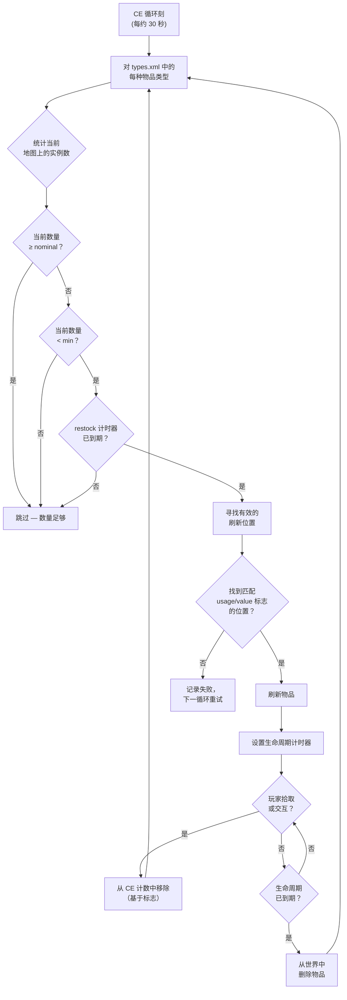

# Chapter 9.4: 战利品经济深入解析

[首页](../README.md) | [<< 上一章: serverDZ.cfg 参考](03-server-cfg.md) | **战利品经济深入解析**

---

> **摘要:** 中央经济系统（CE）控制着 DayZ 中的每一个物品刷新——从货架上的一罐豆子到军事营房中的 AKM。本章解释完整的刷新循环，用原版服务器文件中的真实示例记录 `types.xml`、`globals.xml`、`events.xml` 和 `cfgspawnabletypes.xml` 中的每个字段，并涵盖最常见的经济配置错误。

---

## 目录

- [中央经济系统的工作原理](#中央经济系统的工作原理)
- [刷新循环](#刷新循环)
- [types.xml -- 物品刷新定义](#typesxml----物品刷新定义)
- [真实 types.xml 示例](#真实-typesxml-示例)
- [types.xml 字段参考](#typesxml-字段参考)
- [globals.xml -- 经济参数](#globalsxml----经济参数)
- [events.xml -- 动态事件](#eventsxml----动态事件)
- [cfgspawnabletypes.xml -- 配件和货物](#cfgspawnabletypesxml----配件和货物)
- [nominal/restock 的关系](#nominalrestock-的关系)
- [常见经济配置错误](#常见经济配置错误)

---

## 中央经济系统的工作原理

中央经济系统（CE）是一个在服务器端持续循环运行的系统。它的工作是将世界中的物品数量维持在配置文件中定义的水平。

CE **不会**在玩家进入建筑物时放置物品。相反，它在全局定时器上运行，在整张地图上刷新物品，无论玩家是否在附近。物品有一个**生命周期**——当该计时器到期且没有玩家与该物品交互时，CE 会移除它。然后在下一个循环中，它检测到数量低于目标并在其他位置刷新替代品。

关键概念：

- **Nominal** -- 地图上应存在的某物品副本的目标数量
- **Min** -- 低于此阈值时，CE 将尝试重新刷新该物品
- **Lifetime** -- 未被触碰的物品在被清理前持续存在的时间（秒）
- **Restock** -- CE 在物品被拿走/销毁后重新刷新的最短等待时间（秒）
- **Flags** -- 哪些情况计入总数（在地图上、在容器中、在玩家背包中、在藏匿点中）

---

## 刷新循环



简而言之：CE 统计每种物品的现有数量，与 nominal/min 目标进行比较，当数量降至 `min` 以下且 `restock` 计时器已过时刷新替代品。

---

## types.xml -- 物品刷新定义

这是最重要的经济文件。每个可以在世界中刷新的物品都需要在此有一个条目。切尔诺鲁斯的原版 `types.xml` 大约有 23,000 行，涵盖数千种物品。

### 真实 types.xml 示例

**武器 -- AKM**

```xml
<type name="AKM">
    <nominal>3</nominal>
    <lifetime>7200</lifetime>
    <restock>3600</restock>
    <min>2</min>
    <quantmin>30</quantmin>
    <quantmax>80</quantmax>
    <cost>100</cost>
    <flags count_in_cargo="0" count_in_hoarder="0" count_in_map="1" count_in_player="0" crafted="0" deloot="0"/>
    <category name="weapons"/>
    <usage name="Military"/>
    <value name="Tier4"/>
</type>
```

AKM 是一把稀有的高阶武器。地图上同时只能存在 3 把（`nominal`）。它在 Tier 4（西北部）区域的军事建筑中刷新。当玩家拾取一把后，CE 检测到地图数量降至 `min=2` 以下，将在至少 3600 秒（1 小时）后刷新替代品。武器刷新时内部弹匣装填 30-80% 的弹药（`quantmin`/`quantmax`）。

**食物 -- BakedBeansCan**

```xml
<type name="BakedBeansCan">
    <nominal>15</nominal>
    <lifetime>14400</lifetime>
    <restock>0</restock>
    <min>12</min>
    <quantmin>-1</quantmin>
    <quantmax>-1</quantmax>
    <cost>100</cost>
    <flags count_in_cargo="0" count_in_hoarder="0" count_in_map="1" count_in_player="0" crafted="0" deloot="0"/>
    <category name="food"/>
    <tag name="shelves"/>
    <usage name="Town"/>
    <usage name="Village"/>
    <value name="Tier1"/>
    <value name="Tier2"/>
    <value name="Tier3"/>
</type>
```

烤豆罐头是常见的食物。任何时候都应有 15 罐存在。它们在 Tier 1-3（海岸到地图中部）的城镇和村庄建筑的货架上刷新。`restock=0` 表示可立即重新刷新。`quantmin=-1` 和 `quantmax=-1` 表示该物品不使用数量系统（它不是液体或弹药容器）。

**服装 -- RidersJacket_Black**

```xml
<type name="RidersJacket_Black">
    <nominal>14</nominal>
    <lifetime>28800</lifetime>
    <restock>0</restock>
    <min>10</min>
    <quantmin>-1</quantmin>
    <quantmax>-1</quantmax>
    <cost>100</cost>
    <flags count_in_cargo="0" count_in_hoarder="0" count_in_map="1" count_in_player="0" crafted="0" deloot="0"/>
    <category name="clothes"/>
    <usage name="Town"/>
    <value name="Tier1"/>
    <value name="Tier2"/>
</type>
```

一件常见的平民夹克。地图上 14 件，在海岸附近（Tier 1-2）的城镇建筑中刷新。28800 秒（8 小时）的生命周期意味着如果没人拾取，它会持续存在很长时间。

**医疗 -- BandageDressing**

```xml
<type name="BandageDressing">
    <nominal>40</nominal>
    <lifetime>14400</lifetime>
    <restock>0</restock>
    <min>30</min>
    <quantmin>-1</quantmin>
    <quantmax>-1</quantmax>
    <cost>100</cost>
    <flags count_in_cargo="0" count_in_hoarder="0" count_in_map="1" count_in_player="0" crafted="0" deloot="0"/>
    <category name="tools"/>
    <tag name="shelves"/>
    <usage name="Medic"/>
</type>
```

绷带非常常见（nominal 为 40）。它们在所有 Tier 的医疗建筑（医院、诊所）中刷新（没有 `<value>` 标签意味着所有 Tier）。注意类别是 `"tools"` 而不是 `"medical"` -- DayZ 没有医疗类别；医疗物品使用工具类别。

**禁用物品（手工制作变体）**

```xml
<type name="AK101_Black">
    <nominal>0</nominal>
    <lifetime>28800</lifetime>
    <restock>0</restock>
    <min>0</min>
    <quantmin>-1</quantmin>
    <quantmax>-1</quantmax>
    <cost>100</cost>
    <flags count_in_cargo="0" count_in_hoarder="0" count_in_map="1" count_in_player="0" crafted="1" deloot="0"/>
    <category name="weapons"/>
</type>
```

`nominal=0` 和 `min=0` 表示 CE 永远不会刷新此物品。`crafted=1` 表示它只能通过制作获得（给武器上漆）。它仍然有生命周期，以便持久化的实例最终会被清理。

---

## types.xml 字段参考

### 核心字段

| 字段 | 类型 | 范围 | 描述 |
|------|------|------|------|
| `name` | string | -- | 物品的类名。必须与游戏的类名完全匹配。 |
| `nominal` | int | 0+ | 地图上该物品的目标数量。设为 0 可阻止刷新。 |
| `min` | int | 0+ | 当数量降至此值或以下时，CE 将尝试刷新更多。 |
| `lifetime` | int | 秒 | 未被触碰的物品在 CE 删除前存在的时间。 |
| `restock` | int | 秒 | CE 刷新替代品之前的最短冷却时间。0 = 立即。 |
| `quantmin` | int | -1 到 100 | 刷新时的最低数量百分比（弹药%、液体%）。-1 = 不适用。 |
| `quantmax` | int | -1 到 100 | 刷新时的最高数量百分比。-1 = 不适用。 |
| `cost` | int | 0+ | 刷新选择的优先级权重。目前所有原版物品都使用 100。 |

### 标志

```xml
<flags count_in_cargo="0" count_in_hoarder="0" count_in_map="1" count_in_player="0" crafted="0" deloot="0"/>
```

| 标志 | 值 | 描述 |
|------|------|------|
| `count_in_map` | 0, 1 | 统计地面上或建筑物刷新点中的物品。**几乎总是 1。** |
| `count_in_cargo` | 0, 1 | 统计其他容器（背包、帐篷）内的物品。 |
| `count_in_hoarder` | 0, 1 | 统计藏匿点、桶、埋藏容器、帐篷中的物品。 |
| `count_in_player` | 0, 1 | 统计玩家背包中（身上或手中）的物品。 |
| `crafted` | 0, 1 | 设为 1 时，此物品只能通过制作获得，不通过 CE 刷新。 |
| `deloot` | 0, 1 | 动态事件战利品。设为 1 时，物品仅在动态事件位置（直升机坠毁等）刷新。 |

**标志策略很重要。** 如果 `count_in_player=1`，每把玩家携带的 AKM 都计入 nominal。这意味着拾取 AKM 不会触发重新刷新，因为计数没有变化。大多数原版物品使用 `count_in_player=0`，这样玩家持有的物品不会阻止重新刷新。

### 标签

| 元素 | 用途 | 定义位置 |
|------|------|----------|
| `<category name="..."/>` | 用于刷新点匹配的物品类别 | `cfglimitsdefinition.xml` |
| `<usage name="..."/>` | 此物品可以刷新的建筑类型 | `cfglimitsdefinition.xml` |
| `<value name="..."/>` | 此物品可以刷新的地图等级区域 | `cfglimitsdefinition.xml` |
| `<tag name="..."/>` | 建筑内的刷新位置类型 | `cfglimitsdefinition.xml` |

**有效的类别：** `tools`, `containers`, `clothes`, `food`, `weapons`, `books`, `explosives`, `lootdispatch`

**有效的 usage 标志：** `Military`, `Police`, `Medic`, `Firefighter`, `Industrial`, `Farm`, `Coast`, `Town`, `Village`, `Hunting`, `Office`, `School`, `Prison`, `Lunapark`, `SeasonalEvent`, `ContaminatedArea`, `Historical`

**有效的 value 标志：** `Tier1`, `Tier2`, `Tier3`, `Tier4`, `Unique`

**有效的 tag：** `floor`, `shelves`, `ground`

一个物品可以有**多个** `<usage>` 和 `<value>` 标签。多个 usage 表示它可以在这些建筑类型中的任何一种中刷新。多个 value 表示它可以在这些等级中的任何一个中刷新。

如果完全省略 `<value>`，该物品在**所有**等级中刷新。如果省略 `<usage>`，该物品没有有效的刷新位置，**不会刷新**。

---

## globals.xml -- 经济参数

此文件控制全局 CE 行为。原版文件中的所有参数：

```xml
<variables>
    <var name="AnimalMaxCount" type="0" value="200"/>
    <var name="CleanupAvoidance" type="0" value="100"/>
    <var name="CleanupLifetimeDeadAnimal" type="0" value="1200"/>
    <var name="CleanupLifetimeDeadInfected" type="0" value="330"/>
    <var name="CleanupLifetimeDeadPlayer" type="0" value="3600"/>
    <var name="CleanupLifetimeDefault" type="0" value="45"/>
    <var name="CleanupLifetimeLimit" type="0" value="50"/>
    <var name="CleanupLifetimeRuined" type="0" value="330"/>
    <var name="FlagRefreshFrequency" type="0" value="432000"/>
    <var name="FlagRefreshMaxDuration" type="0" value="3456000"/>
    <var name="FoodDecay" type="0" value="1"/>
    <var name="IdleModeCountdown" type="0" value="60"/>
    <var name="IdleModeStartup" type="0" value="1"/>
    <var name="InitialSpawn" type="0" value="100"/>
    <var name="LootDamageMax" type="1" value="0.82"/>
    <var name="LootDamageMin" type="1" value="0.0"/>
    <var name="LootProxyPlacement" type="0" value="1"/>
    <var name="LootSpawnAvoidance" type="0" value="100"/>
    <var name="RespawnAttempt" type="0" value="2"/>
    <var name="RespawnLimit" type="0" value="20"/>
    <var name="RespawnTypes" type="0" value="12"/>
    <var name="RestartSpawn" type="0" value="0"/>
    <var name="SpawnInitial" type="0" value="1200"/>
    <var name="TimeHopping" type="0" value="60"/>
    <var name="TimeLogin" type="0" value="15"/>
    <var name="TimeLogout" type="0" value="15"/>
    <var name="TimePenalty" type="0" value="20"/>
    <var name="WorldWetTempUpdate" type="0" value="1"/>
    <var name="ZombieMaxCount" type="0" value="1000"/>
    <var name="ZoneSpawnDist" type="0" value="300"/>
</variables>
```

`type` 属性表示数据类型：`0` = 整数，`1` = 浮点数。

### 完整参数参考

| 参数 | 类型 | 默认值 | 描述 |
|------|------|--------|------|
| **AnimalMaxCount** | int | 200 | 地图上同时存活的动物最大数量。 |
| **CleanupAvoidance** | int | 100 | 距玩家多少米以内 CE 不会清理物品。此半径内的物品不受生命周期到期影响。 |
| **CleanupLifetimeDeadAnimal** | int | 1200 | 死亡动物尸体被移除前的秒数。（20 分钟） |
| **CleanupLifetimeDeadInfected** | int | 330 | 死亡僵尸尸体被移除前的秒数。（5.5 分钟） |
| **CleanupLifetimeDeadPlayer** | int | 3600 | 死亡玩家尸体被移除前的秒数。（1 小时） |
| **CleanupLifetimeDefault** | int | 45 | 没有特定生命周期的物品的默认清理时间（秒）。 |
| **CleanupLifetimeLimit** | int | 50 | 每个清理周期处理的最大物品数量。 |
| **CleanupLifetimeRuined** | int | 330 | 损坏物品被清理前的秒数。（5.5 分钟） |
| **FlagRefreshFrequency** | int | 432000 | 旗帜必须通过交互"刷新"以防止基地衰败的频率，单位为秒。（5 天） |
| **FlagRefreshMaxDuration** | int | 3456000 | 旗帜即使定期刷新也能存在的最大生命周期，单位为秒。（40 天） |
| **FoodDecay** | int | 1 | 启用（1）或禁用（0）食物随时间变质。 |
| **IdleModeCountdown** | int | 60 | 无玩家连接时服务器进入空闲模式前的秒数。 |
| **IdleModeStartup** | int | 1 | 服务器是否以空闲模式（1）或活动模式（0）启动。 |
| **InitialSpawn** | int | 100 | 首次服务器启动时刷新的 nominal 值百分比（0-100）。 |
| **LootDamageMax** | float | 0.82 | 随机刷新战利品的最大损坏状态（0.0 = 完好，1.0 = 毁坏）。 |
| **LootDamageMin** | float | 0.0 | 随机刷新战利品的最小损坏状态。 |
| **LootProxyPlacement** | int | 1 | 启用（1）物品在货架/桌子上的视觉放置，而非随机掉落在地板上。 |
| **LootSpawnAvoidance** | int | 100 | 距玩家多少米以内 CE 不会刷新新战利品。防止物品在玩家面前凭空出现。 |
| **RespawnAttempt** | int | 2 | 每个 CE 循环中每个物品的刷新位置尝试次数。 |
| **RespawnLimit** | int | 20 | 每个循环 CE 重新刷新的最大物品数量。 |
| **RespawnTypes** | int | 12 | 每个重新刷新循环处理的最大不同物品类型数量。 |
| **RestartSpawn** | int | 0 | 设为 1 时，在服务器重启时重新随机化所有战利品位置。设为 0 时，从持久化数据加载。 |
| **SpawnInitial** | int | 1200 | 首次启动时初始经济填充中刷新的物品数量。 |
| **TimeHopping** | int | 60 | 防止玩家重新连接同一服务器的冷却时间（秒）（反跳服）。 |
| **TimeLogin** | int | 15 | 登录倒计时（秒）（连接时的"请等待"计时器）。 |
| **TimeLogout** | int | 15 | 登出倒计时（秒）。玩家在此期间仍留在世界中。 |
| **TimePenalty** | int | 20 | 玩家异常断开连接（Alt+F4）时增加到登出计时器的额外惩罚时间（秒）。 |
| **WorldWetTempUpdate** | int | 1 | 启用（1）或禁用（0）世界温度和湿度模拟更新。 |
| **ZombieMaxCount** | int | 1000 | 地图上同时存活的僵尸最大数量。 |
| **ZoneSpawnDist** | int | 300 | 距玩家多少米时僵尸刷新区域被激活。 |

### 常见调整示例

**更多战利品（PvP 服务器）：**
```xml
<var name="InitialSpawn" type="0" value="100"/>
<var name="RespawnLimit" type="0" value="50"/>
<var name="RespawnTypes" type="0" value="30"/>
<var name="RespawnAttempt" type="0" value="4"/>
```

**更长的尸体存留时间（更多时间搜刮击杀）：**
```xml
<var name="CleanupLifetimeDeadPlayer" type="0" value="7200"/>
```

**更短的基地衰败时间（更快清除废弃基地）：**
```xml
<var name="FlagRefreshFrequency" type="0" value="259200"/>
<var name="FlagRefreshMaxDuration" type="0" value="1728000"/>
```

---

## events.xml -- 动态事件

事件定义需要特殊处理的实体刷新：动物、载具和直升机坠毁。与在建筑内刷新的 `types.xml` 物品不同，事件在 `cfgeventspawns.xml` 中列出的预定义世界位置刷新。

### 真实载具事件示例

```xml
<event name="VehicleCivilianSedan">
    <nominal>8</nominal>
    <min>5</min>
    <max>11</max>
    <lifetime>300</lifetime>
    <restock>0</restock>
    <saferadius>500</saferadius>
    <distanceradius>500</distanceradius>
    <cleanupradius>200</cleanupradius>
    <flags deletable="0" init_random="0" remove_damaged="1"/>
    <position>fixed</position>
    <limit>mixed</limit>
    <active>1</active>
    <children>
        <child lootmax="0" lootmin="0" max="5" min="3" type="CivilianSedan"/>
        <child lootmax="0" lootmin="0" max="5" min="3" type="CivilianSedan_Black"/>
        <child lootmax="0" lootmin="0" max="5" min="3" type="CivilianSedan_Wine"/>
    </children>
</event>
```

### 真实动物事件示例

```xml
<event name="AnimalBear">
    <nominal>0</nominal>
    <min>2</min>
    <max>2</max>
    <lifetime>180</lifetime>
    <restock>0</restock>
    <saferadius>200</saferadius>
    <distanceradius>0</distanceradius>
    <cleanupradius>0</cleanupradius>
    <flags deletable="0" init_random="0" remove_damaged="1"/>
    <position>fixed</position>
    <limit>custom</limit>
    <active>1</active>
    <children>
        <child lootmax="0" lootmin="0" max="1" min="1" type="Animal_UrsusArctos"/>
    </children>
</event>
```

### 事件字段参考

| 字段 | 描述 |
|------|------|
| `name` | 事件标识符。对于 `position="fixed"` 的事件，必须与 `cfgeventspawns.xml` 中的条目匹配。 |
| `nominal` | 地图上活动事件组的目标数量。 |
| `min` | 每个刷新点的最少组成员数。 |
| `max` | 每个刷新点的最多组成员数。 |
| `lifetime` | 事件被清理并重新刷新前的秒数。对于载具，这是重新刷新检查间隔，而不是载具的持久化生命周期。 |
| `restock` | 重新刷新之间的最少秒数。 |
| `saferadius` | 距玩家的最小距离（米），事件才能刷新。 |
| `distanceradius` | 同一事件两个实例之间的最小距离。 |
| `cleanupradius` | 如果任何玩家在此距离内，事件实体不会被清理。 |
| `deletable` | CE 是否可以删除此事件实体（0 = 否）。 |
| `init_random` | 随机化初始位置（0 = 使用固定位置）。 |
| `remove_damaged` | 当实体损坏/毁坏时移除（1 = 是）。 |
| `position` | `"fixed"` = 使用 `cfgeventspawns.xml` 中的位置。`"player"` = 在玩家附近刷新。 |
| `limit` | `"child"` = 按子类型限制。`"mixed"` = 在所有子类型间共享限制。`"custom"` = 特殊行为。 |
| `active` | 1 = 启用，0 = 禁用。 |

### 子项

每个 `<child>` 元素定义一个可以刷新的变体：

| 属性 | 描述 |
|------|------|
| `type` | 要刷新的实体类名。 |
| `min` | 此变体的最小实例数（用于 `limit="child"`）。 |
| `max` | 此变体的最大实例数（用于 `limit="child"`）。 |
| `lootmin` | 在实体内部/上方刷新的最少战利品数量。 |
| `lootmax` | 最多战利品数量。 |

---

## cfgspawnabletypes.xml -- 配件和货物

此文件定义物品刷新时附带的配件、货物和损坏状态。如果没有此处的条目，物品刷新时为空且随机损坏（在 `globals.xml` 的 `LootDamageMin`/`LootDamageMax` 范围内）。

### 带配件的武器 -- AKM

```xml
<type name="AKM">
    <damage min="0.45" max="0.85" />
    <attachments chance="1.00">
        <item name="AK_PlasticBttstck" chance="1.00" />
    </attachments>
    <attachments chance="1.00">
        <item name="AK_PlasticHndgrd" chance="1.00" />
    </attachments>
    <attachments chance="0.50">
        <item name="KashtanOptic" chance="0.30" />
        <item name="PSO11Optic" chance="0.20" />
    </attachments>
    <attachments chance="0.05">
        <item name="AK_Suppressor" chance="1.00" />
    </attachments>
    <attachments chance="0.30">
        <item name="Mag_AKM_30Rnd" chance="1.00" />
    </attachments>
</type>
```

解读此条目：

1. AKM 刷新时损坏度在 45-85% 之间（磨损到严重损坏）
2. **始终**（100%）获得塑料枪托和护木
3. 50% 概率填充瞄准镜插槽——如果填充，30% 概率为 Kashtan，20% 概率为 PSO-11
4. 5% 概率获得消音器
5. 30% 概率获得已装填的弹匣

每个 `<attachments>` 块代表一个配件插槽。块上的 `chance` 是该插槽被填充的概率。每个 `<item>` 上的 `chance` 是相对选择权重——CE 使用这些权重从列表中选取一个物品。

### 带配件的武器 -- M4A1

```xml
<type name="M4A1">
    <damage min="0.45" max="0.85" />
    <attachments chance="1.00">
        <item name="M4_OEBttstck" chance="1.00" />
    </attachments>
    <attachments chance="1.00">
        <item name="M4_PlasticHndgrd" chance="1.00" />
    </attachments>
    <attachments chance="1.00">
        <item name="BUISOptic" chance="0.50" />
        <item name="M4_CarryHandleOptic" chance="1.00" />
    </attachments>
    <attachments chance="0.30">
        <item name="Mag_CMAG_40Rnd" chance="0.15" />
        <item name="Mag_CMAG_10Rnd" chance="0.50" />
        <item name="Mag_CMAG_20Rnd" chance="0.70" />
        <item name="Mag_CMAG_30Rnd" chance="1.00" />
    </attachments>
</type>
```

### 带口袋的背心 -- PlateCarrierVest_Camo

```xml
<type name="PlateCarrierVest_Camo">
    <damage min="0.1" max="0.6" />
    <attachments chance="0.85">
        <item name="PlateCarrierHolster_Camo" chance="1.00" />
    </attachments>
    <attachments chance="0.85">
        <item name="PlateCarrierPouches_Camo" chance="1.00" />
    </attachments>
</type>
```

### 带货物的背包

```xml
<type name="AssaultBag_Ttsko">
    <cargo preset="mixArmy" />
    <cargo preset="mixArmy" />
    <cargo preset="mixArmy" />
</type>
```

`preset` 属性引用 `cfgrandompresets.xml` 中定义的战利品池。每个 `<cargo>` 行是一次抽取——这个背包从 `mixArmy` 池中抽取 3 次。池自身的 `chance` 值决定每次抽取是否实际产出物品。

### 仅囤积物品

```xml
<type name="Barrel_Blue">
    <hoarder />
</type>
<type name="SeaChest">
    <hoarder />
</type>
```

`<hoarder />` 标签将物品标记为可藏匿容器。CE 使用 `types.xml` 中的 `count_in_hoarder` 标志单独计算这些容器内的物品。

### 刷新损坏覆盖

```xml
<type name="BandageDressing">
    <damage min="0.0" max="0.0" />
</type>
```

强制绷带始终以完好状态刷新，覆盖 `globals.xml` 中的全局 `LootDamageMin`/`LootDamageMax`。

---

## nominal/restock 的关系

理解 `nominal`、`min` 和 `restock` 如何协同工作对于调整经济至关重要。

### 计算公式

```
IF (current_count < min) AND (time_since_last_spawn > restock):
    spawn new item (up to nominal)
```

**AKM 示例：**
- `nominal = 3`，`min = 2`，`restock = 3600`
- 服务器启动：CE 在地图上刷新 3 把 AKM
- 玩家拾取 1 把 AKM：地图数量降至 2
- 数量（2）不低于 min（2），所以暂不重新刷新
- 玩家拾取另一把 AKM：地图数量降至 1
- 数量（1）低于 min（2），restock 计时器（3600 秒 = 1 小时）开始
- 1 小时后，CE 刷新 2 把新 AKM 以达到 nominal（3）

**BakedBeansCan 示例：**
- `nominal = 15`，`min = 12`，`restock = 0`
- 玩家吃了一罐：地图数量降至 14
- 数量（14）不低于 min（12），所以不重新刷新
- 又吃了 3 罐：数量降至 11
- 数量（11）低于 min（12），restock 为 0（立即）
- 下一个 CE 循环：刷新 4 罐以达到 nominal（15）

### 关键洞察

- **nominal 和 min 之间的差距**决定了 CE 做出反应前可以"消耗"多少物品。小差距（如 AKM：3/2）意味着 CE 在仅 2 次拾取后就做出反应。大差距意味着更多物品可以离开经济系统后才触发重新刷新。

- **restock = 0** 使重新刷新实际上是即时的（下一个 CE 循环）。高 restock 值制造稀缺性——CE 知道需要刷新更多但必须等待。

- **Lifetime** 独立于 nominal/min。即使 CE 已刷新物品达到 nominal，如果没有人触碰它，物品仍会在生命周期到期时被删除。这创造了物品在地图上不断出现和消失的持续"流转"。

- 玩家拾取后又丢弃（在不同位置）的物品，如果设置了相关标志，仍然被计数。丢在地上的 AKM 仍然计入地图总数，因为 `count_in_map=1`。

---

## 常见经济配置错误

### 物品有 types.xml 条目但不刷新

**按顺序检查：**

1. `nominal` 是否大于 0？
2. 物品是否有至少一个 `<usage>` 标签？（无 usage = 无有效刷新位置）
3. `<usage>` 标签是否在 `cfglimitsdefinition.xml` 中定义？
4. `<value>` 标签（如果有）是否在 `cfglimitsdefinition.xml` 中定义？
5. `<category>` 标签是否有效？
6. 物品是否在 `cfgignorelist.xml` 中列出？（列出的物品被阻止）
7. `crafted` 标志是否设为 1？（手工制作物品永远不会自然刷新）
8. `globals.xml` 中的 `RestartSpawn` 是否设为 0 且存在持久化数据？（旧的持久化数据可能阻止新物品刷新直到清档）

### 物品刷新后立即消失

`lifetime` 值太低。45 秒的生命周期（`CleanupLifetimeDefault`）意味着物品几乎立即被清理。武器应有 7200-28800 秒的生命周期。

### 物品数量过多/过少

同时调整 `nominal` 和 `min`。如果设置 `nominal=100` 但 `min=1`，CE 直到 99 个物品被拿走后才会刷新替代品。如果想要稳定供应，保持 `min` 接近 `nominal`（例如 `nominal=20, min=15`）。

### 物品只在一个区域刷新

检查你的 `<value>` 标签。如果物品只有 `<value name="Tier4"/>`，它只会在切尔诺鲁斯西北军事区域刷新。添加更多 Tier 以将其分布到整张地图：

```xml
<value name="Tier1"/>
<value name="Tier2"/>
<value name="Tier3"/>
<value name="Tier4"/>
```

### Mod 物品不刷新

将 mod 物品添加到 `types.xml` 时：

1. 确保 mod 已加载（在 `-mod=` 参数中列出）
2. 验证类名**完全**正确（区分大小写）
3. 添加物品的 category/usage/value 标签——仅有 `types.xml` 条目是不够的
4. 如果 mod 添加了新的 usage 或 value 标签，请将它们添加到 `cfglimitsdefinitionuser.xml`
5. 检查脚本日志中关于未知类名的警告

### 载具零件不在载具内刷新

载具零件通过 `cfgspawnabletypes.xml` 刷新，而不是 `types.xml`。如果载具刷新时没有轮子或电池，检查该载具在 `cfgspawnabletypes.xml` 中是否有包含适当配件定义的条目。

### 所有战利品都是完好的或所有战利品都是毁坏的

检查 `globals.xml` 中的 `LootDamageMin` 和 `LootDamageMax`。原版值为 `0.0` 和 `0.82`。两个都设为 `0.0` 会让所有物品都完好。两个都设为 `1.0` 会让所有物品都毁坏。同时检查 `cfgspawnabletypes.xml` 中的单物品覆盖。

### 编辑 types.xml 后经济"卡住"

编辑经济文件后，执行以下操作之一：
- 删除 `storage_1/` 进行完全清档并重新开始经济
- 在 `globals.xml` 中将 `RestartSpawn` 设为 `1` 重启一次以重新随机化战利品，然后设回 `0`
- 等待物品生命周期自然到期（可能需要数小时）

---

**上一章：** [serverDZ.cfg 参考](03-server-cfg.md) | [首页](../README.md) | **下一章：** [载具与动态事件刷新](05-vehicle-spawning.md)
